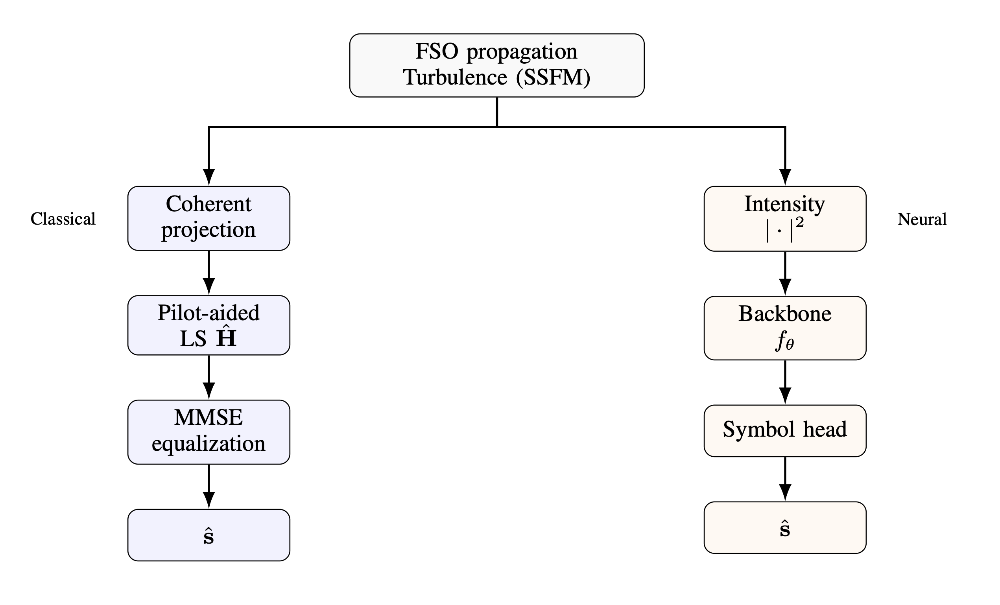
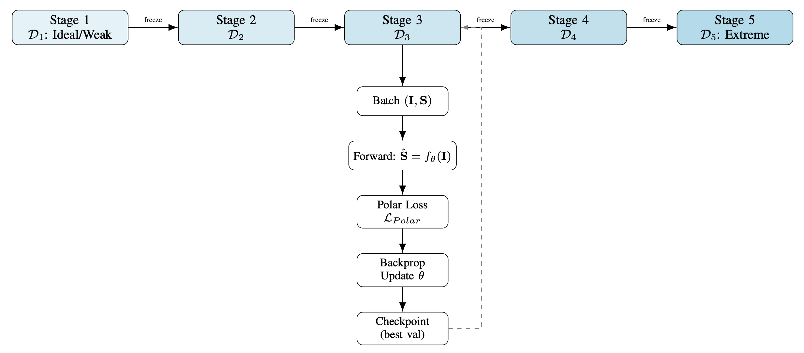
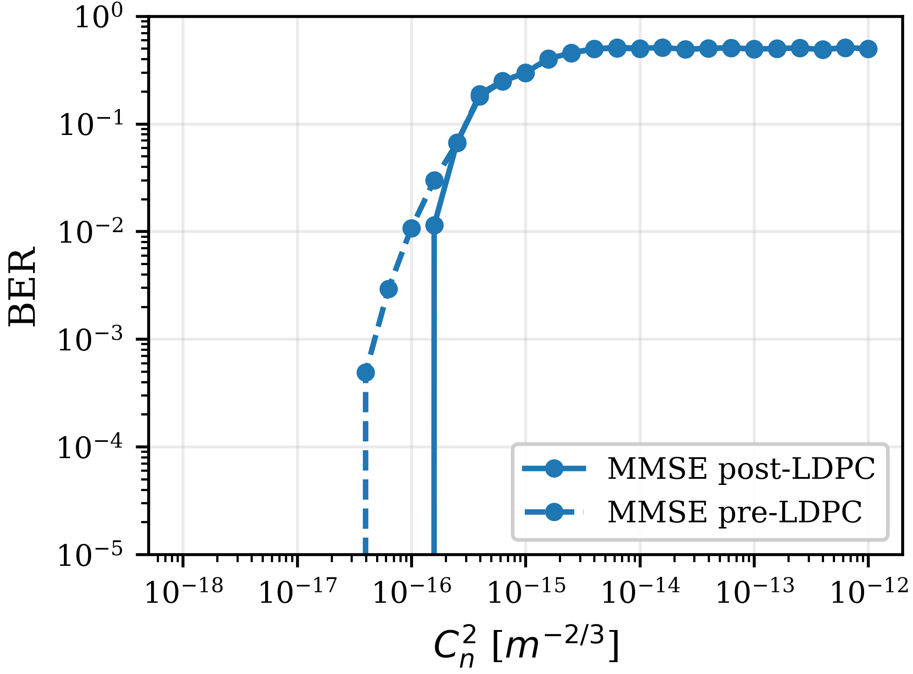
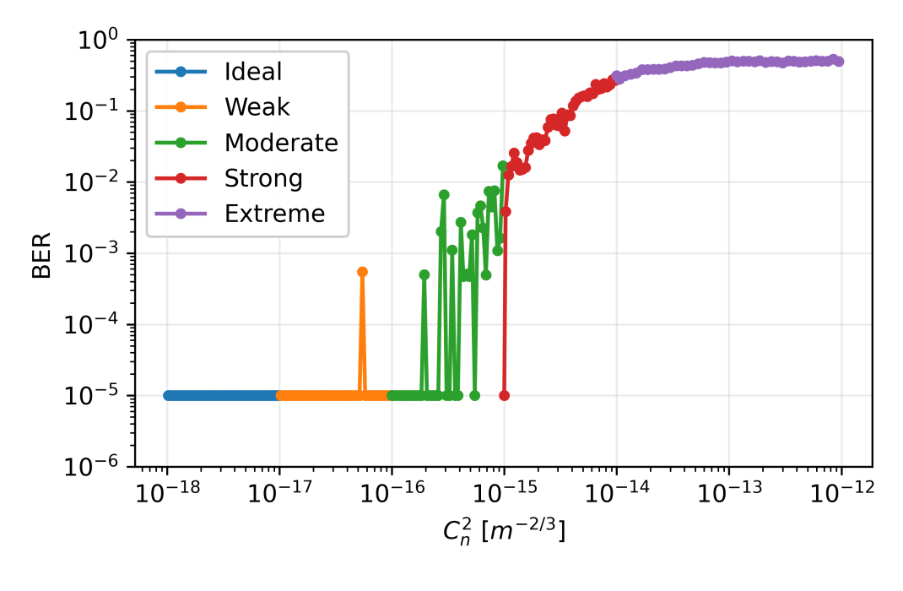
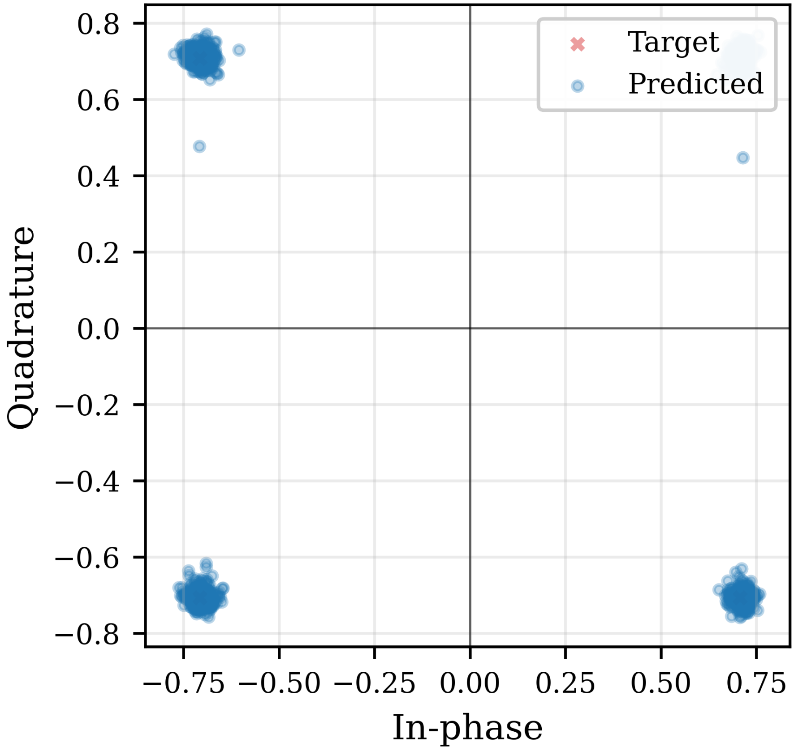
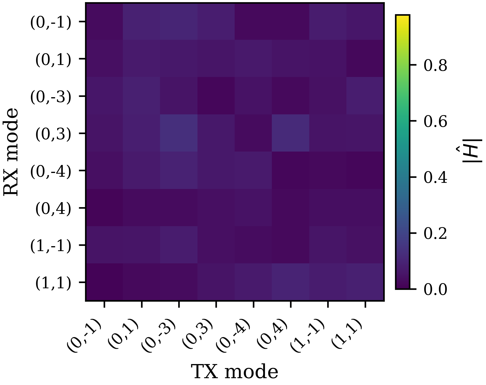
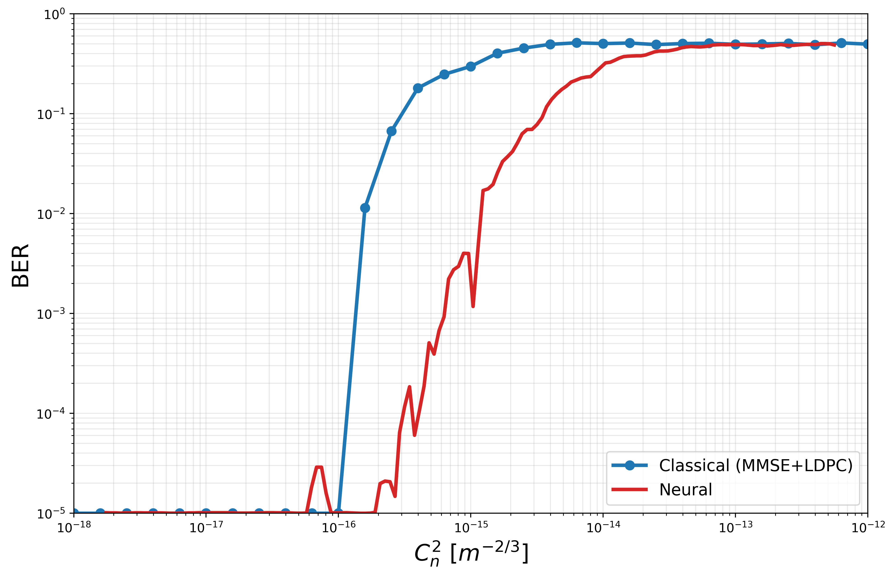

# Deep Learning for OAM Beam Recovery in Atmospheric Turbulence

<div align="center">


**Solving the "Deep Fade" problem in Free Space Optical communications using Spatial Attention Neural Networks**

[Key Results](#key-results) • [Quick Start](#quick-start) • [Technical Details](#technical-details) • [Citation](#citation)

</div>

---

## Table of Contents

- [Overview](#overview)
- [Key Results](#key-results)
- [Quick Start](#quick-start)
- [The Problem](#the-problem)
- [Our Solution](#our-solution)
- [Technical Details](#technical-details)
  - [Architecture Evolution](#architecture-evolution)
  - [Spatial Attention (CBAM)](#spatial-attention-cbam)
- [Performance Analysis](#performance-analysis)
- [Usage Guide](#usage-guide)
  - [Data Generation](#data-generation)
  - [Training](#training)
  - [Evaluation](#evaluation)
- [Project Structure](#project-structure)
- [Citation](#citation)
- [License](#license)

---

## Overview

This repository provides an end-to-end link-level framework for OAM multiplexed optical wireless communication under atmospheric turbulence. The workflow supports fair, matched-condition comparison between:

- a **classical coherent baseline** (pilot-aided LS + MMSE/ZF + LDPC), and
- an **intensity-only neural receiver** (ConvNeXt / EfficientNet family).

The project includes:

- physics-grounded simulation and dataset generation,
- baseline and neural training/evaluation pipelines,
- manuscript-ready figures and LaTeX sources.

---

## Key Results

### 1) Shared system context and branch split



### 2) Curriculum training strategy for neural robustness



### 3) Classical baseline BER trend across turbulence



### 4) Neural BER trend across all curriculum stages



### 5) Neural constellation behavior by regime



---

## Quick Start

```bash
cd "/Users/srivatsadavuluri/Developer/Wireless Communications Related/FSO beam recovery"
python3 -m venv .venv
source .venv/bin/activate
pip install -r requirements.txt
```

Run classical baseline sweep:

```bash
cd "models/LDPC + Pilot + MMSE trials"
python sweep_baseline.py --cn2-min 1e-18 --cn2-max 1e-12 --num-points 41 --repeats 3 --equalizers mmse zf
```

Run neural train/eval (example):

```bash
cd "models/CNN Trials/src/training"
python train.py --data_dir ../../data/generated_curriculum --dataset_name fso_oam_turbulence_v1 --backbone convnext_tiny --epochs 150 --batch_size 32 --loss polar --device auto

cd ../evaluation
python evaluate.py --data_dir ../../data/generated_curriculum --dataset_name fso_oam_turbulence_v1 --backbone convnext_tiny --device auto
```

---

## The Problem

Atmospheric turbulence breaks OAM mode orthogonality and induces:

- inter-modal crosstalk,
- channel-matrix ill-conditioning,
- BER degradation and eventual coding-gain collapse.

In strong regimes, classical inversion-based equalization becomes unstable and can approach random-decision BER.

---

## Our Solution

Use a baseline-first methodology:

1. build and validate a coherent classical baseline over a controlled `C_n^2` sweep,
2. train neural receivers on matched physics-generated data,
3. compare both under consistent metrics and operating points.

---

## Technical Details

### Architecture Evolution

- Classical path: coherent projection -> pilot-aided LS -> MMSE/ZF -> LDPC.
- Neural path: intensity map -> backbone -> symbol head -> BER/SER.
- Curriculum schedule: ideal/weak -> weak -> moderate -> strong -> extreme.

### Spatial Attention (CBAM)

Attention-enhanced neural variants are used to improve robustness to turbulence-induced spatial distortion patterns, alongside ConvNeXt/EfficientNet baselines.

---

## Performance Analysis

Classical matrix degradation example:



Classical vs neural overlap visualization:



---

## Usage Guide

### Data Generation

Generator:

- `models/CNN Trials/data/generators/generate_dataset.py`

Run with one config:

```bash
cd "models/CNN Trials/data/generators"
python generate_dataset.py --config configs/config.json --split all
```

Run curriculum configs:

```bash
cd "models/CNN Trials/data/generators"
python generate_dataset.py \
  --config configs/curriculum_lvl1_ideal.json \
           configs/curriculum_lvl2_weak.json \
           configs/curriculum_lvl3_moderate.json \
           configs/curriculum_lvl4_strong.json \
           configs/curriculum_lvl5_extreme.json \
  --split all
```

### Training

Script:

- `models/CNN Trials/src/training/train.py`

```bash
cd "models/CNN Trials/src/training"
python train.py --data_dir ../../data/generated_curriculum --dataset_name fso_oam_turbulence_v1 --backbone convnext_tiny --epochs 150 --batch_size 32 --loss polar --device auto
```

Curriculum runner:

```bash
cd "models/CNN Trials"
python src/training/train_curriculum.py
```

### Evaluation

Script:

- `models/CNN Trials/src/evaluation/evaluate.py`

```bash
cd "models/CNN Trials/src/evaluation"
python evaluate.py --data_dir ../../data/generated_curriculum --dataset_name fso_oam_turbulence_v1 --backbone convnext_tiny --device auto
```

---

## Project Structure

- `models/LDPC + Pilot + MMSE trials/`: classical baseline pipeline
- `models/CNN Trials/`: neural data/train/evaluation pipeline
- `Manuscript/`: paper source + figure assets
- `requirements.txt`: Python dependencies

---

## Citation

If you use this repository in research, cite your software/manuscript record for this project.

---

## License

This project is licensed under the MIT License. See `LICENSE`.
