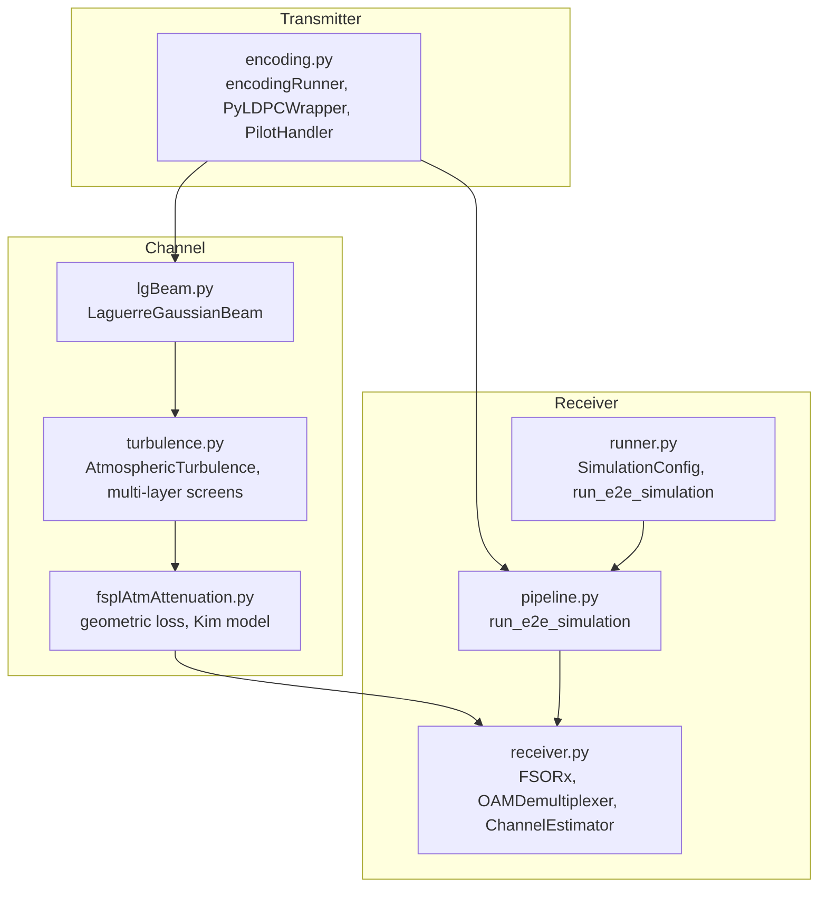
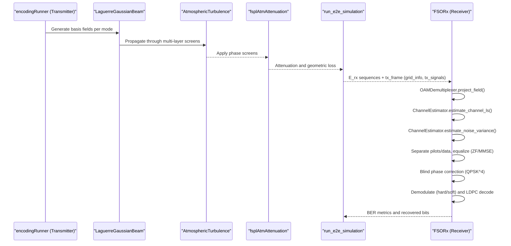
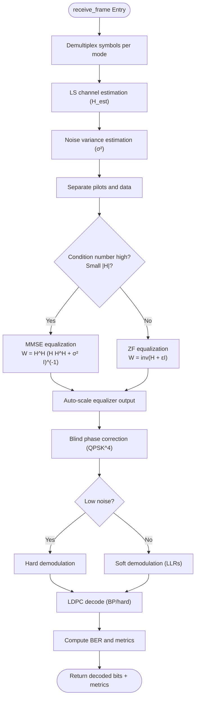
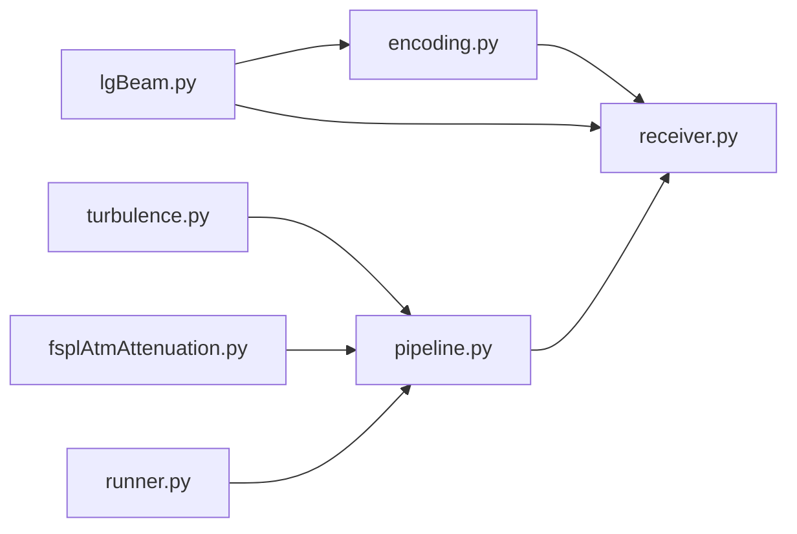

# Alternative Receiver Implementations

<cite>
**Referenced Files in This Document**
- [receiver.py](file://models/LDPC + Pilot + MMSE trials/receiver.py)
- [pipeline.py](file://models/LDPC + Pilot + MMSE trials/pipeline.py)
- [encoding.py](file://models/LDPC + Pilot + MMSE trials/encoding.py)
- [runner.py](file://models/LDPC + Pilot + MMSE trials/runner.py)
- [turbulence.py](file://models/LDPC + Pilot + MMSE trials/turbulence.py)
- [fsplAtmAttenuation.py](file://models/LDPC + Pilot + MMSE trials/fsplAtmAttenuation.py)
- [lgBeam.py](file://models/LDPC + Pilot + MMSE trials/lgBeam.py)
</cite>

## Table of Contents
1. [Introduction](#introduction)
2. [Project Structure](#project-structure)
3. [Core Components](#core-components)
4. [Architecture Overview](#architecture-overview)
5. [Detailed Component Analysis](#detailed-component-analysis)
6. [Dependency Analysis](#dependency-analysis)
7. [Performance Considerations](#performance-considerations)
8. [Troubleshooting Guide](#troubleshooting-guide)
9. [Conclusion](#conclusion)

## Introduction
This document describes the classical MMSE baseline receiver implementation for Free-Space Optics (FSO) multiplexed-with-orbital angular momentum (OAM) systems. It details the LDPC + Pilot + MMSE receiver architecture, including channel estimation via least-squares (LS) using pilot symbols, and MMSE equalization in the symbol domain. The document also explains the complete classical signal processing pipeline, its integration with LDPC decoding, and provides comparative analysis with neural receivers. Implementation details, parameter configurations, and performance characteristics are included to guide practical deployment and research.

## Project Structure
The MMSE baseline is implemented in a modular Python package with clear separation of concerns:
- Transmitter and framing: encoding, LDPC wrapping, and pilot insertion
- Channel modeling: atmospheric turbulence and attenuation
- Receiver: demultiplexing, channel estimation, equalization, demodulation, and LDPC decoding
- Utilities: beam modeling, path loss, and turbulence propagation

**Diagram sources**
- [receiver.py](file://models/LDPC + Pilot + MMSE trials/receiver.py#L363-L705)
- [pipeline.py](file://models/LDPC + Pilot + MMSE trials/pipeline.py#L64-L431)
- [runner.py](file://models/LDPC + Pilot + MMSE trials/runner.py#L128-L505)
- [encoding.py](file://models/LDPC + Pilot + MMSE trials/encoding.py#L461-L684)
- [turbulence.py](file://models/LDPC + Pilot + MMSE trials/turbulence.py#L108-L352)
- [fsplAtmAttenuation.py](file://models/LDPC + Pilot + MMSE trials/fsplAtmAttenuation.py#L26-L305)
- [lgBeam.py](file://models/LDPC + Pilot + MMSE trials/lgBeam.py#L10-L176)

**Section sources**
- [receiver.py](file://models/LDPC + Pilot + MMSE trials/receiver.py#L1-L953)
- [pipeline.py](file://models/LDPC + Pilot + MMSE trials/pipeline.py#L1-L709)
- [runner.py](file://models/LDPC + Pilot + MMSE trials/runner.py#L1-L739)
- [encoding.py](file://models/LDPC + Pilot + MMSE trials/encoding.py#L1-L960)
- [turbulence.py](file://models/LDPC + Pilot + MMSE trials/turbulence.py#L1-L718)
- [fsplAtmAttenuation.py](file://models/LDPC + Pilot + MMSE trials/fsplAtmAttenuation.py#L1-L633)
- [lgBeam.py](file://models/LDPC + Pilot + MMSE trials/lgBeam.py#L1-L486)

## Core Components
- OAMDemultiplexer: Projects received fields onto spatial modes using reference fields and computes per-mode symbols via inner products.
- ChannelEstimator: Estimates the M×M channel matrix using LS on pilot symbols and estimates noise variance from pilot residuals.
- FSORx: Orchestrates the end-to-end receiver pipeline: demultiplexing, channel estimation, noise estimation, data separation, equalization (ZF/MMSE), blind phase correction, demodulation (QPSK hard/soft), and LDPC decoding.
- encodingRunner: Handles LDPC encoding, QPSK modulation, pilot insertion, and per-mode symbol generation.
- Turbulence and Attenuation: Multi-layer phase screens and geometric/attenuation losses for realistic channel simulation.

Key implementation references:
- Demultiplexing and projection: [OAMDemultiplexer.project_field](file://models/LDPC + Pilot + MMSE trials/receiver.py#L134-L224)
- LS channel estimation: [ChannelEstimator.estimate_channel_ls](file://models/LDPC + Pilot + MMSE trials/receiver.py#L292-L317)
- Noise variance estimation: [ChannelEstimator.estimate_noise_variance](file://models/LDPC + Pilot + MMSE trials/receiver.py#L319-L359)
- Equalization and demodulation: [FSORx.receive_frame](file://models/LDPC + Pilot + MMSE trials/receiver.py#L390-L705)
- LDPC encoding/decoding: [PyLDPCWrapper](file://models/LDPC + Pilot + MMSE trials/encoding.py#L190-L459)
- Pilot insertion/extraction: [PilotHandler.insert_pilots_per_mode](file://models/LDPC + Pilot + MMSE trials/encoding.py#L471-L516)

**Section sources**
- [receiver.py](file://models/LDPC + Pilot + MMSE trials/receiver.py#L67-L705)
- [encoding.py](file://models/LDPC + Pilot + MMSE trials/encoding.py#L190-L516)

## Architecture Overview
The classical MMSE receiver pipeline integrates tightly with the transmitter and channel models. The end-to-end flow is:

**Diagram sources**
- [pipeline.py](file://models/LDPC + Pilot + MMSE trials/pipeline.py#L64-L431)
- [receiver.py](file://models/LDPC + Pilot + MMSE trials/receiver.py#L390-L705)
- [encoding.py](file://models/LDPC + Pilot + MMSE trials/encoding.py#L544-L684)
- [turbulence.py](file://models/LDPC + Pilot + MMSE trials/turbulence.py#L261-L352)
- [fsplAtmAttenuation.py](file://models/LDPC + Pilot + MMSE trials/fsplAtmAttenuation.py#L128-L305)

## Detailed Component Analysis

### OAMDemultiplexer
- Purpose: Recover per-mode symbol streams by projecting the received 2D field onto spatial mode basis fields.
- Methodology: Uses reference fields computed from LG basis or provided beam objects, applies aperture masking, and computes inner products with area weighting.
- Robustness: Includes safeguards against real-valued intensity inputs and caches reference fields keyed by mode and grid parameters.

Implementation references:
- [OAMDemultiplexer.reference_field](file://models/LDPC + Pilot + MMSE trials/receiver.py#L80-L132)
- [OAMDemultiplexer.project_field](file://models/LDPC + Pilot + MMSE trials/receiver.py#L134-L224)

**Section sources**
- [receiver.py](file://models/LDPC + Pilot + MMSE trials/receiver.py#L67-L224)

### ChannelEstimator
- LS Channel Estimation: Builds Y_p (received pilots) and P_p (transmitted pilots) matrices and solves H_est = Y_p @ pseudoinverse(P_p).
- Noise Variance Estimation: Computes residual variance from Y_p − H_est @ P_p to estimate σ² for MMSE equalization.
- Numerical Stability: Uses pseudoinverse when the pilot Gram matrix is ill-conditioned.

Implementation references:
- [ChannelEstimator.estimate_channel_ls](file://models/LDPC + Pilot + MMSE trials/receiver.py#L292-L317)
- [ChannelEstimator.estimate_noise_variance](file://models/LDPC + Pilot + MMSE trials/receiver.py#L319-L359)

**Section sources**
- [receiver.py](file://models/LDPC + Pilot + MMSE trials/receiver.py#L227-L359)

### FSORx Pipeline
- Steps:
  1) Demultiplexing: [OAMDemultiplexer.extract_symbols_sequence](file://models/LDPC + Pilot + MMSE trials/receiver.py#L214-L224)
  2) LS Channel Estimation: [ChannelEstimator.estimate_channel_ls](file://models/LDPC + Pilot + MMSE trials/receiver.py#L292-L317)
  3) Noise Estimation: [ChannelEstimator.estimate_noise_variance](file://models/LDPC + Pilot + MMSE trials/receiver.py#L319-L359)
  4) Data Separation: Removes pilot positions and aligns lengths across modes.
  5) Equalization:
     - Automatic selection: Uses MMSE when condition number is high or H magnitudes are small.
     - ZF with small regularization fallback.
     - MMSE: W = H^H (H H^H + σ² I)^(-1).
  6) Auto-scaling: Normalizes equalizer output to match QPSK symbol energy.
  7) Blind Phase Correction: Uses fourth-power method to estimate and remove residual phase error.
  8) Demodulation: Hard decisions for low noise; soft LLRs for high noise.
  9) LDPC Decoding: Belief-propagation (soft) or hard-decision decoding.

Implementation references:
- [FSORx.receive_frame](file://models/LDPC + Pilot + MMSE trials/receiver.py#L390-L705)

**Diagram sources**
- [receiver.py](file://models/LDPC + Pilot + MMSE trials/receiver.py#L390-L705)

**Section sources**
- [receiver.py](file://models/LDPC + Pilot + MMSE trials/receiver.py#L363-L705)

### LDPC Integration
- Encoding: [PyLDPCWrapper.encode](file://models/LDPC + Pilot + MMSE trials/encoding.py#L292-L382)
- Decoding: [PyLDPCWrapper.decode_bp](file://models/LDPC + Pilot + MMSE trials/encoding.py#L425-L459), [PyLDPCWrapper.decode_hard](file://models/LDPC + Pilot + MMSE trials/encoding.py#L387-L423)
- Pilot Handling: [PilotHandler.insert_pilots_per_mode](file://models/LDPC + Pilot + MMSE trials/encoding.py#L471-L516)

Integration with receiver:
- The receiver shares the same LDPC instance as the transmitter to ensure consistent parity-check matrices and block structure.

**Section sources**
- [encoding.py](file://models/LDPC + Pilot + MMSE trials/encoding.py#L190-L516)
- [receiver.py](file://models/LDPC + Pilot + MMSE trials/receiver.py#L363-L387)

### Channel Modeling and Attenuation
- Turbulence: Multi-layer phase screens with Von Kármán PSD and angular spectrum propagation.
- Attenuation: Geometric loss via numeric collection fraction and atmospheric attenuation using Kim model or empirical values.

Implementation references:
- [AtmosphericTurbulence](file://models/LDPC + Pilot + MMSE trials/turbulence.py#L108-L184)
- [apply_multi_layer_turbulence](file://models/LDPC + Pilot + MMSE trials/turbulence.py#L261-L352)
- [calculate_geometric_loss](file://models/LDPC + Pilot + MMSE trials/fsplAtmAttenuation.py#L130-L179)
- [calculate_kim_attenuation](file://models/LDPC + Pilot + MMSE trials/fsplAtmAttenuation.py#L26-L45)

**Section sources**
- [turbulence.py](file://models/LDPC + Pilot + MMSE trials/turbulence.py#L108-L352)
- [fsplAtmAttenuation.py](file://models/LDPC + Pilot + MMSE trials/fsplAtmAttenuation.py#L26-L179)

## Dependency Analysis
The receiver depends on:
- Transmitter LDPC and pilot configuration for consistent framing and decoding.
- LG beam models for accurate reference field generation and propagation.
- Turbulence and attenuation modules for realistic channel simulation.

**Diagram sources**
- [receiver.py](file://models/LDPC + Pilot + MMSE trials/receiver.py#L21-L38)
- [pipeline.py](file://models/LDPC + Pilot + MMSE trials/pipeline.py#L19-L32)
- [runner.py](file://models/LDPC + Pilot + MMSE trials/runner.py#L53-L66)
- [encoding.py](file://models/LDPC + Pilot + MMSE trials/encoding.py#L19-L45)
- [turbulence.py](file://models/LDPC + Pilot + MMSE trials/turbulence.py#L18-L24)
- [fsplAtmAttenuation.py](file://models/LDPC + Pilot + MMSE trials/fsplAtmAttenuation.py#L7-L20)
- [lgBeam.py](file://models/LDPC + Pilot + MMSE trials/lgBeam.py#L1-L10)

**Section sources**
- [receiver.py](file://models/LDPC + Pilot + MMSE trials/receiver.py#L1-L40)
- [pipeline.py](file://models/LDPC + Pilot + MMSE trials/pipeline.py#L1-L35)
- [runner.py](file://models/LDPC + Pilot + MMSE trials/runner.py#L1-L20)
- [encoding.py](file://models/LDPC + Pilot + MMSE trials/encoding.py#L1-L40)
- [turbulence.py](file://models/LDPC + Pilot + MMSE trials/turbulence.py#L1-L25)
- [fsplAtmAttenuation.py](file://models/LDPC + Pilot + MMSE trials/fsplAtmAttenuation.py#L1-L25)
- [lgBeam.py](file://models/LDPC + Pilot + MMSE trials/lgBeam.py#L1-L10)

## Performance Considerations
- Channel Estimation Quality:
  - Pilot density and pattern influence LS estimation accuracy and conditioning.
  - Ill-conditioned H_est benefits from MMSE equalization with σ² estimated from residuals.
- Equalization Strategy:
  - Automatic selection switches to MMSE when condition number is high or H magnitudes are small.
  - ZF with small regularization provides near-perfect whitening when H is well-conditioned.
- Blind Phase Correction:
  - QPSK^4 method effectively removes residual piston phase introduced by turbulence.
- Demodulation:
  - Soft LLR demodulation improves performance in moderate-to-high noise regimes.
- LDPC Decoding:
  - BP decoding leverages soft information; hard decoding serves as robust fallback.
- Computational Complexity:
  - Dominated by FFT-based propagation and matrix inversions/pseudoinverses; suitable for offline simulations and real-time feasibility studies.

[No sources needed since this section provides general guidance]

## Troubleshooting Guide
Common issues and remedies:
- No valid pilots found for LS estimation:
  - Ensure pilot positions are present in tx_frame and match the received frame length.
  - References: [ChannelEstimator._gather_pilots](file://models/LDPC + Pilot + MMSE trials/receiver.py#L235-L290)
- Ill-conditioned pilot Gram matrix:
  - The estimator falls back to pseudoinverse; consider increasing pilot density or diversity.
  - References: [ChannelEstimator.estimate_channel_ls](file://models/LDPC + Pilot + MMSE trials/receiver.py#L292-L317)
- Zero or near-zero noise variance:
  - The estimator clamps to a small floor; verify pilot presence and residual computation.
  - References: [ChannelEstimator.estimate_noise_variance](file://models/LDPC + Pilot + MMSE trials/receiver.py#L319-L359)
- Excessive phase error leading to symbol rotation:
  - Blind phase correction uses QPSK^4; verify equalizer output scaling and constellation visualization.
  - References: [FSORx.receive_frame](file://models/LDPC + Pilot + MMSE trials/receiver.py#L532-L566)
- LDPC decode failures:
  - Fallback to hard decoding; verify block alignment and pilot/data separation.
  - References: [FSORx.receive_frame](file://models/LDPC + Pilot + MMSE trials/receiver.py#L634-L661), [PyLDPCWrapper.decode_hard](file://models/LDPC + Pilot + MMSE trials/encoding.py#L387-L423)

**Section sources**
- [receiver.py](file://models/LDPC + Pilot + MMSE trials/receiver.py#L235-L359)
- [receiver.py](file://models/LDPC + Pilot + MMSE trials/receiver.py#L532-L566)
- [receiver.py](file://models/LDPC + Pilot + MMSE trials/receiver.py#L634-L661)
- [encoding.py](file://models/LDPC + Pilot + MMSE trials/encoding.py#L387-L423)

## Comparative Analysis: Classical MMSE vs Neural Receivers
- Classical MMSE Baseline:
  - Pros: Well-understood, robust to varying channel conditions via MMSE; minimal training overhead; transparent diagnostics (H_est, noise variance, BER).
  - Cons: Limited adaptability to complex, non-linear distortions; relies on accurate channel estimation and QPSK assumptions.
- Neural Receivers:
  - Pros: Can learn complex mappings from raw fields to bits, potentially improving performance in challenging regimes; adaptable to diverse constellations and channel statistics.
  - Cons: Requires extensive training data and careful curation; less interpretable; sensitive to distribution shifts.

Guidelines for choosing:
- Prefer classical MMSE when:
  - Accurate channel estimation is feasible and turbulence conditions vary widely.
  - Transparency and diagnostics are important (e.g., debugging H_est or σ²).
  - Training data or computational resources for neural models are limited.
- Complement with neural approaches when:
  - Additional gains are desired beyond LS/MMSE, especially with richer constellations or non-idealities.
  - Hybrid architectures combine LS/MMSE with learned post-processing stages.

[No sources needed since this section provides general guidance]

## Implementation Details and Parameter Configuration
- Spatial Modes and Grid:
  - Configure [SimulationConfig.SPATIAL_MODES](file://models/LDPC + Pilot + MMSE trials/pipeline.py#L43-L43) and [SimulationConfig.N_GRID](file://models/LDPC + Pilot + MMSE trials/pipeline.py#L53-L53).
- LDPC Parameters:
  - FEC rate and block sizes via [PyLDPCWrapper](file://models/LDPC + Pilot + MMSE trials/encoding.py#L190-L282).
- Pilot Configuration:
  - Pilot ratio and pattern via [PilotHandler](file://models/LDPC + Pilot + MMSE trials/encoding.py#L462-L516).
- Turbulence and Attenuation:
  - Cn², screen count, and atmospheric model via [AtmosphericTurbulence](file://models/LDPC + Pilot + MMSE trials/turbulence.py#L108-L184) and [calculate_kim_attenuation](file://models/LDPC + Pilot + MMSE trials/fsplAtmAttenuation.py#L26-L45).
- Receiver Equalization:
  - Equalizer selection and thresholds via [FSORx.receive_frame](file://models/LDPC + Pilot + MMSE trials/receiver.py#L476-L485).

**Section sources**
- [pipeline.py](file://models/LDPC + Pilot + MMSE trials/pipeline.py#L37-L58)
- [encoding.py](file://models/LDPC + Pilot + MMSE trials/encoding.py#L190-L516)
- [turbulence.py](file://models/LDPC + Pilot + MMSE trials/turbulence.py#L108-L184)
- [fsplAtmAttenuation.py](file://models/LDPC + Pilot + MMSE trials/fsplAtmAttenuation.py#L26-L45)
- [receiver.py](file://models/LDPC + Pilot + MMSE trials/receiver.py#L476-L485)

## Conclusion
The classical MMSE baseline receiver provides a robust, interpretable foundation for FSO-OAM systems. By combining accurate OAM demultiplexing, LS channel estimation, MMSE equalization, blind phase correction, and LDPC decoding, it achieves reliable performance across realistic atmospheric conditions. While neural receivers offer potential gains, the MMSE approach remains valuable for transparency, diagnostics, and resource-constrained scenarios, and can serve as a strong baseline and complementary stage in hybrid architectures.