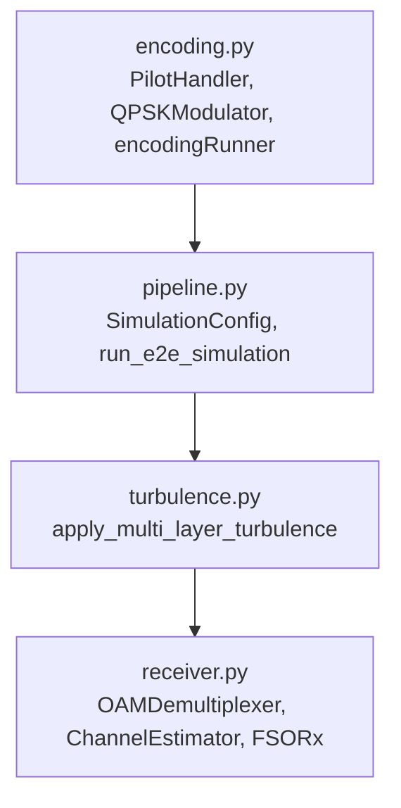
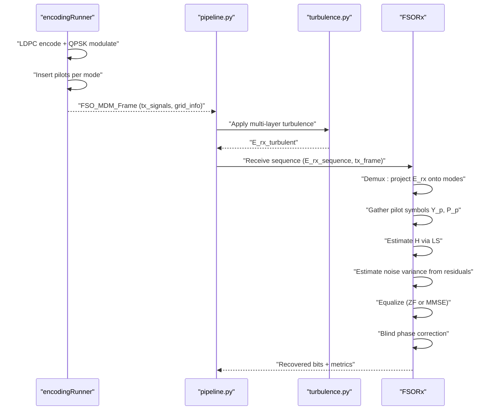
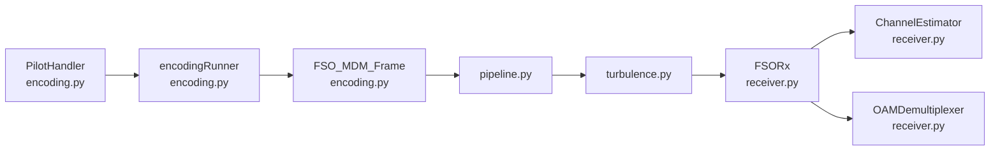

# Channel Estimation Methods

<cite>
**Referenced Files in This Document**
- [receiver.py](file://models/LDPC + Pilot + MMSE trials/receiver.py)
- [encoding.py](file://models/LDPC + Pilot + MMSE trials/encoding.py)
- [pipeline.py](file://models/LDPC + Pilot + MMSE trials/pipeline.py)
- [test_channel_estimation.py](file://models/LDPC + Pilot + MMSE trials/scripts/test_channel_estimation.py)
- [test_mmse_formula.py](file://models/LDPC + Pilot + MMSE trials/scripts/test_mmse_formula.py)
- [analyze_noise_var.py](file://models/LDPC + Pilot + MMSE trials/scripts/analyze_noise_var.py)
- [turbulence.py](file://models/LDPC + Pilot + MMSE trials/turbulence.py)
- [theoretical_validation.py](file://models/LDPC + Pilot + MMSE trials/scripts/theoretical_validation.py)
</cite>

## Table of Contents
1. [Introduction](#introduction)
2. [Project Structure](#project-structure)
3. [Core Components](#core-components)
4. [Architecture Overview](#architecture-overview)
5. [Detailed Component Analysis](#detailed-component-analysis)
6. [Dependency Analysis](#dependency-analysis)
7. [Performance Considerations](#performance-considerations)
8. [Troubleshooting Guide](#troubleshooting-guide)
9. [Conclusion](#conclusion)

## Introduction
This document explains the pilot-assisted channel estimation methods used in the MMSE receiver for a free-space optical (FSO) OAM system. It covers:
- How pilot symbols are designed and inserted
- Least-squares (LS) channel estimation from pilots
- Noise variance estimation from pilot residuals
- Equalization strategies (ZF/MMSE) and automatic selection
- Practical issues such as projection mismatch, normalization, and residual phase correction
- Relationship between pilot ratio, estimation quality, and system performance

## Project Structure
The MMSE receiver pipeline integrates:
- Transmitter encoding with pilot insertion
- Physical channel simulation (turbulence)
- Receiver demultiplexing, channel estimation, equalization, and decoding

**Diagram sources**
- [encoding.py](file://models/LDPC + Pilot + MMSE trials/encoding.py#L462-L516)
- [pipeline.py](file://models/LDPC + Pilot + MMSE trials/pipeline.py#L64-L431)
- [turbulence.py](file://models/LDPC + Pilot + MMSE trials/turbulence.py#L248-L339)
- [receiver.py](file://models/LDPC + Pilot + MMSE trials/receiver.py#L363-L744)

**Section sources**
- [encoding.py](file://models/LDPC + Pilot + MMSE trials/encoding.py#L462-L516)
- [pipeline.py](file://models/LDPC + Pilot + MMSE trials/pipeline.py#L64-L431)
- [turbulence.py](file://models/LDPC + Pilot + MMSE trials/turbulence.py#L248-L339)
- [receiver.py](file://models/LDPC + Pilot + MMSE trials/receiver.py#L363-L744)

## Core Components
- PilotHandler: generates comb and preamble pilots, inserts them per mode, and tracks positions.
- encodingRunner: modulates data, encodes with LDPC, and orchestrates pilot insertion and per-mode symbol frames.
- OAMDemultiplexer: projects received fields onto spatial modes using reference fields; extracts per-mode symbols.
- ChannelEstimator: gathers pilot observations, estimates channel matrix H via LS, and estimates noise variance.
- FSORx: end-to-end receiver implementing demux, channel estimation, noise estimation, equalization (ZF/MMSE), phase correction, and decoding.

**Section sources**
- [encoding.py](file://models/LDPC + Pilot + MMSE trials/encoding.py#L462-L516)
- [encoding.py](file://models/LDPC + Pilot + MMSE trials/encoding.py#L544-L684)
- [receiver.py](file://models/LDPC + Pilot + MMSE trials/receiver.py#L67-L224)
- [receiver.py](file://models/LDPC + Pilot + MMSE trials/receiver.py#L227-L359)
- [receiver.py](file://models/LDPC + Pilot + MMSE trials/receiver.py#L363-L744)

## Architecture Overview
The end-to-end flow for channel estimation and equalization:

**Diagram sources**
- [encoding.py](file://models/LDPC + Pilot + MMSE trials/encoding.py#L544-L684)
- [pipeline.py](file://models/LDPC + Pilot + MMSE trials/pipeline.py#L337-L410)
- [turbulence.py](file://models/LDPC + Pilot + MMSE trials/turbulence.py#L248-L339)
- [receiver.py](file://models/LDPC + Pilot + MMSE trials/receiver.py#L390-L705)

## Detailed Component Analysis

### Pilot Pattern Design and Insertion
- Pilot ratio controls the density of inserted pilots per mode.
- Pattern: a fixed-length preamble followed by comb pilots at regular intervals determined by the pilot ratio.
- Positions are tracked per mode and stored in the transmission frame metadata.

Implementation highlights:
- PilotHandler.insert_pilots_per_mode generates the combined frame, pilot positions, and pilot sequence.
- encodingRunner.transmit applies per-mode insertion and stores pilot_positions and pilot_sequence in tx_signals.

Practical notes:
- Preamble ensures reliable initial synchronization.
- Comb spacing should balance estimation accuracy and spectral efficiency.

**Section sources**
- [encoding.py](file://models/LDPC + Pilot + MMSE trials/encoding.py#L462-L516)
- [encoding.py](file://models/LDPC + Pilot + MMSE trials/encoding.py#L599-L684)

### Mathematical Derivation of LS Channel Estimation
For a MIMO system Y_p = H P_p + N, where:
- Y_p is the received pilot matrix (M×N_pilots)
- P_p is the transmitted pilot matrix (M×N_pilots)
- H is the M×M channel matrix to be estimated
- N is additive noise

Least-squares estimate:
- H_est = Y_p (P_p^H P_p)^{-1} P_p^H (well-conditioned P_p^H P_p)
- Or equivalently H_est = Y_p pseudoinverse(P_p) (more robust when ill-conditioned)

The receiver’s ChannelEstimator implements both forms and falls back to pseudo-inverse when the Gram matrix is ill-conditioned.

Validation and equivalence:
- A synthetic test verifies LS equivalence between matrix inverse and pseudo-inverse formulations.
- Noise variance estimation from residuals confirms the model mismatch diagnosis.

**Section sources**
- [receiver.py](file://models/LDPC + Pilot + MMSE trials/receiver.py#L292-L317)
- [receiver.py](file://models/LDPC + Pilot + MMSE trials/receiver.py#L319-L359)
- [test_channel_estimation.py](file://models/LDPC + Pilot + MMSE trials/scripts/test_channel_estimation.py#L48-L95)

### Noise Variance Estimation from Pilot Residuals
- Residuals: E = Y_p − H_est P_p
- Noise variance estimate: σ̂² = mean(|E|²)
- Used as regularization weight in MMSE equalization

Practical insights:
- Large estimated noise variance when no noise is added indicates model mismatch (projection mismatch, turbulence distortion, or mismatched reference fields).
- The receiver normalizes the estimate to a safe lower bound to avoid numerical issues.

**Section sources**
- [receiver.py](file://models/LDPC + Pilot + MMSE trials/receiver.py#L319-L359)
- [analyze_noise_var.py](file://models/LDPC + Pilot + MMSE trials/scripts/analyze_noise_var.py#L24-L48)

### Equalization Strategies: ZF vs MMSE
- Zero-Forcing (ZF): W_zf = inv(H), sensitive to noise and ill-conditioning.
- MMSE: W_mmse = H^H (H H^H + σ² I)^{-1}, stabilizes against noise and ill-conditioning.
- Automatic selection: if channel is ill-conditioned or H values are too small, MMSE is preferred.

Validation:
- A minimal test demonstrates MMSE outperforms ZF in noisy conditions.

**Section sources**
- [receiver.py](file://models/LDPC + Pilot + MMSE trials/receiver.py#L476-L516)
- [test_mmse_formula.py](file://models/LDPC + Pilot + MMSE trials/scripts/test_mmse_formula.py#L29-L119)

### Blind Phase Correction and Output Normalization
- The equalizer output is auto-scaled to unit symbol energy to mitigate normalization mismatches.
- A blind residual phase correction leverages the fourth power of QPSK symbols to estimate and remove residual phase error.

These steps improve constellation geometry and reduce BER.

**Section sources**
- [receiver.py](file://models/LDPC + Pilot + MMSE trials/receiver.py#L518-L566)

### Projection-Based Demodulation and Reference Field Matching
- OAMDemultiplexer projects the received field onto spatial modes using reference fields.
- Proper scaling and aperture matching are essential; mismatches cause small projections and poor channel estimates.

The receiver caches reference fields keyed by grid and scaling parameters to avoid stale projections.

**Section sources**
- [receiver.py](file://models/LDPC + Pilot + MMSE trials/receiver.py#L67-L224)

### End-to-End Pipeline and Metrics
- pipeline.py constructs the full simulation: transmitter, turbulence, and receiver.
- It passes grid_info and tx_signals to the receiver and collects metrics (BER, H_est, noise_var, condition number).

**Section sources**
- [pipeline.py](file://models/LDPC + Pilot + MMSE trials/pipeline.py#L64-L431)
- [receiver.py](file://models/LDPC + Pilot + MMSE trials/receiver.py#L390-L705)

## Dependency Analysis
Key dependencies among components:

**Diagram sources**
- [encoding.py](file://models/LDPC + Pilot + MMSE trials/encoding.py#L462-L516)
- [encoding.py](file://models/LDPC + Pilot + MMSE trials/encoding.py#L544-L684)
- [pipeline.py](file://models/LDPC + Pilot + MMSE trials/pipeline.py#L64-L431)
- [turbulence.py](file://models/LDPC + Pilot + MMSE trials/turbulence.py#L248-L339)
- [receiver.py](file://models/LDPC + Pilot + MMSE trials/receiver.py#L227-L359)

**Section sources**
- [encoding.py](file://models/LDPC + Pilot + MMSE trials/encoding.py#L462-L516)
- [encoding.py](file://models/LDPC + Pilot + MMSE trials/encoding.py#L544-L684)
- [pipeline.py](file://models/LDPC + Pilot + MMSE trials/pipeline.py#L64-L431)
- [turbulence.py](file://models/LDPC + Pilot + MMSE trials/turbulence.py#L248-L339)
- [receiver.py](file://models/LDPC + Pilot + MMSE trials/receiver.py#L227-L359)

## Performance Considerations
- Pilot ratio and spacing: higher pilot ratio improves estimation accuracy but reduces spectral efficiency; comb spacing should avoid coherent nulls.
- Channel condition number: ill-conditioned H favors MMSE; automatic selection mitigates risk.
- Noise variance: accurate estimation prevents over-regularization; mismatch leads to large σ̂² and degraded performance.
- Projection normalization: mismatched reference fields yield small projections and incorrect H scaling.
- Residual phase: uncorrected phase errors degrade constellation geometry and increase BER.

[No sources needed since this section provides general guidance]

## Troubleshooting Guide
Common issues and remedies:
- Excessively large noise variance estimate with no added noise:
  - Indicates model mismatch (projection mismatch, turbulence distortion).
  - Check pilot power normalization and reference field scaling.
- Poor BER despite good SNR:
  - Inspect channel condition number and equalization selection.
  - Verify blind phase correction effectiveness.
- Ill-conditioned pilot Gram matrix:
  - Use pseudo-inverse formulation and consider orthogonal pilot designs.
- Projection mismatch:
  - Ensure aperture masks and scaling factors are consistent across TX and RX.
  - Validate reference field generation and caching keys.

**Section sources**
- [analyze_noise_var.py](file://models/LDPC + Pilot + MMSE trials/scripts/analyze_noise_var.py#L12-L48)
- [receiver.py](file://models/LDPC + Pilot + MMSE trials/receiver.py#L292-L317)
- [receiver.py](file://models/LDPC + Pilot + MMSE trials/receiver.py#L476-L516)

## Conclusion
Pilot-assisted LS channel estimation enables robust MIMO equalization in turbulent FSO-OAM channels. Accurate pilot design, precise projection-based demodulation, and reliable noise variance estimation are critical. The receiver’s automatic equalization selection and blind phase correction further stabilize performance. Addressing projection mismatches and ensuring proper normalization yields significant improvements in BER and throughput.