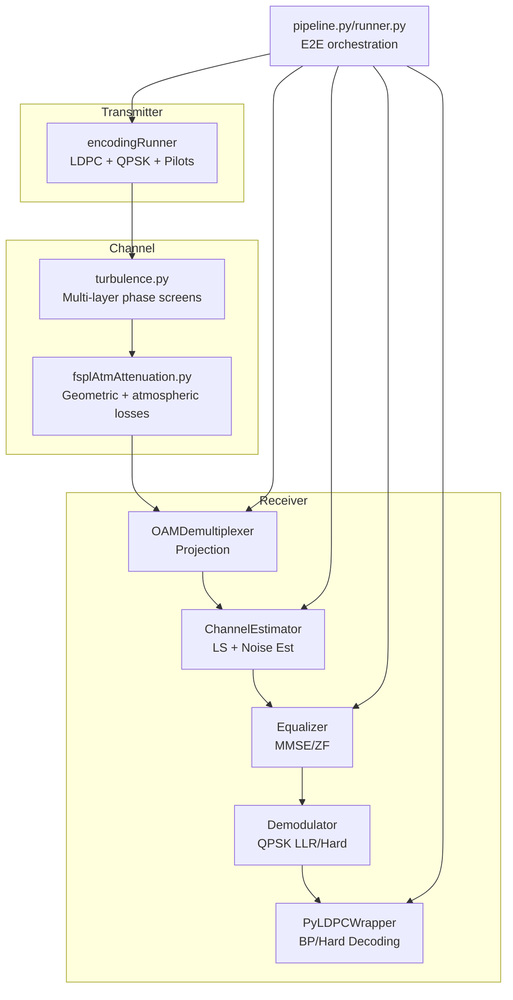
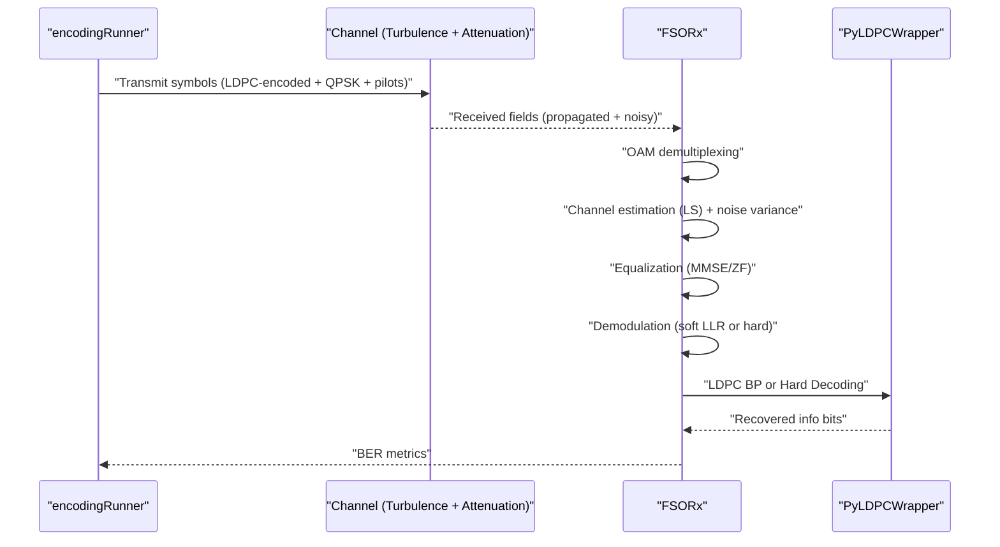
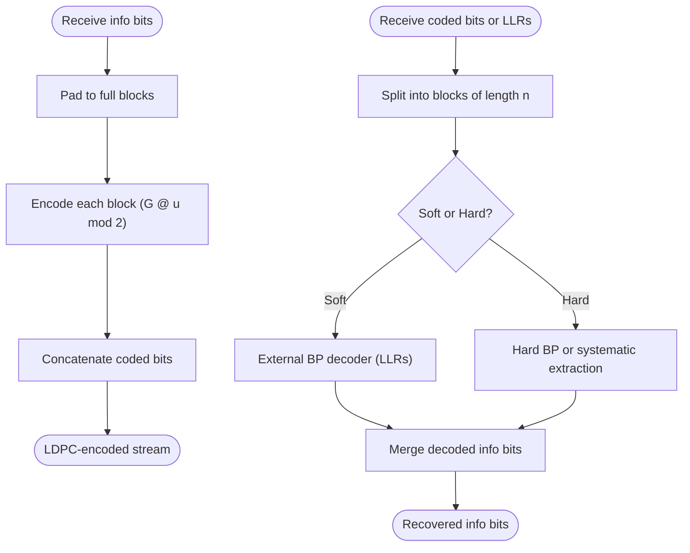
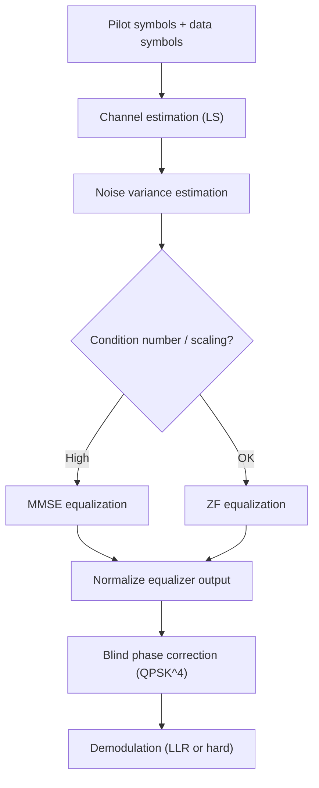
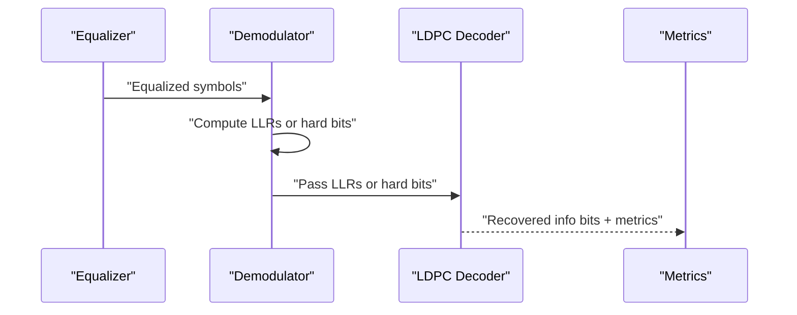
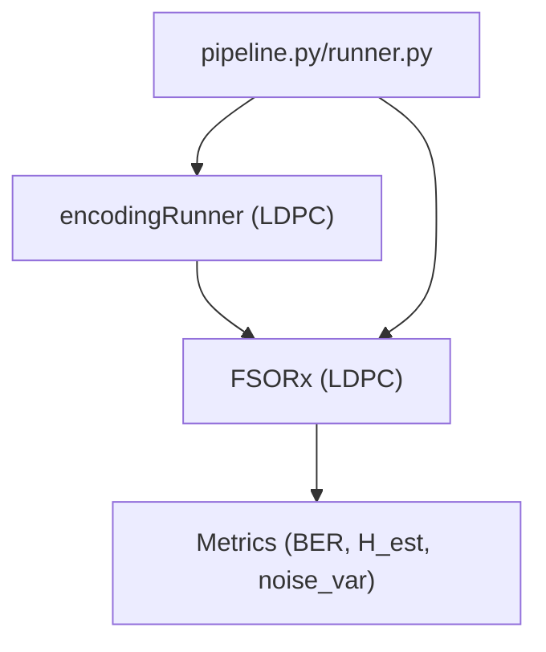

# LDPC Decoding Integration

<cite>
**Referenced Files in This Document**
- [encoding.py](file://models/LDPC + Pilot + MMSE trials/encoding.py)
- [receiver.py](file://models/LDPC + Pilot + MMSE trials/receiver.py)
- [pipeline.py](file://models/LDPC + Pilot + MMSE trials/pipeline.py)
- [runner.py](file://models/LDPC + Pilot + MMSE trials/runner.py)
- [turbulence.py](file://models/LDPC + Pilot + MMSE trials/turbulence.py)
- [fsplAtmAttenuation.py](file://models/LDPC + Pilot + MMSE trials/fsplAtmAttenuation.py)
- [lgBeam.py](file://models/LDPC + Pilot + MMSE trials/lgBeam.py)
</cite>

## Table of Contents
1. [Introduction](#introduction)
2. [Project Structure](#project-structure)
3. [Core Components](#core-components)
4. [Architecture Overview](#architecture-overview)
5. [Detailed Component Analysis](#detailed-component-analysis)
6. [Dependency Analysis](#dependency-analysis)
7. [Performance Considerations](#performance-considerations)
8. [Troubleshooting Guide](#troubleshooting-guide)
9. [Conclusion](#conclusion)

## Introduction
This document explains how Low-Density Parity-Check (LDPC) decoding integrates into the classical receiver framework for Free-Space Optics (FSO) multiplexed-by-OAM (Orbital Angular Momentum) systems. It details how the Minimum Mean Square Error (MMSE) equalizer interfaces with LDPC decoders, describes the LDPC code structure and parity-check matrix construction, and traces the data flow from equalized symbols through LDPC decoding to final bit recovery. It also covers parameter selection, decoding performance characteristics, error floor behavior, and implementation details such as syndrome calculation and iterative decoding processes. Finally, it demonstrates how LDPC decoding complements MMSE equalization to achieve reliable communication.

## Project Structure
The LDPC decoding integration resides within a modular simulation pipeline:
- Encoding and transmission: LDPC encoding, QPSK modulation, pilot insertion, and spatial multiplexing by LG modes.
- Channel modeling: Turbulence propagation and atmospheric attenuation.
- Reception: OAM demultiplexing, LS-based channel estimation, MMSE equalization, soft/hard demodulation, and LDPC decoding.
- Pipeline orchestration: End-to-end simulation and performance evaluation.

**Diagram sources**
- [encoding.py](file://models/LDPC + Pilot + MMSE trials/encoding.py#L544-L684)
- [turbulence.py](file://models/LDPC + Pilot + MMSE trials/turbulence.py#L248-L339)
- [fsplAtmAttenuation.py](file://models/LDPC + Pilot + MMSE trials/fsplAtmAttenuation.py#L130-L179)
- [receiver.py](file://models/LDPC + Pilot + MMSE trials/receiver.py#L363-L705)
- [pipeline.py](file://models/LDPC + Pilot + MMSE trials/pipeline.py#L64-L431)

**Section sources**
- [encoding.py](file://models/LDPC + Pilot + MMSE trials/encoding.py#L544-L684)
- [receiver.py](file://models/LDPC + Pilot + MMSE trials/receiver.py#L363-L705)
- [pipeline.py](file://models/LDPC + Pilot + MMSE trials/pipeline.py#L64-L431)

## Core Components
- LDPC encoder/decoder wrapper: Builds regular LDPC codes, encodes information bits into codewords, and performs belief-propagation (BP) or hard-decision decoding.
- QPSK modulator/demodulator: Maps bits to QPSK symbols and computes LLRs for soft decoding.
- Pilot handler: Inserts structured pilot sequences for channel estimation.
- OAM demultiplexer: Projects received fields onto LG basis modes to recover per-mode symbol streams.
- Channel estimator: Estimates channel matrix and noise variance using pilot symbols.
- Equalizer: Performs MMSE or ZF equalization to separate multiplexed modes.
- End-to-end pipeline: Orchestrates transmission, channel propagation, and reception with optional LDPC decoding.

**Section sources**
- [encoding.py](file://models/LDPC + Pilot + MMSE trials/encoding.py#L190-L460)
- [receiver.py](file://models/LDPC + Pilot + MMSE trials/receiver.py#L363-L705)

## Architecture Overview
The receiver pipeline separates pilots from data, estimates the channel matrix, estimates noise variance, equalizes the received symbols, performs soft/hard demodulation, and finally applies LDPC decoding to recover information bits.

**Diagram sources**
- [receiver.py](file://models/LDPC + Pilot + MMSE trials/receiver.py#L390-L705)
- [pipeline.py](file://models/LDPC + Pilot + MMSE trials/pipeline.py#L400-L408)

## Detailed Component Analysis

### LDPC Code Structure and Construction
- Code parameters: The wrapper constructs regular LDPC codes with fixed column weight (variable node degree dv) and row weight (check node degree dc). The code length n and information length k are derived from the requested rate and constraints.
- Generator and parity-check matrices: The underlying library generates sparse H and G matrices. The wrapper stores H and G in sparse CSR format and derives k, n, m = n - k. It validates that the actual rate is close to the requested rate.
- Code selection criteria: dv is typically small (e.g., 3) to improve decoding thresholds; dc is chosen to satisfy n divisibility and approximate the desired rate. If the requested dv/dc combination is infeasible, the wrapper adjusts dc or falls back to a safe configuration.

Implementation highlights:
- Parameter validation and automatic adjustment of dv/dc to meet n divisibility and rate targets.
- Sparse matrix storage for memory efficiency.
- Fallback to manual matrix multiplication if external decoder is unavailable.

**Section sources**
- [encoding.py](file://models/LDPC + Pilot + MMSE trials/encoding.py#L190-L283)

### LDPC Encoding and Decoding Functions
- Encoding:
  - Accepts information bits, pads to full blocks, and encodes each block using either the external decoder or manual matrix multiplication (G @ u mod 2).
  - Ensures output length equals the number of blocks times n.
- Decoding:
  - Soft decoding (BP): Converts received hard bits to large-magnitude LLRs and passes them to the external decoder. If unavailable, falls back to hard decoding.
  - Hard decoding: Uses hard-decision BP or systematic extraction of message bits from decoded codeword.

**Diagram sources**
- [encoding.py](file://models/LDPC + Pilot + MMSE trials/encoding.py#L292-L459)

**Section sources**
- [encoding.py](file://models/LDPC + Pilot + MMSE trials/encoding.py#L292-L459)

### Syndrome Calculation and Iterative Decoding
- Belief propagation (BP) decoding is performed over the Tanner graph defined by the sparse parity-check matrix H. Each iteration updates variable node beliefs based on check node constraints and vice versa.
- For hard-decision decoding, hard bits are converted to LLRs with large magnitudes to bias posteriors toward 0 or 1.
- The wrapper extracts message bits either via a dedicated message extraction routine or by taking the first k bits of the decoded codeword (systematic form).

Note: The wrapper relies on an external decoder for BP decoding and provides a fallback to hard decisions when the external decoder is unavailable.

**Section sources**
- [encoding.py](file://models/LDPC + Pilot + MMSE trials/encoding.py#L425-L459)

### MMSE Equalization and Its Role with LDPC
- Channel estimation: LS estimation using pilot symbols yields an estimate of the channel matrix H_est. Noise variance is estimated from pilot residuals.
- Equalization: The receiver selects between MMSE and ZF equalizers. MMSE minimizes mean squared error and is preferred when the channel is ill-conditioned or when signal scaling is uncertain.
- Normalization: The equalizer output is normalized to match QPSK symbol amplitudes, ensuring accurate LLR computation and demodulation.
- Phase correction: A blind phase recovery technique leverages the fourth power of QPSK symbols to estimate and remove residual phase error, improving constellation geometry before demodulation.

**Diagram sources**
- [receiver.py](file://models/LDPC + Pilot + MMSE trials/receiver.py#L469-L566)

**Section sources**
- [receiver.py](file://models/LDPC + Pilot + MMSE trials/receiver.py#L227-L359)
- [receiver.py](file://models/LDPC + Pilot + MMSE trials/receiver.py#L469-L566)

### Data Flow from Equalized Symbols to Final Bit Recovery
- After equalization, the receiver flattens per-mode symbol streams and demodulates them into hard bits or LLRs depending on noise conditions.
- If LDPC decoding is enabled, the receiver passes LLRs to the BP decoder; otherwise, it reports pre-LDPC BER for comparison.
- The wrapper validates decoded bit lengths against expected effective length and trims excess bits.

**Diagram sources**
- [receiver.py](file://models/LDPC + Pilot + MMSE trials/receiver.py#L571-L659)

**Section sources**
- [receiver.py](file://models/LDPC + Pilot + MMSE trials/receiver.py#L571-L659)

### Parameter Selection and Performance Characteristics
- LDPC parameters:
  - dv: Small values (e.g., 3) yield good thresholds and tractable decoding.
  - dc: Chosen to divide n and approximate the desired rate; adjusted if necessary.
  - Rate: Actual rate is validated against the requested rate and warned if off by more than a threshold.
- MMSE vs ZF:
  - MMSE is selected automatically when the channel is ill-conditioned or when scaling issues are suspected; otherwise ZF with small regularization is used.
- Noise handling:
  - Low noise environments favor hard decisions; higher noise triggers soft LLR demodulation.
- Error floor behavior:
  - The wrapper’s soft decoder enables near-Shannon-like performance at moderate SNRs; error floor depends on code design and channel conditions. The pipeline records BER and pre-LDPC BER for analysis.

**Section sources**
- [encoding.py](file://models/LDPC + Pilot + MMSE trials/encoding.py#L190-L283)
- [receiver.py](file://models/LDPC + Pilot + MMSE trials/receiver.py#L476-L516)

### Channel Modeling and Impact on LDPC Performance
- Turbulence: Multi-layer phase screens simulate atmospheric turbulence; the propagation preserves LG phase and introduces OAM distortions.
- Attenuation: Geometric loss and atmospheric attenuation are computed and applied to received fields.
- These effects degrade signal quality and increase residual noise, challenging both equalization and LDPC decoding.

**Section sources**
- [turbulence.py](file://models/LDPC + Pilot + MMSE trials/turbulence.py#L248-L339)
- [fsplAtmAttenuation.py](file://models/LDPC + Pilot + MMSE trials/fsplAtmAttenuation.py#L130-L179)

## Dependency Analysis
The receiver depends on the transmitter’s LDPC instance to ensure identical H matrix and code dimensions. The pipeline shares the LDPC instance between transmitter and receiver to guarantee consistent encoding/decoding.

**Diagram sources**
- [pipeline.py](file://models/LDPC + Pilot + MMSE trials/pipeline.py#L140-L149)
- [receiver.py](file://models/LDPC + Pilot + MMSE trials/receiver.py#L363-L384)

**Section sources**
- [pipeline.py](file://models/LDPC + Pilot + MMSE trials/pipeline.py#L140-L149)
- [receiver.py](file://models/LDPC + Pilot + MMSE trials/receiver.py#L363-L384)

## Performance Considerations
- Code rate and block length: Higher rates reduce overhead but may increase error floors; larger n improves error correction but increases computational cost.
- Equalizer choice: MMSE generally improves performance in adverse channels; ZF is faster but can amplify noise.
- Soft vs hard decoding: Soft decoding with LLRs typically achieves lower BER than hard decisions, especially at moderate-to-low SNRs.
- Pilot density: Higher pilot ratios improve channel estimation accuracy but reduce spectral efficiency.

[No sources needed since this section provides general guidance]

## Troubleshooting Guide
- LDPC decoding failures:
  - If the external decoder is unavailable, the wrapper falls back to hard decisions; verify installation of the external library.
  - Ensure LLR length is a multiple of n and that decoded bit count matches expected effective length.
- Channel estimation issues:
  - Insufficient pilots or poor pilot placement can cause ill-conditioned H_est; verify pilot positions and increase pilot ratio if needed.
  - Noise variance estimation requires sufficient pilot diversity; confirm that residuals are computed correctly.
- Equalization problems:
  - If equalizer output scaling is incorrect, the receiver normalizes the output to match QPSK amplitudes; verify that normalization is applied.
  - Automatic MMSE selection activates when the condition number is high or channel magnitudes are small; adjust equalizer method if necessary.
- BER discrepancies:
  - Compare pre-LDPC BER with post-LDPC BER to assess LDPC effectiveness; investigate channel estimation and equalization quality if post-LDPC BER is unexpectedly high.

**Section sources**
- [receiver.py](file://models/LDPC + Pilot + MMSE trials/receiver.py#L319-L359)
- [receiver.py](file://models/LDPC + Pilot + MMSE trials/receiver.py#L476-L516)
- [receiver.py](file://models/LDPC + Pilot + MMSE trials/receiver.py#L634-L661)

## Conclusion
LDPC decoding complements MMSE equalization by providing robust error correction in the presence of channel impairments and noise. The wrapper’s flexible encoding/decoding pipeline, combined with LS channel estimation and adaptive equalization, enables reliable communication across realistic FSO-OAM channels. Proper parameter selection, careful pilot design, and accurate noise estimation are essential to achieving near-capacity performance and mitigating error floors.