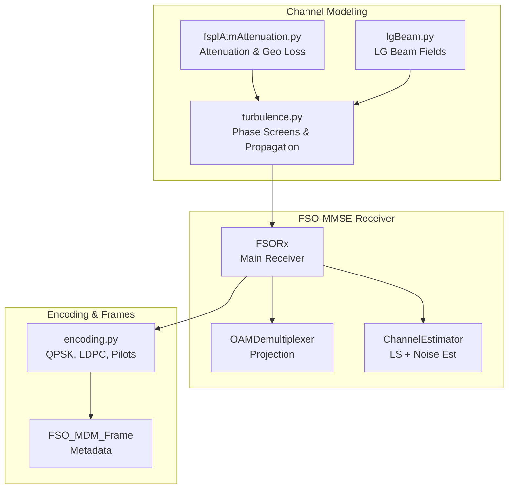
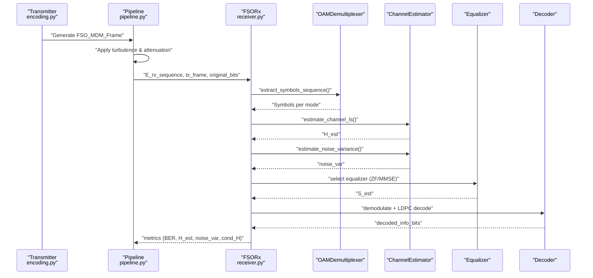
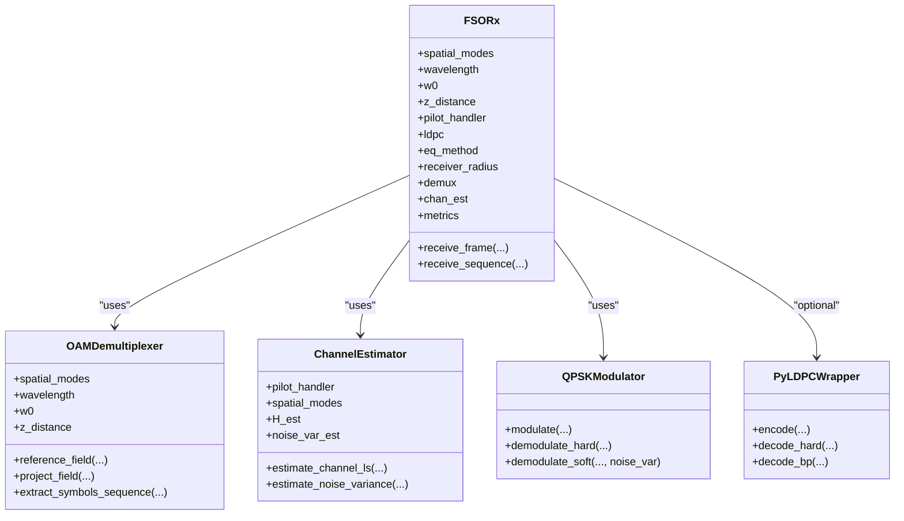
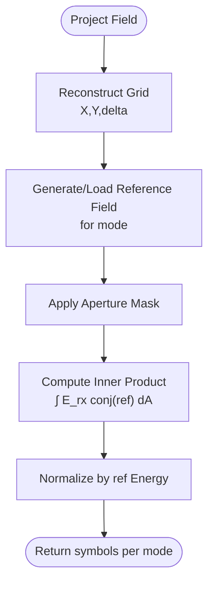
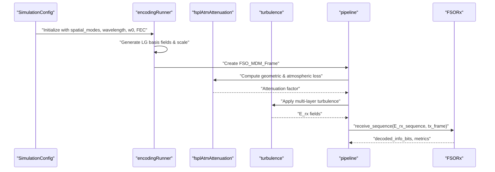
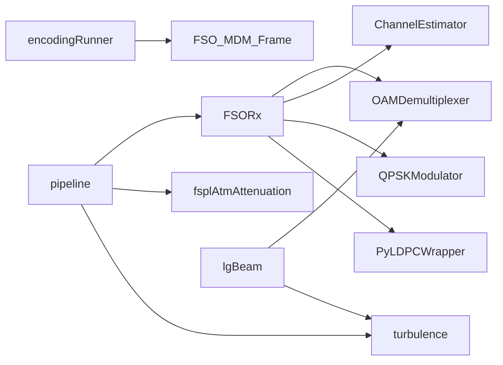

# MMSE Receiver Architecture

<cite>
**Referenced Files in This Document**
- [receiver.py](file://models/LDPC + Pilot + MMSE trials/receiver.py)
- [pipeline.py](file://models/LDPC + Pilot + MMSE trials/pipeline.py)
- [encoding.py](file://models/LDPC + Pilot + MMSE trials/encoding.py)
- [fsplAtmAttenuation.py](file://models/LDPC + Pilot + MMSE trials/fsplAtmAttenuation.py)
- [turbulence.py](file://models/LDPC + Pilot + MMSE trials/turbulence.py)
- [lgBeam.py](file://models/LDPC + Pilot + MMSE trials/lgBeam.py)
- [README.md](file://README.md)
- [MMSE_PERFORMANCE_ANALYSIS.md](file://models/LDPC + Pilot + MMSE trials/cn2_sweep_results/MMSE_PERFORMANCE_ANALYSIS.md)
</cite>

## Table of Contents
1. [Introduction](#introduction)
2. [Project Structure](#project-structure)
3. [Core Components](#core-components)
4. [Architecture Overview](#architecture-overview)
5. [Detailed Component Analysis](#detailed-component-analysis)
6. [Dependency Analysis](#dependency-analysis)
7. [Performance Considerations](#performance-considerations)
8. [Troubleshooting Guide](#troubleshooting-guide)
9. [Conclusion](#conclusion)
10. [Appendices](#appendices)

## Introduction
This document provides comprehensive documentation for the MMSE receiver architecture used in Free Space Optical (FSO) Orbital Angular Momentum (OAM) communication systems. It explains the mathematical foundations of Minimum Mean Square Error equalization, channel estimation techniques, and the end-to-end signal processing pipeline from raw field measurements to decoded bits. The document focuses on the FSORx class structure, initialization parameters, equalization algorithms, noise variance estimation, and performance optimization strategies validated by extensive simulations.

## Project Structure
The MMSE receiver implementation resides in the "LDPC + Pilot + MMSE trials" module alongside supporting physics and simulation utilities. The key files include:
- FSORx and related components (OAMDemultiplexer, ChannelEstimator) in receiver.py
- End-to-end simulation pipeline in pipeline.py
- Encoding utilities (QPSK, LDPC, pilot handling) in encoding.py
- Atmospheric attenuation and geometric loss calculations in fsplAtmAttenuation.py
- Turbulence modeling and propagation in turbulence.py
- LG beam generation in lgBeam.py

**Diagram sources**
- [receiver.py](file://models/LDPC + Pilot + MMSE trials/receiver.py#L363-L705)
- [pipeline.py](file://models/LDPC + Pilot + MMSE trials/pipeline.py#L1-L431)
- [encoding.py](file://models/LDPC + Pilot + MMSE trials/encoding.py#L66-L84)
- [fsplAtmAttenuation.py](file://models/LDPC + Pilot + MMSE trials/fsplAtmAttenuation.py#L1-L633)
- [turbulence.py](file://models/LDPC + Pilot + MMSE trials/turbulence.py#L1-L705)
- [lgBeam.py](file://models/LDPC + Pilot + MMSE trials/lgBeam.py#L1-L486)

**Section sources**
- [receiver.py](file://models/LDPC + Pilot + MMSE trials/receiver.py#L1-L953)
- [pipeline.py](file://models/LDPC + Pilot + MMSE trials/pipeline.py#L1-L709)
- [encoding.py](file://models/LDPC + Pilot + MMSE trials/encoding.py#L1-L960)
- [fsplAtmAttenuation.py](file://models/LDPC + Pilot + MMSE trials/fsplAtmAttenuation.py#L1-L633)
- [turbulence.py](file://models/LDPC + Pilot + MMSE trials/turbulence.py#L1-L705)
- [lgBeam.py](file://models/LDPC + Pilot + MMSE trials/lgBeam.py#L1-L486)

## Core Components
- FSORx: Main receiver class orchestrating demultiplexing, channel estimation, noise variance estimation, equalization, demodulation, and LDPC decoding.
- OAMDemultiplexer: Projects received fields onto spatial modes using reference fields and aperture masking.
- ChannelEstimator: Performs Least Squares (LS) channel estimation and estimates noise variance from pilot residuals.
- QPSKModulator: Handles QPSK symbol mapping, hard and soft demodulation.
- PyLDPCWrapper: Provides LDPC encoding/decoding with belief propagation and hard decoding.
- PilotHandler: Inserts and extracts pilot symbols for channel estimation.
- FSO_MDM_Frame: Container for transmitted signals, grid info, and metadata.

**Section sources**
- [receiver.py](file://models/LDPC + Pilot + MMSE trials/receiver.py#L363-L705)
- [encoding.py](file://models/LDPC + Pilot + MMSE trials/encoding.py#L66-L84)
- [encoding.py](file://models/LDPC + Pilot + MMSE trials/encoding.py#L136-L190)
- [encoding.py](file://models/LDPC + Pilot + MMSE trials/encoding.py#L190-L460)
- [encoding.py](file://models/LDPC + Pilot + MMSE trials/encoding.py#L461-L543)

## Architecture Overview
The MMSE receiver pipeline transforms raw 2D complex fields into decoded information bits through the following stages:
1. OAM demultiplexing: Project received fields onto spatial modes using reference fields and aperture masking.
2. Channel estimation: Estimate the M×M channel matrix H using LS with pilot symbols.
3. Noise variance estimation: Compute residual variance from pilot observations to obtain σ².
4. Data separation: Remove pilot symbols and align data across modes.
5. Equalization: Apply ZF or MMSE equalization with automatic selection based on channel condition.
6. Blind phase correction: Correct residual phase error using QPSK^4 method.
7. Demodulation: Hard decisions or soft LLRs depending on noise level.
8. LDPC decoding: Decode using BP or hard decoding.

**Diagram sources**
- [receiver.py](file://models/LDPC + Pilot + MMSE trials/receiver.py#L390-L705)
- [pipeline.py](file://models/LDPC + Pilot + MMSE trials/pipeline.py#L400-L431)
- [encoding.py](file://models/LDPC + Pilot + MMSE trials/encoding.py#L66-L84)

**Section sources**
- [receiver.py](file://models/LDPC + Pilot + MMSE trials/receiver.py#L390-L705)
- [pipeline.py](file://models/LDPC + Pilot + MMSE trials/pipeline.py#L64-L431)

## Detailed Component Analysis

### FSORx Class
FSORx is the central receiver class that integrates demultiplexing, channel estimation, equalization, and decoding. Key responsibilities:
- Initialization parameters: spatial_modes, wavelength, w0, z_distance, pilot_handler, ldpc_instance, eq_method, receiver_radius.
- receive_frame(): Orchestrates the complete pipeline and returns decoded bits plus metrics.
- receive_sequence(): Compatibility wrapper for the simulation pipeline.

Implementation highlights:
- Uses OAMDemultiplexer for projection and ChannelEstimator for LS and noise estimation.
- Implements automatic equalizer selection based on channel condition number and H magnitude.
- Applies blind phase correction using QPSK^4 method to mitigate atmospheric turbulence-induced phase errors.
- Supports soft demodulation with LLRs when noise is significant and LDPC decoding with BP or hard decoding.

**Diagram sources**
- [receiver.py](file://models/LDPC + Pilot + MMSE trials/receiver.py#L363-L388)
- [receiver.py](file://models/LDPC + Pilot + MMSE trials/receiver.py#L67-L224)
- [receiver.py](file://models/LDPC + Pilot + MMSE trials/receiver.py#L227-L360)
- [encoding.py](file://models/LDPC + Pilot + MMSE trials/encoding.py#L136-L190)
- [encoding.py](file://models/LDPC + Pilot + MMSE trials/encoding.py#L190-L460)

**Section sources**
- [receiver.py](file://models/LDPC + Pilot + MMSE trials/receiver.py#L363-L705)

### OAMDemultiplexer
The demultiplexer projects the received field onto spatial modes using reference fields computed from LG beam basis functions. It:
- Reconstructs spatial grids from grid_info.
- Generates or retrieves cached reference fields for each mode, applying optional beam objects and scaling factors.
- Applies aperture masking and computes inner products to obtain per-mode symbols.
- Supports real-field inputs by assuming sqrt(I) zero-phase fields.

**Diagram sources**
- [receiver.py](file://models/LDPC + Pilot + MMSE trials/receiver.py#L44-L224)

**Section sources**
- [receiver.py](file://models/LDPC + Pilot + MMSE trials/receiver.py#L44-L224)

### ChannelEstimator
ChannelEstimator performs:
- LS channel estimation: Builds Y_p and P_p matrices from pilot positions and symbols, then solves H = Y_p @ pinv(P_p) or via matrix inversion when well-conditioned.
- Noise variance estimation: Computes residual variance var = mean(|Y_p - H_est @ P_p|^2) to estimate σ².

Robustness features:
- Ill-conditioned pilot Gram matrix handling via pseudo-inverse.
- Safety flooring for noise variance to avoid numerical issues.
- Debug prints for SNR estimation.

**Section sources**
- [receiver.py](file://models/LDPC + Pilot + MMSE trials/receiver.py#L227-L360)

### Equalization Algorithms
The receiver selects between ZF and MMSE equalizers:
- ZF: W = inv(H + εI) with small regularization ε to stabilize inversion.
- MMSE: W = H^H (H H^H + σ²I)^(-1), numerically computed as W = H^H inv(H H^H + σ²I) for stability.
- Automatic selection: If cond(H) > threshold or H magnitudes are small, MMSE is preferred.

Post-processing:
- Auto-scaling of equalizer output to match QPSK constellation power.
- Blind phase correction using QPSK^4 method to remove residual phase error.

**Section sources**
- [receiver.py](file://models/LDPC + Pilot + MMSE trials/receiver.py#L471-L566)

### Demodulation and LDPC Decoding
- Hard demodulation: Used when noise variance is low.
- Soft demodulation: LLRs computed as a_scale * imag/real components of received symbols.
- LDPC decoding: BP decoding with LLRs or hard decoding when BP unavailable.

**Section sources**
- [receiver.py](file://models/LDPC + Pilot + MMSE trials/receiver.py#L593-L661)
- [encoding.py](file://models/LDPC + Pilot + MMSE trials/encoding.py#L136-L190)
- [encoding.py](file://models/LDPC + Pilot + MMSE trials/encoding.py#L190-L460)

### End-to-End Pipeline Integration
The pipeline ties together transmitter, channel modeling, and receiver:
- Initializes SimulationConfig with system parameters.
- Generates LG basis fields, scales for total TX power, and stores scaling factors in tx_frame.metadata.
- Computes geometric and atmospheric losses, applies attenuation and noise, and propagates through turbulence.
- Passes the full E_rx sequence to FSORx.receive_sequence() with tx_frame for demux and decoding.

**Diagram sources**
- [pipeline.py](file://models/LDPC + Pilot + MMSE trials/pipeline.py#L64-L431)
- [fsplAtmAttenuation.py](file://models/LDPC + Pilot + MMSE trials/fsplAtmAttenuation.py#L1-L633)
- [turbulence.py](file://models/LDPC + Pilot + MMSE trials/turbulence.py#L196-L340)
- [receiver.py](file://models/LDPC + Pilot + MMSE trials/receiver.py#L707-L744)

**Section sources**
- [pipeline.py](file://models/LDPC + Pilot + MMSE trials/pipeline.py#L64-L431)

## Dependency Analysis
Key dependencies and relationships:
- FSORx depends on OAMDemultiplexer and ChannelEstimator for demux and channel/noise estimation.
- FSORx optionally uses QPSKModulator and PyLDPCWrapper for demodulation and LDPC decoding.
- encodingRunner creates FSO_MDM_Frame with tx_signals and metadata for receiver use.
- pipeline.py orchestrates end-to-end simulation, including turbulence and attenuation modeling.
- lgBeam.py provides LG beam fields used for reference projections and basis generation.
- fsplAtmAttenuation.py and turbulence.py provide atmospheric loss and phase screen propagation.

**Diagram sources**
- [receiver.py](file://models/LDPC + Pilot + MMSE trials/receiver.py#L363-L705)
- [encoding.py](file://models/LDPC + Pilot + MMSE trials/encoding.py#L544-L684)
- [pipeline.py](file://models/LDPC + Pilot + MMSE trials/pipeline.py#L64-L431)
- [fsplAtmAttenuation.py](file://models/LDPC + Pilot + MMSE trials/fsplAtmAttenuation.py#L1-L633)
- [turbulence.py](file://models/LDPC + Pilot + MMSE trials/turbulence.py#L196-L340)
- [lgBeam.py](file://models/LDPC + Pilot + MMSE trials/lgBeam.py#L1-L486)

**Section sources**
- [receiver.py](file://models/LDPC + Pilot + MMSE trials/receiver.py#L363-L705)
- [encoding.py](file://models/LDPC + Pilot + MMSE trials/encoding.py#L544-L684)
- [pipeline.py](file://models/LDPC + Pilot + MMSE trials/pipeline.py#L64-L431)

## Performance Considerations
- Channel conditioning: MMSE performance degrades significantly for moderate to strong turbulence (Cn² > 3.2e-17). The receiver automatically switches to MMSE when cond(H) is high or H magnitudes are small.
- Noise variance estimation: Reliable σ² estimation from pilot residuals enables accurate soft demodulation and LDPC decoding.
- Blind phase correction: QPSK^4 method mitigates residual phase errors introduced by turbulence, improving constellation geometry.
- LDPC effectiveness: At high turbulence, coded BER closely tracks final BER, indicating channel distortion exceeds LDPC correction capability.
- Simulation thresholds: MMSE works excellently for Cn² ≤ 1.2e-17, acceptable for up to 3.2e-17, and poor beyond that.

**Section sources**
- [MMSE_PERFORMANCE_ANALYSIS.md](file://models/LDPC + Pilot + MMSE trials/cn2_sweep_results/MMSE_PERFORMANCE_ANALYSIS.md#L1-L135)
- [receiver.py](file://models/LDPC + Pilot + MMSE trials/receiver.py#L476-L486)
- [receiver.py](file://models/LDPC + Pilot + MMSE trials/receiver.py#L532-L566)

## Troubleshooting Guide
Common issues and remedies:
- Ill-conditioned channel matrix: The receiver warns and falls back to pseudo-inverse or MMSE. Consider increasing pilot density or switching to ML-based receiver for strong turbulence.
- No valid pilots found: Channel estimation returns identity H; ensure pilot positions are correctly configured in tx_frame.
- Zero or near-zero noise variance: Safety flooring prevents numerical issues; verify pilot coverage and residual computation.
- Uneven data lengths across modes: Receiver truncates to minimum length; ensure consistent frame lengths.
- LDPC decode failures: Receiver falls back to hard decisions; verify LDPC parameters match transmitter and check LLR alignment.
- Aperture mismatch: Ensure receiver_radius matches physical aperture and grid_info is provided for demux.

**Section sources**
- [receiver.py](file://models/LDPC + Pilot + MMSE trials/receiver.py#L292-L360)
- [receiver.py](file://models/LDPC + Pilot + MMSE trials/receiver.py#L435-L462)
- [receiver.py](file://models/LDPC + Pilot + MMSE trials/receiver.py#L634-L661)

## Conclusion
The MMSE receiver architecture provides a robust baseline for FSO-OAM systems under weak atmospheric turbulence. Its strengths lie in reliable operation for Cn² < 2e-17, accurate channel estimation via LS with pilots, and effective noise variance estimation. For realistic conditions with moderate to strong turbulence, the receiver exhibits rapid performance degradation, necessitating adaptive equalization strategies or ML-based alternatives. The provided implementation demonstrates careful numerical stability, blind phase correction, and seamless integration with LDPC decoding, forming a solid foundation for hybrid receiver designs.

## Appendices

### Mathematical Foundations of MMSE Equalization
- Channel model: y = Hs + n, where y is received vector, H is M×M channel, s is transmitted symbols, n is noise.
- MMSE objective: minimize E[||s - W y||²].
- MMSE solution: W = (H^H H + σ² I)^{-1} H^H, or equivalently W = H^H (H H^H + σ² I)^{-1} for numerical stability.
- ZF solution: W = inv(H + εI) with small regularization ε.

These formulations are implemented in the receiver pipeline with automatic selection based on channel condition.

**Section sources**
- [receiver.py](file://models/LDPC + Pilot + MMSE trials/receiver.py#L499-L516)

### Channel Estimation Techniques
- LS estimation: H_est = Y_p @ pinv(P_p) using pilot positions and symbols.
- Pilot placement: Uniform comb pattern with preamble pilots per mode.
- Robustness: Pseudo-inverse fallback for ill-conditioned pilot Gram matrices.

**Section sources**
- [receiver.py](file://models/LDPC + Pilot + MMSE trials/receiver.py#L292-L317)
- [encoding.py](file://models/LDPC + Pilot + MMSE trials/encoding.py#L461-L543)

### Noise Variance Estimation
- Residual variance: σ̂² = mean(|Y_p - H_est P_p|²).
- Safety flooring: Prevents numerical instability in inversion.
- SNR estimation: Derived from noise variance for diagnostics.

**Section sources**
- [receiver.py](file://models/LDPC + Pilot + MMSE trials/receiver.py#L319-L359)

### End-to-End Simulation Configuration
Typical configuration parameters include:
- Wavelength, w0, distance, receiver diameter, spatial modes, CN², pilot ratio, FEC rate, grid size, oversampling, SNR, and equalizer method.

These are set in SimulationConfig and propagated through the pipeline to the receiver.

**Section sources**
- [pipeline.py](file://models/LDPC + Pilot + MMSE trials/pipeline.py#L37-L62)
- [pipeline.py](file://models/LDPC + Pilot + MMSE trials/pipeline.py#L138-L149)

### Integration with Simulation Framework
- The receiver accepts either tx_frame (recommended) or separate grid_info and tx_signals.
- The pipeline constructs tx_frame with grid_info and metadata (including basis scaling factors) for accurate reference field matching.
- Noise parameters are computed per-symbol and applied during propagation.

**Section sources**
- [receiver.py](file://models/LDPC + Pilot + MMSE trials/receiver.py#L707-L744)
- [pipeline.py](file://models/LDPC + Pilot + MMSE trials/pipeline.py#L161-L174)
- [pipeline.py](file://models/LDPC + Pilot + MMSE trials/pipeline.py#L299-L336)