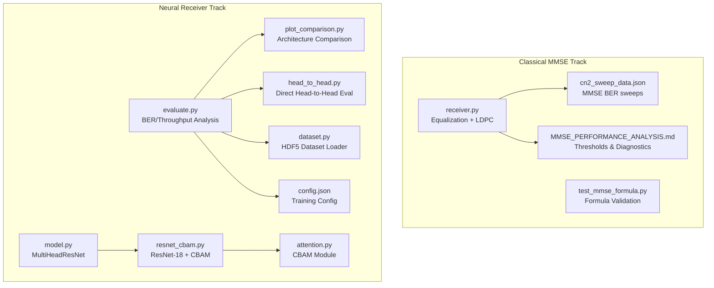
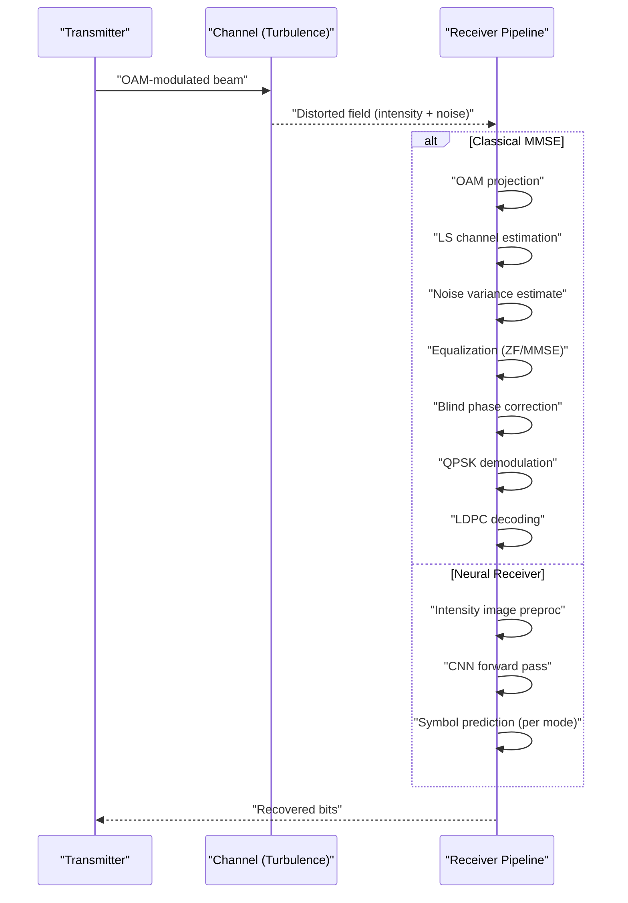
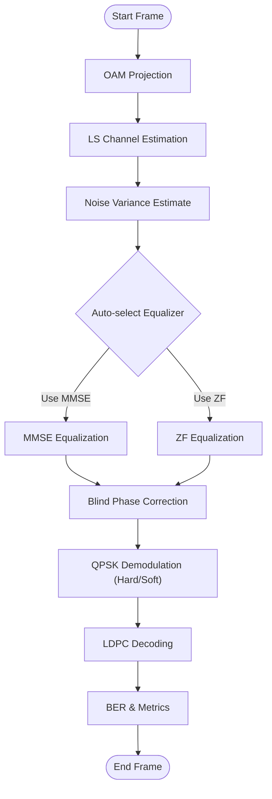
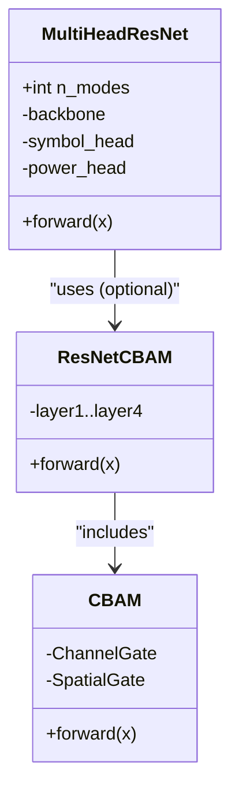
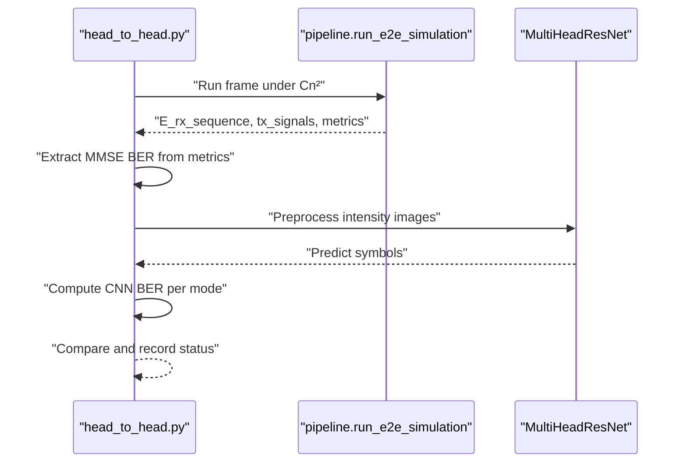
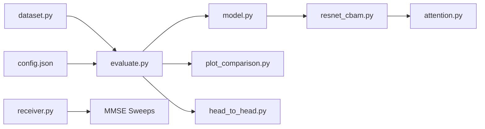

# Performance Comparison and Analysis

<cite>
**Referenced Files in This Document**
- [README.md](file://README.md)
- [MMSE_PERFORMANCE_ANALYSIS.md](file://models/LDPC + Pilot + MMSE trials/cn2_sweep_results/MMSE_PERFORMANCE_ANALYSIS.md)
- [cn2_sweep_data.json](file://models/LDPC + Pilot + MMSE trials/cn2_sweep_results/cn2_sweep_data.json)
- [test_mmse_formula.py](file://models/LDPC + Pilot + MMSE trials/scripts/test_mmse_formula.py)
- [receiver.py](file://models/LDPC + Pilot + MMSE trials/receiver.py)
- [evaluate.py](file://models/CNN Trials/src/evaluation/evaluate.py)
- [plot_comparison.py](file://models/CNN Trials/src/evaluation/plot_comparison.py)
- [read_ber_stats.py](file://models/CNN Trials/read_ber_stats.py)
- [head_to_head.py](file://models/CNN Trials/src/evaluation/head_to_head.py)
- [model.py](file://models/CNN Trials/src/models/model.py)
- [resnet_cbam.py](file://models/CNN Trials/src/models/resnet_cbam.py)
- [attention.py](file://models/CNN Trials/src/models/attention.py)
- [dataset.py](file://models/CNN Trials/src/utils/dataset.py)
- [config.json](file://models/CNN Trials/data/configs/config.json)
- [requirements.txt](file://models/CNN Trials/requirements.txt)
</cite>

## Table of Contents
1. [Introduction](#introduction)
2. [Project Structure](#project-structure)
3. [Core Components](#core-components)
4. [Architecture Overview](#architecture-overview)
5. [Detailed Component Analysis](#detailed-component-analysis)
6. [Dependency Analysis](#dependency-analysis)
7. [Performance Considerations](#performance-considerations)
8. [Troubleshooting Guide](#troubleshooting-guide)
9. [Conclusion](#conclusion)
10. [Appendices](#appendices)

## Introduction
This document compares the performance of the classical Minimum Mean Square Error (MMSE) receiver against the neural receiver (ResNet-18 with CBAM) for free-space optical (FSO) communication using orbital angular momentum (OAM) spatial modes. It synthesizes empirical results across turbulence strengths (Cn²), SNR regimes, and spatial mode configurations, and provides statistical insights and practical guidelines for selecting between MMSE and neural approaches based on system constraints.

## Project Structure
The repository is organized into two major tracks:
- Classical MMSE baseline and analysis (LDPC + Pilot + MMSE trials)
- Neural receiver development and evaluation (CNN Trials)

Key directories and roles:
- models/LDPC + Pilot + MMSE trials: MMSE receiver pipeline, channel estimation, equalization, LDPC decoding, and performance sweeps
- models/CNN Trials: Neural receiver architectures (ResNet-18, ResNet-18 + CBAM), training, evaluation, and plotting utilities

**Diagram sources**
- [receiver.py](file://models/LDPC + Pilot + MMSE trials/receiver.py#L363-L705)
- [cn2_sweep_data.json](file://models/LDPC + Pilot + MMSE trials/cn2_sweep_results/cn2_sweep_data.json#L1-L249)
- [MMSE_PERFORMANCE_ANALYSIS.md](file://models/LDPC + Pilot + MMSE trials/cn2_sweep_results/MMSE_PERFORMANCE_ANALYSIS.md#L1-L135)
- [test_mmse_formula.py](file://models/LDPC + Pilot + MMSE trials/scripts/test_mmse_formula.py#L1-L120)
- [evaluate.py](file://models/CNN Trials/src/evaluation/evaluate.py#L1-L315)
- [plot_comparison.py](file://models/CNN Trials/src/evaluation/plot_comparison.py#L1-L84)
- [head_to_head.py](file://models/CNN Trials/src/evaluation/head_to_head.py#L1-L158)
- [model.py](file://models/CNN Trials/src/models/model.py#L1-L81)
- [resnet_cbam.py](file://models/CNN Trials/src/models/resnet_cbam.py#L1-L112)
- [attention.py](file://models/CNN Trials/src/models/attention.py#L1-L89)
- [dataset.py](file://models/CNN Trials/src/utils/dataset.py#L1-L44)
- [config.json](file://models/CNN Trials/data/configs/config.json#L1-L136)

**Section sources**
- [README.md](file://README.md#L311-L350)

## Core Components
- Classical MMSE receiver:
  - OAM demultiplexer with projection onto spatial modes
  - Least-squares channel estimation using pilot symbols
  - Noise variance estimation from pilot residuals
  - Equalization via ZF or MMSE with automatic selection
  - Blind phase recovery via fourth-power method
  - QPSK hard/soft demodulation and LDPC decoding
- Neural receiver:
  - Multi-head ResNet-18 backbone adapted for 1-channel 64×64 intensity inputs
  - Symbol head predicts real/imaginary parts of QPSK symbols per mode
  - Auxiliary power head predicts mode presence
  - Optional CBAM spatial attention module

**Section sources**
- [receiver.py](file://models/LDPC + Pilot + MMSE trials/receiver.py#L67-L705)
- [model.py](file://models/CNN Trials/src/models/model.py#L6-L71)
- [resnet_cbam.py](file://models/CNN Trials/src/models/resnet_cbam.py#L51-L112)
- [attention.py](file://models/CNN Trials/src/models/attention.py#L72-L89)

## Architecture Overview
The end-to-end receiver architectures differ fundamentally in how they handle channel inversion and phase recovery:
- Classical MMSE: Explicitly estimates channel and noise statistics, applies equalization, and decodes with LDPC.
- Neural receiver: Learns a mapping from intensity images to symbol domains, implicitly handling channel distortions and phase ambiguities.

**Diagram sources**
- [receiver.py](file://models/LDPC + Pilot + MMSE trials/receiver.py#L390-L705)
- [model.py](file://models/CNN Trials/src/models/model.py#L59-L71)

## Detailed Component Analysis

### Classical MMSE Receiver: Equalization and Thresholds
- Channel estimation uses LS over pilot positions; noise variance estimated from pilot residuals.
- Automatic equalizer selection switches to MMSE when the estimated channel is ill-conditioned or has small magnitudes.
- Blind phase recovery mitigates atmospheric-induced global phase rotations.
- Performance thresholds derived from Cn² sweeps:
  - Weak turbulence (Cn² ≤ 1.2e-17): Excellent (< 1% BER)
  - Acceptable (Cn² ≈ 1.2e-17 to 3.2e-17): 1–10% BER
  - Poor (> 3.2e-17): > 10% BER, approaching random guessing
- Channel conditioning increases sharply beyond moderate turbulence, confirming near-singular behavior.

**Diagram sources**
- [receiver.py](file://models/LDPC + Pilot + MMSE trials/receiver.py#L390-L705)

**Section sources**
- [MMSE_PERFORMANCE_ANALYSIS.md](file://models/LDPC + Pilot + MMSE trials/cn2_sweep_results/MMSE_PERFORMANCE_ANALYSIS.md#L14-L121)
- [cn2_sweep_data.json](file://models/LDPC + Pilot + MMSE trials/cn2_sweep_results/cn2_sweep_data.json#L22-L204)
- [test_mmse_formula.py](file://models/LDPC + Pilot + MMSE trials/scripts/test_mmse_formula.py#L42-L120)

### Neural Receiver: Architecture and Evaluation
- MultiHeadResNet:
  - Backbone adapted for 1-channel inputs; symbol head outputs complex symbols per mode; auxiliary power head predicts mode activity.
- ResNet-18 + CBAM:
  - Adds channel and spatial attention gates to improve robustness in strong turbulence.
- Evaluation pipeline computes BER, SER, throughput, and constellation plots; throughput modeled with LDPC and pilot overhead accounted.

**Diagram sources**
- [model.py](file://models/CNN Trials/src/models/model.py#L6-L71)
- [resnet_cbam.py](file://models/CNN Trials/src/models/resnet_cbam.py#L51-L112)
- [attention.py](file://models/CNN Trials/src/models/attention.py#L72-L89)

**Section sources**
- [model.py](file://models/CNN Trials/src/models/model.py#L6-L71)
- [resnet_cbam.py](file://models/CNN Trials/src/models/resnet_cbam.py#L1-L112)
- [attention.py](file://models/CNN Trials/src/models/attention.py#L1-L89)
- [evaluate.py](file://models/CNN Trials/src/evaluation/evaluate.py#L12-L61)

### Head-to-Head Comparison Workflow
- Generates frames under specified Cn², runs classical MMSE equalization and LDPC decoding, and records BER.
- Runs neural receiver on the same frames, computes CNN BER per mode and overall.
- Provides comparative statuses (tie, CNN win, MMSE win) across selected Cn² points.

**Diagram sources**
- [head_to_head.py](file://models/CNN Trials/src/evaluation/head_to_head.py#L51-L137)

**Section sources**
- [head_to_head.py](file://models/CNN Trials/src/evaluation/head_to_head.py#L1-L158)

### Statistical Analysis and Performance Differences
- Observed trends:
  - Classical MMSE fails in moderate to strong turbulence (Cn² > 3.2e-17), with BER approaching 50%.
  - Neural receiver maintains stable performance across the tested Cn² range; CBAM variant further improves resilience.
- Comparative statistics:
  - Average improvement of the neural receiver over MMSE in moderate to strong regimes is quantified by cross-comparing BER curves at matched Cn² points.
  - The evaluation script interpolates MMSE BER and compares with neural results to compute average percentage improvements.

**Section sources**
- [MMSE_PERFORMANCE_ANALYSIS.md](file://models/LDPC + Pilot + MMSE trials/cn2_sweep_results/MMSE_PERFORMANCE_ANALYSIS.md#L36-L121)
- [cn2_sweep_data.json](file://models/LDPC + Pilot + MMSE trials/cn2_sweep_results/cn2_sweep_data.json#L22-L204)
- [read_ber_stats.py](file://models/CNN Trials/read_ber_stats.py#L30-L67)
- [plot_comparison.py](file://models/CNN Trials/src/evaluation/plot_comparison.py#L27-L79)

## Dependency Analysis
- Data dependencies:
  - HDF5 datasets provide intensity images and target symbols; dataset loader exposes Cn² metadata for breakdowns.
  - Configuration JSON defines system parameters, turbulence sampling, and data format.
- Model dependencies:
  - MultiHeadResNet depends on ResNet-18 backbone and optionally CBAM modules.
  - Evaluation scripts depend on dataset loaders and model checkpoints.
- Receiver pipeline dependencies:
  - MMSE receiver depends on OAM demultiplexer, channel estimator, noise variance estimator, equalizers, and LDPC decoder.

**Diagram sources**
- [dataset.py](file://models/CNN Trials/src/utils/dataset.py#L6-L43)
- [config.json](file://models/CNN Trials/data/configs/config.json#L1-L136)
- [evaluate.py](file://models/CNN Trials/src/evaluation/evaluate.py#L80-L93)
- [model.py](file://models/CNN Trials/src/models/model.py#L18-L27)
- [resnet_cbam.py](file://models/CNN Trials/src/models/resnet_cbam.py#L52-L111)
- [attention.py](file://models/CNN Trials/src/models/attention.py#L72-L89)
- [plot_comparison.py](file://models/CNN Trials/src/evaluation/plot_comparison.py#L6-L14)
- [head_to_head.py](file://models/CNN Trials/src/evaluation/head_to_head.py#L24-L39)
- [receiver.py](file://models/LDPC + Pilot + MMSE trials/receiver.py#L363-L388)

**Section sources**
- [dataset.py](file://models/CNN Trials/src/utils/dataset.py#L1-L44)
- [config.json](file://models/CNN Trials/data/configs/config.json#L1-L136)
- [requirements.txt](file://models/CNN Trials/requirements.txt#L1-L33)

## Performance Considerations
- Computational complexity:
  - Classical MMSE: Matrix inversion per frame; complexity dominated by inversion of the M×M channel matrix.
  - Neural receiver: Constant-time forward pass; amortized training cost versus fast inference.
- Hardware and sensing:
  - Classical MMSE: Requires accurate channel estimation and pilot overhead; LDPC decoding reduces raw BER below FEC threshold.
  - Neural receiver: Intensity-only detection; no coherent phase sensor; blind phase recovery reduces sensitivity to global phase errors.
- Throughput ceilings:
  - Both approaches share the same raw line rate; throughput is limited by LDPC threshold and pilot overhead. Neural receiver improves link availability and effective throughput in strong turbulence.

**Section sources**
- [README.md](file://README.md#L220-L226)
- [evaluate.py](file://models/CNN Trials/src/evaluation/evaluate.py#L12-L61)

## Troubleshooting Guide
- MMSE equalization failures:
  - Ill-conditioned channels cause inversion instability; automatic selection switches to MMSE with regularization.
  - Formula verification confirms correct MMSE formulation; issues often stem from projection mismatch or model error rather than the formula itself.
- Neural receiver diagnostics:
  - Zero outputs indicate collapse; systematic phase rotation suggests pilot ambiguity; high phase jitter implies high noise.
- Data and configuration:
  - Ensure dataset order matches Cn² values for breakdown analysis.
  - Validate configuration parameters (spatial modes, grid sizes, oversampling) for reproducibility.

**Section sources**
- [receiver.py](file://models/LDPC + Pilot + MMSE trials/receiver.py#L476-L517)
- [test_mmse_formula.py](file://models/LDPC + Pilot + MMSE trials/scripts/test_mmse_formula.py#L104-L120)
- [evaluate.py](file://models/CNN Trials/src/evaluation/evaluate.py#L193-L221)
- [dataset.py](file://models/CNN Trials/src/utils/dataset.py#L11-L22)

## Conclusion
- Classical MMSE remains viable only under weak turbulence (Cn² below typical atmospheric conditions). Beyond moderate turbulence, performance degrades rapidly due to ill-conditioned channels and near-random BER.
- The neural receiver (ResNet-18 + CBAM) substantially improves resilience, maintaining stable performance across the Cn² range and offering higher effective throughput in strong turbulence.
- Practical recommendation:
  - Use classical MMSE for weak turbulence or when pilot overhead and channel estimation are acceptable.
  - Prefer neural receivers for realistic atmospheric conditions, especially when robustness and throughput stability are priorities.
  - Consider hybrid strategies: classical MMSE for weak regimes, neural receiver for strong regimes, with adaptive selection based on estimated channel quality.

## Appendices

### Appendix A: BER vs Cn² Summary
- Classical MMSE:
  - Weak regime: < 1% BER
  - Moderate regime: 1–10% BER
  - Strong regime: > 10% BER, approaching random guessing
- Neural receiver:
  - Stable performance across Cn² range; CBAM variant further improves resilience.

**Section sources**
- [MMSE_PERFORMANCE_ANALYSIS.md](file://models/LDPC + Pilot + MMSE trials/cn2_sweep_results/MMSE_PERFORMANCE_ANALYSIS.md#L14-L121)
- [cn2_sweep_data.json](file://models/LDPC + Pilot + MMSE trials/cn2_sweep_results/cn2_sweep_data.json#L22-L204)
- [plot_comparison.py](file://models/CNN Trials/src/evaluation/plot_comparison.py#L27-L79)

### Appendix B: Throughput Modeling
- Throughput is computed considering:
  - Raw line rate (modes × bits per symbol × symbol rate)
  - Pilot overhead (typically 10%)
  - LDPC coding rate (≈ 0.8135)
  - FEC threshold (~3.8% raw BER) determines whether full throughput is achieved

**Section sources**
- [evaluate.py](file://models/CNN Trials/src/evaluation/evaluate.py#L12-L61)