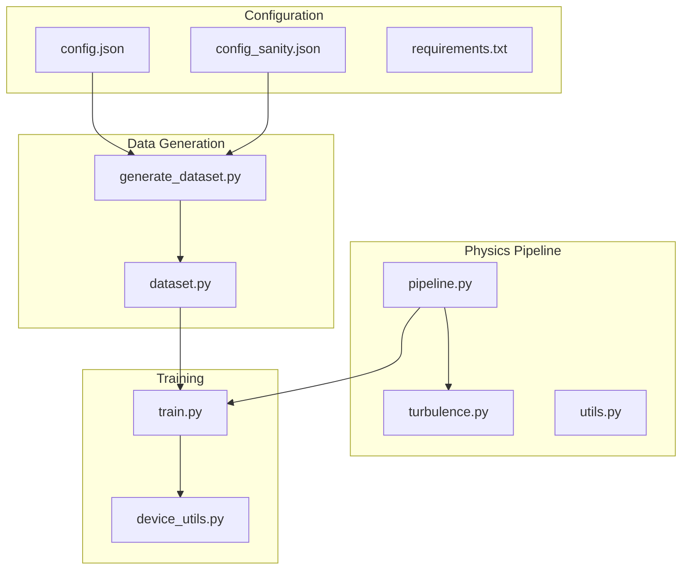
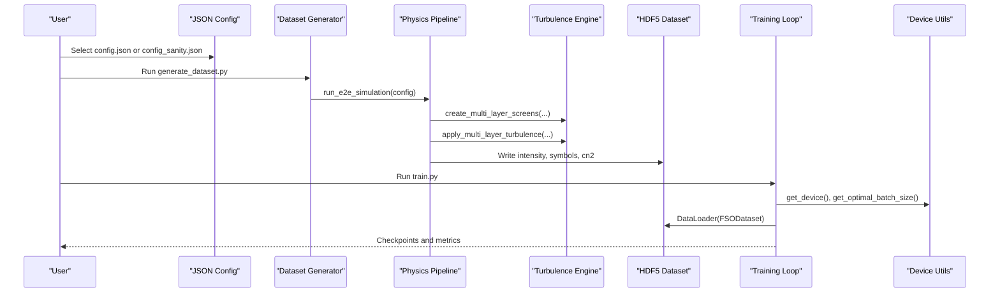
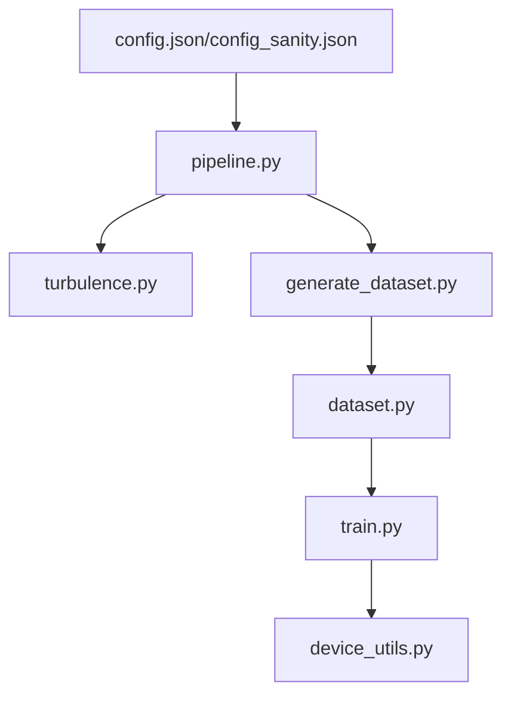

# Configuration and Optimization

<cite>
**Referenced Files in This Document**
- [README.md](file://README.md)
- [requirements.txt](file://models/CNN Trials/requirements.txt)
- [config.json](file://models/CNN Trials/data/configs/config.json)
- [config_sanity.json](file://models/CNN Trials/data/configs/config_sanity.json)
- [device_utils.py](file://models/CNN Trials/src/utils/device_utils.py)
- [pipeline.py](file://models/CNN Trials/physics/pipeline.py)
- [turbulence.py](file://models/CNN Trials/physics/turbulence.py)
- [generate_dataset.py](file://models/CNN Trials/src/data_gen/generate_dataset.py)
- [dataset.py](file://models/CNN Trials/src/utils/dataset.py)
- [train.py](file://models/CNN Trials/src/training/train.py)
- [utils.py](file://models/CNN Trials/src/utils/utils.py)
</cite>

## Table of Contents
1. [Introduction](#introduction)
2. [Project Structure](#project-structure)
3. [Core Components](#core-components)
4. [Architecture Overview](#architecture-overview)
5. [Detailed Component Analysis](#detailed-component-analysis)
6. [Dependency Analysis](#dependency-analysis)
7. [Performance Considerations](#performance-considerations)
8. [Troubleshooting Guide](#troubleshooting-guide)
9. [Conclusion](#conclusion)
10. [Appendices](#appendices)

## Introduction
This document explains the configuration management and system optimization strategies used in the FSO-OAM neural receiver project. It covers:
- JSON-based configuration system for dataset generation, physics simulation, and runtime behavior
- Turbulence parameter management for realistic channel modeling
- Grid and sampling configurations for numerical propagation
- Output formatting options for datasets and artifacts
- Device optimization strategies for CUDA, MPS, and CPU
- Performance monitoring, memory optimization, and hardware-specific tuning
- Practical examples and best practices for different deployment scenarios

## Project Structure
The project is organized around a physics-driven data generation pipeline and a deep learning training loop. Key areas:
- Physics simulation and channel modeling live under models/CNN Trials/physics
- Data generation and dataset utilities are under models/CNN Trials/src
- Training and evaluation scripts reside under models/CNN Trials/src/training and models/CNN Trials/src/evaluation
- Configuration files define dataset parameters, turbulence settings, and output formats

**Diagram sources**
- [config.json](file://models/CNN Trials/data/configs/config.json#L1-L136)
- [config_sanity.json](file://models/CNN Trials/data/configs/config_sanity.json#L1-L106)
- [requirements.txt](file://models/CNN Trials/requirements.txt#L1-L33)
- [pipeline.py](file://models/CNN Trials/physics/pipeline.py#L1-L717)
- [turbulence.py](file://models/CNN Trials/physics/turbulence.py#L1-L718)
- [generate_dataset.py](file://models/CNN Trials/src/data_gen/generate_dataset.py#L1-L175)
- [dataset.py](file://models/CNN Trials/src/utils/dataset.py#L1-L44)
- [train.py](file://models/CNN Trials/src/training/train.py#L1-L150)
- [device_utils.py](file://models/CNN Trials/src/utils/device_utils.py#L1-L217)

**Section sources**
- [README.md](file://README.md#L311-L350)

## Core Components
This section introduces the primary configuration domains and their roles.

- JSON configuration files define:
  - System parameters (wavelength, beam waist, distance, receiver diameter, total TX power, spatial modes, pilot parameters)
  - Turbulence parameters (Cn2 bounds, number of points, distribution, outer/inner scales, number of screens, model)
  - Dataset sizing (train/val/test counts, samples per Cn2)
  - Grid parameters (simulation grid size, output image size, oversampling, downsampling method)
  - Data format (input/output types/shapes, normalization)
  - Augmentation settings (rotation, translation, multiple realizations, noise addition)
  - Output settings (format, compression, metadata saving)
  - Random seed and verbosity

- Device utilities detect and optimize for CUDA, MPS, and CPU, including:
  - Automatic device selection
  - Benchmark tuning for CUDA
  - Memory-aware batch size and worker selection
  - Memory clearing and monitoring

- Physics pipeline integrates:
  - Turbulence layer generation and propagation
  - Attenuation and noise calculations
  - Channel estimation and equalization
  - End-to-end simulation results

- Data generation:
  - HDF5 dataset creation with configurable image sizes and augmentation
  - Resizing and normalization of intensity images
  - Metadata storage (Cn2, symbols, modes)

- Training:
  - Device-aware DataLoader configuration
  - Multi-head regression targets for complex symbols
  - Checkpointing and resume capability

**Section sources**
- [config.json](file://models/CNN Trials/data/configs/config.json#L1-L136)
- [config_sanity.json](file://models/CNN Trials/data/configs/config_sanity.json#L1-L106)
- [device_utils.py](file://models/CNN Trials/src/utils/device_utils.py#L15-L217)
- [pipeline.py](file://models/CNN Trials/physics/pipeline.py#L37-L440)
- [generate_dataset.py](file://models/CNN Trials/src/data_gen/generate_dataset.py#L23-L175)
- [dataset.py](file://models/CNN Trials/src/utils/dataset.py#L6-L44)
- [train.py](file://models/CNN Trials/src/training/train.py#L16-L150)

## Architecture Overview
The configuration-driven workflow connects physics simulation, dataset generation, and training.

**Diagram sources**
- [config.json](file://models/CNN Trials/data/configs/config.json#L1-L136)
- [config_sanity.json](file://models/CNN Trials/data/configs/config_sanity.json#L1-L106)
- [generate_dataset.py](file://models/CNN Trials/src/data_gen/generate_dataset.py#L57-L175)
- [pipeline.py](file://models/CNN Trials/physics/pipeline.py#L64-L440)
- [turbulence.py](file://models/CNN Trials/physics/turbulence.py#L210-L352)
- [dataset.py](file://models/CNN Trials/src/utils/dataset.py#L6-L44)
- [train.py](file://models/CNN Trials/src/training/train.py#L16-L150)
- [device_utils.py](file://models/CNN Trials/src/utils/device_utils.py#L15-L217)

## Detailed Component Analysis

### JSON Configuration System
The configuration system centralizes all runtime parameters in JSON files. Two representative configurations are provided:
- config.json: Production-like dataset with multiple spatial modes, pilot-enabled, and structured turbulence sampling
- config_sanity.json: Sanity-check dataset with minimal turbulence and simplified augmentation

Key configuration domains:
- system_parameters: Wavelength, beam waist, distance, receiver diameter, total TX power, spatial modes, pilot parameters
- turbulence_parameters: Cn2 bounds, distribution, number of screens, outer/inner scales, model
- dataset_size: Train/validation/test counts and samples-per-Cn2 strategy
- cn2_sampling_weights: Optional stratified weighting for Cn2 ranges
- grid_parameters: Simulation grid size, output image size, oversampling, downsampling method
- data_format: Input/output types, shapes, normalization method
- augmentation: Rotation, translation, multiple realizations, noise addition
- output: Dataset format (HDF5), compression, metadata flags
- random_seed and verbose

Effects on system behavior:
- Turbulence parameters directly impact the number and strength of phase screens and resulting channel distortion
- Grid parameters control numerical stability and fidelity of propagation
- Data format and augmentation influence model training dynamics and convergence
- Output settings determine dataset size and downstream processing costs

Best practices:
- Match grid oversampling to the expected inner scale resolution (see grid resolution checks)
- Align dataset sizes with computational budget and desired statistical robustness
- Use stratified Cn2 sampling weights to balance training difficulty across regimes
- Normalize inputs consistently to stabilize training

**Section sources**
- [config.json](file://models/CNN Trials/data/configs/config.json#L4-L136)
- [config_sanity.json](file://models/CNN Trials/data/configs/config_sanity.json#L4-L106)

### Turbulence Parameter Management
The turbulence engine computes phase screens and applies multi-layer propagation. Key parameters:
- Cn2 range and distribution: Controls the strength and spread of turbulence
- Outer/inner scales (L0, l0): Define the von Kármán spectrum and inner-scale resolution
- Number of screens: Balances accuracy and computational cost
- Model selection: Uniform or Hufnagel–Valley profiles for horizontal or vertical paths

Processing logic:
- Multi-layer screens integrate Cn2 profiles along the path
- Phase screens are generated with variance matching to theoretical expectations
- Propagation uses split-step Fourier with angular spectrum kernels
- Validation routines confirm PSD variance, Rytov variance scaling, and Fried parameter behavior

Guidance:
- Ensure grid resolution satisfies δ < l0/2 to resolve inner-scale effects
- Use sufficient screens for convergence (typically 10–20 per km)
- For strong turbulence, increase screens and consider higher oversampling

**Section sources**
- [turbulence.py](file://models/CNN Trials/physics/turbulence.py#L187-L257)
- [turbulence.py](file://models/CNN Trials/physics/turbulence.py#L261-L352)
- [turbulence.py](file://models/CNN Trials/physics/turbulence.py#L439-L517)

### Grid and Sampling Configurations
Grid configuration determines numerical accuracy and performance:
- n_grid_sim: Simulation grid size for propagation
- n_grid_output: Downsampled output image size for CNN inputs
- oversampling: Factor to ensure adequate Nyquist sampling
- downsampling_method: Interpolation method for resizing

Sampling strategies:
- samples_per_cn2: Controls dataset cardinality per Cn2 value
- Stratified sampling weights: Bias toward moderate or strong turbulence regimes

Optimization tips:
- Increase oversampling for high Cn2 or small l0 to improve inner-scale resolution
- Choose downsampling method based on fidelity vs. speed trade-offs
- Ensure output image size matches model input expectations

**Section sources**
- [config.json](file://models/CNN Trials/data/configs/config.json#L99-L119)
- [config_sanity.json](file://models/CNN Trials/data/configs/config_sanity.json#L69-L89)
- [generate_dataset.py](file://models/CNN Trials/src/data_gen/generate_dataset.py#L33-L56)

### Output Formatting Options
Datasets are stored in HDF5 with:
- intensity: Resized intensity images
- symbols: Complex symbols per mode
- cn2: Cn2 value per sample
- Attributes: Number of modes

Compression and metadata:
- Compression level and method can be tuned for storage vs. access speed
- Metadata flags control inclusion of turbulence parameters and other diagnostics

**Section sources**
- [config.json](file://models/CNN Trials/data/configs/config.json#L127-L133)
- [config_sanity.json](file://models/CNN Trials/data/configs/config_sanity.json#L97-L103)
- [generate_dataset.py](file://models/CNN Trials/src/data_gen/generate_dataset.py#L94-L163)
- [dataset.py](file://models/CNN Trials/src/utils/dataset.py#L6-L44)

### Device Optimization Strategies
Automatic device detection and optimization:
- Prefer MPS on Apple Silicon, CUDA when available, otherwise CPU
- Enable cuDNN benchmark for CUDA to accelerate convolutions
- Compute batch size and number of workers based on available memory and CPU cores
- Provide memory monitoring and clearing utilities

Hardware-specific recommendations:
- CUDA: Larger batch sizes and more workers; leverage benchmark tuning
- MPS: Conservative batch sizes due to shared memory; monitor memory pressure
- CPU: Minimal workers; consider smaller batch sizes and reduced image sizes

**Section sources**
- [device_utils.py](file://models/CNN Trials/src/utils/device_utils.py#L15-L103)
- [device_utils.py](file://models/CNN Trials/src/utils/device_utils.py#L106-L167)
- [device_utils.py](file://models/CNN Trials/src/utils/device_utils.py#L170-L189)
- [requirements.txt](file://models/CNN Trials/requirements.txt#L1-L33)

### End-to-End Simulation and Data Generation
The pipeline orchestrates:
- Transmitter initialization with spatial modes and pilot configuration
- Turbulence layer generation and propagation
- Attenuation and noise calculations
- Receiver processing and metrics collection
- Dataset export with resized intensity images and symbol targets

Integration points:
- Grid parameters from configuration inform simulation extents
- Turbulence parameters drive layer generation and propagation
- Output settings control dataset attributes and compression

**Section sources**
- [pipeline.py](file://models/CNN Trials/physics/pipeline.py#L64-L440)
- [generate_dataset.py](file://models/CNN Trials/src/data_gen/generate_dataset.py#L57-L175)

### Training and Evaluation Integration
Training:
- Device selection and optimization
- Multi-head regression targets for complex symbols
- Checkpointing and resume capability

Evaluation:
- Metrics computation (SER, BER)
- Visualization utilities for constellation diagrams

**Section sources**
- [train.py](file://models/CNN Trials/src/training/train.py#L16-L150)
- [utils.py](file://models/CNN Trials/src/utils/utils.py#L117-L162)

## Dependency Analysis
Configuration influences multiple subsystems. The following diagram shows key dependencies:

**Diagram sources**
- [config.json](file://models/CNN Trials/data/configs/config.json#L1-L136)
- [config_sanity.json](file://models/CNN Trials/data/configs/config_sanity.json#L1-L106)
- [pipeline.py](file://models/CNN Trials/physics/pipeline.py#L1-L717)
- [turbulence.py](file://models/CNN Trials/physics/turbulence.py#L1-L718)
- [generate_dataset.py](file://models/CNN Trials/src/data_gen/generate_dataset.py#L1-L175)
- [dataset.py](file://models/CNN Trials/src/utils/dataset.py#L1-L44)
- [train.py](file://models/CNN Trials/src/training/train.py#L1-L150)
- [device_utils.py](file://models/CNN Trials/src/utils/device_utils.py#L1-L217)

**Section sources**
- [config.json](file://models/CNN Trials/data/configs/config.json#L1-L136)
- [config_sanity.json](file://models/CNN Trials/data/configs/config_sanity.json#L1-L106)
- [pipeline.py](file://models/CNN Trials/physics/pipeline.py#L1-L717)
- [turbulence.py](file://models/CNN Trials/physics/turbulence.py#L1-L718)
- [generate_dataset.py](file://models/CNN Trials/src/data_gen/generate_dataset.py#L1-L175)
- [dataset.py](file://models/CNN Trials/src/utils/dataset.py#L1-L44)
- [train.py](file://models/CNN Trials/src/training/train.py#L1-L150)
- [device_utils.py](file://models/CNN Trials/src/utils/device_utils.py#L1-L217)

## Performance Considerations
- Turbulence modeling
  - Increase number of screens for stronger turbulence to improve convergence
  - Ensure grid resolution satisfies δ < l0/2 for accurate inner-scale resolution
  - Use stratified Cn2 sampling to balance training difficulty

- Grid and sampling
  - Oversampling improves accuracy but increases memory and compute
  - Downsample carefully to match model input expectations
  - Control samples_per_cn2 to manage dataset size and training time

- Device optimization
  - CUDA: Enable benchmark tuning and increase batch size cautiously
  - MPS: Use conservative batch sizes due to shared memory constraints
  - CPU: Minimize workers and batch size; consider smaller image sizes

- Data pipeline
  - HDF5 compression reduces storage but may slow reads; adjust compression level accordingly
  - Normalize inputs consistently to stabilize training

[No sources needed since this section provides general guidance]

## Troubleshooting Guide
Common configuration and performance issues:

- Grid resolution warnings
  - Symptom: Warning about δ exceeding l0/2
  - Action: Increase N or reduce D to satisfy δ < l0/2

- Excessive spread leading to NaN outputs
  - Symptom: NaN or zero intensity fields after propagation
  - Action: Reduce Cn2 or increase oversampling; validate beam sizes at receiver

- Memory pressure on MPS/CPU
  - Symptom: High memory usage or slowdown
  - Action: Reduce batch size; clear caches; monitor memory usage

- Dataset generation stalls or fails
  - Symptom: No samples saved or pipeline errors
  - Action: Verify HDF5 write permissions; ensure lgBeam availability; check turbulence parameters

- Training instability
  - Symptom: Exploding losses or poor convergence
  - Action: Adjust learning rate; reduce batch size; ensure consistent normalization

**Section sources**
- [turbulence.py](file://models/CNN Trials/physics/turbulence.py#L282-L288)
- [turbulence.py](file://models/CNN Trials/physics/turbulence.py#L390-L435)
- [device_utils.py](file://models/CNN Trials/src/utils/device_utils.py#L170-L189)
- [generate_dataset.py](file://models/CNN Trials/src/data_gen/generate_dataset.py#L121-L131)
- [train.py](file://models/CNN Trials/src/training/train.py#L67-L82)

## Conclusion
This configuration and optimization guide demonstrates how JSON-based parameters, turbulence modeling, grid design, and device-aware training combine to deliver robust FSO-OAM neural receiver performance. By tuning turbulence sampling, grid resolution, and device settings, practitioners can achieve stable training and reliable inference across diverse hardware platforms.

[No sources needed since this section summarizes without analyzing specific files]

## Appendices

### Configuration Reference Summary
- System parameters: Wavelength, beam waist, distance, receiver diameter, total TX power, spatial modes, pilot parameters
- Turbulence parameters: Cn2 bounds, distribution, number of screens, outer/inner scales, model
- Dataset sizing: Train/val/test counts, samples-per-Cn2
- Grid parameters: Simulation grid size, output image size, oversampling, downsampling method
- Data format: Input/output types, shapes, normalization
- Augmentation: Rotation, translation, multiple realizations, noise addition
- Output: Dataset format, compression, metadata flags
- Random seed and verbosity

**Section sources**
- [config.json](file://models/CNN Trials/data/configs/config.json#L4-L136)
- [config_sanity.json](file://models/CNN Trials/data/configs/config_sanity.json#L4-L106)

### Deployment Scenarios and Recommendations
- Strong turbulence environments
  - Increase number of screens and oversampling
  - Use stratified Cn2 sampling weights
  - Monitor grid resolution and adjust N/D accordingly

- Resource-constrained environments (MPS/CPU)
  - Use conservative batch sizes and fewer workers
  - Reduce output image size if feasible
  - Enable compression for datasets to save storage

- High-throughput training (CUDA)
  - Enable benchmark tuning
  - Increase batch size and workers
  - Use larger simulation grids cautiously

**Section sources**
- [device_utils.py](file://models/CNN Trials/src/utils/device_utils.py#L106-L167)
- [requirements.txt](file://models/CNN Trials/requirements.txt#L1-L33)