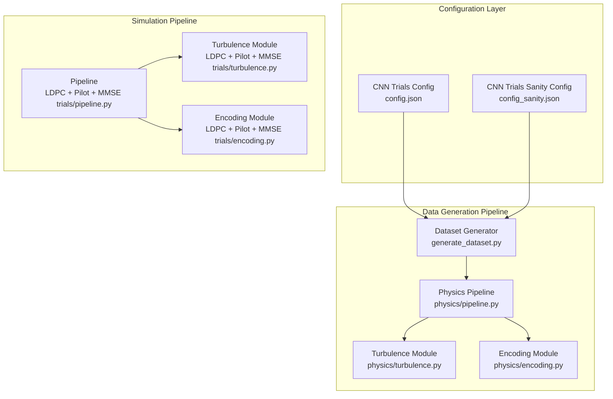
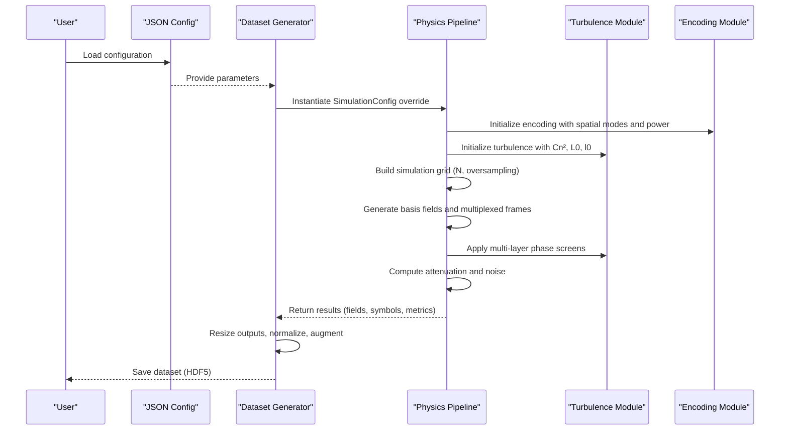
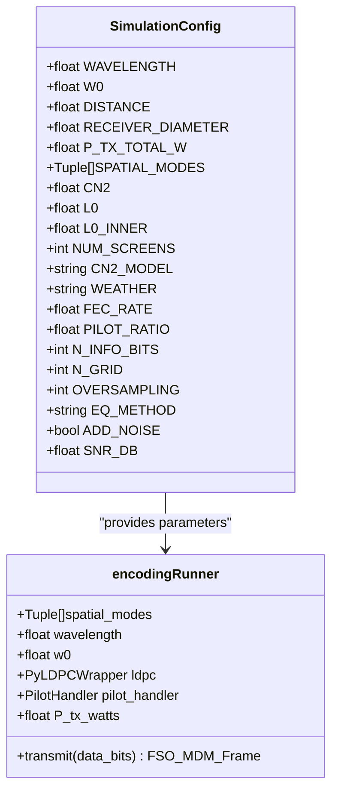
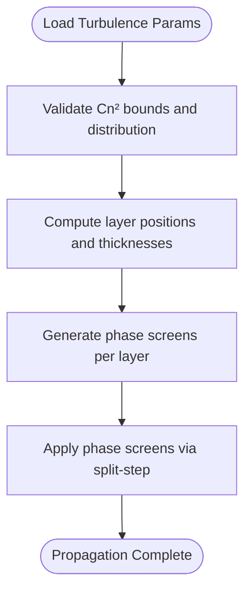
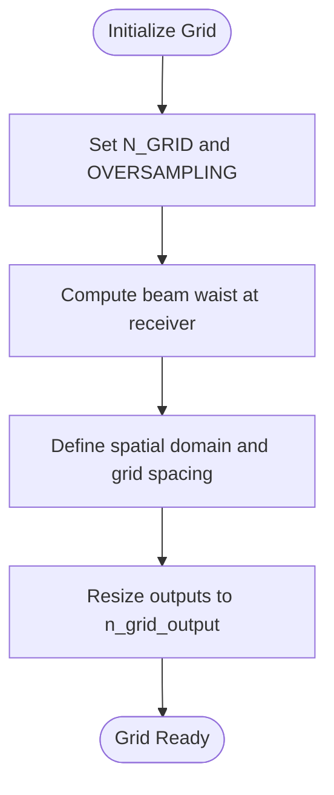
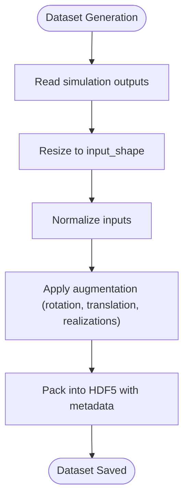
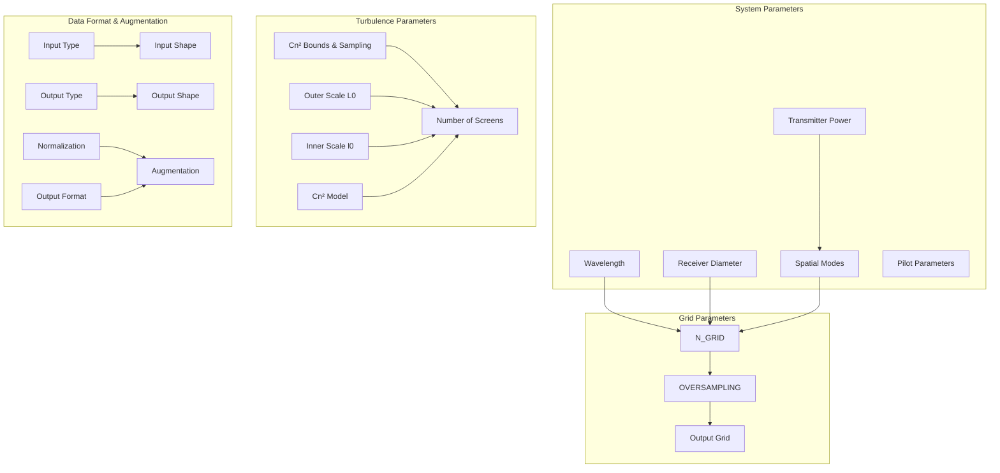

# Configuration Management

<cite>
**Referenced Files in This Document**
- [config.json](file://models/CNN Trials/data/configs/config.json)
- [config_sanity.json](file://models/CNN Trials/data/configs/config_sanity.json)
- [generate_dataset.py](file://models/CNN Trials/src/data_gen/generate_dataset.py)
- [pipeline.py](file://models/LDPC + Pilot + MMSE trials/pipeline.py)
- [pipeline.py](file://models/CNN Trials/physics/pipeline.py)
- [turbulence.py](file://models/LDPC + Pilot + MMSE trials/turbulence.py)
- [turbulence.py](file://models/CNN Trials/physics/turbulence.py)
- [encoding.py](file://models/LDPC + Pilot + MMSE trials/encoding.py)
- [encoding.py](file://models/CNN Trials/physics/encoding.py)
</cite>

## Table of Contents
1. [Introduction](#introduction)
2. [Project Structure](#project-structure)
3. [Core Components](#core-components)
4. [Architecture Overview](#architecture-overview)
5. [Detailed Component Analysis](#detailed-component-analysis)
6. [Dependency Analysis](#dependency-analysis)
7. [Performance Considerations](#performance-considerations)
8. [Troubleshooting Guide](#troubleshooting-guide)
9. [Conclusion](#conclusion)

## Introduction
This document explains the configuration management system used in the Free-Space Optics Orbital Angular Momentum (FSO-OAM) simulation pipeline. It covers how parameters are organized, validated, and consumed across the data generation and end-to-end simulation workflows. The focus areas include:
- System parameters: wavelength, transmitter power, receiver diameter, spatial modes, and pilot configuration
- Turbulence parameters: Cn² distributions, atmospheric models, layer configurations, and screen generation
- Grid parameters: simulation dimensions, oversampling factors, and output resolutions
- Data format and augmentation settings: input/output types, normalization, and compression
- Practical guidance for configuration inheritance, interdependencies, and best practices

## Project Structure
The configuration system spans two major pipelines:
- CNN Trials: focused on dataset generation and training-ready HDF5 datasets
- LDPC + Pilot + MMSE trials: focused on end-to-end simulation and performance analysis

Key configuration locations:
- JSON configuration files define dataset and simulation parameters
- Python modules implement parameter validation and consumption
- Data generation scripts orchestrate dataset creation using configuration overrides

**Diagram sources**
- [config.json](file://models/CNN Trials/data/configs/config.json#L1-L136)
- [config_sanity.json](file://models/CNN Trials/data/configs/config_sanity.json#L1-L106)
- [generate_dataset.py](file://models/CNN Trials/src/data_gen/generate_dataset.py#L57-L164)
- [pipeline.py](file://models/CNN Trials/physics/pipeline.py#L64-L439)
- [turbulence.py](file://models/CNN Trials/physics/turbulence.py#L210-L352)
- [encoding.py](file://models/CNN Trials/physics/encoding.py#L544-L684)
- [pipeline.py](file://models/LDPC + Pilot + MMSE trials/pipeline.py#L64-L439)
- [turbulence.py](file://models/LDPC + Pilot + MMSE trials/turbulence.py#L197-L339)
- [encoding.py](file://models/LDPC + Pilot + MMSE trials/encoding.py#L544-L684)

**Section sources**
- [config.json](file://models/CNN Trials/data/configs/config.json#L1-L136)
- [config_sanity.json](file://models/CNN Trials/data/configs/config_sanity.json#L1-L106)
- [generate_dataset.py](file://models/CNN Trials/src/data_gen/generate_dataset.py#L57-L164)
- [pipeline.py](file://models/LDPC + Pilot + MMSE trials/pipeline.py#L64-L439)
- [pipeline.py](file://models/CNN Trials/physics/pipeline.py#L64-L439)
- [turbulence.py](file://models/CNN Trials/physics/turbulence.py#L210-L352)
- [turbulence.py](file://models/LDPC + Pilot + MMSE trials/turbulence.py#L197-L339)
- [encoding.py](file://models/CNN Trials/physics/encoding.py#L544-L684)
- [encoding.py](file://models/LDPC + Pilot + MMSE trials/encoding.py#L544-L684)

## Core Components
This section outlines the primary configuration categories and their roles in the data generation and simulation pipelines.

- System parameters
  - Wavelength: central wavelength for electromagnetic propagation
  - Transmitter power: total launched power across spatial modes
  - Receiver diameter: effective aperture size for collecting the optical field
  - Spatial modes: list of (p, l) Laguerre-Gaussian modes to transmit
  - Pilot parameters: enable/disable pilot insertion, pilot mode, and pilot power ratio

- Turbulence parameters
  - Cn² bounds and sampling: minimum and maximum Cn², number of points, and distribution type
  - Outer and inner scales: L0 (outer scale) and l0 (inner scale)
  - Number of screens: number of phase screens for multi-layer propagation
  - Cn² model: atmospheric profile model (e.g., uniform, hufnagel_valley)

- Dataset sizing and sampling
  - Train/validation/test sizes
  - Samples per Cn² point: either automatic or fixed count
  - Cn² sampling weights: stratified weighting across turbulence regimes

- Grid parameters
  - Simulation grid size (n_grid_sim) and output grid size (n_grid_output)
  - Oversampling factor and downsampling method

- Data format and augmentation
  - Input type (intensity), channels, and input shape
  - Output type (symbols) and shape
  - Normalization options for inputs
  - Augmentation: rotation range, translation range, multiple realizations, and noise addition
  - Output format: HDF5 with compression and metadata saving options

- Additional simulation controls
  - Random seed and verbosity
  - Noise enablement and SNR
  - Equalizer method and power probe diagnostics

**Section sources**
- [config.json](file://models/CNN Trials/data/configs/config.json#L4-L136)
- [config_sanity.json](file://models/CNN Trials/data/configs/config_sanity.json#L4-L106)
- [generate_dataset.py](file://models/CNN Trials/src/data_gen/generate_dataset.py#L61-L93)

## Architecture Overview
The configuration system integrates three layers:
- Configuration definition: JSON files specify parameter sets for different scenarios
- Configuration ingestion: Python modules parse and validate parameters
- Configuration application: Parameters drive simulation setup, grid generation, and data augmentation

**Diagram sources**
- [config.json](file://models/CNN Trials/data/configs/config.json#L1-L136)
- [generate_dataset.py](file://models/CNN Trials/src/data_gen/generate_dataset.py#L57-L164)
- [pipeline.py](file://models/CNN Trials/physics/pipeline.py#L64-L439)
- [turbulence.py](file://models/CNN Trials/physics/turbulence.py#L210-L352)
- [encoding.py](file://models/CNN Trials/physics/encoding.py#L544-L684)

## Detailed Component Analysis

### System Parameters Configuration
System parameters define the physical setup of the FSO link and transmitter configuration.

- Wavelength: central wavelength used for propagation and beam calculations
- Transmitter power: total launched power; distributed across spatial modes
- Receiver diameter: aperture radius affects geometric loss and collected power
- Spatial modes: list of (p, l) tuples defining the OAM modes
- Pilot parameters: optional pilot-enabled transmission with configurable mode and power ratio

These parameters are consumed during:
- Encoding initialization to build LG beams and multiplexed frames
- Grid sizing to ensure adequate sampling of the largest beam waist
- Attenuation and collection efficiency calculations

**Diagram sources**
- [pipeline.py](file://models/CNN Trials/physics/pipeline.py#L37-L62)
- [encoding.py](file://models/CNN Trials/physics/encoding.py#L544-L598)

**Section sources**
- [config.json](file://models/CNN Trials/data/configs/config.json#L4-L52)
- [config_sanity.json](file://models/CNN Trials/data/configs/config_sanity.json#L4-L51)
- [pipeline.py](file://models/CNN Trials/physics/pipeline.py#L37-L62)
- [encoding.py](file://models/CNN Trials/physics/encoding.py#L544-L598)

### Turbulence Parameters Configuration
Turbulence parameters control atmospheric modeling and multi-layer phase screen generation.

- Cn² bounds and sampling: cn2_min, cn2_max, num_cn2_points, cn2_distribution
- Layer configuration: L0 (outer scale), l0_inner (inner scale), num_screens
- Cn² model: horizontal uniform or vertical hufnagel_valley profile
- Cn² sampling weights: stratified weights across turbulence regimes

These parameters are consumed during:
- Multi-layer screen creation for split-step propagation
- Phase screen generation with appropriate variance matching
- Rytov variance and Fried parameter computations

**Diagram sources**
- [config.json](file://models/CNN Trials/data/configs/config.json#L53-L62)
- [config_sanity.json](file://models/CNN Trials/data/configs/config_sanity.json#L53-L62)
- [turbulence.py](file://models/CNN Trials/physics/turbulence.py#L210-L257)
- [turbulence.py](file://models/LDPC + Pilot + MMSE trials/turbulence.py#L197-L244)

**Section sources**
- [config.json](file://models/CNN Trials/data/configs/config.json#L53-L62)
- [config_sanity.json](file://models/CNN Trials/data/configs/config_sanity.json#L53-L62)
- [turbulence.py](file://models/CNN Trials/physics/turbulence.py#L210-L257)
- [turbulence.py](file://models/LDPC + Pilot + MMSE trials/turbulence.py#L197-L244)

### Grid Parameters Configuration
Grid parameters define the simulation domain and output resolution.

- n_grid_sim: simulation grid size for accurate field propagation
- n_grid_output: output grid size for dataset images
- oversampling: oversampling factor to resolve fine-scale structures
- downsampling_method: method used to resize outputs (e.g., bilinear)

These parameters influence:
- Grid construction for field propagation
- Basis field scaling and total power normalization
- Output resizing and normalization in dataset generation

**Diagram sources**
- [pipeline.py](file://models/CNN Trials/physics/pipeline.py#L98-L116)
- [generate_dataset.py](file://models/CNN Trials/src/data_gen/generate_dataset.py#L33-L56)

**Section sources**
- [config.json](file://models/CNN Trials/data/configs/config.json#L99-L104)
- [config_sanity.json](file://models/CNN Trials/data/configs/config_sanity.json#L69-L74)
- [pipeline.py](file://models/CNN Trials/physics/pipeline.py#L98-L116)
- [generate_dataset.py](file://models/CNN Trials/src/data_gen/generate_dataset.py#L33-L56)

### Data Format and Augmentation Configuration
Data format and augmentation settings define how datasets are structured and transformed.

- Input type: intensity
- Input channels: 1
- Input shape: [height, width] for training
- Output type: symbols (complex-valued QPSK symbols)
- Output shape: [n_modes, 2] per symbol
- Normalization: enable/disable and method (per-sample)
- Augmentation: rotation range, translation range, multiple realizations, noise addition
- Output format: HDF5 with compression and metadata saving

These settings are enforced during:
- Dataset generation: resizing, normalization, augmentation, and HDF5 writing
- Data loaders: normalization and augmentation policies

**Diagram sources**
- [config.json](file://models/CNN Trials/data/configs/config.json#L105-L126)
- [config_sanity.json](file://models/CNN Trials/data/configs/config_sanity.json#L75-L96)
- [generate_dataset.py](file://models/CNN Trials/src/data_gen/generate_dataset.py#L57-L164)

**Section sources**
- [config.json](file://models/CNN Trials/data/configs/config.json#L105-L126)
- [config_sanity.json](file://models/CNN Trials/data/configs/config_sanity.json#L75-L96)
- [generate_dataset.py](file://models/CNN Trials/src/data_gen/generate_dataset.py#L57-L164)

### Configuration Inheritance and Overrides
Configuration inheritance allows reusing base parameter sets while overriding specific values for specialized scenarios.

- Base configuration: defines common defaults for a scenario
- Derived configuration: overrides selected parameters (e.g., Cn² range, grid size, augmentation)
- Programmatic overrides: runtime modifications for experiments (e.g., dataset generation)

Practical examples:
- Sanity checks: minimal turbulence and reduced augmentation
- Dataset generation: smaller grid and oversampling for speed
- Simulation sweeps: dynamic Cn² selection and power probe toggles

**Section sources**
- [config_sanity.json](file://models/CNN Trials/data/configs/config_sanity.json#L1-L106)
- [generate_dataset.py](file://models/CNN Trials/src/data_gen/generate_dataset.py#L61-L93)
- [pipeline.py](file://models/LDPC + Pilot + MMSE trials/pipeline.py#L617-L659)

## Dependency Analysis
Configuration parameters depend on each other and influence downstream computation.

**Diagram sources**
- [config.json](file://models/CNN Trials/data/configs/config.json#L4-L136)
- [config_sanity.json](file://models/CNN Trials/data/configs/config_sanity.json#L4-L106)
- [pipeline.py](file://models/CNN Trials/physics/pipeline.py#L98-L116)
- [turbulence.py](file://models/CNN Trials/physics/turbulence.py#L210-L257)
- [generate_dataset.py](file://models/CNN Trials/src/data_gen/generate_dataset.py#L33-L56)

**Section sources**
- [config.json](file://models/CNN Trials/data/configs/config.json#L4-L136)
- [config_sanity.json](file://models/CNN Trials/data/configs/config_sanity.json#L4-L106)
- [pipeline.py](file://models/CNN Trials/physics/pipeline.py#L98-L116)
- [turbulence.py](file://models/CNN Trials/physics/turbulence.py#L210-L257)
- [generate_dataset.py](file://models/CNN Trials/src/data_gen/generate_dataset.py#L33-L56)

## Performance Considerations
- Grid sizing: larger N_GRID and higher oversampling improve accuracy but increase compute cost
- Number of screens: more screens improve statistical convergence of turbulence effects
- Augmentation: multiple realizations and noise addition increase dataset size and training robustness
- Compression: HDF5 compression reduces storage but may impact I/O performance
- Normalization: per-sample normalization can stabilize training but requires careful application

[No sources needed since this section provides general guidance]

## Troubleshooting Guide
Common configuration-related issues and resolutions:

- Invalid Cn² range or distribution
  - Ensure cn2_min < cn2_max and num_cn2_points > 0
  - Verify cn2_distribution is supported (e.g., logarithmic, linear)
  - Check cn2_model compatibility with vertical/horizontal link assumptions

- Grid resolution warnings
  - If δ > l0/2, consider increasing N_GRID or reducing D to resolve inner scale effects
  - Adjust oversampling to meet inner scale criteria

- Pilot and frame length mismatches
  - Ensure pilot positions do not exceed frame length
  - Increase N_INFO_BITS to accommodate pilot overhead

- Dataset generation failures
  - Verify output HDF5 paths and permissions
  - Confirm input_shape matches expected network input

- Simulation runtime errors
  - Validate spatial modes exist and LG beam generation succeeds
  - Check LDPC parameters (n, rate, dv, dc) for feasibility

**Section sources**
- [turbulence.py](file://models/CNN Trials/physics/turbulence.py#L282-L288)
- [pipeline.py](file://models/CNN Trials/physics/pipeline.py#L183-L191)
- [generate_dataset.py](file://models/CNN Trials/src/data_gen/generate_dataset.py#L98-L164)

## Conclusion
The configuration management system provides a structured approach to defining, validating, and applying parameters across the FSO-OAM simulation and dataset generation workflows. By organizing parameters into logical categories and enforcing dependencies, the system supports reproducible experiments, efficient data generation, and accurate performance analysis. Adhering to best practices for grid sizing, turbulence modeling, and augmentation ensures reliable results across diverse operational scenarios.