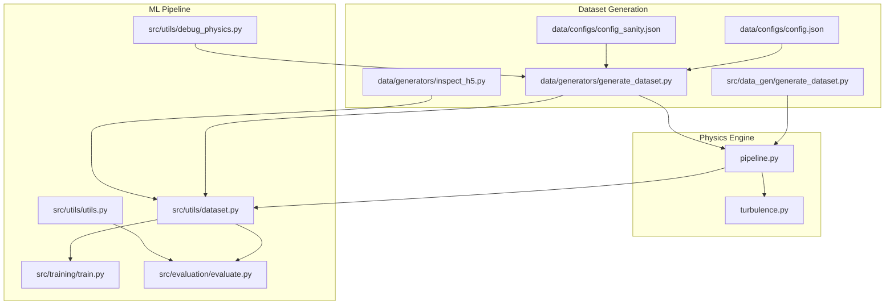
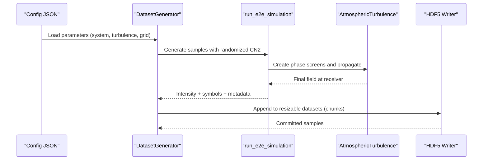
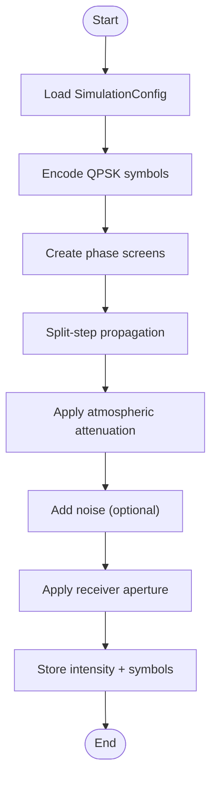
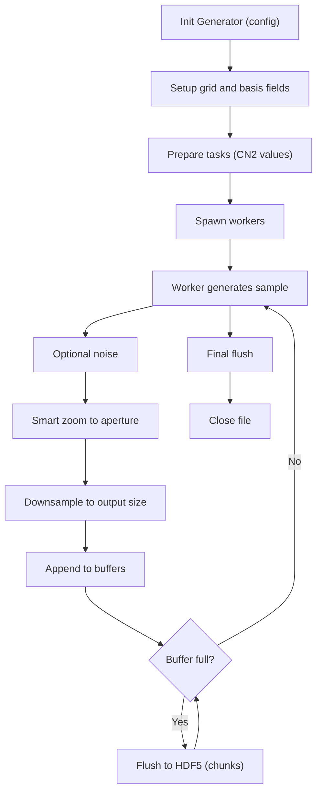
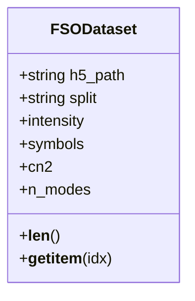
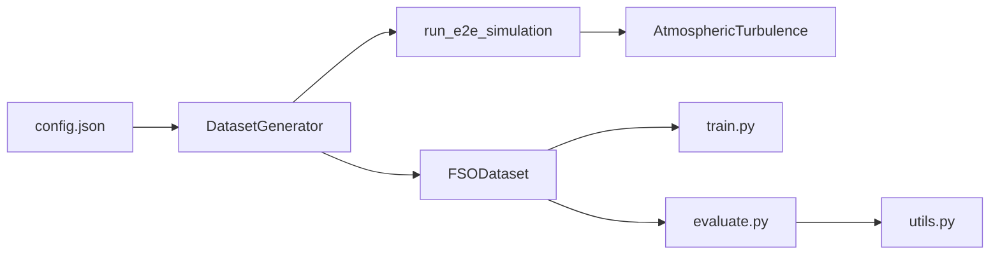

# Data Management

<cite>
**Referenced Files in This Document**
- [generate_dataset.py](file://models/CNN Trials/src/data_gen/generate_dataset.py)
- [generate_dataset.py](file://models/CNN Trials/data/generators/generate_dataset.py)
- [dataset.py](file://models/CNN Trials/src/utils/dataset.py)
- [turbulence.py](file://models/CNN Trials/physics/turbulence.py)
- [pipeline.py](file://models/CNN Trials/physics/pipeline.py)
- [config.json](file://models/CNN Trials/data/configs/config.json)
- [config_sanity.json](file://models/CNN Trials/data/configs/config_sanity.json)
- [utils.py](file://models/CNN Trials/src/utils/utils.py)
- [debug_physics.py](file://models/CNN Trials/src/utils/debug_physics.py)
- [inspect_h5.py](file://models/CNN Trials/data/generators/inspect_h5.py)
- [train.py](file://models/CNN Trials/src/training/train.py)
- [evaluate.py](file://models/CNN Trials/src/evaluation/evaluate.py)
- [README.md](file://README.md)
- [Throughput_Analysis.md](file://models/CNN Trials/outputs/reports/Throughput_Analysis.md)
</cite>

## Table of Contents
1. [Introduction](#introduction)
2. [Project Structure](#project-structure)
3. [Core Components](#core-components)
4. [Architecture Overview](#architecture-overview)
5. [Detailed Component Analysis](#detailed-component-analysis)
6. [Dependency Analysis](#dependency-analysis)
7. [Performance Considerations](#performance-considerations)
8. [Troubleshooting Guide](#troubleshooting-guide)
9. [Conclusion](#conclusion)
10. [Appendices](#appendices)

## Introduction
This document explains the end-to-end data management pipeline that transforms physics simulations into a synthetic dataset suitable for machine learning training. It covers:
- Synthetic dataset generation with configurable turbulence parameters
- Smart zoom cropping to improve effective resolution
- HDF5 storage optimization and chunking
- Dataset generation workflow, memory management, and data loading utilities
- Examples of configuration parameters, data formats, and performance optimizations
- Data validation, quality control, and troubleshooting
- How simulation parameters relate to dataset characteristics

## Project Structure
The data management system spans three major areas:
- Physics simulation engine (turbulence propagation, LG beam generation, channel modeling)
- Dataset generation (multiprocessing, smart zoom, HDF5 I/O)
- ML training and evaluation (PyTorch dataset, loaders, metrics)

**Diagram sources**
- [turbulence.py](file://models/CNN Trials/physics/turbulence.py#L1-L718)
- [pipeline.py](file://models/CNN Trials/physics/pipeline.py#L1-L717)
- [generate_dataset.py](file://models/CNN Trials/src/data_gen/generate_dataset.py#L1-L175)
- [generate_dataset.py](file://models/CNN Trials/data/generators/generate_dataset.py#L1-L598)
- [config.json](file://models/CNN Trials/data/configs/config.json#L1-L136)
- [config_sanity.json](file://models/CNN Trials/data/configs/config_sanity.json#L1-L106)
- [dataset.py](file://models/CNN Trials/src/utils/dataset.py#L1-L44)
- [train.py](file://models/CNN Trials/src/training/train.py#L1-L150)
- [evaluate.py](file://models/CNN Trials/src/evaluation/evaluate.py#L1-L315)
- [utils.py](file://models/CNN Trials/src/utils/utils.py#L1-L318)
- [debug_physics.py](file://models/CNN Trials/src/utils/debug_physics.py#L1-L99)
- [inspect_h5.py](file://models/CNN Trials/data/generators/inspect_h5.py#L1-L47)

**Section sources**
- [README.md](file://README.md#L311-L350)

## Core Components
- Physics simulation engine: Implements split-step propagation, phase screens, and atmospheric turbulence modeling.
- Dataset generators: Two implementations—one lightweight wrapper and one optimized for multiprocessing and chunked I/O.
- PyTorch dataset loader: Loads HDF5 datasets into memory for training.
- Utilities: QPSK mapping, LLR computation, SER/BER metrics, and visualization helpers.
- Configuration: JSON-driven parameters for system, turbulence, grid, data format, augmentation, and output.

**Section sources**
- [turbulence.py](file://models/CNN Trials/physics/turbulence.py#L1-L718)
- [pipeline.py](file://models/CNN Trials/physics/pipeline.py#L1-L717)
- [generate_dataset.py](file://models/CNN Trials/src/data_gen/generate_dataset.py#L1-L175)
- [generate_dataset.py](file://models/CNN Trials/data/generators/generate_dataset.py#L1-L598)
- [dataset.py](file://models/CNN Trials/src/utils/dataset.py#L1-L44)
- [utils.py](file://models/CNN Trials/src/utils/utils.py#L1-L318)
- [config.json](file://models/CNN Trials/data/configs/config.json#L1-L136)
- [config_sanity.json](file://models/CNN Trials/data/configs/config_sanity.json#L1-L106)

## Architecture Overview
The pipeline begins with configurable system and turbulence parameters, proceeds through physics simulation, and ends with HDF5 storage and PyTorch training.

**Diagram sources**
- [generate_dataset.py](file://models/CNN Trials/data/generators/generate_dataset.py#L279-L528)
- [pipeline.py](file://models/CNN Trials/physics/pipeline.py#L64-L439)
- [turbulence.py](file://models/CNN Trials/physics/turbulence.py#L261-L352)

## Detailed Component Analysis

### Physics Simulation Engine
- Turbulence modeling: Generates von Kármán phase screens, multi-layer propagation, and validates against literature expectations.
- End-to-end pipeline: Encodes QPSK symbols, propagates through turbulence, applies attenuation and noise, and stores full sequences for dataset generation.

**Diagram sources**
- [pipeline.py](file://models/CNN Trials/physics/pipeline.py#L64-L439)
- [turbulence.py](file://models/CNN Trials/physics/turbulence.py#L261-L352)

**Section sources**
- [turbulence.py](file://models/CNN Trials/physics/turbulence.py#L108-L352)
- [pipeline.py](file://models/CNN Trials/physics/pipeline.py#L37-L439)

### Dataset Generators
Two implementations are provided:
- Lightweight generator: Iterates over samples, resizes images, and writes to HDF5.
- Optimized generator: Uses multiprocessing, worker initialization, smart zoom cropping, chunked I/O, and optional noise augmentation.

Key features of the optimized generator:
- Smart zoom cropping: Crops to the receiver aperture before downsampling to increase effective resolution.
- Multiprocessing: Worker pools with per-process seeding for reproducibility.
- Chunked I/O: Writes in batches to reduce memory pressure and improve throughput.
- Compression: GZIP compression with configurable level.

**Diagram sources**
- [generate_dataset.py](file://models/CNN Trials/data/generators/generate_dataset.py#L279-L549)

**Section sources**
- [generate_dataset.py](file://models/CNN Trials/src/data_gen/generate_dataset.py#L23-L175)
- [generate_dataset.py](file://models/CNN Trials/data/generators/generate_dataset.py#L1-L598)

### HDF5 Storage and Memory Management
- Resizable datasets with maxshape for unlimited growth.
- Chunked datasets with gzip compression to balance I/O speed and storage.
- Buffered writes to minimize memory footprint during generation.
- Attributes store dataset metadata (split, shapes, modes, CN2 ranges).

Practical tips:
- Choose chunk sizes aligned to typical batch sizes for efficient reads.
- Use compression level 4–6 for a good balance of speed and compression.
- Monitor dataset attributes to validate dataset characteristics.

**Section sources**
- [generate_dataset.py](file://models/CNN Trials/data/generators/generate_dataset.py#L463-L490)
- [generate_dataset.py](file://models/CNN Trials/src/data_gen/generate_dataset.py#L94-L163)

### Data Loading Utilities
- PyTorch Dataset: Loads entire arrays into memory from HDF5 for fast training.
- Utility functions: QPSK mapping, LLR computation, SER/BER metrics, and tensor conversions.

**Diagram sources**
- [dataset.py](file://models/CNN Trials/src/utils/dataset.py#L6-L44)

**Section sources**
- [dataset.py](file://models/CNN Trials/src/utils/dataset.py#L1-L44)
- [utils.py](file://models/CNN Trials/src/utils/utils.py#L16-L210)

### Configuration Parameters and Data Formats
- System parameters: Wavelength, beam waist, distance, receiver diameter, total TX power, spatial modes, pilot parameters.
- Turbulence parameters: CN2 range, number of CN2 points, outer/inner scales, number of screens, CN2 profile model.
- Grid parameters: Simulation grid size, output grid size, oversampling, downsampling method.
- Data format: Input type (intensity), channels, output type (symbols), normalization settings.
- Augmentation: Noise addition, rotation/translation ranges, multiple realizations.
- Output: HDF5 format, compression, metadata saving.

Examples of key parameters:
- CN2 sampling: logarithmic spacing across [1e-18, 1e-13] with 15 points.
- Grid: N_sim=512, N_out=128, oversampling=2, bilinear downsampling.
- Pilot: enabled with 20% power ratio.

**Section sources**
- [config.json](file://models/CNN Trials/data/configs/config.json#L1-L136)
- [config_sanity.json](file://models/CNN Trials/data/configs/config_sanity.json#L1-L106)

### Relationship Between Simulation Parameters and Dataset Characteristics
- CN2 controls turbulence severity; stronger turbulence increases speckle activity and inter-modal crosstalk, affecting symbol recovery difficulty.
- Grid size and oversampling determine whether beam tails are captured; insufficient grid clips high-order modes.
- Receiver aperture cropping improves effective resolution by focusing on the beam region.
- Downsampling method affects aliasing and noise sensitivity; bilinear generally preserves more structure than nearest-neighbor.

**Section sources**
- [pipeline.py](file://models/CNN Trials/physics/pipeline.py#L37-L117)
- [generate_dataset.py](file://models/CNN Trials/data/generators/generate_dataset.py#L71-L106)

## Dependency Analysis
The dataset generation depends on the physics pipeline and turbulence modules. The training and evaluation depend on the PyTorch dataset loader and utility functions.

**Diagram sources**
- [config.json](file://models/CNN Trials/data/configs/config.json#L1-L136)
- [generate_dataset.py](file://models/CNN Trials/data/generators/generate_dataset.py#L279-L528)
- [pipeline.py](file://models/CNN Trials/physics/pipeline.py#L64-L439)
- [turbulence.py](file://models/CNN Trials/physics/turbulence.py#L108-L352)
- [dataset.py](file://models/CNN Trials/src/utils/dataset.py#L1-L44)
- [train.py](file://models/CNN Trials/src/training/train.py#L1-L150)
- [evaluate.py](file://models/CNN Trials/src/evaluation/evaluate.py#L1-L315)
- [utils.py](file://models/CNN Trials/src/utils/utils.py#L1-L318)

**Section sources**
- [generate_dataset.py](file://models/CNN Trials/data/generators/generate_dataset.py#L279-L528)
- [pipeline.py](file://models/CNN Trials/physics/pipeline.py#L64-L439)
- [dataset.py](file://models/CNN Trials/src/utils/dataset.py#L1-L44)

## Performance Considerations
- Multiprocessing: Use all available cores; initialize worker RNG seeds to avoid collisions.
- Chunked I/O: Tune chunk size to batch size for optimal read/write throughput.
- Compression: GZIP level 4–6 balances speed and storage; consider no compression for fastest generation.
- Smart zoom cropping: Reduces empty space and improves effective resolution; ensure aperture mask captures the beam.
- Downsampling: Prefer bilinear for smoother transitions; nearest-neighbor for sharp edges.
- Memory management: The PyTorch dataset loads entire arrays into RAM; ensure sufficient memory for large datasets.

[No sources needed since this section provides general guidance]

## Troubleshooting Guide
Common issues and resolutions:
- NaNs in intensity: Check for invalid turbulence parameters or grid undersampling; validate phase screen variance.
- Empty or clipped beams: Increase grid size or oversampling; verify receiver aperture radius.
- Poor resolution after downsampling: Use smart zoom cropping; adjust output grid size.
- Excessive memory usage: Switch to chunked I/O; reduce batch size; disable full-array loading in dataset.
- Inconsistent results across runs: Seed RNG in both main process and workers; verify configuration consistency.
- Dataset inspection: Use the provided inspector to validate shapes, ranges, and presence of NaNs.

Validation utilities:
- Turbulence diagnostics: Validate phase screen variance and Rytov variance against theory.
- Dataset inspection: Confirm shapes, dtypes, and value ranges; visualize first samples.

**Section sources**
- [turbulence.py](file://models/CNN Trials/physics/turbulence.py#L439-L517)
- [debug_physics.py](file://models/CNN Trials/src/utils/debug_physics.py#L1-L99)
- [inspect_h5.py](file://models/CNN Trials/data/generators/inspect_h5.py#L1-L47)

## Conclusion
The data management system integrates a robust physics simulation engine with efficient dataset generation and PyTorch training. By configuring turbulence parameters, optimizing grid sizing and cropping, and leveraging chunked I/O and compression, the pipeline produces high-quality synthetic datasets that enable reliable ML training for OAM beam recovery in atmospheric turbulence.

[No sources needed since this section summarizes without analyzing specific files]

## Appendices

### A. Configuration Parameter Reference
- System parameters: Wavelength, beam waist, distance, receiver diameter, total TX power, spatial modes, pilot parameters.
- Turbulence parameters: CN2 min/max, number of CN2 points, L0, l0_inner, number of screens, CN2 model.
- Grid parameters: N_sim, N_out, oversampling, downsampling method.
- Data format: Input/output types, shapes, normalization.
- Augmentation: Noise addition, rotation/translation ranges, multiple realizations.
- Output: HDF5 format, compression, metadata.

**Section sources**
- [config.json](file://models/CNN Trials/data/configs/config.json#L4-L136)
- [config_sanity.json](file://models/CNN Trials/data/configs/config_sanity.json#L4-L106)

### B. Data Formats and Shapes
- Inputs: Intensity images (e.g., 64×64 or 128×128).
- Outputs: QPSK symbols for 8 modes (8×2 real-valued components).
- Metadata: CN2, distance, wavelength, attenuation.

**Section sources**
- [config.json](file://models/CNN Trials/data/configs/config.json#L105-L119)
- [dataset.py](file://models/CNN Trials/src/utils/dataset.py#L6-L44)

### C. Throughput and Performance Context
- The neural receiver achieves 11.7 Gbps (info rate) matching classical MMSE peak rate, with superior reliability in strong turbulence.
- Training and evaluation scripts demonstrate end-to-end workflow and performance reporting.

**Section sources**
- [README.md](file://README.md#L208-L308)
- [Throughput_Analysis.md](file://models/CNN Trials/outputs/reports/Throughput_Analysis.md#L1-L55)
- [train.py](file://models/CNN Trials/src/training/train.py#L1-L150)
- [evaluate.py](file://models/CNN Trials/src/evaluation/evaluate.py#L1-L315)