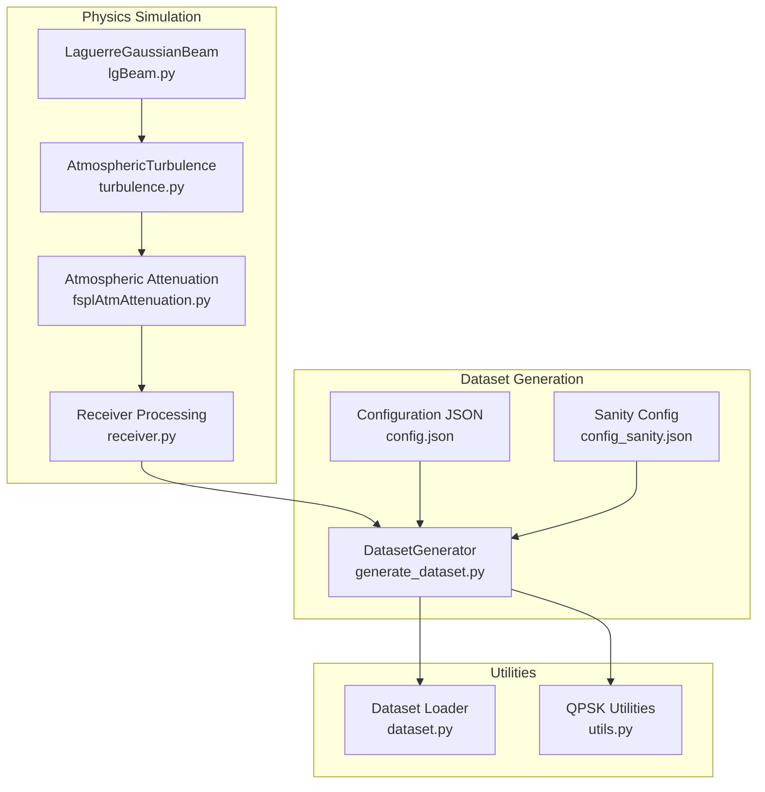
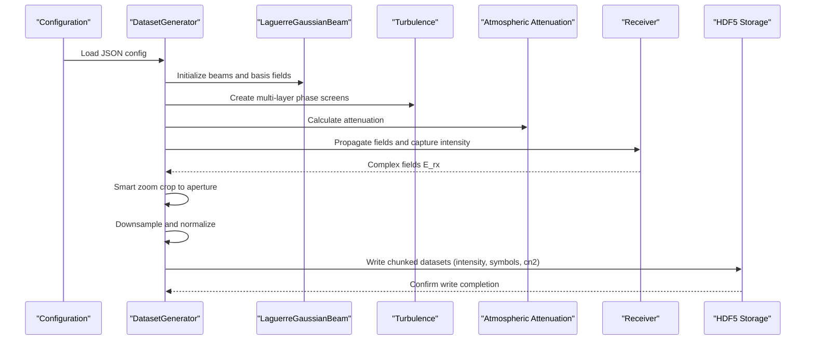
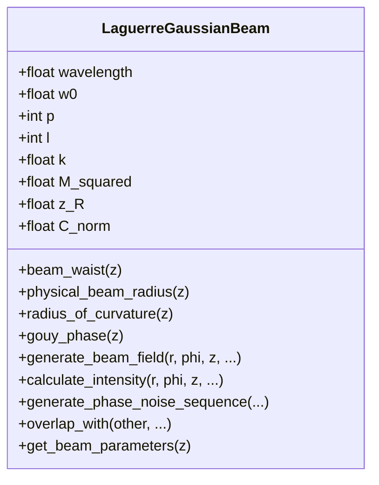
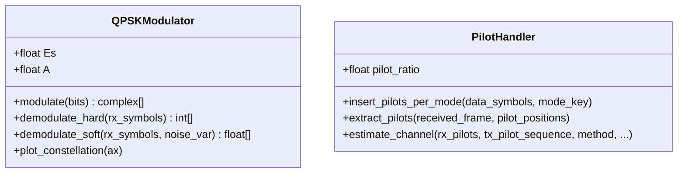
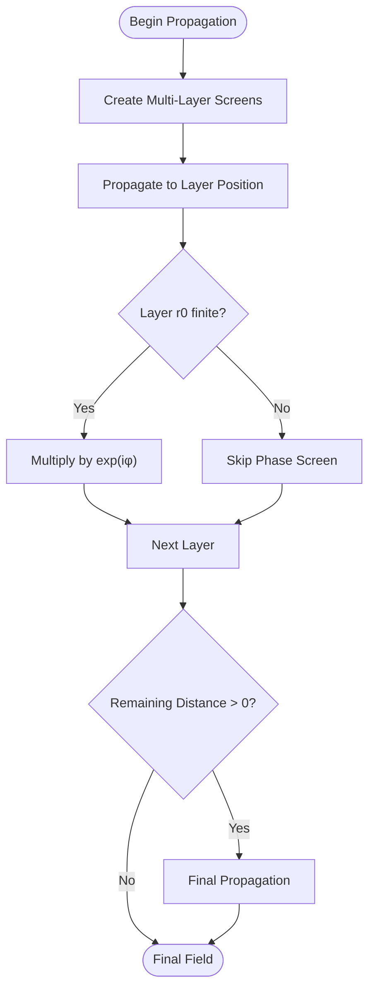
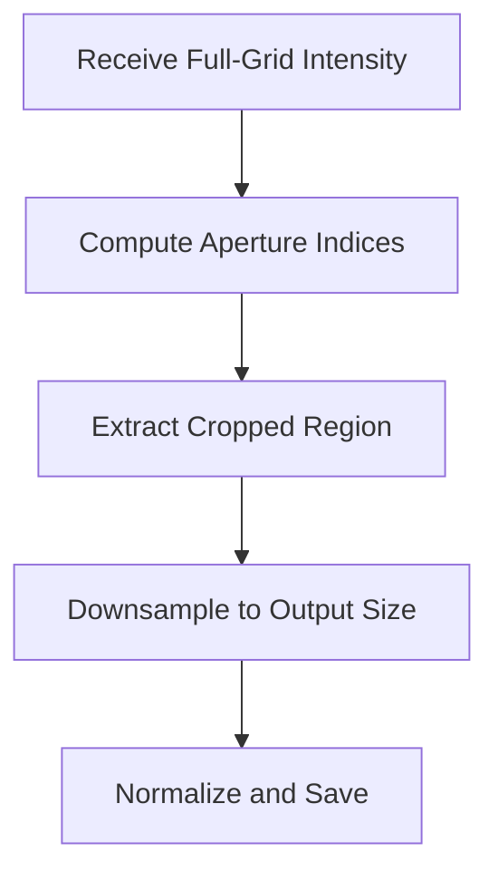
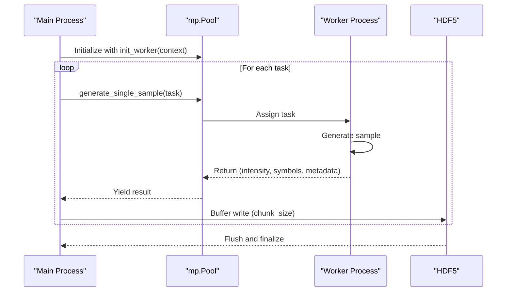
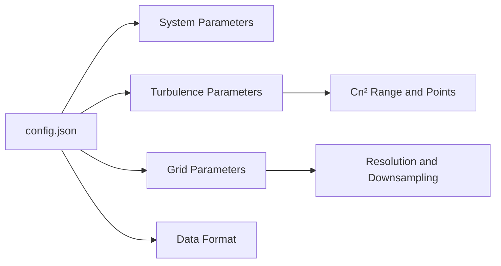
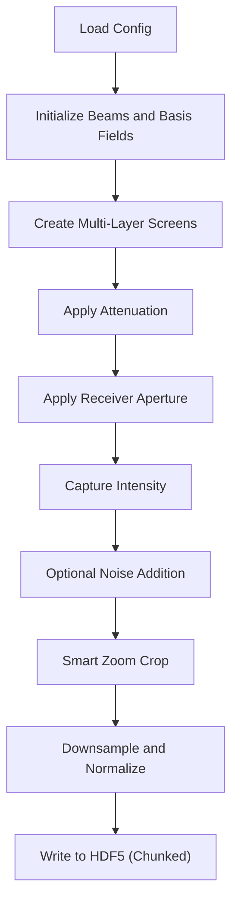
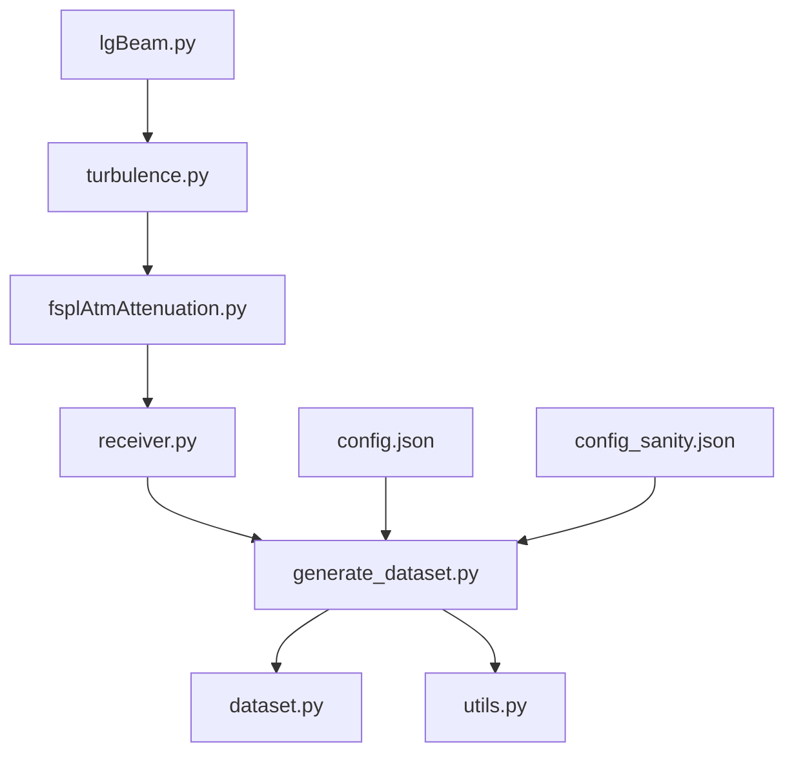

# Dataset Generation

<cite>
**Referenced Files in This Document**
- [generate_dataset.py](file://models/CNN Trials/data/generators/generate_dataset.py)
- [config.json](file://models/CNN Trials/data/configs/config.json)
- [config_sanity.json](file://models/CNN Trials/data/configs/config_sanity.json)
- [lgBeam.py](file://models/CNN Trials/physics/lgBeam.py)
- [turbulence.py](file://models/CNN Trials/physics/turbulence.py)
- [fsplAtmAttenuation.py](file://models/CNN Trials/physics/fsplAtmAttenuation.py)
- [receiver.py](file://models/CNN Trials/physics/receiver.py)
- [pipeline.py](file://models/CNN Trials/physics/pipeline.py)
- [runner.py](file://models/CNN Trials/physics/runner.py)
- [dataset.py](file://models/CNN Trials/src/utils/dataset.py)
- [utils.py](file://models/CNN Trials/src/utils/utils.py)
</cite>

## Table of Contents
1. [Introduction](#introduction)
2. [Project Structure](#project-structure)
3. [Core Components](#core-components)
4. [Architecture Overview](#architecture-overview)
5. [Detailed Component Analysis](#detailed-component-analysis)
6. [Dependency Analysis](#dependency-analysis)
7. [Performance Considerations](#performance-considerations)
8. [Troubleshooting Guide](#troubleshooting-guide)
9. [Conclusion](#conclusion)
10. [Appendices](#appendices)

## Introduction
This document provides comprehensive documentation for the dataset generation system that creates synthetic FSO-OAM (Free-Space Optics with Orbital Angular Momentum) datasets. The pipeline simulates the complete physical process: Laguerre-Gaussian beam generation, QPSK symbol modulation, atmospheric turbulence propagation, and intensity pattern capture at the receiver. It further applies a "smart zoom" cropping technique to improve effective resolution by removing empty space around the beam, and implements multiprocessing with chunked I/O for efficient Apple M3 processor utilization. The document includes concrete configuration parameters, Cn² turbulence value generation, the full workflow from raw simulation to HDF5 storage, performance optimization strategies, parallel processing approaches, and troubleshooting guidance.

## Project Structure
The dataset generation system spans several modules:
- Physics simulation modules: beam generation, turbulence propagation, atmospheric attenuation, and receiver processing
- Dataset generation: multiprocessing and chunked I/O for Apple M3
- Configuration: JSON-based system parameters, turbulence parameters, grid parameters, and augmentation settings
- Utilities: dataset loading and QPSK utilities for training

**Diagram sources**
- [generate_dataset.py](file://models/CNN Trials/data/generators/generate_dataset.py#L279-L528)
- [config.json](file://models/CNN Trials/data/configs/config.json#L1-L136)
- [lgBeam.py](file://models/CNN Trials/physics/lgBeam.py#L10-L357)
- [turbulence.py](file://models/CNN Trials/physics/turbulence.py#L108-L352)
- [fsplAtmAttenuation.py](file://models/CNN Trials/physics/fsplAtmAttenuation.py#L26-L179)
- [receiver.py](file://models/CNN Trials/physics/receiver.py#L370-L751)
- [dataset.py](file://models/CNN Trials/src/utils/dataset.py#L6-L44)
- [utils.py](file://models/CNN Trials/src/utils/utils.py#L16-L114)

**Section sources**
- [generate_dataset.py](file://models/CNN Trials/data/generators/generate_dataset.py#L1-L598)
- [config.json](file://models/CNN Trials/data/configs/config.json#L1-L136)
- [config_sanity.json](file://models/CNN Trials/data/configs/config_sanity.json#L1-L106)

## Core Components
- Laguerre-Gaussian beam generation: Defines beam parameters, propagation, and intensity calculation for OAM modes
- QPSK symbol modulation: Encodes information bits into QPSK symbols and manages pilot insertion
- Atmospheric turbulence propagation: Multi-layer phase screens with split-step propagation and angular spectrum
- Smart zoom cropping: Reduces empty space around the beam to increase effective resolution
- Multiprocessing and chunked I/O: Parallel worker initialization, memory management, and buffered HDF5 writes
- Configuration system: JSON-driven parameters for system, turbulence, grid, and augmentation settings

**Section sources**
- [lgBeam.py](file://models/CNN Trials/physics/lgBeam.py#L10-L357)
- [turbulence.py](file://models/CNN Trials/physics/turbulence.py#L108-L352)
- [generate_dataset.py](file://models/CNN Trials/data/generators/generate_dataset.py#L71-L106)
- [generate_dataset.py](file://models/CNN Trials/data/generators/generate_dataset.py#L409-L528)
- [config.json](file://models/CNN Trials/data/configs/config.json#L1-L136)

## Architecture Overview
The dataset generation pipeline integrates physics simulation with multiprocessing and HDF5 storage. The process begins with generating LG basis fields, multiplexing QPSK symbols per mode, propagating through turbulence and attenuation, capturing intensity patterns, applying smart zoom cropping, and writing results to HDF5 with chunked I/O.

**Diagram sources**
- [generate_dataset.py](file://models/CNN Trials/data/generators/generate_dataset.py#L409-L528)
- [lgBeam.py](file://models/CNN Trials/physics/lgBeam.py#L10-L357)
- [turbulence.py](file://models/CNN Trials/physics/turbulence.py#L261-L352)
- [fsplAtmAttenuation.py](file://models/CNN Trials/physics/fsplAtmAttenuation.py#L26-L45)

## Detailed Component Analysis

### Laguerre-Gaussian Beam Generation
The beam module defines LG modes with radial and azimuthal indices, computes beam parameters (waist, divergence, M²), and generates complex electric fields. It supports phase noise and timing jitter modeling for realistic laser effects.

**Diagram sources**
- [lgBeam.py](file://models/CNN Trials/physics/lgBeam.py#L10-L357)

**Section sources**
- [lgBeam.py](file://models/CNN Trials/physics/lgBeam.py#L10-L357)

### QPSK Modulation and Pilot Management
The QPSK modulator maps bits to constellation points and supports both hard and soft demodulation. The pilot handler inserts structured pilot sequences per mode for channel estimation.

**Diagram sources**
- [generate_dataset.py](file://models/CNN Trials/data/generators/generate_dataset.py#L126-L131)
- [generate_dataset.py](file://models/CNN Trials/data/generators/generate_dataset.py#L462-L524)

**Section sources**
- [generate_dataset.py](file://models/CNN Trials/data/generators/generate_dataset.py#L126-L131)
- [generate_dataset.py](file://models/CNN Trials/data/generators/generate_dataset.py#L462-L524)

### Atmospheric Turbulence Propagation
The turbulence module implements multi-layer phase screens with split-step propagation using angular spectrum. It computes Fried parameter and turbulence strength, validates phase screen statistics, and applies screens to the LG fields.

**Diagram sources**
- [turbulence.py](file://models/CNN Trials/physics/turbulence.py#L261-L352)

**Section sources**
- [turbulence.py](file://models/CNN Trials/physics/turbulence.py#L108-L352)

### Smart Zoom Cropping Technique
The smart zoom crops the intensity field to the receiver aperture before downsampling, dramatically improving effective resolution by removing empty space around the beam.

**Diagram sources**
- [generate_dataset.py](file://models/CNN Trials/data/generators/generate_dataset.py#L71-L106)

**Section sources**
- [generate_dataset.py](file://models/CNN Trials/data/generators/generate_dataset.py#L71-L106)

### Multiprocessing and Chunked I/O for Apple M3
The dataset generator uses multiprocessing with worker initialization and shared context, and implements chunked I/O for efficient HDF5 writes. Workers are spawned with independent RNG seeds to ensure reproducibility and avoid collisions.

**Diagram sources**
- [generate_dataset.py](file://models/CNN Trials/data/generators/generate_dataset.py#L40-L48)
- [generate_dataset.py](file://models/CNN Trials/data/generators/generate_dataset.py#L496-L528)

**Section sources**
- [generate_dataset.py](file://models/CNN Trials/data/generators/generate_dataset.py#L40-L48)
- [generate_dataset.py](file://models/CNN Trials/data/generators/generate_dataset.py#L496-L528)

### Configuration Parameters and Cn² Generation
Configuration JSON controls system parameters (wavelength, beam waist, distance, receiver diameter, spatial modes), turbulence parameters (Cn² range, number of screens, inner/outer scales), grid parameters (simulation and output sizes, oversampling), and data format settings. Cn² values are logarithmically spaced across configured ranges.

**Diagram sources**
- [config.json](file://models/CNN Trials/data/configs/config.json#L1-L136)

**Section sources**
- [config.json](file://models/CNN Trials/data/configs/config.json#L1-L136)
- [config_sanity.json](file://models/CNN Trials/data/configs/config_sanity.json#L1-L106)

### Complete Workflow: From Raw Simulation to HDF5 Storage
The workflow integrates transmitter, turbulence, attenuation, receiver processing, and dataset writing. It supports both single-run and sweep modes, with optional power probing and noise modeling.

**Diagram sources**
- [generate_dataset.py](file://models/CNN Trials/data/generators/generate_dataset.py#L409-L528)
- [pipeline.py](file://models/CNN Trials/physics/pipeline.py#L64-L439)
- [runner.py](file://models/CNN Trials/physics/runner.py#L128-L505)

**Section sources**
- [generate_dataset.py](file://models/CNN Trials/data/generators/generate_dataset.py#L409-L528)
- [pipeline.py](file://models/CNN Trials/physics/pipeline.py#L64-L439)
- [runner.py](file://models/CNN Trials/physics/runner.py#L128-L505)

## Dependency Analysis
The dataset generation system exhibits clear module boundaries and controlled dependencies:
- Physics modules depend on each other in a logical chain: LG → Turbulence → Attenuation → Receiver
- Dataset generator depends on physics modules and configuration
- Utilities support dataset loading and QPSK operations

**Diagram sources**
- [generate_dataset.py](file://models/CNN Trials/data/generators/generate_dataset.py#L279-L528)
- [lgBeam.py](file://models/CNN Trials/physics/lgBeam.py#L10-L357)
- [turbulence.py](file://models/CNN Trials/physics/turbulence.py#L108-L352)
- [fsplAtmAttenuation.py](file://models/CNN Trials/physics/fsplAtmAttenuation.py#L26-L45)
- [receiver.py](file://models/CNN Trials/physics/receiver.py#L370-L751)
- [dataset.py](file://models/CNN Trials/src/utils/dataset.py#L6-L44)
- [utils.py](file://models/CNN Trials/src/utils/utils.py#L16-L114)

**Section sources**
- [generate_dataset.py](file://models/CNN Trials/data/generators/generate_dataset.py#L279-L528)
- [lgBeam.py](file://models/CNN Trials/physics/lgBeam.py#L10-L357)
- [turbulence.py](file://models/CNN Trials/physics/turbulence.py#L108-L352)
- [fsplAtmAttenuation.py](file://models/CNN Trials/physics/fsplAtmAttenuation.py#L26-L45)
- [receiver.py](file://models/CNN Trials/physics/receiver.py#L370-L751)
- [dataset.py](file://models/CNN Trials/src/utils/dataset.py#L6-L44)
- [utils.py](file://models/CNN Trials/src/utils/utils.py#L16-L114)

## Performance Considerations
- Multiprocessing on Apple M3: Use spawn start method for compatibility; leverage all CPU cores; initialize worker RNG seeds independently
- Chunked I/O: Write HDF5 datasets in chunks to balance memory usage and disk throughput
- Grid sizing: Use physical beam radius with M² scaling to prevent clipping of higher-order modes
- Downsampling: Prefer bilinear interpolation for smooth intensity fields; adjust output size to balance resolution and training speed
- Memory management: Clear caches and flush buffers periodically; reuse aperture masks and precomputed grids
- Smart zoom: Dramatically improves effective resolution by focusing on the beam region

[No sources needed since this section provides general guidance]

## Troubleshooting Guide
Common issues and resolutions:
- Empty or zero fields after propagation: Verify grid size and oversampling; ensure aperture mask is applied correctly
- Excessive spread or NaN values: Check turbulence layer parameters and grid resolution relative to inner scale
- Low signal-to-noise ratio: Adjust SNR settings and ensure noise variance is computed per pixel
- Inconsistent LDPC decoding: Ensure transmitter and receiver share the same LDPC instance and block configuration
- Poor performance on Apple M3: Use spawn start method for multiprocessing; monitor memory usage and adjust chunk size

**Section sources**
- [turbulence.py](file://models/CNN Trials/physics/turbulence.py#L282-L288)
- [generate_dataset.py](file://models/CNN Trials/data/generators/generate_dataset.py#L496-L528)
- [receiver.py](file://models/CNN Trials/physics/receiver.py#L476-L524)

## Conclusion
The dataset generation system provides a robust, physics-based pipeline for creating synthetic FSO-OAM datasets. It accurately models LG beam propagation, QPSK modulation, atmospheric turbulence, and receiver processing, while optimizing performance through smart zoom cropping and multiprocessing with chunked I/O. The modular design and JSON-based configuration enable flexible experimentation across turbulence regimes and system parameters.

## Appendices

### Appendix A: Configuration Parameter Reference
Key configuration categories and typical values:
- System parameters: wavelength (1.55 μm), w0 (25 mm), distance (1000 m), receiver diameter (0.5 m), spatial modes (8 LG modes)
- Turbulence parameters: Cn² range (1e-18 to 1e-13 m⁻²ᐟ³), num_screens (15), L0 (10 m), l0_inner (5 mm)
- Grid parameters: n_grid_sim (512), n_grid_output (128), oversampling (2), downsampling method (bilinear)
- Data format: input channels (1), input shape (128×128), output shape (8×2), normalize_input (false)

**Section sources**
- [config.json](file://models/CNN Trials/data/configs/config.json#L4-L136)
- [config_sanity.json](file://models/CNN Trials/data/configs/config_sanity.json#L4-L106)

### Appendix B: HDF5 Dataset Schema
Generated datasets include:
- intensity: [N, 1, output_size, output_size] float32
- symbols: [N, 8, 2] float32 (I/Q per mode)
- cn2: [N] float32
Metadata attributes:
- split, n_modes, input_shape, wavelength, distance, spatial_modes, cn2_min, cn2_max, num_samples

**Section sources**
- [generate_dataset.py](file://models/CNN Trials/data/generators/generate_dataset.py#L463-L490)