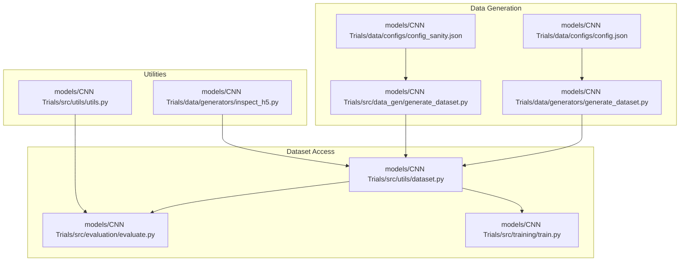
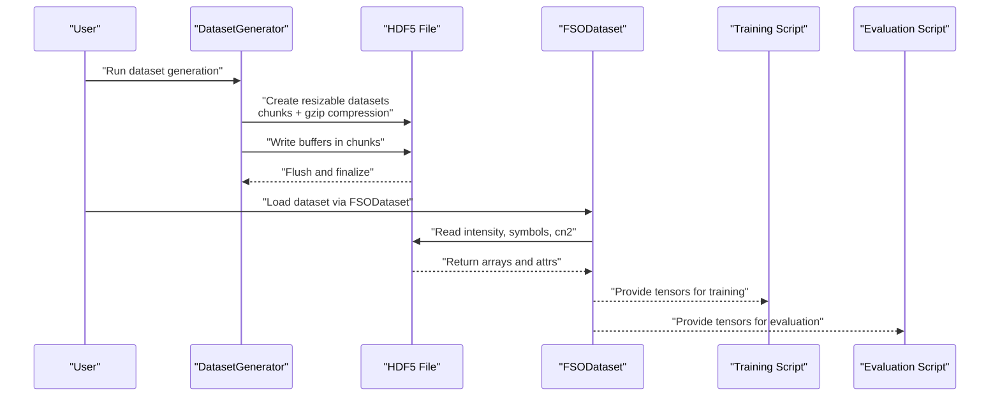
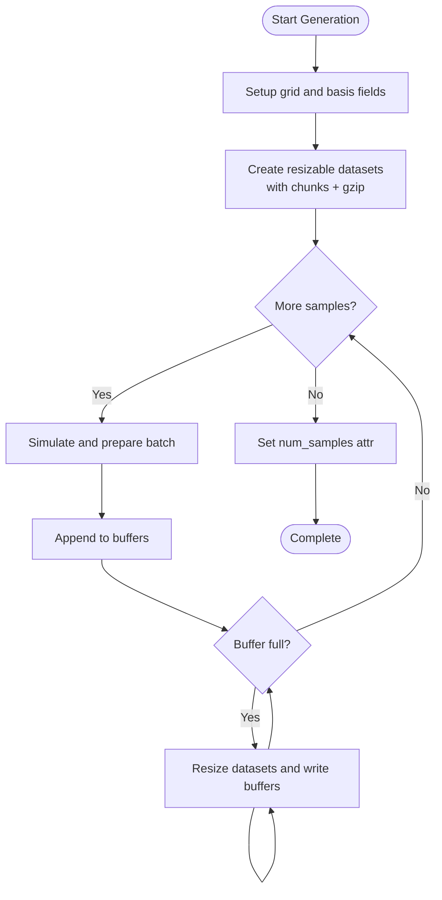
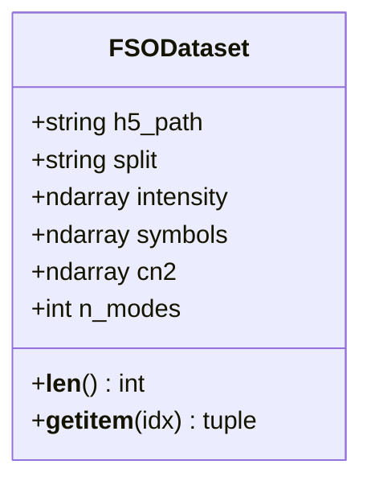
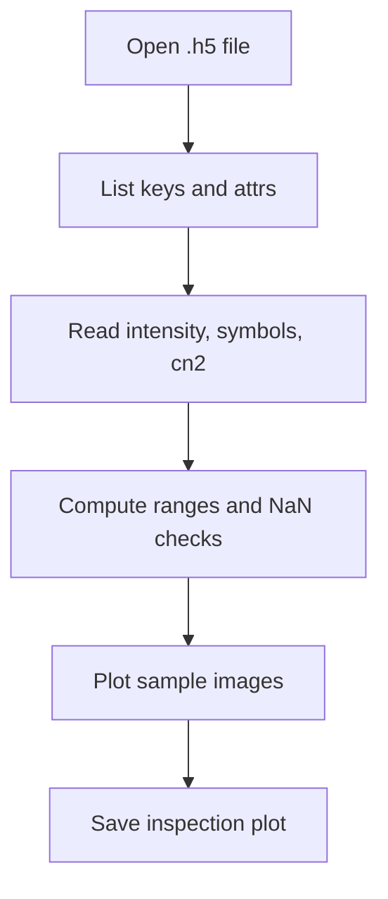
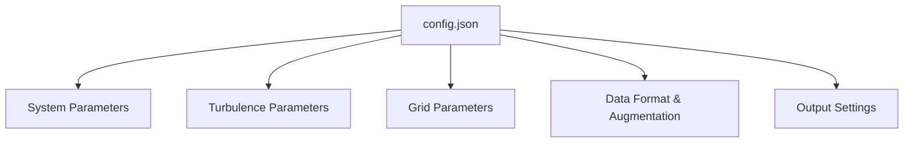
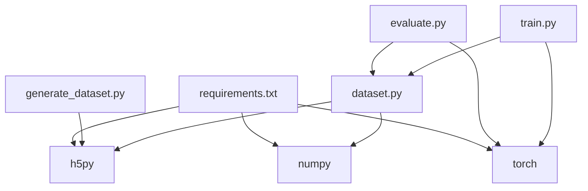
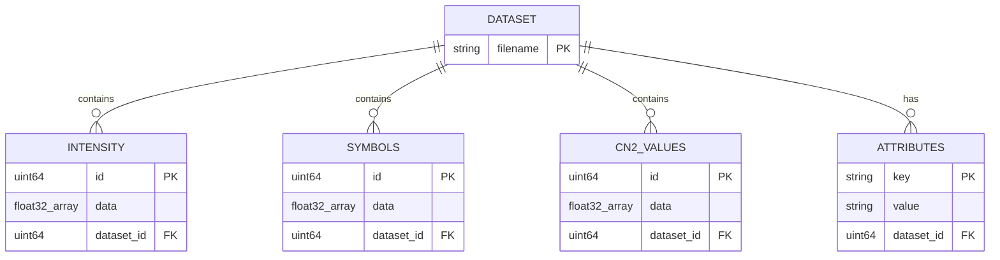

# Storage Formats and HDF5 Management

<cite>
**Referenced Files in This Document**
- [README.md](file://README.md)
- [requirements.txt](file://requirements.txt)
- [generate_dataset.py](file://models/CNN Trials/data/generators/generate_dataset.py)
- [generate_dataset.py](file://models/CNN Trials/src/data_gen/generate_dataset.py)
- [inspect_h5.py](file://models/CNN Trials/data/generators/inspect_h5.py)
- [dataset.py](file://models/CNN Trials/src/utils/dataset.py)
- [config.json](file://models/CNN Trials/data/configs/config.json)
- [config_sanity.json](file://models/CNN Trials/data/configs/config_sanity.json)
- [utils.py](file://models/CNN Trials/src/utils/utils.py)
- [train.py](file://models/CNN Trials/src/training/train.py)
- [evaluate.py](file://models/CNN Trials/src/evaluation/evaluate.py)
</cite>

## Table of Contents
1. [Introduction](#introduction)
2. [Project Structure](#project-structure)
3. [Core Components](#core-components)
4. [Architecture Overview](#architecture-overview)
5. [Detailed Component Analysis](#detailed-component-analysis)
6. [Dependency Analysis](#dependency-analysis)
7. [Performance Considerations](#performance-considerations)
8. [Troubleshooting Guide](#troubleshooting-guide)
9. [Conclusion](#conclusion)
10. [Appendices](#appendices)

## Introduction
This document explains the HDF5 dataset storage and management system used in the project for FSO-OAM (Free Space Optics with Orbital Angular Momentum) simulations. It covers the HDF5 file structure, chunked I/O and compression strategy, resizable datasets, metadata attributes, and indexing. It also provides practical guidance for reading, writing, and manipulating datasets using h5py, along with memory optimization, validation, integrity checks, and troubleshooting.

## Project Structure
The project organizes dataset generation and consumption around HDF5 files. Key locations:
- Dataset generation scripts produce .h5 files under a data directory.
- A PyTorch Dataset wrapper loads entire datasets into memory for training/evaluation.
- Utilities provide symbol mapping, LLR computation, and constellation visualization.
- Configuration files define system parameters, turbulence settings, grid sizes, and output format.

**Diagram sources**
- [generate_dataset.py](file://models/CNN Trials/data/generators/generate_dataset.py#L408-L528)
- [generate_dataset.py](file://models/CNN Trials/src/data_gen/generate_dataset.py#L57-L163)
- [dataset.py](file://models/CNN Trials/src/utils/dataset.py#L6-L23)
- [utils.py](file://models/CNN Trials/src/utils/utils.py#L117-L162)
- [inspect_h5.py](file://models/CNN Trials/data/generators/inspect_h5.py#L1-L47)

**Section sources**
- [README.md](file://README.md#L311-L350)
- [requirements.txt](file://requirements.txt#L1-L11)

## Core Components
- HDF5 dataset structure
  - Intensity dataset: float32 images shaped as (samples, height, width)
  - Symbols dataset: float32 arrays shaped as (samples, modes, 2) storing real and imaginary parts
  - Cn2 dataset: float32 values representing turbulence strength per sample
  - Attributes: metadata such as split, number of modes, input shape, wavelength, distance, spatial modes, and cn2 bounds
- Chunked I/O with gzip compression
  - Datasets are created with chunked layout and gzip compression to optimize access and reduce storage
- Resizable datasets
  - Datasets are created with maxshape allowing dynamic growth during buffered writes
- Indexing and metadata
  - Each sample is uniquely identified by its index; metadata attributes provide dataset-wide context

Practical usage patterns:
- Writing: Create resizable datasets, write in chunks, flush periodically, and finalize attributes
- Reading: Open with h5py, access keys and attributes, and slice arrays as needed

**Section sources**
- [generate_dataset.py](file://models/CNN Trials/data/generators/generate_dataset.py#L457-L490)
- [generate_dataset.py](file://models/CNN Trials/data/generators/generate_dataset.py#L530-L548)
- [generate_dataset.py](file://models/CNN Trials/src/data_gen/generate_dataset.py#L94-L106)
- [generate_dataset.py](file://models/CNN Trials/src/data_gen/generate_dataset.py#L151-L157)
- [dataset.py](file://models/CNN Trials/src/utils/dataset.py#L6-L23)
- [config.json](file://models/CNN Trials/data/configs/config.json#L127-L133)

## Architecture Overview
The dataset lifecycle spans generation, inspection, and consumption for training and evaluation.

**Diagram sources**
- [generate_dataset.py](file://models/CNN Trials/data/generators/generate_dataset.py#L408-L528)
- [dataset.py](file://models/CNN Trials/src/utils/dataset.py#L6-L23)
- [train.py](file://models/CNN Trials/src/training/train.py#L20-L25)
- [evaluate.py](file://models/CNN Trials/src/evaluation/evaluate.py#L84-L86)

## Detailed Component Analysis

### HDF5 Dataset Creation and Chunked I/O
- Datasets are created with:
  - Shape and maxshape for resizable growth
  - Chunks sized to balance I/O throughput and memory usage
  - gzip compression with moderate compression level
- Buffered writes append batches to datasets, resizing and flushing after each chunk
- Final attributes record dataset-wide metadata

**Diagram sources**
- [generate_dataset.py](file://models/CNN Trials/data/generators/generate_dataset.py#L408-L528)
- [generate_dataset.py](file://models/CNN Trials/data/generators/generate_dataset.py#L530-L548)

**Section sources**
- [generate_dataset.py](file://models/CNN Trials/data/generators/generate_dataset.py#L457-L490)
- [generate_dataset.py](file://models/CNN Trials/data/generators/generate_dataset.py#L530-L548)

### PyTorch Dataset Wrapper
- FSODataset opens the HDF5 file and loads intensity, symbols, and cn2 arrays into memory
- Adds a channel dimension to intensity for single-channel image tensors
- Provides standard Dataset interface for DataLoader

**Diagram sources**
- [dataset.py](file://models/CNN Trials/src/utils/dataset.py#L6-L23)

**Section sources**
- [dataset.py](file://models/CNN Trials/src/utils/dataset.py#L6-L23)

### Data Inspection Utility
- Reads keys and attributes
- Prints shapes, dtypes, and value ranges
- Checks for NaNs and visualizes sample intensity maps

**Diagram sources**
- [inspect_h5.py](file://models/CNN Trials/data/generators/inspect_h5.py#L12-L46)

**Section sources**
- [inspect_h5.py](file://models/CNN Trials/data/generators/inspect_h5.py#L1-L47)

### Configuration-Driven Generation
- System parameters define wavelength, beam waist, distance, receiver diameter, spatial modes, and pilot configuration
- Turbulence parameters specify cn2 range, number of points, and screen model
- Grid parameters control simulation and output grid sizes and downsampling method
- Data format and augmentation settings influence input normalization and noise injection
- Output configuration specifies HDF5 compression and metadata saving

**Diagram sources**
- [config.json](file://models/CNN Trials/data/configs/config.json#L4-L135)

**Section sources**
- [config.json](file://models/CNN Trials/data/configs/config.json#L4-L135)
- [config_sanity.json](file://models/CNN Trials/data/configs/config_sanity.json#L4-L105)

### Practical Examples Using h5py
- Creating datasets with chunking and compression
  - See dataset creation and chunk configuration in the generation scripts
  - Paths: [generate_dataset.py](file://models/CNN Trials/data/generators/generate_dataset.py#L457-L490), [generate_dataset.py](file://models/CNN Trials/src/data_gen/generate_dataset.py#L94-L106)
- Writing in chunks and resizing
  - See buffered write and resize logic
  - Paths: [generate_dataset.py](file://models/CNN Trials/data/generators/generate_dataset.py#L530-L548), [generate_dataset.py](file://models/CNN Trials/src/data_gen/generate_dataset.py#L151-L157)
- Reading and validating
  - See inspection utility for reading keys, attrs, and arrays
  - Paths: [inspect_h5.py](file://models/CNN Trials/data/generators/inspect_h5.py#L12-L25)

**Section sources**
- [generate_dataset.py](file://models/CNN Trials/data/generators/generate_dataset.py#L457-L490)
- [generate_dataset.py](file://models/CNN Trials/src/data_gen/generate_dataset.py#L94-L106)
- [generate_dataset.py](file://models/CNN Trials/data/generators/generate_dataset.py#L530-L548)
- [generate_dataset.py](file://models/CNN Trials/src/data_gen/generate_dataset.py#L151-L157)
- [inspect_h5.py](file://models/CNN Trials/data/generators/inspect_h5.py#L12-L25)

## Dependency Analysis
- External dependencies include h5py for HDF5 I/O, numpy for numerical arrays, and torch for training/evaluation
- Internal dependencies:
  - Dataset generation depends on physics pipeline modules (imported dynamically)
  - FSODataset depends on h5py and numpy
  - Evaluation and training depend on FSODataset and model definitions

**Diagram sources**
- [requirements.txt](file://requirements.txt#L1-L11)
- [generate_dataset.py](file://models/CNN Trials/data/generators/generate_dataset.py#L17-L27)
- [dataset.py](file://models/CNN Trials/src/utils/dataset.py#L1-L4)
- [evaluate.py](file://models/CNN Trials/src/evaluation/evaluate.py#L1-L11)
- [train.py](file://models/CNN Trials/src/training/train.py#L1-L15)

**Section sources**
- [requirements.txt](file://requirements.txt#L1-L11)
- [generate_dataset.py](file://models/CNN Trials/data/generators/generate_dataset.py#L17-L27)
- [dataset.py](file://models/CNN Trials/src/utils/dataset.py#L1-L4)
- [evaluate.py](file://models/CNN Trials/src/evaluation/evaluate.py#L1-L11)
- [train.py](file://models/CNN Trials/src/training/train.py#L1-L15)

## Performance Considerations
- Chunked I/O and compression
  - Use chunk sizes aligned with typical batch sizes to minimize read/write overhead
  - gzip compression reduces storage footprint; adjust compression level based on storage vs. CPU trade-offs
- Resizable datasets
  - Resize incrementally to avoid frequent reallocations; flush after each chunk
- Memory optimization
  - FSODataset loads entire arrays into RAM; consider on-disk indexing or lazy loading for very large datasets
  - Normalize inputs once during generation to avoid repeated computations
- Parallelism
  - Generation uses multiprocessing; ensure sufficient CPU cores and manage worker initialization carefully
- Downsampling and grid sizing
  - Properly size simulation grids to prevent clipping of higher-order modes and maintain resolution

[No sources needed since this section provides general guidance]

## Troubleshooting Guide
Common HDF5 access issues and resolutions:
- File not found or wrong path
  - Verify the .h5 file path and existence before opening
  - Reference: [inspect_h5.py](file://models/CNN Trials/data/generators/inspect_h5.py#L8-L10)
- Unexpected shapes or dtypes
  - Inspect keys and attributes to confirm dataset structure
  - Reference: [inspect_h5.py](file://models/CNN Trials/data/generators/inspect_h5.py#L13-L14)
- Data integrity checks
  - Validate ranges and presence of NaNs
  - Reference: [inspect_h5.py](file://models/CNN Trials/data/generators/inspect_h5.py#L27-L31)
- Attribute validation
  - Confirm dataset-wide attributes such as number of modes and input shape
  - Reference: [generate_dataset.py](file://models/CNN Trials/data/generators/generate_dataset.py#L481-L490)
- Chunking and compression mismatch
  - Ensure chunk sizes match access patterns; adjust compression level if needed
  - References: [generate_dataset.py](file://models/CNN Trials/data/generators/generate_dataset.py#L468-L475), [config.json](file://models/CNN Trials/data/configs/config.json#L129-L130)

**Section sources**
- [inspect_h5.py](file://models/CNN Trials/data/generators/inspect_h5.py#L8-L31)
- [generate_dataset.py](file://models/CNN Trials/data/generators/generate_dataset.py#L468-L490)
- [config.json](file://models/CNN Trials/data/configs/config.json#L129-L130)

## Conclusion
The project’s HDF5 management strategy emphasizes chunked I/O with gzip compression, resizable datasets, and rich metadata attributes. Generation scripts efficiently build datasets using multiprocessing and buffered writes, while the PyTorch wrapper provides a straightforward interface for training and evaluation. Adhering to the outlined practices ensures reliable, scalable, and maintainable dataset workflows for large-scale FSO-OAM simulations.

[No sources needed since this section summarizes without analyzing specific files]

## Appendices

### Data Models Diagram

[No sources needed since this diagram shows conceptual data model, not actual code structure]