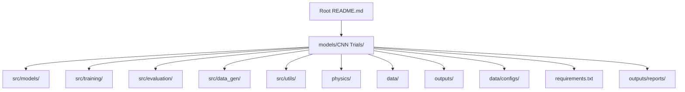
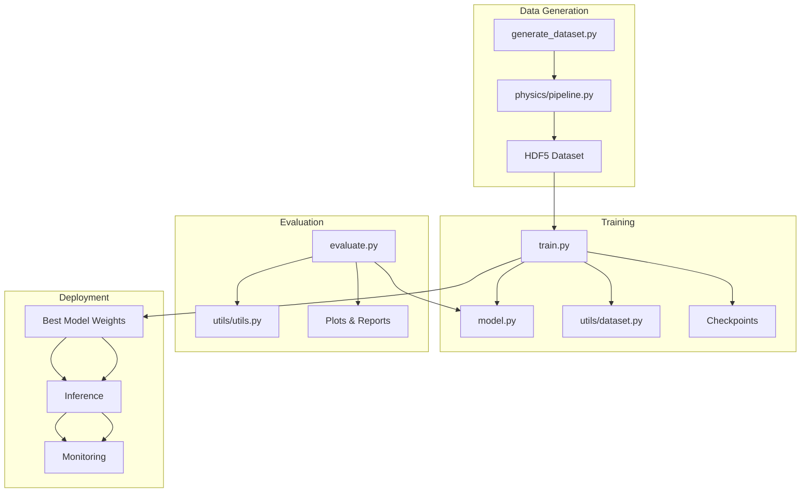
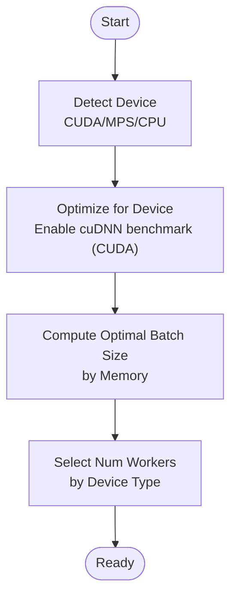
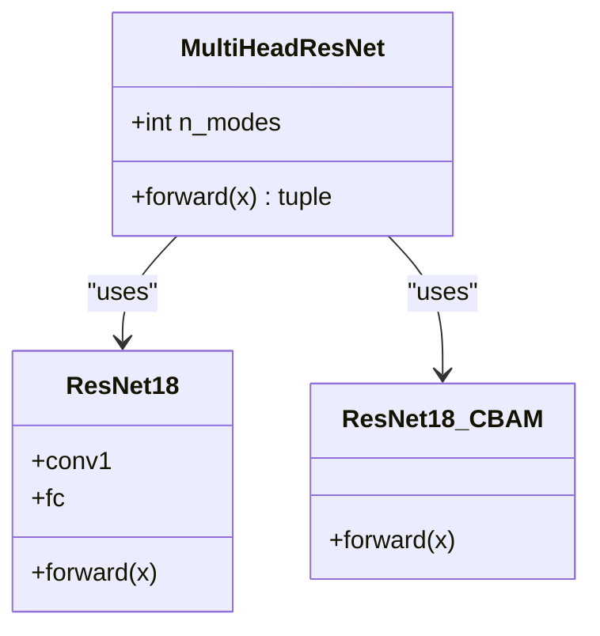
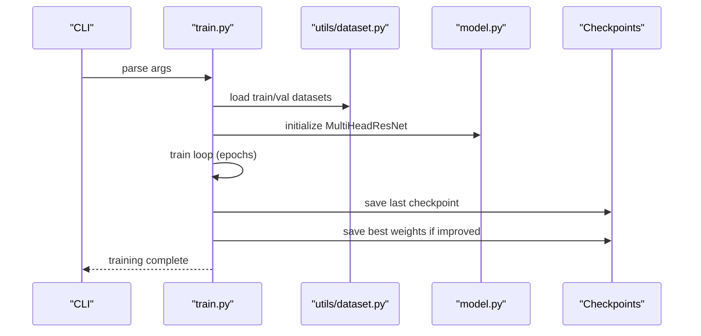
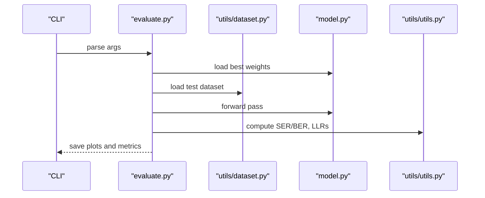
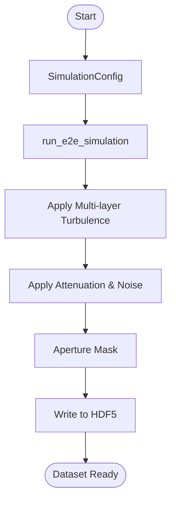
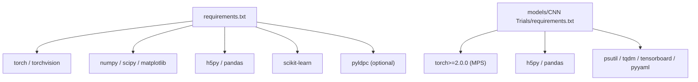
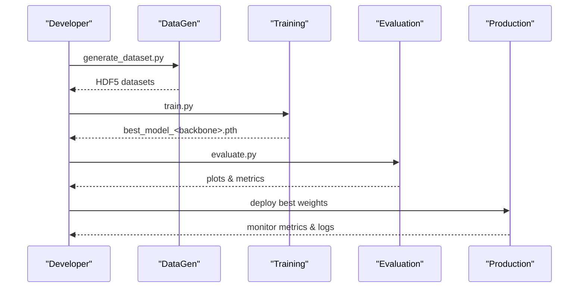

# Development and Deployment

<cite>
**Referenced Files in This Document**
- [README.md](file://README.md)
- [requirements.txt](file://requirements.txt)
- [models/CNN Trials/requirements.txt](file://models/CNN Trials/requirements.txt)
- [models/CNN Trials/src/utils/device_utils.py](file://models/CNN Trials/src/utils/device_utils.py)
- [models/CNN Trials/src/models/model.py](file://models/CNN Trials/src/models/model.py)
- [models/CNN Trials/src/training/train.py](file://models/CNN Trials/src/training/train.py)
- [models/CNN Trials/src/evaluation/evaluate.py](file://models/CNN Trials/src/evaluation/evaluate.py)
- [models/CNN Trials/src/data_gen/generate_dataset.py](file://models/CNN Trials/src/data_gen/generate_dataset.py)
- [models/CNN Trials/src/utils/dataset.py](file://models/CNN Trials/src/utils/dataset.py)
- [models/CNN Trials/src/utils/utils.py](file://models/CNN Trials/src/utils/utils.py)
- [models/CNN Trials/physics/pipeline.py](file://models/CNN Trials/physics/pipeline.py)
- [models/CNN Trials/data/configs/config.json](file://models/CNN Trials/data/configs/config.json)
- [models/CNN Trials/outputs/reports/Throughput_Analysis.md](file://models/CNN Trials/outputs/reports/Throughput_Analysis.md)
</cite>

## Table of Contents
1. [Introduction](#introduction)
2. [Project Structure](#project-structure)
3. [Core Components](#core-components)
4. [Architecture Overview](#architecture-overview)
5. [Detailed Component Analysis](#detailed-component-analysis)
6. [Dependency Analysis](#dependency-analysis)
7. [Performance Considerations](#performance-considerations)
8. [Troubleshooting Guide](#troubleshooting-guide)
9. [Conclusion](#conclusion)
10. [Appendices](#appendices)

## Introduction
This document provides a comprehensive guide for setting up a development environment and deploying the FSO OAM beam recovery system. It covers installation procedures, environment configuration, dependency management, hardware optimization for Apple Silicon and NVIDIA GPUs, and the complete deployment workflow from development to production. It also includes model serialization, inference optimization, monitoring requirements, troubleshooting, and platform-specific considerations.

## Project Structure
The repository is organized around a “CNN Trials” project containing the neural receiver, training, evaluation, and data generation components. Supporting physics simulations and configuration files are included for dataset generation and throughput analysis.

**Diagram sources**
- [README.md](file://README.md#L311-L350)
- [models/CNN Trials/requirements.txt](file://models/CNN Trials/requirements.txt#L1-L33)

**Section sources**
- [README.md](file://README.md#L311-L350)

## Core Components
- Device and hardware optimization utilities for Apple Silicon and NVIDIA GPUs
- Multi-head CNN model with ResNet-18 backbone and CBAM attention
- Training pipeline with weighted losses and checkpointing
- Evaluation pipeline with throughput and BER/SER analysis
- Physics-based dataset generator using Split-Step Fourier propagation
- HDF5-backed dataset loader and utility functions for QPSK processing

**Section sources**
- [models/CNN Trials/src/utils/device_utils.py](file://models/CNN Trials/src/utils/device_utils.py#L15-L143)
- [models/CNN Trials/src/models/model.py](file://models/CNN Trials/src/models/model.py#L6-L71)
- [models/CNN Trials/src/training/train.py](file://models/CNN Trials/src/training/train.py#L16-L137)
- [models/CNN Trials/src/evaluation/evaluate.py](file://models/CNN Trials/src/evaluation/evaluate.py#L80-L305)
- [models/CNN Trials/src/data_gen/generate_dataset.py](file://models/CNN Trials/src/data_gen/generate_dataset.py#L23-L164)
- [models/CNN Trials/src/utils/dataset.py](file://models/CNN Trials/src/utils/dataset.py#L6-L43)
- [models/CNN Trials/src/utils/utils.py](file://models/CNN Trials/src/utils/utils.py#L16-L210)
- [models/CNN Trials/physics/pipeline.py](file://models/CNN Trials/physics/pipeline.py#L64-L439)

## Architecture Overview
The system follows a modular pipeline: data generation (physics simulation), training (neural receiver), evaluation (metrics and plots), and deployment-ready model artifacts.

**Diagram sources**
- [models/CNN Trials/src/data_gen/generate_dataset.py](file://models/CNN Trials/src/data_gen/generate_dataset.py#L23-L164)
- [models/CNN Trials/physics/pipeline.py](file://models/CNN Trials/physics/pipeline.py#L64-L439)
- [models/CNN Trials/src/training/train.py](file://models/CNN Trials/src/training/train.py#L16-L137)
- [models/CNN Trials/src/models/model.py](file://models/CNN Trials/src/models/model.py#L6-L71)
- [models/CNN Trials/src/utils/dataset.py](file://models/CNN Trials/src/utils/dataset.py#L6-L43)
- [models/CNN Trials/src/evaluation/evaluate.py](file://models/CNN Trials/src/evaluation/evaluate.py#L80-L305)
- [models/CNN Trials/src/utils/utils.py](file://models/CNN Trials/src/utils/utils.py#L16-L210)

## Detailed Component Analysis

### Device and Hardware Optimization
- Automatic device selection prioritizing CUDA, MPS (Apple Silicon), and CPU
- Device-specific optimizations (cuDNN benchmark for CUDA)
- Dynamic batch size and worker selection based on memory and CPU cores
- Memory monitoring and cache clearing utilities

**Diagram sources**
- [models/CNN Trials/src/utils/device_utils.py](file://models/CNN Trials/src/utils/device_utils.py#L15-L143)

**Section sources**
- [models/CNN Trials/src/utils/device_utils.py](file://models/CNN Trials/src/utils/device_utils.py#L15-L143)

### Model Definition and Multi-Head Outputs
- ResNet-18 backbone with custom first conv for single-channel 64x64 inputs
- Two heads: regression for complex QPSK symbols and auxiliary power prediction
- Flexible backbone selection (vanilla or CBAM-enhanced)

**Diagram sources**
- [models/CNN Trials/src/models/model.py](file://models/CNN Trials/src/models/model.py#L6-L71)

**Section sources**
- [models/CNN Trials/src/models/model.py](file://models/CNN Trials/src/models/model.py#L6-L71)

### Training Pipeline
- Loads HDF5 datasets, builds model, sets up losses and optimizer
- Supports resume from last checkpoint
- Saves best model weights and training history plots
- Uses weighted loss combining symbol MSE and power BCE

**Diagram sources**
- [models/CNN Trials/src/training/train.py](file://models/CNN Trials/src/training/train.py#L16-L137)
- [models/CNN Trials/src/utils/dataset.py](file://models/CNN Trials/src/utils/dataset.py#L6-L43)
- [models/CNN Trials/src/models/model.py](file://models/CNN Trials/src/models/model.py#L6-L71)

**Section sources**
- [models/CNN Trials/src/training/train.py](file://models/CNN Trials/src/training/train.py#L16-L137)

### Evaluation and Throughput Analysis
- Loads best model weights, evaluates on test set
- Computes SER/BER, breakdown by turbulence strength, and throughput
- Generates BER curves, throughput curves, and constellation plots
- Includes diagnosis statistics for phase and magnitude biases

**Diagram sources**
- [models/CNN Trials/src/evaluation/evaluate.py](file://models/CNN Trials/src/evaluation/evaluate.py#L80-L305)
- [models/CNN Trials/src/utils/dataset.py](file://models/CNN Trials/src/utils/dataset.py#L6-L43)
- [models/CNN Trials/src/models/model.py](file://models/CNN Trials/src/models/model.py#L6-L71)
- [models/CNN Trials/src/utils/utils.py](file://models/CNN Trials/src/utils/utils.py#L16-L210)

**Section sources**
- [models/CNN Trials/src/evaluation/evaluate.py](file://models/CNN Trials/src/evaluation/evaluate.py#L80-L305)
- [models/CNN Trials/outputs/reports/Throughput_Analysis.md](file://models/CNN Trials/outputs/reports/Throughput_Analysis.md#L1-L55)

### Dataset Generation via Physics Simulation
- Generates end-to-end FSO-OAM frames with turbulence and noise
- Produces HDF5 datasets with intensity images, symbol targets, and turbulence parameters
- Configurable grid size, oversampling, and LDPC blocks

**Diagram sources**
- [models/CNN Trials/physics/pipeline.py](file://models/CNN Trials/physics/pipeline.py#L64-L439)
- [models/CNN Trials/src/data_gen/generate_dataset.py](file://models/CNN Trials/src/data_gen/generate_dataset.py#L23-L164)

**Section sources**
- [models/CNN Trials/physics/pipeline.py](file://models/CNN Trials/physics/pipeline.py#L64-L439)
- [models/CNN Trials/src/data_gen/generate_dataset.py](file://models/CNN Trials/src/data_gen/generate_dataset.py#L23-L164)

### Configuration and Data Formats
- JSON configuration defines system parameters, turbulence ranges, dataset sizes, grid parameters, augmentation, and output settings
- Dataset loader reads HDF5 and normalizes inputs for training/inference

**Section sources**
- [models/CNN Trials/data/configs/config.json](file://models/CNN Trials/data/configs/config.json#L1-L136)
- [models/CNN Trials/src/utils/dataset.py](file://models/CNN Trials/src/utils/dataset.py#L6-L43)

## Dependency Analysis
- Root-level dependencies include scientific computing and PyTorch ecosystem
- Apple Silicon-optimized requirements specify MPS-enabled PyTorch and optional LDPC package
- Device utilities dynamically select CUDA/MPS/CPU backends and tune performance

**Diagram sources**
- [requirements.txt](file://requirements.txt#L1-L11)
- [models/CNN Trials/requirements.txt](file://models/CNN Trials/requirements.txt#L1-L33)

**Section sources**
- [requirements.txt](file://requirements.txt#L1-L11)
- [models/CNN Trials/requirements.txt](file://models/CNN Trials/requirements.txt#L1-L33)
- [models/CNN Trials/src/utils/device_utils.py](file://models/CNN Trials/src/utils/device_utils.py#L15-L46)

## Performance Considerations
- Device selection and tuning:
  - Prefer CUDA for NVIDIA GPUs; enable cuDNN benchmark for faster convolutions
  - On Apple Silicon, MPS is preferred; batch size and workers are tuned conservatively
  - CPU fallback with reduced concurrency
- Memory management:
  - Monitor memory usage and clear caches when needed
  - Adjust batch size according to GPU memory or shared system memory constraints
- Throughput ceilings:
  - Neural receiver matches classical MMSE peak throughput (11.7 Gbps) but improves reliability in strong turbulence
- Data loading:
  - HDF5-backed dataset loads into RAM; ensure sufficient memory for large splits

[No sources needed since this section provides general guidance]

## Troubleshooting Guide
- Environment setup
  - Ensure Python 3.8+ and compatible PyTorch version for Apple Silicon (MPS) or CUDA
  - Install optional LDPC package if required for downstream processing
- Device detection issues
  - Verify CUDA availability; confirm MPS availability on Apple Silicon
  - Use device utilities to print system and memory info for diagnostics
- Training and evaluation
  - Check dataset paths and HDF5 file integrity
  - Validate model weight file existence and compatibility with selected backbone
  - Reduce batch size or workers if encountering out-of-memory errors
- Data generation
  - Confirm physics modules are importable and simulation config is valid
  - Ensure sufficient disk space for large HDF5 datasets
- Throughput and metrics
  - Review throughput analysis report for expected ceilings and regime behavior
  - Inspect evaluation plots for diagnostics (constellation, BER, throughput)

**Section sources**
- [models/CNN Trials/src/utils/device_utils.py](file://models/CNN Trials/src/utils/device_utils.py#L49-L77)
- [models/CNN Trials/src/training/train.py](file://models/CNN Trials/src/training/train.py#L16-L137)
- [models/CNN Trials/src/evaluation/evaluate.py](file://models/CNN Trials/src/evaluation/evaluate.py#L80-L305)
- [models/CNN Trials/src/data_gen/generate_dataset.py](file://models/CNN Trials/src/data_gen/generate_dataset.py#L17-L22)
- [models/CNN Trials/outputs/reports/Throughput_Analysis.md](file://models/CNN Trials/outputs/reports/Throughput_Analysis.md#L1-L55)

## Conclusion
This guide outlines a complete workflow for developing and deploying the FSO OAM neural receiver, from environment setup and dataset generation to training, evaluation, and production readiness. By leveraging device-aware optimizations, structured training and evaluation pipelines, and robust configuration management, teams can reliably operate the system across diverse hardware platforms while maintaining high performance and reproducibility.

[No sources needed since this section summarizes without analyzing specific files]

## Appendices

### Installation Procedures
- Clone the repository and navigate to the project root
- Install root dependencies using the root requirements file
- For Apple Silicon development, install the Apple Silicon-optimized requirements
- Verify device availability and run a quick demo to validate the environment

**Section sources**
- [README.md](file://README.md#L77-L100)
- [requirements.txt](file://requirements.txt#L1-L11)
- [models/CNN Trials/requirements.txt](file://models/CNN Trials/requirements.txt#L1-L33)

### Development Environment Configuration
- Use device utilities to auto-detect and configure the best available device
- Tune batch size and number of workers based on detected hardware capabilities
- Monitor memory usage during training and evaluation to prevent out-of-memory conditions

**Section sources**
- [models/CNN Trials/src/utils/device_utils.py](file://models/CNN Trials/src/utils/device_utils.py#L106-L167)
- [models/CNN Trials/src/utils/device_utils.py](file://models/CNN Trials/src/utils/device_utils.py#L170-L189)

### Hardware Optimization for Apple Silicon and NVIDIA GPUs
- CUDA: Enable cuDNN benchmark for performance; adjust batch size based on GPU memory
- Apple Silicon: Prefer MPS; use conservative batch sizes and fewer workers to avoid memory pressure
- CPU: Use minimal workers and smaller batch sizes for stability

**Section sources**
- [models/CNN Trials/src/utils/device_utils.py](file://models/CNN Trials/src/utils/device_utils.py#L80-L103)
- [models/CNN Trials/src/utils/device_utils.py](file://models/CNN Trials/src/utils/device_utils.py#L106-L167)

### Complete Deployment Workflow
- Data generation: Run physics-based simulation to produce HDF5 datasets
- Training: Train the multi-head model with weighted losses and save best weights
- Evaluation: Compute metrics, generate plots, and validate throughput ceilings
- Monitoring: Track device utilization, memory usage, and inference latency in production

**Diagram sources**
- [models/CNN Trials/src/data_gen/generate_dataset.py](file://models/CNN Trials/src/data_gen/generate_dataset.py#L23-L164)
- [models/CNN Trials/src/training/train.py](file://models/CNN Trials/src/training/train.py#L16-L137)
- [models/CNN Trials/src/evaluation/evaluate.py](file://models/CNN Trials/src/evaluation/evaluate.py#L80-L305)

### Model Serialization and Inference Optimization
- Serialize best model weights after training for production use
- Use device utilities to select optimal runtime device and tune batch size/workers
- Validate inference outputs and generate diagnostic plots for quality assurance

**Section sources**
- [models/CNN Trials/src/training/train.py](file://models/CNN Trials/src/training/train.py#L111-L123)
- [models/CNN Trials/src/evaluation/evaluate.py](file://models/CNN Trials/src/evaluation/evaluate.py#L88-L93)
- [models/CNN Trials/src/utils/device_utils.py](file://models/CNN Trials/src/utils/device_utils.py#L106-L167)

### Monitoring Requirements
- Track device utilization (GPU/CPU), memory usage, and throughput metrics
- Generate periodic reports and plots to assess system health and performance trends
- Use throughput analysis to validate operational regimes and reliability improvements

**Section sources**
- [models/CNN Trials/src/utils/device_utils.py](file://models/CNN Trials/src/utils/device_utils.py#L170-L178)
- [models/CNN Trials/outputs/reports/Throughput_Analysis.md](file://models/CNN Trials/outputs/reports/Throughput_Analysis.md#L1-L55)

### Version Compatibility and Platform-Specific Considerations
- Python 3.8+ recommended
- PyTorch 2.0+ for Apple Silicon MPS support; CUDA-compatible PyTorch for NVIDIA
- Ensure NumPy/SciPy/matplotlib versions meet minimums for scientific computing
- On Apple Silicon, MPS is preferred; on NVIDIA, CUDA is recommended for best performance

**Section sources**
- [README.md](file://README.md#L5-L6)
- [models/CNN Trials/requirements.txt](file://models/CNN Trials/requirements.txt#L10-L11)
- [models/CNN Trials/src/utils/device_utils.py](file://models/CNN Trials/src/utils/device_utils.py#L33-L40)