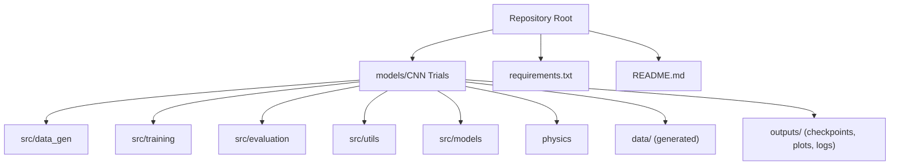
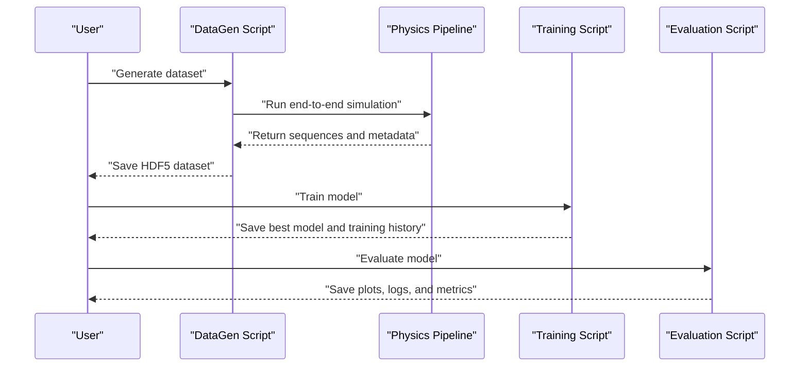
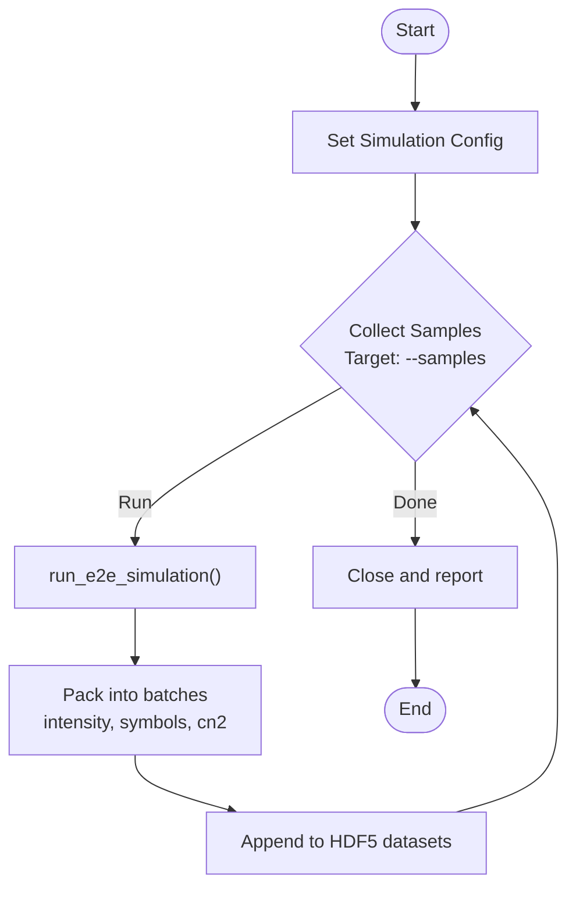
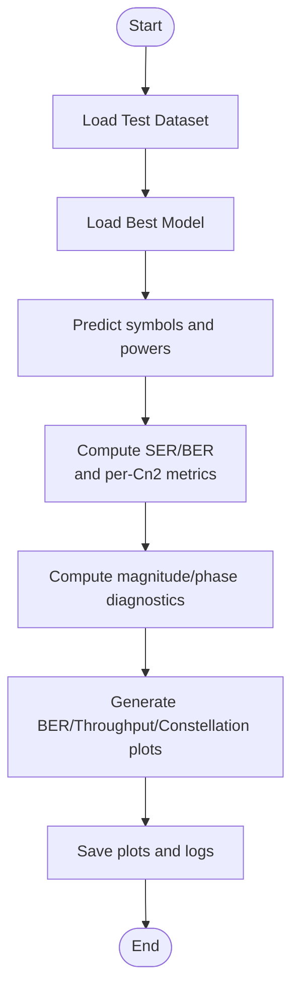
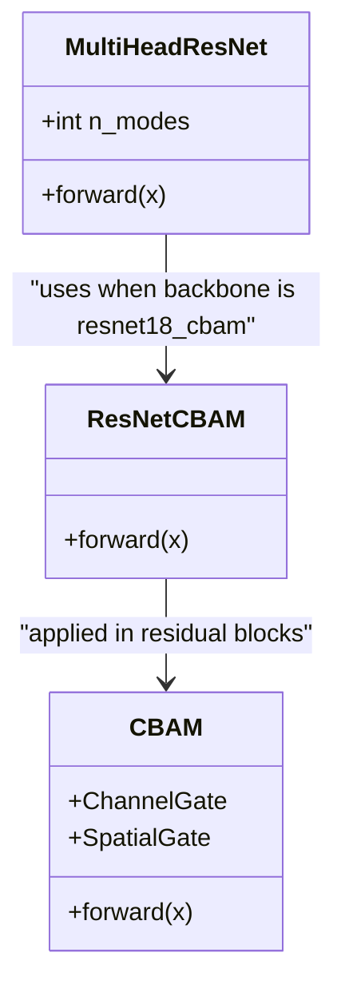
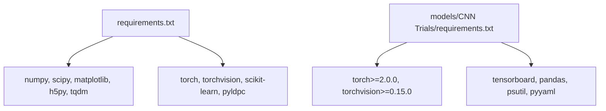

# Getting Started

<cite>
**Referenced Files in This Document**
- [README.md](file://README.md)
- [requirements.txt](file://requirements.txt)
- [models/CNN Trials/requirements.txt](file://models/CNN Trials/requirements.txt)
- [models/CNN Trials/src/data_gen/generate_dataset.py](file://models/CNN Trials/src/data_gen/generate_dataset.py)
- [models/CNN Trials/src/training/train.py](file://models/CNN Trials/src/training/train.py)
- [models/CNN Trials/src/evaluation/evaluate.py](file://models/CNN Trials/src/evaluation/evaluate.py)
- [models/CNN Trials/src/utils/dataset.py](file://models/CNN Trials/src/utils/dataset.py)
- [models/CNN Trials/src/models/model.py](file://models/CNN Trials/src/models/model.py)
- [models/CNN Trials/src/models/resnet_cbam.py](file://models/CNN Trials/src/models/resnet_cbam.py)
- [models/CNN Trials/src/models/attention.py](file://models/CNN Trials/src/models/attention.py)
- [models/CNN Trials/src/utils/device_utils.py](file://models/CNN Trials/src/utils/device_utils.py)
- [models/CNN Trials/physics/pipeline.py](file://models/CNN Trials/physics/pipeline.py)
- [models/CNN Trials/data/configs/config.json](file://models/CNN Trials/data/configs/config.json)
</cite>

## Table of Contents
1. [Introduction](#introduction)
2. [Project Structure](#project-structure)
3. [Core Components](#core-components)
4. [Architecture Overview](#architecture-overview)
5. [Detailed Component Analysis](#detailed-component-analysis)
6. [Dependency Analysis](#dependency-analysis)
7. [Performance Considerations](#performance-considerations)
8. [Troubleshooting Guide](#troubleshooting-guide)
9. [Conclusion](#conclusion)
10. [Appendices](#appendices)

## Introduction
This guide helps you quickly install and run the FSO beam recovery project from cloning to your first successful experiment. You will generate synthetic training data, train a neural receiver model, and evaluate its performance. The project supports both NVIDIA GPUs via CUDA and Apple Silicon via MPS, with CPU as a fallback.

## Project Structure
The repository is organized around two major areas:
- models/CNN Trials: The main deep learning project containing data generation, training, evaluation, and model implementations.
- models/LDPC + Pilot + MMSE trials: A classical baseline for comparison (not required for the quick start).



**Diagram sources**
- [README.md](file://README.md#L311-L350)
- [models/CNN Trials/requirements.txt](file://models/CNN Trials/requirements.txt#L1-L33)

**Section sources**
- [README.md](file://README.md#L311-L350)

## Core Components
- Data generation: Physics-based simulator wrapper that creates realistic OAM FSO datasets in HDF5 format.
- Training: Multi-head regression model with optional CBAM spatial attention, trained to recover QPSK symbols from intensity images.
- Evaluation: Computes SER/BER, throughput, constellation plots, and saves diagnostic outputs.

Key entry points:
- Data generation: [models/CNN Trials/src/data_gen/generate_dataset.py](file://models/CNN Trials/src/data_gen/generate_dataset.py#L165-L175)
- Training: [models/CNN Trials/src/training/train.py](file://models/CNN Trials/src/training/train.py#L138-L149)
- Evaluation: [models/CNN Trials/src/evaluation/evaluate.py](file://models/CNN Trials/src/evaluation/evaluate.py#L306-L314)

**Section sources**
- [models/CNN Trials/src/data_gen/generate_dataset.py](file://models/CNN Trials/src/data_gen/generate_dataset.py#L1-L175)
- [models/CNN Trials/src/training/train.py](file://models/CNN Trials/src/training/train.py#L1-L150)
- [models/CNN Trials/src/evaluation/evaluate.py](file://models/CNN Trials/src/evaluation/evaluate.py#L1-L315)

## Architecture Overview
The end-to-end workflow from data to evaluation:



**Diagram sources**
- [models/CNN Trials/src/data_gen/generate_dataset.py](file://models/CNN Trials/src/data_gen/generate_dataset.py#L17-L21)
- [models/CNN Trials/physics/pipeline.py](file://models/CNN Trials/physics/pipeline.py#L64-L439)
- [models/CNN Trials/src/training/train.py](file://models/CNN Trials/src/training/train.py#L16-L136)
- [models/CNN Trials/src/evaluation/evaluate.py](file://models/CNN Trials/src/evaluation/evaluate.py#L80-L304)

## Detailed Component Analysis

### Installation and Environment Setup
- Global dependencies: Install Python packages listed in the repository requirements.
- ML-specific requirements: Use the Apple Silicon-optimized requirements for M-series chips; otherwise use the base requirements.

Steps:
1. Clone the repository and navigate into it.
2. Install global dependencies using pip.
3. For Apple Silicon, optionally install the Apple-optimized requirements.

Notes:
- The project requires Python 3.8+ and PyTorch 2.0+.
- On Apple Silicon, PyTorch will use MPS automatically when available.

**Section sources**
- [README.md](file://README.md#L77-L86)
- [requirements.txt](file://requirements.txt#L1-L11)
- [models/CNN Trials/requirements.txt](file://models/CNN Trials/requirements.txt#L1-L33)

### Hardware and System Prerequisites
- NVIDIA GPU (CUDA): Recommended for fastest training.
- Apple Silicon (M-series): Uses MPS backend automatically.
- CPU: Supported as a fallback; expect slower performance.
- Memory: The device utilities module provides guidance for batch sizing and worker counts.

**Section sources**
- [models/CNN Trials/src/utils/device_utils.py](file://models/CNN Trials/src/utils/device_utils.py#L15-L46)
- [models/CNN Trials/src/utils/device_utils.py](file://models/CNN Trials/src/utils/device_utils.py#L106-L167)

### 30-Second Demo Walkthrough
Goal: Generate a small dataset, train a model, and evaluate it.

Commands:
1. Change to the CNN Trials directory and generate a small dataset:
   - cd "models/CNN Trials"
   - python src/data_gen/generate_dataset.py --samples 1000 --name demo
2. Train the model (short run for testing):
   - python src/training/train.py --dataset_name demo --epochs 5 --backbone resnet18_cbam
3. Evaluate the trained model:
   - python src/evaluation/evaluate.py --dataset_name demo --backbone resnet18_cbam

Expected outputs:
- Data generation: Creates an HDF5 file in the data directory.
- Training: Saves best and last checkpoints and a training history plot.
- Evaluation: Produces BER curves, throughput curves, combined plots, and constellation comparisons.

**Section sources**
- [README.md](file://README.md#L88-L100)
- [models/CNN Trials/src/data_gen/generate_dataset.py](file://models/CNN Trials/src/data_gen/generate_dataset.py#L165-L175)
- [models/CNN Trials/src/training/train.py](file://models/CNN Trials/src/training/train.py#L138-L149)
- [models/CNN Trials/src/evaluation/evaluate.py](file://models/CNN Trials/src/evaluation/evaluate.py#L306-L314)

### Data Generation Workflow
The generator uses the physics pipeline to simulate OAM FSO frames under varying turbulence conditions and writes them to HDF5.



**Diagram sources**
- [models/CNN Trials/src/data_gen/generate_dataset.py](file://models/CNN Trials/src/data_gen/generate_dataset.py#L57-L163)
- [models/CNN Trials/physics/pipeline.py](file://models/CNN Trials/physics/pipeline.py#L64-L439)

**Section sources**
- [models/CNN Trials/src/data_gen/generate_dataset.py](file://models/CNN Trials/src/data_gen/generate_dataset.py#L1-L175)
- [models/CNN Trials/physics/pipeline.py](file://models/CNN Trials/physics/pipeline.py#L1-L717)

### Training Workflow
The training script loads datasets, builds the model, trains for a specified number of epochs, and saves checkpoints.

```mermaid
sequenceDiagram
participant T as "Training Script"
participant DS as "Dataset Loader"
participant MD as "Model"
participant OPT as "Optimizer"
T->>DS : "Load train/val HDF5"
T->>MD : "Initialize MultiHeadResNet"
T->>OPT : "Configure optimizer and scheduler"
loop Epochs
T->>DS : "Iterate batches"
T->>MD : "Forward pass"
T->>OPT : "Compute loss and backward"
T->>OPT : "Step and update"
end
T->>T : "Save best and last checkpoints"
```

**Diagram sources**
- [models/CNN Trials/src/training/train.py](file://models/CNN Trials/src/training/train.py#L16-L136)
- [models/CNN Trials/src/utils/dataset.py](file://models/CNN Trials/src/utils/dataset.py#L6-L44)
- [models/CNN Trials/src/models/model.py](file://models/CNN Trials/src/models/model.py#L6-L71)

**Section sources**
- [models/CNN Trials/src/training/train.py](file://models/CNN Trials/src/training/train.py#L1-L150)
- [models/CNN Trials/src/utils/dataset.py](file://models/CNN Trials/src/utils/dataset.py#L1-L44)
- [models/CNN Trials/src/models/model.py](file://models/CNN Trials/src/models/model.py#L1-L81)

### Evaluation Workflow
The evaluation script loads the best model, computes SER/BER, breakdowns by turbulence strength, throughput, and diagnostic plots.



**Diagram sources**
- [models/CNN Trials/src/evaluation/evaluate.py](file://models/CNN Trials/src/evaluation/evaluate.py#L80-L304)

**Section sources**
- [models/CNN Trials/src/evaluation/evaluate.py](file://models/CNN Trials/src/evaluation/evaluate.py#L1-L315)

### Model Architecture
The model is a multi-head regressor built on ResNet-18 with optional CBAM spatial attention.



**Diagram sources**
- [models/CNN Trials/src/models/model.py](file://models/CNN Trials/src/models/model.py#L6-L71)
- [models/CNN Trials/src/models/resnet_cbam.py](file://models/CNN Trials/src/models/resnet_cbam.py#L51-L111)
- [models/CNN Trials/src/models/attention.py](file://models/CNN Trials/src/models/attention.py#L72-L88)

**Section sources**
- [models/CNN Trials/src/models/model.py](file://models/CNN Trials/src/models/model.py#L1-L81)
- [models/CNN Trials/src/models/resnet_cbam.py](file://models/CNN Trials/src/models/resnet_cbam.py#L1-L112)
- [models/CNN Trials/src/models/attention.py](file://models/CNN Trials/src/models/attention.py#L1-L89)

## Dependency Analysis
- Global dependencies: numpy, matplotlib, scipy, h5py, tqdm, torch, torchvision, scikit-learn, pyldpc.
- Apple Silicon optimized dependencies: torch>=2.0.0, torchvision>=0.15.0, tensorboard, pandas, psutil, yaml.



**Diagram sources**
- [requirements.txt](file://requirements.txt#L1-L11)
- [models/CNN Trials/requirements.txt](file://models/CNN Trials/requirements.txt#L1-L33)

**Section sources**
- [requirements.txt](file://requirements.txt#L1-L11)
- [models/CNN Trials/requirements.txt](file://models/CNN Trials/requirements.txt#L1-L33)

## Performance Considerations
- Device selection: The device utilities module automatically selects CUDA, MPS, or CPU and prints system information.
- Batch size and workers: Automatically tuned based on available memory and CPU cores.
- MPS specifics: On Apple Silicon, MPS shares system memory; choose conservative batch sizes for 8GB RAM systems.

**Section sources**
- [models/CNN Trials/src/utils/device_utils.py](file://models/CNN Trials/src/utils/device_utils.py#L15-L46)
- [models/CNN Trials/src/utils/device_utils.py](file://models/CNN Trials/src/utils/device_utils.py#L106-L167)

## Troubleshooting Guide
Common issues and resolutions:
- Import errors during data generation: Ensure the physics modules are present in the physics directory and importable.
- No device detected: Verify CUDA or MPS availability; the device utilities module will fall back to CPU.
- Memory issues on Apple Silicon: Reduce batch size or disable extra workers; monitor memory usage.
- Training stalls: Check that the dataset files exist and are readable; confirm HDF5 layout matches expectations.

**Section sources**
- [models/CNN Trials/src/data_gen/generate_dataset.py](file://models/CNN Trials/src/data_gen/generate_dataset.py#L17-L21)
- [models/CNN Trials/src/utils/device_utils.py](file://models/CNN Trials/src/utils/device_utils.py#L15-L46)

## Conclusion
You now have everything needed to install the project, generate a small dataset, train a model, and evaluate it. Use the 30-second demo to validate your setup, then scale to larger datasets and longer training runs as desired.

## Appendices

### Quick Start Commands Reference
- Install dependencies:
  - pip install torch torchvision numpy scipy h5py matplotlib tqdm
- Generate demo dataset:
  - cd "models/CNN Trials"
  - python src/data_gen/generate_dataset.py --samples 1000 --name demo
- Train model:
  - python src/training/train.py --dataset_name demo --epochs 5 --backbone resnet18_cbam
- Evaluate model:
  - python src/evaluation/evaluate.py --dataset_name demo --backbone resnet18_cbam

**Section sources**
- [README.md](file://README.md#L77-L100)