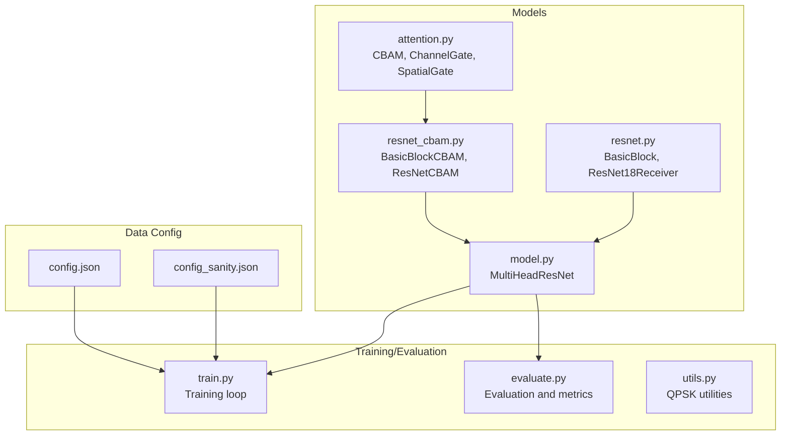
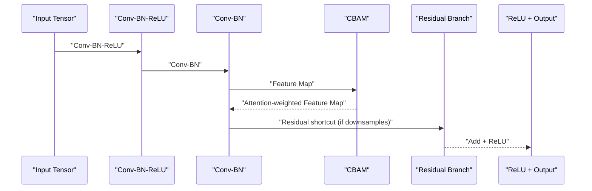
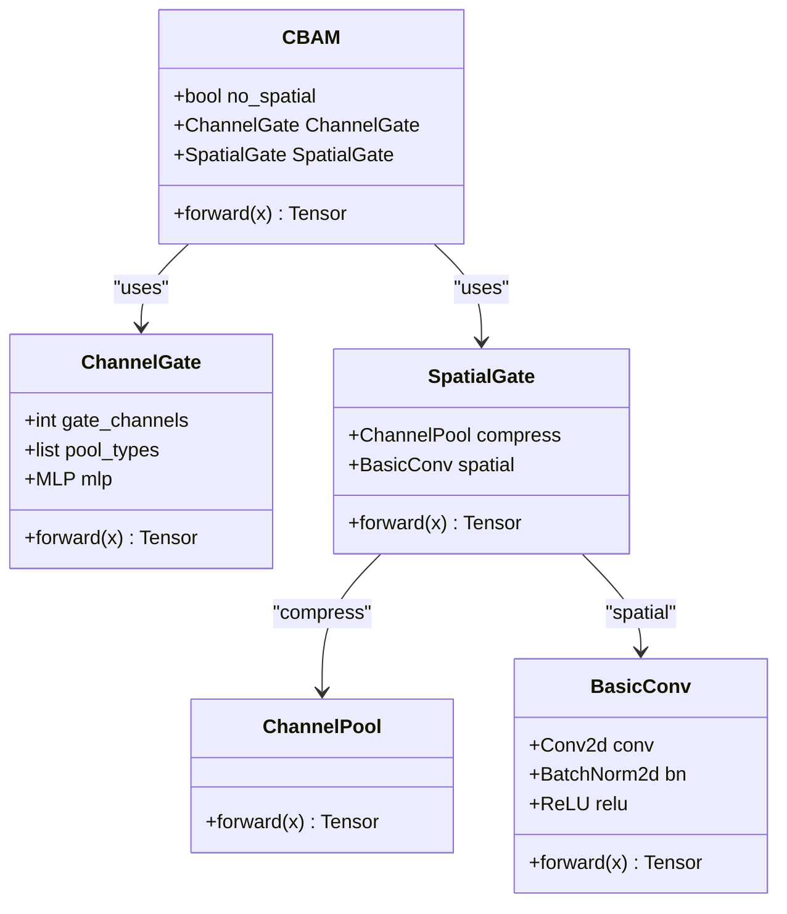
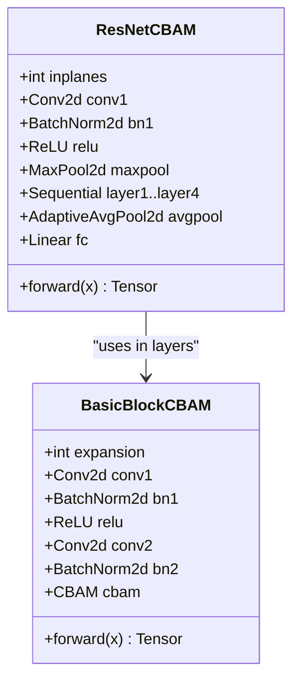
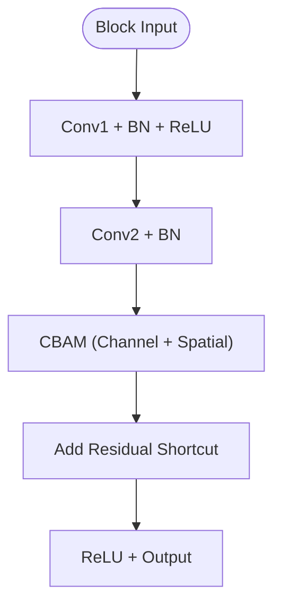
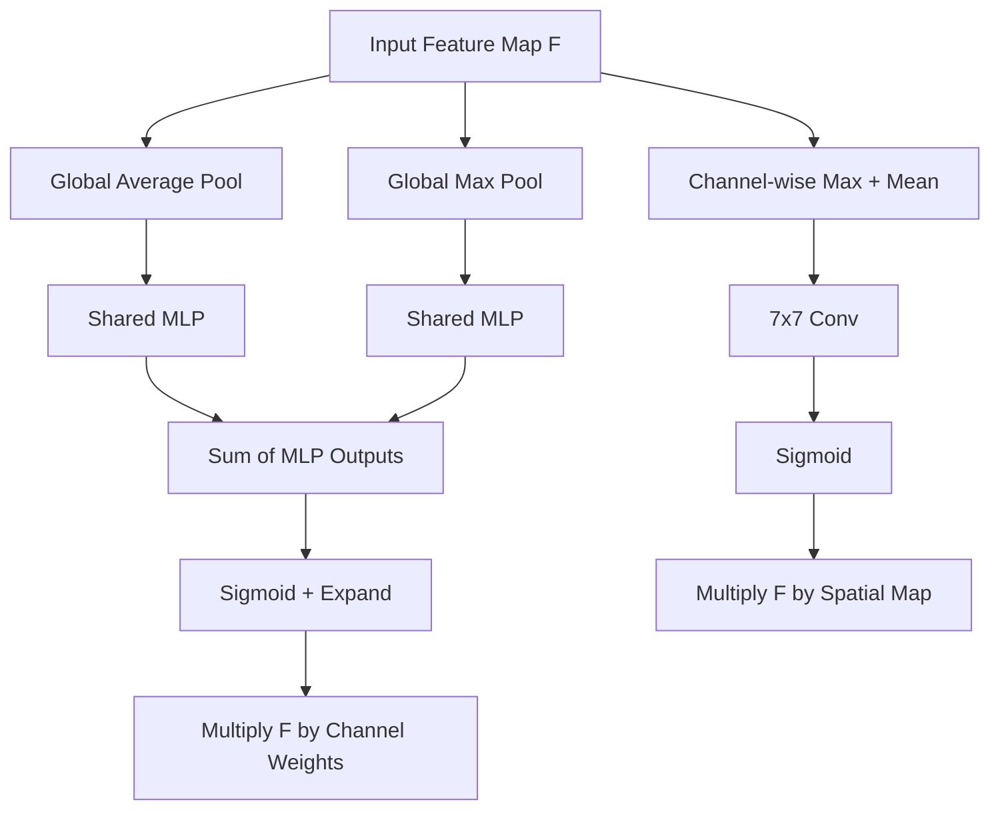
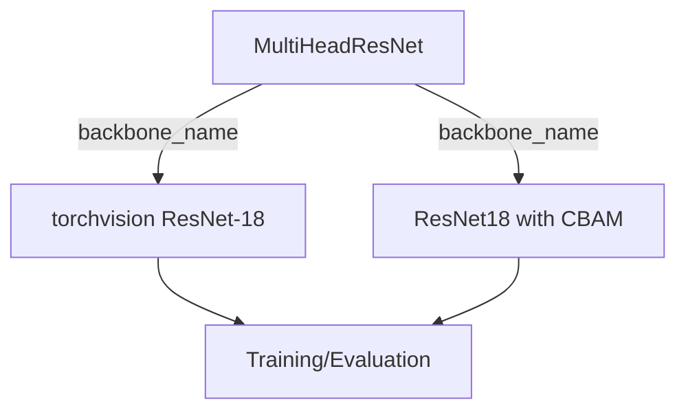

# CBAM Attention Mechanisms

<cite>
**Referenced Files in This Document**
- [attention.py](file://models/CNN Trials/src/models/attention.py)
- [resnet_cbam.py](file://models/CNN Trials/src/models/resnet_cbam.py)
- [resnet.py](file://models/CNN Trials/src/models/resnet.py)
- [model.py](file://models/CNN Trials/src/models/model.py)
- [train.py](file://models/CNN Trials/src/training/train.py)
- [evaluate.py](file://models/CNN Trials/src/evaluation/evaluate.py)
- [utils.py](file://models/CNN Trials/src/utils/utils.py)
- [config.json](file://models/CNN Trials/data/configs/config.json)
- [config_sanity.json](file://models/CNN Trials/data/configs/config_sanity.json)
</cite>

## Table of Contents
1. [Introduction](#introduction)
2. [Project Structure](#project-structure)
3. [Core Components](#core-components)
4. [Architecture Overview](#architecture-overview)
5. [Detailed Component Analysis](#detailed-component-analysis)
6. [Dependency Analysis](#dependency-analysis)
7. [Performance Considerations](#performance-considerations)
8. [Troubleshooting Guide](#troubleshooting-guide)
9. [Conclusion](#conclusion)
10. [Appendices](#appendices)

## Introduction
This document explains the Convolutional Block Attention Module (CBAM) integrated into a ResNet-18 architecture for optical orbital angular momentum (OAM) signal recovery. CBAM enhances feature maps by jointly learning channel-wise and spatial attention, enabling the model to emphasize important channels and spatial regions. The implementation integrates CBAM into residual blocks of ResNet-18, applies attention before residual addition, and evaluates performance on a turbulence-aware dataset.

## Project Structure
The CBAM-enabled ResNet-18 resides in the CNN Trials module. Key files:
- Attention modules: ChannelGate, SpatialGate, and CBAM
- ResNet-18 with CBAM blocks
- Multi-head backbone wrapper for OAM symbol and power estimation
- Training and evaluation scripts that support both vanilla ResNet-18 and ResNet-18 with CBAM

**Diagram sources**
- [attention.py](file://models/CNN Trials/src/models/attention.py#L25-L88)
- [resnet_cbam.py](file://models/CNN Trials/src/models/resnet_cbam.py#L11-L111)
- [resnet.py](file://models/CNN Trials/src/models/resnet.py#L13-L218)
- [model.py](file://models/CNN Trials/src/models/model.py#L6-L71)
- [train.py](file://models/CNN Trials/src/training/train.py#L16-L149)
- [evaluate.py](file://models/CNN Trials/src/evaluation/evaluate.py#L80-L314)
- [utils.py](file://models/CNN Trials/src/utils/utils.py#L16-L317)
- [config.json](file://models/CNN Trials/data/configs/config.json#L1-L136)
- [config_sanity.json](file://models/CNN Trials/data/configs/config_sanity.json#L1-L106)

**Section sources**
- [attention.py](file://models/CNN Trials/src/models/attention.py#L1-L89)
- [resnet_cbam.py](file://models/CNN Trials/src/models/resnet_cbam.py#L1-L112)
- [resnet.py](file://models/CNN Trials/src/models/resnet.py#L1-L218)
- [model.py](file://models/CNN Trials/src/models/model.py#L1-L81)
- [train.py](file://models/CNN Trials/src/training/train.py#L1-L150)
- [evaluate.py](file://models/CNN Trials/src/evaluation/evaluate.py#L1-L315)
- [utils.py](file://models/CNN Trials/src/utils/utils.py#L1-L318)
- [config.json](file://models/CNN Trials/data/configs/config.json#L1-L136)
- [config_sanity.json](file://models/CNN Trials/data/configs/config_sanity.json#L1-L106)

## Core Components
- CBAM: Combines channel and spatial attention gates sequentially.
- ChannelGate: Applies global average and max pooling across spatial dimensions, passes pooled vectors through a shared MLP, sums contributions, and scales channels via sigmoid.
- SpatialGate: Concatenates channel-wise max and mean across channels, feeds through a 7x7 conv, and scales spatial locations via sigmoid.
- BasicBlockCBAM: Residual block variant that applies CBAM to intermediate feature maps before residual addition.
- ResNetCBAM: ResNet-18 variant with CBAM-enabled blocks.
- MultiHeadResNet: Backbone wrapper that supports both vanilla ResNet-18 and ResNet-18 with CBAM, with separate heads for symbol and power estimation.

**Section sources**
- [attention.py](file://models/CNN Trials/src/models/attention.py#L25-L88)
- [resnet_cbam.py](file://models/CNN Trials/src/models/resnet_cbam.py#L11-L111)
- [model.py](file://models/CNN Trials/src/models/model.py#L6-L71)

## Architecture Overview
The CBAM-enhanced ResNet-18 integrates attention gates inside residual blocks. The attention mechanism operates on feature maps produced by convolutions within each block, emphasizing important channels and spatial locations before residual addition.

**Diagram sources**
- [resnet_cbam.py](file://models/CNN Trials/src/models/resnet_cbam.py#L29-L49)
- [attention.py](file://models/CNN Trials/src/models/attention.py#L72-L88)

## Detailed Component Analysis

### CBAM Implementation Details
- Channel attention:
  - Global average and max pooling across spatial dimensions reduce each channel to a scalar.
  - Shared MLP (two linear layers with ReLU and squeeze-and-excitation via sigmoid) produces channel-wise weights.
  - Contributions from average and max pools are summed; weights are expanded to match input spatial dimensions and broadcast-multiplied with the input feature map.
- Spatial attention:
  - Channel-wise concatenation of max and mean across channels produces a 2-channel input.
  - A 7x7 convolution generates a spatial attention map; sigmoid scaling is applied and broadcast-multiplied with the input feature map.
- Sequential composition:
  - ChannelGate is applied first, followed by SpatialGate (unless disabled).

**Diagram sources**
- [attention.py](file://models/CNN Trials/src/models/attention.py#L25-L88)

**Section sources**
- [attention.py](file://models/CNN Trials/src/models/attention.py#L25-L88)

### ResNet-18 with CBAM Blocks
- BasicBlockCBAM:
  - Two 3x3 convolutions with batch normalization and ReLU.
  - Downsample branch handled when stride > 1 or channel mismatch occurs.
  - CBAM is applied to the output of the second convolution before residual addition.
- ResNetCBAM:
  - Standard stem (conv-bn-relu-maxpool).
  - Four residual stages with configurable block counts.
  - Global average pooling and fully connected classifier head.

**Diagram sources**
- [resnet_cbam.py](file://models/CNN Trials/src/models/resnet_cbam.py#L11-L111)

**Section sources**
- [resnet_cbam.py](file://models/CNN Trials/src/models/resnet_cbam.py#L11-L111)

### Integration Strategy Within ResNet Blocks
- Placement: CBAM is inserted after the second convolution and batch normalization within each residual block, prior to residual addition. This ensures attention is applied to activated features rather than raw inputs.
- Gating mechanism:
  - Channel attention map is computed from global spatial statistics and scaled per channel.
  - Spatial attention map is computed from channel-wise max/mean and scaled per spatial location.
  - Both attention maps are element-wise multiplied with the feature map to emphasize important channels/spatial regions.

**Diagram sources**
- [resnet_cbam.py](file://models/CNN Trials/src/models/resnet_cbam.py#L29-L49)
- [attention.py](file://models/CNN Trials/src/models/attention.py#L72-L88)

**Section sources**
- [resnet_cbam.py](file://models/CNN Trials/src/models/resnet_cbam.py#L29-L49)
- [attention.py](file://models/CNN Trials/src/models/attention.py#L72-L88)

### Mathematical Formulations
- Channel attention:
  - Let F ∈ R^{C×H×W} be the feature map.
  - Global average and max pooling produce channel vectors:
    - v_avg = MLP(AvgPool(F)) ∈ R^C
    - v_max = MLP(MaxPool(F)) ∈ R^C
  - Channel weights:
    - w = σ(v_avg + v_max) ∈ R^C
  - Scaled feature map:
    - F_channel = F ⊙ w.unsqueeze(2).unsqueeze(3)
- Spatial attention:
  - Channel-wise max and mean across channels:
    - M = max(F, dim=1), m = mean(F, dim=1)
  - Concatenated channel-wise map:
    - M_cat = cat([M, m], dim=1) ∈ R^{2×H×W}
  - Spatial attention map:
    - A_spatial = σ(conv_7×7(M_cat)) ∈ R^{1×H×W}
  - Scaled feature map:
    - F_spatial = F ⊙ A_spatial
- Sequential composition:
  - F_CBAM = SpatialGate(ChannelGate(F))

**Section sources**
- [attention.py](file://models/CNN Trials/src/models/attention.py#L25-L88)

### Attention Map Generation Process
- ChannelGate:
  - Pool spatially to obtain per-channel descriptors.
  - Pass through shared MLP to produce channel weights.
  - Sum contributions from average and max pools; expand and multiply with input.
- SpatialGate:
  - Compress channels to 2-channel representation via channel-wise max and mean.
  - Apply 7x7 convolution to produce spatial attention map.
  - Multiply attention map with input feature map.

**Diagram sources**
- [attention.py](file://models/CNN Trials/src/models/attention.py#L25-L88)

**Section sources**
- [attention.py](file://models/CNN Trials/src/models/attention.py#L25-L88)

### Integration Strategies Within ResNet Blocks
- CBAM is instantiated per block with a channel dimension argument aligned to the block’s output channels.
- The attention is applied immediately after the second convolution and batch normalization, before residual addition, ensuring attention focuses on activated features.
- Downsample branches are handled independently; CBAM is applied only to the main feature pathway.

**Section sources**
- [resnet_cbam.py](file://models/CNN Trials/src/models/resnet_cbam.py#L14-L49)

### Visualization Examples of Attention Maps
- The codebase does not include explicit visualization of attention maps. However, evaluation scripts compute BER and SER curves and save diagnostic plots. Users can integrate visualization by extracting attention maps from the CBAM module during inference and plotting heatmaps overlaid on input images.

[No sources needed since this section provides general guidance]

### Performance Improvements Achieved Through Attention Mechanisms
- Training and evaluation scripts support both vanilla ResNet-18 and ResNet-18 with CBAM. The evaluation script computes SER and BER across turbulence strengths and saves throughput curves. Comparisons between the two backbones can be performed by switching the backbone name in training and evaluation.

**Section sources**
- [train.py](file://models/CNN Trials/src/training/train.py#L16-L149)
- [evaluate.py](file://models/CNN Trials/src/evaluation/evaluate.py#L80-L314)

### Guidelines for Attention Module Placement and Configuration
- Placement:
  - Apply CBAM after the second convolution in residual blocks and before residual addition.
  - Ensure channel alignment matches the block’s output channels.
- Configuration:
  - Reduction ratio controls MLP width; typical value is 16.
  - Spatial gate can be disabled by setting no_spatial to True if only channel attention is desired.
  - CBAM can be toggled per block via a flag in the block constructor.

**Section sources**
- [resnet_cbam.py](file://models/CNN Trials/src/models/resnet_cbam.py#L14-L27)
- [attention.py](file://models/CNN Trials/src/models/attention.py#L72-L88)

## Dependency Analysis
- MultiHeadResNet selects either a vanilla torchvision ResNet-18 or a custom ResNet-18 with CBAM by name. The custom backbone replaces the first convolution to accept single-channel inputs and removes the final classifier for multi-head heads.
- Training and evaluation scripts accept a backbone argument to switch between resnet18 and resnet18_cbam.

**Diagram sources**
- [model.py](file://models/CNN Trials/src/models/model.py#L18-L27)
- [train.py](file://models/CNN Trials/src/training/train.py#L144-L147)
- [evaluate.py](file://models/CNN Trials/src/evaluation/evaluate.py#L310-L312)

**Section sources**
- [model.py](file://models/CNN Trials/src/models/model.py#L18-L27)
- [train.py](file://models/CNN Trials/src/training/train.py#L144-L147)
- [evaluate.py](file://models/CNN Trials/src/evaluation/evaluate.py#L310-L312)

## Performance Considerations
- Computational overhead: CBAM adds minimal extra computation compared to standard ResNet blocks due to global pooling and small shared MLPs.
- Memory footprint: Attention maps are computed on-the-fly and do not require persistent storage beyond the forward pass.
- Regularization: The shared MLPs and sigmoid gating introduce slight regularization effects, potentially improving generalization.

[No sources needed since this section provides general guidance]

## Troubleshooting Guide
- Incorrect channel alignment: Ensure CBAM is instantiated with the correct number of channels matching the block’s output.
- Downsample mismatch: Verify that the downsample branch handles both spatial and channel dimension changes when stride > 1.
- Device and dtype issues: Training and evaluation scripts move tensors to CUDA/MPS/CPUs depending on availability; ensure inputs are on the correct device.
- Evaluation metrics: The evaluation script computes SER and BER and saves throughput curves; confirm model weights are loaded correctly for the chosen backbone.

**Section sources**
- [resnet_cbam.py](file://models/CNN Trials/src/models/resnet_cbam.py#L74-L89)
- [train.py](file://models/CNN Trials/src/training/train.py#L17-L18)
- [evaluate.py](file://models/CNN Trials/src/evaluation/evaluate.py#L80-L93)

## Conclusion
The CBAM attention mechanism is seamlessly integrated into ResNet-18 blocks, enhancing channel and spatial selectivity through global pooling and shared MLPs. The implementation supports both vanilla and CBAM variants, enabling straightforward comparison of performance gains on OAM symbol recovery tasks. Users can leverage the provided training and evaluation scripts to assess improvements across turbulence conditions.

## Appendices

### Appendix A: Data Configuration Notes
- The dataset configuration specifies input channels, input shape, and output shapes for symbol regression. These settings align with the single-channel intensity inputs and multi-mode symbol outputs used by the models.

**Section sources**
- [config.json](file://models/CNN Trials/data/configs/config.json#L105-L119)
- [config_sanity.json](file://models/CNN Trials/data/configs/config_sanity.json#L75-L89)