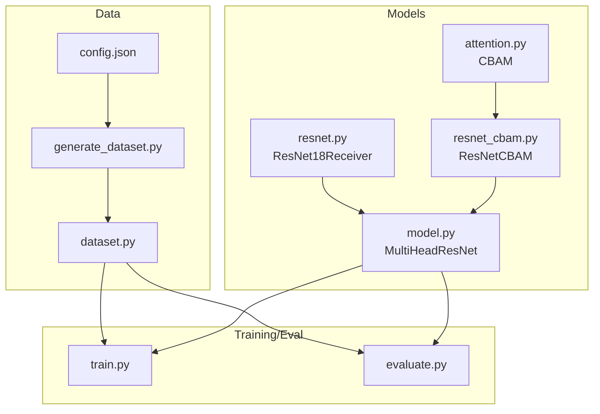
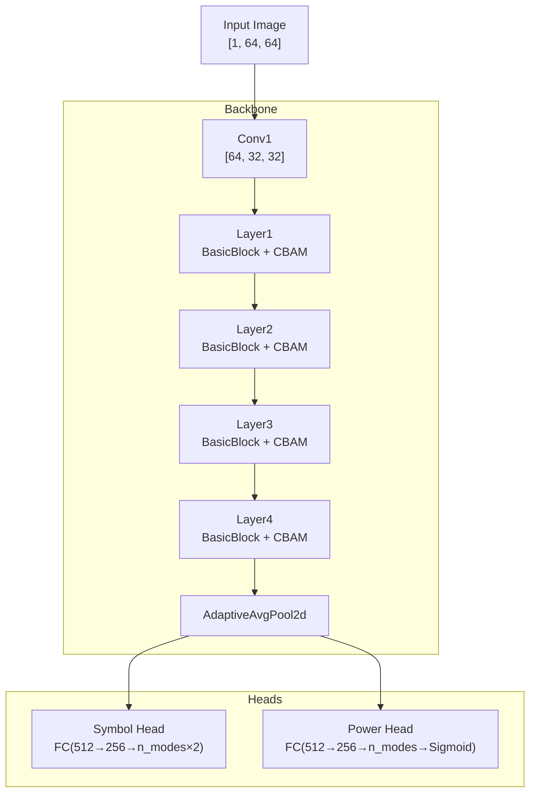
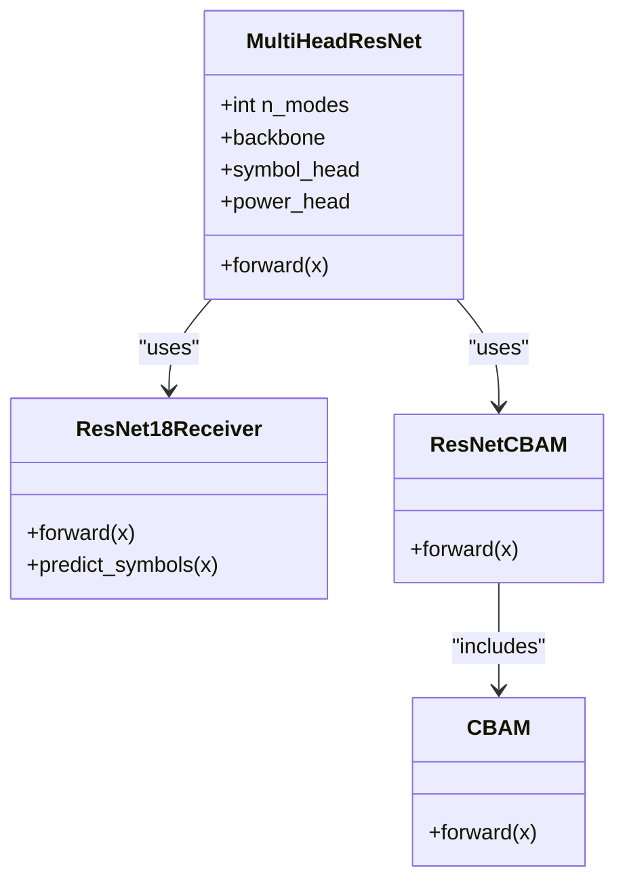
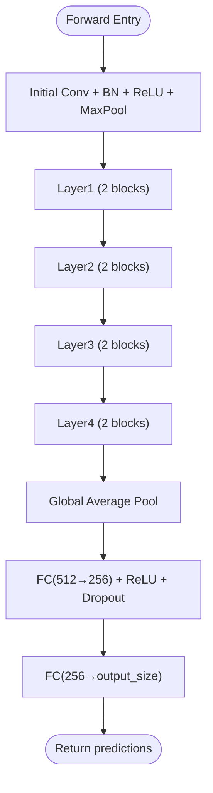
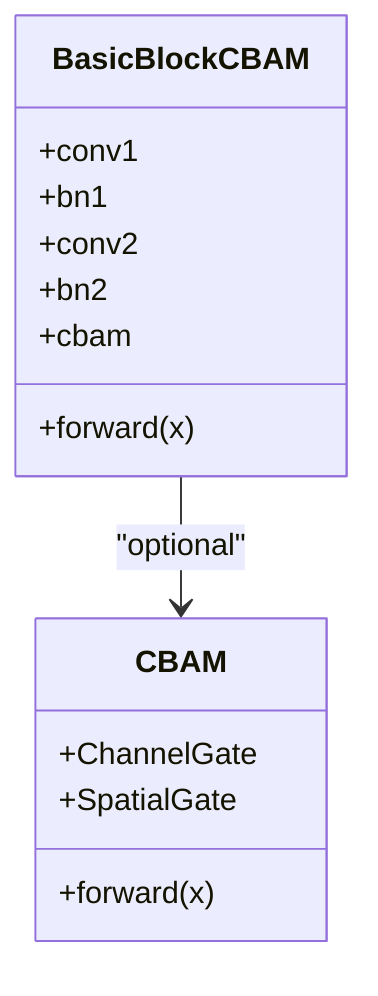
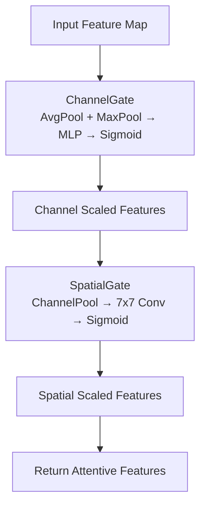
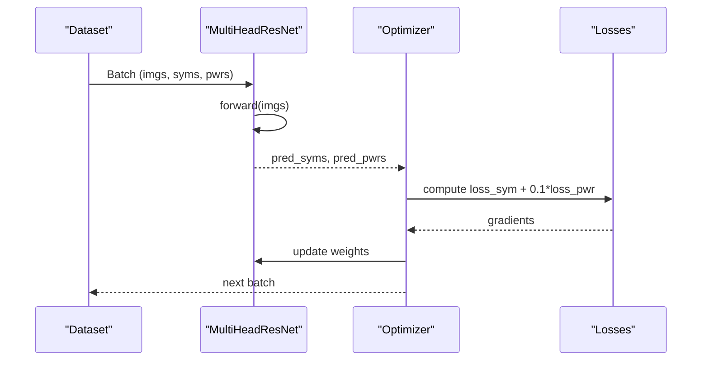
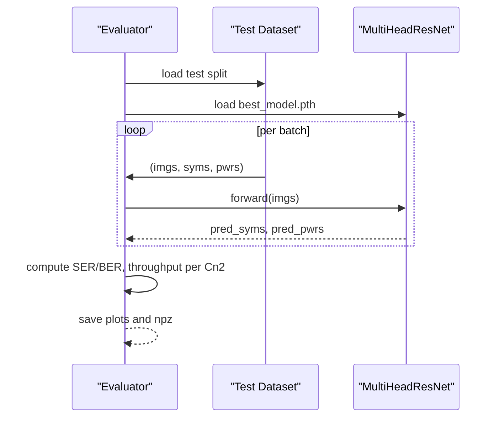
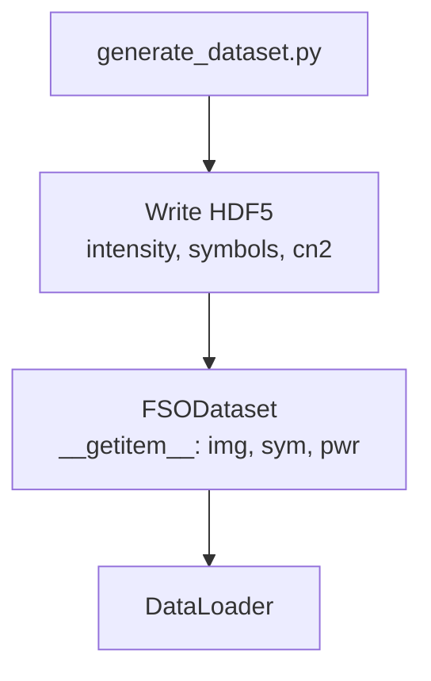
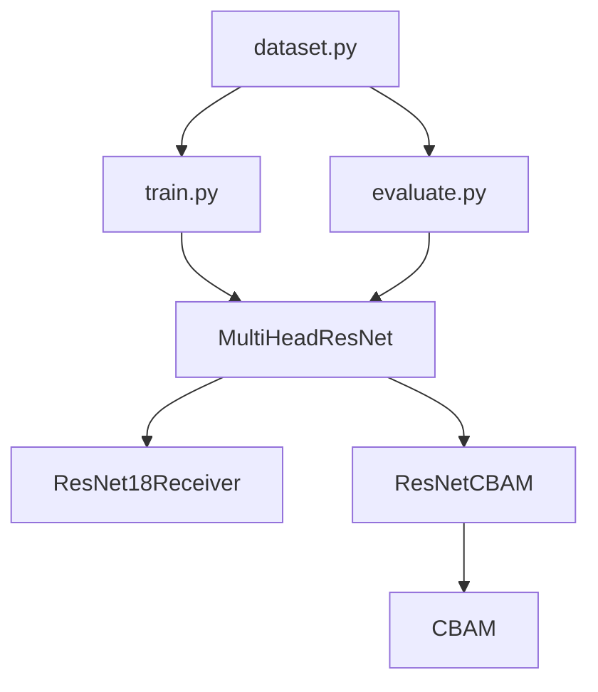

# Machine Learning Models

<cite>
**Referenced Files in This Document**
- [README.md](file://README.md)
- [config.json](file://models/CNN Trials/data/configs/config.json)
- [generate_dataset.py](file://models/CNN Trials/src/data_gen/generate_dataset.py)
- [dataset.py](file://models/CNN Trials/src/utils/dataset.py)
- [model.py](file://models/CNN Trials/src/models/model.py)
- [resnet.py](file://models/CNN Trials/src/models/resnet.py)
- [resnet_cbam.py](file://models/CNN Trials/src/models/resnet_cbam.py)
- [attention.py](file://models/CNN Trials/src/models/attention.py)
- [train.py](file://models/CNN Trials/src/training/train.py)
- [evaluate.py](file://models/CNN Trials/src/evaluation/evaluate.py)
</cite>

## Table of Contents
1. [Introduction](#introduction)
2. [Project Structure](#project-structure)
3. [Core Components](#core-components)
4. [Architecture Overview](#architecture-overview)
5. [Detailed Component Analysis](#detailed-component-analysis)
6. [Dependency Analysis](#dependency-analysis)
7. [Performance Considerations](#performance-considerations)
8. [Troubleshooting Guide](#troubleshooting-guide)
9. [Conclusion](#conclusion)
10. [Appendices](#appendices)

## Introduction
This document explains the neural receiver architecture designed for free-space optical (FSO) orbital angular momentum (OAM) signal recovery. The system uses a multi-head CNN built on a ResNet-18 backbone, augmented with Convolutional Block Attention Modules (CBAM) to improve resilience in atmospheric turbulence. The model predicts both the complex QPSK symbols for each spatial mode and an auxiliary power estimate per mode, enabling robust demodulation and throughput assessment.

The goal is to recover symbol phase information from intensity-only measurements, avoiding the need for expensive phase-measuring hardware. The architecture evolution progresses from a baseline ResNet-18 to a CBAM-enhanced variant, delivering significant resilience gains in strong turbulence regimes.

## Project Structure
The machine learning stack resides under models/CNN Trials and comprises:
- Data generation and configuration
- PyTorch model definitions (baseline ResNet-18, CBAM-resnet variants, and the multi-head receiver)
- Training and evaluation pipelines
- Utilities for dataset handling and metrics

**Diagram sources**
- [config.json](file://models/CNN Trials/data/configs/config.json#L1-L136)
- [generate_dataset.py](file://models/CNN Trials/src/data_gen/generate_dataset.py#L1-L175)
- [dataset.py](file://models/CNN Trials/src/utils/dataset.py#L1-L44)
- [model.py](file://models/CNN Trials/src/models/model.py#L1-L81)
- [resnet.py](file://models/CNN Trials/src/models/resnet.py#L1-L218)
- [resnet_cbam.py](file://models/CNN Trials/src/models/resnet_cbam.py#L1-L112)
- [attention.py](file://models/CNN Trials/src/models/attention.py#L1-L89)
- [train.py](file://models/CNN Trials/src/training/train.py#L1-L150)
- [evaluate.py](file://models/CNN Trials/src/evaluation/evaluate.py#L1-L315)

**Section sources**
- [README.md](file://README.md#L311-L350)

## Core Components
- MultiHeadResNet: The primary neural receiver with a shared backbone and two heads:
  - Symbol head: regression to real/imaginary parts of QPSK symbols per mode.
  - Power head: auxiliary task to estimate per-mode power presence.
- ResNet-18 baseline: Modified ResNet-18 for 1-channel inputs and regression output.
- ResNet-18 + CBAM: ResNet-18 with CBAM attention inserted into residual blocks.
- CBAM attention module: Channel and spatial gating to highlight informative regions.

Implementation specifics:
- Input: 1-channel intensity images sized 64×64.
- Symbol head: fully connected layers producing flattened [Re_0, Im_0, ..., Re_{n_modes-1}, Im_{n_modes-1}].
- Power head: fully connected layers producing per-mode probabilities in [0,1].

**Section sources**
- [model.py](file://models/CNN Trials/src/models/model.py#L6-L71)
- [resnet.py](file://models/CNN Trials/src/models/resnet.py#L47-L148)
- [resnet_cbam.py](file://models/CNN Trials/src/models/resnet_cbam.py#L51-L111)
- [attention.py](file://models/CNN Trials/src/models/attention.py#L72-L89)

## Architecture Overview
The neural receiver architecture integrates a shared backbone with dual heads. The backbone extracts hierarchical spatial features from the intensity image. The symbol head regresses complex symbols per mode, while the power head estimates per-mode power presence. CBAM attention refocuses the backbone’s attention on beam fragments and suppresses noise.

**Diagram sources**
- [model.py](file://models/CNN Trials/src/models/model.py#L18-L71)
- [resnet_cbam.py](file://models/CNN Trials/src/models/resnet_cbam.py#L51-L106)
- [attention.py](file://models/CNN Trials/src/models/attention.py#L72-L89)

## Detailed Component Analysis

### MultiHeadResNet
- Backbone selection: ImageNet-pretrained ResNet-18 or a custom ResNet-18 with CBAM.
- First-layer adaptation: Replaces ImageNet 3-channel conv with 1-channel conv for intensity input.
- Head architectures:
  - Symbol head: FC(512→256) with ReLU and dropout, then FC to n_modes×2.
  - Power head: FC(512→256) with ReLU and dropout, then FC to n_modes with Sigmoid.
- Forward pass returns both symbol and power predictions.

**Diagram sources**
- [model.py](file://models/CNN Trials/src/models/model.py#L6-L71)
- [resnet.py](file://models/CNN Trials/src/models/resnet.py#L47-L148)
- [resnet_cbam.py](file://models/CNN Trials/src/models/resnet_cbam.py#L51-L111)
- [attention.py](file://models/CNN Trials/src/models/attention.py#L72-L89)

**Section sources**
- [model.py](file://models/CNN Trials/src/models/model.py#L6-L71)

### ResNet-18 Baseline (ResNet18Receiver)
- Basic residual blocks with 2 blocks per stage.
- Initial conv-bn-relu-maxpool, followed by four residual stages.
- Global average pooling and FC layers for regression to 16 outputs (8 modes × 2).
- Utility method to convert raw outputs to complex symbols.

**Diagram sources**
- [resnet.py](file://models/CNN Trials/src/models/resnet.py#L116-L148)

**Section sources**
- [resnet.py](file://models/CNN Trials/src/models/resnet.py#L47-L148)

### ResNet-18 + CBAM (ResNetCBAM)
- Residual blocks augmented with CBAM gates after conv2.
- Channel attention learns which channels are informative.
- Spatial attention focuses on beam hotspots and suppresses background noise.
- Designed as a drop-in replacement backbone for MultiHeadResNet.

**Diagram sources**
- [resnet_cbam.py](file://models/CNN Trials/src/models/resnet_cbam.py#L11-L49)
- [attention.py](file://models/CNN Trials/src/models/attention.py#L25-L89)

**Section sources**
- [resnet_cbam.py](file://models/CNN Trials/src/models/resnet_cbam.py#L51-L111)
- [attention.py](file://models/CNN Trials/src/models/attention.py#L72-L89)

### Attention Mechanisms (CBAM)
- ChannelGate: MLP over global average and max pooled features to produce channel-wise scales.
- SpatialGate: Compresses channels to 2 channels (max and mean), convolves with a 7×7 kernel, and applies sigmoid to produce spatial scales.
- CBAM combines both gates sequentially to refine features.

**Diagram sources**
- [attention.py](file://models/CNN Trials/src/models/attention.py#L25-L89)

**Section sources**
- [attention.py](file://models/CNN Trials/src/models/attention.py#L72-L89)

### Training Pipeline
- Device detection (CUDA/MPS/CPU).
- Data loaders for train/val splits from HDF5.
- Losses:
  - Symbol MSE loss.
  - Power Binary Cross-Entropy loss.
- Optimizer: Adam with ReduceLROnPlateau scheduler.
- Training history saved and best model checkpointed.

**Diagram sources**
- [train.py](file://models/CNN Trials/src/training/train.py#L16-L124)
- [model.py](file://models/CNN Trials/src/models/model.py#L59-L71)

**Section sources**
- [train.py](file://models/CNN Trials/src/training/train.py#L16-L124)

### Evaluation Pipeline
- Loads best model checkpoint and evaluates on test set.
- Computes SER and BER across modes and aggregates per Cn2.
- Calculates effective throughput considering LDPC and pilot overhead.
- Produces diagnostic plots and saves results.

**Diagram sources**
- [evaluate.py](file://models/CNN Trials/src/evaluation/evaluate.py#L80-L286)
- [model.py](file://models/CNN Trials/src/models/model.py#L59-L71)

**Section sources**
- [evaluate.py](file://models/CNN Trials/src/evaluation/evaluate.py#L80-L286)

### Data Generation and Dataset
- Dataset generator simulates FSO frames with turbulence and writes HDF5 with intensity, symbols, and cn2 metadata.
- FSODataset loads intensity images and targets, normalizes to [0,1], and exposes n_modes.

**Diagram sources**
- [generate_dataset.py](file://models/CNN Trials/src/data_gen/generate_dataset.py#L57-L163)
- [dataset.py](file://models/CNN Trials/src/utils/dataset.py#L6-L43)

**Section sources**
- [generate_dataset.py](file://models/CNN Trials/src/data_gen/generate_dataset.py#L57-L163)
- [dataset.py](file://models/CNN Trials/src/utils/dataset.py#L6-L43)

## Dependency Analysis
- MultiHeadResNet depends on torchvision ResNet-18 or a custom ResNet-18 with CBAM.
- ResNet-18 with CBAM depends on CBAM attention modules.
- Training and evaluation depend on the model definition and dataset utilities.

**Diagram sources**
- [model.py](file://models/CNN Trials/src/models/model.py#L18-L27)
- [resnet.py](file://models/CNN Trials/src/models/resnet.py#L47-L57)
- [resnet_cbam.py](file://models/CNN Trials/src/models/resnet_cbam.py#L51-L111)
- [attention.py](file://models/CNN Trials/src/models/attention.py#L72-L89)
- [train.py](file://models/CNN Trials/src/training/train.py#L12-L14)
- [evaluate.py](file://models/CNN Trials/src/evaluation/evaluate.py#L9-L10)
- [dataset.py](file://models/CNN Trials/src/utils/dataset.py#L6-L43)

**Section sources**
- [model.py](file://models/CNN Trials/src/models/model.py#L18-L27)
- [resnet.py](file://models/CNN Trials/src/models/resnet.py#L47-L57)
- [resnet_cbam.py](file://models/CNN Trials/src/models/resnet_cbam.py#L51-L111)
- [attention.py](file://models/CNN Trials/src/models/attention.py#L72-L89)
- [train.py](file://models/CNN Trials/src/training/train.py#L12-L14)
- [evaluate.py](file://models/CNN Trials/src/evaluation/evaluate.py#L9-L10)
- [dataset.py](file://models/CNN Trials/src/utils/dataset.py#L6-L43)

## Performance Considerations
- Model complexity: The baseline ResNet-18 backbone plus heads yields approximately 12M parameters for the CBAM variant.
- Inference speed: The paper reports around 1–2 ms on GPU for inference, enabling real-time operation.
- Training time: On a single V100 GPU, training for 100k samples over 50 epochs takes several hours.
- Data format: Intensity images normalized to [0,1] with 64×64 resolution and 1 channel.
- Loss weighting: The combined loss blends symbol MSE and power BCE with a small weight on power.

Practical tips:
- Prefer GPU acceleration for training and evaluation.
- Use ImageNet-pretrained backbone for faster convergence.
- Monitor validation loss and LR scheduling to avoid overfitting.
- Validate model selection by comparing SER/BER and throughput across Cn2 regimes.

[No sources needed since this section provides general guidance]

## Troubleshooting Guide
Common issues and remedies:
- Zero outputs or collapsed predictions:
  - Symptoms: Mean magnitude near zero, high phase jitter, or random guessing.
  - Causes: Poor initialization, vanishing gradients, or incorrect loss scaling.
  - Actions: Verify loss computation, check LR schedule, and ensure targets are shaped correctly.
- Systematic phase rotation:
  - Symptoms: Nonzero mean phase bias with low jitter.
  - Causes: Pilot ambiguity or inconsistent phase reference.
  - Actions: Inspect phase diagnostics and consider pilot calibration.
- Overfitting:
  - Symptoms: Large gap between training and validation loss.
  - Actions: Increase dropout, reduce LR, or augment data.

Diagnostic utilities:
- SER/BER computation and breakdown by Cn2.
- Throughput calculations accounting for LDPC and pilot overhead.
- Constellation plots and phase/magnitude diagnostics.

**Section sources**
- [evaluate.py](file://models/CNN Trials/src/evaluation/evaluate.py#L193-L221)
- [train.py](file://models/CNN Trials/src/training/train.py#L30-L34)

## Conclusion
The neural receiver architecture leverages a ResNet-18 backbone with CBAM attention to recover OAM-encoded QPSK symbols from intensity-only measurements. The dual-head design enables robust symbol recovery and auxiliary power estimation, yielding substantial resilience gains in strong turbulence. The modular design allows straightforward training, evaluation, and deployment, with clear diagnostics for troubleshooting.

[No sources needed since this section summarizes without analyzing specific files]

## Appendices

### Practical Procedures

- Training procedure
  - Prepare datasets using the generator and configuration.
  - Launch training with desired backbone and hyperparameters.
  - Monitor training history and LR decay; save best model checkpoints.
  - Resume training from last checkpoint if needed.

- Inference procedure
  - Load best model checkpoint.
  - Run evaluation on test sets to compute SER/BER and throughput.
  - Generate diagnostic plots and save results for comparison.

- Model selection criteria
  - Compare SER/BER and throughput across Cn2 regimes.
  - Prefer CBAM-enhanced model for strong turbulence scenarios.
  - Validate with constellation plots and phase diagnostics.

- Deployment considerations
  - Ensure GPU availability for inference.
  - Store model checkpoints and configuration metadata.
  - Validate input normalization and target shapes.

**Section sources**
- [README.md](file://README.md#L257-L308)
- [config.json](file://models/CNN Trials/data/configs/config.json#L1-L136)
- [generate_dataset.py](file://models/CNN Trials/src/data_gen/generate_dataset.py#L57-L163)
- [train.py](file://models/CNN Trials/src/training/train.py#L138-L149)
- [evaluate.py](file://models/CNN Trials/src/evaluation/evaluate.py#L306-L314)