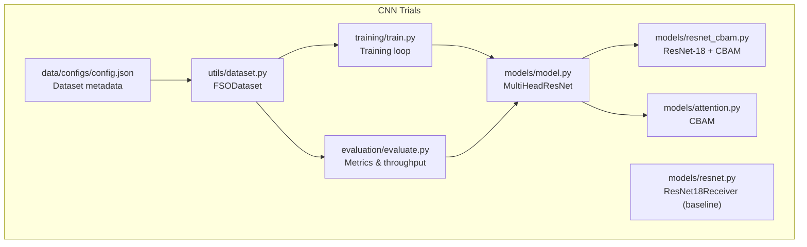
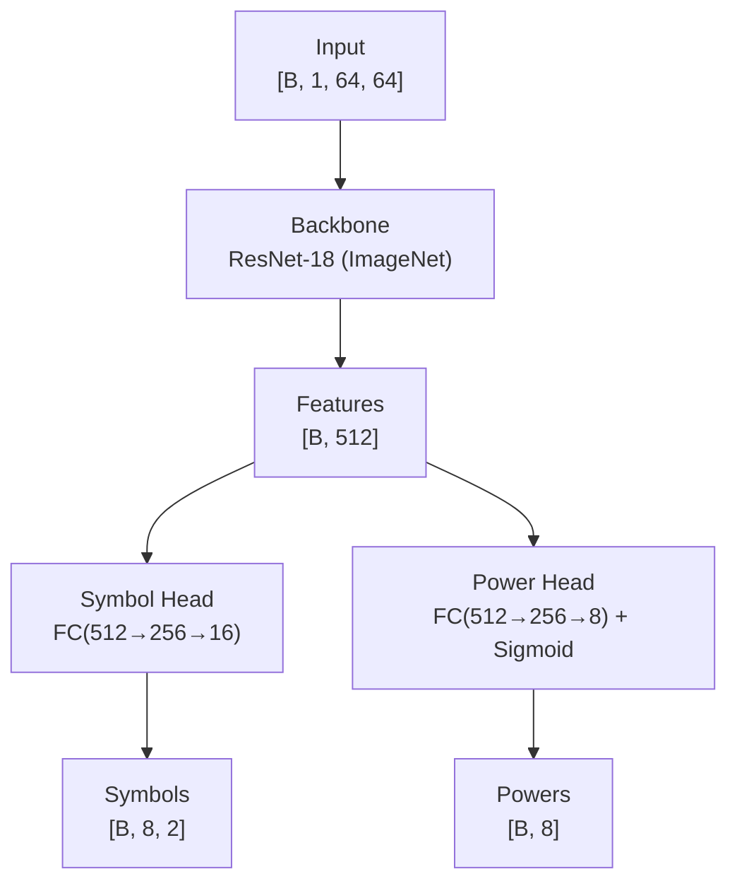
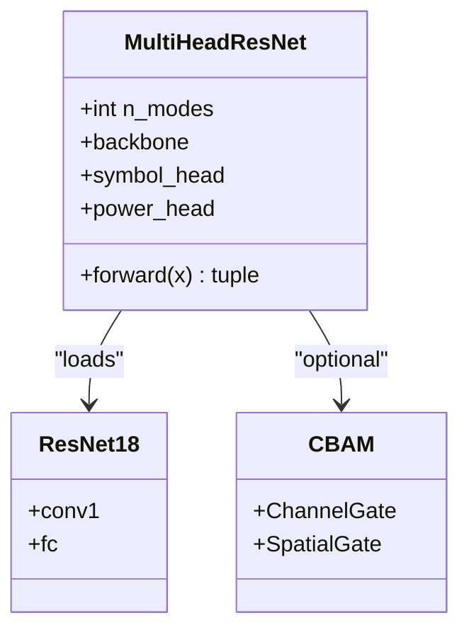
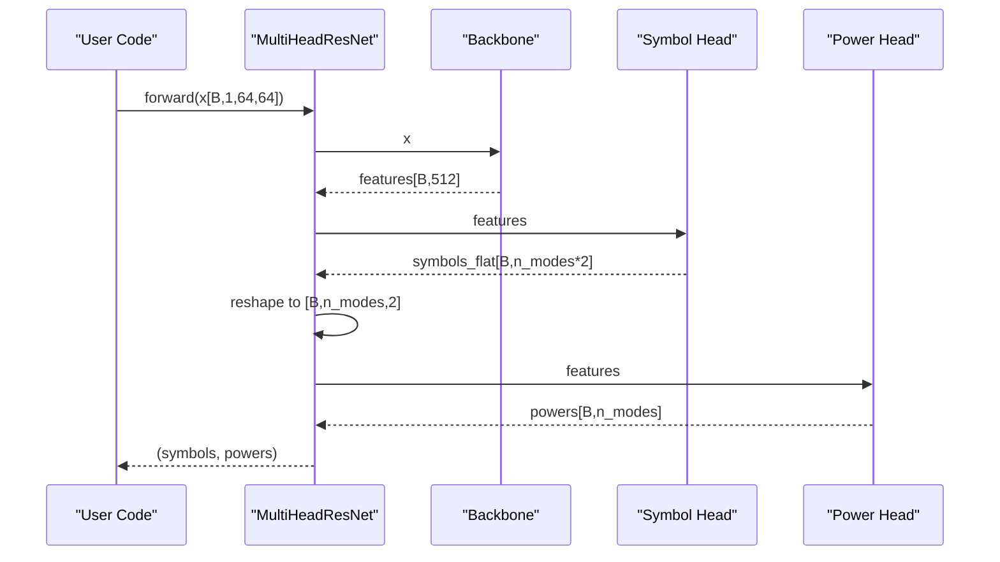
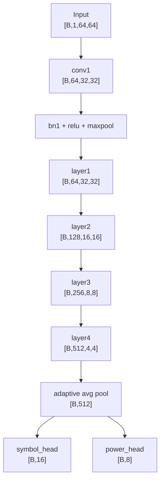
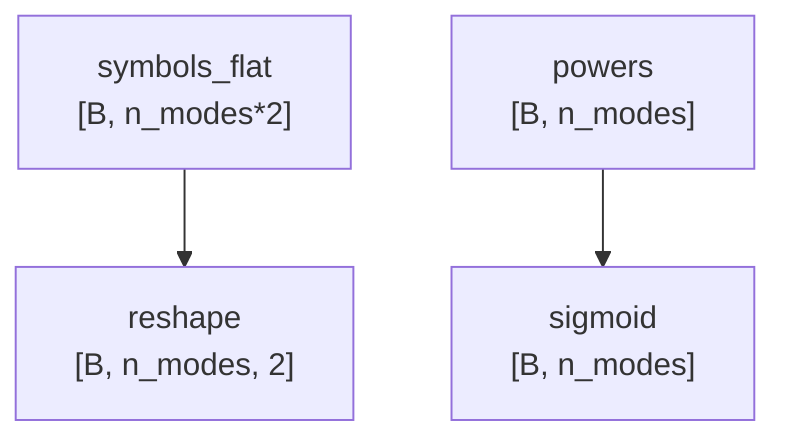
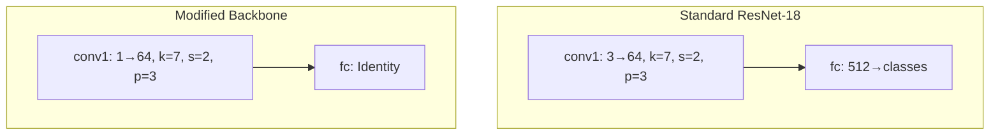
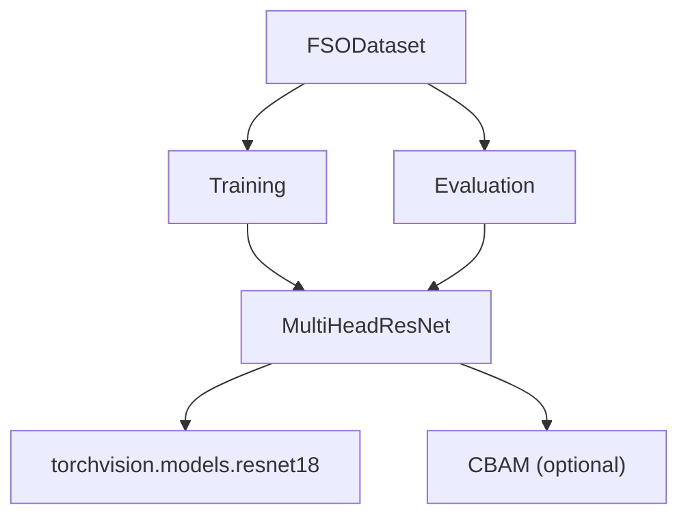
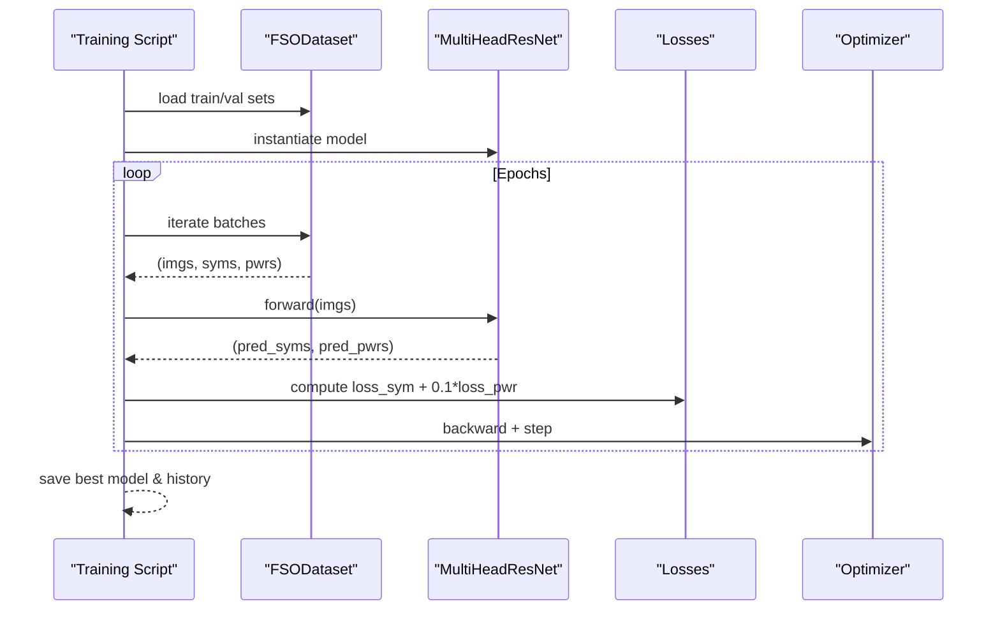

# Multi-Head ResNet Architecture

<cite>
**Referenced Files in This Document**
- [model.py](file://models/CNN Trials/src/models/model.py)
- [resnet.py](file://models/CNN Trials/src/models/resnet.py)
- [resnet_cbam.py](file://models/CNN Trials/src/models/resnet_cbam.py)
- [attention.py](file://models/CNN Trials/src/models/attention.py)
- [train.py](file://models/CNN Trials/src/training/train.py)
- [evaluate.py](file://models/CNN Trials/src/evaluation/evaluate.py)
- [dataset.py](file://models/CNN Trials/src/utils/dataset.py)
- [config.json](file://models/CNN Trials/data/configs/config.json)
- [README.md](file://README.md)
</cite>

## Table of Contents
1. [Introduction](#introduction)
2. [Project Structure](#project-structure)
3. [Core Components](#core-components)
4. [Architecture Overview](#architecture-overview)
5. [Detailed Component Analysis](#detailed-component-analysis)
6. [Dependency Analysis](#dependency-analysis)
7. [Performance Considerations](#performance-considerations)
8. [Troubleshooting Guide](#troubleshooting-guide)
9. [Conclusion](#conclusion)
10. [Appendices](#appendices)

## Introduction
This document explains the multi-head ResNet architecture designed for free-space optical (FSO) orbital angular momentum (OAM) signal recovery. The system takes 64x64 intensity images as input and predicts two outputs:
- Symbol head: continuous real/imaginary (I/Q) values for 8 OAM modes (16 outputs total).
- Power head: per-mode power presence (sigmoid outputs in [0, 1]).

The backbone is a modified ResNet-18 pretrained on ImageNet, adapted for 1-channel intensity inputs and 64x64 pixels. The dual-head design enables joint symbol regression and auxiliary power estimation to improve robustness in atmospheric turbulence.

## Project Structure
The multi-head model resides in the CNN Trials module alongside training, evaluation, and attention utilities.

**Diagram sources**
- [model.py](file://models/CNN Trials/src/models/model.py#L6-L72)
- [resnet.py](file://models/CNN Trials/src/models/resnet.py#L47-L171)
- [resnet_cbam.py](file://models/CNN Trials/src/models/resnet_cbam.py#L51-L112)
- [attention.py](file://models/CNN Trials/src/models/attention.py#L72-L89)
- [train.py](file://models/CNN Trials/src/training/train.py#L16-L106)
- [evaluate.py](file://models/CNN Trials/src/evaluation/evaluate.py#L80-L144)
- [dataset.py](file://models/CNN Trials/src/utils/dataset.py#L6-L44)
- [config.json](file://models/CNN Trials/data/configs/config.json#L105-L119)

**Section sources**
- [README.md](file://README.md#L311-L350)

## Core Components
- MultiHeadResNet: Dual-head network with a ResNet-18 backbone (optionally CBAM-enhanced), custom first convolution for 1-channel inputs, and two heads:
  - Symbol head: maps backbone features to flattened [Re_0, Im_0, Re_1, Im_1, ..., Re_7, Im_7].
  - Power head: maps features to per-mode probabilities in [0, 1].
- ResNet18Receiver: baseline ResNet-18 variant for symbol regression (not multi-head).
- ResNet-18 + CBAM: ResNet-18 with CBAM attention modules.
- Attention modules: Channel and spatial gating for spatial attention.
- Training/Evaluation: Multi-head training with MSE for symbols and BCE for power; evaluation computes SER/BER and throughput.

**Section sources**
- [model.py](file://models/CNN Trials/src/models/model.py#L6-L72)
- [resnet.py](file://models/CNN Trials/src/models/resnet.py#L47-L171)
- [resnet_cbam.py](file://models/CNN Trials/src/models/resnet_cbam.py#L51-L112)
- [attention.py](file://models/CNN Trials/src/models/attention.py#L72-L89)
- [train.py](file://models/CNN Trials/src/training/train.py#L30-L78)
- [evaluate.py](file://models/CNN Trials/src/evaluation/evaluate.py#L80-L144)

## Architecture Overview
The multi-head architecture modifies a standard ImageNet-pretrained ResNet-18:
- First convolution changed to accept 1 input channel while preserving stride and spatial resolution progression.
- Final classifier layer replaced with an identity mapping to expose feature vectors for dual heads.
- Two separate heads branch off the backbone features:
  - Symbol head: fully connected stack producing 16 outputs (8 modes × 2).
  - Power head: fully connected stack producing 8 outputs with sigmoid activation.

**Diagram sources**
- [model.py](file://models/CNN Trials/src/models/model.py#L21-L55)
- [model.py](file://models/CNN Trials/src/models/model.py#L59-L71)

## Detailed Component Analysis

### MultiHeadResNet Class Design
- Backbone selection: Supports 'resnet18' (ImageNet pretrained) and 'resnet18_cbam'.
- First-layer adaptation: Replaces conv1 with a 1-channel variant keeping stride=2 so spatial size reduces from 64x64 to 32x32 after first pooling.
- Identity final layer: Removes fc and replaces with nn.Identity to expose backbone features.
- Symbol head: Linear(512→256)→ReLU→Dropout(0.3)→Linear(256→n_modes×2). Outputs are reshaped to [batch, n_modes, 2].
- Power head: Linear(512→256)→ReLU→Dropout(0.3)→Linear(256→n_modes)→Sigmoid. Outputs are [batch, n_modes].

**Diagram sources**
- [model.py](file://models/CNN Trials/src/models/model.py#L6-L72)
- [resnet_cbam.py](file://models/CNN Trials/src/models/resnet_cbam.py#L51-L112)
- [attention.py](file://models/CNN Trials/src/models/attention.py#L72-L89)

**Section sources**
- [model.py](file://models/CNN Trials/src/models/model.py#L18-L58)

### Forward Pass Implementation
- Input: [B, 1, 64, 64].
- Backbone forward produces features [B, 512].
- Symbol head: Linear(512→n_modes×2) then reshape to [B, n_modes, 2].
- Power head: Linear(512→n_modes) followed by Sigmoid.
- Outputs: symbols [B, n_modes, 2], powers [B, n_modes].

**Diagram sources**
- [model.py](file://models/CNN Trials/src/models/model.py#L59-L71)

**Section sources**
- [model.py](file://models/CNN Trials/src/models/model.py#L59-L71)

### Feature Extraction Pipeline
- Backbone: ResNet-18 with modified conv1 and identity fc.
- Spatial progression: 64→32→16→8→4 with four residual stages.
- Global pooling: AdaptiveAvgPool2d((1,1)) reduces to [B, 512].
- Heads: Separate FC stacks process the same backbone features independently.

**Diagram sources**
- [model.py](file://models/CNN Trials/src/models/model.py#L29-L36)
- [model.py](file://models/CNN Trials/src/models/model.py#L38-L55)

**Section sources**
- [model.py](file://models/CNN Trials/src/models/model.py#L29-L55)

### Output Reshaping Mechanisms
- Symbol head outputs flattened I/Q pairs for all modes. The model reshapes to [B, n_modes, 2] for downstream processing.
- Power head outputs per-mode probabilities in [0, 1] via Sigmoid.

**Diagram sources**
- [model.py](file://models/CNN Trials/src/models/model.py#L63-L69)

**Section sources**
- [model.py](file://models/CNN Trials/src/models/model.py#L63-L69)

### Architectural Modifications from Standard ResNet-18
- Modified first convolution: 1 input channel, kernel_size=7, stride=2, padding=3 to preserve 64x64→32x32 progression.
- Identity final layer: Replaces fc with nn.Identity to expose features for dual heads.
- Head designs: Separate symbol and power heads tailored for OAM symbol regression and auxiliary power estimation.

**Diagram sources**
- [model.py](file://models/CNN Trials/src/models/model.py#L29-L36)

**Section sources**
- [model.py](file://models/CNN Trials/src/models/model.py#L29-L36)

### Design Rationale: 64x64 Input Size and 8-Mode Configuration
- 64x64: Balances spatial resolution with computational cost; sufficient to capture beam morphology and speckle patterns.
- 8 modes: Reflects the selected OAM basis modes in the dataset configuration, with each mode represented by a QPSK symbol pair (Re/Im).
- Data format: Input is 1-channel intensity with shape [64, 64]; dataset wrapper adds channel dimension to [B, 1, 64, 64].

**Section sources**
- [config.json](file://models/CNN Trials/data/configs/config.json#L105-L119)
- [dataset.py](file://models/CNN Trials/src/utils/dataset.py#L18-L22)

### Code Examples: Instantiation, Forward Propagation, and Output Interpretation
- Instantiate model with desired number of modes and backbone choice.
- Forward pass returns symbols and powers.
- Interpret outputs:
  - symbols: [B, n_modes, 2] → convert to complex symbols for demodulation.
  - powers: [B, n_modes] → per-mode power presence/probability.

Example references:
- Model instantiation and forward pass: [model.py](file://models/CNN Trials/src/models/model.py#L73-L81)
- Training loop consuming dual outputs: [train.py](file://models/CNN Trials/src/training/train.py#L71-L77)
- Evaluation converting symbols to complex and computing SER/BER: [evaluate.py](file://models/CNN Trials/src/evaluation/evaluate.py#L104-L137)

**Section sources**
- [model.py](file://models/CNN Trials/src/models/model.py#L73-L81)
- [train.py](file://models/CNN Trials/src/training/train.py#L71-L77)
- [evaluate.py](file://models/CNN Trials/src/evaluation/evaluate.py#L104-L137)

## Dependency Analysis
- MultiHeadResNet depends on:
  - torchvision ResNet-18 (ImageNet pretrained) or a custom CBAM-enabled ResNet-18.
  - Attention modules (CBAM) for optional backbone enhancement.
- Training and evaluation depend on FSODataset for data loading and metrics computation.

**Diagram sources**
- [model.py](file://models/CNN Trials/src/models/model.py#L22-L27)
- [resnet_cbam.py](file://models/CNN Trials/src/models/resnet_cbam.py#L108-L112)
- [attention.py](file://models/CNN Trials/src/models/attention.py#L72-L89)
- [train.py](file://models/CNN Trials/src/training/train.py#L20-L26)
- [evaluate.py](file://models/CNN Trials/src/evaluation/evaluate.py#L84-L86)

**Section sources**
- [model.py](file://models/CNN Trials/src/models/model.py#L22-L27)
- [resnet_cbam.py](file://models/CNN Trials/src/models/resnet_cbam.py#L108-L112)
- [attention.py](file://models/CNN Trials/src/models/attention.py#L72-L89)
- [train.py](file://models/CNN Trials/src/training/train.py#L20-L26)
- [evaluate.py](file://models/CNN Trials/src/evaluation/evaluate.py#L84-L86)

## Performance Considerations
- Backbone choice: Using ImageNet pretrained weights accelerates convergence; CBAM adds minimal overhead with significant gains in strong turbulence.
- Input size and channels: 1-channel 64x64 keeps memory and compute manageable while capturing sufficient spatial structure.
- Head design: Separate symbol and power heads enable multi-task learning with weighted losses during training.
- Training schedule: ReduceLROnPlateau and weighted loss (MSE for symbols, BCE for power) stabilize convergence.

[No sources needed since this section provides general guidance]

## Troubleshooting Guide
- Zero outputs or collapsed behavior: Check that the model is not outputting near-zero values; diagnosis routines flag potential collapse.
- Phase rotation artifacts: If mean phase bias is large and jitter low, consider pilot ambiguity or phase offset issues.
- High noise regimes: If phase jitter is high, the model may be guessing randomly; consider stronger attention or data augmentation.
- Power head saturation: If power outputs are mostly near 0 or 1, verify dataset labels and loss weighting.

**Section sources**
- [evaluate.py](file://models/CNN Trials/src/evaluation/evaluate.py#L193-L221)

## Conclusion
The MultiHeadResNet adapts a standard ResNet-18 for OAM symbol recovery from intensity-only images. Its dual-head design—symbol regression and auxiliary power estimation—enables robust operation in atmospheric turbulence. The 64x64 input size and 8-mode configuration align with the dataset setup, while the identity final layer exposes features suitable for both heads. Training and evaluation pipelines demonstrate end-to-end usage and performance assessment.

[No sources needed since this section summarizes without analyzing specific files]

## Appendices

### Appendix A: Training and Evaluation Workflows
- Training: Loads dataset, instantiates model, runs multi-head training with MSE and BCE losses, saves best model and training history.
- Evaluation: Loads best model, computes SER/BER, breakdown by turbulence strength, throughput analysis, and diagnostic plots.

**Diagram sources**
- [train.py](file://models/CNN Trials/src/training/train.py#L16-L106)

**Section sources**
- [train.py](file://models/CNN Trials/src/training/train.py#L16-L106)
- [evaluate.py](file://models/CNN Trials/src/evaluation/evaluate.py#L80-L144)