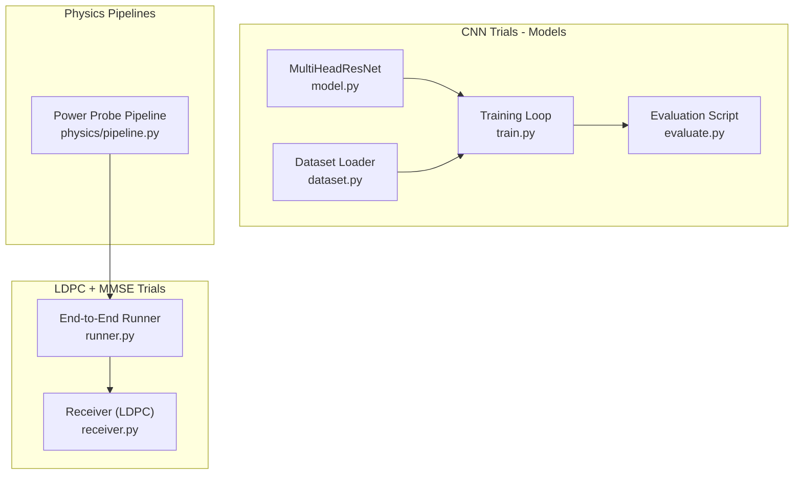
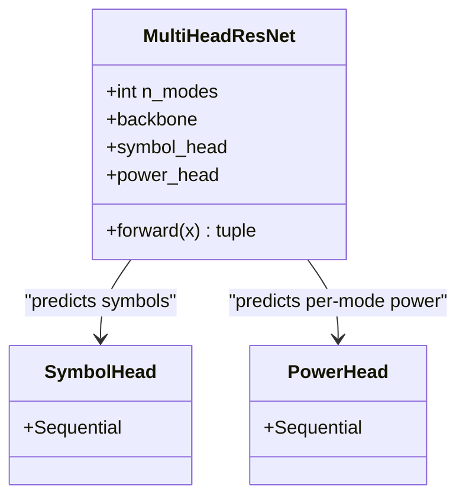
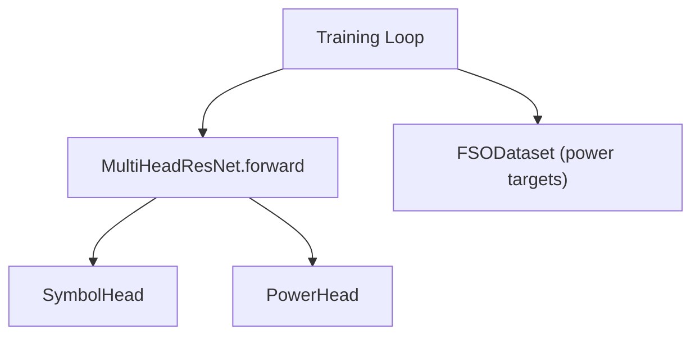

# Power Estimation Head

<cite>
**Referenced Files in This Document**
- [model.py](file://models/CNN Trials/src/models/model.py)
- [train.py](file://models/CNN Trials/src/training/train.py)
- [dataset.py](file://models/CNN Trials/src/utils/dataset.py)
- [evaluate.py](file://models/CNN Trials/src/evaluation/evaluate.py)
- [pipeline.py](file://models/CNN Trials/physics/pipeline.py)
- [runner.py](file://models/LDPC + Pilot + MMSE trials/runner.py)
- [receiver.py](file://models/LDPC + Pilot + MMSE trials/receiver.py)
- [Throughput_Analysis.md](file://models/CNN Trials/outputs/reports/Throughput_Analysis.md)
</cite>

## Table of Contents
1. [Introduction](#introduction)
2. [Project Structure](#project-structure)
3. [Core Components](#core-components)
4. [Architecture Overview](#architecture-overview)
5. [Detailed Component Analysis](#detailed-component-analysis)
6. [Dependency Analysis](#dependency-analysis)
7. [Performance Considerations](#performance-considerations)
8. [Troubleshooting Guide](#troubleshooting-guide)
9. [Conclusion](#conclusion)

## Introduction
This document explains the power estimation head designed as an auxiliary task within a multi-head neural receiver for free-space optics orbital angular momentum (FSO-OAM) communications. The auxiliary head predicts per-mode power presence or energy levels, producing probabilities in [0, 1] for each spatial mode. These estimates improve the main symbol prediction task by providing soft supervision that encourages the model to learn robust mode activity patterns, especially under turbulence and noise. The document also covers how power estimates can guide mode selection and signal processing, and how they integrate with downstream LDPC decoding workflows.

## Project Structure
The power estimation head resides in the multi-head model alongside the primary symbol head. Training integrates auxiliary supervision with the main task, while evaluation focuses on the main symbol recovery metrics. Physics pipelines compute numeric power probes for diagnostics, and end-to-end runners demonstrate LDPC decoding after equalization.

**Diagram sources**
- [model.py](file://models/CNN Trials/src/models/model.py#L1-L81)
- [train.py](file://models/CNN Trials/src/training/train.py#L1-L150)
- [dataset.py](file://models/CNN Trials/src/utils/dataset.py#L1-L44)
- [evaluate.py](file://models/CNN Trials/src/evaluation/evaluate.py#L1-L315)
- [pipeline.py](file://models/CNN Trials/physics/pipeline.py#L288-L298)
- [runner.py](file://models/LDPC + Pilot + MMSE trials/runner.py#L1-L739)
- [receiver.py](file://models/LDPC + Pilot + MMSE trials/receiver.py#L622-L678)

**Section sources**
- [model.py](file://models/CNN Trials/src/models/model.py#L1-L81)
- [train.py](file://models/CNN Trials/src/training/train.py#L1-L150)
- [dataset.py](file://models/CNN Trials/src/utils/dataset.py#L1-L44)
- [evaluate.py](file://models/CNN Trials/src/evaluation/evaluate.py#L1-L315)
- [pipeline.py](file://models/CNN Trials/physics/pipeline.py#L288-L298)
- [runner.py](file://models/LDPC + Pilot + MMSE trials/runner.py#L1-L739)
- [receiver.py](file://models/LDPC + Pilot + MMSE trials/receiver.py#L622-L678)

## Core Components
- Multi-Head ResNet backbone with two heads:
  - Symbol head: regression to predict real and imaginary parts for each mode.
  - Power head: auxiliary task to estimate per-mode power presence (sigmoid output in [0, 1]).
- Training integrates both losses with weighted combination.
- Evaluation focuses on symbol recovery metrics; power estimates are available as an auxiliary output.

Key implementation references:
- Auxiliary task definition and forward pass: [model.py](file://models/CNN Trials/src/models/model.py#L38-L71)
- Training loop combining symbol and power losses: [train.py](file://models/CNN Trials/src/training/train.py#L67-L77)
- Dataset target creation for power (constant 1s for active modes in current setup): [dataset.py](file://models/CNN Trials/src/utils/dataset.py#L34-L41)

**Section sources**
- [model.py](file://models/CNN Trials/src/models/model.py#L38-L71)
- [train.py](file://models/CNN Trials/src/training/train.py#L67-L77)
- [dataset.py](file://models/CNN Trials/src/utils/dataset.py#L34-L41)

## Architecture Overview
The auxiliary power head augments the main symbol head by sharing early-stage backbone features. The power head comprises:
- Linear projection from backbone features to 256 units
- ReLU activation
- Dropout regularization
- Linear projection to per-mode outputs
- Sigmoid activation producing [0, 1] probabilities

**Diagram sources**
- [model.py](file://models/CNN Trials/src/models/model.py#L6-L71)

**Section sources**
- [model.py](file://models/CNN Trials/src/models/model.py#L6-L71)

## Detailed Component Analysis

### Power Estimation Head Specification
- Input: Backbone features extracted from the 64x64 intensity image.
- Hidden layer: 256 units with ReLU activation.
- Regularization: Dropout applied after the hidden layer.
- Output: Linear layer projecting to n_modes, followed by Sigmoid to produce [0, 1] per mode.
- Purpose: Soft supervision of mode activity; encourages the model to distinguish active from inactive modes.

Implementation references:
- Head construction: [model.py](file://models/CNN Trials/src/models/model.py#L47-L55)
- Forward pass: [model.py](file://models/CNN Trials/src/models/model.py#L59-L71)

**Section sources**
- [model.py](file://models/CNN Trials/src/models/model.py#L47-L55)
- [model.py](file://models/CNN Trials/src/models/model.py#L59-L71)

### Relationship Between Power Estimation and Main Symbol Prediction
- Shared representation: Both heads consume the same backbone features, enabling shared feature learning.
- Auxiliary supervision: The power head’s loss is combined with the symbol head’s loss during training, with a configurable weight.
- Training integration: The training script computes both symbol and power losses and sums them with a weighting factor.

References:
- Loss computation and weighted sum: [train.py](file://models/CNN Trials/src/training/train.py#L73-L77)
- Symbol head loss: [train.py](file://models/CNN Trials/src/training/train.py#L31-L32)
- Power head loss: [train.py](file://models/CNN Trials/src/training/train.py#L32)

**Section sources**
- [train.py](file://models/CNN Trials/src/training/train.py#L31-L32)
- [train.py](file://models/CNN Trials/src/training/train.py#L73-L77)

### Interpretation Guidelines for Power Estimates
- Range: Outputs are probabilities in [0, 1] per mode.
- Typical usage:
  - Mode gating: Treat outputs below a threshold (e.g., 0.3–0.5) as inactive for downstream processing.
  - Confidence weighting: Use outputs as soft weights for equalization or demodulation stages.
  - Robustness: In noisy or turbulent regimes, low power estimates can indicate unreliable modes.
- Practical note: Current dataset targets for power are set to 1 for active modes; in practice, power estimates reflect learned mode activity rather than true physical power levels.

References:
- Output interpretation and usage guidance: [model.py](file://models/CNN Trials/src/models/model.py#L15-L16)
- Dataset power target behavior: [dataset.py](file://models/CNN Trials/src/utils/dataset.py#L34-L41)

**Section sources**
- [model.py](file://models/CNN Trials/src/models/model.py#L15-L16)
- [dataset.py](file://models/CNN Trials/src/utils/dataset.py#L34-L41)

### Power-Aware Signal Processing Applications
- Mode selection:
  - Select only modes with power estimates above a threshold for decoding to reduce error propagation.
- Equalization:
  - Weight equalizer outputs by power estimates to favor reliable modes.
- Demodulation:
  - Combine soft decisions from reliable modes and possibly discard weak ones.
- Diagnostics:
  - Monitor mode-wise power estimates to detect outage or severe fading.

[No sources needed since this section provides general guidance]

### Integration with LDPC Decoding Workflows
- Neural receiver perspective:
  - The model outputs coded symbols (including pilots) after equalization; these are LDPC-decoded to recover information bits.
  - Power estimates can inform which modes to trust during downstream processing.
- End-to-end runner:
  - The runner demonstrates LDPC decoding after equalization and calculates BER and throughput.
  - Power probe diagnostics in the physics pipeline provide numeric power estimates for analysis.

References:
- Neural receiver acting as a non-linear equalizer prior to LDPC: [evaluate.py](file://models/CNN Trials/src/evaluation/evaluate.py#L12-L25)
- LDPC decoding workflow: [receiver.py](file://models/LDPC + Pilot + MMSE trials/receiver.py#L628-L661)
- Power probe numeric diagnostics: [pipeline.py](file://models/CNN Trials/physics/pipeline.py#L288-L298)
- End-to-end throughput analysis: [Throughput_Analysis.md](file://models/CNN Trials/outputs/reports/Throughput_Analysis.md#L1-L55)

**Section sources**
- [evaluate.py](file://models/CNN Trials/src/evaluation/evaluate.py#L12-L25)
- [receiver.py](file://models/LDPC + Pilot + MMSE trials/receiver.py#L628-L661)
- [pipeline.py](file://models/CNN Trials/physics/pipeline.py#L288-L298)
- [Throughput_Analysis.md](file://models/CNN Trials/outputs/reports/Throughput_Analysis.md#L1-L55)

### Training and Loss Composition
- Losses:
  - Symbol head: Regression loss (e.g., MSELoss).
  - Power head: Binary cross-entropy loss (BCELoss) against dataset targets.
- Weighting: The total loss is a weighted sum of the two, with the power term scaled by a small coefficient during training.

References:
- Loss definitions: [train.py](file://models/CNN Trials/src/training/train.py#L31-L32)
- Weighted loss combination: [train.py](file://models/CNN Trials/src/training/train.py#L76-L77)

**Section sources**
- [train.py](file://models/CNN Trials/src/training/train.py#L31-L32)
- [train.py](file://models/CNN Trials/src/training/train.py#L76-L77)

### Power Probe Diagnostics and Numeric Power
- The physics pipeline computes a numeric power probe by propagating a unit-symbol-sum field through the channel and measuring received power after aperture masking.
- This provides a diagnostic reference for expected received power and helps validate system scaling.

References:
- Numeric power probe computation and logging: [pipeline.py](file://models/CNN Trials/physics/pipeline.py#L288-L298)
- End-to-end runner enabling/disabling power probe: [runner.py](file://models/LDPC + Pilot + MMSE trials/runner.py#L122)

**Section sources**
- [pipeline.py](file://models/CNN Trials/physics/pipeline.py#L288-L298)
- [runner.py](file://models/LDPC + Pilot + MMSE trials/runner.py#L122)

## Dependency Analysis
The power estimation head depends on:
- Backbone feature extraction (shared with the symbol head)
- Dataset targets for power (active modes set to 1 in current setup)
- Training script for loss composition and optimization

**Diagram sources**
- [model.py](file://models/CNN Trials/src/models/model.py#L59-L71)
- [train.py](file://models/CNN Trials/src/training/train.py#L67-L77)
- [dataset.py](file://models/CNN Trials/src/utils/dataset.py#L34-L41)

**Section sources**
- [model.py](file://models/CNN Trials/src/models/model.py#L59-L71)
- [train.py](file://models/CNN Trials/src/training/train.py#L67-L77)
- [dataset.py](file://models/CNN Trials/src/utils/dataset.py#L34-L41)

## Performance Considerations
- Auxiliary supervision improves generalization by encouraging the model to learn meaningful mode activity patterns.
- The power head’s small hidden dimension (256) and dropout help prevent overfitting while keeping computational overhead modest.
- Proper calibration of the auxiliary loss weight ensures the model prioritizes the main symbol task while benefiting from soft mode activity cues.

[No sources needed since this section provides general guidance]

## Troubleshooting Guide
- Low power estimates across all modes:
  - Indicates difficulty distinguishing active modes; consider adjusting training loss weights or data augmentation.
- Zero or near-zero outputs:
  - Check sigmoid application and ensure targets are appropriate for the scenario.
- Misalignment between power targets and actual activity:
  - Verify dataset generation and target creation logic.

[No sources needed since this section provides general guidance]

## Conclusion
The power estimation head augments the main symbol prediction task by providing per-mode power presence estimates in [0, 1]. Its sequential architecture with a 256-unit hidden layer, ReLU activation, dropout regularization, and sigmoid output aligns with auxiliary supervision goals. While the current dataset sets power targets to 1 for active modes, the learned power estimates serve as valuable soft indicators for mode selection and robust signal processing. Integrated with LDPC decoding workflows, power-aware processing can improve reliability and throughput in real-world FSO-OAM links.