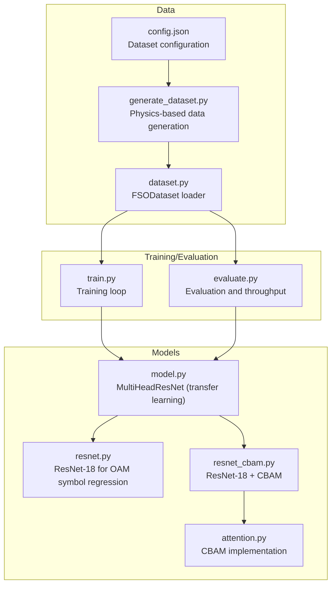
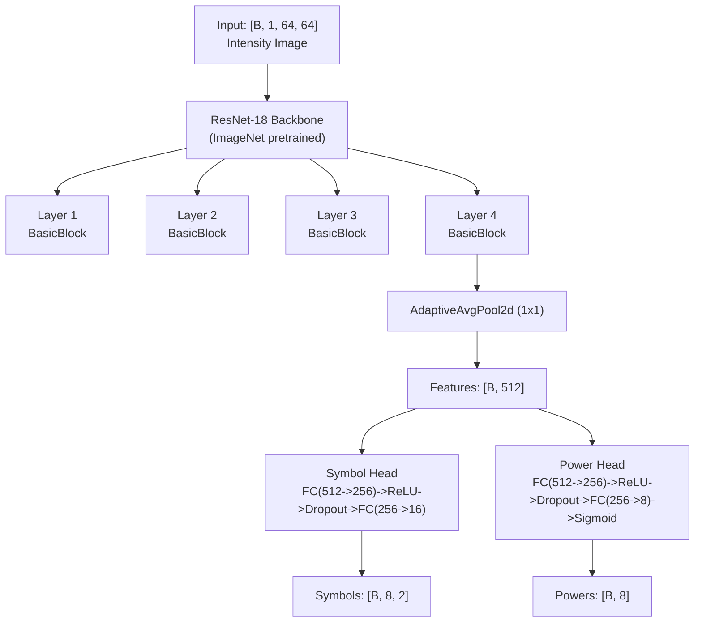
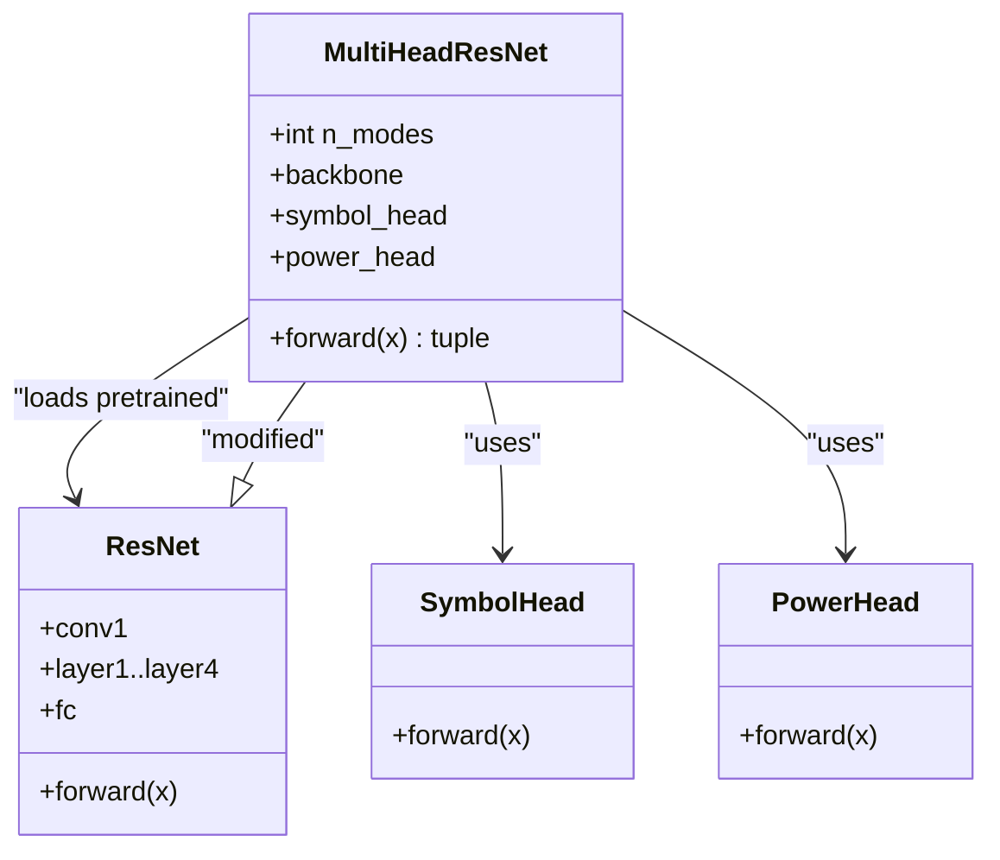
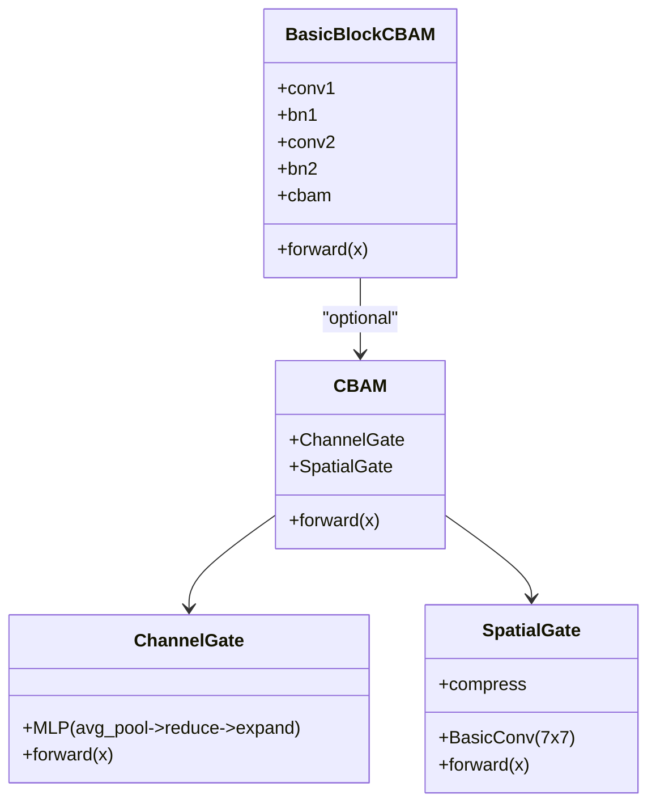
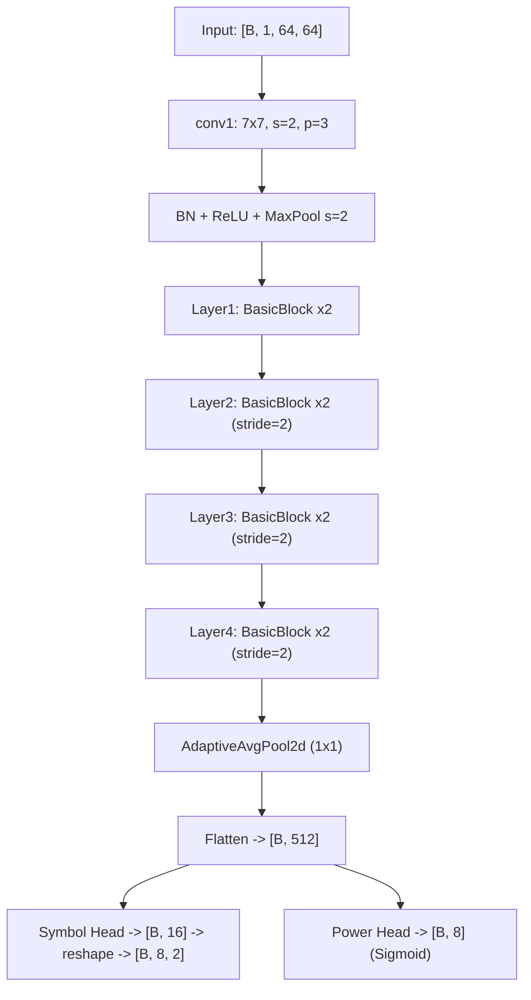
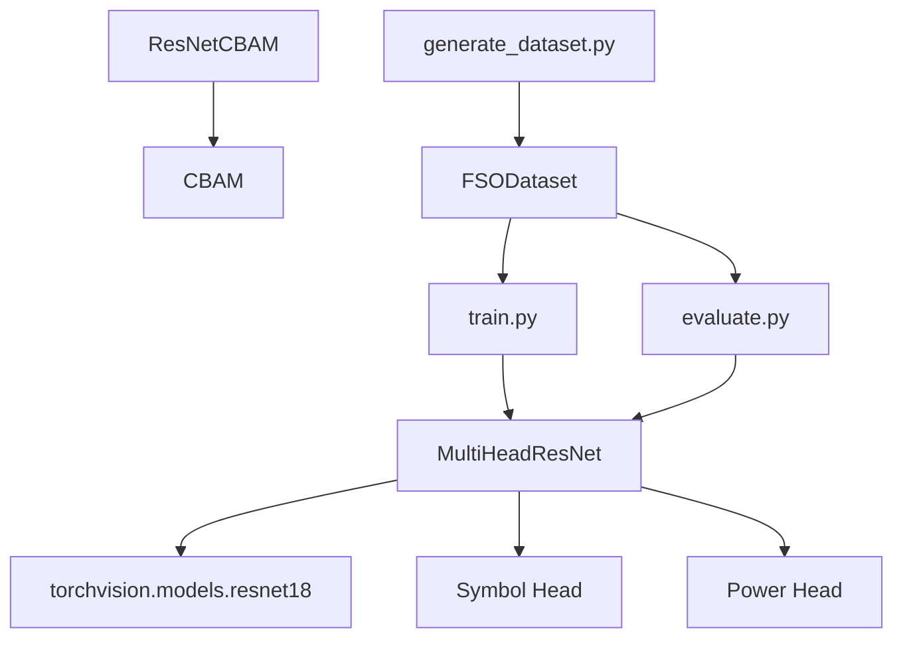

# ResNet Backbone Modifications

<cite>
**Referenced Files in This Document**
- [README.md](file://README.md)
- [resnet.py](file://models/CNN Trials/src/models/resnet.py)
- [model.py](file://models/CNN Trials/src/models/model.py)
- [resnet_cbam.py](file://models/CNN Trials/src/models/resnet_cbam.py)
- [attention.py](file://models/CNN Trials/src/models/attention.py)
- [train.py](file://models/CNN Trials/src/training/train.py)
- [evaluate.py](file://models/CNN Trials/src/evaluation/evaluate.py)
- [dataset.py](file://models/CNN Trials/src/utils/dataset.py)
- [generate_dataset.py](file://models/CNN Trials/src/data_gen/generate_dataset.py)
- [config.json](file://models/CNN Trials/data/configs/config.json)
</cite>

## Table of Contents
1. [Introduction](#introduction)
2. [Project Structure](#project-structure)
3. [Core Components](#core-components)
4. [Architecture Overview](#architecture-overview)
5. [Detailed Component Analysis](#detailed-component-analysis)
6. [Dependency Analysis](#dependency-analysis)
7. [Performance Considerations](#performance-considerations)
8. [Troubleshooting Guide](#troubleshooting-guide)
9. [Conclusion](#conclusion)
10. [Appendices](#appendices)

## Introduction
This document explains the ResNet backbone adaptations for Free-Space Optics Orbital Angular Momentum (FSO-OAM) beam recovery. The modifications enable:
- A 1-channel intensity input (no phase) at 64x64 resolution
- Preservation of spatial resolution from 64x64 to 32x32 feature maps (stride=2 in the first conv)
- Identity final layer replacement to extract features for multi-head regression heads
- Transfer learning from ImageNet-pretrained weights with subsequent fine-tuning on turbulence data

The document also covers the feature extraction pipeline, layer-wise transformations, computational efficiency, comparative analysis with standard ResNet, performance benchmarks, and practical guidance for initializing, modifying, and integrating the backbone with custom heads.

## Project Structure
The ResNet adaptation lives in the CNN Trials module and integrates with training, evaluation, and dataset utilities.



**Diagram sources**
- [model.py](file://models/CNN Trials/src/models/model.py#L1-L81)
- [resnet.py](file://models/CNN Trials/src/models/resnet.py#L1-L218)
- [resnet_cbam.py](file://models/CNN Trials/src/models/resnet_cbam.py#L1-L112)
- [attention.py](file://models/CNN Trials/src/models/attention.py#L1-L89)
- [train.py](file://models/CNN Trials/src/training/train.py#L1-L150)
- [evaluate.py](file://models/CNN Trials/src/evaluation/evaluate.py#L1-L315)
- [dataset.py](file://models/CNN Trials/src/utils/dataset.py#L1-L44)
- [generate_dataset.py](file://models/CNN Trials/src/data_gen/generate_dataset.py#L1-L175)
- [config.json](file://models/CNN Trials/data/configs/config.json#L1-L136)

**Section sources**
- [README.md](file://README.md#L1-L390)
- [model.py](file://models/CNN Trials/src/models/model.py#L1-L81)
- [resnet.py](file://models/CNN Trials/src/models/resnet.py#L1-L218)
- [resnet_cbam.py](file://models/CNN Trials/src/models/resnet_cbam.py#L1-L112)
- [attention.py](file://models/CNN Trials/src/models/attention.py#L1-L89)
- [train.py](file://models/CNN Trials/src/training/train.py#L1-L150)
- [evaluate.py](file://models/CNN Trials/src/evaluation/evaluate.py#L1-L315)
- [dataset.py](file://models/CNN Trials/src/utils/dataset.py#L1-L44)
- [generate_dataset.py](file://models/CNN Trials/src/data_gen/generate_dataset.py#L1-L175)
- [config.json](file://models/CNN Trials/data/configs/config.json#L1-L136)

## Core Components
- MultiHeadResNet: A ResNet-18 backbone adapted for 1-channel intensity inputs, with an identity final layer and two heads:
  - Symbol head: predicts flattened real/imaginary pairs for 8 modes (16 outputs)
  - Power head: auxiliary task predicting mode presence/probability
- CBAM-enabled ResNet-18: Adds channel and spatial attention to improve robustness in strong turbulence
- Transfer learning pipeline: loads ImageNet-pretrained weights, modifies the first conv for 1-channel, replaces the final classifier with identity, and trains on FSO-OAM data

Key architectural choices:
- First conv keeps stride=2 to preserve 64x64 to 32x32 feature map size
- Final fc replaced with identity to expose features for multi-head heads
- Dropout and ReLU in heads for regularization and non-linearity
- Separate symbol and power heads enable joint optimization with weighted losses

**Section sources**
- [model.py](file://models/CNN Trials/src/models/model.py#L1-L81)
- [resnet_cbam.py](file://models/CNN Trials/src/models/resnet_cbam.py#L1-L112)
- [attention.py](file://models/CNN Trials/src/models/attention.py#L1-L89)
- [train.py](file://models/CNN Trials/src/training/train.py#L1-L150)
- [evaluate.py](file://models/CNN Trials/src/evaluation/evaluate.py#L1-L315)

## Architecture Overview
The backbone adaptation follows a transfer learning approach:
- Load ImageNet-pretrained ResNet-18
- Replace first conv to accept 1-channel intensity images
- Replace final fc with identity to output features
- Attach two heads: symbol regression and power auxiliary task



**Diagram sources**
- [model.py](file://models/CNN Trials/src/models/model.py#L18-L71)
- [resnet.py](file://models/CNN Trials/src/models/resnet.py#L47-L148)

## Detailed Component Analysis

### MultiHeadResNet Backbone Adaptation
- Backbone selection: ImageNet-pretrained ResNet-18 or CBAM-enabled variant
- First conv modification: 1-channel input with kernel=7, stride=2, padding=3 to preserve 64x64 to 32x32
- Final layer replacement: fc -> identity to expose features
- Heads:
  - Symbol head: FC(512->256->16) with ReLU and dropout
  - Power head: FC(512->256->8) with Sigmoid



**Diagram sources**
- [model.py](file://models/CNN Trials/src/models/model.py#L18-L71)

**Section sources**
- [model.py](file://models/CNN Trials/src/models/model.py#L1-L81)

### CBAM-Enhanced ResNet-18
- Adds CBAM attention gates after convolutions in residual blocks
- ChannelGate: global average and max pooling across spatial dims, MLP gating
- SpatialGate: channel-wise concatenation of channel-wise max/avg, 7x7 conv, sigmoid mask
- Improves robustness in strong turbulence by focusing on beam hotspots



**Diagram sources**
- [attention.py](file://models/CNN Trials/src/models/attention.py#L25-L88)
- [resnet_cbam.py](file://models/CNN Trials/src/models/resnet_cbam.py#L11-L49)

**Section sources**
- [resnet_cbam.py](file://models/CNN Trials/src/models/resnet_cbam.py#L1-L112)
- [attention.py](file://models/CNN Trials/src/models/attention.py#L1-L89)

### Feature Extraction Pipeline and Layer-Wise Transformations
- Input: [B, 1, 64, 64] intensity image
- Initial conv: kernel=7, stride=2, padding=3, BN, ReLU, MaxPool (stride=2) -> [B, 64, 32, 32]
- Residual layers: four groups of basic blocks with increasing channels (64->128->256->512)
- AdaptiveAvgPool2d -> [B, 512]
- Heads process features independently for symbol and power tasks



**Diagram sources**
- [resnet.py](file://models/CNN Trials/src/models/resnet.py#L116-L148)
- [model.py](file://models/CNN Trials/src/models/model.py#L59-L71)

**Section sources**
- [resnet.py](file://models/CNN Trials/src/models/resnet.py#L1-L218)
- [model.py](file://models/CNN Trials/src/models/model.py#L1-L81)

### Transfer Learning and Fine-Tuning Procedure
- Load ImageNet-pretrained ResNet-18
- Replace first conv for 1-channel input
- Replace fc with identity to extract features
- Train with combined loss: MSE on symbols + weighted BCE on power
- Use ReduceLROnPlateau scheduler and Adam optimizer

```mermaid
sequenceDiagram
participant U as "User"
participant T as "train.py"
participant M as "MultiHeadResNet"
participant DS as "FSODataset"
participant OPT as "Optimizer"
U->>T : "python train.py --backbone resnet18"
T->>DS : "Load train/val datasets"
T->>M : "Instantiate MultiHeadResNet"
T->>OPT : "Adam(lr)"
loop Epochs
T->>M : "forward(images)"
M-->>T : "pred_syms, pred_pwrs"
T->>T : "loss_sym + 0.1*loss_pwr"
T->>OPT : "backward()"
OPT-->>T : "step()"
end
T-->>U : "Save best model and history"
```

**Diagram sources**
- [train.py](file://models/CNN Trials/src/training/train.py#L16-L124)
- [model.py](file://models/CNN Trials/src/models/model.py#L59-L71)
- [dataset.py](file://models/CNN Trials/src/utils/dataset.py#L6-L43)

**Section sources**
- [train.py](file://models/CNN Trials/src/training/train.py#L1-L150)
- [model.py](file://models/CNN Trials/src/models/model.py#L1-L81)
- [dataset.py](file://models/CNN Trials/src/utils/dataset.py#L1-L44)

### Comparative Analysis with Standard ResNet
- Input channels: 3 (RGB) vs 1 (intensity)
- First conv stride: 2 (preserved) vs 2 (preserved)
- Final layer: fc (classification) vs identity (feature extractor)
- Heads: none vs multi-task symbol and power heads
- Data: ImageNet vs FSO-OAM turbulence data

These changes tailor the backbone for 1-channel intensity inputs and multi-output regression tasks.

**Section sources**
- [model.py](file://models/CNN Trials/src/models/model.py#L21-L36)
- [resnet.py](file://models/CNN Trials/src/models/resnet.py#L63-L82)

### Performance Benchmarks and Efficiency
- Parameter counts and throughput comparisons are documented in the project README
- Training time scales with dataset size and epochs
- Inference time is reported as fast constant-time passes after training

Practical tips:
- Use GPU acceleration for training and evaluation
- Adjust batch size and learning rate according to memory
- Monitor validation loss and reduce LR on plateau

**Section sources**
- [README.md](file://README.md#L208-L226)
- [train.py](file://models/CNN Trials/src/training/train.py#L16-L124)
- [evaluate.py](file://models/CNN Trials/src/evaluation/evaluate.py#L80-L137)

### Code Examples: Initialization, Modification, and Integration
- Creating the adapted model from configuration:
  - See [create_model](file://models/CNN Trials/src/models/resnet.py#L173-L188)
- Loading ImageNet-pretrained backbone and modifying it:
  - See [MultiHeadResNet.__init__](file://models/CNN Trials/src/models/model.py#L21-L36)
- Integrating with custom heads:
  - See [MultiHeadResNet.forward](file://models/CNN Trials/src/models/model.py#L59-L71)
- Training loop and loss composition:
  - See [train.py](file://models/CNN Trials/src/training/train.py#L30-L78)
- Evaluation and throughput calculations:
  - See [evaluate.py](file://models/CNN Trials/src/evaluation/evaluate.py#L80-L137)

**Section sources**
- [resnet.py](file://models/CNN Trials/src/models/resnet.py#L173-L188)
- [model.py](file://models/CNN Trials/src/models/model.py#L21-L71)
- [train.py](file://models/CNN Trials/src/training/train.py#L30-L78)
- [evaluate.py](file://models/CNN Trials/src/evaluation/evaluate.py#L80-L137)

## Dependency Analysis
- MultiHeadResNet depends on torchvision ResNet-18 for transfer learning
- CBAM-enabled variant depends on attention modules
- Training and evaluation depend on dataset loaders and model definition
- Data generation depends on physics pipeline and writes HDF5 datasets



**Diagram sources**
- [model.py](file://models/CNN Trials/src/models/model.py#L21-L36)
- [resnet_cbam.py](file://models/CNN Trials/src/models/resnet_cbam.py#L108-L112)
- [attention.py](file://models/CNN Trials/src/models/attention.py#L72-L88)
- [train.py](file://models/CNN Trials/src/training/train.py#L12-L28)
- [evaluate.py](file://models/CNN Trials/src/evaluation/evaluate.py#L8-L11)
- [dataset.py](file://models/CNN Trials/src/utils/dataset.py#L6-L22)
- [generate_dataset.py](file://models/CNN Trials/src/data_gen/generate_dataset.py#L17-L21)

**Section sources**
- [model.py](file://models/CNN Trials/src/models/model.py#L1-L81)
- [resnet_cbam.py](file://models/CNN Trials/src/models/resnet_cbam.py#L1-L112)
- [attention.py](file://models/CNN Trials/src/models/attention.py#L1-L89)
- [train.py](file://models/CNN Trials/src/training/train.py#L1-L150)
- [evaluate.py](file://models/CNN Trials/src/evaluation/evaluate.py#L1-L315)
- [dataset.py](file://models/CNN Trials/src/utils/dataset.py#L1-L44)
- [generate_dataset.py](file://models/CNN Trials/src/data_gen/generate_dataset.py#L1-L175)

## Performance Considerations
- Computational efficiency: Constant-time forward pass after training; matrix inversion avoided
- Memory footprint: 1-channel inputs reduce memory compared to RGB
- Regularization: Dropout and auxiliary power head improve generalization
- Data quality: Physics-based dataset generation ensures realistic turbulence conditions

[No sources needed since this section provides general guidance]

## Troubleshooting Guide
Common issues and remedies:
- Output collapse to zeros: Check model weights and ensure training proceeds; diagnosis prints warnings for zero outputs
- Phase rotation artifacts: Indicates pilot ambiguity or incorrect phase handling
- High phase jitter: Suggests high noise or model instability
- Training not improving: Verify learning rate scheduling and loss weighting

Validation and diagnostics:
- SER and BER computed on test set
- Throughput estimation accounts for LDPC and pilot overhead
- Plots saved for BER vs Cn2 and throughput curves

**Section sources**
- [evaluate.py](file://models/CNN Trials/src/evaluation/evaluate.py#L117-L221)
- [train.py](file://models/CNN Trials/src/training/train.py#L30-L106)

## Conclusion
The ResNet backbone adaptations for FSO-OAM integrate transfer learning with a tailored first convolution and identity final layer to support 1-channel intensity inputs and multi-head regression. The CBAM enhancement further improves robustness in strong turbulence. The modular design enables straightforward integration with custom heads and efficient training/evaluation pipelines.

[No sources needed since this section summarizes without analyzing specific files]

## Appendices

### Appendix A: Data Generation and Configuration
- Dataset generation uses a physics-based simulator to produce intensity images and symbol targets
- Configuration controls grid sizes, turbulence ranges, and augmentation

**Section sources**
- [generate_dataset.py](file://models/CNN Trials/src/data_gen/generate_dataset.py#L57-L163)
- [config.json](file://models/CNN Trials/data/configs/config.json#L1-L136)