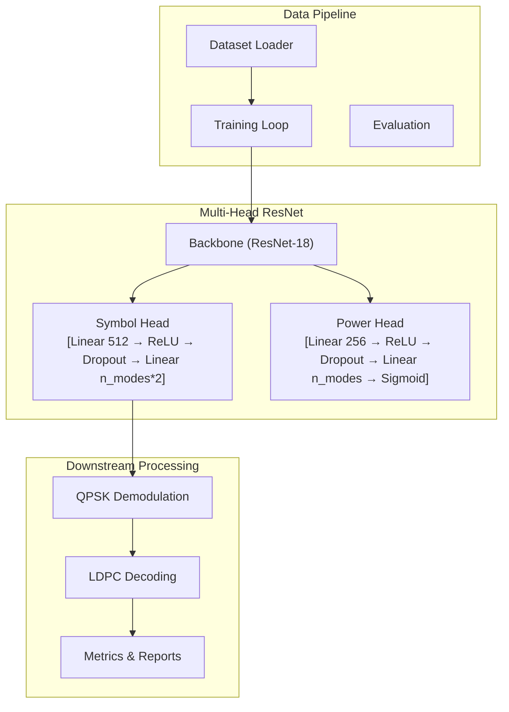
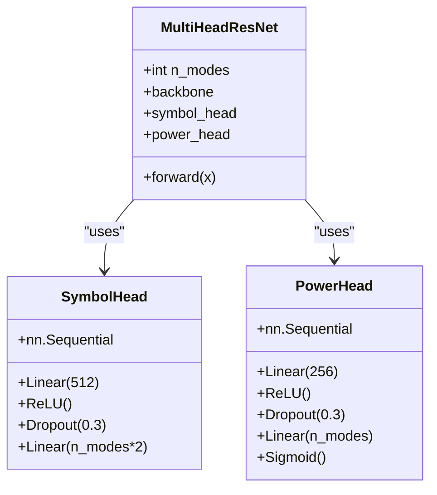
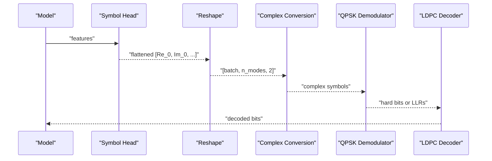
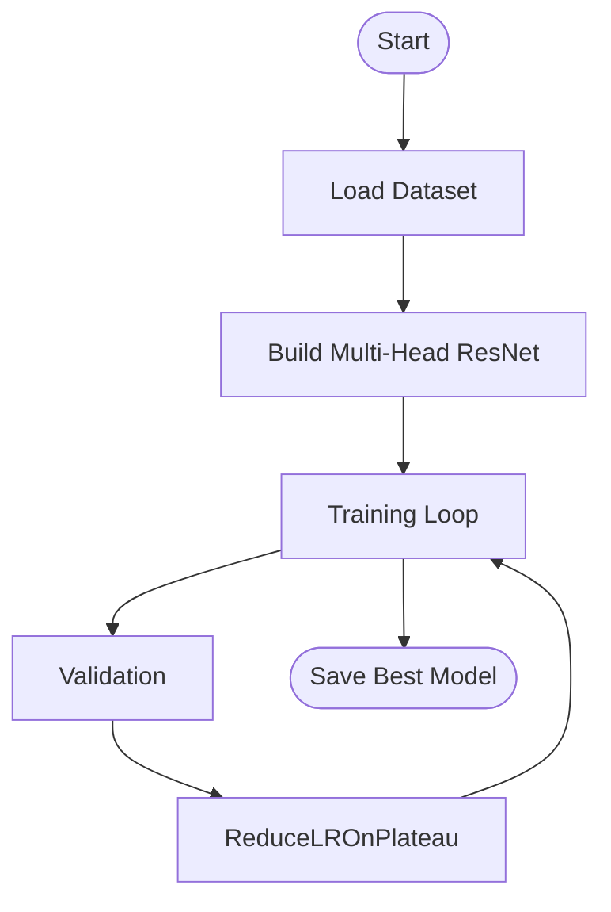
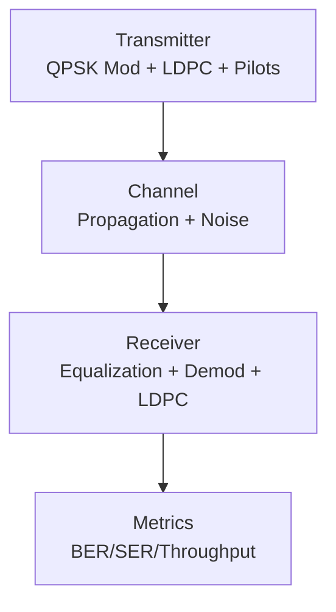
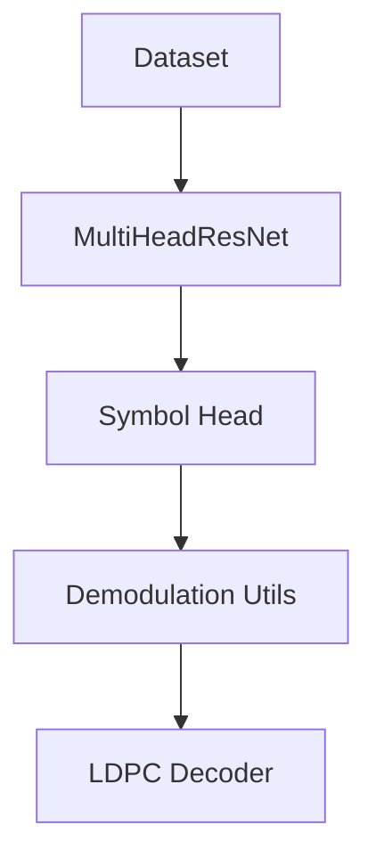

# Symbol Prediction Head

<cite>
**Referenced Files in This Document**
- [model.py](file://models/CNN Trials/src/models/model.py)
- [resnet.py](file://models/CNN Trials/src/models/resnet.py)
- [evaluate.py](file://models/CNN Trials/src/evaluation/evaluate.py)
- [utils.py](file://models/CNN Trials/src/utils/utils.py)
- [train.py](file://models/CNN Trials/src/training/train.py)
- [dataset.py](file://models/CNN Trials/src/utils/dataset.py)
- [encoding.py](file://models/CNN Trials/physics/encoding.py)
- [pipeline.py](file://models/LDPC + Pilot + MMSE trials/pipeline.py)
</cite>

## Table of Contents
1. [Introduction](#introduction)
2. [Project Structure](#project-structure)
3. [Core Components](#core-components)
4. [Architecture Overview](#architecture-overview)
5. [Detailed Component Analysis](#detailed-component-analysis)
6. [Dependency Analysis](#dependency-analysis)
7. [Performance Considerations](#performance-considerations)
8. [Troubleshooting Guide](#troubleshooting-guide)
9. [Conclusion](#conclusion)
10. [Appendices](#appendices)

## Introduction
This document provides comprehensive documentation for the symbol prediction head component responsible for regressing QPSK symbol real and imaginary components for each spatial mode. The head consists of a 512-unit dense layer with ReLU activation, dropout regularization, and a final linear layer producing flattened outputs of the form [Re₀, Im₀, Re₁, Im₁, ...]. These outputs are reshaped into tensors of shape [batch, n_modes, 2] to align with downstream QPSK demodulation and LDPC decoding workflows. The document explains the regression architecture, activation functions, regularization techniques, and practical examples of symbol reconstruction and integration with end-to-end FSO-OAM systems.

## Project Structure
The symbol prediction head resides within a multi-head ResNet architecture used for FSO-OAM signal recovery. The head is part of a broader training and evaluation pipeline that includes data loading, model training, and performance evaluation.

**Diagram sources**
- [model.py](file://models/CNN Trials/src/models/model.py#L6-L71)
- [train.py](file://models/CNN Trials/src/training/train.py#L16-L106)
- [evaluate.py](file://models/CNN Trials/src/evaluation/evaluate.py#L80-L144)

**Section sources**
- [model.py](file://models/CNN Trials/src/models/model.py#L6-L71)
- [train.py](file://models/CNN Trials/src/training/train.py#L16-L106)
- [evaluate.py](file://models/CNN Trials/src/evaluation/evaluate.py#L80-L144)

## Core Components
- Symbol Head (Regression): Predicts real and imaginary parts for each spatial mode.
  - Input: Backbone features (flattened representation).
  - Layers:
    - Dense: 512 units with ReLU activation.
    - Dropout: 0.3 regularization.
    - Final Linear: n_modes × 2 outputs (flattened).
  - Output: Flattened vector [Re₀, Im₀, Re₁, Im₁, ...].
  - Reshaping: View to [batch, n_modes, 2].

- Power Head (Auxiliary): Predicts mode power presence (sigmoid output in [0, 1]).

- Downstream Processing:
  - Reshape to [batch, n_modes, 2].
  - Convert to complex symbols for QPSK demodulation.
  - Optional LLR computation for soft LDPC decoding.

**Section sources**
- [model.py](file://models/CNN Trials/src/models/model.py#L38-L67)
- [utils.py](file://models/CNN Trials/src/utils/utils.py#L190-L209)

## Architecture Overview
The symbol prediction head is integrated into a multi-head ResNet-18 backbone modified for 1-channel input and 64×64 resolution. The backbone’s final fully connected layer is replaced by identity to expose intermediate features for the heads.

**Diagram sources**
- [model.py](file://models/CNN Trials/src/models/model.py#L18-L57)

**Section sources**
- [model.py](file://models/CNN Trials/src/models/model.py#L18-L57)

## Detailed Component Analysis

### Symbol Prediction Head: Regression Architecture
- Input: Features from the backbone (after adaptive pooling and flattening).
- Hidden Layer:
  - Dense layer with 512 units and ReLU activation.
  - Dropout with probability 0.3 to reduce overfitting.
- Output Layer:
  - Linear layer producing n_modes × 2 outputs (flattened).
- Reshaping:
  - Reshape to [batch, n_modes, 2] to separate real and imaginary parts per mode.

Mathematical formulation:
- Let f ∈ ℝᵈ be the backbone features.
- Hidden representation: h = ReLU(W₁ f + b₁) where W₁ ∈ ℝ^{512×d}, b₁ ∈ ℝ^{512}.
- Regularized hidden: h̃ = Dropout(h).
- Flattened outputs: o = W₂ h̃ + b₂ where W₂ ∈ ℝ^{(n_modes×2)×512}, b₂ ∈ ℝ^{n_modes×2}.
- Output tensor: o_view ∈ ℝ^{batch × n_modes × 2}.

Activation functions:
- ReLU for non-linearity in hidden layer.
- Linear for final layer (no activation to allow signed real/imaginary values).

Regularization:
- Dropout 0.3 applied after hidden layer to improve generalization.

Output reshaping:
- The flattened vector is reshaped to [batch, n_modes, 2] to align with downstream processing requiring per-mode I/Q pairs.

Integration with downstream QPSK demodulation:
- The [batch, n_modes, 2] tensor is converted to complex symbols for demodulation and optional soft LLR computation.

**Section sources**
- [model.py](file://models/CNN Trials/src/models/model.py#L38-L67)
- [utils.py](file://models/CNN Trials/src/utils/utils.py#L190-L209)

### Practical Examples: Symbol Reconstruction and Demodulation
- From model outputs to complex symbols:
  - Reshape flattened outputs to [batch, n_modes, 2].
  - Construct complex symbols by combining real and imaginary parts.
- QPSK demodulation:
  - Hard decision demodulation via sign checks on real and imaginary parts.
  - Optional soft LLR computation for LDPC decoding.
- End-to-end integration:
  - The model’s symbol outputs are consumed by downstream receivers and LDPC decoders to compute performance metrics such as SER and BER.

**Diagram sources**
- [model.py](file://models/CNN Trials/src/models/model.py#L59-L71)
- [utils.py](file://models/CNN Trials/src/utils/utils.py#L190-L209)
- [evaluate.py](file://models/CNN Trials/src/evaluation/evaluate.py#L113-L137)

**Section sources**
- [utils.py](file://models/CNN Trials/src/utils/utils.py#L190-L209)
- [evaluate.py](file://models/CNN Trials/src/evaluation/evaluate.py#L113-L137)

### Training and Evaluation Workflow
- Training:
  - Uses MSE loss for symbol regression and BCE loss for power head.
  - Combined loss with weighted contribution from power head.
  - Adam optimizer with ReduceLROnPlateau scheduling.
- Evaluation:
  - Computes SER and BER across modes.
  - Provides constellation visualization and throughput analysis.

**Diagram sources**
- [train.py](file://models/CNN Trials/src/training/train.py#L16-L124)

**Section sources**
- [train.py](file://models/CNN Trials/src/training/train.py#L16-L124)
- [evaluate.py](file://models/CNN Trials/src/evaluation/evaluate.py#L80-L144)

### End-to-End System Integration
- The symbol prediction head feeds into a broader FSO-OAM pipeline that includes:
  - QPSK modulation and LDPC encoding at the transmitter.
  - Channel propagation and noise modeling.
  - Pilot-based channel estimation and equalization.
  - QPSK demodulation and LDPC decoding at the receiver.
- The model acts as a “neural equalizer” producing coded symbols that undergo LDPC decoding.

**Diagram sources**
- [encoding.py](file://models/CNN Trials/physics/encoding.py#L544-L684)
- [pipeline.py](file://models/LDPC + Pilot + MMSE trials/pipeline.py#L64-L431)

**Section sources**
- [encoding.py](file://models/CNN Trials/physics/encoding.py#L544-L684)
- [pipeline.py](file://models/LDPC + Pilot + MMSE trials/pipeline.py#L64-L431)

## Dependency Analysis
- The symbol head depends on:
  - Backbone features extracted from the ResNet-18.
  - Dataset targets formatted as [n_modes, 2] tensors for each sample.
- Downstream dependencies:
  - QPSK demodulation utilities for hard decisions and LLRs.
  - LDPC decoding for soft decisions and message extraction.

**Diagram sources**
- [dataset.py](file://models/CNN Trials/src/utils/dataset.py#L6-L43)
- [model.py](file://models/CNN Trials/src/models/model.py#L18-L57)
- [utils.py](file://models/CNN Trials/src/utils/utils.py#L190-L209)

**Section sources**
- [dataset.py](file://models/CNN Trials/src/utils/dataset.py#L6-L43)
- [model.py](file://models/CNN Trials/src/models/model.py#L18-L57)
- [utils.py](file://models/CNN Trials/src/utils/utils.py#L190-L209)

## Performance Considerations
- Activation and regularization:
  - ReLU introduces non-linearity; dropout 0.3 helps prevent overfitting during training.
- Output interpretation:
  - The final linear layer produces signed real and imaginary values suitable for regression.
- Downstream impact:
  - Accurate symbol estimates improve demodulation reliability and LDPC decoding performance.
- Throughput analysis:
  - Effective throughput accounts for LDPC rate and pilot overhead; the model’s role is to minimize SER/BER to maximize throughput within FEC thresholds.

[No sources needed since this section provides general guidance]

## Troubleshooting Guide
- Zero or near-zero outputs:
  - Indicates collapsed or confused predictions; check training stability and learning rate scheduling.
- Systematic phase rotation:
  - Diagnosed by significant mean phase bias; may indicate pilot ambiguity or channel estimation issues.
- High phase jitter:
  - Suggests random guessing or high noise; verify SNR and channel conditions.
- Reshaping mismatches:
  - Ensure n_modes matches the dataset attributes and model configuration.

**Section sources**
- [evaluate.py](file://models/CNN Trials/src/evaluation/evaluate.py#L193-L221)

## Conclusion
The symbol prediction head implements a robust regression architecture tailored for QPSK symbol estimation in FSO-OAM systems. Its design—comprising a 512-unit hidden layer with ReLU and dropout, followed by a linear output layer—enables accurate real/imaginary component prediction. The outputs are reshaped into [batch, n_modes, 2] tensors and integrated into downstream QPSK demodulation and LDPC decoding pipelines. Proper training with MSE loss and careful evaluation using SER/BER metrics ensure reliable operation across varying turbulence conditions.

[No sources needed since this section summarizes without analyzing specific files]

## Appendices

### Appendix A: Mathematical Formulation Summary
- Input features: f ∈ ℝᵈ
- Hidden layer: h = ReLU(W₁ f + b₁)
- Regularized hidden: h̃ = Dropout(h)
- Outputs: o = W₂ h̃ + b₂ ∈ ℝ^{n_modes×2}
- Reshaped output: o_view ∈ ℝ^{batch × n_modes × 2}

**Section sources**
- [model.py](file://models/CNN Trials/src/models/model.py#L38-L67)

### Appendix B: Downstream Processing Utilities
- Complex symbol conversion and constellation plotting utilities support seamless integration with demodulation and LDPC decoding.

**Section sources**
- [utils.py](file://models/CNN Trials/src/utils/utils.py#L190-L209)