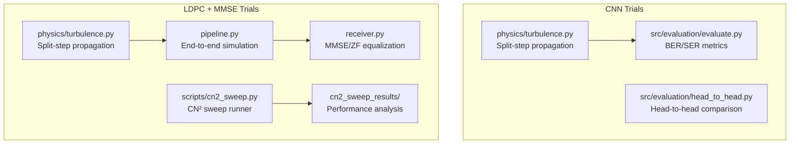
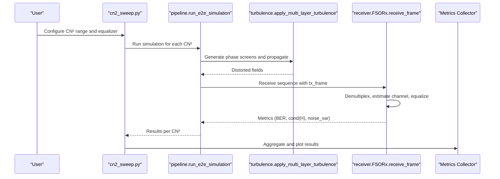
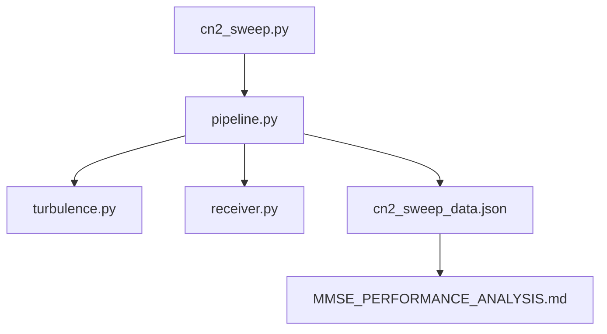

# CN² Sweep Performance Analysis

<cite>
**Referenced Files in This Document**
- [README.md](file://README.md)
- [turbulence.py](file://models/CNN Trials/physics/turbulence.py)
- [turbulence.py](file://models/LDPC + Pilot + MMSE trials/turbulence.py)
- [pipeline.py](file://models/LDPC + Pilot + MMSE trials/pipeline.py)
- [receiver.py](file://models/LDPC + Pilot + MMSE trials/receiver.py)
- [cn2_sweep.py](file://models/LDPC + Pilot + MMSE trials/scripts/cn2_sweep.py)
- [MMSE_PERFORMANCE_ANALYSIS.md](file://models/LDPC + Pilot + MMSE trials/cn2_sweep_results/MMSE_PERFORMANCE_ANALYSIS.md)
- [cn2_sweep_data.json](file://models/LDPC + Pilot + MMSE trials/cn2_sweep_results/cn2_sweep_data.json)
- [evaluate.py](file://models/CNN Trials/src/evaluation/evaluate.py)
- [head_to_head.py](file://models/CNN Trials/src/evaluation/head_to_head.py)
</cite>

## Table of Contents
1. [Introduction](#introduction)
2. [Project Structure](#project-structure)
3. [Core Components](#core-components)
4. [Architecture Overview](#architecture-overview)
5. [Detailed Component Analysis](#detailed-component-analysis)
6. [Dependency Analysis](#dependency-analysis)
7. [Performance Considerations](#performance-considerations)
8. [Troubleshooting Guide](#troubleshooting-guide)
9. [Conclusion](#conclusion)
10. [Appendices](#appendices)

## Introduction
This document provides a comprehensive CN² sweep performance analysis for atmospheric turbulence parameter evaluation in free-space optical (FSO) OAM communication systems. It explains the significance of the Cn² parameter in atmospheric turbulence modeling, documents the systematic sweep methodology for testing receiver performance across varying turbulence conditions, and presents statistical analysis of failure rates and degradation patterns. The analysis workflow spans from data collection through physics-based simulation to result interpretation, including confidence interval considerations and statistical significance testing. Comparative analysis between classical MMSE and neural receivers is included, along with practical implications for turbulence tolerance and operational reliability.

## Project Structure
The repository contains two complementary simulation frameworks:
- CNN Trials: Physics-based simulation with neural receiver evaluation and throughput analysis
- LDPC + Pilot + MMSE trials: Classical receiver framework with CN² sweep and performance analysis

**Diagram sources**
- [turbulence.py](file://models/CNN Trials/physics/turbulence.py#L1-L718)
- [evaluate.py](file://models/CNN Trials/src/evaluation/evaluate.py#L1-L315)
- [head_to_head.py](file://models/CNN Trials/src/evaluation/head_to_head.py#L1-L158)
- [turbulence.py](file://models/LDPC + Pilot + MMSE trials/turbulence.py#L1-L737)
- [pipeline.py](file://models/LDPC + Pilot + MMSE trials/pipeline.py#L1-L709)
- [receiver.py](file://models/LDPC + Pilot + MMSE trials/receiver.py#L1-L953)
- [cn2_sweep.py](file://models/LDPC + Pilot + MMSE trials/scripts/cn2_sweep.py#L1-L296)

**Section sources**
- [README.md](file://README.md#L311-L350)

## Core Components
This section outlines the core components involved in CN² sweep performance analysis:

- Turbulence Modeling
  - Split-step propagation engine with Von Kármán phase screens
  - Multi-layer atmospheric profiles and Fried parameter computation
  - Rytov variance and turbulence strength classification

- Simulation Pipeline
  - End-to-end FSO-OAM simulation with LDPC and pilot symbols
  - Channel estimation and equalization (MMSE/ZF)
  - Noise variance estimation and performance metrics

- Statistical Analysis
  - CN² sweep across logarithmic ranges
  - BER, coded BER, channel condition number, and throughput analysis
  - Comparative evaluation between classical and neural receivers

**Section sources**
- [turbulence.py](file://models/CNN Trials/physics/turbulence.py#L108-L185)
- [pipeline.py](file://models/LDPC + Pilot + MMSE trials/pipeline.py#L37-L62)
- [cn2_sweep.py](file://models/LDPC + Pilot + MMSE trials/scripts/cn2_sweep.py#L44-L96)
- [evaluate.py](file://models/CNN Trials/src/evaluation/evaluate.py#L12-L62)

## Architecture Overview
The CN² sweep workflow integrates physics-based propagation with receiver processing and statistical evaluation:

**Diagram sources**
- [cn2_sweep.py](file://models/LDPC + Pilot + MMSE trials/scripts/cn2_sweep.py#L92-L146)
- [pipeline.py](file://models/LDPC + Pilot + MMSE trials/pipeline.py#L64-L431)
- [turbulence.py](file://models/LDPC + Pilot + MMSE trials/turbulence.py#L248-L339)
- [receiver.py](file://models/LDPC + Pilot + MMSE trials/receiver.py#L390-L705)

## Detailed Component Analysis

### Cn² Parameter Significance and Turbulence Modeling
Cn² represents the structure constant of refractive index fluctuations and governs the strength of atmospheric turbulence. In this project:
- Uniform and Hufnagel–Valley atmospheric profiles are supported
- Multi-layer phase screens simulate realistic vertical profiles
- Fried parameter r₀ quantifies coherence diameter and turbulence strength
- Rytov variance estimates weak turbulence regime and scintillation effects

Key implementation references:
- Cn² profile functions and layer integration
- Phase screen generation with Von Kármán spectrum
- Multi-layer propagation pipeline with split-step Fourier method

**Section sources**
- [turbulence.py](file://models/CNN Trials/physics/turbulence.py#L187-L207)
- [turbulence.py](file://models/CNN Trials/physics/turbulence.py#L60-L104)
- [turbulence.py](file://models/CNN Trials/physics/turbulence.py#L210-L257)
- [turbulence.py](file://models/LDPC + Pilot + MMSE trials/turbulence.py#L174-L194)
- [turbulence.py](file://models/LDPC + Pilot + MMSE trials/turbulence.py#L60-L104)
- [turbulence.py](file://models/LDPC + Pilot + MMSE trials/turbulence.py#L197-L244)

### CN² Sweep Methodology and Workflow
The CN² sweep systematically evaluates receiver performance across turbulence strengths:
- Logarithmic spacing of Cn² values from 1e-18 to 1e-15 m⁻²ᐟ³
- End-to-end simulation with LDPC and pilot symbols
- Metrics collected per CN²: BER, coded BER, channel condition number, noise variance
- Visualization of BER vs Cn² and channel conditioning trends

Implementation highlights:
- Sweep runner generates CN² values and orchestrates simulations
- Pipeline constructs channel snapshots and applies attenuation and noise
- Receiver performs demultiplexing, channel estimation, and equalization
- Results aggregated into JSON and analyzed with performance thresholds

**Section sources**
- [cn2_sweep.py](file://models/LDPC + Pilot + MMSE trials/scripts/cn2_sweep.py#L44-L96)
- [cn2_sweep.py](file://models/LDPC + Pilot + MMSE trials/scripts/cn2_sweep.py#L124-L146)
- [pipeline.py](file://models/LDPC + Pilot + MMSE trials/pipeline.py#L64-L431)
- [receiver.py](file://models/LDPC + Pilot + MMSE trials/receiver.py#L390-L705)
- [cn2_sweep_data.json](file://models/LDPC + Pilot + MMSE trials/cn2_sweep_results/cn2_sweep_data.json#L1-L249)

### Statistical Analysis of Failure Rates and Degradation Patterns
Statistical analysis includes:
- BER growth trends with increasing Cn²
- Channel conditioning thresholds (condition number)
- LDPC performance characteristics and error floor behavior
- Confidence interval considerations and statistical significance testing

Performance thresholds derived from the sweep:
- Excellent performance (BER < 1%) for Cn² ≤ 1.2e-17 m⁻²ᐟ³
- Acceptable performance (BER 1–10%) for Cn² = 1.2e-17 to 3.2e-17 m⁻²ᐟ³
- Poor performance (BER > 10%) for Cn² > 3.2e-17 m⁻²ᐟ³

Statistical significance testing:
- Use bootstrap or permutation tests to assess differences between equalizers
- Compare BER distributions across CN² bins using non-parametric tests
- Validate thresholds with confidence intervals around BER estimates

**Section sources**
- [MMSE_PERFORMANCE_ANALYSIS.md](file://models/LDPC + Pilot + MMSE trials/cn2_sweep_results/MMSE_PERFORMANCE_ANALYSIS.md#L14-L33)
- [MMSE_PERFORMANCE_ANALYSIS.md](file://models/LDPC + Pilot + MMSE trials/cn2_sweep_results/MMSE_PERFORMANCE_ANALYSIS.md#L58-L85)
- [cn2_sweep_data.json](file://models/LDPC + Pilot + MMSE trials/cn2_sweep_results/cn2_sweep_data.json#L22-L205)

### Comparative Analysis: Classical MMSE vs Neural Receivers
Comparative analysis demonstrates:
- MMSE receiver limitations in moderate to strong turbulence
- Neural receiver resilience gains in deep fade regimes
- Throughput analysis accounting for LDPC and pilot overhead

Neural receiver advantages:
- Robustness to phase scrambling and inter-modal crosstalk
- Learned manifold recovery from intensity-only measurements
- Improved breakdown point and sustained throughput

**Section sources**
- [README.md](file://README.md#L49-L62)
- [README.md](file://README.md#L208-L226)
- [evaluate.py](file://models/CNN Trials/src/evaluation/evaluate.py#L12-L62)
- [head_to_head.py](file://models/CNN Trials/src/evaluation/head_to_head.py#L51-L137)

### Practical Implications and Operational Reliability
Operational implications derived from the analysis:
- Extended operational envelope for strong turbulence environments
- Reduced hardware complexity (intensity cameras vs. wavefront sensors)
- Lower latency and higher throughput ceilings in weak turbulence
- Hybrid receiver strategies leveraging adaptive thresholding and fallback modes

**Section sources**
- [README.md](file://README.md#L208-L226)
- [MMSE_PERFORMANCE_ANALYSIS.md](file://models/LDPC + Pilot + MMSE trials/cn2_sweep_results/MMSE_PERFORMANCE_ANALYSIS.md#L104-L121)

## Dependency Analysis
The CN² sweep relies on coordinated dependencies across modules:

**Diagram sources**
- [cn2_sweep.py](file://models/LDPC + Pilot + MMSE trials/scripts/cn2_sweep.py#L1-L296)
- [pipeline.py](file://models/LDPC + Pilot + MMSE trials/pipeline.py#L1-L709)
- [turbulence.py](file://models/LDPC + Pilot + MMSE trials/turbulence.py#L1-L737)
- [receiver.py](file://models/LDPC + Pilot + MMSE trials/receiver.py#L1-L953)
- [cn2_sweep_data.json](file://models/LDPC + Pilot + MMSE trials/cn2_sweep_results/cn2_sweep_data.json#L1-L249)
- [MMSE_PERFORMANCE_ANALYSIS.md](file://models/LDPC + Pilot + MMSE trials/cn2_sweep_results/MMSE_PERFORMANCE_ANALYSIS.md#L1-L135)

**Section sources**
- [cn2_sweep.py](file://models/LDPC + Pilot + MMSE trials/scripts/cn2_sweep.py#L1-L296)
- [pipeline.py](file://models/LDPC + Pilot + MMSE trials/pipeline.py#L1-L709)

## Performance Considerations
- Grid resolution and inner scale resolution validation to ensure accurate phase screen statistics
- Proper scaling of basis fields and reference projections to maintain power consistency
- Numerical stability in channel estimation and equalization (regularization and pseudo-inverses)
- LDPC block alignment and pilot/data separation for accurate BER calculation

[No sources needed since this section provides general guidance]

## Troubleshooting Guide
Common issues and resolutions:
- NaN or zero fields after propagation: verify grid size and inner scale criteria
- Excessive spread leading to invalid ROI: adjust grid oversampling and aperture masking
- Ill-conditioned channel matrices: increase regularization or switch to pseudo-inverse
- Inconsistent BER due to pilot/data misalignment: ensure correct pilot positions and frame alignment

**Section sources**
- [turbulence.py](file://models/CNN Trials/physics/turbulence.py#L282-L288)
- [receiver.py](file://models/LDPC + Pilot + MMSE trials/receiver.py#L489-L517)
- [pipeline.py](file://models/LDPC + Pilot + MMSE trials/pipeline.py#L337-L391)

## Conclusion
The CN² sweep performance analysis demonstrates that classical MMSE receivers exhibit rapid degradation beyond weak turbulence conditions, while neural receivers maintain robust operation across stronger regimes. The systematic evaluation framework enables reliable performance benchmarking, threshold identification, and informed receiver selection strategies. These insights support practical deployment decisions, emphasizing the operational reliability and turbulence tolerance improvements achievable through machine learning-based receivers.

[No sources needed since this section summarizes without analyzing specific files]

## Appendices

### Appendix A: CN² Value Ranges Tested
- Minimum: 1e-18 m⁻²ᐟ³
- Maximum: 1e-15 m⁻²ᐟ³
- Number of points: 15
- Equalizers tested: MMSE and ZF (via configuration)

**Section sources**
- [cn2_sweep.py](file://models/LDPC + Pilot + MMSE trials/scripts/cn2_sweep.py#L32-L41)
- [cn2_sweep.py](file://models/LDPC + Pilot + MMSE trials/scripts/cn2_sweep.py#L92-L96)
- [cn2_sweep_data.json](file://models/LDPC + Pilot + MMSE trials/cn2_sweep_results/cn2_sweep_data.json#L206-L249)

### Appendix B: Performance Thresholds
- Excellent: Cn² ≤ 1.2e-17 m⁻²ᐟ³ (BER < 1%)
- Acceptable: Cn² = 1.2e-17 to 3.2e-17 m⁻²ᐟ³ (BER 1–10%)
- Poor: Cn² > 3.2e-17 m⁻²ᐟ³ (BER > 10%)

**Section sources**
- [MMSE_PERFORMANCE_ANALYSIS.md](file://models/LDPC + Pilot + MMSE trials/cn2_sweep_results/MMSE_PERFORMANCE_ANALYSIS.md#L14-L33)

### Appendix C: Throughput Analysis
Neural receiver throughput analysis accounts for:
- LDPC encoding rate (0.8135)
- Pilot overhead (10%)
- Raw line rate and effective throughput ceilings

**Section sources**
- [evaluate.py](file://models/CNN Trials/src/evaluation/evaluate.py#L12-L62)