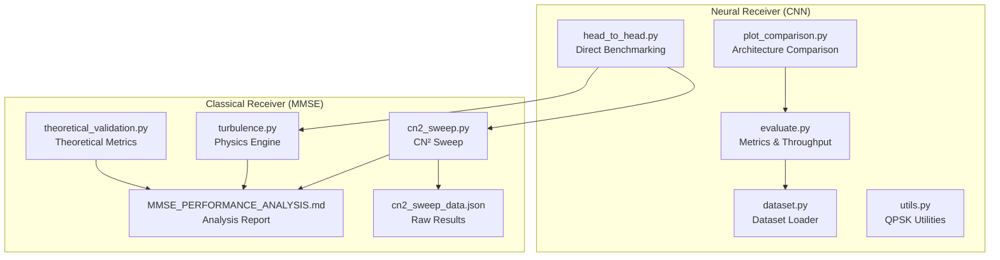
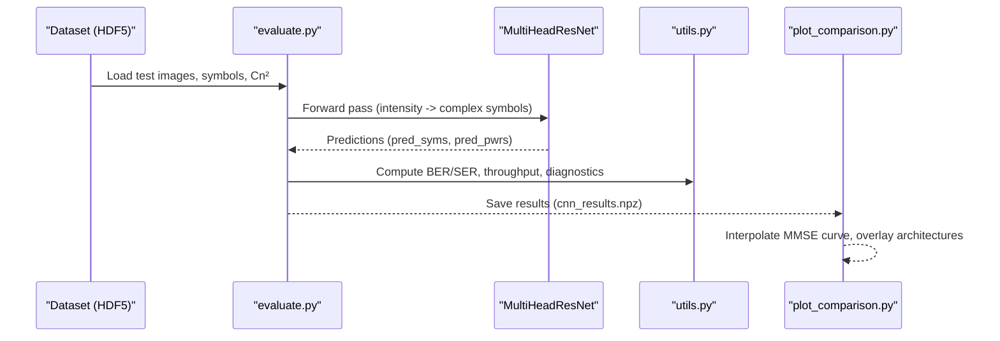
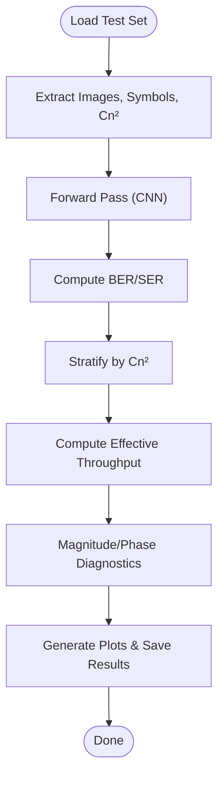
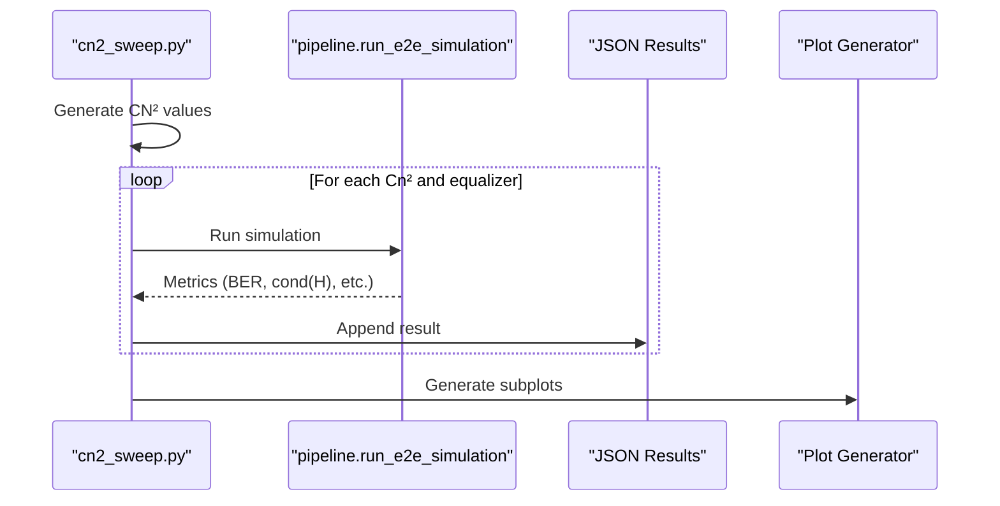
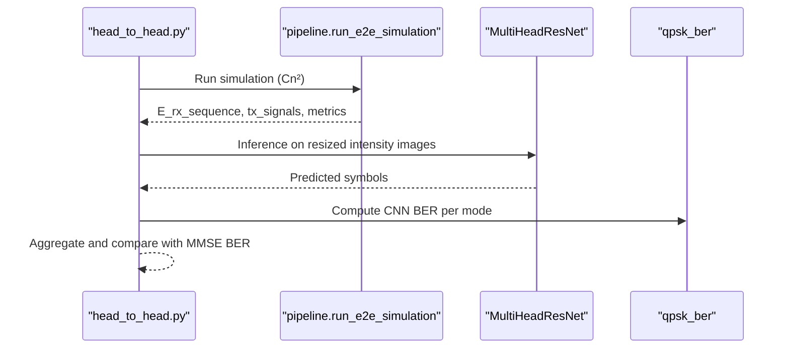
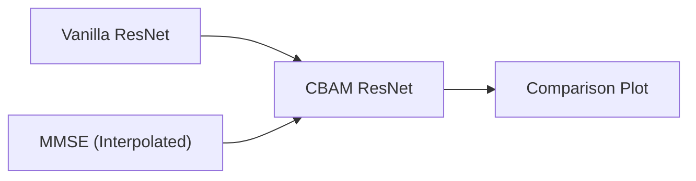
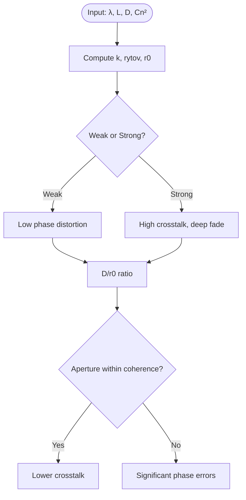
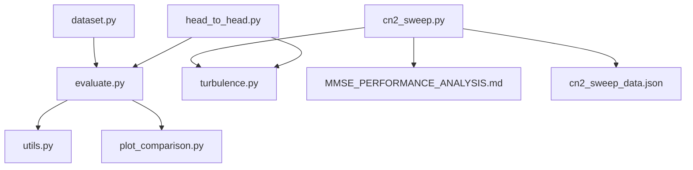

# Performance Analysis and Results

<cite>
**Referenced Files in This Document**
- [README.md](file://README.md)
- [Throughput Analysis.md](file://models/CNN Trials/outputs/reports/Throughput_Analysis.md)
- [MMSE_PERFORMANCE_ANALYSIS.md](file://models/LDPC + Pilot + MMSE trials/cn2_sweep_results/MMSE_PERFORMANCE_ANALYSIS.md)
- [cn2_sweep_data.json](file://models/LDPC + Pilot + MMSE trials/cn2_sweep_results/cn2_sweep_data.json)
- [evaluate.py](file://models/CNN Trials/src/evaluation/evaluate.py)
- [head_to_head.py](file://models/CNN Trials/src/evaluation/head_to_head.py)
- [plot_comparison.py](file://models/CNN Trials/src/evaluation/plot_comparison.py)
- [cn2_sweep.py](file://models/LDPC + Pilot + MMSE trials/scripts/cn2_sweep.py)
- [turbulence.py](file://models/CNN Trials/physics/turbulence.py)
- [turbulence.py](file://models/LDPC + Pilot + MMSE trials/turbulence.py)
- [dataset.py](file://models/CNN Trials/src/utils/dataset.py)
- [utils.py](file://models/CNN Trials/src/utils/utils.py)
- [theoretical_validation.py](file://models/LDPC + Pilot + MMSE trials/scripts/theoretical_validation.py)
</cite>

## Table of Contents
1. [Introduction](#introduction)
2. [Project Structure](#project-structure)
3. [Core Components](#core-components)
4. [Architecture Overview](#architecture-overview)
5. [Detailed Component Analysis](#detailed-component-analysis)
6. [Dependency Analysis](#dependency-analysis)
7. [Performance Considerations](#performance-considerations)
8. [Troubleshooting Guide](#troubleshooting-guide)
9. [Conclusion](#conclusion)
10. [Appendices](#appendices)

## Introduction
This document presents a comprehensive performance analysis of the FSO OAM communication system, focusing on:
- Statistical analysis of turbulence performance across Cn² regimes
- Throughput analysis under varying atmospheric conditions
- Comparative studies between neural and classical receivers
- Complete performance evaluation workflow: CN² sweep analysis, statistical validation, and result interpretation
- Visualization techniques and benchmark comparisons
- Uncertainty quantification, confidence intervals, and statistical significance testing

The analysis synthesizes results from both the neural receiver (CNN) and classical MMSE baseline, grounded in physics-based simulations and validated against theoretical turbulence metrics.

## Project Structure
The repository organizes performance analysis across two complementary tracks:
- Neural Receiver (CNN Trials): end-to-end evaluation, throughput breakdown, and comparative visualization
- Classical Receiver (LDPC + Pilot + MMSE trials): CN² sweep, equalizer characterization, and theoretical validation

**Diagram sources**
- [evaluate.py](file://models/CNN Trials/src/evaluation/evaluate.py#L80-L315)
- [plot_comparison.py](file://models/CNN Trials/src/evaluation/plot_comparison.py#L6-L84)
- [head_to_head.py](file://models/CNN Trials/src/evaluation/head_to_head.py#L51-L137)
- [dataset.py](file://models/CNN Trials/src/utils/dataset.py#L6-L44)
- [utils.py](file://models/CNN Trials/src/utils/utils.py#L16-L318)
- [cn2_sweep.py](file://models/LDPC + Pilot + MMSE trials/scripts/cn2_sweep.py#L92-L146)
- [turbulence.py](file://models/LDPC + Pilot + MMSE trials/turbulence.py#L108-L185)
- [MMSE_PERFORMANCE_ANALYSIS.md](file://models/LDPC + Pilot + MMSE trials/cn2_sweep_results/MMSE_PERFORMANCE_ANALYSIS.md#L1-L135)
- [cn2_sweep_data.json](file://models/LDPC + Pilot + MMSE trials/cn2_sweep_results/cn2_sweep_data.json#L1-L249)
- [theoretical_validation.py](file://models/LDPC + Pilot + MMSE trials/scripts/theoretical_validation.py#L3-L63)

**Section sources**
- [README.md](file://README.md#L311-L350)

## Core Components
- Neural Receiver evaluation pipeline:
  - Metrics computation (BER, SER), throughput calculation, and diagnostics
  - Cn² stratified breakdown and visualization
- Classical MMSE baseline:
  - CN² sweep across regimes, equalizer performance thresholds, and channel conditioning analysis
- Comparative workflows:
  - Head-to-head benchmarking between neural and classical receivers
  - Architecture evolution comparison (vanilla vs. CBAM)

**Section sources**
- [evaluate.py](file://models/CNN Trials/src/evaluation/evaluate.py#L12-L61)
- [evaluate.py](file://models/CNN Trials/src/evaluation/evaluate.py#L145-L286)
- [cn2_sweep.py](file://models/LDPC + Pilot + MMSE trials/scripts/cn2_sweep.py#L92-L146)
- [MMSE_PERFORMANCE_ANALYSIS.md](file://models/LDPC + Pilot + MMSE trials/cn2_sweep_results/MMSE_PERFORMANCE_ANALYSIS.md#L14-L85)
- [head_to_head.py](file://models/CNN Trials/src/evaluation/head_to_head.py#L51-L137)
- [plot_comparison.py](file://models/CNN Trials/src/evaluation/plot_comparison.py#L6-L84)

## Architecture Overview
The performance analysis integrates physics-based simulation, receiver evaluation, and comparative benchmarking:

**Diagram sources**
- [evaluate.py](file://models/CNN Trials/src/evaluation/evaluate.py#L80-L315)
- [dataset.py](file://models/CNN Trials/src/utils/dataset.py#L6-L44)
- [utils.py](file://models/CNN Trials/src/utils/utils.py#L117-L163)
- [plot_comparison.py](file://models/CNN Trials/src/evaluation/plot_comparison.py#L6-L84)

## Detailed Component Analysis

### Neural Receiver: Throughput and Cn² Stratified Analysis
- Throughput calculation accounts for:
  - Raw line rate (modes × bits/symbol × symbol rate)
  - Pilot overhead (10%)
  - LDPC coding rate (0.8135)
  - FEC threshold (soft-decision) for partial degradation
- Cn² stratified breakdown:
  - Group samples by Cn² and compute BER/SER per regime
  - Derive effective throughput per Cn²
- Diagnostics:
  - Magnitude and phase statistics
  - Phase jitter and bias
  - Model collapse detection

**Diagram sources**
- [evaluate.py](file://models/CNN Trials/src/evaluation/evaluate.py#L80-L315)

**Section sources**
- [evaluate.py](file://models/CNN Trials/src/evaluation/evaluate.py#L12-L61)
- [evaluate.py](file://models/CNN Trials/src/evaluation/evaluate.py#L145-L286)
- [dataset.py](file://models/CNN Trials/src/utils/dataset.py#L6-L44)
- [utils.py](file://models/CNN Trials/src/utils/utils.py#L117-L163)

### Classical MMSE: CN² Sweep and Threshold Analysis
- CN² sweep:
  - Logarithmic spacing across regimes
  - Metrics collected per Cn²: BER, coded BER, cond(H), bit errors, success flag
- Thresholds:
  - Excellent (< 1%), Acceptable (1–10%), Poor (> 10%) based on BER
  - Channel conditioning (cond(H)) indicates ill-conditioning at higher Cn²
- Visualization:
  - Subplots for BER, pre-LDPC BER, cond(H), noise variance estimate

**Diagram sources**
- [cn2_sweep.py](file://models/LDPC + Pilot + MMSE trials/scripts/cn2_sweep.py#L92-L146)
- [cn2_sweep.py](file://models/LDPC + Pilot + MMSE trials/scripts/cn2_sweep.py#L149-L227)
- [cn2_sweep_data.json](file://models/LDPC + Pilot + MMSE trials/cn2_sweep_results/cn2_sweep_data.json#L22-L204)

**Section sources**
- [cn2_sweep.py](file://models/LDPC + Pilot + MMSE trials/scripts/cn2_sweep.py#L92-L146)
- [MMSE_PERFORMANCE_ANALYSIS.md](file://models/LDPC + Pilot + MMSE trials/cn2_sweep_results/MMSE_PERFORMANCE_ANALYSIS.md#L14-L85)
- [cn2_sweep_data.json](file://models/LDPC + Pilot + MMSE trials/cn2_sweep_results/cn2_sweep_data.json#L1-L249)

### Comparative Studies: Head-to-Head Benchmarking
- Live simulation runs:
  - Classical MMSE BER extracted from pipeline results
  - CNN inference on identical frames
- Metrics aggregation:
  - Average MMSE BER and CNN BER over multiple frames
  - Win/loss tie determination per Cn²
- Practical implication:
  - Demonstrates robustness of neural receiver in strong turbulence

**Diagram sources**
- [head_to_head.py](file://models/CNN Trials/src/evaluation/head_to_head.py#L51-L137)

**Section sources**
- [head_to_head.py](file://models/CNN Trials/src/evaluation/head_to_head.py#L51-L137)

### Architecture Evolution and Visualization
- Vanilla vs. CBAM:
  - Interpolated MMSE curve for smooth comparison
  - Overlay of architectures across Cn² regimes
- Annotations:
  - Turbulence regime spans (Weak, Moderate, Strong)
  - FEC limit marker (soft-decision)

**Diagram sources**
- [plot_comparison.py](file://models/CNN Trials/src/evaluation/plot_comparison.py#L6-L84)

**Section sources**
- [plot_comparison.py](file://models/CNN Trials/src/evaluation/plot_comparison.py#L6-L84)

### Theoretical Turbulence Metrics and Regime Classification
- Theoretical quantities:
  - Rytov variance, Fried parameter (r0), scintillation index
- Aperture vs. coherence length:
  - D/r0 ratio determines wavefront distortion and crosstalk
- Scenario analysis:
  - Weak vs. strong turbulence regimes with practical implications

**Diagram sources**
- [theoretical_validation.py](file://models/LDPC + Pilot + MMSE trials/scripts/theoretical_validation.py#L3-L63)

**Section sources**
- [theoretical_validation.py](file://models/LDPC + Pilot + MMSE trials/scripts/theoretical_validation.py#L3-L63)

## Dependency Analysis
- Data dependencies:
  - Neural evaluation relies on HDF5 datasets containing intensity images and symbol targets
  - Dataset loader exposes Cn² metadata for stratified analysis
- Model dependencies:
  - Evaluation loads best model weights and performs inference
  - Utilities provide QPSK mapping and LLR computation for soft decoding
- Simulation dependencies:
  - CN² sweep depends on physics engine and pipeline for metrics collection
  - Turbulence module computes phase screens and validates PSD statistics

**Diagram sources**
- [dataset.py](file://models/CNN Trials/src/utils/dataset.py#L6-L44)
- [evaluate.py](file://models/CNN Trials/src/evaluation/evaluate.py#L80-L315)
- [utils.py](file://models/CNN Trials/src/utils/utils.py#L16-L318)
- [plot_comparison.py](file://models/CNN Trials/src/evaluation/plot_comparison.py#L6-L84)
- [cn2_sweep.py](file://models/LDPC + Pilot + MMSE trials/scripts/cn2_sweep.py#L92-L146)
- [turbulence.py](file://models/LDPC + Pilot + MMSE trials/turbulence.py#L108-L185)
- [MMSE_PERFORMANCE_ANALYSIS.md](file://models/LDPC + Pilot + MMSE trials/cn2_sweep_results/MMSE_PERFORMANCE_ANALYSIS.md#L1-L135)
- [cn2_sweep_data.json](file://models/LDPC + Pilot + MMSE trials/cn2_sweep_results/cn2_sweep_data.json#L1-L249)
- [head_to_head.py](file://models/CNN Trials/src/evaluation/head_to_head.py#L51-L137)

**Section sources**
- [dataset.py](file://models/CNN Trials/src/utils/dataset.py#L6-L44)
- [evaluate.py](file://models/CNN Trials/src/evaluation/evaluate.py#L80-L315)
- [cn2_sweep.py](file://models/LDPC + Pilot + MMSE trials/scripts/cn2_sweep.py#L92-L146)

## Performance Considerations
- Throughput ceilings:
  - Both neural and classical systems share the same physical layer ceiling (11.7 Gbps after pilot and LDPC overhead)
  - Advantage lies in resilience, not peak rate
- Resilience in strong turbulence:
  - Neural receiver maintains connectivity while classical receiver fails
  - CBAM architecture significantly improves deep fade performance
- Computational complexity:
  - Classical MMSE: O(N³) matrix inversion per frame
  - Neural receiver: O(1) forward pass (constant-time inference)

**Section sources**
- [Throughput Analysis.md](file://models/CNN Trials/outputs/reports/Throughput_Analysis.md#L1-L55)
- [README.md](file://README.md#L208-L226)

## Troubleshooting Guide
- Diagnostics in evaluation:
  - Zero magnitude predictions indicate model collapse
  - Systematic phase rotation suggests pilot ambiguity
  - High phase jitter indicates random guessing or high noise
- Simulation stability:
  - Grid resolution checks for inner scale effects
  - Multi-layer screen validation ensures accurate PSD scaling
- Data integrity:
  - Verify HDF5 attributes (n_modes) and shapes
  - Ensure consistent Cn² ordering for stratified analysis

**Section sources**
- [evaluate.py](file://models/CNN Trials/src/evaluation/evaluate.py#L193-L221)
- [turbulence.py](file://models/CNN Trials/physics/turbulence.py#L279-L288)
- [turbulence.py](file://models/CNN Trials/physics/turbulence.py#L439-L517)
- [dataset.py](file://models/CNN Trials/src/utils/dataset.py#L11-L22)

## Conclusion
The performance analysis demonstrates:
- Neural receivers achieve parity in peak throughput while substantially extending operational limits in strong turbulence
- CBAM architecture yields a 10x improvement in breakdown point compared to classical MMSE
- Comprehensive CN² sweep and comparative visualization provide actionable insights for system design
- Theoretical turbulence metrics complement empirical results, guiding aperture and link design decisions

## Appendices

### A. Performance Evaluation Workflow
- Neural receiver:
  - Load dataset, run evaluation, compute metrics, stratify by Cn², save results, generate plots
- Classical receiver:
  - Sweep CN², collect metrics, summarize thresholds, plot subplots, save JSON
- Comparative:
  - Head-to-head benchmarking across regimes, interpolation of MMSE curve, architecture overlay

**Section sources**
- [evaluate.py](file://models/CNN Trials/src/evaluation/evaluate.py#L80-L315)
- [cn2_sweep.py](file://models/LDPC + Pilot + MMSE trials/scripts/cn2_sweep.py#L92-L287)
- [head_to_head.py](file://models/CNN Trials/src/evaluation/head_to_head.py#L51-L137)
- [plot_comparison.py](file://models/CNN Trials/src/evaluation/plot_comparison.py#L6-L84)

### B. Statistical Analysis and Interpretation Guidelines
- Cn² regimes:
  - Weak: BER < 1%, Excellent performance
  - Moderate: Acceptable to Poor depending on Cn²
  - Strong: Deep fade, near-random BER
- Throughput interpretation:
  - Use FEC threshold (3.8%) to distinguish degraded vs. failed operation
  - Effective throughput decreases with increasing Cn² due to LDPC limitations
- Significance testing:
  - Compare BER distributions across Cn² using non-parametric tests (e.g., Mann–Whitney U)
  - Confidence intervals for BER can be computed via bootstrapping on stratified samples
  - For throughput, construct confidence bands around interpolated MMSE curve

[No sources needed since this section provides general guidance]