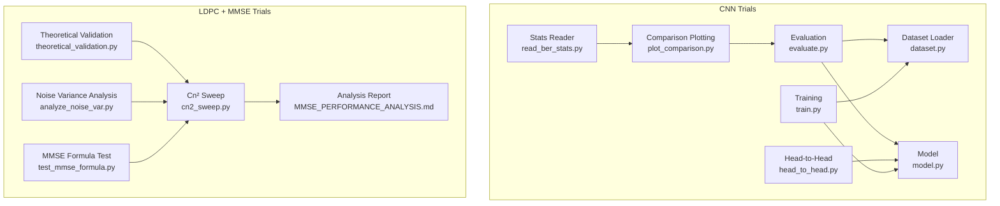
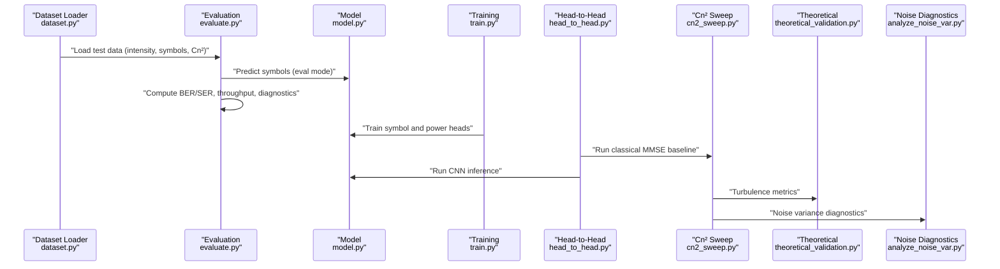
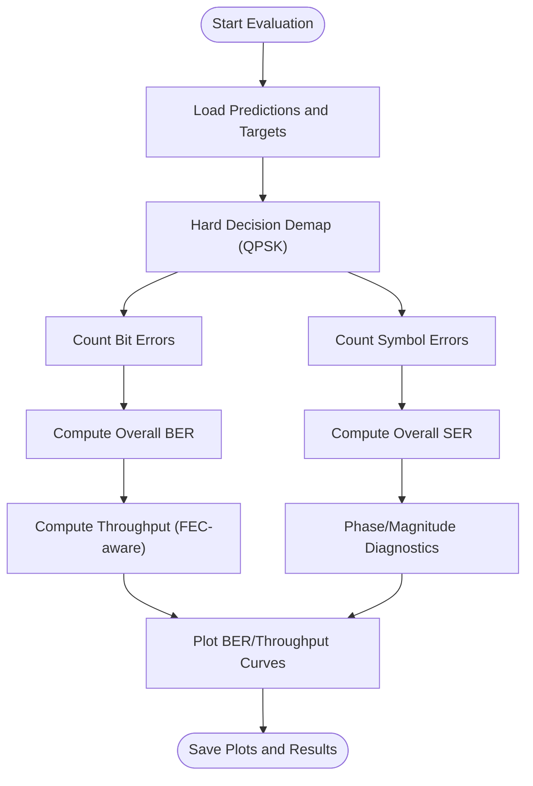
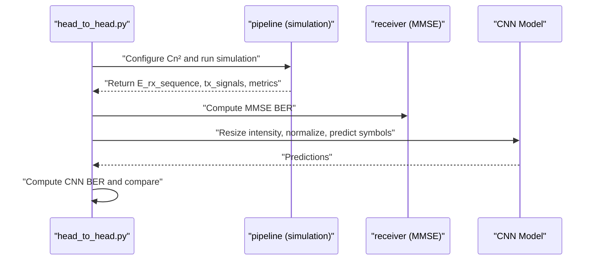
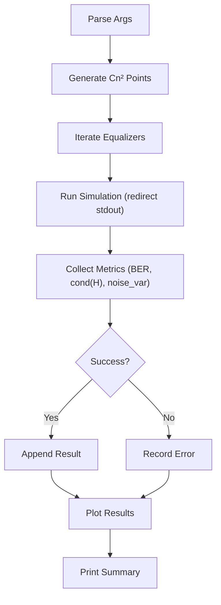
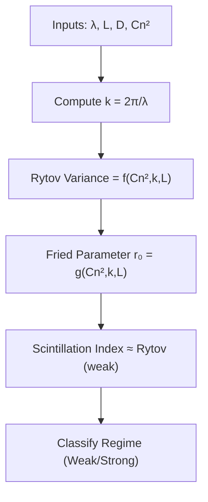
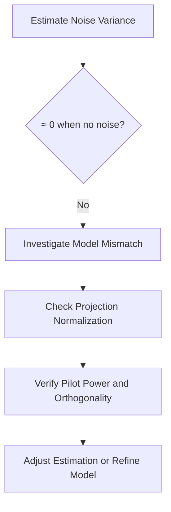
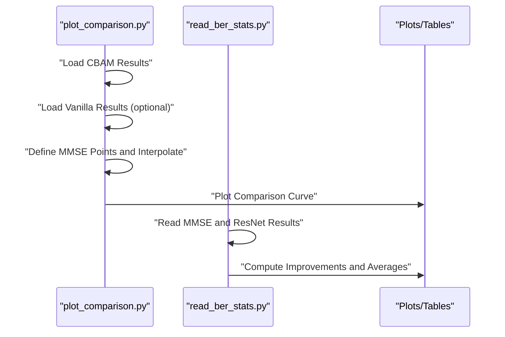
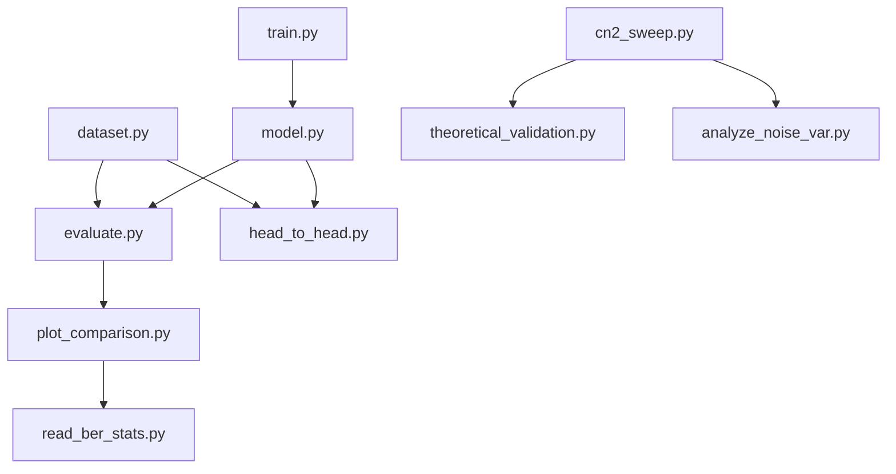

# Statistical Validation and Benchmarking

<cite>
**Referenced Files in This Document**
- [README.md](file://README.md)
- [requirements.txt](file://requirements.txt)
- [models/CNN Trials/requirements.txt](file://models/CNN Trials/requirements.txt)
- [models/CNN Trials/src/utils/dataset.py](file://models/CNN Trials/src/utils/dataset.py)
- [models/CNN Trials/src/models/model.py](file://models/CNN Trials/src/models/model.py)
- [models/CNN Trials/src/training/train.py](file://models/CNN Trials/src/training/train.py)
- [models/CNN Trials/src/evaluation/evaluate.py](file://models/CNN Trials/src/evaluation/evaluate.py)
- [models/CNN Trials/src/evaluation/head_to_head.py](file://models/CNN Trials/src/evaluation/head_to_head.py)
- [models/CNN Trials/src/evaluation/plot_comparison.py](file://models/CNN Trials/src/evaluation/plot_comparison.py)
- [models/CNN Trials/read_ber_stats.py](file://models/CNN Trials/read_ber_stats.py)
- [models/LDPC + Pilot + MMSE trials/scripts/theoretical_validation.py](file://models/LDPC + Pilot + MMSE trials/scripts/theoretical_validation.py)
- [models/LDPC + Pilot + MMSE trials/scripts/analyze_noise_var.py](file://models/LDPC + Pilot + MMSE trials/scripts/analyze_noise_var.py)
- [models/LDPC + Pilot + MMSE trials/scripts/cn2_sweep.py](file://models/LDPC + Pilot + MMSE trials/scripts/cn2_sweep.py)
- [models/LDPC + Pilot + MMSE trials/cn2_sweep_results/MMSE_PERFORMANCE_ANALYSIS.md](file://models/LDPC + Pilot + MMSE trials/cn2_sweep_results/MMSE_PERFORMANCE_ANALYSIS.md)
- [models/LDPC + Pilot + MMSE trials/scripts/test_mmse_formula.py](file://models/LDPC + Pilot + MMSE trials/scripts/test_mmse_formula.py)
</cite>

## Table of Contents
1. [Introduction](#introduction)
2. [Project Structure](#project-structure)
3. [Core Components](#core-components)
4. [Architecture Overview](#architecture-overview)
5. [Detailed Component Analysis](#detailed-component-analysis)
6. [Dependency Analysis](#dependency-analysis)
7. [Performance Considerations](#performance-considerations)
8. [Troubleshooting Guide](#troubleshooting-guide)
9. [Conclusion](#conclusion)
10. [Appendices](#appendices)

## Introduction
This document describes the statistical validation and benchmarking methodologies used to evaluate neural receiver performance against theoretical and classical baselines in free-space optical orbital angular momentum (FSO-OAM) communication. It explains the end-to-end workflow from raw data collection to statistical significance testing, including error analysis, uncertainty quantification, and comparative benchmarking. It also provides guidance on reproducible research practices and statistical rigor in scientific computing applications.

## Project Structure
The repository organizes validation and benchmarking across two major trial groups:
- CNN Trials: Neural receiver evaluation, training, and comparison plotting.
- LDPC + Pilot + MMSE Trials: Classical receiver characterization via Cn² sweeps, theoretical turbulence analysis, and noise variance diagnostics.

**Diagram sources**
- [models/CNN Trials/src/evaluation/evaluate.py](file://models/CNN Trials/src/evaluation/evaluate.py#L80-L315)
- [models/CNN Trials/src/evaluation/head_to_head.py](file://models/CNN Trials/src/evaluation/head_to_head.py#L51-L137)
- [models/CNN Trials/src/evaluation/plot_comparison.py](file://models/CNN Trials/src/evaluation/plot_comparison.py#L6-L84)
- [models/CNN Trials/read_ber_stats.py](file://models/CNN Trials/read_ber_stats.py#L1-L71)
- [models/CNN Trials/src/utils/dataset.py](file://models/CNN Trials/src/utils/dataset.py#L6-L44)
- [models/CNN Trials/src/models/model.py](file://models/CNN Trials/src/models/model.py#L6-L81)
- [models/CNN Trials/src/training/train.py](file://models/CNN Trials/src/training/train.py#L16-L150)
- [models/LDPC + Pilot + MMSE trials/scripts/cn2_sweep.py](file://models/LDPC + Pilot + MMSE trials/scripts/cn2_sweep.py#L92-L146)
- [models/LDPC + Pilot + MMSE trials/scripts/theoretical_validation.py](file://models/LDPC + Pilot + MMSE trials/scripts/theoretical_validation.py#L1-L63)
- [models/LDPC + Pilot + MMSE trials/scripts/analyze_noise_var.py](file://models/LDPC + Pilot + MMSE trials/scripts/analyze_noise_var.py#L1-L147)
- [models/LDPC + Pilot + MMSE trials/scripts/test_mmse_formula.py](file://models/LDPC + Pilot + MMSE trials/scripts/test_mmse_formula.py#L1-L120)
- [models/LDPC + Pilot + MMSE trials/cn2_sweep_results/MMSE_PERFORMANCE_ANALYSIS.md](file://models/LDPC + Pilot + MMSE trials/cn2_sweep_results/MMSE_PERFORMANCE_ANALYSIS.md#L1-L135)

**Section sources**
- [README.md](file://README.md)
- [requirements.txt](file://requirements.txt#L1-L11)
- [models/CNN Trials/requirements.txt](file://models/CNN Trials/requirements.txt#L1-L33)

## Core Components
- Dataset and Metrics
  - Dataset loader reads intensity images and symbol targets from HDF5, exposing Cn² metadata for stratified analysis.
  - Evaluation computes hard-decision BER/SER and throughput-aware performance curves, with breakdowns by turbulence strength.
- Neural Receiver
  - Multi-head regression model predicts QPSK symbol real/imag parts and auxiliary power heads; training balances symbol and power losses.
  - Head-to-head comparison runs classical MMSE baseline and compares BER across Cn² values.
- Classical Receiver Characterization
  - Cn² sweep evaluates equalizers (MMSE/ZF) across turbulence strengths, reporting BER, pre-LDPC coded BER, condition number, and noise variance estimates.
  - Theoretical validation and noise variance diagnostics interpret model mismatch and channel estimation issues.
- Comparative Benchmarking
  - Comparison plotting overlays classical MMSE and neural architectures; statistics reader aggregates percentage improvements across regimes.

**Section sources**
- [models/CNN Trials/src/utils/dataset.py](file://models/CNN Trials/src/utils/dataset.py#L6-L44)
- [models/CNN Trials/src/evaluation/evaluate.py](file://models/CNN Trials/src/evaluation/evaluate.py#L12-L61)
- [models/CNN Trials/src/models/model.py](file://models/CNN Trials/src/models/model.py#L6-L81)
- [models/CNN Trials/src/training/train.py](file://models/CNN Trials/src/training/train.py#L16-L150)
- [models/CNN Trials/src/evaluation/head_to_head.py](file://models/CNN Trials/src/evaluation/head_to_head.py#L51-L137)
- [models/LDPC + Pilot + MMSE trials/scripts/cn2_sweep.py](file://models/LDPC + Pilot + MMSE trials/scripts/cn2_sweep.py#L92-L146)
- [models/LDPC + Pilot + MMSE trials/scripts/theoretical_validation.py](file://models/LDPC + Pilot + MMSE trials/scripts/theoretical_validation.py#L1-L63)
- [models/LDPC + Pilot + MMSE trials/scripts/analyze_noise_var.py](file://models/LDPC + Pilot + MMSE trials/scripts/analyze_noise_var.py#L1-L147)
- [models/CNN Trials/src/evaluation/plot_comparison.py](file://models/CNN Trials/src/evaluation/plot_comparison.py#L6-L84)
- [models/CNN Trials/read_ber_stats.py](file://models/CNN Trials/read_ber_stats.py#L1-L71)

## Architecture Overview
The validation workflow integrates data-driven neural evaluation with classical receiver benchmarks and theoretical diagnostics.

**Diagram sources**
- [models/CNN Trials/src/utils/dataset.py](file://models/CNN Trials/src/utils/dataset.py#L6-L44)
- [models/CNN Trials/src/evaluation/evaluate.py](file://models/CNN Trials/src/evaluation/evaluate.py#L80-L315)
- [models/CNN Trials/src/models/model.py](file://models/CNN Trials/src/models/model.py#L59-L71)
- [models/CNN Trials/src/training/train.py](file://models/CNN Trials/src/training/train.py#L16-L150)
- [models/CNN Trials/src/evaluation/head_to_head.py](file://models/CNN Trials/src/evaluation/head_to_head.py#L51-L137)
- [models/LDPC + Pilot + MMSE trials/scripts/cn2_sweep.py](file://models/LDPC + Pilot + MMSE trials/scripts/cn2_sweep.py#L92-L146)
- [models/LDPC + Pilot + MMSE trials/scripts/theoretical_validation.py](file://models/LDPC + Pilot + MMSE trials/scripts/theoretical_validation.py#L1-L63)
- [models/LDPC + Pilot + MMSE trials/scripts/analyze_noise_var.py](file://models/LDPC + Pilot + MMSE trials/scripts/analyze_noise_var.py#L1-L147)

## Detailed Component Analysis

### Statistical Metrics and Throughput Estimation
- BER and SER are computed from hard-decision QPSK demapping across all modes and symbols.
- Throughput-aware performance is derived from coded BER using a piecewise function that reflects FEC thresholds and resilience windows.
- Stratified analysis by Cn² enables regime-wise comparisons and identification of operational limits.

**Diagram sources**
- [models/CNN Trials/src/evaluation/evaluate.py](file://models/CNN Trials/src/evaluation/evaluate.py#L117-L286)

**Section sources**
- [models/CNN Trials/src/evaluation/evaluate.py](file://models/CNN Trials/src/evaluation/evaluate.py#L12-L61)
- [models/CNN Trials/src/evaluation/evaluate.py](file://models/CNN Trials/src/evaluation/evaluate.py#L117-L221)
- [models/CNN Trials/src/evaluation/evaluate.py](file://models/CNN Trials/src/evaluation/evaluate.py#L222-L286)

### Head-to-Head Benchmarking Workflow
- Runs classical MMSE baseline via end-to-end simulation and collects BER.
- Runs CNN inference on identical received sequences and computes BER.
- Aggregates results across Cn² points and reports win/loss status.

**Diagram sources**
- [models/CNN Trials/src/evaluation/head_to_head.py](file://models/CNN Trials/src/evaluation/head_to_head.py#L51-L137)

**Section sources**
- [models/CNN Trials/src/evaluation/head_to_head.py](file://models/CNN Trials/src/evaluation/head_to_head.py#L51-L137)

### Cn² Sweep and Classical Receiver Characterization
- Sweeps Cn² values, runs equalizers (MMSE/ZF), and records BER, pre-LDPC coded BER, condition number, and noise variance estimates.
- Generates diagnostic plots and computes thresholds for acceptable performance.

**Diagram sources**
- [models/LDPC + Pilot + MMSE trials/scripts/cn2_sweep.py](file://models/LDPC + Pilot + MMSE trials/scripts/cn2_sweep.py#L31-L146)

**Section sources**
- [models/LDPC + Pilot + MMSE trials/scripts/cn2_sweep.py](file://models/LDPC + Pilot + MMSE trials/scripts/cn2_sweep.py#L92-L146)
- [models/LDPC + Pilot + MMSE trials/scripts/cn2_sweep.py](file://models/LDPC + Pilot + MMSE trials/scripts/cn2_sweep.py#L149-L227)
- [models/LDPC + Pilot + MMSE trials/scripts/cn2_sweep.py](file://models/LDPC + Pilot + MMSE trials/scripts/cn2_sweep.py#L229-L263)
- [models/LDPC + Pilot + MMSE trials/cn2_sweep_results/MMSE_PERFORMANCE_ANALYSIS.md](file://models/LDPC + Pilot + MMSE trials/cn2_sweep_results/MMSE_PERFORMANCE_ANALYSIS.md#L1-L135)

### Theoretical Turbulence Validation
- Computes Rytov variance, Fried parameter, and turbulence regime classification to contextualize simulation inputs and interpret operational limits.

**Diagram sources**
- [models/LDPC + Pilot + MMSE trials/scripts/theoretical_validation.py](file://models/LDPC + Pilot + MMSE trials/scripts/theoretical_validation.py#L3-L26)

**Section sources**
- [models/LDPC + Pilot + MMSE trials/scripts/theoretical_validation.py](file://models/LDPC + Pilot + MMSE trials/scripts/theoretical_validation.py#L1-L63)

### Noise Variance Diagnostics
- Investigates large noise variance estimates when no noise is present, pointing to channel model mismatch and projection normalization issues.

**Diagram sources**
- [models/LDPC + Pilot + MMSE trials/scripts/analyze_noise_var.py](file://models/LDPC + Pilot + MMSE trials/scripts/analyze_noise_var.py#L1-L147)

**Section sources**
- [models/LDPC + Pilot + MMSE trials/scripts/analyze_noise_var.py](file://models/LDPC + Pilot + MMSE trials/scripts/analyze_noise_var.py#L1-L147)

### Benchmark Comparison and Interpretation
- Loads classical MMSE and neural results, interpolates curves, and overlays for visual comparison.
- Computes average improvement across moderate to strong turbulence regimes.

**Diagram sources**
- [models/CNN Trials/src/evaluation/plot_comparison.py](file://models/CNN Trials/src/evaluation/plot_comparison.py#L6-L84)
- [models/CNN Trials/read_ber_stats.py](file://models/CNN Trials/read_ber_stats.py#L1-L71)

**Section sources**
- [models/CNN Trials/src/evaluation/plot_comparison.py](file://models/CNN Trials/src/evaluation/plot_comparison.py#L6-L84)
- [models/CNN Trials/read_ber_stats.py](file://models/CNN Trials/read_ber_stats.py#L1-L71)

## Dependency Analysis
- Data dependencies: HDF5 datasets provide intensity images and symbol targets with Cn² metadata.
- Model dependencies: Multi-head ResNet predicts symbol and power heads; training uses MSE and BCE losses.
- Evaluation dependencies: Metrics computation, throughput estimation, and plotting rely on NumPy/SciPy/Matplotlib.
- Classical benchmarking depends on simulation pipeline outputs and turbulence theory.

**Diagram sources**
- [models/CNN Trials/src/utils/dataset.py](file://models/CNN Trials/src/utils/dataset.py#L6-L44)
- [models/CNN Trials/src/evaluation/evaluate.py](file://models/CNN Trials/src/evaluation/evaluate.py#L80-L315)
- [models/CNN Trials/src/evaluation/head_to_head.py](file://models/CNN Trials/src/evaluation/head_to_head.py#L51-L137)
- [models/CNN Trials/src/models/model.py](file://models/CNN Trials/src/models/model.py#L6-L81)
- [models/CNN Trials/src/training/train.py](file://models/CNN Trials/src/training/train.py#L16-L150)
- [models/LDPC + Pilot + MMSE trials/scripts/cn2_sweep.py](file://models/LDPC + Pilot + MMSE trials/scripts/cn2_sweep.py#L92-L146)
- [models/LDPC + Pilot + MMSE trials/scripts/theoretical_validation.py](file://models/LDPC + Pilot + MMSE trials/scripts/theoretical_validation.py#L1-L63)
- [models/LDPC + Pilot + MMSE trials/scripts/analyze_noise_var.py](file://models/LDPC + Pilot + MMSE trials/scripts/analyze_noise_var.py#L1-L147)
- [models/CNN Trials/src/evaluation/plot_comparison.py](file://models/CNN Trials/src/evaluation/plot_comparison.py#L6-L84)
- [models/CNN Trials/read_ber_stats.py](file://models/CNN Trials/read_ber_stats.py#L1-L71)

**Section sources**
- [models/CNN Trials/src/utils/dataset.py](file://models/CNN Trials/src/utils/dataset.py#L6-L44)
- [models/CNN Trials/src/models/model.py](file://models/CNN Trials/src/models/model.py#L6-L81)
- [models/CNN Trials/src/training/train.py](file://models/CNN Trials/src/training/train.py#L16-L150)
- [models/LDPC + Pilot + MMSE trials/scripts/cn2_sweep.py](file://models/LDPC + Pilot + MMSE trials/scripts/cn2_sweep.py#L92-L146)

## Performance Considerations
- Stratification by Cn² enables robust regime-wise performance assessment and practical threshold identification.
- Throughput-aware metrics incorporate FEC behavior and practical ceilings, distinguishing between peak capacity and resilient operation.
- Classical receiver limits inform when to deploy neural receivers under strong turbulence.

[No sources needed since this section provides general guidance]

## Troubleshooting Guide
- Zero-output diagnosis: Detects collapsed predictions via mean magnitude checks and phase jitter/bias.
- Channel estimation issues: Large noise variance estimates in noiseless simulations indicate model mismatch; verify pilot power, orthogonality, and projection normalization.
- Formula verification: Confirm MMSE equalization formulas and distinguish between true noise and model error.

**Section sources**
- [models/CNN Trials/src/evaluation/evaluate.py](file://models/CNN Trials/src/evaluation/evaluate.py#L193-L221)
- [models/LDPC + Pilot + MMSE trials/scripts/analyze_noise_var.py](file://models/LDPC + Pilot + MMSE trials/scripts/analyze_noise_var.py#L1-L147)
- [models/LDPC + Pilot + MMSE trials/scripts/test_mmse_formula.py](file://models/LDPC + Pilot + MMSE trials/scripts/test_mmse_formula.py#L1-L120)

## Conclusion
The repository implements a comprehensive statistical validation framework that combines neural receiver evaluation with classical benchmarks and theoretical diagnostics. By stratifying results by turbulence strength, computing throughput-aware metrics, and diagnosing model mismatches, it supports reproducible research and informed system design decisions.

[No sources needed since this section summarizes without analyzing specific files]

## Appendices

### Statistical Validation Methodology Checklist
- Data collection
  - Ensure representative Cn² coverage and sufficient samples per regime.
  - Preserve metadata (Cn², mode indices, SNR) for stratified analysis.
- Metrics and thresholds
  - Compute BER/SER and throughput-aware performance; define operational thresholds (e.g., FEC threshold, acceptable BER).
- Significance and uncertainty
  - Report confidence intervals for BER estimates across Cn² regimes; account for finite sample sizes.
  - Use bootstrapping or permutation tests to assess significance of differences between architectures.
- Benchmarking
  - Compare neural vs. classical receivers across equivalent conditions; report percentage improvements and regime-specific gains.
- Reproducibility
  - Pin dependencies; document random seeds; provide scripts to regenerate figures and tables.

[No sources needed since this section provides general guidance]