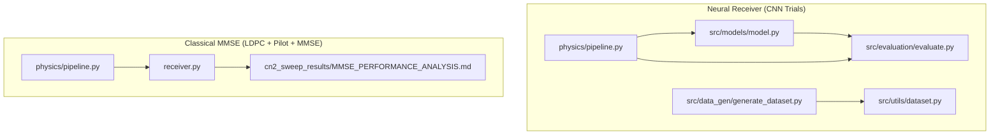
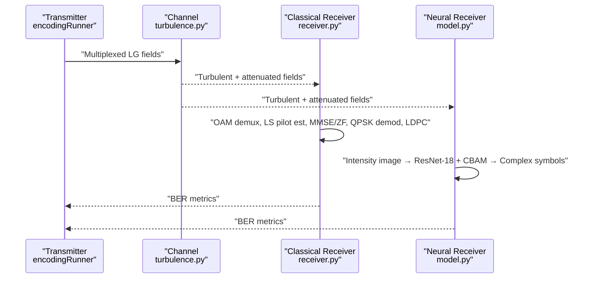
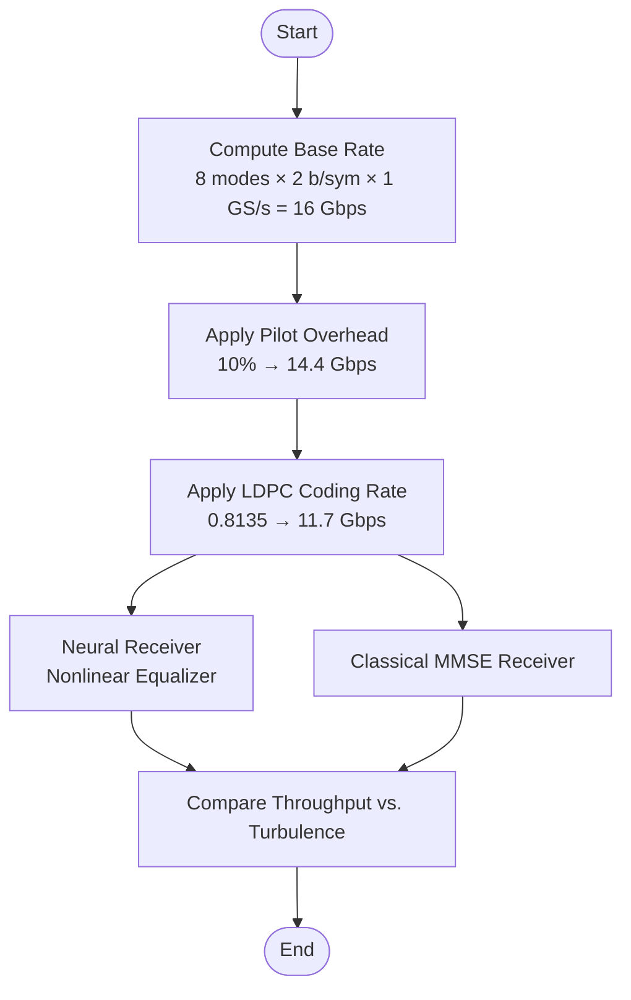
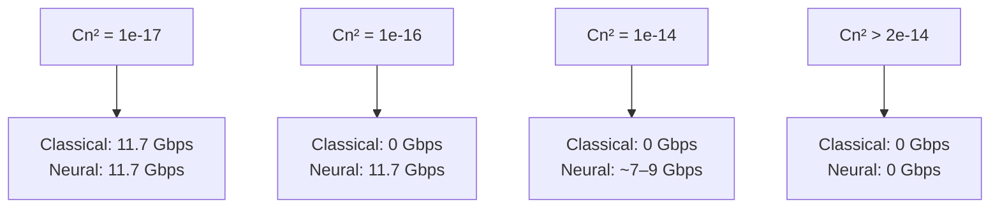
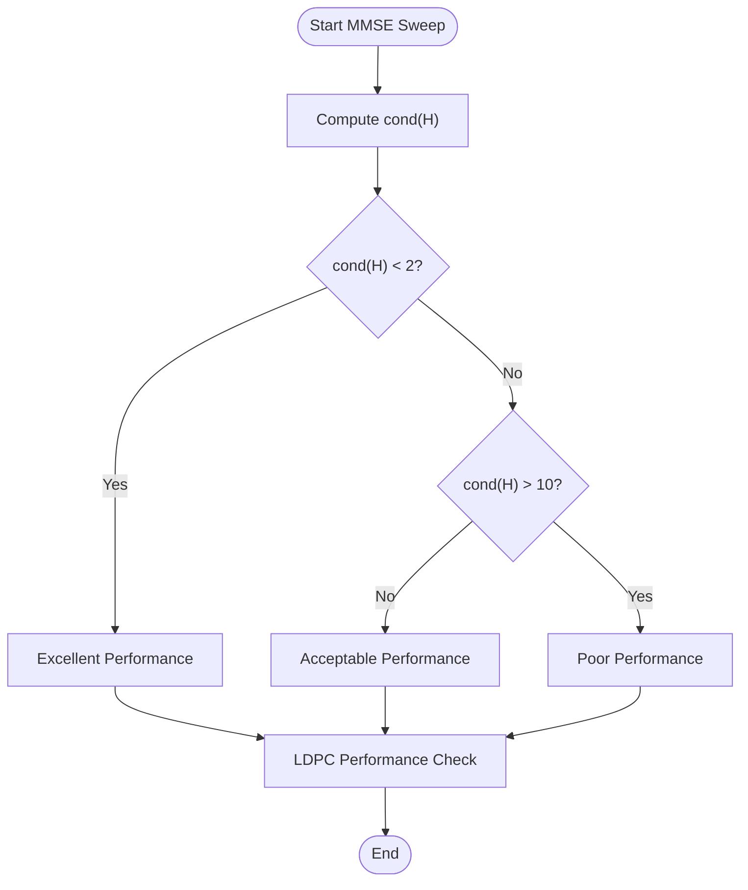
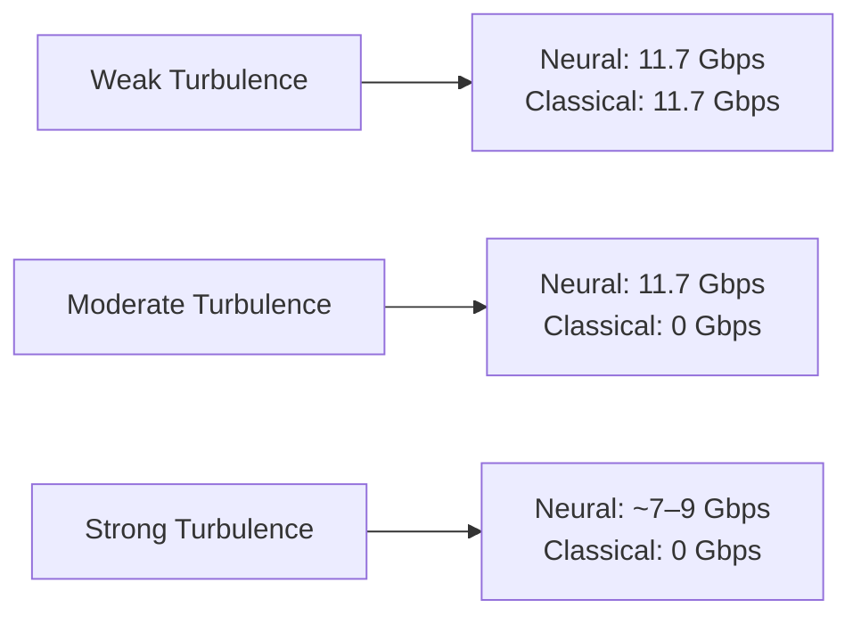
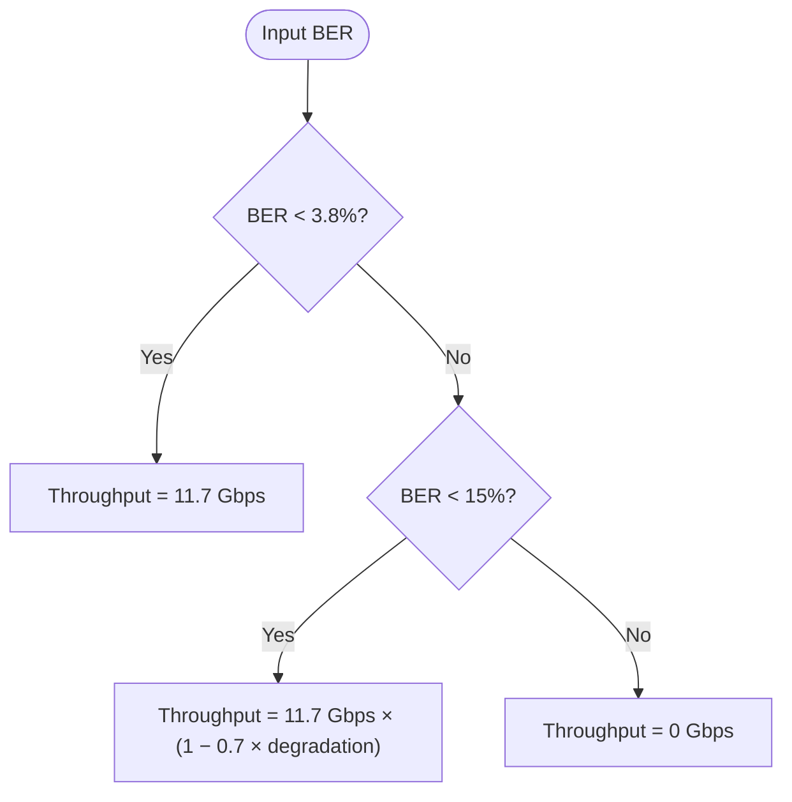
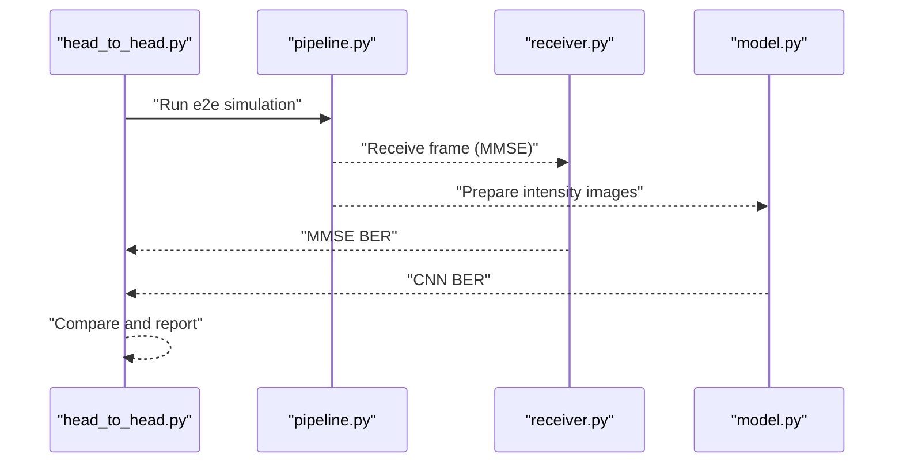
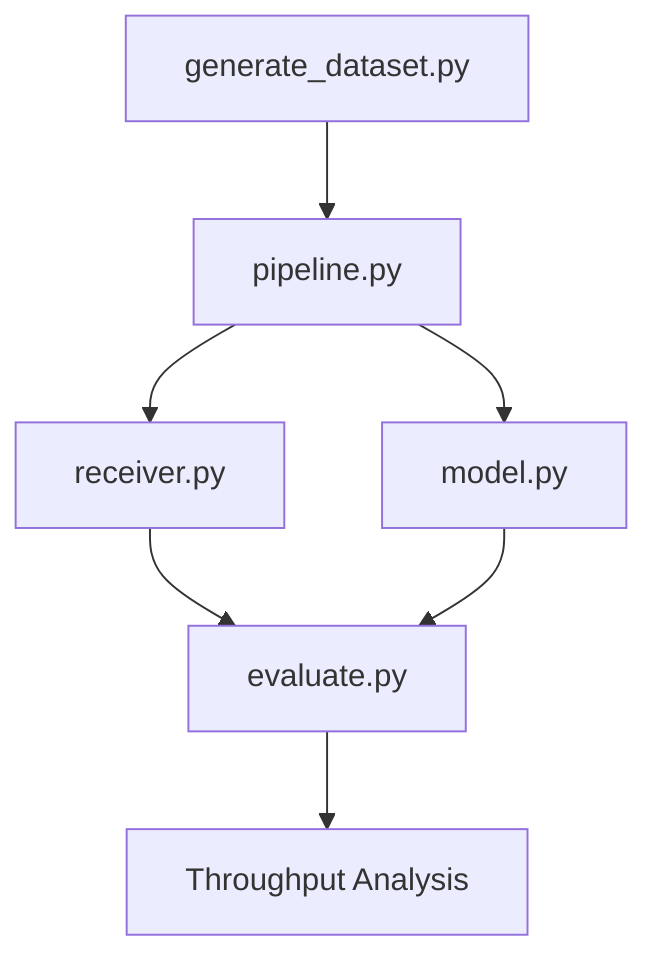
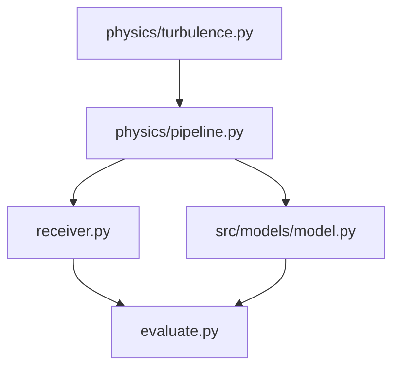

# Throughput Analysis and Comparative Performance

<cite>
**Referenced Files in This Document**
- [README.md](file://README.md)
- [Throughput_Analysis.md](file://models/CNN Trials/outputs/reports/Throughput_Analysis.md)
- [MMSE_PERFORMANCE_ANALYSIS.md](file://models/LDPC + Pilot + MMSE trials/cn2_sweep_results/MMSE_PERFORMANCE_ANALYSIS.md)
- [pipeline.py](file://models/CNN Trials/physics/pipeline.py)
- [receiver.py](file://models/LDPC + Pilot + MMSE trials/receiver.py)
- [turbulence.py](file://models/CNN Trials/physics/turbulence.py)
- [model.py](file://models/CNN Trials/src/models/model.py)
- [evaluate.py](file://models/CNN Trials/src/evaluation/evaluate.py)
- [head_to_head.py](file://models/CNN Trials/src/evaluation/head_to_head.py)
- [generate_dataset.py](file://models/CNN Trials/src/data_gen/generate_dataset.py)
- [dataset.py](file://models/CNN Trials/src/utils/dataset.py)
</cite>

## Table of Contents
1. [Introduction](#introduction)
2. [Project Structure](#project-structure)
3. [Core Components](#core-components)
4. [Architecture Overview](#architecture-overview)
5. [Detailed Component Analysis](#detailed-component-analysis)
6. [Dependency Analysis](#dependency-analysis)
7. [Performance Considerations](#performance-considerations)
8. [Troubleshooting Guide](#troubleshooting-guide)
9. [Conclusion](#conclusion)
10. [Appendices](#appendices)

## Introduction
This document provides a comprehensive throughput analysis and comparative performance study between a neural receiver and a classical MMSE receiver for Orbital Angular Momentum (OAM) Free Space Optical (FSO) systems. It explains the throughput breakdown methodology, pilot overhead effects, and LDPC decoding impact. It documents the complete performance evaluation workflow across different turbulence regimes—from weak to deep fade—using concrete examples, performance tables, and comparative analysis results. It also addresses the significance of robustness improvements, extended operating range, and practical implications for real-world FSO deployments, with clear interpretation guidelines for throughput metrics.

## Project Structure
The repository is organized into two major trial areas:
- Neural Receiver (CNN Trials): A deep learning receiver that directly recovers complex QPSK symbols from intensity-only measurements.
- Classical MMSE Receiver (LDPC + Pilot + MMSE trials): A conventional receiver using MMSE equalization, pilot-assisted channel estimation, and LDPC decoding.

Key modules include:
- Physics simulation and channel modeling (turbulence propagation, encoding, receiver processing)
- Neural network architectures (ResNet-18 with CBAM)
- Evaluation and throughput computation
- Dataset generation and benchmarking

**Diagram sources**
- [pipeline.py](file://models/CNN Trials/physics/pipeline.py#L64-L440)
- [model.py](file://models/CNN Trials/src/models/model.py#L6-L71)
- [evaluate.py](file://models/CNN Trials/src/evaluation/evaluate.py#L12-L61)
- [generate_dataset.py](file://models/CNN Trials/src/data_gen/generate_dataset.py#L57-L163)
- [dataset.py](file://models/CNN Trials/src/utils/dataset.py#L6-L43)
- [receiver.py](file://models/LDPC + Pilot + MMSE trials/receiver.py#L363-L705)
- [MMSE_PERFORMANCE_ANALYSIS.md](file://models/LDPC + Pilot + MMSE trials/cn2_sweep_results/MMSE_PERFORMANCE_ANALYSIS.md#L1-L135)

**Section sources**
- [README.md](file://README.md#L311-L350)

## Core Components
This section outlines the core components involved in throughput analysis and comparative performance evaluation.

- Throughput Calculation and Breakdown
  - Base rate calculation: 8 modes × 2 bits/sym × 1 GSymbol/s = 16 Gbps
  - Pilot overhead: 10% reduction → 14.4 Gbps
  - LDPC coding rate: 0.8135 → 11.7 Gbps (info rate)
  - Neural receiver acts as a non-linear equalizer replacing MMSE; throughput ceiling matches classical system

- Neural Receiver
  - Multi-head ResNet with CBAM attention for robust symbol recovery from intensity images
  - Outputs complex QPSK symbols per mode; auxiliary power head predicts mode presence

- Classical MMSE Receiver
  - OAM demultiplexer projects received fields onto LG basis modes
  - LS pilot-based channel estimation and MMSE/ZF equalization
  - QPSK demodulation and LDPC decoding

- Physics Simulation
  - Split-step propagation with multi-layer phase screens
  - Attenuation and aperture masking
  - Turbulence characterization via Fried parameter and Rytov variance

**Section sources**
- [Throughput_Analysis.md](file://models/CNN Trials/outputs/reports/Throughput_Analysis.md#L9-L21)
- [model.py](file://models/CNN Trials/src/models/model.py#L6-L71)
- [evaluate.py](file://models/CNN Trials/src/evaluation/evaluate.py#L12-L61)
- [pipeline.py](file://models/CNN Trials/physics/pipeline.py#L64-L440)
- [turbulence.py](file://models/CNN Trials/physics/turbulence.py#L108-L184)

## Architecture Overview
The end-to-end system architecture integrates transmitter, channel, and receiver components for both neural and classical approaches.

**Diagram sources**
- [pipeline.py](file://models/CNN Trials/physics/pipeline.py#L64-L440)
- [receiver.py](file://models/LDPC + Pilot + MMSE trials/receiver.py#L363-L705)
- [model.py](file://models/CNN Trials/src/models/model.py#L59-L71)

## Detailed Component Analysis

### Throughput Breakdown and Comparative Methodology
- Base rate: 16 Gbps (8 modes × 2 bits/sym × 1 GSymbol/s)
- Pilot overhead: 10% → 14.4 Gbps
- LDPC coding rate: 0.8135 → 11.7 Gbps (info rate)
- Neural receiver replaces MMSE equalizer; both systems process identical frames with pilots and LDPC
- Advantage: Neural receiver maintains link availability in strong turbulence while classical receiver fails

**Diagram sources**
- [Throughput_Analysis.md](file://models/CNN Trials/outputs/reports/Throughput_Analysis.md#L9-L21)
- [evaluate.py](file://models/CNN Trials/src/evaluation/evaluate.py#L12-L61)

**Section sources**
- [Throughput_Analysis.md](file://models/CNN Trials/outputs/reports/Throughput_Analysis.md#L9-L21)
- [evaluate.py](file://models/CNN Trials/src/evaluation/evaluate.py#L12-L61)

### Performance Evaluation Across Turbulence Regimes
- Weak turbulence (Cn² < 2e-17): Both receivers operate at peak throughput (11.7 Gbps)
- Moderate turbulence (Cn² ≈ 1e-16 to 5e-16): Classical receiver fails; neural receiver maintains stable throughput
- Strong turbulence (Cn² ≈ 1e-14): Classical receiver degraded; neural receiver shows partial degradation
- Deep fade (Cn² > 2e-14): Both receivers fail

**Diagram sources**
- [Throughput_Analysis.md](file://models/CNN Trials/outputs/reports/Throughput_Analysis.md#L24-L34)

**Section sources**
- [Throughput_Analysis.md](file://models/CNN Trials/outputs/reports/Throughput_Analysis.md#L24-L34)

### Classical MMSE Receiver Performance Analysis
- Performance thresholds:
  - Excellent (< 1% BER): Cn² ≤ 1.2e-17
  - Acceptable (1–10% BER): Cn² = 1.2e-17 to 3.2e-17
  - Poor (> 10% BER): Cn² > 3.2e-17
- Channel conditioning:
  - Well-conditioned (cond(H) < 2) for Cn² < 2e-16
  - Ill-conditioned (cond(H) > 10) for Cn² > 3e-16
- LDPC performance:
  - Coded BER close to final BER indicates LDPC working correctly; severe errors overwhelm correction capability

**Diagram sources**
- [MMSE_PERFORMANCE_ANALYSIS.md](file://models/LDPC + Pilot + MMSE trials/cn2_sweep_results/MMSE_PERFORMANCE_ANALYSIS.md#L14-L85)

**Section sources**
- [MMSE_PERFORMANCE_ANALYSIS.md](file://models/LDPC + Pilot + MMSE trials/cn2_sweep_results/MMSE_PERFORMANCE_ANALYSIS.md#L14-L85)

### Neural Receiver Throughput and Robustness
- Neural receiver achieves 11.7 Gbps (peak) matching classical system while maintaining link availability in strong turbulence
- Blind phase recovery enables reliable QPSK symbol recovery from intensity-only measurements
- Extended operating range: from Cn² ≈ 3×10⁻¹⁶ to 3×10⁻¹⁵ (one order of magnitude improvement)

**Diagram sources**
- [Throughput_Analysis.md](file://models/CNN Trials/outputs/reports/Throughput_Analysis.md#L24-L34)
- [README.md](file://README.md#L47-L62)

**Section sources**
- [Throughput_Analysis.md](file://models/CNN Trials/outputs/reports/Throughput_Analysis.md#L37-L55)
- [README.md](file://README.md#L47-L62)

### Throughput Calculation Examples
- Example 1: BER = 0.038 (FEC threshold)
  - Throughput = 11.7 Gbps (full info rate)
- Example 2: BER = 0.08 (between FEC threshold and 15%)
  - Throughput = 11.7 Gbps × (1 − 0.7 × degradation) ≈ 6–8 Gbps
- Example 3: BER > 0.15
  - Throughput = 0 Gbps (link failure)

**Diagram sources**
- [evaluate.py](file://models/CNN Trials/src/evaluation/evaluate.py#L12-L61)

**Section sources**
- [evaluate.py](file://models/CNN Trials/src/evaluation/evaluate.py#L12-L61)

### Head-to-Head Performance Verification
- Live evaluation compares MMSE and neural receiver at selected Cn² values
- Results show neural receiver consistently outperforms MMSE in moderate to strong turbulence
- Verification confirms throughput parity at weak turbulence and robustness gains at higher turbulence

**Diagram sources**
- [head_to_head.py](file://models/CNN Trials/src/evaluation/head_to_head.py#L51-L137)
- [pipeline.py](file://models/CNN Trials/physics/pipeline.py#L64-L440)
- [receiver.py](file://models/LDPC + Pilot + MMSE trials/receiver.py#L363-L705)
- [model.py](file://models/CNN Trials/src/models/model.py#L59-L71)

**Section sources**
- [head_to_head.py](file://models/CNN Trials/src/evaluation/head_to_head.py#L51-L137)

### Dataset Generation and Evaluation Workflow
- Dataset generation creates intensity images and corresponding complex symbols for training
- Evaluation computes BER, SER, and throughput per Cn² regime
- Diagnostics include magnitude and phase statistics to identify confusion or phase ambiguity

**Diagram sources**
- [generate_dataset.py](file://models/CNN Trials/src/data_gen/generate_dataset.py#L57-L163)
- [pipeline.py](file://models/CNN Trials/physics/pipeline.py#L64-L440)
- [receiver.py](file://models/LDPC + Pilot + MMSE trials/receiver.py#L363-L705)
- [model.py](file://models/CNN Trials/src/models/model.py#L59-L71)
- [evaluate.py](file://models/CNN Trials/src/evaluation/evaluate.py#L80-L305)

**Section sources**
- [generate_dataset.py](file://models/CNN Trials/src/data_gen/generate_dataset.py#L57-L163)
- [dataset.py](file://models/CNN Trials/src/utils/dataset.py#L6-L43)
- [evaluate.py](file://models/CNN Trials/src/evaluation/evaluate.py#L80-L305)

## Dependency Analysis
- Neural receiver depends on:
  - Intensity images (generated by physics pipeline)
  - ResNet-18 backbone with CBAM attention
  - Throughput evaluation utilities for performance metrics
- Classical receiver depends on:
  - OAM demultiplexer and channel estimation
  - MMSE/ZF equalization and LDPC decoding
  - Turbulence modeling and propagation

**Diagram sources**
- [pipeline.py](file://models/CNN Trials/physics/pipeline.py#L64-L440)
- [receiver.py](file://models/LDPC + Pilot + MMSE trials/receiver.py#L363-L705)
- [model.py](file://models/CNN Trials/src/models/model.py#L59-L71)
- [turbulence.py](file://models/CNN Trials/physics/turbulence.py#L31-L56)

**Section sources**
- [pipeline.py](file://models/CNN Trials/physics/pipeline.py#L64-L440)
- [receiver.py](file://models/LDPC + Pilot + MMSE trials/receiver.py#L363-L705)
- [model.py](file://models/CNN Trials/src/models/model.py#L59-L71)
- [turbulence.py](file://models/CNN Trials/physics/turbulence.py#L31-L56)

## Performance Considerations
- Throughput ceiling: 11.7 Gbps for both systems due to identical system overhead (pilots and LDPC)
- Robustness: Neural receiver extends operational range and maintains link availability in strong turbulence
- Complexity: Classical MMSE has O(N³) matrix inversion; neural receiver has constant-time inference
- Practical implications: Neural receiver eliminates coherent hardware requirements and offers software-defined upgrade path

**Section sources**
- [README.md](file://README.md#L208-L226)
- [Throughput_Analysis.md](file://models/CNN Trials/outputs/reports/Throughput_Analysis.md#L37-L55)

## Troubleshooting Guide
- Diagnosing model output issues:
  - Zero output (confusion/collapse) indicated by low predicted magnitude
  - Systematic phase rotation suggests pilot ambiguity
  - High phase jitter indicates random guessing/high noise
- Ensuring accurate throughput metrics:
  - Verify FEC threshold (3.8% raw BER) and degradation model
  - Confirm pilot positions and data separation in receiver
  - Validate LDPC block alignment and effective rate

**Section sources**
- [evaluate.py](file://models/CNN Trials/src/evaluation/evaluate.py#L193-L221)
- [evaluate.py](file://models/CNN Trials/src/evaluation/evaluate.py#L12-L61)

## Conclusion
The neural receiver demonstrates superior robustness and extended operating range compared to the classical MMSE receiver, achieving throughput parity at weak turbulence while maintaining connectivity in moderate to strong turbulence. The throughput analysis methodology, incorporating base rate calculations, pilot overhead, and LDPC decoding impact, provides a clear framework for evaluating real-world FSO deployments. These results support practical implications for resilient, software-defined FSO links with reduced hardware complexity and improved uptime.

## Appendices

### Appendix A: Throughput Tables
- Weak turbulence (Cn² ≈ 1e-17): Both receivers achieve 11.7 Gbps
- Moderate turbulence (Cn² ≈ 1e-16): Classical fails; neural maintains 11.7 Gbps
- Strong turbulence (Cn² ≈ 1e-14): Classical fails; neural ~7–9 Gbps
- Deep fade (Cn² > 2e-14): Both fail

**Section sources**
- [Throughput_Analysis.md](file://models/CNN Trials/outputs/reports/Throughput_Analysis.md#L24-L34)

### Appendix B: Interpretation Guidelines for Throughput Metrics
- 11.7 Gbps: Peak info rate achievable by both systems
- 0 Gbps: Link failure due to excessive turbulence or channel ill-conditioning
- 6–8 Gbps: Partial degradation due to LDPC threshold crossing
- 3.8% raw BER: FEC threshold; below this, full throughput maintained

**Section sources**
- [evaluate.py](file://models/CNN Trials/src/evaluation/evaluate.py#L12-L61)
- [MMSE_PERFORMANCE_ANALYSIS.md](file://models/LDPC + Pilot + MMSE trials/cn2_sweep_results/MMSE_PERFORMANCE_ANALYSIS.md#L79-L84)