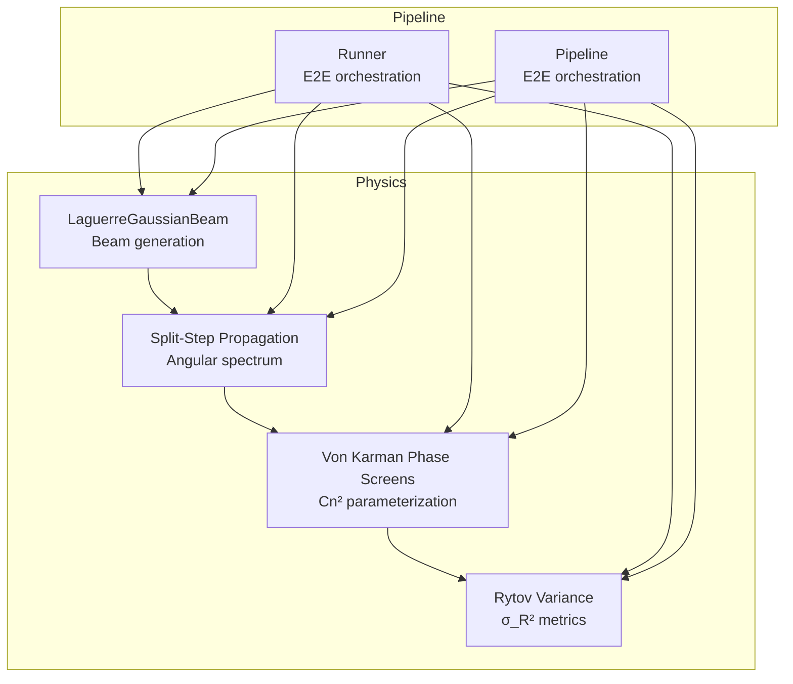
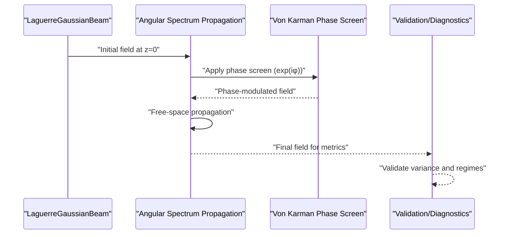
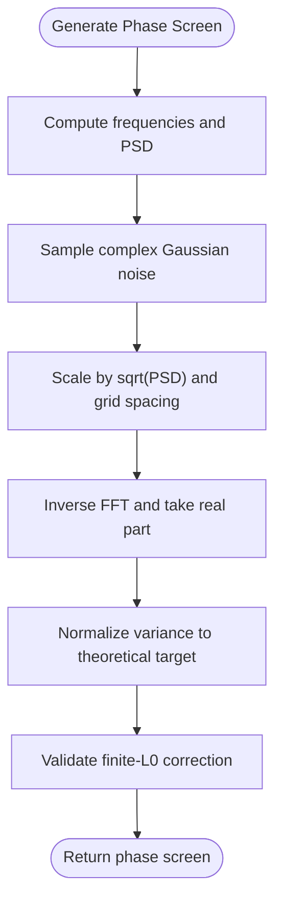
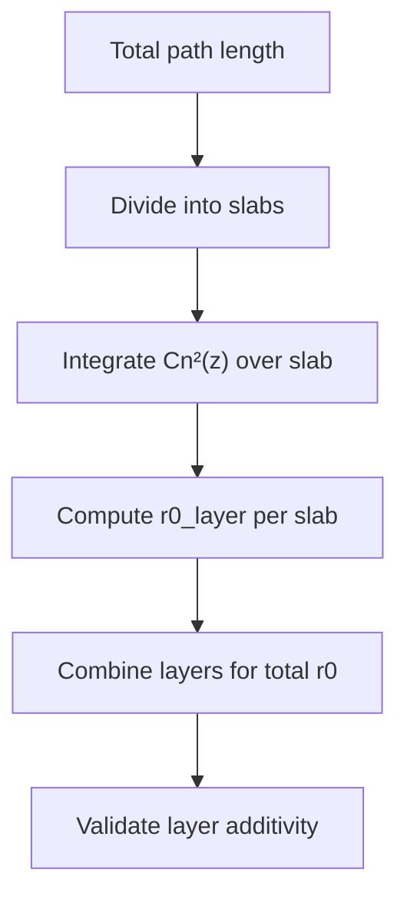
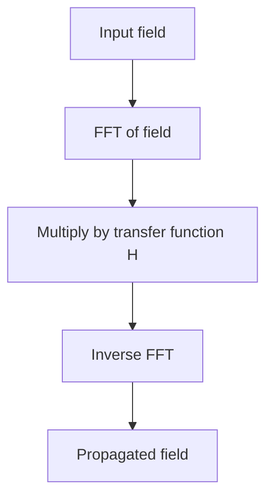
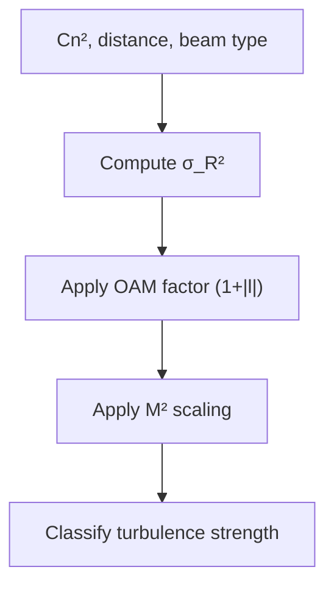
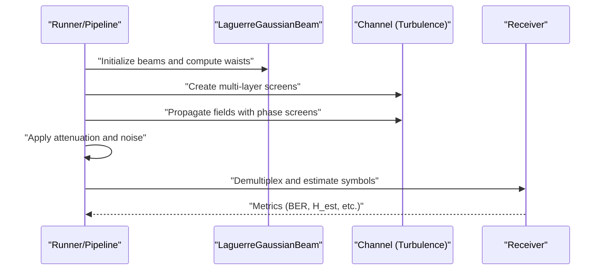
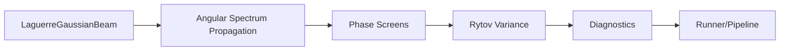

# Atmospheric Turbulence Modeling

<cite>
**Referenced Files in This Document**
- [turbulence.py](file://models/CNN Trials/physics/turbulence.py)
- [turbulence.py](file://models/LDPC + Pilot + MMSE trials/turbulence.py)
- [pipeline.py](file://models/CNN Trials/physics/pipeline.py)
- [pipeline.py](file://models/LDPC + Pilot + MMSE trials/pipeline.py)
- [runner.py](file://models/CNN Trials/physics/runner.py)
- [runner.py](file://models/LDPC + Pilot + MMSE trials/runner.py)
- [lgBeam.py](file://models/CNN Trials/physics/lgBeam.py)
- [lgBeam.py](file://models/LDPC + Pilot + MMSE trials/lgBeam.py)
</cite>

## Table of Contents
1. [Introduction](#introduction)
2. [Project Structure](#project-structure)
3. [Core Components](#core-components)
4. [Architecture Overview](#architecture-overview)
5. [Detailed Component Analysis](#detailed-component-analysis)
6. [Dependency Analysis](#dependency-analysis)
7. [Performance Considerations](#performance-considerations)
8. [Troubleshooting Guide](#troubleshooting-guide)
9. [Conclusion](#conclusion)

## Introduction
This document explains the atmospheric turbulence simulation system used in the FSO-OAM project. It covers the von Karman spectrum model, structure constant (Cn²) parameterization, multi-layer phase screen generation, Fresnel diffraction propagation, turbulence correlation functions, and temporal evolution modeling. It also provides practical guidance for setting up turbulence profiles, configuring turbulence strength parameters, generating realistic phase screens, validating against theoretical statistics, and understanding the relationship between turbulence parameters and system performance degradation.

## Project Structure
The turbulence simulation is implemented primarily in two physics modules and integrated into end-to-end simulation pipelines:
- Physics engine: Split-step propagation with von Karman phase screens and Rytov variance computation
- Beam model: Laguerre-Gaussian beam generation with M² and Gouy phase
- Pipeline integration: End-to-end simulation orchestrating transmitter, channel, and receiver stages

**Diagram sources**
- [turbulence.py](file://models/CNN Trials/physics/turbulence.py#L31-L56)
- [turbulence.py](file://models/CNN Trials/physics/turbulence.py#L60-L104)
- [turbulence.py](file://models/CNN Trials/physics/turbulence.py#L108-L184)
- [lgBeam.py](file://models/CNN Trials/physics/lgBeam.py#L10-L176)
- [runner.py](file://models/CNN Trials/physics/runner.py#L128-L505)
- [pipeline.py](file://models/CNN Trials/physics/pipeline.py#L64-L439)

**Section sources**
- [turbulence.py](file://models/CNN Trials/physics/turbulence.py#L1-L718)
- [lgBeam.py](file://models/CNN Trials/physics/lgBeam.py#L1-L357)
- [runner.py](file://models/CNN Trials/physics/runner.py#L73-L505)
- [pipeline.py](file://models/CNN Trials/physics/pipeline.py#L37-L439)

## Core Components
- Angular spectrum propagation: Non-paraxial Fresnel diffraction operator with evanescent cutoff
- Von Karman phase spectrum: PSD with outer and inner scales, variance normalization, and finite-aperture corrections
- Multi-layer screens: Stratified turbulence layers with integrated Cn² profiles and Fried parameter computation
- Rytov variance: Weak turbulence variance with beam-type corrections and OAM/M² scaling
- Turbulence diagnostics: Phase screen variance validation and regime checks
- End-to-end integration: Grid sizing, power normalization, and receiver metrics

**Section sources**
- [turbulence.py](file://models/CNN Trials/physics/turbulence.py#L31-L104)
- [turbulence.py](file://models/CNN Trials/physics/turbulence.py#L108-L184)
- [turbulence.py](file://models/CNN Trials/physics/turbulence.py#L210-L257)
- [turbulence.py](file://models/CNN Trials/physics/turbulence.py#L356-L381)
- [turbulence.py](file://models/CNN Trials/physics/turbulence.py#L439-L517)

## Architecture Overview
The turbulence simulation integrates beam generation, propagation, and turbulence modeling into a cohesive pipeline. The beam model computes M² and Gouy phase, while the propagation engine performs angular spectrum transforms. Phase screens are generated per layer and applied cumulatively, with diagnostics and validation routines ensuring theoretical consistency.

**Diagram sources**
- [lgBeam.py](file://models/CNN Trials/physics/lgBeam.py#L81-L176)
- [turbulence.py](file://models/CNN Trials/physics/turbulence.py#L31-L56)
- [turbulence.py](file://models/CNN Trials/physics/turbulence.py#L60-L104)
- [turbulence.py](file://models/CNN Trials/physics/turbulence.py#L356-L381)

## Detailed Component Analysis

### Von Karman Spectrum Model and Phase Screens
The von Karman model defines the phase structure function spectrum with outer and inner scale cutoffs. The implementation generates phase screens by sampling the PSD, normalizing variance, and applying finite-aperture corrections.

Key aspects:
- PSD form with outer scale f₀ and inner scale frequency fm
- Variance normalization using Kolmogorov factor and finite-L₀ correction
- Grid resolution validation against inner scale to preserve high-frequency effects

**Diagram sources**
- [turbulence.py](file://models/CNN Trials/physics/turbulence.py#L60-L104)

**Section sources**
- [turbulence.py](file://models/CNN Trials/physics/turbulence.py#L60-L104)

### Structure Constant (Cn²) Parameterization and Multi-Layer Screens
The Cn² parameterization supports uniform and Hufnagel–Valley profiles. Multi-layer screens divide the path into slabs, integrate Cn² over each slab, and compute Fried parameter per layer.

Highlights:
- Cn² profiles: uniform and Hufnagel–Valley models
- Layer integration and Fried parameter computation
- Layer additivity validation for r₀ scaling

**Diagram sources**
- [turbulence.py](file://models/CNN Trials/physics/turbulence.py#L187-L206)
- [turbulence.py](file://models/CNN Trials/physics/turbulence.py#L210-L257)
- [turbulence.py](file://models/CNN Trials/physics/turbulence.py#L492-L501)

**Section sources**
- [turbulence.py](file://models/CNN Trials/physics/turbulence.py#L187-L257)
- [turbulence.py](file://models/CNN Trials/physics/turbulence.py#L492-L501)

### Fresnel Diffraction and Angular Spectrum Propagation
Angular spectrum propagation implements the non-paraxial Fresnel diffraction operator with evanescent wave suppression. It supports both thin-screen and multi-layer applications.

Processing:
- FFT of field, multiply by transfer function, inverse FFT
- Evanescent cutoff to maintain stability
- Split-step application across layers

**Diagram sources**
- [turbulence.py](file://models/CNN Trials/physics/turbulence.py#L31-L56)

**Section sources**
- [turbulence.py](file://models/CNN Trials/physics/turbulence.py#L31-L56)

### Rytov Variance and Turbulence Strength Metrics
Rytov variance quantifies weak turbulence strength and guides receiver design. The implementation includes beam-type corrections and OAM/M² scaling.

Features:
- Plane, spherical, and Gaussian beam reductions
- OAM factor (1 + |l|) and M² scaling
- Turbulence strength classification

**Diagram sources**
- [turbulence.py](file://models/CNN Trials/physics/turbulence.py#L147-L184)
- [turbulence.py](file://models/CNN Trials/physics/turbulence.py#L138-L146)

**Section sources**
- [turbulence.py](file://models/CNN Trials/physics/turbulence.py#L108-L184)
- [turbulence.py](file://models/CNN Trials/physics/turbulence.py#L138-L146)

### End-to-End Simulation Integration
The end-to-end pipelines orchestrate transmitter, channel (turbulence), and receiver stages. They compute grid sizes based on beam parameters, apply attenuation and noise, and collect performance metrics.

Key steps:
- Initialize LG beams and compute beam waists at receiver
- Generate multi-layer phase screens
- Propagate fields through channel with phase screens
- Apply geometric losses and atmospheric attenuation
- Add noise and collect metrics (BER, channel condition)

**Diagram sources**
- [runner.py](file://models/CNN Trials/physics/runner.py#L128-L505)
- [pipeline.py](file://models/CNN Trials/physics/pipeline.py#L64-L439)

**Section sources**
- [runner.py](file://models/CNN Trials/physics/runner.py#L128-L505)
- [pipeline.py](file://models/CNN Trials/physics/pipeline.py#L64-L439)

## Dependency Analysis
The turbulence simulation depends on:
- Beam model for initial field generation and beam parameters
- NumPy/SciPy for FFT, frequency grids, and numerical integration
- Matplotlib for diagnostics and visualization

**Diagram sources**
- [lgBeam.py](file://models/CNN Trials/physics/lgBeam.py#L10-L176)
- [turbulence.py](file://models/CNN Trials/physics/turbulence.py#L31-L104)
- [turbulence.py](file://models/CNN Trials/physics/turbulence.py#L108-L184)
- [turbulence.py](file://models/CNN Trials/physics/turbulence.py#L356-L381)
- [runner.py](file://models/CNN Trials/physics/runner.py#L128-L505)
- [pipeline.py](file://models/CNN Trials/physics/pipeline.py#L64-L439)

**Section sources**
- [lgBeam.py](file://models/CNN Trials/physics/lgBeam.py#L10-L176)
- [turbulence.py](file://models/CNN Trials/physics/turbulence.py#L31-L184)
- [runner.py](file://models/CNN Trials/physics/runner.py#L128-L505)
- [pipeline.py](file://models/CNN Trials/physics/pipeline.py#L64-L439)

## Performance Considerations
- Grid resolution: Ensure δ < l₀/2 to properly resolve inner scale effects; otherwise, increase N or reduce D
- Screen count: More layers improve statistical convergence for long paths
- Memory optimization: Use centered padding/cropping for resampling; avoid storing unnecessary intermediate fields
- Computational efficiency: Prefer FFT-based propagation; batch symbol propagation to reduce overhead
- Validation: Use variance diagnostics and layer additivity tests to confirm correctness

[No sources needed since this section provides general guidance]

## Troubleshooting Guide
Common issues and resolutions:
- Zero phase variance warning: Adjust N/δ or L₀/l₀ to improve PSD scaling
- Excessive spread leading to NaN fields: Reduce turbulence strength or increase oversampling
- Coarse inner scale resolution: Increase grid size or decrease aperture diameter
- Layer additivity errors: Verify integrated Cn² and Fried parameter computations

**Section sources**
- [turbulence.py](file://models/CNN Trials/physics/turbulence.py#L90-L102)
- [turbulence.py](file://models/CNN Trials/physics/turbulence.py#L266-L275)
- [turbulence.py](file://models/CNN Trials/physics/turbulence.py#L492-L501)

## Conclusion
The turbulence simulation system combines a von Karman phase spectrum with angular spectrum propagation to model realistic atmospheric turbulence effects on OAM beams. By integrating multi-layer screens, Rytov variance metrics, and validation routines, it enables accurate assessment of system performance degradation and supports robust receiver design. Proper configuration of Cn² profiles, grid resolution, and layer counts ensures reliable simulations and meaningful performance insights.