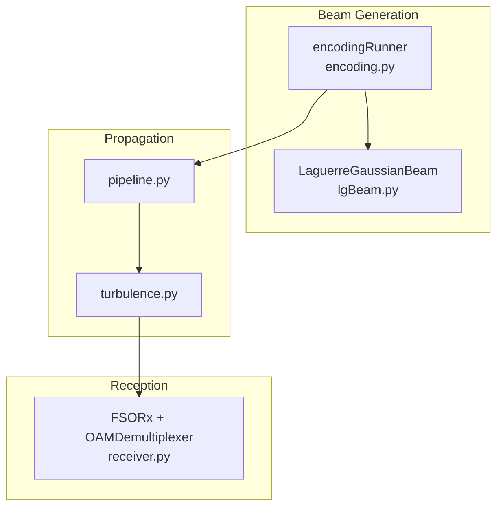
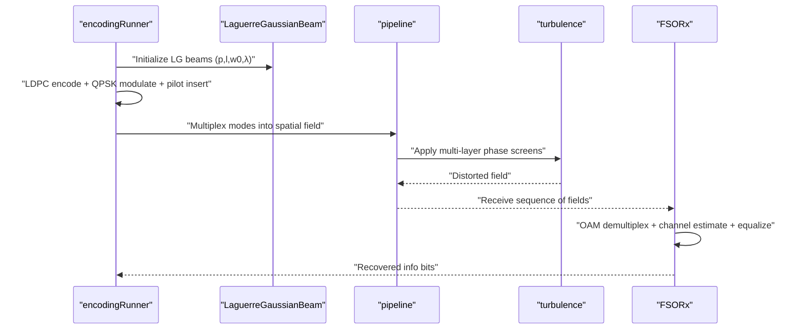
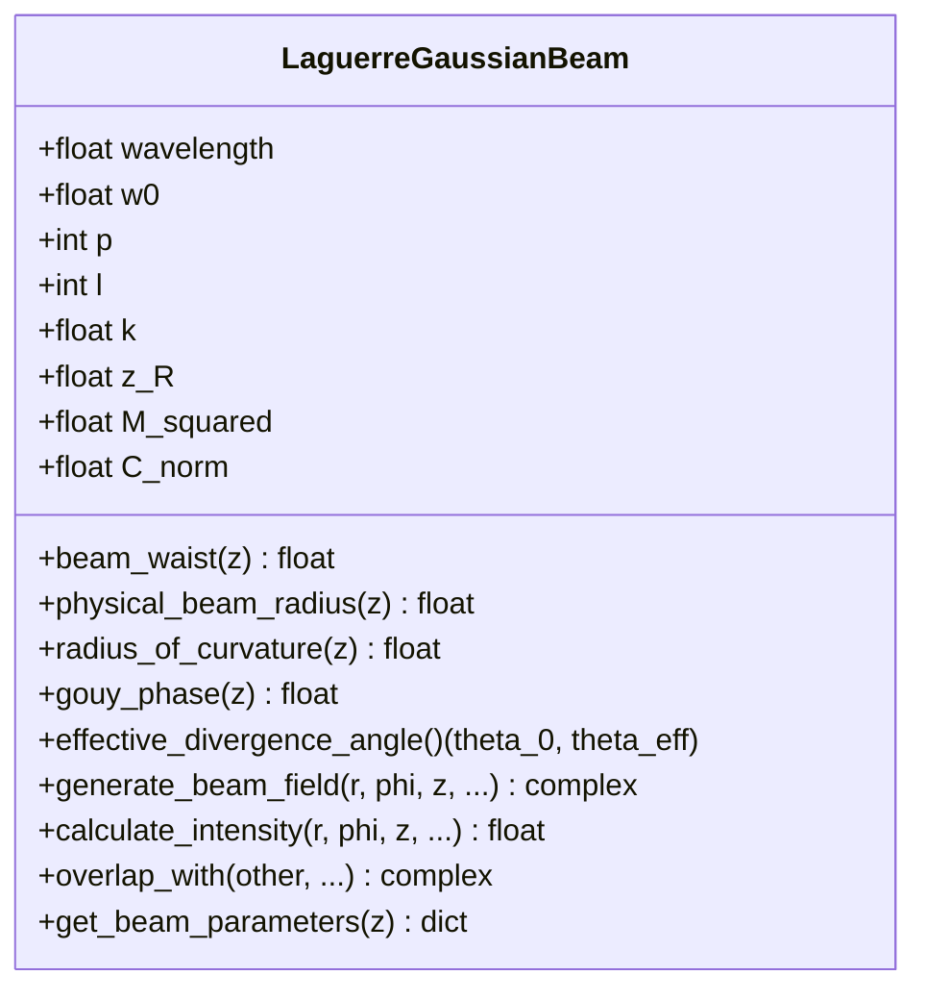
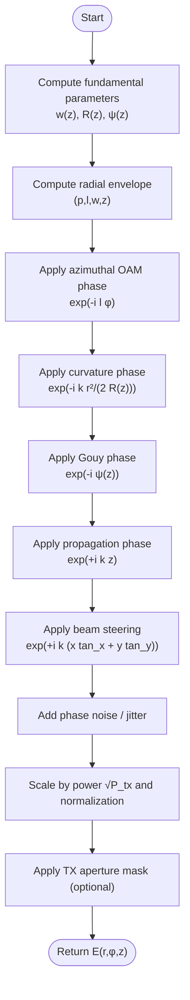
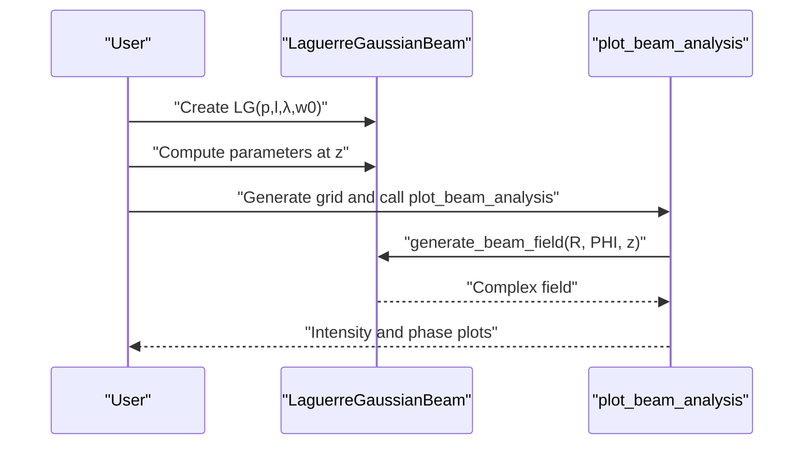
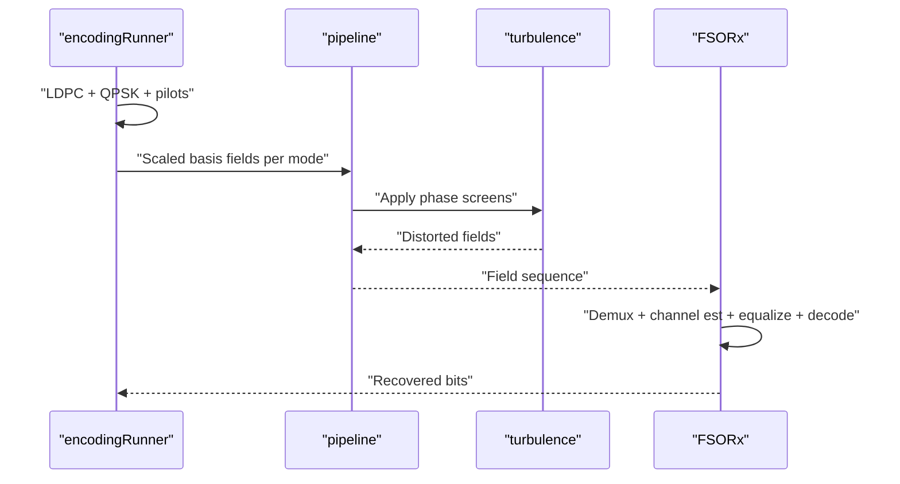
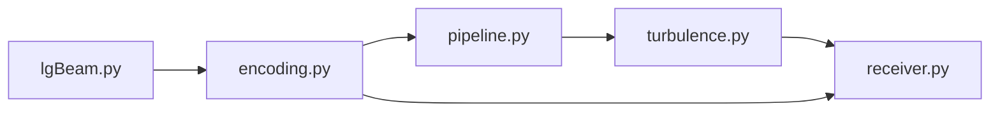

# Beam Generation and Propagation

<cite>
**Referenced Files in This Document**
- [README.md](file://README.md)
- [lgBeam.py](file://models/CNN Trials/physics/lgBeam.py)
- [lgBeam.py](file://models/LDPC + Pilot + MMSE trials/lgBeam.py)
- [encoding.py](file://models/CNN Trials/physics/encoding.py)
- [encoding.py](file://models/LDPC + Pilot + MMSE trials/encoding.py)
- [receiver.py](file://models/CNN Trials/physics/receiver.py)
- [turbulence.py](file://models/CNN Trials/physics/turbulence.py)
- [pipeline.py](file://models/CNN Trials/physics/pipeline.py)
- [Throughput_Analysis.md](file://models/CNN Trials/outputs/reports/Throughput_Analysis.md)
</cite>

## Table of Contents
1. [Introduction](#introduction)
2. [Project Structure](#project-structure)
3. [Core Components](#core-components)
4. [Architecture Overview](#architecture-overview)
5. [Detailed Component Analysis](#detailed-component-analysis)
6. [Dependency Analysis](#dependency-analysis)
7. [Performance Considerations](#performance-considerations)
8. [Troubleshooting Guide](#troubleshooting-guide)
9. [Conclusion](#conclusion)
10. [Appendices](#appendices)

## Introduction
This document explains the beam generation and propagation system used in Free Space Optical (FSO) Orbital Angular Momentum (OAM) communication. It covers the Laguerre-Gaussian (LG) beam mathematical foundation, including orbital angular momentum (OAM) modes and radial indices, beam waist and divergence calculations, Gouy phase effects, and the complex electric field generation algorithm. It also documents phase noise simulation, beam steering capabilities, practical examples for generating LG modes, visualization tools, beam quality factors (M²), physical versus fundamental beam sizes, aperture clipping effects, and guidance for selecting beam parameters for FSO-OAM applications.

## Project Structure
The beam generation system is implemented primarily in two modules:
- LaguerreGaussianBeam: Defines LG beam parameters, propagation, and field generation.
- encoding: Provides framing, pilot insertion, LDPC encoding, and multiplexing of multiple LG modes.
- receiver: Implements OAM demultiplexing, channel estimation, equalization, and decoding.
- turbulence: Implements atmospheric turbulence modeling and propagation.
- pipeline: End-to-end simulation orchestrating transmission, channel, and reception.

**Diagram sources**
- [lgBeam.py](file://models/CNN Trials/physics/lgBeam.py#L10-L176)
- [encoding.py](file://models/CNN Trials/physics/encoding.py#L544-L736)
- [turbulence.py](file://models/CNN Trials/physics/turbulence.py#L31-L56)
- [pipeline.py](file://models/CNN Trials/physics/pipeline.py#L64-L439)
- [receiver.py](file://models/CNN Trials/physics/receiver.py#L67-L224)

**Section sources**
- [README.md](file://README.md#L311-L350)

## Core Components
- LaguerreGaussianBeam: Implements LG beam parameters (p, l), beam waist, physical radius, radius of curvature, Gouy phase, divergence, normalization, and complex field generation with optional phase noise and beam steering.
- encodingRunner: Manages LDPC encoding, QPSK modulation, pilot insertion, and multiplexing of multiple LG modes into a single spatial field.
- FSORx and OAMDemultiplexer: Perform OAM demultiplexing, channel estimation, equalization, and decoding.
- AtmosphericTurbulence and turbulence propagation: Model atmospheric turbulence and apply phase screens to LG beams.
- Pipeline: End-to-end orchestration of transmission, channel propagation, and reception.

**Section sources**
- [lgBeam.py](file://models/CNN Trials/physics/lgBeam.py#L10-L176)
- [encoding.py](file://models/CNN Trials/physics/encoding.py#L544-L736)
- [receiver.py](file://models/CNN Trials/physics/receiver.py#L370-L712)
- [turbulence.py](file://models/CNN Trials/physics/turbulence.py#L108-L184)
- [pipeline.py](file://models/CNN Trials/physics/pipeline.py#L64-L439)

## Architecture Overview
The system generates LG modes, multiplexes them, propagates through turbulence, and recovers the transmitted symbols using OAM demultiplexing and equalization.

**Diagram sources**
- [encoding.py](file://models/CNN Trials/physics/encoding.py#L544-L736)
- [pipeline.py](file://models/CNN Trials/physics/pipeline.py#L64-L439)
- [turbulence.py](file://models/CNN Trials/physics/turbulence.py#L261-L352)
- [receiver.py](file://models/CNN Trials/physics/receiver.py#L370-L712)

## Detailed Component Analysis

### Laguerre-Gaussian Beam Mathematical Foundation
- LG modes are indexed by radial index p ≥ 0 and azimuthal index l (topological charge). The beam carries orbital angular momentum proportional to l.
- Beam quality factor M² scales the physical beam size relative to the fundamental Gaussian beam. For LG_{p,l}, M² = 2p + |l| + 1.
- Fundamental beam waist w(z) grows with distance z according to the Rayleigh range z_R = πw₀²/λ.
- Physical beam radius w_phys(z) = w(z)√M² approximates the region containing most energy (D4σ).
- Radius of curvature R(z) follows the Gaussian beam formula; Gouy phase accumulated is ψ(z) = M² arctan(z/z_R).
- Effective divergence θ_eff = θ_0 √M², where θ_0 = λ/(πw₀) is the fundamental divergence.

**Diagram sources**
- [lgBeam.py](file://models/CNN Trials/physics/lgBeam.py#L10-L176)

**Section sources**
- [lgBeam.py](file://models/CNN Trials/physics/lgBeam.py#L10-L176)

### Complex Electric Field Generation Algorithm
The complex electric field E(r,φ,z) is constructed as a product of:
- Normalization and amplitude scaling: C_norm and 1/w(z) with power scaling √P_tx.
- Radial envelope: [(√2 r / w(z))^|l|] · L_p^|l|(2r²/w(z)²) · exp(-r²/w(z)²).
- Azimuthal OAM phase: exp(-i l φ).
- Wavefront curvature: exp(-i k r²/(2 R(z))) with R(z) = z(1 + (z_R/z)²) for z ≠ 0.
- Gouy phase: exp(-i ψ(z)) with ψ(z) = M² arctan(z/z_R).
- Propagation phase: exp(+i k z).
- Optional beam steering: exp(+i k (x tan_x + y tan_y)).
- Optional phase noise: random walk or injected samples.
- Optional timing jitter: modeled as phase error.
- Optional aperture clipping: mask by tx_aperture_radius.

**Diagram sources**
- [lgBeam.py](file://models/CNN Trials/physics/lgBeam.py#L81-L176)

**Section sources**
- [lgBeam.py](file://models/CNN Trials/physics/lgBeam.py#L81-L176)

### Beam Steering Capabilities
Beam steering is implemented via a linear phase term k(x tan_x + y tan_y), allowing tilting the beam in the x and y directions. This is useful for pointing errors or misalignment compensation.

**Section sources**
- [lgBeam.py](file://models/CNN Trials/physics/lgBeam.py#L133-L137)

### Phase Noise Simulation
Two mechanisms are supported:
- Explicit phase noise samples: precomputed random walk phase sequence injected per symbol.
- On-the-fly phase noise: modeled as a Gaussian random walk with variance proportional to laser linewidth and symbol duration.
- Timing jitter: modeled as a Gaussian phase error proportional to carrier frequency and jitter duration.

These are applied only to data symbols (pilots are kept unaffected).

**Section sources**
- [lgBeam.py](file://models/CNN Trials/physics/lgBeam.py#L138-L157)
- [encoding.py](file://models/CNN Trials/physics/encoding.py#L636-L647)

### Practical Examples: Generating LG Modes and Visualizing Profiles
- Instantiate a beam: create a LaguerreGaussianBeam(p, l, λ, w₀).
- Compute beam parameters at distance z: use get_beam_parameters(z) to retrieve w(z), w_phys(z), R(z), ψ(z), and M².
- Generate transverse profile: build a grid in (x,y) or (r,φ), compute E(r,φ,z), and visualize intensity and phase.
- Compare modes: vary l to observe OAM arm count and radial structure.

**Diagram sources**
- [lgBeam.py](file://models/CNN Trials/physics/lgBeam.py#L276-L315)
- [lgBeam.py](file://models/CNN Trials/physics/lgBeam.py#L10-L176)

**Section sources**
- [lgBeam.py](file://models/CNN Trials/physics/lgBeam.py#L276-L315)

### Aperture Clipping Effects and Physical vs Fundamental Sizes
- Use physical_beam_radius(z) to size plots and estimate geometric loss.
- TX aperture clipping can be applied at generation time via tx_aperture_radius.
- RX aperture masking is applied during propagation and reception to simulate detector size.

**Section sources**
- [lgBeam.py](file://models/CNN Trials/physics/lgBeam.py#L43-L49)
- [lgBeam.py](file://models/CNN Trials/physics/lgBeam.py#L171-L175)
- [pipeline.py](file://models/CNN Trials/physics/pipeline.py#L242-L252)

### Beam Quality Factors (M²) and Selection Guidance for FSO-OAM
- M² increases with both radial index p and azimuthal charge l. Higher M² implies larger physical beam size and stronger divergence.
- For FSO-OAM, choose smaller |l| and modest p to fit within receiver apertures and minimize divergence.
- Consider atmospheric turbulence effects: σ_R² scales with M²^(7/6) and (1+|l|). Larger |l| and M² degrade performance in strong turbulence.

**Section sources**
- [lgBeam.py](file://models/CNN Trials/physics/lgBeam.py#L23-L25)
- [turbulence.py](file://models/CNN Trials/physics/turbulence.py#L147-L184)

### End-to-End Multiplexing and Transmission
- encodingRunner multiplexes multiple LG modes onto a shared spatial grid, normalizing total TX power across modes.
- pipeline creates phase screens, applies attenuation and noise, and propagates each symbol through the channel.
- receiver performs OAM demultiplexing, LS channel estimation, MMSE/ZF equalization, residual phase correction, and LDPC decoding.

**Diagram sources**
- [encoding.py](file://models/CNN Trials/physics/encoding.py#L599-L736)
- [pipeline.py](file://models/CNN Trials/physics/pipeline.py#L344-L416)
- [receiver.py](file://models/CNN Trials/physics/receiver.py#L397-L712)

**Section sources**
- [encoding.py](file://models/CNN Trials/physics/encoding.py#L599-L736)
- [pipeline.py](file://models/CNN Trials/physics/pipeline.py#L344-L416)
- [receiver.py](file://models/CNN Trials/physics/receiver.py#L397-L712)

## Dependency Analysis
The core dependencies among modules are:
- encoding depends on lgBeam for mode fields and on PyLDPC for FEC.
- pipeline orchestrates lgBeam, encoding, turbulence, and receiver.
- receiver depends on lgBeam for reference fields and on turbulence for propagation.
- turbulence depends on lgBeam for initial field generation.

**Diagram sources**
- [lgBeam.py](file://models/CNN Trials/physics/lgBeam.py#L10-L176)
- [encoding.py](file://models/CNN Trials/physics/encoding.py#L544-L736)
- [pipeline.py](file://models/CNN Trials/physics/pipeline.py#L64-L439)
- [receiver.py](file://models/CNN Trials/physics/receiver.py#L370-L712)
- [turbulence.py](file://models/CNN Trials/physics/turbulence.py#L31-L56)

**Section sources**
- [encoding.py](file://models/CNN Trials/physics/encoding.py#L19-L25)
- [pipeline.py](file://models/CNN Trials/physics/pipeline.py#L20-L32)
- [receiver.py](file://models/CNN Trials/physics/receiver.py#L22-L38)
- [turbulence.py](file://models/CNN Trials/physics/turbulence.py#L18-L22)

## Performance Considerations
- Grid sizing: Ensure the simulation grid captures the physical beam size at the receiver distance. Oversampling by 6× the beam waist is recommended.
- Inner scale resolution: Grid spacing should satisfy δ < l₀/2 to properly resolve inner-scale turbulence effects.
- Aperture efficiency: Receiver aperture fraction impacts collected power and SNR. Larger apertures improve performance but increase mechanical constraints.
- Turbulence layers: Use sufficient phase screens (≥20) for statistical convergence in multi-layer propagation.
- M² scaling: Higher-order modes suffer greater scintillation and divergence; balance mode count against receiver optics and turbulence severity.

[No sources needed since this section provides general guidance]

## Troubleshooting Guide
- Invalid LG parameters: p must be non-negative; otherwise, initialization raises an error.
- Scalar z requirement: generate_beam_field expects z to be a scalar; loop over planes externally.
- Broadcasting errors: r and φ must be broadcastable to the same shape.
- Near-field vs far-field: w_phys(z) grows slower near z_R and faster beyond z_R; verify z_R and physical size.
- Aperture clipping: If the beam is too large, reduce w₀ or |l|, or increase receiver aperture.
- Phase noise and jitter: Ensure symbol_time_s is set when modeling linewidth-limited phase noise.
- Power normalization: When multiplexing, ensure total TX power is distributed across modes using basis scaling.

**Section sources**
- [lgBeam.py](file://models/CNN Trials/physics/lgBeam.py#L11-L18)
- [lgBeam.py](file://models/CNN Trials/physics/lgBeam.py#L88-L98)
- [lgBeam.py](file://models/CNN Trials/physics/lgBeam.py#L144-L157)
- [pipeline.py](file://models/CNN Trials/physics/pipeline.py#L118-L136)

## Conclusion
The beam generation and propagation system provides a robust framework for FSO-OAM simulations. It accurately models LG beam parameters, propagation, turbulence, and receiver processing. By tuning beam parameters (w₀, p, l), aperture sizes, and equalization strategies, practitioners can optimize performance for real-world atmospheric conditions while maintaining reliable data transmission.

[No sources needed since this section summarizes without analyzing specific files]

## Appendices

### Appendix A: Mathematical Definitions and Parameters
- LG modes: (p, l), radial and azimuthal indices.
- Wavelength λ, beam waist w₀, Rayleigh range z_R = πw₀²/λ.
- Beam quality factor M² = 2p + |l| + 1.
- Fundamental waist w(z) = w₀√(1 + (z/z_R)²), physical radius w_phys(z) = w(z)√M².
- Radius of curvature R(z) = z(1 + (z_R/z)²) for z ≠ 0, Gouy phase ψ(z) = M² arctan(z/z_R).
- Effective divergence θ_eff = θ_0√M² with θ_0 = λ/(πw₀).

**Section sources**
- [lgBeam.py](file://models/CNN Trials/physics/lgBeam.py#L23-L79)

### Appendix B: Practical Parameter Selection for FSO-OAM
- Choose λ typical for FSO (e.g., 1550 nm).
- Select w₀ to balance divergence and aperture size; ensure w_phys(z) fits receiver aperture.
- Limit |l| to reduce M² and scintillation; moderate p for higher spectral efficiency.
- Account for atmospheric turbulence: use σ_R² scaling with M²^(7/6) and (1+|l|).
- Validate grid resolution: δ < l₀/2 and D ≥ 6w(L) for adequate capture.

**Section sources**
- [turbulence.py](file://models/CNN Trials/physics/turbulence.py#L279-L288)
- [turbulence.py](file://models/CNN Trials/physics/turbulence.py#L147-L184)
- [pipeline.py](file://models/CNN Trials/physics/pipeline.py#L118-L116)