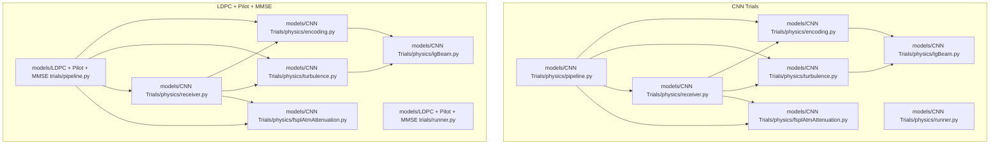
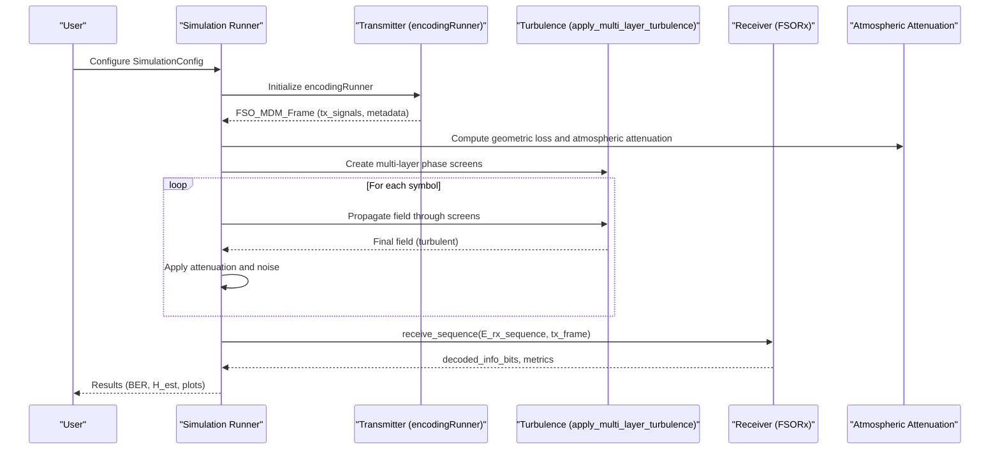
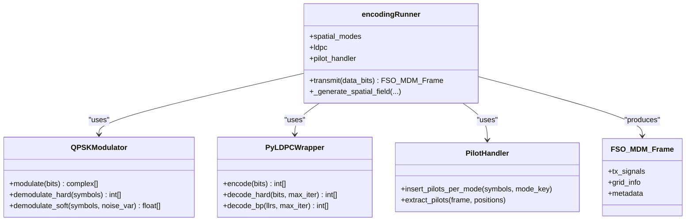
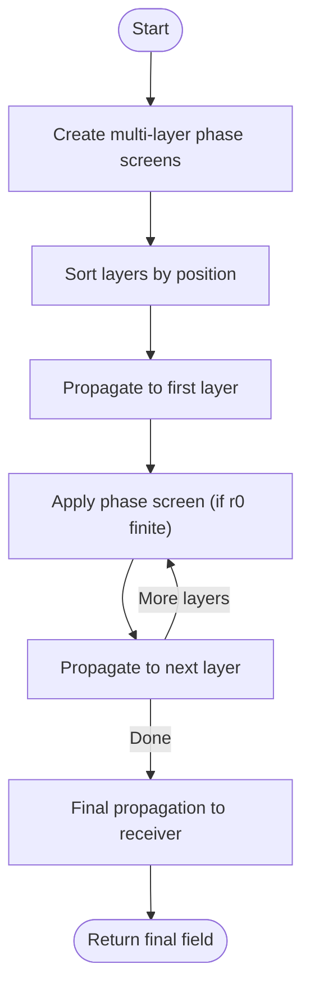
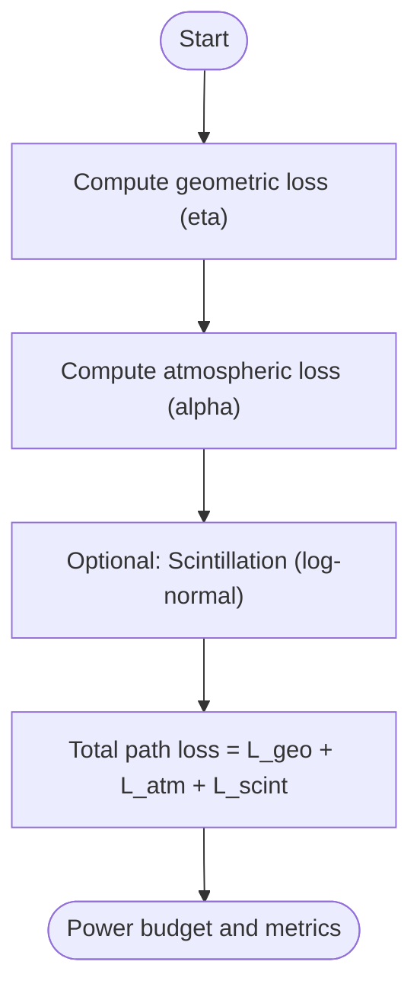
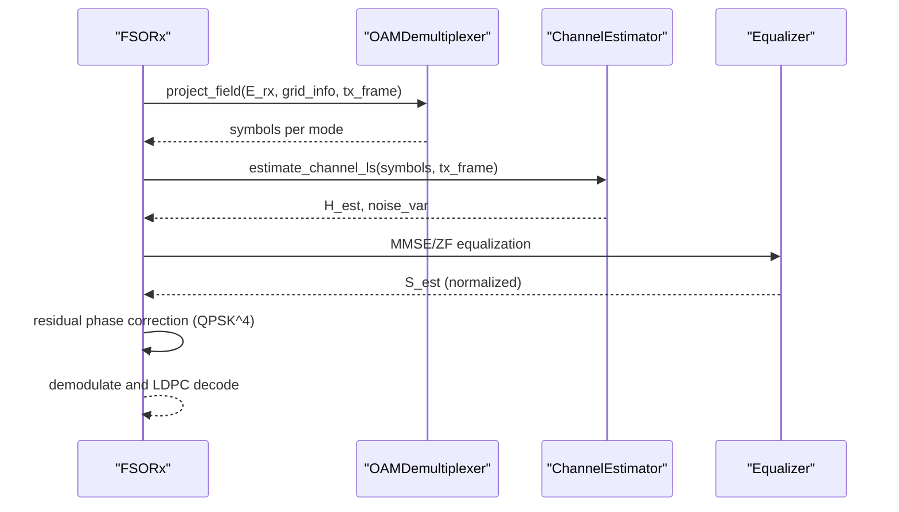
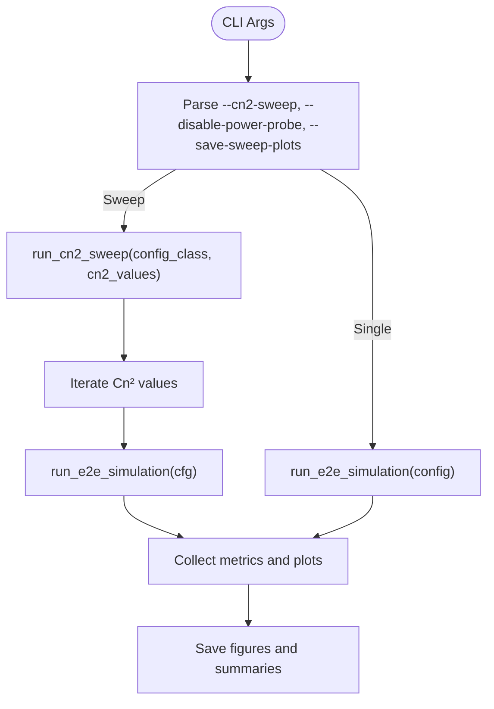
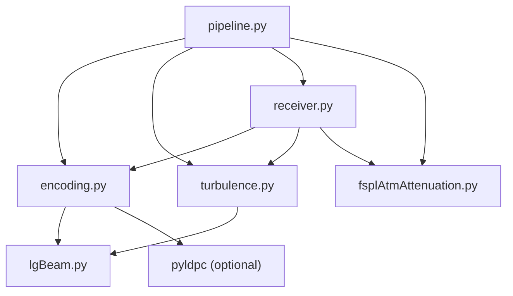

# End-to-End Simulation Pipeline

<cite>
**Referenced Files in This Document**
- [README.md](file://README.md)
- [pipeline.py](file://models/CNN Trials/physics/pipeline.py)
- [runner.py](file://models/CNN Trials/physics/runner.py)
- [turbulence.py](file://models/CNN Trials/physics/turbulence.py)
- [receiver.py](file://models/CNN Trials/physics/receiver.py)
- [encoding.py](file://models/CNN Trials/physics/encoding.py)
- [fsplAtmAttenuation.py](file://models/CNN Trials/physics/fsplAtmAttenuation.py)
- [lgBeam.py](file://models/CNN Trials/physics/lgBeam.py)
- [pipeline.py](file://models/LDPC + Pilot + MMSE trials/pipeline.py)
- [runner.py](file://models/LDPC + Pilot + MMSE trials/runner.py)
</cite>

## Table of Contents
1. [Introduction](#introduction)
2. [Project Structure](#project-structure)
3. [Core Components](#core-components)
4. [Architecture Overview](#architecture-overview)
5. [Detailed Component Analysis](#detailed-component-analysis)
6. [Dependency Analysis](#dependency-analysis)
7. [Performance Considerations](#performance-considerations)
8. [Troubleshooting Guide](#troubleshooting-guide)
9. [Conclusion](#conclusion)
10. [Appendices](#appendices)

## Introduction
This document describes the complete end-to-end simulation pipeline for Free Space Optics (FSO) communication using Orbital Angular Momentum (OAM) multiplexing. The pipeline integrates:
- Beam generation using Laguerre-Gaussian modes
- Turbulence simulation via split-step propagation
- Physical propagation modeling and atmospheric attenuation
- Receiver processing including demultiplexing, channel estimation, equalization, and LDPC decoding

It documents the simulation workflow, data flow between components, configuration management, and provides practical guidance for running simulations, validating results, optimizing parameters, and scaling to large datasets.

## Project Structure
The repository organizes the simulation into two complementary tracks:
- CNN Trials: Neural receiver pipeline with rectified end-to-end simulation and validation
- LDPC + Pilot + MMSE trials: Classical baseline using MMSE equalization with pilots

Both tracks share core modules for beam generation, turbulence, attenuation, and receiver processing.

**Diagram sources**
- [pipeline.py](file://models/CNN Trials/physics/pipeline.py#L64-L431)
- [runner.py](file://models/CNN Trials/physics/runner.py#L128-L505)
- [turbulence.py](file://models/CNN Trials/physics/turbulence.py#L261-L352)
- [receiver.py](file://models/CNN Trials/physics/receiver.py#L370-L751)
- [encoding.py](file://models/CNN Trials/physics/encoding.py#L544-L736)
- [fsplAtmAttenuation.py](file://models/CNN Trials/physics/fsplAtmAttenuation.py#L26-L179)
- [lgBeam.py](file://models/CNN Trials/physics/lgBeam.py#L10-L356)

**Section sources**
- [README.md](file://README.md#L311-L350)

## Core Components
- Transmitter: Encodes information bits into QPSK symbols, applies LDPC coding, inserts pilot sequences per mode, and generates spatially multiplexed LG fields.
- Turbulence Model: Implements multi-layer phase screens and split-step propagation using angular spectrum.
- Attenuation and Geometric Loss: Computes atmospheric attenuation using Kim model and geometric collection efficiency.
- Receiver: Performs OAM demultiplexing, LS channel estimation using pilots, MMSE/ZF equalization, residual phase correction, QPSK demodulation, and LDPC decoding.
- Simulation Orchestration: Provides configurable end-to-end runners and sweep utilities.

**Section sources**
- [encoding.py](file://models/CNN Trials/physics/encoding.py#L544-L736)
- [turbulence.py](file://models/CNN Trials/physics/turbulence.py#L261-L352)
- [fsplAtmAttenuation.py](file://models/CNN Trials/physics/fsplAtmAttenuation.py#L26-L179)
- [receiver.py](file://models/CNN Trials/physics/receiver.py#L370-L751)
- [pipeline.py](file://models/CNN Trials/physics/pipeline.py#L64-L431)

## Architecture Overview
The end-to-end pipeline orchestrates initialization, transmitter generation, channel modeling, propagation, receiver processing, and metrics computation.

**Diagram sources**
- [runner.py](file://models/CNN Trials/physics/runner.py#L128-L505)
- [pipeline.py](file://models/CNN Trials/physics/pipeline.py#L64-L431)
- [turbulence.py](file://models/CNN Trials/physics/turbulence.py#L261-L352)
- [receiver.py](file://models/CNN Trials/physics/receiver.py#L714-L751)
- [fsplAtmAttenuation.py](file://models/CNN Trials/physics/fsplAtmAttenuation.py#L26-L179)

## Detailed Component Analysis

### Transmitter: encodingRunner
Responsibilities:
- LDPC encoding and QPSK modulation
- Pilot insertion per spatial mode
- Spatial field generation using LG beams
- Frame packaging into FSO_MDM_Frame with metadata

Key behaviors:
- Distributes total transmit power across spatial modes
- Inserts preamble and comb pilots per mode
- Supports optional phase noise and timing jitter
- Generates 3D intensity fields for visualization

**Diagram sources**
- [encoding.py](file://models/CNN Trials/physics/encoding.py#L544-L736)

**Section sources**
- [encoding.py](file://models/CNN Trials/physics/encoding.py#L544-L736)

### Turbulence Simulation: Multi-Layer Split-Step Propagation
Responsibilities:
- Generate phase screens per layer using Von Kármán PSD
- Apply angular spectrum propagation between layers
- Aggregate phase screens and compute diagnostics

**Diagram sources**
- [turbulence.py](file://models/CNN Trials/physics/turbulence.py#L261-L352)

**Section sources**
- [turbulence.py](file://models/CNN Trials/physics/turbulence.py#L261-L352)

### Attenuation and Geometric Loss
Responsibilities:
- Compute atmospheric attenuation using Kim model
- Calculate geometric collection efficiency via numeric integration
- Provide path loss breakdown for sensitivity analysis

**Diagram sources**
- [fsplAtmAttenuation.py](file://models/CNN Trials/physics/fsplAtmAttenuation.py#L26-L179)

**Section sources**
- [fsplAtmAttenuation.py](file://models/CNN Trials/physics/fsplAtmAttenuation.py#L26-L179)

### Receiver: FSORx
Responsibilities:
- OAM demultiplexing via projection onto reference fields
- LS channel estimation using pilot positions
- MMSE/ZF equalization with automatic selection
- Blind residual phase correction for QPSK
- QPSK demodulation (hard/soft) and LDPC decoding

**Diagram sources**
- [receiver.py](file://models/CNN Trials/physics/receiver.py#L370-L751)

**Section sources**
- [receiver.py](file://models/CNN Trials/physics/receiver.py#L370-L751)

### Simulation Orchestration: Runners and Pipelines
Two entry points are provided:
- CNN Trials runner: includes message embedding and detailed diagnostics
- LDPC + Pilot + MMSE runner: classical baseline with MMSE equalization

Both support:
- Cn² sweeps
- Power probe diagnostics
- Plotting utilities

**Diagram sources**
- [runner.py](file://models/CNN Trials/physics/runner.py#L634-L678)
- [pipeline.py](file://models/CNN Trials/physics/pipeline.py#L625-L667)

**Section sources**
- [runner.py](file://models/CNN Trials/physics/runner.py#L634-L678)
- [pipeline.py](file://models/CNN Trials/physics/pipeline.py#L625-L667)

## Dependency Analysis
The pipeline exhibits tight coupling among modules:
- Transmitter depends on LG beam library and LDPC wrapper
- Turbulence depends on LG beam for field generation and angular spectrum propagation
- Receiver depends on transmitter metadata (grid_info, scaling factors) and turbulence module
- Attenuation is shared across both tracks

**Diagram sources**
- [encoding.py](file://models/CNN Trials/physics/encoding.py#L19-L46)
- [turbulence.py](file://models/CNN Trials/physics/turbulence.py#L18-L25)
- [receiver.py](file://models/CNN Trials/physics/receiver.py#L22-L38)
- [pipeline.py](file://models/CNN Trials/physics/pipeline.py#L19-L32)

**Section sources**
- [encoding.py](file://models/CNN Trials/physics/encoding.py#L19-L46)
- [turbulence.py](file://models/CNN Trials/physics/turbulence.py#L18-L25)
- [receiver.py](file://models/CNN Trials/physics/receiver.py#L22-L38)
- [pipeline.py](file://models/CNN Trials/physics/pipeline.py#L19-L32)

## Performance Considerations
- Grid sizing and oversampling: The grid spans 6× the beam waist at the link distance; oversampling controls inner scale resolution relative to l0.
- Computational complexity:
  - Split-step propagation scales with O(N² log N) per layer using FFT
  - Demultiplexing scales with O(M N²) per snapshot
  - Channel estimation and equalization depend on M (number of modes)
- Memory management:
  - Large N grids and long symbol sequences increase memory footprint
  - Consider chunking symbol sequences and clearing caches between runs
- Parallel execution:
  - Batch processing across Cn² values is supported via sweep utilities
  - For Monte Carlo studies, distribute independent runs across cores and GPUs
- Simulation fidelity vs. compute:
  - Higher N and more screens improve accuracy but increase runtime
  - Pilot density affects channel estimation accuracy and overhead
  - SNR and noise disabled toggles impact BER and throughput

[No sources needed since this section provides general guidance]

## Troubleshooting Guide
Common issues and resolutions:
- Grid resolution warning: If δ > l0/2, phase screen statistics may be inaccurate; increase N or reduce D.
- NaN or zero fields after propagation: Indicates excessive spreading; reduce symbol count or adjust power/beam parameters.
- Ill-conditioned channel matrix: Use MMSE equalization and ensure sufficient pilot density.
- Incorrect noise variance in receiver: Metadata-based noise variance is preferred; residual-based estimates can be biased.
- Aperture mismatch: Ensure receiver radius matches the intended aperture; mismatch leads to power loss and artifacts.
- LDPC mismatch: Ensure transmitter and receiver use the same LDPC parameters; otherwise decoding fails.

**Section sources**
- [turbulence.py](file://models/CNN Trials/physics/turbulence.py#L282-L288)
- [receiver.py](file://models/CNN Trials/physics/receiver.py#L319-L366)
- [fsplAtmAttenuation.py](file://models/CNN Trials/physics/fsplAtmAttenuation.py#L26-L45)

## Conclusion
The end-to-end pipeline provides a robust framework for simulating FSO-OAM systems under realistic atmospheric conditions. By integrating precise beam generation, validated turbulence modeling, accurate attenuation computations, and flexible receiver architectures, researchers can evaluate system performance, optimize parameters, and scale to large datasets. The modular design enables both neural and classical receiver pathways, supporting diverse research objectives.

[No sources needed since this section summarizes without analyzing specific files]

## Appendices

### Practical Examples

- Running a single simulation:
  - Use the runner entry point with desired configuration and optional SNR override.
  - Example invocation paths are documented in the repository’s usage guide.

- Performing a Cn² sweep:
  - Use the sweep utility to iterate over turbulence strengths and collect BER and condition number metrics.
  - Save per-point plots for diagnostics.

- Validating against theoretical expectations:
  - Compare BER curves with classical MMSE baselines.
  - Use the provided plotting utilities to visualize constellation recovery and channel matrices.

- Optimizing simulation parameters:
  - Increase N and number of screens for stronger turbulence regimes.
  - Adjust pilot ratio to balance estimation accuracy and overhead.
  - Tune receiver radius and TX power to maintain adequate SNR.

- Batch processing and parallel execution:
  - Distribute independent runs across CPUs/GPUs.
  - Use sweep utilities to process multiple Cn² values concurrently.

- Memory management tips:
  - Reduce N for exploratory runs; increase gradually for validation.
  - Limit symbol sequence length for long-horizon studies.
  - Clear caches and intermediate arrays after each run to reclaim memory.

**Section sources**
- [README.md](file://README.md#L229-L308)
- [runner.py](file://models/CNN Trials/physics/runner.py#L684-L739)
- [pipeline.py](file://models/CNN Trials/physics/pipeline.py#L673-L717)