# Physics Simulation Engine

<cite>
**Referenced Files in This Document**
- [lgBeam.py](file://models/CNN Trials/physics/lgBeam.py)
- [turbulence.py](file://models/CNN Trials/physics/turbulence.py)
- [fsplAtmAttenuation.py](file://models/CNN Trials/physics/fsplAtmAttenuation.py)
- [encoding.py](file://models/CNN Trials/physics/encoding.py)
- [pipeline.py](file://models/CNN Trials/physics/pipeline.py)
- [receiver.py](file://models/CNN Trials/physics/receiver.py)
- [runner.py](file://models/CNN Trials/physics/runner.py)
- [generate_dataset.py](file://models/CNN Trials/src/data_gen/generate_dataset.py)
- [dataset.py](file://models/CNN Trials/src/utils/dataset.py)
</cite>

## Table of Contents
1. [Introduction](#introduction)
2. [Project Structure](#project-structure)
3. [Core Components](#core-components)
4. [Architecture Overview](#architecture-overview)
5. [Detailed Component Analysis](#detailed-component-analysis)
6. [Dependency Analysis](#dependency-analysis)
7. [Performance Considerations](#performance-considerations)
8. [Troubleshooting Guide](#troubleshooting-guide)
9. [Conclusion](#conclusion)
10. [Appendices](#appendices)

## Introduction
This document provides comprehensive technical documentation for the physics simulation engine powering free-space optical (FSO) communication systems that leverage orbital angular momentum (OAM) multiplexing. The engine encompasses:
- Laguerre-Gaussian beam generation and propagation
- Atmospheric turbulence simulation using von Kármán spectrum models
- Geometric loss calculations
- Split-step Fourier propagation through multi-layer phase screens
- QPSK symbol encoding and pilot-based channel estimation
- End-to-end simulation pipeline and ML dataset generation

The documentation explains the algorithms, implementation details, parameter relationships, and computational considerations, and demonstrates how simulated data feeds machine learning training pipelines.

## Project Structure
The physics simulation is organized into modular components:
- Beam generation and propagation: Laguerre-Gaussian basis fields, geometric loss, and path loss
- Turbulence modeling: von Kármán PSD, phase screens, and split-step propagation
- Encoding and framing: QPSK modulation, LDPC coding, pilot insertion, and spatial multiplexing
- Receiver processing: OAM demultiplexing, channel estimation, equalization, and decoding
- Pipeline orchestration: end-to-end simulation, parameter sweeps, and visualization
- ML data generation: HDF5 dataset creation from simulation runs

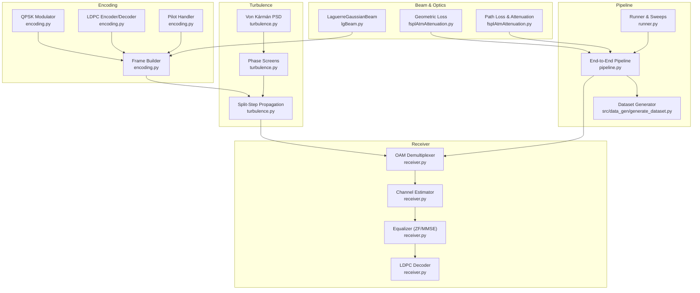

**Diagram sources**
- [lgBeam.py](file://models/CNN Trials/physics/lgBeam.py#L10-L176)
- [fsplAtmAttenuation.py](file://models/CNN Trials/physics/fsplAtmAttenuation.py#L130-L179)
- [turbulence.py](file://models/CNN Trials/physics/turbulence.py#L31-L56)
- [encoding.py](file://models/CNN Trials/physics/encoding.py#L544-L736)
- [receiver.py](file://models/CNN Trials/physics/receiver.py#L370-L712)
- [pipeline.py](file://models/CNN Trials/physics/pipeline.py#L64-L439)
- [runner.py](file://models/CNN Trials/physics/runner.py#L128-L505)
- [generate_dataset.py](file://models/CNN Trials/src/data_gen/generate_dataset.py#L23-L164)

**Section sources**
- [lgBeam.py](file://models/CNN Trials/physics/lgBeam.py#L10-L176)
- [turbulence.py](file://models/CNN Trials/physics/turbulence.py#L31-L352)
- [fsplAtmAttenuation.py](file://models/CNN Trials/physics/fsplAtmAttenuation.py#L130-L179)
- [encoding.py](file://models/CNN Trials/physics/encoding.py#L544-L736)
- [receiver.py](file://models/CNN Trials/physics/receiver.py#L370-L712)
- [pipeline.py](file://models/CNN Trials/physics/pipeline.py#L64-L439)
- [runner.py](file://models/CNN Trials/physics/runner.py#L128-L505)
- [generate_dataset.py](file://models/CNN Trials/src/data_gen/generate_dataset.py#L23-L164)

## Core Components
- Laguerre-Gaussian beam generation: Implements LG field synthesis, beam parameters (waist, divergence, Gouy phase), and geometric loss computation.
- Turbulence modeling: Generates von Kármán phase screens, integrates turbulence across multi-layer slabs, and applies split-step propagation.
- Encoding pipeline: QPSK modulation, LDPC coding, pilot insertion, and spatial multiplexing across OAM modes.
- Receiver processing: OAM demultiplexing via matched projections, LS channel estimation, MMSE/ZF equalization, and LDPC decoding.
- End-to-end pipeline: Orchestrates transmission, atmospheric propagation, receiver processing, and performance metrics.
- ML dataset generation: Produces HDF5 datasets of received intensity images paired with transmitted QPSK symbols.

**Section sources**
- [lgBeam.py](file://models/CNN Trials/physics/lgBeam.py#L10-L176)
- [turbulence.py](file://models/CNN Trials/physics/turbulence.py#L108-L352)
- [encoding.py](file://models/CNN Trials/physics/encoding.py#L136-L736)
- [receiver.py](file://models/CNN Trials/physics/receiver.py#L370-L712)
- [pipeline.py](file://models/CNN Trials/physics/pipeline.py#L64-L439)
- [generate_dataset.py](file://models/CNN Trials/src/data_gen/generate_dataset.py#L23-L164)

## Architecture Overview
The simulation pipeline integrates optical, atmospheric, and digital signal processing:
- Transmitter: Encodes information into QPSK symbols, LDPC codes them, inserts pilots, and multiplexes across OAM modes using LG basis fields.
- Channel: Applies geometric loss, atmospheric attenuation, and turbulence-induced phase distortions via split-step propagation through phase screens.
- Receiver: Demultiplexes OAM modes, estimates channel via LS on pilots, equalizes symbols, performs QPSK demodulation, and decodes LDPC.
- Dataset generation: Samples frames of received fields and corresponding transmitted symbols for training.

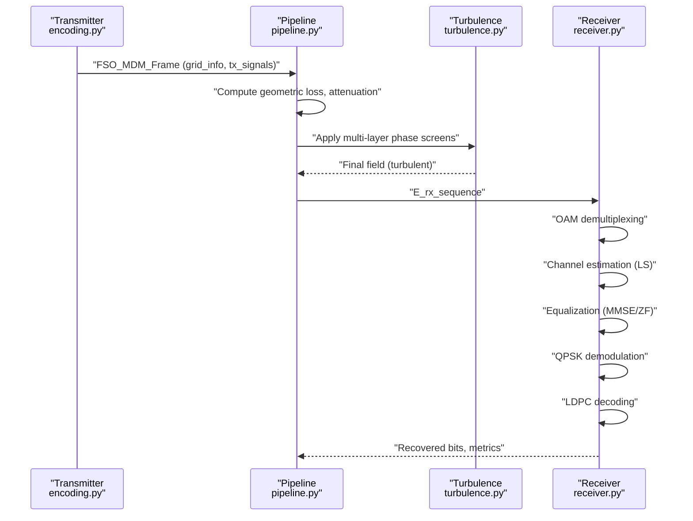

**Diagram sources**
- [pipeline.py](file://models/CNN Trials/physics/pipeline.py#L64-L439)
- [turbulence.py](file://models/CNN Trials/physics/turbulence.py#L261-L352)
- [receiver.py](file://models/CNN Trials/physics/receiver.py#L370-L712)
- [encoding.py](file://models/CNN Trials/physics/encoding.py#L544-L736)

**Section sources**
- [pipeline.py](file://models/CNN Trials/physics/pipeline.py#L64-L439)
- [turbulence.py](file://models/CNN Trials/physics/turbulence.py#L261-L352)
- [receiver.py](file://models/CNN Trials/physics/receiver.py#L370-L712)
- [encoding.py](file://models/CNN Trials/physics/encoding.py#L544-L736)

## Detailed Component Analysis

### Laguerre-Gaussian Beam Generation and Propagation
- Beam synthesis: Generates complex electric field for LG modes with radial, azimuthal, and phase terms, including Gouy phase and beam steering.
- Beam parameters: Computes beam waist, physical radius, radius of curvature, and effective divergence, accounting for M² effects.
- Geometric loss: Integrates beam intensity over receiver aperture to compute collection efficiency and loss in dB.
- Path loss: Combines geometric loss, atmospheric attenuation (Kim model), and scintillation effects.

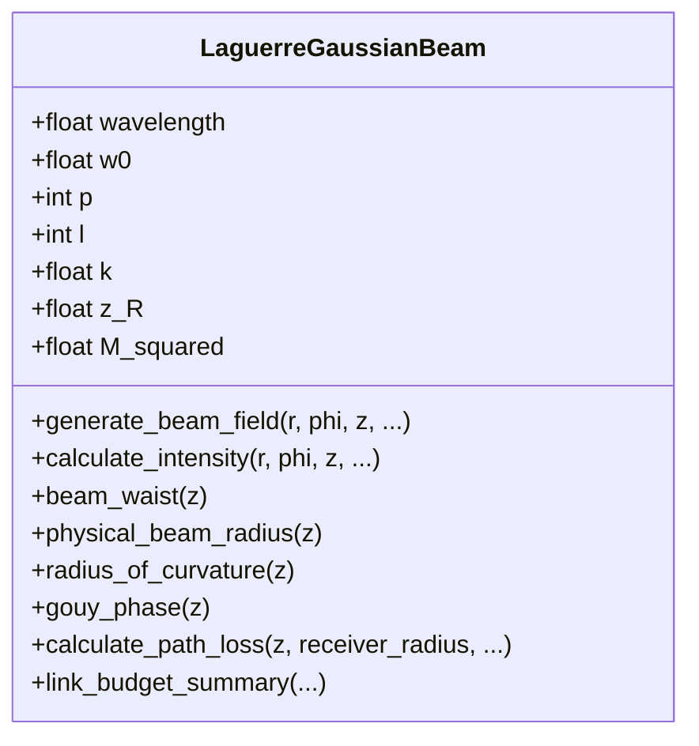

**Diagram sources**
- [lgBeam.py](file://models/CNN Trials/physics/lgBeam.py#L10-L176)
- [fsplAtmAttenuation.py](file://models/CNN Trials/physics/fsplAtmAttenuation.py#L130-L179)
- [fsplAtmAttenuation.py](file://models/CNN Trials/physics/fsplAtmAttenuation.py#L26-L45)

**Section sources**
- [lgBeam.py](file://models/CNN Trials/physics/lgBeam.py#L10-L176)
- [fsplAtmAttenuation.py](file://models/CNN Trials/physics/fsplAtmAttenuation.py#L130-L179)
- [fsplAtmAttenuation.py](file://models/CNN Trials/physics/fsplAtmAttenuation.py#L26-L45)

### Atmospheric Turbulence Simulation (von Kármán Spectrum)
- Phase screen generation: Uses von Kármán power spectral density with outer and inner scale corrections, generating phase screens with target variance.
- Multi-layer modeling: Integrates Cn² profiles across slabs to compute Fried parameter per layer and cumulative propagation.
- Split-step propagation: Applies angular spectrum propagation between layers and applies phase screens via multiplication in the field domain.

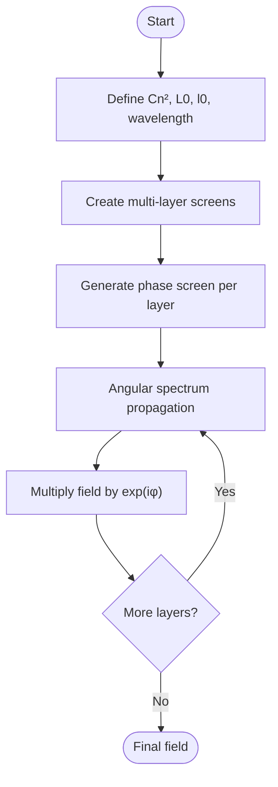

**Diagram sources**
- [turbulence.py](file://models/CNN Trials/physics/turbulence.py#L210-L257)
- [turbulence.py](file://models/CNN Trials/physics/turbulence.py#L31-L56)
- [turbulence.py](file://models/CNN Trials/physics/turbulence.py#L60-L104)

**Section sources**
- [turbulence.py](file://models/CNN Trials/physics/turbulence.py#L108-L352)

### Geometric Loss Calculation
- Numeric integration: Computes beam intensity profiles and integrates over receiver aperture to determine collection efficiency.
- Empirical path loss: Includes geometric loss, atmospheric attenuation (Kim model), and scintillation contributions.

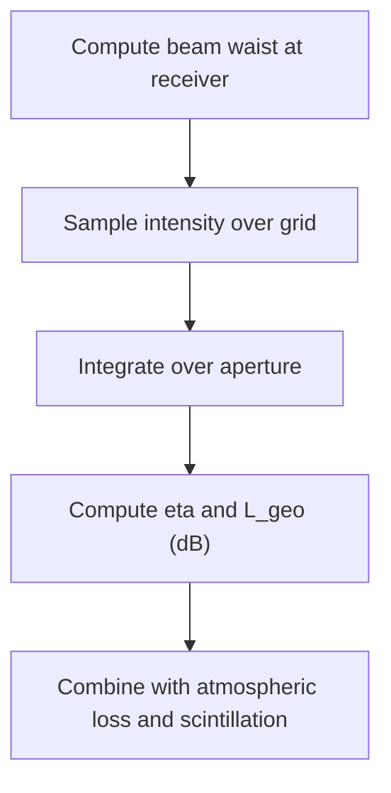

**Diagram sources**
- [fsplAtmAttenuation.py](file://models/CNN Trials/physics/fsplAtmAttenuation.py#L130-L179)
- [fsplAtmAttenuation.py](file://models/CNN Trials/physics/fsplAtmAttenuation.py#L26-L45)

**Section sources**
- [fsplAtmAttenuation.py](file://models/CNN Trials/physics/fsplAtmAttenuation.py#L130-L179)
- [fsplAtmAttenuation.py](file://models/CNN Trials/physics/fsplAtmAttenuation.py#L26-L45)

### Split-Step Fourier Method Implementation
- Angular spectrum propagation: Implements free-space propagation using FFT-based angular spectrum with evanescent wave cutoff.
- Layered propagation: Applies propagation distances between phase screens and applies phase screen multiplication in the field domain.

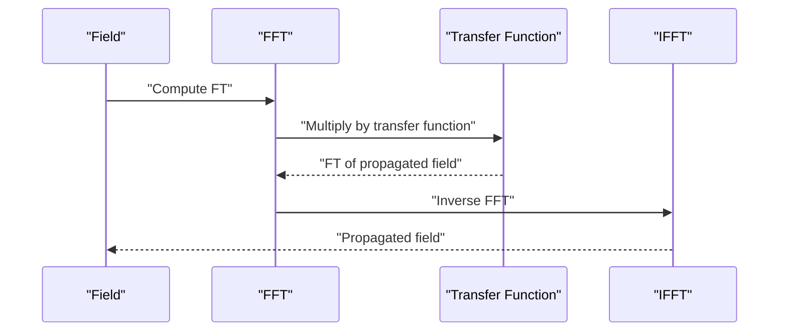

**Diagram sources**
- [turbulence.py](file://models/CNN Trials/physics/turbulence.py#L31-L56)

**Section sources**
- [turbulence.py](file://models/CNN Trials/physics/turbulence.py#L31-L56)

### Multi-Layer Phase Screen Modeling
- Layer construction: Integrates Cn² over slabs to compute Fried parameter per layer; supports uniform and Hufnagel-Valley profiles.
- Screen application: Applies phase screens at layer positions and propagates between screens using angular spectrum.

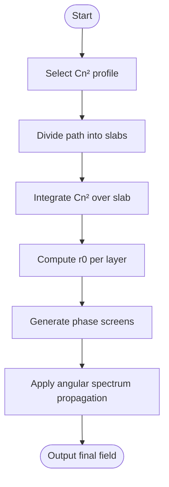

**Diagram sources**
- [turbulence.py](file://models/CNN Trials/physics/turbulence.py#L210-L257)
- [turbulence.py](file://models/CNN Trials/physics/turbulence.py#L187-L206)

**Section sources**
- [turbulence.py](file://models/CNN Trials/physics/turbulence.py#L210-L257)
- [turbulence.py](file://models/CNN Trials/physics/turbulence.py#L187-L206)

### QPSK Symbol Encoding and Framing
- QPSK modulation: Maps pairs of bits to constellation points and supports hard and soft demodulation.
- LDPC coding: Provides encoder/decoder with BP decoding and systematic encoding.
- Pilot insertion: Inserts comb and preamble pilots per mode for channel estimation.
- Spatial multiplexing: Builds multi-mode frames using LG basis fields scaled for total transmit power.

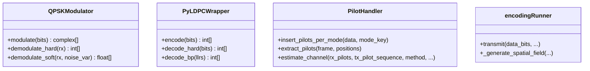

**Diagram sources**
- [encoding.py](file://models/CNN Trials/physics/encoding.py#L136-L190)
- [encoding.py](file://models/CNN Trials/physics/encoding.py#L191-L460)
- [encoding.py](file://models/CNN Trials/physics/encoding.py#L462-L571)
- [encoding.py](file://models/CNN Trials/physics/encoding.py#L544-L736)

**Section sources**
- [encoding.py](file://models/CNN Trials/physics/encoding.py#L136-L190)
- [encoding.py](file://models/CNN Trials/physics/encoding.py#L191-L460)
- [encoding.py](file://models/CNN Trials/physics/encoding.py#L462-L571)
- [encoding.py](file://models/CNN Trials/physics/encoding.py#L544-L736)

### End-to-End Simulation Pipeline
- Configuration: Centralizes system parameters (wavelength, beam waist, link distance, turbulence, receiver diameter, FEC, pilots, grid size).
- Transmission: Builds frames, computes geometric loss and attenuation, and prepares metadata for receiver.
- Propagation: Applies split-step propagation through turbulence and aperture masking.
- Reception: Demultiplexes OAM modes, estimates channel, equalizes, demodulates, and decodes LDPC.
- Metrics: Computes BER, condition number, and stores channel estimates and symbol samples.

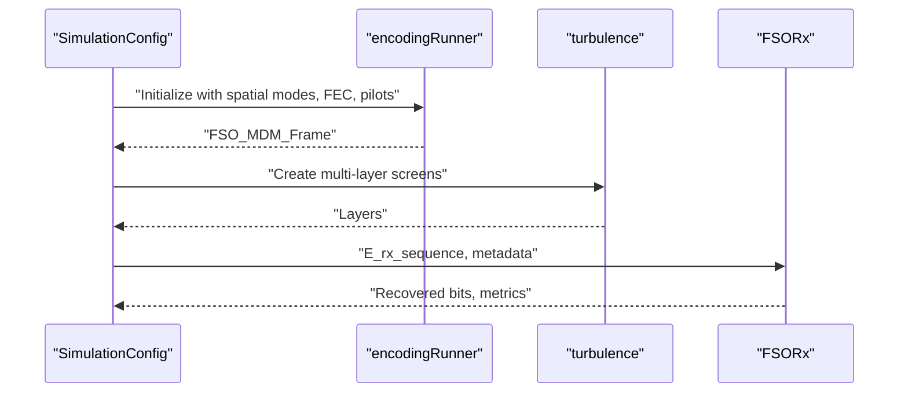

**Diagram sources**
- [pipeline.py](file://models/CNN Trials/physics/pipeline.py#L37-L63)
- [pipeline.py](file://models/CNN Trials/physics/pipeline.py#L64-L439)
- [runner.py](file://models/CNN Trials/physics/runner.py#L73-L123)
- [runner.py](file://models/CNN Trials/physics/runner.py#L128-L505)

**Section sources**
- [pipeline.py](file://models/CNN Trials/physics/pipeline.py#L37-L63)
- [pipeline.py](file://models/CNN Trials/physics/pipeline.py#L64-L439)
- [runner.py](file://models/CNN Trials/physics/runner.py#L73-L123)
- [runner.py](file://models/CNN Trials/physics/runner.py#L128-L505)

### Relationship to ML Training Pipeline
- Dataset generation: The pipeline produces sequences of received complex fields and corresponding transmitted QPSK symbols, resized to fixed image dimensions and stored in HDF5.
- Targets: Each sample includes intensity images and symbol targets; CN² values are recorded for environmental conditioning.
- Data loading: The dataset loader loads HDF5 into memory and formats inputs/targets for training.

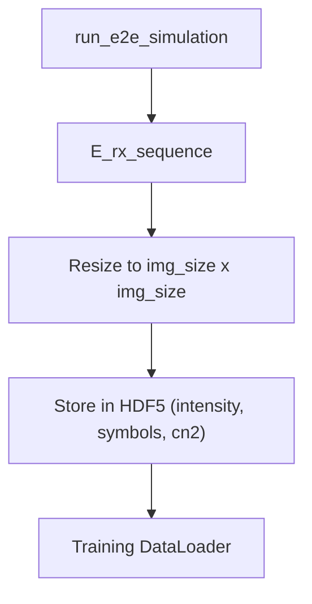

**Diagram sources**
- [generate_dataset.py](file://models/CNN Trials/src/data_gen/generate_dataset.py#L57-L164)
- [dataset.py](file://models/CNN Trials/src/utils/dataset.py#L6-L44)

**Section sources**
- [generate_dataset.py](file://models/CNN Trials/src/data_gen/generate_dataset.py#L23-L164)
- [dataset.py](file://models/CNN Trials/src/utils/dataset.py#L6-L44)

## Dependency Analysis
Key dependencies and relationships:
- lgBeam is imported across modules for beam field generation and path loss computations.
- turbulence depends on lgBeam for beam parameters and provides angular spectrum propagation and phase screen generation.
- encoding constructs frames and relies on lgBeam for basis fields and fsplAtmAttenuation for geometric loss.
- receiver uses lgBeam for reference fields and turbulence for angular spectrum propagation.
- pipeline orchestrates all components and passes metadata between modules.
- ML data generation depends on pipeline outputs.

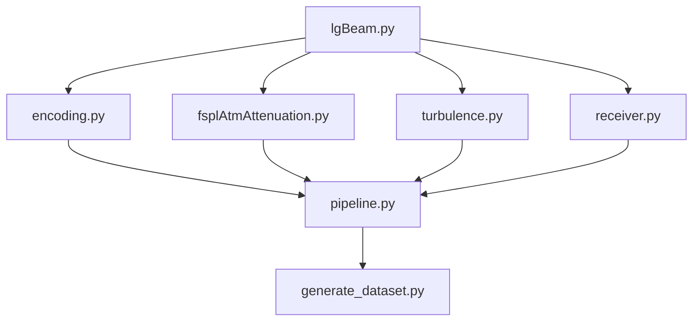

**Diagram sources**
- [lgBeam.py](file://models/CNN Trials/physics/lgBeam.py#L10-L176)
- [fsplAtmAttenuation.py](file://models/CNN Trials/physics/fsplAtmAttenuation.py#L130-L179)
- [turbulence.py](file://models/CNN Trials/physics/turbulence.py#L31-L56)
- [encoding.py](file://models/CNN Trials/physics/encoding.py#L544-L736)
- [receiver.py](file://models/CNN Trials/physics/receiver.py#L370-L712)
- [pipeline.py](file://models/CNN Trials/physics/pipeline.py#L64-L439)
- [generate_dataset.py](file://models/CNN Trials/src/data_gen/generate_dataset.py#L23-L164)

**Section sources**
- [lgBeam.py](file://models/CNN Trials/physics/lgBeam.py#L10-L176)
- [fsplAtmAttenuation.py](file://models/CNN Trials/physics/fsplAtmAttenuation.py#L130-L179)
- [turbulence.py](file://models/CNN Trials/physics/turbulence.py#L31-L56)
- [encoding.py](file://models/CNN Trials/physics/encoding.py#L544-L736)
- [receiver.py](file://models/CNN Trials/physics/receiver.py#L370-L712)
- [pipeline.py](file://models/CNN Trials/physics/pipeline.py#L64-L439)
- [generate_dataset.py](file://models/CNN Trials/src/data_gen/generate_dataset.py#L23-L164)

## Performance Considerations
- Grid sizing: Receiver grid is adapted to the largest M² beam at the link distance; oversampling and grid size balance accuracy and compute cost.
- Phase screen resolution: Ensure grid spacing satisfies inner scale criteria to properly resolve turbulence effects.
- Computational complexity: Split-step propagation scales with FFT operations per layer; number of layers and grid size dominate runtime.
- Memory usage: Large grids and long symbol sequences increase memory footprint; consider chunking or streaming for training.
- Numerical stability: Proper normalization and regularization in equalization mitigate ill-conditioning.

[No sources needed since this section provides general guidance]

## Troubleshooting Guide
Common issues and resolutions:
- Zero or invalid phase variance in phase screens: Verify grid spacing relative to inner scale and adjust grid size or aperture diameter.
- NaN or spread fields after propagation: Check grid resolution, ensure adequate oversampling, and validate layer positions.
- Poor channel estimation: Inspect pilot positions and ensure sufficient pilot density; verify LS estimation and matrix conditioning.
- Incorrect noise variance in receiver: Use metadata-provided noise variance to avoid biased estimates; disable noise for blind scenarios.
- Mismatched LDPC instances: Ensure transmitter and receiver share the same LDPC parameters to decode correctly.

**Section sources**
- [turbulence.py](file://models/CNN Trials/physics/turbulence.py#L282-L288)
- [turbulence.py](file://models/CNN Trials/physics/turbulence.py#L356-L381)
- [receiver.py](file://models/CNN Trials/physics/receiver.py#L319-L366)
- [pipeline.py](file://models/CNN Trials/physics/pipeline.py#L300-L342)

## Conclusion
The physics simulation engine provides a robust, modular framework for FSO-OAM simulations with realistic atmospheric effects and digital processing. It enables detailed analysis of beam propagation, turbulence impact, and receiver performance, and serves as a foundation for ML-driven channel estimation and signal processing research.

[No sources needed since this section summarizes without analyzing specific files]

## Appendices

### Common Simulation Parameters
- Wavelength: Typically 1550 nm
- Beam waist: 25 mm
- Link distance: 1000 m
- Turbulence: Cn² = 1e-15 to 1e-17 m⁻²ᐟ³
- Receiver diameter: 0.5 m
- Grid size: 512×512 (oversampled)
- Equalization: MMSE by default
- SNR: 35 dB
- Spatial modes: Multiple LG modes (e.g., (0,±1),(0,±3),(0,±4),(1,±1))

**Section sources**
- [pipeline.py](file://models/CNN Trials/physics/pipeline.py#L37-L63)
- [runner.py](file://models/CNN Trials/physics/runner.py#L73-L123)

### Validation Approaches
- Phase screen variance verification against von Kármán theory
- Rytov variance scaling checks for plane/spherical/collimated beams
- Fried parameter additivity across layered Cn² profiles
- Multi-mode coupling and channel matrix conditioning diagnostics

**Section sources**
- [turbulence.py](file://models/CNN Trials/physics/turbulence.py#L439-L517)