# Signal Processing and Encoding

<cite>
**Referenced Files in This Document**
- [README.md](file://README.md)
- [encoding.py](file://models/CNN Trials/physics/encoding.py)
- [receiver.py](file://models/CNN Trials/physics/receiver.py)
- [pipeline.py](file://models/CNN Trials/physics/pipeline.py)
- [lgBeam.py](file://models/CNN Trials/physics/lgBeam.py)
- [turbulence.py](file://models/CNN Trials/physics/turbulence.py)
- [model.py](file://models/CNN Trials/src/models/model.py)
- [resnet_cbam.py](file://models/CNN Trials/src/models/resnet_cbam.py)
- [attention.py](file://models/CNN Trials/src/models/attention.py)
- [evaluate.py](file://models/CNN Trials/src/evaluation/evaluate.py)
- [utils.py](file://models/CNN Trials/src/utils/utils.py)
</cite>

## Table of Contents
1. [Introduction](#introduction)
2. [Project Structure](#project-structure)
3. [Core Components](#core-components)
4. [Architecture Overview](#architecture-overview)
5. [Detailed Component Analysis](#detailed-component-analysis)
6. [Dependency Analysis](#dependency-analysis)
7. [Performance Considerations](#performance-considerations)
8. [Troubleshooting Guide](#troubleshooting-guide)
9. [Conclusion](#conclusion)
10. [Appendices](#appendices)

## Introduction
This document explains the signal processing and QPSK encoding system for Orbital Angular Momentum (OAM) multiplexed Free Space Optical (FSO) communications. It covers:
- The orbital angular momentum multiplexing scheme and how QPSK symbols are mapped to spatial modes
- Digital signal processing techniques including pilot insertion, channel estimation, equalization, and phase ambiguity resolution
- Constellation diagram generation and error vector magnitude (EVM) considerations
- Practical examples of encoding data streams, managing mode assignments, and transmitter-side signal processing
- Integration with beam generation and propagation components
- The relationship between signal processing and machine learning input requirements

## Project Structure
The repository organizes the OAM-FSO system into two major subsystems:
- Physics simulation and receiver pipeline: responsible for transmitter encoding, atmospheric turbulence propagation, and receiver equalization/detection
- Machine learning (ML) receiver: a neural network trained to recover QPSK symbols directly from intensity images

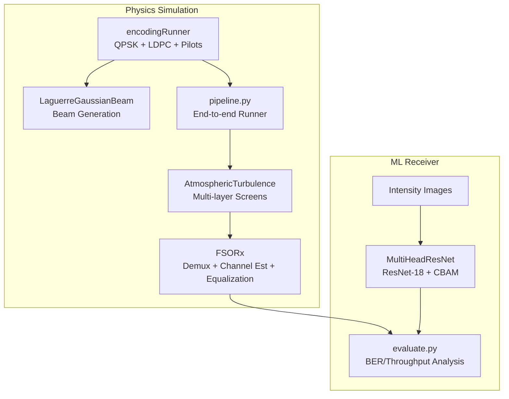

**Diagram sources**
- [encoding.py](file://models/CNN Trials/physics/encoding.py#L544-L684)
- [lgBeam.py](file://models/CNN Trials/physics/lgBeam.py#L10-L176)
- [turbulence.py](file://models/CNN Trials/physics/turbulence.py#L31-L56)
- [receiver.py](file://models/CNN Trials/physics/receiver.py#L370-L712)
- [pipeline.py](file://models/CNN Trials/physics/pipeline.py#L64-L439)
- [model.py](file://models/CNN Trials/src/models/model.py#L6-L71)
- [resnet_cbam.py](file://models/CNN Trials/src/models/resnet_cbam.py#L51-L111)
- [evaluate.py](file://models/CNN Trials/src/evaluation/evaluate.py#L80-L315)

**Section sources**
- [README.md](file://README.md#L311-L350)

## Core Components
- QPSK Modulator: maps pairs of bits to complex constellation points and supports hard and soft demodulation
- LDPC Encoder/Decoder: provides forward error correction for reliable transmission
- Pilot Handler: inserts structured pilot sequences for channel estimation
- OAM Demultiplexer: projects received fields onto spatial mode basis fields
- Channel Estimator: estimates per-mode channel responses using pilots
- Equalizers: Zero-Forcing (ZF) and Minimum Mean Square Error (MMSE) options
- Phase Ambiguity Resolution: blind phase recovery using the fourth-power method
- Constellation Generation and EVM: visualization and metric computation for QPSK symbol quality
- ML Receiver: a multi-head CNN that predicts QPSK symbols from intensity images

**Section sources**
- [encoding.py](file://models/CNN Trials/physics/encoding.py#L136-L190)
- [encoding.py](file://models/CNN Trials/physics/encoding.py#L190-L460)
- [encoding.py](file://models/CNN Trials/physics/encoding.py#L462-L566)
- [receiver.py](file://models/CNN Trials/physics/receiver.py#L67-L224)
- [receiver.py](file://models/CNN Trials/physics/receiver.py#L227-L366)
- [receiver.py](file://models/CNN Trials/physics/receiver.py#L370-L712)
- [model.py](file://models/CNN Trials/src/models/model.py#L6-L71)

## Architecture Overview
The end-to-end flow integrates transmitter encoding, atmospheric propagation, and receiver processing. The ML receiver operates on intensity-only measurements and recovers QPSK symbols without explicit phase sensors.

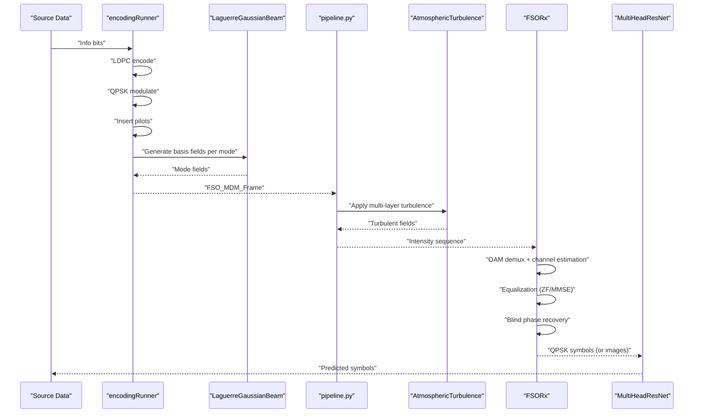

**Diagram sources**
- [encoding.py](file://models/CNN Trials/physics/encoding.py#L544-L684)
- [lgBeam.py](file://models/CNN Trials/physics/lgBeam.py#L81-L176)
- [pipeline.py](file://models/CNN Trials/physics/pipeline.py#L64-L439)
- [turbulence.py](file://models/CNN Trials/physics/turbulence.py#L261-L352)
- [receiver.py](file://models/CNN Trials/physics/receiver.py#L370-L712)
- [model.py](file://models/CNN Trials/src/models/model.py#L6-L71)

## Detailed Component Analysis

### QPSK Symbol Encoding and Mapping
- Bit-to-QPSK mapping: pairs of bits map to four constellation points forming a square rotated 45° with Gray-coded bit ordering
- Modulation: converts bit pairs into complex symbols with unit energy
- Demodulation: supports both hard decisions and soft LLR outputs for LDPC decoding
- Constellation visualization: plots ideal and transmitted symbols for diagnostics

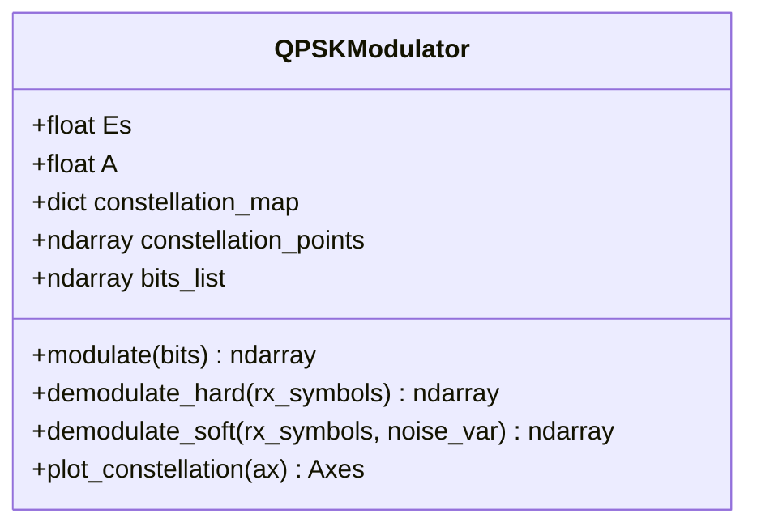

**Diagram sources**
- [encoding.py](file://models/CNN Trials/physics/encoding.py#L136-L190)

**Section sources**
- [encoding.py](file://models/CNN Trials/physics/encoding.py#L136-L190)

### LDPC Encoding and Decoding
- LDPC wrapper generates generator/control matrices and encodes/decodes bitstreams
- Supports both hard-decision and belief-propagation decoding
- Ensures block-aligned encoding/decoding for receiver processing

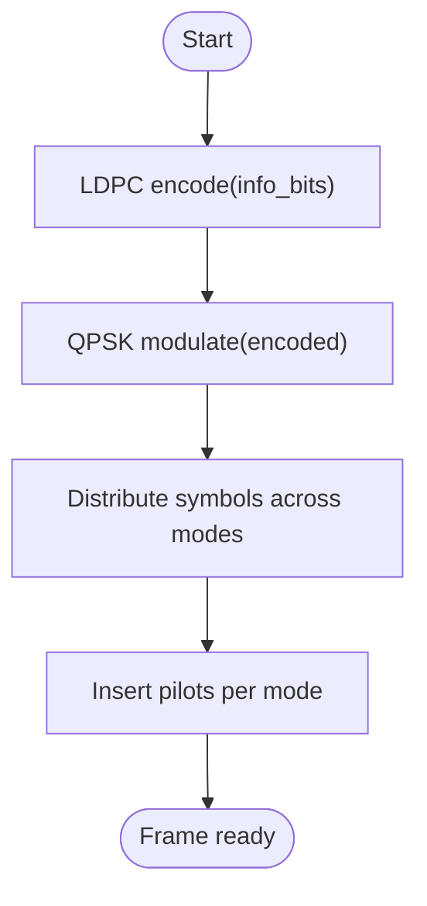

**Diagram sources**
- [encoding.py](file://models/CNN Trials/physics/encoding.py#L190-L282)
- [encoding.py](file://models/CNN Trials/physics/encoding.py#L544-L684)

**Section sources**
- [encoding.py](file://models/CNN Trials/physics/encoding.py#L190-L282)
- [encoding.py](file://models/CNN Trials/physics/encoding.py#L284-L460)

### Pilot-Based Channel Estimation and Equalization
- PilotHandler: generates comb and preamble pilots per mode; extracts pilots and estimates per-mode channel using least-squares or weighted averaging
- OAMDemultiplexer: projects received fields onto spatial mode basis fields; computes projection energies for normalization
- ChannelEstimator: builds per-mode channel estimates and noise variance estimates
- Equalizers: ZF with regularization and MMSE with noise-aware weighting; automatic selection based on condition number and scaling

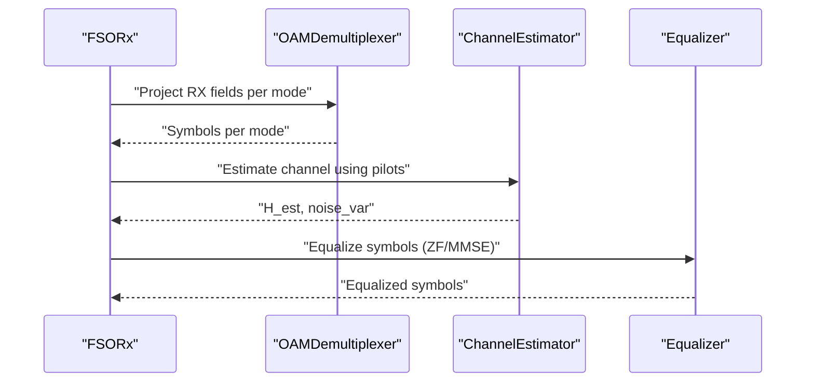

**Diagram sources**
- [receiver.py](file://models/CNN Trials/physics/receiver.py#L67-L224)
- [receiver.py](file://models/CNN Trials/physics/receiver.py#L227-L366)
- [receiver.py](file://models/CNN Trials/physics/receiver.py#L370-L576)

**Section sources**
- [receiver.py](file://models/CNN Trials/physics/receiver.py#L67-L224)
- [receiver.py](file://models/CNN Trials/physics/receiver.py#L227-L366)
- [receiver.py](file://models/CNN Trials/physics/receiver.py#L370-L576)

### Phase Ambiguity Resolution and Blind Carrier Recovery
- Problem: atmospheric turbulence introduces a global (piston) phase rotation that rotates the QPSK constellation
- Solution: fourth-power method to estimate residual phase; de-rotate constellation before demodulation
- Receiver auto-scales equalizer output to maintain unit-symbol energy for accurate demodulation

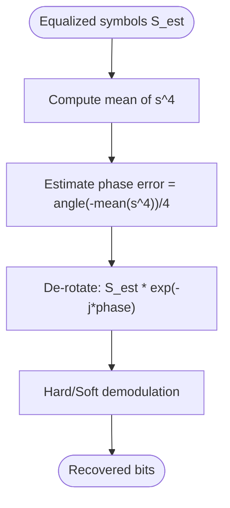

**Diagram sources**
- [receiver.py](file://models/CNN Trials/physics/receiver.py#L539-L573)

**Section sources**
- [receiver.py](file://models/CNN Trials/physics/receiver.py#L539-L573)

### Constellation Diagram Generation and EVM
- Ideal QPSK constellation is plotted alongside transmitted symbols for visual inspection
- EVM-like comparisons can be performed by computing distances between true and estimated symbols
- Evaluation scripts generate constellation plots and compute BER/throughput

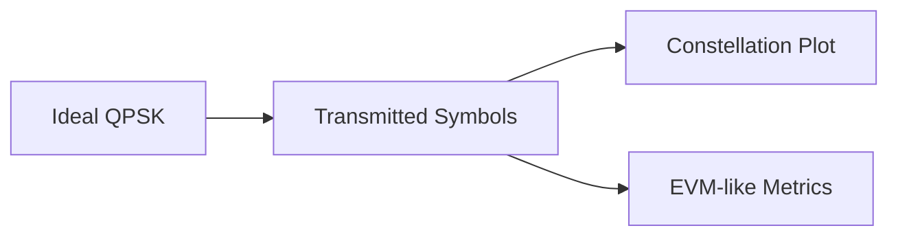

**Diagram sources**
- [encoding.py](file://models/CNN Trials/physics/encoding.py#L738-L800)
- [utils.py](file://models/CNN Trials/src/utils/utils.py#L212-L254)
- [evaluate.py](file://models/CNN Trials/src/evaluation/evaluate.py#L288-L304)

**Section sources**
- [encoding.py](file://models/CNN Trials/physics/encoding.py#L738-L800)
- [utils.py](file://models/CNN Trials/src/utils/utils.py#L212-L254)
- [evaluate.py](file://models/CNN Trials/src/evaluation/evaluate.py#L288-L304)

### Transmitter-Side Signal Processing
- Mode assignment: spatial_modes define the OAM modes used for multiplexing
- Power allocation: total TX power distributed across modes based on basis field normalization
- Phase noise and timing jitter: optional phase noise sequences and timing jitter modeled per mode
- 3D field synthesis: optional generation of multiplexed intensity fields across symbol slots

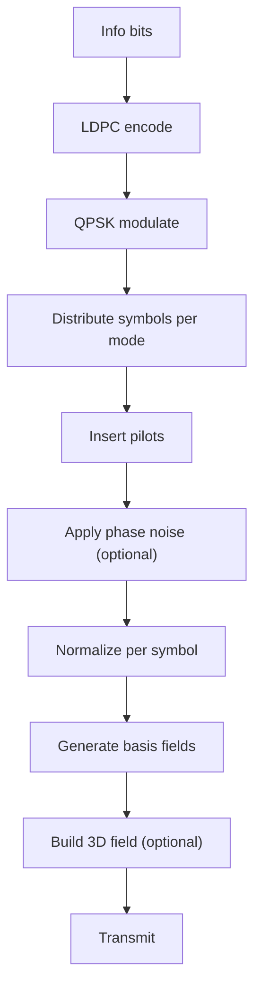

**Diagram sources**
- [encoding.py](file://models/CNN Trials/physics/encoding.py#L544-L736)

**Section sources**
- [encoding.py](file://models/CNN Trials/physics/encoding.py#L544-L736)

### Integration with Beam Generation and Propagation
- LG beam generation: radial and azimuthal terms, Gouy phase, curvature, and propagation phase
- Angular spectrum propagation: free-space propagation between layers with evanescent cutoff
- Multi-layer turbulence: split-step application of phase screens at discrete heights

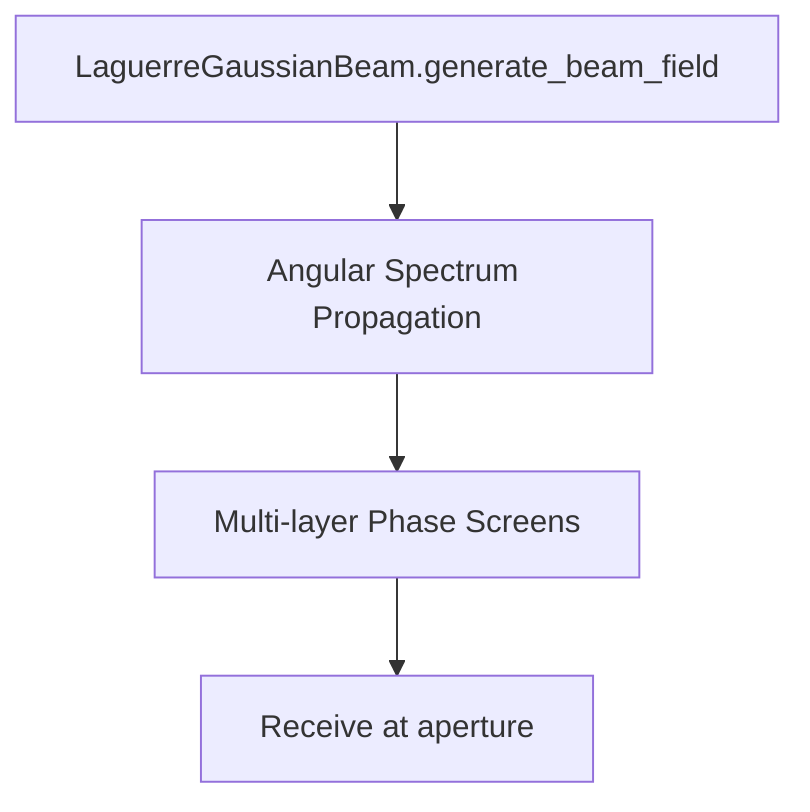

**Diagram sources**
- [lgBeam.py](file://models/CNN Trials/physics/lgBeam.py#L81-L176)
- [turbulence.py](file://models/CNN Trials/physics/turbulence.py#L31-L56)
- [turbulence.py](file://models/CNN Trials/physics/turbulence.py#L261-L352)

**Section sources**
- [lgBeam.py](file://models/CNN Trials/physics/lgBeam.py#L81-L176)
- [turbulence.py](file://models/CNN Trials/physics/turbulence.py#L31-L56)
- [turbulence.py](file://models/CNN Trials/physics/turbulence.py#L261-L352)

### Relationship Between Signal Processing and ML Input Requirements
- ML receiver takes 64×64 intensity images as input and predicts QPSK symbols per mode
- MultiHeadResNet includes a power head for auxiliary mode power classification
- Evaluation scripts compute BER, SER, and throughput; generate constellation plots and throughput curves

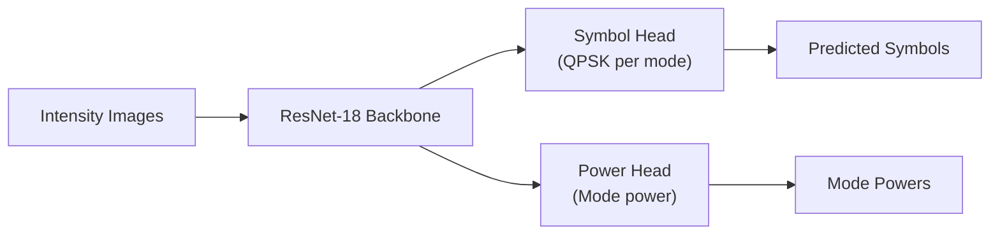

**Diagram sources**
- [model.py](file://models/CNN Trials/src/models/model.py#L6-L71)
- [resnet_cbam.py](file://models/CNN Trials/src/models/resnet_cbam.py#L51-L111)
- [attention.py](file://models/CNN Trials/src/models/attention.py#L72-L89)
- [evaluate.py](file://models/CNN Trials/src/evaluation/evaluate.py#L80-L315)

**Section sources**
- [model.py](file://models/CNN Trials/src/models/model.py#L6-L71)
- [resnet_cbam.py](file://models/CNN Trials/src/models/resnet_cbam.py#L51-L111)
- [attention.py](file://models/CNN Trials/src/models/attention.py#L72-L89)
- [evaluate.py](file://models/CNN Trials/src/evaluation/evaluate.py#L80-L315)

## Dependency Analysis
The system exhibits layered dependencies:
- encoding.py depends on lgBeam.py for basis fields and optionally pyldpc for LDPC
- receiver.py depends on encoding.py (for QPSK and pilot utilities), turbulence.py for propagation, and lgBeam.py for reference fields
- pipeline.py orchestrates end-to-end simulation and ties transmitter, turbulence, and receiver together
- ML components depend on dataset utilities and evaluation scripts

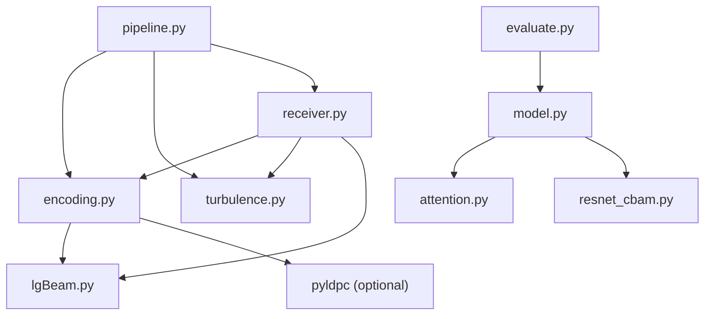

**Diagram sources**
- [encoding.py](file://models/CNN Trials/physics/encoding.py#L1-L46)
- [receiver.py](file://models/CNN Trials/physics/receiver.py#L1-L41)
- [pipeline.py](file://models/CNN Trials/physics/pipeline.py#L1-L34)
- [model.py](file://models/CNN Trials/src/models/model.py#L1-L8)
- [resnet_cbam.py](file://models/CNN Trials/src/models/resnet_cbam.py#L1-L4)
- [attention.py](file://models/CNN Trials/src/models/attention.py#L1-L4)
- [evaluate.py](file://models/CNN Trials/src/evaluation/evaluate.py#L1-L11)

**Section sources**
- [encoding.py](file://models/CNN Trials/physics/encoding.py#L1-L46)
- [receiver.py](file://models/CNN Trials/physics/receiver.py#L1-L41)
- [pipeline.py](file://models/CNN Trials/physics/pipeline.py#L1-L34)
- [model.py](file://models/CNN Trials/src/models/model.py#L1-L8)
- [resnet_cbam.py](file://models/CNN Trials/src/models/resnet_cbam.py#L1-L4)
- [attention.py](file://models/CNN Trials/src/models/attention.py#L1-L4)
- [evaluate.py](file://models/CNN Trials/src/evaluation/evaluate.py#L1-L11)

## Performance Considerations
- Equalization selection: automatic switch to MMSE when channel conditions are poor or scaling issues are detected
- Power normalization: equalizer outputs are auto-scaled to maintain unit symbol energy for demodulation
- Noise handling: receiver uses metadata-provided noise variance to stabilize MMSE; otherwise falls back to pilot-based residuals
- Throughput ceilings: effective throughput is determined by mode count, symbol rate, LDPC rate, and pilot overhead; ML receiver improves resilience without increasing peak rate

[No sources needed since this section provides general guidance]

## Troubleshooting Guide
Common issues and remedies:
- No pilots found for channel estimation: receiver warns and defaults to identity channel; ensure pilot ratio and positions are configured
- Ill-conditioned channel matrix: receiver uses pseudo-inverse and logs condition number; adjust propagation or increase pilot density
- Noise variance mismatch: use metadata-provided noise variance; otherwise residuals may overestimate noise
- Phase ambiguity: rely on blind phase recovery via fourth-power method; ensure sufficient SNR for accurate estimation
- Power normalization: verify equalizer output scaling and symbol energy; incorrect scaling leads to demodulation errors

**Section sources**
- [receiver.py](file://models/CNN Trials/physics/receiver.py#L292-L317)
- [receiver.py](file://models/CNN Trials/physics/receiver.py#L319-L366)
- [receiver.py](file://models/CNN Trials/physics/receiver.py#L477-L524)
- [receiver.py](file://models/CNN Trials/physics/receiver.py#L539-L573)

## Conclusion
The OAM-FSO system combines robust classical signal processing (QPSK, LDPC, pilots, equalization, and phase recovery) with a machine learning receiver that operates on intensity-only measurements. The transmitter encodes data streams into QPSK symbols, distributes them across OAM modes, and transmits multiplexed LG beams through turbulent atmospheres. The receiver performs OAM demultiplexing, channel estimation, equalization, and blind phase recovery to recover QPSK symbols. The ML receiver complements this by learning to map intensity images to symbol domains, achieving significant resilience gains in strong turbulence without requiring phase sensors.

[No sources needed since this section summarizes without analyzing specific files]

## Appendices

### Practical Examples

- Encoding a data stream:
  - Prepare info bits, encode with LDPC, modulate with QPSK, distribute symbols across spatial modes, insert pilots, apply optional phase noise and timing jitter, normalize, and optionally generate 3D fields
  - See [encodingRunner.transmit](file://models/CNN Trials/physics/encoding.py#L599-L684)

- Managing mode assignments:
  - Configure spatial_modes list; ensure total TX power is split across modes; verify basis field normalization and scaling
  - See [encodingRunner.__init__](file://models/CNN Trials/physics/encoding.py#L544-L598)

- Implementing transmitter-side signal processing:
  - Use LaguerreGaussianBeam to generate basis fields; propagate fields via angular spectrum; apply multi-layer turbulence; add attenuation and noise; apply aperture masking
  - See [pipeline.run_e2e_simulation](file://models/CNN Trials/physics/pipeline.py#L64-L439), [turbulence.apply_multi_layer_turbulence](file://models/CNN Trials/physics/turbulence.py#L261-L352)

- Integrating with beam generation and propagation:
  - Generate LG basis fields per mode; compute projection energies; propagate fields; apply phase screens; compute final intensity
  - See [lgBeam.generate_beam_field](file://models/CNN Trials/physics/lgBeam.py#L81-L176), [turbulence.angular_spectrum_propagation](file://models/CNN Trials/physics/turbulence.py#L31-L56)

- Relationship to ML input requirements:
  - Train on intensity images; predict QPSK symbols per mode; evaluate BER, SER, and throughput; visualize constellation diagrams
  - See [model.MultiHeadResNet](file://models/CNN Trials/src/models/model.py#L6-L71), [evaluate.evaluate](file://models/CNN Trials/src/evaluation/evaluate.py#L80-L315)