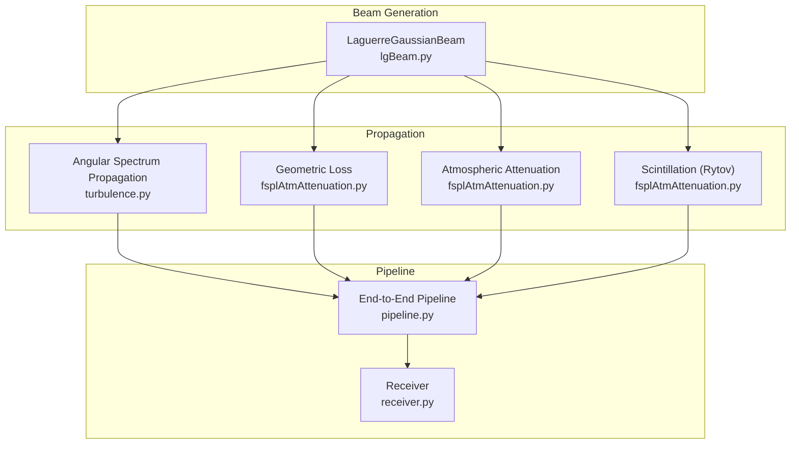
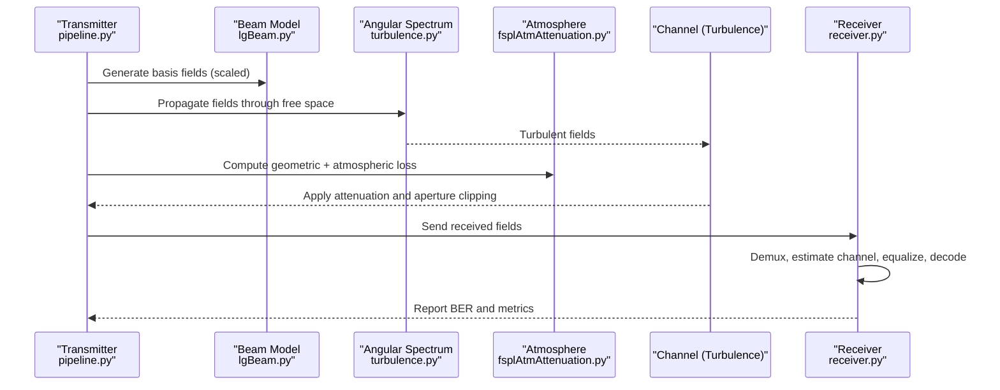
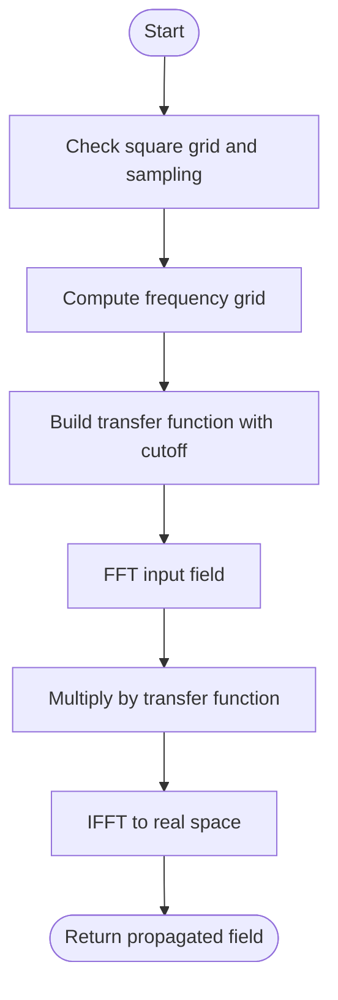
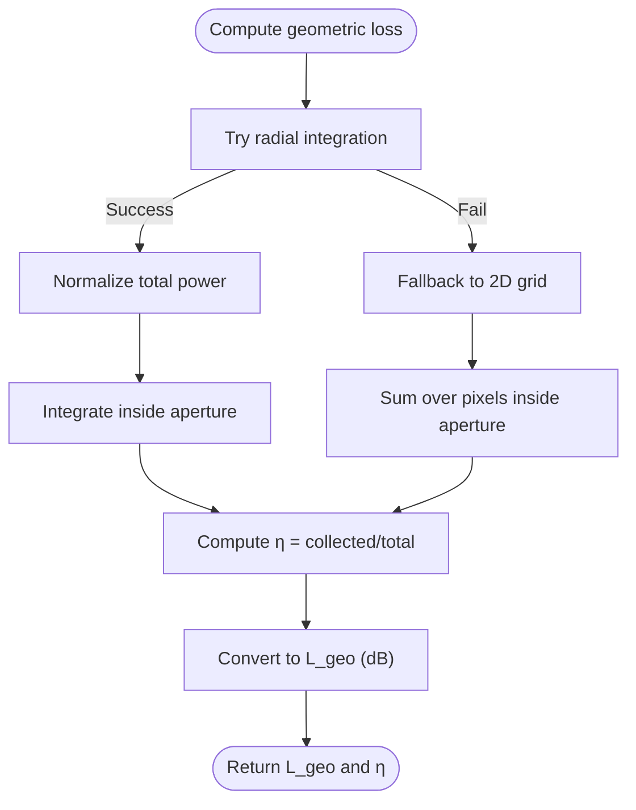
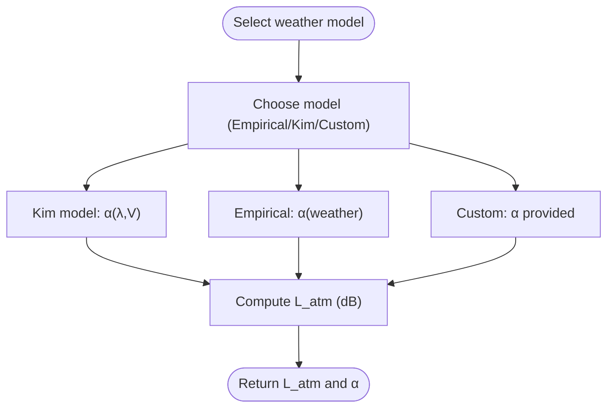
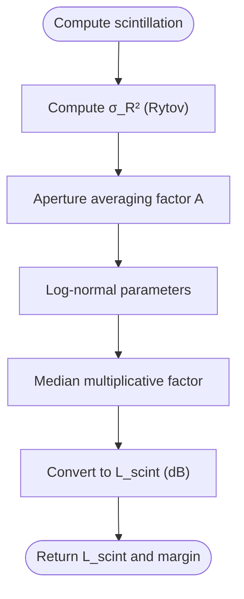
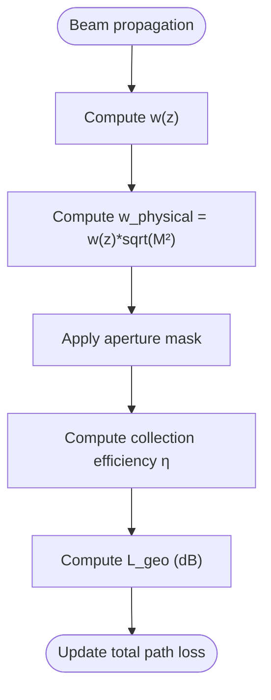
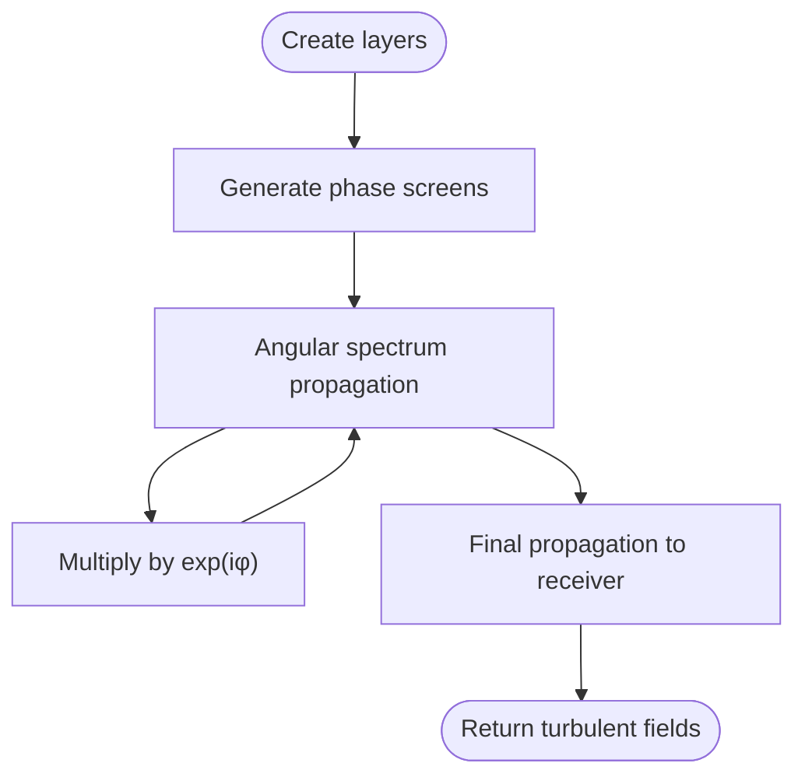
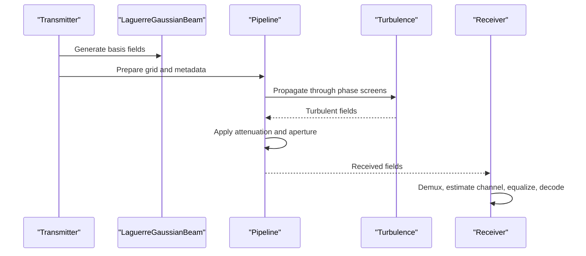
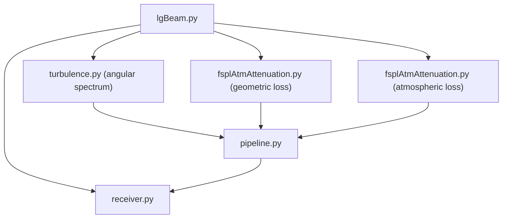

# Wave Propagation Algorithms

<cite>
**Referenced Files in This Document**
- [fsplAtmAttenuation.py](file://models/CNN Trials/physics/fsplAtmAttenuation.py)
- [fsplAtmAttenuation.py](file://models/LDPC + Pilot + MMSE trials/fsplAtmAttenuation.py)
- [lgBeam.py](file://models/CNN Trials/physics/lgBeam.py)
- [lgBeam.py](file://models/LDPC + Pilot + MMSE trials/lgBeam.py)
- [turbulence.py](file://models/CNN Trials/physics/turbulence.py)
- [turbulence.py](file://models/LDPC + Pilot + MMSE trials/turbulence.py)
- [pipeline.py](file://models/CNN Trials/physics/pipeline.py)
- [pipeline.py](file://models/LDPC + Pilot + MMSE trials/pipeline.py)
- [receiver.py](file://models/CNN Trials/physics/receiver.py)
- [receiver.py](file://models/LDPC + Pilot + MMSE trials/receiver.py)
</cite>

## Table of Contents
1. [Introduction](#introduction)
2. [Project Structure](#project-structure)
3. [Core Components](#core-components)
4. [Architecture Overview](#architecture-overview)
5. [Detailed Component Analysis](#detailed-component-analysis)
6. [Dependency Analysis](#dependency-analysis)
7. [Performance Considerations](#performance-considerations)
8. [Troubleshooting Guide](#troubleshooting-guide)
9. [Conclusion](#conclusion)

## Introduction
This document explains the wave propagation and atmospheric attenuation algorithms implemented in the repository, focusing on:
- Split-step Fourier propagation for free-space beam evolution
- Free-space path loss calculations including geometric loss, atmospheric attenuation, and scintillation
- Practical examples for simulating beam propagation under various atmospheric conditions
- Numerical stability considerations, grid resolution requirements, and computational complexity optimization
- Integration with beam generation and turbulence simulation components

## Project Structure
The repository organizes the wave propagation and atmospheric modeling into cohesive modules:
- Beam generation and propagation: Laguerre-Gaussian beam model and angular spectrum propagation
- Atmospheric path loss: geometric loss, atmospheric attenuation (Kim model and empirical), and scintillation
- Turbulence simulation: multi-layer phase screens and split-step propagation
- End-to-end pipeline: orchestration of transmission, channel propagation, and reception

**Diagram sources**
- [lgBeam.py](file://models/CNN Trials/physics/lgBeam.py#L10-L176)
- [turbulence.py](file://models/CNN Trials/physics/turbulence.py#L31-L56)
- [fsplAtmAttenuation.py](file://models/CNN Trials/physics/fsplAtmAttenuation.py#L130-L179)
- [fsplAtmAttenuation.py](file://models/CNN Trials/physics/fsplAtmAttenuation.py#L212-L305)
- [pipeline.py](file://models/CNN Trials/physics/pipeline.py#L64-L439)
- [receiver.py](file://models/CNN Trials/physics/receiver.py#L370-L712)

**Section sources**
- [lgBeam.py](file://models/CNN Trials/physics/lgBeam.py#L10-L176)
- [turbulence.py](file://models/CNN Trials/physics/turbulence.py#L31-L56)
- [fsplAtmAttenuation.py](file://models/CNN Trials/physics/fsplAtmAttenuation.py#L130-L305)
- [pipeline.py](file://models/CNN Trials/physics/pipeline.py#L64-L439)
- [receiver.py](file://models/CNN Trials/physics/receiver.py#L370-L712)

## Core Components
- Laguerre-Gaussian beam model: generates complex electric field, computes beam waist, divergence, and physical radius for geometric loss
- Angular spectrum propagation: free-space propagation operator for split-step simulations
- Atmospheric path loss calculator: combines geometric, atmospheric, and scintillation losses
- Turbulence simulator: multi-layer phase screens and split-step propagation
- End-to-end pipeline: orchestrates transmission, channel propagation, and reception
- Receiver: demultiplexing, channel estimation, equalization, and decoding

**Section sources**
- [lgBeam.py](file://models/CNN Trials/physics/lgBeam.py#L10-L176)
- [turbulence.py](file://models/CNN Trials/physics/turbulence.py#L31-L56)
- [fsplAtmAttenuation.py](file://models/CNN Trials/physics/fsplAtmAttenuation.py#L130-L305)
- [pipeline.py](file://models/CNN Trials/physics/pipeline.py#L64-L439)
- [receiver.py](file://models/CNN Trials/physics/receiver.py#L370-L712)

## Architecture Overview
The system integrates beam generation, atmospheric modeling, and turbulence simulation into a modular pipeline. The Laguerre-Gaussian beam model provides the transverse field representation. Angular spectrum propagation evolves the field through free space. Atmospheric path loss is computed separately and applied as amplitude attenuation and geometric clipping. Turbulence is modeled via phase screens applied in split-step fashion. The receiver performs demultiplexing, channel estimation, equalization, and decoding.

**Diagram sources**
- [pipeline.py](file://models/CNN Trials/physics/pipeline.py#L118-L396)
- [lgBeam.py](file://models/CNN Trials/physics/lgBeam.py#L81-L176)
- [turbulence.py](file://models/CNN Trials/physics/turbulence.py#L31-L56)
- [fsplAtmAttenuation.py](file://models/CNN Trials/physics/fsplAtmAttenuation.py#L212-L305)
- [receiver.py](file://models/CNN Trials/physics/receiver.py#L390-L712)

## Detailed Component Analysis

### Split-Step Fourier Method (Free-Space Propagation)
- Implements the angular spectrum propagation kernel to evolve the complex field through free space.
- Uses FFT-based transfer function with evanescent-wave cutoff to maintain numerical stability.
- Supports optional numerical propagation for reference fields to match transmitter scaling and grid geometry.

Key implementation details:
- Transfer function includes Fresnel-number cutoff to avoid evanescent growth
- Propagation performed in spectral domain; inverse transform yields propagated field
- Optional propagation from z=0 to z=z_distance for reference fields

**Diagram sources**
- [turbulence.py](file://models/CNN Trials/physics/turbulence.py#L31-L56)

**Section sources**
- [turbulence.py](file://models/CNN Trials/physics/turbulence.py#L31-L56)
- [turbulence.py](file://models/LDPC + Pilot + MMSE trials/turbulence.py#L31-L56)

### Free Space Path Loss and Geometric Loss
- Geometric loss computed via numerical collection efficiency: ratio of power captured by receiver aperture to total power.
- Two fallback strategies:
  - Radial integration using beam’s radial intensity or field sampling
  - 2D grid evaluation over Cartesian coordinates
- Geometric loss converted to decibels and combined with atmospheric and scintillation losses.

**Diagram sources**
- [fsplAtmAttenuation.py](file://models/CNN Trials/physics/fsplAtmAttenuation.py#L130-L179)

**Section sources**
- [fsplAtmAttenuation.py](file://models/CNN Trials/physics/fsplAtmAttenuation.py#L130-L179)
- [fsplAtmAttenuation.py](file://models/LDPC + Pilot + MMSE trials/fsplAtmAttenuation.py#L130-L179)

### Atmospheric Attenuation Modeling
- Empirical model: predefined attenuation coefficients per weather condition
- Kim model: wavelength-dependent attenuation derived from visibility
- Attenuation applied as amplitude loss over distance; converted to decibels for summation with geometric and scintillation losses

**Diagram sources**
- [fsplAtmAttenuation.py](file://models/CNN Trials/physics/fsplAtmAttenuation.py#L212-L245)

**Section sources**
- [fsplAtmAttenuation.py](file://models/CNN Trials/physics/fsplAtmAttenuation.py#L26-L45)
- [fsplAtmAttenuation.py](file://models/CNN Trials/physics/fsplAtmAttenuation.py#L212-L245)
- [fsplAtmAttenuation.py](file://models/LDPC + Pilot + MMSE trials/fsplAtmAttenuation.py#L26-L45)
- [fsplAtmAttenuation.py](file://models/LDPC + Pilot + MMSE trials/fsplAtmAttenuation.py#L212-L245)

### Scintillation and Outage Margin
- Rytov variance for weak turbulence computed using Cn2 profile and beam parameters
- Aperture averaging effect reduces intensity variance
- Log-normal approximation yields equivalent positive loss (median loss) and outage margin computation

**Diagram sources**
- [fsplAtmAttenuation.py](file://models/CNN Trials/physics/fsplAtmAttenuation.py#L253-L279)
- [fsplAtmAttenuation.py](file://models/CNN Trials/physics/fsplAtmAttenuation.py#L186-L207)

**Section sources**
- [fsplAtmAttenuation.py](file://models/CNN Trials/physics/fsplAtmAttenuation.py#L186-L207)
- [fsplAtmAttenuation.py](file://models/CNN Trials/physics/fsplAtmAttenuation.py#L253-L279)
- [fsplAtmAttenuation.py](file://models/LDPC + Pilot + MMSE trials/fsplAtmAttenuation.py#L186-L207)
- [fsplAtmAttenuation.py](file://models/LDPC + Pilot + MMSE trials/fsplAtmAttenuation.py#L253-L279)

### Beam Divergence and Aperture Clipping Effects
- Beam waist computed from fundamental Gaussian scaling; physical radius derived from M² factor
- Aperture clipping modeled as circular mask; collection efficiency impacts received power
- Beam divergence increases with distance; affects geometric loss and aperture utilization

**Diagram sources**
- [lgBeam.py](file://models/CNN Trials/physics/lgBeam.py#L35-L49)
- [fsplAtmAttenuation.py](file://models/CNN Trials/physics/fsplAtmAttenuation.py#L130-L179)

**Section sources**
- [lgBeam.py](file://models/CNN Trials/physics/lgBeam.py#L35-L49)
- [lgBeam.py](file://models/LDPC + Pilot + MMSE trials/lgBeam.py#L35-L49)
- [fsplAtmAttenuation.py](file://models/CNN Trials/physics/fsplAtmAttenuation.py#L130-L179)
- [fsplAtmAttenuation.py](file://models/LDPC + Pilot + MMSE trials/fsplAtmAttenuation.py#L130-L179)

### Turbulence Simulation and Split-Step Propagation
- Multi-layer phase screens generated via Von Kármán power spectrum
- Split-step propagation alternates between propagation and phase multiplication
- Grid sizing validated against inner scale (l0) to ensure adequate resolution

**Diagram sources**
- [turbulence.py](file://models/CNN Trials/physics/turbulence.py#L210-L352)

**Section sources**
- [turbulence.py](file://models/CNN Trials/physics/turbulence.py#L60-L104)
- [turbulence.py](file://models/CNN Trials/physics/turbulence.py#L210-L352)
- [turbulence.py](file://models/LDPC + Pilot + MMSE trials/turbulence.py#L60-L104)
- [turbulence.py](file://models/LDPC + Pilot + MMSE trials/turbulence.py#L210-L352)

### Integration with Beam Generation and Turbulence
- Transmitter constructs basis fields from LG beam model and scales to achieve desired total power
- Pipeline propagates fields through turbulence using split-step and applies atmospheric losses and aperture clipping
- Receiver performs demultiplexing using matched reference fields and estimates channel for equalization

**Diagram sources**
- [pipeline.py](file://models/CNN Trials/physics/pipeline.py#L118-L396)
- [turbulence.py](file://models/CNN Trials/physics/turbulence.py#L261-L352)
- [receiver.py](file://models/CNN Trials/physics/receiver.py#L390-L712)

**Section sources**
- [pipeline.py](file://models/CNN Trials/physics/pipeline.py#L118-L396)
- [turbulence.py](file://models/CNN Trials/physics/turbulence.py#L261-L352)
- [receiver.py](file://models/CNN Trials/physics/receiver.py#L390-L712)

## Dependency Analysis
- lgBeam provides beam field generation and geometric parameters used by path loss and receiver modules
- turbulence supplies angular spectrum propagation and phase screen generation for split-step simulations
- fsplAtmAttenuation encapsulates atmospheric loss computations and geometric loss routines
- pipeline orchestrates module interactions and manages grid geometry and metadata
- receiver depends on lgBeam references and pipeline metadata for demultiplexing and equalization

**Diagram sources**
- [lgBeam.py](file://models/CNN Trials/physics/lgBeam.py#L10-L176)
- [fsplAtmAttenuation.py](file://models/CNN Trials/physics/fsplAtmAttenuation.py#L130-L305)
- [turbulence.py](file://models/CNN Trials/physics/turbulence.py#L31-L56)
- [pipeline.py](file://models/CNN Trials/physics/pipeline.py#L64-L439)
- [receiver.py](file://models/CNN Trials/physics/receiver.py#L370-L712)

**Section sources**
- [lgBeam.py](file://models/CNN Trials/physics/lgBeam.py#L10-L176)
- [fsplAtmAttenuation.py](file://models/CNN Trials/physics/fsplAtmAttenuation.py#L130-L305)
- [turbulence.py](file://models/CNN Trials/physics/turbulence.py#L31-L56)
- [pipeline.py](file://models/CNN Trials/physics/pipeline.py#L64-L439)
- [receiver.py](file://models/CNN Trials/physics/receiver.py#L370-L712)

## Performance Considerations
- Grid resolution and oversampling: ensure δ < l0/2 to resolve inner scale effects; increase N or reduce D for coarse grids
- Computational complexity:
  - Angular spectrum propagation: O(N² log N) per step due to FFT
  - Split-step with L layers: O(L · N² log N)
  - Geometric loss via numerical integration: O(N_r) for radial integration; fallback 2D grid O(N²)
- Memory footprint: large N grids and multi-layer screens require significant RAM
- Numerical stability:
  - Evanescent cutoff in transfer function prevents blow-up
  - Regularization in ZF/MMSE equalization avoids inversion amplification
  - Proper scaling of reference fields prevents mismatch-induced errors

[No sources needed since this section provides general guidance]

## Troubleshooting Guide
Common issues and remedies:
- Invalid visibility in Kim model: returns infinite attenuation; verify weather and visibility mapping
- Zero or negative beam waist: fallback to small positive value; check beam initialization
- NaN or zero phase variance in phase screen generation: adjust N/δ or L0/l0 parameters
- Ill-conditioned pilot matrix: use pseudo-inverse or increase pilot density
- Excessive spread leading to zero received power: increase receiver aperture or reduce turbulence strength
- Double attenuation bug: do not multiply reference fields by amplitude loss again in demux

**Section sources**
- [fsplAtmAttenuation.py](file://models/CNN Trials/physics/fsplAtmAttenuation.py#L28-L30)
- [fsplAtmAttenuation.py](file://models/CNN Trials/physics/fsplAtmAttenuation.py#L147-L151)
- [turbulence.py](file://models/CNN Trials/physics/turbulence.py#L90-L101)
- [receiver.py](file://models/CNN Trials/physics/receiver.py#L300-L310)

## Conclusion
The repository implements a comprehensive FSO wave propagation framework combining:
- Accurate beam modeling via Laguerre-Gaussian fields
- Stable split-step Fourier propagation for free-space and turbulent channels
- Practical atmospheric loss calculations with geometric, attenuation, and scintillation components
- Robust receiver design with demultiplexing, channel estimation, equalization, and decoding

This foundation supports reliable simulation and analysis of FSO links under diverse atmospheric and turbulence conditions.