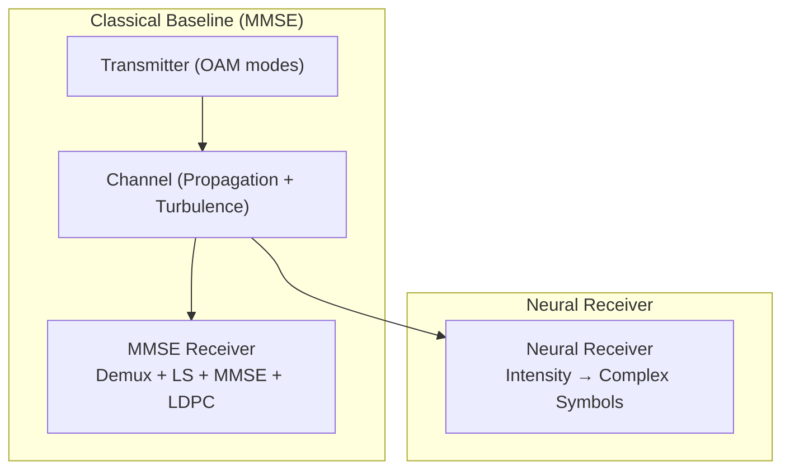
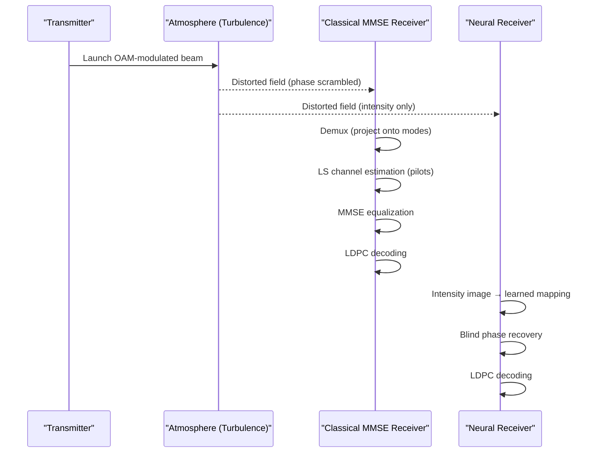
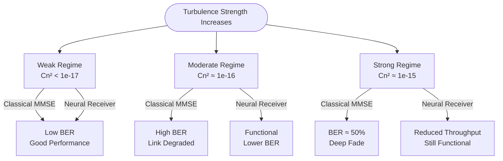
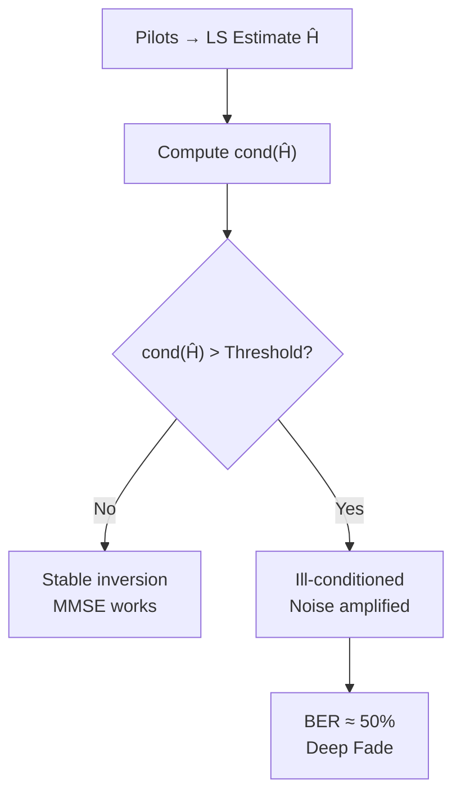
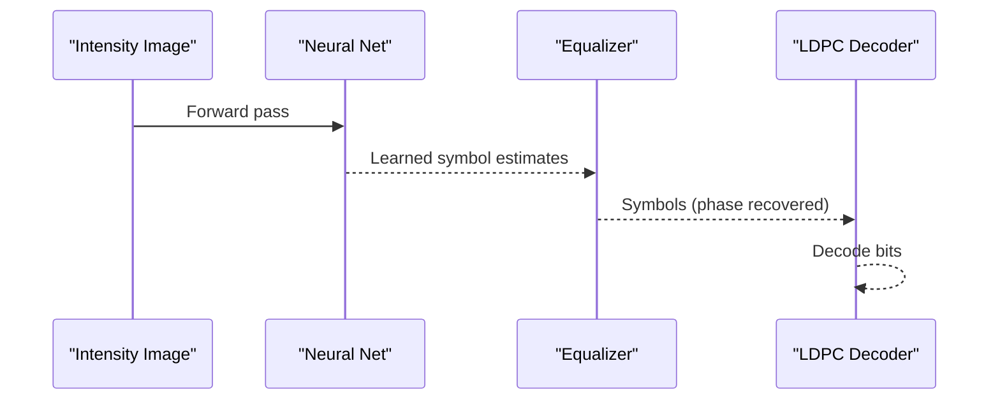
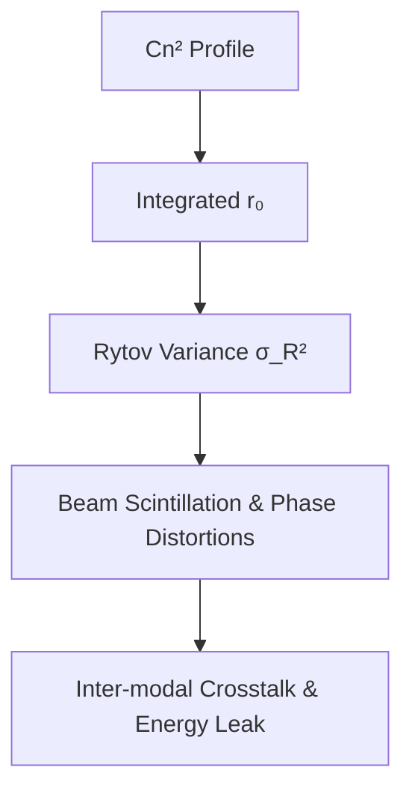
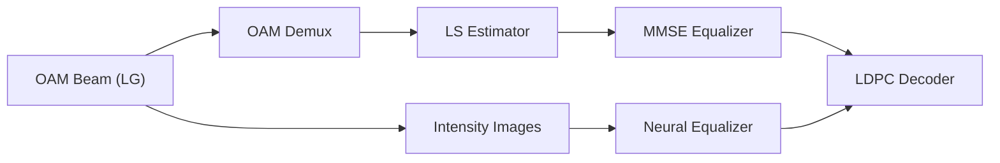

# Introduction and Motivation

<cite>
**Referenced Files in This Document**
- [README.md](file://README.md)
- [MMSE_PERFORMANCE_ANALYSIS.md](file://models/LDPC + Pilot + MMSE trials/cn2_sweep_results/MMSE_PERFORMANCE_ANALYSIS.md)
- [Throughput Analysis.md](file://models/CNN Trials/outputs/reports/Throughput_Analysis.md)
- [fsplAtmAttenuation.py](file://models/LDPC + Pilot + MMSE trials/fsplAtmAttenuation.py)
- [turbulence.py](file://models/LDPC + Pilot + MMSE trials/turbulence.py)
- [receiver.py](file://models/LDPC + Pilot + MMSE trials/receiver.py)
- [lgBeam.py](file://models/CNN Trials/physics/lgBeam.py)
</cite>

## Table of Contents
1. [Introduction](#introduction)
2. [Project Structure](#project-structure)
3. [Core Components](#core-components)
4. [Architecture Overview](#architecture-overview)
5. [Detailed Component Analysis](#detailed-component-analysis)
6. [Dependency Analysis](#dependency-analysis)
7. [Performance Considerations](#performance-considerations)
8. [Troubleshooting Guide](#troubleshooting-guide)
9. [Conclusion](#conclusion)

## Introduction
This document explains the fundamental problem of atmospheric turbulence in free space optical (FSO) communications and why traditional orbital angular momentum (OAM)–based approaches fail in real-world deployments. It introduces the “deep fade” problem, where classical receivers relying on mathematical inversion of the channel (e.g., minimum mean square error, MMSE) become unreliable beyond certain turbulence thresholds. We show how this manifests as a breakdown in link availability and throughput, and why modern neural receivers—trained to recover phase from intensity measurements—can push operational limits far beyond classical capabilities.

- Why OAM FSO systems promise high capacity but often fail in practice
- How atmospheric turbulence destroys the helical wavefront, scrambles phase, and causes inter-modal crosstalk
- Why classical MMSE receivers fail in strong turbulence and plateau at random-guessing performance
- The “deep fade” phenomenon and its practical implications for deployment
- Economic and operational costs of current limitations and how neural receivers address them

## Project Structure
At a high level, this repository compares a classical MMSE receiver baseline against a neural receiver for OAM FSO. The classical baseline uses:
- A physics simulator for turbulence and propagation
- An OAM demultiplexer and LS/MLSE equalizers
- LDPC decoding and BER reporting

The neural receiver replaces equalization with a learned mapping from intensity images to complex QPSK symbols, trained to handle severe turbulence.

[No sources needed since this diagram shows conceptual workflow, not actual code structure]

## Core Components
- OAM multiplexing: Transmits multiple data streams on orthogonal spatial modes (OAM modes). The transmitter encodes QPSK symbols into LG modes and launches them through the atmosphere.
- Atmospheric turbulence: Random refractive-index fluctuations that scramble the wavefront, cause inter-modal crosstalk, and fragment the beam into speckles.
- Classical MMSE receiver: Estimates the channel using pilot symbols, inverts the channel matrix to recover symbols, and decodes with LDPC.
- Neural receiver: Learns to map intensity-only measurements to complex symbols, implicitly recovering phase information and focusing on robust spatial patterns.

**Section sources**
- [README.md](file://README.md#L104-L126)
- [lgBeam.py](file://models/CNN Trials/physics/lgBeam.py#L10-L34)

## Architecture Overview
The classical and neural receivers operate on the same transmitted frames and LDPC structure, differing only in how they estimate symbols from the received field.

[No sources needed since this diagram shows conceptual workflow, not actual code structure]

## Detailed Component Analysis

### The “Deep Fade” Problem in OAM FSO
- Definition: A regime where the channel becomes so ill-conditioned that even perfect LDPC cannot correct the errors, and the link becomes unusable.
- Manifestation: BER plateaus at ~50% (random guessing) for classical receivers in moderate-to-strong turbulence.
- Causes:
  - Phase scrambling destroys the helical wavefront
  - Inter-modal crosstalk couples energy between modes
  - Beam fragmentation into speckles reduces coherent power

**Section sources**
- [MMSE_PERFORMANCE_ANALYSIS.md](file://models/LDPC + Pilot + MMSE trials/cn2_sweep_results/MMSE_PERFORMANCE_ANALYSIS.md#L28-L55)
- [README.md](file://README.md#L108-L126)

### Why Classical MMSE Receivers Fail Beyond Thresholds
- Mathematical inversion: MMSE solves a linear system by inverting the channel matrix H. In strong turbulence, H becomes ill-conditioned (large condition number), causing numerical instability and noise amplification.
- Practical outcome: The receiver saturates at ~50% BER, equivalent to random guessing, regardless of SNR improvements.
- Real-world relevance: Typical atmospheric turbulence exceeds the classical regime in many deployments.

**Section sources**
- [receiver.py](file://models/LDPC + Pilot + MMSE trials/receiver.py#L476-L523)
- [MMSE_PERFORMANCE_ANALYSIS.md](file://models/LDPC + Pilot + MMSE trials/cn2_sweep_results/MMSE_PERFORMANCE_ANALYSIS.md#L69-L77)

### Practical Implications for Deployment
- Link availability plummets in moderate-to-strong turbulence, limiting real-world OAM FSO adoption.
- Economic impact:
  - Increased retransmissions and latency
  - Higher infrastructure redundancy requirements
  - Reduced effective throughput due to outages
- Current workarounds (adaptive optics, short links, intensity-only) add cost and complexity.

**Section sources**
- [Throughput Analysis.md](file://models/CNN Trials/outputs/reports/Throughput_Analysis.md#L24-L54)
- [MMSE_PERFORMANCE_ANALYSIS.md](file://models/LDPC + Pilot + MMSE trials/cn2_sweep_results/MMSE_PERFORMANCE_ANALYSIS.md#L88-L101)

### Neural Receiver: Overcoming the Deep Fade
- Approach: Train a neural network to map distorted intensity images to complex symbols, implicitly recovering phase and focusing on robust spatial patterns.
- Benefits:
  - Pushes operational limits far beyond classical thresholds
  - Enables blind phase recovery from intensity-only measurements
  - Maintains throughput parity with classical systems in weak turbulence

**Section sources**
- [README.md](file://README.md#L128-L157)
- [Throughput Analysis.md](file://models/CNN Trials/outputs/reports/Throughput_Analysis.md#L3-L21)

### Physics of Turbulence and OAM Sensitivity
- Turbulence impacts:
  - Rytov variance scales with path length and Cn²
  - OAM modes are sensitive to phase distortions; higher |l| increases susceptibility
  - Beam quality (M²) further affects intensity variance and scintillation
- The simulator models multi-layer phase screens and angular spectrum propagation to quantify degradation.

**Section sources**
- [turbulence.py](file://models/LDPC + Pilot + MMSE trials/turbulence.py#L108-L184)
- [fsplAtmAttenuation.py](file://models/LDPC + Pilot + MMSE trials/fsplAtmAttenuation.py#L212-L305)

## Dependency Analysis
- Classical receiver depends on:
  - OAM demultiplexer and LS channel estimation
  - MMSE equalization and LDPC decoding
  - Accurate noise variance estimation for MMSE
- Neural receiver depends on:
  - Intensity images from the same propagation pipeline
  - Learned mapping from training to generalize across turbulence strengths

[No sources needed since this diagram shows conceptual workflow, not actual code structure]

## Performance Considerations
- Classical MMSE:
  - Works well for weak turbulence but fails in moderate-to-strong regimes
  - Requires pilots and accurate noise estimates for MMSE
- Neural receiver:
  - Robust across turbulence strengths
  - Maintains peak throughput while extending operating range
  - Enables blind phase recovery from intensity-only measurements

**Section sources**
- [MMSE_PERFORMANCE_ANALYSIS.md](file://models/LDPC + Pilot + MMSE trials/cn2_sweep_results/MMSE_PERFORMANCE_ANALYSIS.md#L14-L55)
- [Throughput Analysis.md](file://models/CNN Trials/outputs/reports/Throughput_Analysis.md#L24-L54)

## Troubleshooting Guide
- Symptoms of deep fade:
  - BER ≈ 50% despite high SNR
  - Large condition number of Ĥ
  - LDPC cannot correct severe error patterns
- Mitigation strategies:
  - Switch to neural receiver for strong turbulence
  - Reduce link distance or improve pointing/track
  - Use WDM or more modes to scale capacity safely

**Section sources**
- [MMSE_PERFORMANCE_ANALYSIS.md](file://models/LDPC + Pilot + MMSE trials/cn2_sweep_results/MMSE_PERFORMANCE_ANALYSIS.md#L28-L55)
- [receiver.py](file://models/LDPC + Pilot + MMSE trials/receiver.py#L476-L523)

## Conclusion
Traditional OAM FSO systems are highly susceptible to atmospheric turbulence because they rely on precise phase information and mathematical inversion of the channel. In moderate-to-strong turbulence, this leads to the “deep fade” problem where links fail and throughput collapses. The neural receiver addresses these limitations by learning to recover phase from intensity-only measurements, enabling robust operation far beyond classical thresholds. This represents a practical upgrade that extends link availability and enables scalable, high-capacity FSO networks in real-world conditions.