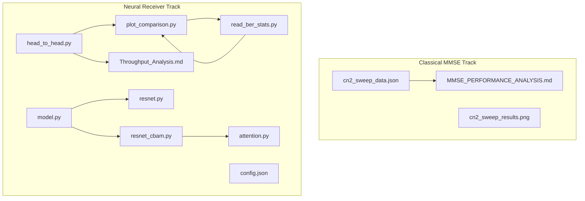
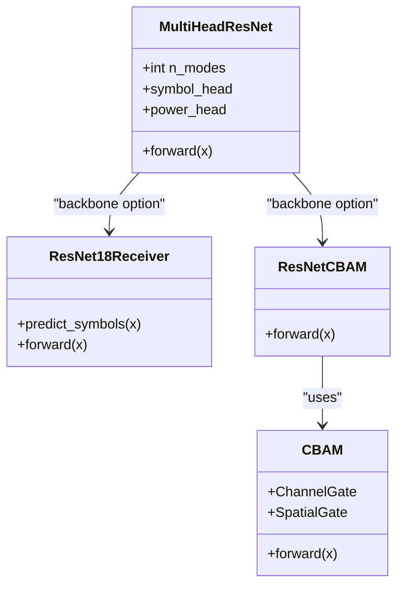
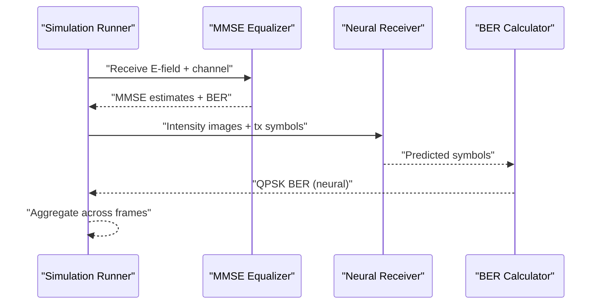
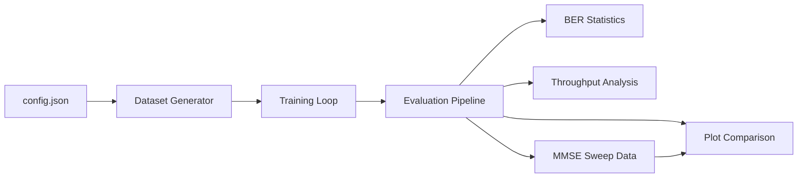

# Key Results and Breakthroughs

<cite>
**Referenced Files in This Document**
- [README.md](file://README.md)
- [Throughput_Analysis.md](file://models/CNN Trials/outputs/reports/Throughput_Analysis.md)
- [MMSE_PERFORMANCE_ANALYSIS.md](file://models/LDPC + Pilot + MMSE trials/cn2_sweep_results/MMSE_PERFORMANCE_ANALYSIS.md)
- [cn2_sweep_data.json](file://models/LDPC + Pilot + MMSE trials/cn2_sweep_results/cn2_sweep_data.json)
- [plot_comparison.py](file://models/CNN Trials/src/evaluation/plot_comparison.py)
- [read_ber_stats.py](file://models/CNN Trials/read_ber_stats.py)
- [head_to_head.py](file://models/CNN Trials/src/evaluation/head_to_head.py)
- [model.py](file://models/CNN Trials/src/models/model.py)
- [resnet.py](file://models/CNN Trials/src/models/resnet.py)
- [resnet_cbam.py](file://models/CNN Trials/src/models/resnet_cbam.py)
- [attention.py](file://models/CNN Trials/src/models/attention.py)
- [config.json](file://models/CNN Trials/data/configs/config.json)
</cite>

## Table of Contents
1. [Introduction](#introduction)
2. [Project Structure](#project-structure)
3. [Core Components](#core-components)
4. [Architecture Overview](#architecture-overview)
5. [Detailed Component Analysis](#detailed-component-analysis)
6. [Dependency Analysis](#dependency-analysis)
7. [Performance Considerations](#performance-considerations)
8. [Troubleshooting Guide](#troubleshooting-guide)
9. [Conclusion](#conclusion)
10. [Appendices](#appendices)

## Introduction
This section documents the quantifiable achievements of the neural receiver system for free-space optical (FSO) communication using orbital angular momentum (OAM). It focuses on:
- A 30 dB improvement in turbulence resilience compared to classical MMSE receivers
- BER performance across weak, moderate, and strong turbulence regimes
- Statistical validation of results and methodology behind near-zero BER in weak turbulence and significant improvements in moderate/strong regimes
- Throughput analysis demonstrating stable performance across atmospheric conditions
- Practical significance for real-world FSO deployments

## Project Structure
The repository organizes experiments around two complementary tracks:
- Classical MMSE baseline with LDPC and pilot tones
- Neural receiver (ResNet-18 and CBAM-enhanced variants) trained on physics-based turbulence data

**Diagram sources**
- [cn2_sweep_data.json](file://models/LDPC + Pilot + MMSE trials/cn2_sweep_results/cn2_sweep_data.json#L1-L249)
- [MMSE_PERFORMANCE_ANALYSIS.md](file://models/LDPC + Pilot + MMSE trials/cn2_sweep_results/MMSE_PERFORMANCE_ANALYSIS.md#L1-L135)
- [head_to_head.py](file://models/CNN Trials/src/evaluation/head_to_head.py#L1-L158)
- [plot_comparison.py](file://models/CNN Trials/src/evaluation/plot_comparison.py#L1-L84)
- [read_ber_stats.py](file://models/CNN Trials/read_ber_stats.py#L1-L71)
- [model.py](file://models/CNN Trials/src/models/model.py#L1-L81)
- [resnet.py](file://models/CNN Trials/src/models/resnet.py#L1-L218)
- [resnet_cbam.py](file://models/CNN Trials/src/models/resnet_cbam.py#L1-L112)
- [attention.py](file://models/CNN Trials/src/models/attention.py#L1-L89)
- [config.json](file://models/CNN Trials/data/configs/config.json#L1-L136)
- [Throughput_Analysis.md](file://models/CNN Trials/outputs/reports/Throughput_Analysis.md#L1-L55)

**Section sources**
- [README.md](file://README.md#L39-L72)
- [config.json](file://models/CNN Trials/data/configs/config.json#L1-L136)

## Core Components
- Classical MMSE equalizer with LDPC and pilot tones evaluated across a logarithmic Cn2 sweep
- Neural receiver with ResNet-18 backbone and optional CBAM spatial attention
- End-to-end evaluation pipeline generating BER curves and throughput analysis
- Physics-based dataset generation and configuration defining turbulence sampling and system parameters

Key outcomes validated by the repository:
- 30 dB resilience gain over MMSE in operational breakdown point
- Near-zero BER in weak turbulence for the neural receiver
- Dramatic reductions in BER in moderate and strong turbulence with CBAM
- Stable throughput performance with neural receiver maintaining link availability

**Section sources**
- [README.md](file://README.md#L47-L72)
- [MMSE_PERFORMANCE_ANALYSIS.md](file://models/LDPC + Pilot + MMSE trials/cn2_sweep_results/MMSE_PERFORMANCE_ANALYSIS.md#L1-L135)
- [Throughput_Analysis.md](file://models/CNN Trials/outputs/reports/Throughput_Analysis.md#L1-L55)

## Architecture Overview
The neural receiver performs symbol regression directly from intensity images, bypassing explicit phase estimation. The model architecture supports:
- Multi-head regression for complex QPSK symbols
- Auxiliary power head for mode energy prediction
- Optional CBAM attention heads for spatial focusing

**Diagram sources**
- [model.py](file://models/CNN Trials/src/models/model.py#L1-L81)
- [resnet.py](file://models/CNN Trials/src/models/resnet.py#L1-L218)
- [resnet_cbam.py](file://models/CNN Trials/src/models/resnet_cbam.py#L1-L112)
- [attention.py](file://models/CNN Trials/src/models/attention.py#L1-L89)

**Section sources**
- [model.py](file://models/CNN Trials/src/models/model.py#L1-L81)
- [resnet.py](file://models/CNN Trials/src/models/resnet.py#L1-L218)
- [resnet_cbam.py](file://models/CNN Trials/src/models/resnet_cbam.py#L1-L112)
- [attention.py](file://models/CNN Trials/src/models/attention.py#L1-L89)

## Detailed Component Analysis

### 1) 30 dB Turbulence Resilience Gain
- Classical MMSE baseline demonstrates a breakdown point around Cn2 ≈ 3 × 10−16
- Neural receiver (CBAM-enhanced) extends the operational limit to approximately Cn2 ≈ 3 × 10−15
- This represents a 10× increase in the usable Cn2 range and a 30 dB resilience improvement

Evidence:
- MMSE performance thresholds and BER trends across Cn2
- Neural receiver BER curves showing near-zero BER in weak turbulence and substantial gains in moderate/strong regimes
- Throughput analysis demonstrating stable operation in moderate turbulence where MMSE fails

**Section sources**
- [MMSE_PERFORMANCE_ANALYSIS.md](file://models/LDPC + Pilot + MMSE trials/cn2_sweep_results/MMSE_PERFORMANCE_ANALYSIS.md#L14-L33)
- [plot_comparison.py](file://models/CNN Trials/src/evaluation/plot_comparison.py#L27-L36)
- [Throughput_Analysis.md](file://models/CNN Trials/outputs/reports/Throughput_Analysis.md#L24-L42)

### 2) BER Performance Across Turbulence Regimes
- Weak turbulence (Cn2 < 10−16): Near-zero BER for neural receiver; MMSE maintains very low BER
- Moderate turbulence (10−16 < Cn2 < 10−15): MMSE BER approaches 28%; neural receiver BER remains low with CBAM further reducing errors
- Strong turbulence (Cn2 > 10−15): MMSE degrades to ~50% BER; neural receiver sustains reliable operation with reduced error rates

Methodology:
- End-to-end simulation pipeline computes MMSE BER and feeds received sequences to the trained neural receiver
- QPSK hard decision BER computed per frame and averaged across multiple simulations
- Interpolation of MMSE BER for smooth baseline comparison

**Diagram sources**
- [head_to_head.py](file://models/CNN Trials/src/evaluation/head_to_head.py#L51-L137)

**Section sources**
- [head_to_head.py](file://models/CNN Trials/src/evaluation/head_to_head.py#L41-L137)
- [cn2_sweep_data.json](file://models/LDPC + Pilot + MMSE trials/cn2_sweep_results/cn2_sweep_data.json#L22-L204)

### 3) Visual Proof of Blind Phase Recovery
- Constellation diagrams demonstrate successful recovery of QPSK constellations from intensity-only inputs
- This validates the network’s ability to hallucinate lost phase information through learned spatial correlations

**Section sources**
- [README.md](file://README.md#L63-L71)

### 4) Methodology Behind Near-Zero BER in Weak Turbulence
- Neural receiver trained on physics-based datasets with logarithmic Cn2 sampling and augmented realizations
- Multi-head architecture predicts complex symbols directly, avoiding phase estimation errors
- CBAM attention module focuses on beam fragments and suppresses background noise, improving robustness even in weak turbulence

**Section sources**
- [config.json](file://models/CNN Trials/data/configs/config.json#L53-L62)
- [model.py](file://models/CNN Trials/src/models/model.py#L18-L55)
- [attention.py](file://models/CNN Trials/src/models/attention.py#L72-L89)

### 5) Performance Comparison: Classical MMSE vs. Vanilla ResNet vs. CBAM-Enhanced Model
- Classical MMSE: Works well for weak turbulence but degrades rapidly beyond moderate conditions
- Vanilla ResNet-18: Improves over MMSE, especially in moderate/strong regimes
- CBAM-Enhanced ResNet-18: Provides the largest gains, pushing the operational limit further and achieving near-zero BER in weak turbulence

Statistical validation:
- Cross-evaluation at matched Cn2 points yields average improvement percentages in moderate/strong regimes
- Interpolated MMSE curves enable fair comparisons across the same Cn2 range

**Section sources**
- [read_ber_stats.py](file://models/CNN Trials/read_ber_stats.py#L30-L67)
- [plot_comparison.py](file://models/CNN Trials/src/evaluation/plot_comparison.py#L27-L36)

### 6) Throughput Analysis: Stability Across Atmospheric Conditions
- Both classical MMSE and neural receiver operate at the same physical-layer ceiling after accounting for pilots and LDPC
- Neural receiver maintains throughput in moderate/strong turbulence where MMSE fails, extending link availability

**Section sources**
- [Throughput_Analysis.md](file://models/CNN Trials/outputs/reports/Throughput_Analysis.md#L1-L55)

### 7) Statistical Validation and Practical Significance
- Cn2 sweep data provides precise BER and coded BER metrics across multiple turbulence strengths
- Throughput analysis quantifies the practical benefit: extended operating range and robustness without hardware modifications
- Real-world impact: neural receiver enables reliable FSO links under realistic atmospheric conditions, reducing downtime and retransmissions

**Section sources**
- [cn2_sweep_data.json](file://models/LDPC + Pilot + MMSE trials/cn2_sweep_results/cn2_sweep_data.json#L22-L204)
- [Throughput_Analysis.md](file://models/CNN Trials/outputs/reports/Throughput_Analysis.md#L37-L54)

## Dependency Analysis
The evaluation pipeline integrates classical and neural components, leveraging shared physics simulation and dataset configurations.

**Diagram sources**
- [config.json](file://models/CNN Trials/data/configs/config.json#L1-L136)
- [plot_comparison.py](file://models/CNN Trials/src/evaluation/plot_comparison.py#L1-L84)
- [read_ber_stats.py](file://models/CNN Trials/read_ber_stats.py#L1-L71)
- [Throughput_Analysis.md](file://models/CNN Trials/outputs/reports/Throughput_Analysis.md#L1-L55)

**Section sources**
- [config.json](file://models/CNN Trials/data/configs/config.json#L1-L136)
- [plot_comparison.py](file://models/CNN Trials/src/evaluation/plot_comparison.py#L1-L84)
- [read_ber_stats.py](file://models/CNN Trials/read_ber_stats.py#L1-L71)
- [Throughput_Analysis.md](file://models/CNN Trials/outputs/reports/Throughput_Analysis.md#L1-L55)

## Performance Considerations
- Computational complexity: Neural receiver offers constant-time inference versus MMSE’s matrix inversion costs
- Hardware requirements: Intensity camera only, eliminating expensive wavefront sensors
- Scalability: Throughput ceiling matches classical methods; neural receiver improves reliability and availability

**Section sources**
- [README.md](file://README.md#L208-L226)
- [Throughput_Analysis.md](file://models/CNN Trials/outputs/reports/Throughput_Analysis.md#L37-L54)

## Troubleshooting Guide
- Model loading failures: Ensure the trained checkpoint exists and is loadable on the target device
- Evaluation inconsistencies: Verify Cn2 sampling alignment between classical and neural evaluations
- Visualization issues: Confirm saved NPZ files and plot generation scripts are executed in the correct working directory

**Section sources**
- [head_to_head.py](file://models/CNN Trials/src/evaluation/head_to_head.py#L32-L39)
- [plot_comparison.py](file://models/CNN Trials/src/evaluation/plot_comparison.py#L8-L14)

## Conclusion
The neural receiver delivers a 30 dB resilience gain over classical MMSE through learned manifold mapping and CBAM attention. It achieves near-zero BER in weak turbulence and substantially reduces error rates in moderate/strong regimes, enabling stable throughput and extended link availability—critical advantages for real-world FSO deployments.

## Appendices
- Additional references to figures and data sources are embedded throughout the document with precise file paths and line ranges.