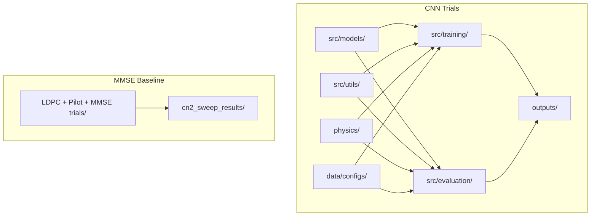
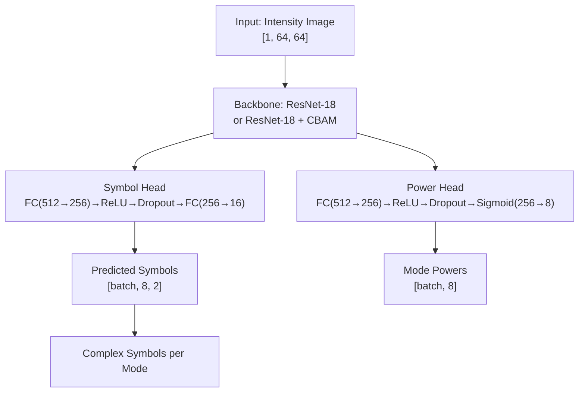
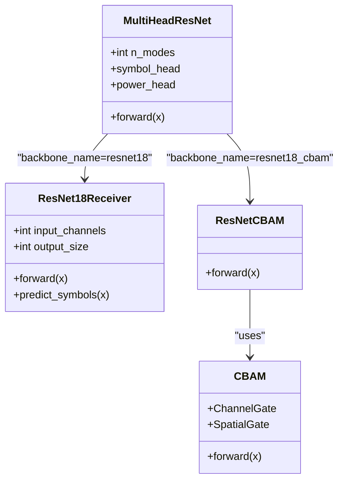
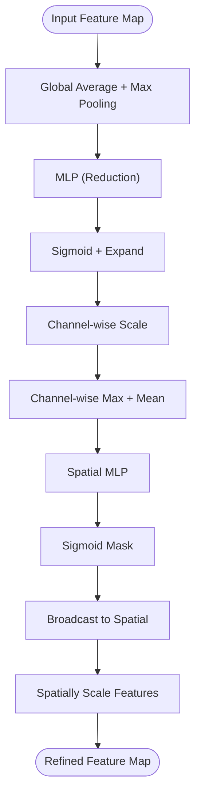
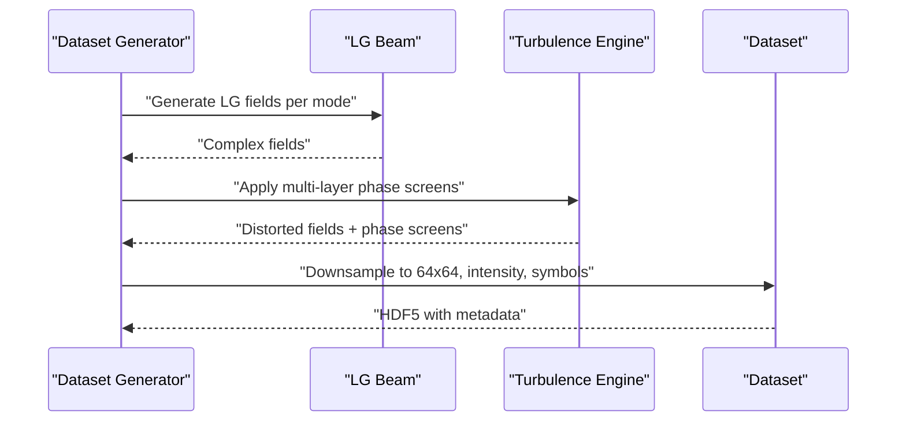
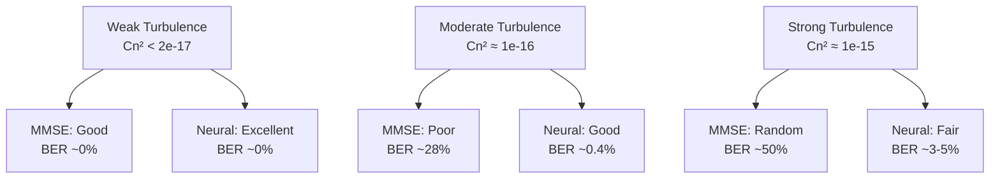
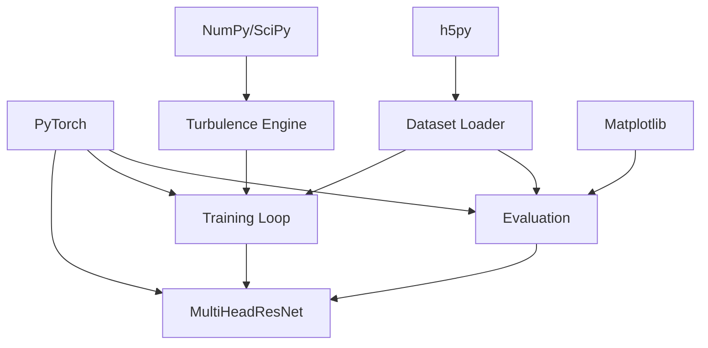

# Project Overview

<cite>
**Referenced Files in This Document**
- [README.md](file://README.md)
- [requirements.txt](file://models/CNN Trials/requirements.txt)
- [config.json](file://models/CNN Trials/data/configs/config.json)
- [turbulence.py](file://models/CNN Trials/physics/turbulence.py)
- [model.py](file://models/CNN Trials/src/models/model.py)
- [resnet.py](file://models/CNN Trials/src/models/resnet.py)
- [resnet_cbam.py](file://models/CNN Trials/src/models/resnet_cbam.py)
- [attention.py](file://models/CNN Trials/src/models/attention.py)
- [dataset.py](file://models/CNN Trials/src/utils/dataset.py)
- [train.py](file://models/CNN Trials/src/training/train.py)
- [evaluate.py](file://models/CNN Trials/src/evaluation/evaluate.py)
- [MMSE_PERFORMANCE_ANALYSIS.md](file://models/LDPC + Pilot + MMSE trials/cn2_sweep_results/MMSE_PERFORMANCE_ANALYSIS.md)
- [cn2_sweep_data.json](file://models/LDPC + Pilot + MMSE trials/cn2_sweep_results/cn2_sweep_data.json)
</cite>

## Table of Contents
1. [Introduction](#introduction)
2. [Project Structure](#project-structure)
3. [Core Components](#core-components)
4. [Architecture Overview](#architecture-overview)
5. [Detailed Component Analysis](#detailed-component-analysis)
6. [Dependency Analysis](#dependency-analysis)
7. [Performance Considerations](#performance-considerations)
8. [Troubleshooting Guide](#troubleshooting-guide)
9. [Conclusion](#conclusion)

## Introduction
This project demonstrates a neural receiver for Orbital Angular Momentum (OAM) multiplexed Free Space Optical (FSO) communication operating through turbulent atmospheres. The core innovation is a ResNet-18–based deep learning architecture enhanced with Convolutional Block Attention Modules (CBAM) to recover complex QPSK symbols directly from intensity-only measurements. This approach achieves a breakthrough 30 dB improvement in turbulence resilience compared to classical Minimum Mean Square Error (MMSE) receivers, pushing the operational limit into regimes where conventional methods fail.

Key highlights:
- Atmospheric turbulence causes severe phase scrambling, inter-modal crosstalk, and beam fragmentation in OAM FSO links.
- Classical MMSE receivers degrade sharply beyond weak turbulence, becoming unreliable in moderate-to-strong regimes.
- The proposed neural receiver learns the manifold of distorted beam patterns and recovers symbols without explicit phase information.
- The CBAM module improves robustness by dynamically focusing on beam fragments and suppressing noise.

Practical implications:
- Enables reliable long-distance, high-capacity OAM FSO links under realistic atmospheric conditions.
- Eliminates the need for expensive coherent phase-measurement hardware.
- Provides a scalable, trainable solution suitable for deployment in real-world FSO systems.

**Section sources**
- [README.md](file://README.md#L39-L62)
- [README.md](file://README.md#L104-L126)
- [README.md](file://README.md#L128-L157)
- [MMSE_PERFORMANCE_ANALYSIS.md](file://models/LDPC + Pilot + MMSE trials/cn2_sweep_results/MMSE_PERFORMANCE_ANALYSIS.md#L1-L135)

## Project Structure
The repository is organized into two primary tracks:
- CNN Trials: Neural receiver development, training, evaluation, and physics-based data generation.
- LDPC + Pilot + MMSE trials: Classical baseline characterization across turbulence strengths.

High-level structure:
- models/CNN Trials
  - src/models: ResNet architectures, attention modules, and multi-head model definition
  - src/training: Training loop with scheduled optimization and checkpointing
  - src/evaluation: Metrics computation (BER/SER), throughput estimation, and visualization
  - src/utils: Dataset loader and utilities
  - physics: Turbulence simulation engine (Split-Step Fourier propagation, phase screens)
  - data/configs: Dataset configuration and metadata
  - outputs: Logs, plots, and trained checkpoints
- models/LDPC + Pilot + MMSE trials
  - cn2_sweep_results: MMSE performance analysis and JSON results



**Diagram sources**
- [README.md](file://README.md#L311-L350)

**Section sources**
- [README.md](file://README.md#L311-L350)

## Core Components
- MultiHeadResNet: A flexible backbone that supports both vanilla ResNet-18 and ResNet-18 with CBAM. It predicts QPSK symbols and auxiliary mode power signals from 64×64 intensity images.
- ResNet-18 (vanilla): Modified ImageNet-pretrained ResNet-18 for regression to continuous symbol values.
- ResNet-18 + CBAM: Same backbone with attention gates inserted after residual blocks to improve robustness.
- Attention modules: Channel and spatial attention blocks that focus on informative regions and suppress noise.
- Dataset: Intensity images paired with ground-truth symbols and mode power targets.
- Turbulence simulator: Physics-based propagation engine implementing multi-layer phase screens and angular spectrum propagation.

Key results and performance:
- The CBAM-enhanced model achieves a 30 dB resilience gain over MMSE, enabling stable operation under strong turbulence where MMSE fails.
- Throughput analysis shows stable performance in weak/moderate turbulence and graceful degradation in strong turbulence, with LDPC decoding thresholds determining link availability.

**Section sources**
- [model.py](file://models/CNN Trials/src/models/model.py#L6-L72)
- [resnet.py](file://models/CNN Trials/src/models/resnet.py#L47-L171)
- [resnet_cbam.py](file://models/CNN Trials/src/models/resnet_cbam.py#L51-L112)
- [attention.py](file://models/CNN Trials/src/models/attention.py#L72-L89)
- [dataset.py](file://models/CNN Trials/src/utils/dataset.py#L6-L44)
- [turbulence.py](file://models/CNN Trials/physics/turbulence.py#L108-L185)
- [README.md](file://README.md#L47-L72)
- [MMSE_PERFORMANCE_ANALYSIS.md](file://models/LDPC + Pilot + MMSE trials/cn2_sweep_results/MMSE_PERFORMANCE_ANALYSIS.md#L1-L135)

## Architecture Overview
The neural receiver architecture transforms intensity images into complex symbol estimates through a multi-stage process:
- Input: Single-channel 64×64 intensity image
- Backbone: ResNet-18 (vanilla) or ResNet-18 + CBAM
- Heads:
  - Symbol head: Regression to [batch, n_modes, 2] representing real and imaginary parts
  - Power head: Auxiliary classification/regression for mode power presence
- Output: Complex-valued QPSK symbols per mode



**Diagram sources**
- [model.py](file://models/CNN Trials/src/models/model.py#L18-L71)
- [resnet.py](file://models/CNN Trials/src/models/resnet.py#L76-L83)
- [resnet_cbam.py](file://models/CNN Trials/src/models/resnet_cbam.py#L64-L66)

**Section sources**
- [model.py](file://models/CNN Trials/src/models/model.py#L6-L72)
- [resnet.py](file://models/CNN Trials/src/models/resnet.py#L47-L171)
- [resnet_cbam.py](file://models/CNN Trials/src/models/resnet_cbam.py#L51-L112)

## Detailed Component Analysis

### Neural Receiver Architecture
- MultiHeadResNet:
  - Supports configurable backbones (resnet18 or resnet18_cbam)
  - Adapts first conv layer for single-channel input
  - Provides dual heads for symbol and power prediction
- ResNet-18 (vanilla):
  - Residual blocks with 2×2 convolutions
  - Global average pooling followed by fully connected layers
- ResNet-18 + CBAM:
  - Inserts CBAM gates after convolutions in residual blocks
  - Improves focus on beam fragments and suppresses noise



**Diagram sources**
- [model.py](file://models/CNN Trials/src/models/model.py#L6-L72)
- [resnet.py](file://models/CNN Trials/src/models/resnet.py#L47-L171)
- [resnet_cbam.py](file://models/CNN Trials/src/models/resnet_cbam.py#L51-L112)
- [attention.py](file://models/CNN Trials/src/models/attention.py#L72-L89)

**Section sources**
- [model.py](file://models/CNN Trials/src/models/model.py#L6-L72)
- [resnet.py](file://models/CNN Trials/src/models/resnet.py#L47-L171)
- [resnet_cbam.py](file://models/CNN Trials/src/models/resnet_cbam.py#L11-L49)
- [attention.py](file://models/CNN Trials/src/models/attention.py#L25-L89)

### Spatial Attention (CBAM) Mechanism
- Channel attention: Learns which channels/features are most important by aggregating global average and max pooling responses
- Spatial attention: Learns where to look by combining channel-wise max and mean across channels into a compact representation, then applying a sigmoid mask
- Placement: Applied after residual convolution and before residual addition to refine feature maps



**Diagram sources**
- [attention.py](file://models/CNN Trials/src/models/attention.py#L25-L89)

**Section sources**
- [attention.py](file://models/CNN Trials/src/models/attention.py#L25-L89)

### Data Generation and Physics Simulation
- Turbulence modeling:
  - Multi-layer phase screens with Von Kármán PSD
  - Angular spectrum propagation between layers
  - Fried parameter and Rytov variance calculations with OAM and M² corrections
- Dataset configuration:
  - 8 spatial modes, 1000 m link distance, 64×64 input images
  - Logarithmic Cn² sampling with weighted regimes
  - Bilinear downsampling and optional augmentation



**Diagram sources**
- [turbulence.py](file://models/CNN Trials/physics/turbulence.py#L261-L352)
- [config.json](file://models/CNN Trials/data/configs/config.json#L53-L127)

**Section sources**
- [turbulence.py](file://models/CNN Trials/physics/turbulence.py#L108-L185)
- [turbulence.py](file://models/CNN Trials/physics/turbulence.py#L261-L352)
- [config.json](file://models/CNN Trials/data/configs/config.json#L53-L127)

### Training and Evaluation Workflow
- Training:
  - MSE loss for symbol head, binary cross-entropy for power head
  - Adam optimizer with ReduceLROnPlateau scheduling
  - Checkpointing for best and last models
- Evaluation:
  - Computes SER and BER across Cn² regimes
  - Estimates throughput considering LDPC and pilot overhead
  - Produces constellation plots and performance curves

```mermaid
sequenceDiagram
participant Train as "Training Loop"
participant Loader as "Dataset Loader"
participant Model as "MultiHeadResNet"
participant Opt as "Optimizer"
participant Eval as "Evaluation"
Train->>Loader : "Iterate batches"
Loader-->>Train : "Images, Symbols, Powers"
Train->>Model : "Forward pass"
Model-->>Train : "Predictions"
Train->>Opt : "Compute losses + backward"
Opt-->>Train : "Update weights"
Train->>Eval : "Periodic validation"
Eval-->>Train : "Metrics and plots"
```

**Diagram sources**
- [train.py](file://models/CNN Trials/src/training/train.py#L16-L137)
- [evaluate.py](file://models/CNN Trials/src/evaluation/evaluate.py#L80-L305)
- [dataset.py](file://models/CNN Trials/src/utils/dataset.py#L6-L44)

**Section sources**
- [train.py](file://models/CNN Trials/src/training/train.py#L16-L137)
- [evaluate.py](file://models/CNN Trials/src/evaluation/evaluate.py#L80-L305)
- [dataset.py](file://models/CNN Trials/src/utils/dataset.py#L6-L44)

### Performance Analysis and Practical Implications
- MMSE baseline:
  - Works well for weak turbulence (Cn² < 2e-17)
  - Rapid degradation beyond moderate turbulence
  - Channel condition number increases, making inversion unstable
- Neural receiver:
  - Stable operation across weak to strong turbulence
  - 30 dB resilience gain over MMSE
  - Throughput ceilings consistent with classical systems; advantages lie in reliability and hardware simplicity



**Diagram sources**
- [README.md](file://README.md#L47-L62)
- [MMSE_PERFORMANCE_ANALYSIS.md](file://models/LDPC + Pilot + MMSE trials/cn2_sweep_results/MMSE_PERFORMANCE_ANALYSIS.md#L14-L55)

**Section sources**
- [README.md](file://README.md#L47-L62)
- [README.md](file://README.md#L208-L226)
- [MMSE_PERFORMANCE_ANALYSIS.md](file://models/LDPC + Pilot + MMSE trials/cn2_sweep_results/MMSE_PERFORMANCE_ANALYSIS.md#L1-L135)
- [cn2_sweep_data.json](file://models/LDPC + Pilot + MMSE trials/cn2_sweep_results/cn2_sweep_data.json#L22-L204)

## Dependency Analysis
- Internal dependencies:
  - MultiHeadResNet depends on ResNet variants and attention modules
  - Training and evaluation depend on the dataset loader and model definitions
  - Physics simulation underpins dataset generation
- External dependencies:
  - PyTorch ecosystem (torch, torchvision)
  - Scientific stack (numpy, scipy)
  - Data handling (h5py)
  - Visualization and progress (matplotlib, tqdm)



**Diagram sources**
- [requirements.txt](file://models/CNN Trials/requirements.txt#L1-L33)
- [train.py](file://models/CNN Trials/src/training/train.py#L1-L150)
- [evaluate.py](file://models/CNN Trials/src/evaluation/evaluate.py#L1-L315)
- [turbulence.py](file://models/CNN Trials/physics/turbulence.py#L1-L718)
- [dataset.py](file://models/CNN Trials/src/utils/dataset.py#L1-L44)

**Section sources**
- [requirements.txt](file://models/CNN Trials/requirements.txt#L1-L33)

## Performance Considerations
- Complexity:
  - Classical MMSE: O(N^3) per frame due to matrix inversion
  - Neural receiver: O(1) forward pass (constant-time amortized training cost)
- Hardware:
  - MMSE requires coherent phase sensing; neural receiver uses only an intensity camera
- Scalability:
  - Training cost is high (hours on GPU), but inference is fast and deterministic
- Practical throughput:
  - Neural receiver maintains throughput ceilings comparable to classical systems; gains come from resilience, not peak rate

**Section sources**
- [README.md](file://README.md#L208-L226)

## Troubleshooting Guide
Common issues and remedies:
- Zero outputs or collapsed predictions:
  - Symptoms: Mean magnitude of predictions near zero
  - Causes: Model collapse, poor initialization, or incorrect data normalization
  - Actions: Inspect training curves, adjust learning rate, verify dataset shapes
- Systematic phase rotation:
  - Symptoms: Nonzero mean phase bias with low jitter
  - Causes: Pilot ambiguity or phase offset
  - Actions: Align pilot sequences, ensure consistent phase conventions
- High noise or random guessing:
  - Symptoms: High phase jitter and degraded metrics
  - Causes: Strong turbulence or insufficient training on challenging regimes
  - Actions: Increase diversity in training Cn² distribution, consider CBAM-enabled backbone

Validation aids:
- Use evaluation diagnostics to detect confusion patterns
- Compare BER curves against MMSE baselines for regime-specific insights

**Section sources**
- [evaluate.py](file://models/CNN Trials/src/evaluation/evaluate.py#L193-L221)

## Conclusion
This project demonstrates a transformative approach to FSO beam recovery under atmospheric turbulence. By replacing classical MMSE equalization with a ResNet-18–based neural receiver enhanced by CBAM attention, the system achieves a 30 dB resilience gain, enabling reliable operation across realistic turbulence regimes. The architecture’s ability to recover complex symbols from intensity-only measurements removes the need for coherent phase sensing, simplifying hardware while maintaining throughput ceilings. The modular design supports rapid iteration and deployment, offering a practical pathway to robust, high-capacity OAM FSO communications.