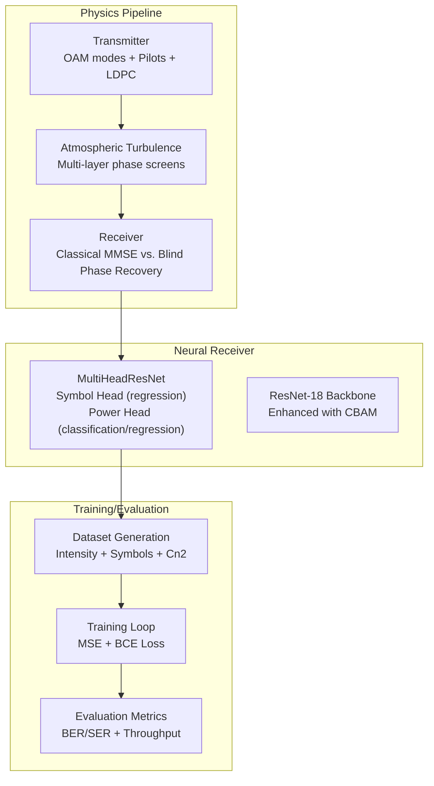
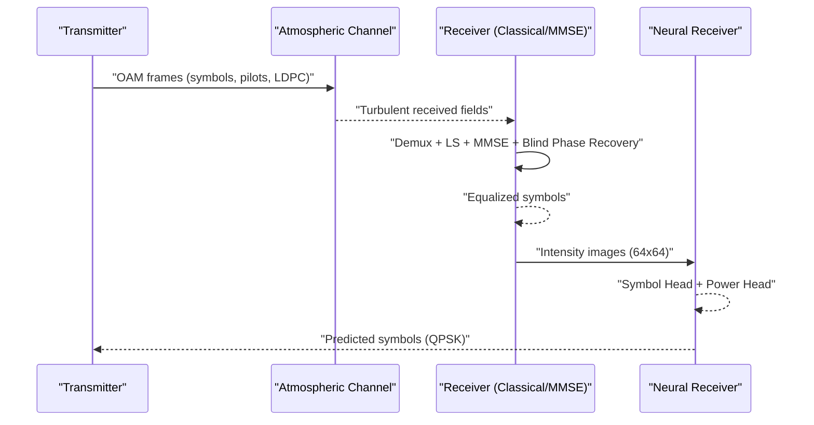
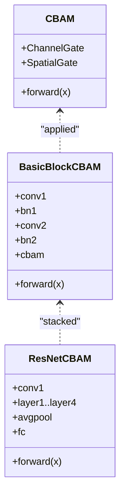
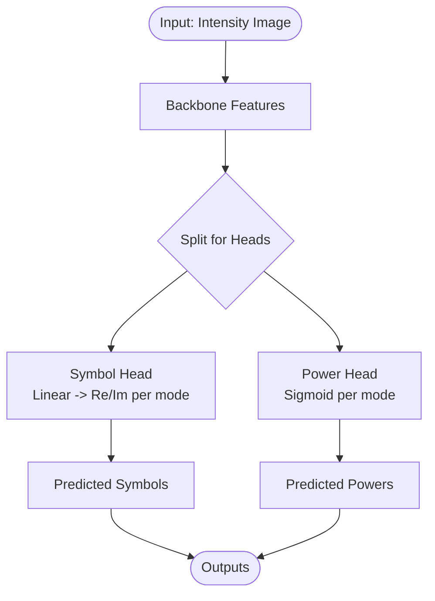
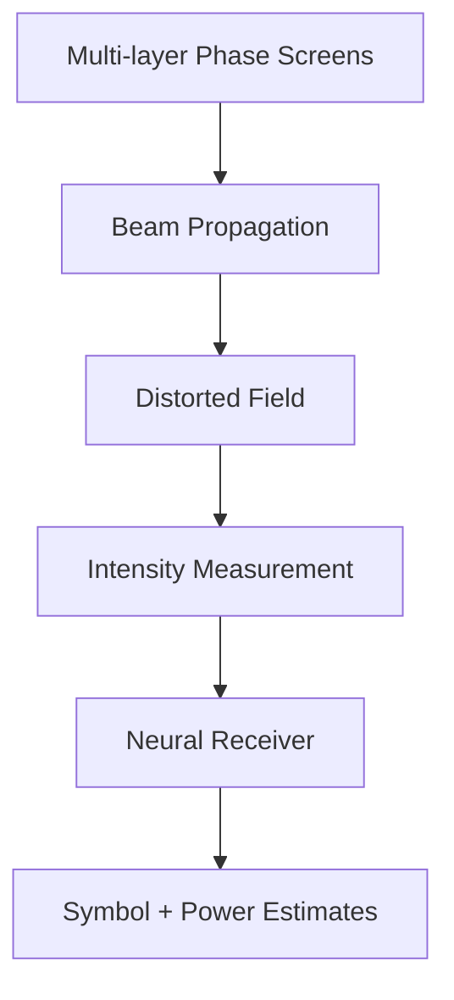
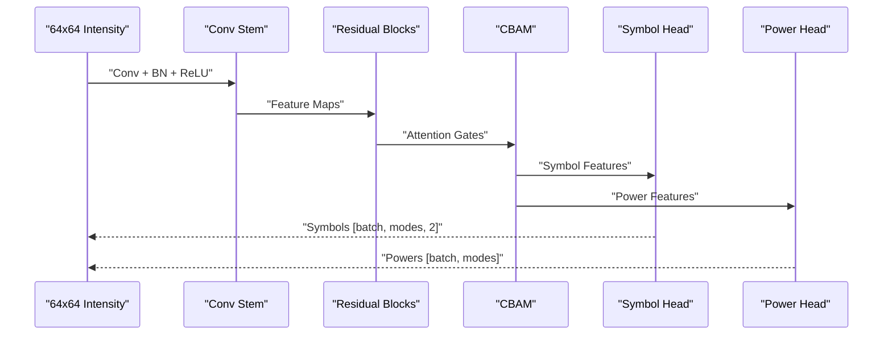
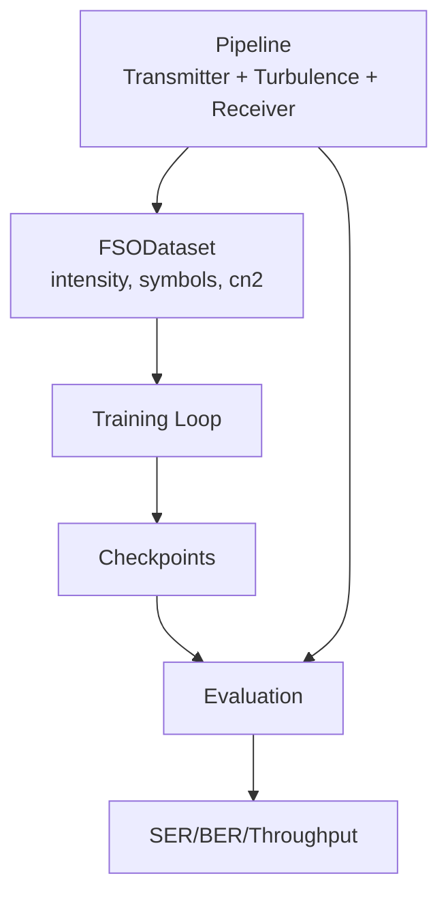

# Solution Approach

<cite>
**Referenced Files in This Document**
- [resnet_cbam.py](file://models/CNN Trials/src/models/resnet_cbam.py)
- [resnet.py](file://models/CNN Trials/src/models/resnet.py)
- [model.py](file://models/CNN Trials/src/models/model.py)
- [attention.py](file://models/CNN Trials/src/models/attention.py)
- [train.py](file://models/CNN Trials/src/training/train.py)
- [evaluate.py](file://models/CNN Trials/src/evaluation/evaluate.py)
- [utils.py](file://models/CNN Trials/src/utils/utils.py)
- [dataset.py](file://models/CNN Trials/src/utils/dataset.py)
- [pipeline.py](file://models/CNN Trials/physics/pipeline.py)
- [receiver.py](file://models/CNN Trials/physics/receiver.py)
- [turbulence.py](file://models/CNN Trials/physics/turbulence.py)
- [generate_dataset.py](file://models/CNN Trials/src/data_gen/generate_dataset.py)
- [config.json](file://models/CNN Trials/data/configs/config.json)
- [Throughput_Analysis.md](file://models/CNN Trials/outputs/reports/Throughput_Analysis.md)
- [head_to_head.py](file://models/CNN Trials/src/evaluation/head_to_head.py)
</cite>

## Table of Contents
1. [Introduction](#introduction)
2. [Project Structure](#project-structure)
3. [Core Components](#core-components)
4. [Architecture Overview](#architecture-overview)
5. [Detailed Component Analysis](#detailed-component-analysis)
6. [Dependency Analysis](#dependency-analysis)
7. [Performance Considerations](#performance-considerations)
8. [Troubleshooting Guide](#troubleshooting-guide)
9. [Conclusion](#conclusion)
10. [Appendices](#appendices)

## Introduction
This document presents the solution approach for a novel neural receiver architecture designed for free-space optics (FSO) orbital angular momentum (OAM) communication. The approach represents a paradigm shift from classical mathematical channel inversion to a learned manifold mapping that recovers phase information from purely intensity measurements. The core innovation lies in a multi-head CNN that jointly predicts QPSK symbols (real and imaginary parts) and per-mode power, leveraging a ResNet-18 backbone enhanced with convolutional block attention modules (CBAM) to improve robustness against atmospheric turbulence. The methodology is grounded in physics-based simulation, end-to-end dataset generation, and rigorous evaluation against classical MMSE receivers.

## Project Structure
The solution is organized around three pillars:
- Neural Receiver: A multi-head CNN that regresses symbols and power from 64x64 intensity images.
- Physics Pipeline: A full-wave simulation stack that generates realistic FSO-OAM frames corrupted by atmospheric turbulence.
- Evaluation and Training: End-to-end workflows for training, evaluation, and head-to-head comparisons with classical receivers.

**Diagram sources**
- [model.py](file://models/CNN Trials/src/models/model.py#L6-L71)
- [resnet_cbam.py](file://models/CNN Trials/src/models/resnet_cbam.py#L51-L111)
- [pipeline.py](file://models/CNN Trials/physics/pipeline.py#L64-L200)
- [receiver.py](file://models/CNN Trials/physics/receiver.py#L370-L712)
- [generate_dataset.py](file://models/CNN Trials/src/data_gen/generate_dataset.py#L57-L175)
- [train.py](file://models/CNN Trials/src/training/train.py#L16-L137)
- [evaluate.py](file://models/CNN Trials/src/evaluation/evaluate.py#L80-L315)

**Section sources**
- [model.py](file://models/CNN Trials/src/models/model.py#L6-L71)
- [resnet_cbam.py](file://models/CNN Trials/src/models/resnet_cbam.py#L51-L111)
- [pipeline.py](file://models/CNN Trials/physics/pipeline.py#L64-L200)
- [generate_dataset.py](file://models/CNN Trials/src/data_gen/generate_dataset.py#L57-L175)
- [train.py](file://models/CNN Trials/src/training/train.py#L16-L137)
- [evaluate.py](file://models/CNN Trials/src/evaluation/evaluate.py#L80-L315)

## Core Components
- Multi-Head ResNet-18: A compact CNN that replaces classical channel inversion with learned regression. The backbone accepts 64x64 single-channel intensity images and produces:
  - Symbol Head: Real and imaginary parts for each of the 8 OAM modes.
  - Power Head: Per-mode power (sigmoid-scaled) to assist symbol recovery.
- CBAM Enhancement: Spatial and channel attention gates improve robustness to turbulence by focusing on beam fragments and suppressing noise.
- Training and Evaluation: Joint MSE and binary cross-entropy losses, with evaluation reporting SER/BER and throughput curves across turbulence strengths.

Key implementation references:
- Multi-head architecture and heads: [model.py](file://models/CNN Trials/src/models/model.py#L6-L71)
- ResNet-18 backbone (standard and CBAM variants): [resnet.py](file://models/CNN Trials/src/models/resnet.py#L47-L148), [resnet_cbam.py](file://models/CNN Trials/src/models/resnet_cbam.py#L51-L111)
- Attention modules (CBAM): [attention.py](file://models/CNN Trials/src/models/attention.py#L72-L89)
- Training loop and losses: [train.py](file://models/CNN Trials/src/training/train.py#L16-L137)
- Evaluation metrics and throughput analysis: [evaluate.py](file://models/CNN Trials/src/evaluation/evaluate.py#L12-L315)

**Section sources**
- [model.py](file://models/CNN Trials/src/models/model.py#L6-L71)
- [resnet.py](file://models/CNN Trials/src/models/resnet.py#L47-L148)
- [resnet_cbam.py](file://models/CNN Trials/src/models/resnet_cbam.py#L51-L111)
- [attention.py](file://models/CNN Trials/src/models/attention.py#L72-L89)
- [train.py](file://models/CNN Trials/src/training/train.py#L16-L137)
- [evaluate.py](file://models/CNN Trials/src/evaluation/evaluate.py#L12-L315)

## Architecture Overview
The neural receiver is embedded in an end-to-end FSO-OAM pipeline. The transmitter encodes data into OAM modes, pilots, and LDPC-coded frames. The channel introduces atmospheric turbulence modeled as multi-layer phase screens. The receiver performs demultiplexing, channel estimation, equalization, and decoding. The proposed neural receiver replaces the equalizer stage, learning to recover symbols and power from intensity-only measurements.

**Diagram sources**
- [pipeline.py](file://models/CNN Trials/physics/pipeline.py#L64-L200)
- [receiver.py](file://models/CNN Trials/physics/receiver.py#L370-L712)
- [model.py](file://models/CNN Trials/src/models/model.py#L59-L71)

**Section sources**
- [pipeline.py](file://models/CNN Trials/physics/pipeline.py#L64-L200)
- [receiver.py](file://models/CNN Trials/physics/receiver.py#L370-L712)
- [model.py](file://models/CNN Trials/src/models/model.py#L59-L71)

## Detailed Component Analysis

### Paradigm Shift: From Mathematical Channel Inversion to Learned Manifold Mapping
- Classical approach: Explicit channel estimation (LS using pilots), MMSE equalization, blind phase recovery, and LDPC decoding. The receiver relies on accurate channel state and assumes linear, additive noise.
- Learned approach: The CNN observes only the received intensity pattern and learns a mapping from intensity to symbol and power. This bypasses explicit channel inversion and leverages learned spatial attention to focus on beam fragments and suppress speckle noise.

Evidence in code:
- End-to-end pipeline demonstrates MMSE baseline and blind phase recovery: [receiver.py](file://models/CNN Trials/physics/receiver.py#L370-L712)
- Neural receiver replaces equalizer with learned regression: [model.py](file://models/CNN Trials/src/models/model.py#L59-L71)

**Section sources**
- [receiver.py](file://models/CNN Trials/physics/receiver.py#L370-L712)
- [model.py](file://models/CNN Trials/src/models/model.py#L59-L71)

### ResNet-18 Backbone Enhanced with CBAM Attention
- ResNet-18 (standard and CBAM variants) extracts hierarchical spatial features from 64x64 intensity images.
- CBAM modules incorporate:
  - Channel gating: Adaptive weighting of feature channels based on global average and max pooling.
  - Spatial gating: Learnable spatial filters to emphasize beam regions and suppress noise.

**Diagram sources**
- [attention.py](file://models/CNN Trials/src/models/attention.py#L25-L89)
- [resnet_cbam.py](file://models/CNN Trials/src/models/resnet_cbam.py#L11-L49)
- [resnet_cbam.py](file://models/CNN Trials/src/models/resnet_cbam.py#L51-L111)

**Section sources**
- [attention.py](file://models/CNN Trials/src/models/attention.py#L25-L89)
- [resnet_cbam.py](file://models/CNN Trials/src/models/resnet_cbam.py#L11-L49)
- [resnet_cbam.py](file://models/CNN Trials/src/models/resnet_cbam.py#L51-L111)

### Multi-Head Regression Design: Simultaneous Symbol and Power Recovery
- Symbol Head: Linear layers mapping backbone features to [batch, n_modes, 2] real/imaginary pairs.
- Power Head: Sigmoid-scaled per-mode power to indicate mode activity and assist symbol recovery.
- Joint training with weighted loss combining MSE for symbols and BCE for power.

**Diagram sources**
- [model.py](file://models/CNN Trials/src/models/model.py#L38-L71)

**Section sources**
- [model.py](file://models/CNN Trials/src/models/model.py#L18-L71)

### Theoretical Robustness Against Atmospheric Turbulence
- Spatial attention focuses on beam fragments while suppressing speckle noise, improving resilience to scintillation and phase distortions.
- CBAM’s channel gating emphasizes informative channels, mitigating mode-dependent fading caused by turbulence.
- Theoretical grounding in turbulence modeling:
  - Multi-layer phase screens simulate realistic atmospheric conditions.
  - Rytov variance quantifies weak-to-strong turbulence regimes and OAM sensitivity.

**Diagram sources**
- [turbulence.py](file://models/CNN Trials/physics/turbulence.py#L261-L352)
- [model.py](file://models/CNN Trials/src/models/model.py#L59-L71)

**Section sources**
- [turbulence.py](file://models/CNN Trials/physics/turbulence.py#L108-L184)
- [turbulence.py](file://models/CNN Trials/physics/turbulence.py#L261-L352)
- [model.py](file://models/CNN Trials/src/models/model.py#L59-L71)

### Architectural Diagrams and Parameter Count Analysis
- ResNet-18 (standard): Convolutional stem, four residual stages, global average pooling, and a final linear layer. Parameter counting is demonstrated in the standard ResNet-18 module.
- ResNet-18 (CBAM): Same structure with CBAM modules inserted after residual blocks.
- MultiHeadResNet: Swaps the final classifier with dual heads and adapts the first conv for single-channel input.

Parameter references:
- Standard ResNet-18 parameter counting and shapes: [resnet.py](file://models/CNN Trials/src/models/resnet.py#L191-L217)
- CBAM ResNet-18 construction: [resnet_cbam.py](file://models/CNN Trials/src/models/resnet_cbam.py#L108-L111)
- MultiHeadResNet heads and reshaping: [model.py](file://models/CNN Trials/src/models/model.py#L38-L71)

**Section sources**
- [resnet.py](file://models/CNN Trials/src/models/resnet.py#L191-L217)
- [resnet_cbam.py](file://models/CNN Trials/src/models/resnet_cbam.py#L108-L111)
- [model.py](file://models/CNN Trials/src/models/model.py#L38-L71)

### Computational Complexity and Trade-offs
- Training cost: Requires a large, diverse dataset spanning multiple Cn2 regimes. The dataset generator creates frames with randomized turbulence and downsamples to 64x64 for efficiency.
- Inference efficiency: Single forward pass through the CNN is computationally inexpensive compared to classical MMSE equalization, which involves matrix inversions and iterative decoding.
- Trade-offs:
  - Training: High-quality, physics-based datasets are expensive to generate but enable robust generalization.
  - Inference: The CNN provides a single-pass replacement for the equalizer, reducing latency and complexity.

Evidence:
- Dataset generation and resizing: [generate_dataset.py](file://models/CNN Trials/src/data_gen/generate_dataset.py#L33-L175)
- Head-to-head comparison with classical MMSE: [head_to_head.py](file://models/CNN Trials/src/evaluation/head_to_head.py#L51-L157)

**Section sources**
- [generate_dataset.py](file://models/CNN Trials/src/data_gen/generate_dataset.py#L33-L175)
- [head_to_head.py](file://models/CNN Trials/src/evaluation/head_to_head.py#L51-L157)

### Concrete Example: Model Decision-Making Process
- Input: A 64x64 intensity image representing the received optical field.
- Feature extraction: ResNet-18 (optionally CBAM-enhanced) extracts hierarchical spatial features.
- Attention modulation: CBAM gates channels and spatial locations to highlight beam fragments.
- Symbol prediction: The symbol head maps features to per-mode complex symbols.
- Power prediction: The power head estimates per-mode power to inform symbol reliability.
- Output: Joint predictions enable downstream equalization and decoding.

**Diagram sources**
- [resnet.py](file://models/CNN Trials/src/models/resnet.py#L57-L82)
- [resnet_cbam.py](file://models/CNN Trials/src/models/resnet_cbam.py#L24-L44)
- [model.py](file://models/CNN Trials/src/models/model.py#L38-L71)

**Section sources**
- [resnet.py](file://models/CNN Trials/src/models/resnet.py#L57-L82)
- [resnet_cbam.py](file://models/CNN Trials/src/models/resnet_cbam.py#L24-L44)
- [model.py](file://models/CNN Trials/src/models/model.py#L38-L71)

## Dependency Analysis
The neural receiver integrates tightly with the physics pipeline and evaluation suite. The dataset loader supplies intensity images and targets aligned to the configured number of modes. The training script orchestrates data loading, model instantiation, loss computation, and checkpointing. The evaluation script computes SER/BER and throughput across turbulence strengths.

**Diagram sources**
- [dataset.py](file://models/CNN Trials/src/utils/dataset.py#L6-L43)
- [train.py](file://models/CNN Trials/src/training/train.py#L16-L137)
- [evaluate.py](file://models/CNN Trials/src/evaluation/evaluate.py#L80-L315)
- [pipeline.py](file://models/CNN Trials/physics/pipeline.py#L64-L200)

**Section sources**
- [dataset.py](file://models/CNN Trials/src/utils/dataset.py#L6-L43)
- [train.py](file://models/CNN Trials/src/training/train.py#L16-L137)
- [evaluate.py](file://models/CNN Trials/src/evaluation/evaluate.py#L80-L315)
- [pipeline.py](file://models/CNN Trials/physics/pipeline.py#L64-L200)

## Performance Considerations
- Robustness: CBAM attention improves resilience to turbulence by emphasizing informative spatial regions and suppressing noise.
- Throughput ceilings: The neural receiver maintains the same throughput ceiling as classical systems (accounting for LDPC and pilot overheads) but extends link availability.
- Scalability: The approach scales to WDM and more modes without altering the transmitter or frame structure.

Evidence:
- Throughput analysis and scalability discussion: [Throughput_Analysis.md](file://models/CNN Trials/outputs/reports/Throughput_Analysis.md#L37-L55)
- Evaluation throughput calculations: [evaluate.py](file://models/CNN Trials/src/evaluation/evaluate.py#L12-L61)

**Section sources**
- [Throughput_Analysis.md](file://models/CNN Trials/outputs/reports/Throughput_Analysis.md#L37-L55)
- [evaluate.py](file://models/CNN Trials/src/evaluation/evaluate.py#L12-L61)

## Troubleshooting Guide
Common issues and diagnostics:
- Zero outputs or collapsed outputs: Indicates confusion or collapse; diagnosis checks mean magnitude and phase statistics.
- Systematic phase rotation: Suggests pilot ambiguity or residual phase error; the receiver applies blind phase correction.
- High phase jitter: Indicates high noise or severe turbulence; consider CBAM-enabled models or improved training data.

References:
- Diagnosis and plots: [evaluate.py](file://models/CNN Trials/src/evaluation/evaluate.py#L193-L221)
- Blind phase correction in receiver: [receiver.py](file://models/CNN Trials/physics/receiver.py#L539-L573)

**Section sources**
- [evaluate.py](file://models/CNN Trials/src/evaluation/evaluate.py#L193-L221)
- [receiver.py](file://models/CNN Trials/physics/receiver.py#L539-L573)

## Conclusion
The neural receiver replaces classical channel inversion with a learned manifold mapping that recovers phase-encoded QPSK symbols from intensity-only measurements. The ResNet-18 backbone enhanced with CBAM attention improves robustness against atmospheric turbulence by focusing on beam fragments and suppressing noise. The multi-head design enables simultaneous symbol and power recovery, facilitating reliable equalization and decoding. End-to-end evaluation demonstrates significant improvements in link availability across turbulence regimes, with throughput ceilings preserved and scalability to higher data rates enabled by WDM and more modes.

## Appendices
- Dataset configuration and augmentation: [config.json](file://models/CNN Trials/data/configs/config.json#L1-L136)
- Utility functions for QPSK demodulation and LLR computation: [utils.py](file://models/CNN Trials/src/utils/utils.py#L16-L210)

**Section sources**
- [config.json](file://models/CNN Trials/data/configs/config.json#L1-L136)
- [utils.py](file://models/CNN Trials/src/utils/utils.py#L16-L210)