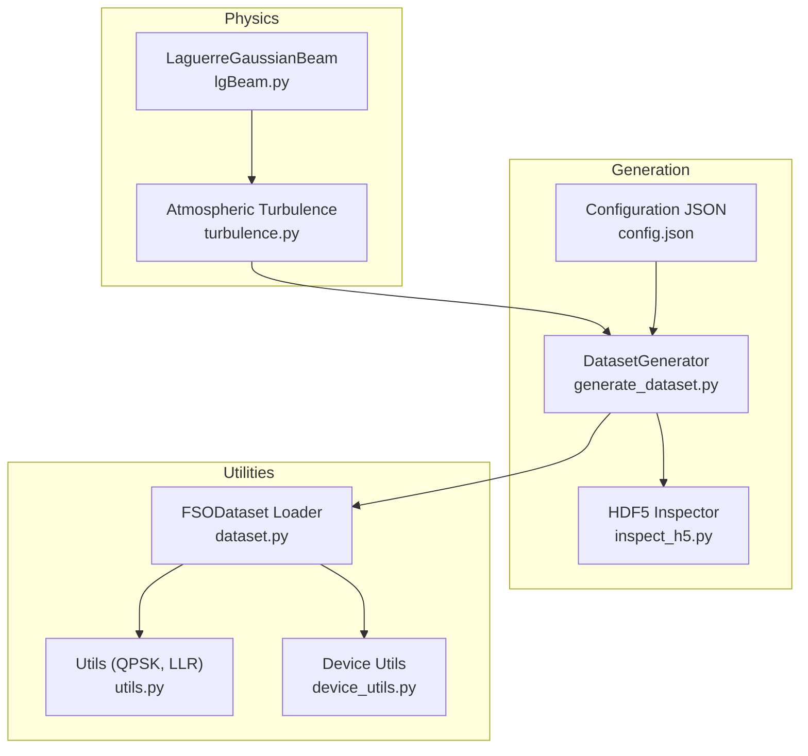
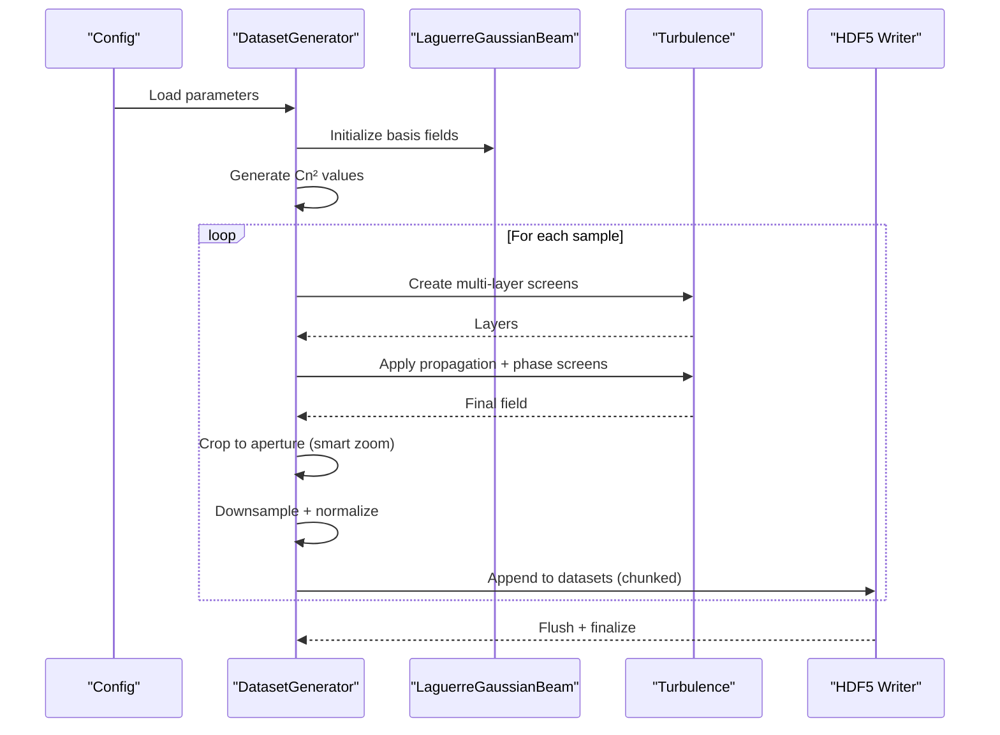
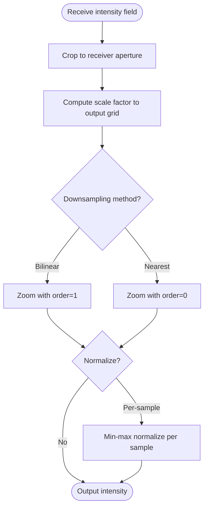
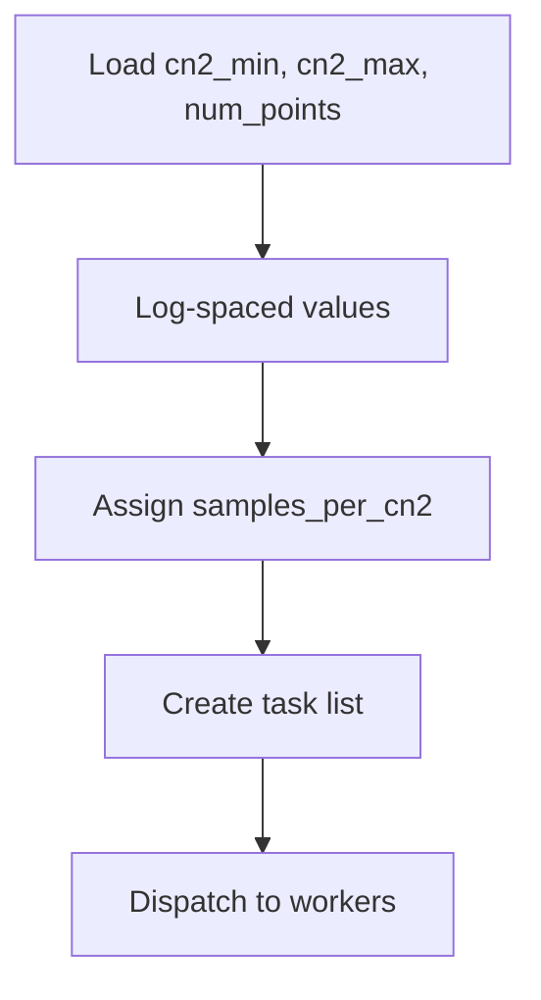
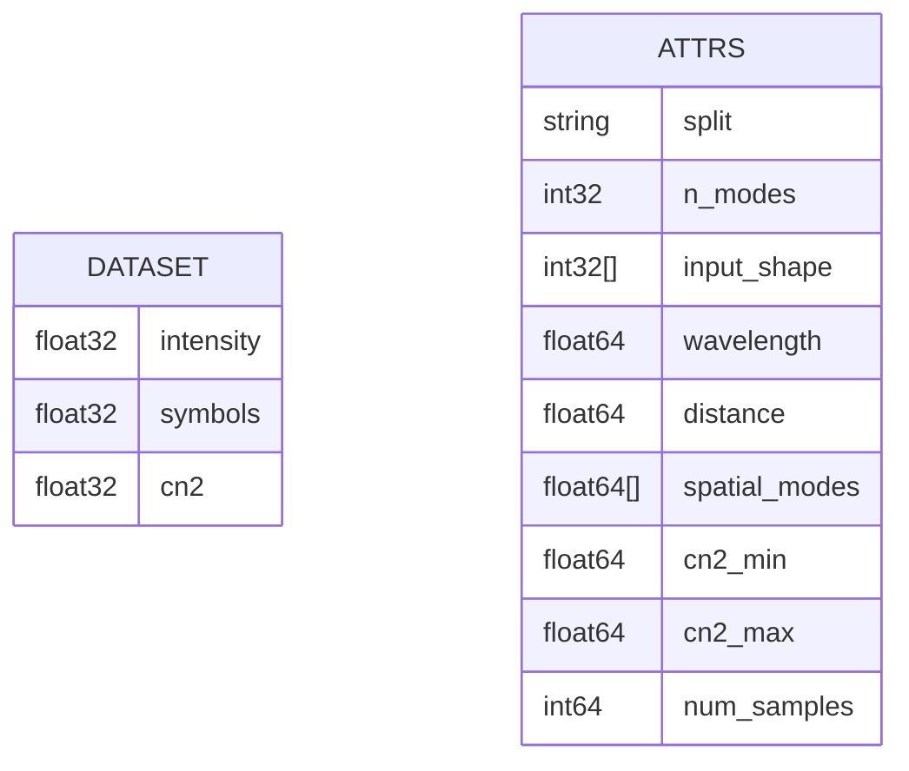
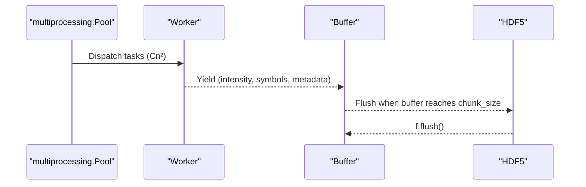
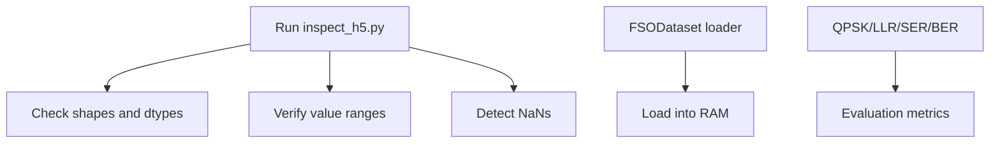
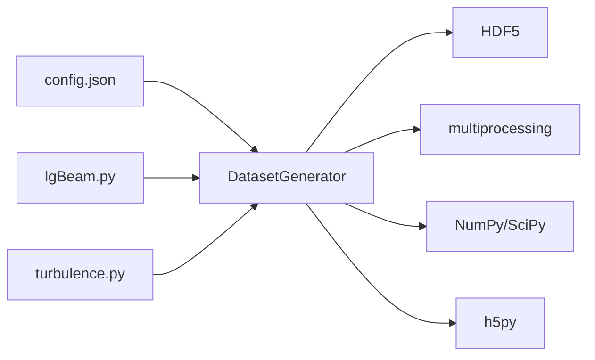
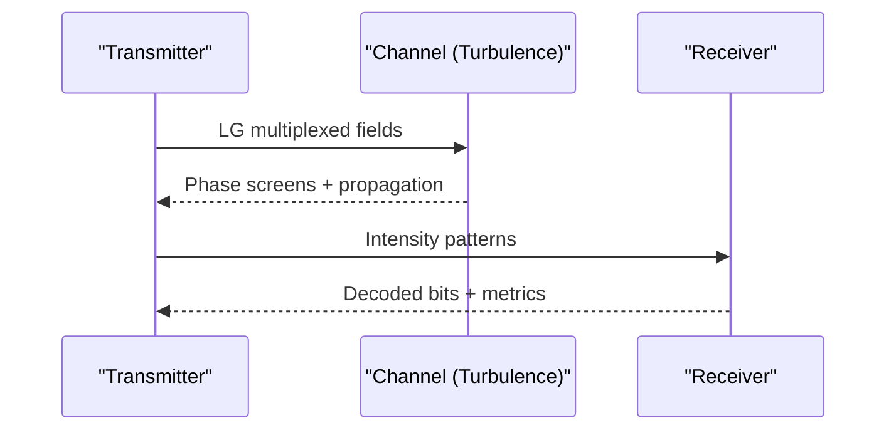

# Data Generation Pipeline

<cite>
**Referenced Files in This Document**
- [generate_dataset.py](file://models/CNN Trials/src/data_gen/generate_dataset.py)
- [generate_dataset.py](file://models/CNN Trials/data/generators/generate_dataset.py)
- [pipeline.py](file://models/CNN Trials/physics/pipeline.py)
- [turbulence.py](file://models/CNN Trials/physics/turbulence.py)
- [lgBeam.py](file://models/CNN Trials/physics/lgBeam.py)
- [dataset.py](file://models/CNN Trials/src/utils/dataset.py)
- [utils.py](file://models/CNN Trials/src/utils/utils.py)
- [device_utils.py](file://models/CNN Trials/src/utils/device_utils.py)
- [config.json](file://models/CNN Trials/data/configs/config.json)
- [config_sanity.json](file://models/CNN Trials/data/configs/config_sanity.json)
- [inspect_h5.py](file://models/CNN Trials/data/generators/inspect_h5.py)
- [requirements.txt](file://models/CNN Trials/requirements.txt)
</cite>

## Table of Contents
1. [Introduction](#introduction)
2. [Project Structure](#project-structure)
3. [Core Components](#core-components)
4. [Architecture Overview](#architecture-overview)
5. [Detailed Component Analysis](#detailed-component-analysis)
6. [Dependency Analysis](#dependency-analysis)
7. [Performance Considerations](#performance-considerations)
8. [Troubleshooting Guide](#troubleshooting-guide)
9. [Conclusion](#conclusion)
10. [Appendices](#appendices)

## Introduction
This document describes the synthetic dataset generation system for Free-Space Optics Orbital Angular Momentum (FSO-OAM) communication. The pipeline simulates the physics of LG beam propagation through turbulent atmospheres, captures intensity patterns at the receiver, and stores them as HDF5 datasets paired with QPSK modulated symbols. It includes:
- Smart zoom cropping to improve effective resolution by focusing on the receiver aperture
- Configurable turbulence parameter sampling across logarithmic bins
- Batch processing optimizations using multiprocessing and chunked I/O
- Dataset structure, metadata management, and memory-efficient handling of large-scale intensity datasets
- Examples of configuration-driven generation, validation, and quality control

## Project Structure
The dataset generation spans three major areas:
- Physics simulation modules: LG beam generation, turbulence modeling, atmospheric attenuation
- Dataset generation: multiprocessing, smart zoom cropping, HDF5 I/O, augmentation
- Utilities: dataset loaders, device selection, normalization, and metrics

**Diagram sources**
- [generate_dataset.py](file://models/CNN Trials/data/generators/generate_dataset.py#L279-L528)
- [lgBeam.py](file://models/CNN Trials/physics/lgBeam.py#L10-L176)
- [turbulence.py](file://models/CNN Trials/physics/turbulence.py#L261-L352)
- [dataset.py](file://models/CNN Trials/src/utils/dataset.py#L6-L43)
- [utils.py](file://models/CNN Trials/src/utils/utils.py#L16-L210)
- [device_utils.py](file://models/CNN Trials/src/utils/device_utils.py#L15-L143)
- [config.json](file://models/CNN Trials/data/configs/config.json#L1-L136)
- [inspect_h5.py](file://models/CNN Trials/data/generators/inspect_h5.py#L6-L46)

**Section sources**
- [generate_dataset.py](file://models/CNN Trials/data/generators/generate_dataset.py#L1-L598)
- [config.json](file://models/CNN Trials/data/configs/config.json#L1-L136)

## Core Components
- DatasetGenerator: orchestrates simulation runs, manages multiprocessing, performs smart zoom cropping, downsamples, normalizes, and writes to HDF5 with chunking and compression.
- LG beam model: generates basis fields for spatial modes and computes physical beam radius for grid sizing.
- Turbulence model: creates multi-layer phase screens and propagates fields using angular spectrum.
- HDF5 dataset: stores intensity images, QPSK symbols per mode, and Cn² metadata with attributes.
- Utilities: dataset loader for training, device selection for Apple Silicon, and QPSK/LLR helpers.

**Section sources**
- [generate_dataset.py](file://models/CNN Trials/data/generators/generate_dataset.py#L279-L528)
- [lgBeam.py](file://models/CNN Trials/physics/lgBeam.py#L10-L176)
- [turbulence.py](file://models/CNN Trials/physics/turbulence.py#L261-L352)
- [dataset.py](file://models/CNN Trials/src/utils/dataset.py#L6-L43)
- [utils.py](file://models/CNN Trials/src/utils/utils.py#L16-L210)
- [device_utils.py](file://models/CNN Trials/src/utils/device_utils.py#L15-L143)

## Architecture Overview
The generation pipeline follows a configuration-driven workflow:
- Load configuration (system, turbulence, grid, data format, augmentation, output).
- Initialize LG beams and compute grid parameters based on the highest M² mode.
- Generate Cn² values (logarithmic spacing) and distribute across requested samples.
- For each sample:
  - Draw Cn², generate QPSK symbols, and multiplex LG basis fields.
  - Propagate through multi-layer turbulence and apply attenuation and aperture masking.
  - Add optional noise, crop to receiver aperture (smart zoom), downsample, and normalize.
  - Write intensity, symbols, and metadata to HDF5 in chunks.
- Provide inspection utilities and dataset loader for downstream training.

**Diagram sources**
- [generate_dataset.py](file://models/CNN Trials/data/generators/generate_dataset.py#L408-L528)
- [turbulence.py](file://models/CNN Trials/physics/turbulence.py#L210-L352)
- [lgBeam.py](file://models/CNN Trials/physics/lgBeam.py#L81-L176)

## Detailed Component Analysis

### Smart Zoom Cropping and Downsampling
Smart zoom focuses on the receiver aperture to maximize effective resolution and minimize empty space around the beam. The process:
- Compute receiver aperture indices from grid_info and receiver diameter.
- Crop intensity to the aperture region.
- Downsample using bilinear or nearest neighbor interpolation to the output grid size.
- Optionally normalize per-sample to [0, 1].

**Diagram sources**
- [generate_dataset.py](file://models/CNN Trials/data/generators/generate_dataset.py#L71-L106)
- [generate_dataset.py](file://models/CNN Trials/data/generators/generate_dataset.py#L248-L267)

**Section sources**
- [generate_dataset.py](file://models/CNN Trials/data/generators/generate_dataset.py#L71-L106)
- [generate_dataset.py](file://models/CNN Trials/data/generators/generate_dataset.py#L248-L267)

### Configurable Turbulence Parameter Sampling
The generator supports:
- Logarithmic spacing of Cn² values across a specified range.
- Uniform allocation of samples across Cn² bins.
- Flexible turbulence model selection (uniform or Hufnagel-Ville) and layer parameters.

**Diagram sources**
- [generate_dataset.py](file://models/CNN Trials/data/generators/generate_dataset.py#L327-L341)
- [generate_dataset.py](file://models/CNN Trials/data/generators/generate_dataset.py#L444-L455)

**Section sources**
- [generate_dataset.py](file://models/CNN Trials/data/generators/generate_dataset.py#L327-L341)
- [generate_dataset.py](file://models/CNN Trials/data/generators/generate_dataset.py#L444-L455)
- [config.json](file://models/CNN Trials/data/configs/config.json#L53-L62)

### HDF5 Dataset Structure and Metadata
The HDF5 dataset contains:
- intensity: [N, H, W] float32, resized receiver intensity images
- symbols: [N, M, 2] float32, QPSK symbols per mode (real and imaginary)
- cn2: [N] float32, turbulence strength per sample
Attributes include split, input shape, wavelength, distance, spatial modes, and cn2 bounds.

**Diagram sources**
- [generate_dataset.py](file://models/CNN Trials/data/generators/generate_dataset.py#L463-L490)
- [inspect_h5.py](file://models/CNN Trials/data/generators/inspect_h5.py#L12-L25)

**Section sources**
- [generate_dataset.py](file://models/CNN Trials/data/generators/generate_dataset.py#L463-L490)
- [inspect_h5.py](file://models/CNN Trials/data/generators/inspect_h5.py#L12-L25)

### Multiprocessing and Chunked I/O
- Worker initialization seeds RNG independently to avoid correlation.
- Buffered writes flush to disk in chunks to reduce I/O overhead.
- Uses spawn start method for compatibility on macOS/Linux.

**Diagram sources**
- [generate_dataset.py](file://models/CNN Trials/data/generators/generate_dataset.py#L500-L520)
- [generate_dataset.py](file://models/CNN Trials/data/generators/generate_dataset.py#L530-L548)

**Section sources**
- [generate_dataset.py](file://models/CNN Trials/data/generators/generate_dataset.py#L496-L520)
- [generate_dataset.py](file://models/CNN Trials/data/generators/generate_dataset.py#L530-L548)

### Configuration-Driven Data Generation
Key configuration keys:
- system_parameters: wavelength, w0, distance, receiver_diameter, p_tx_total, spatial_modes, pilot_parameters
- turbulence_parameters: cn2_min, cn2_max, num_cn2_points, cn2_model, L0, l0_inner, num_screens
- dataset_size: train, val, test counts
- grid_parameters: n_grid_sim, n_grid_output, oversampling, downsampling_method
- data_format: input/output types/shapes, normalization
- augmentation: add_noise, rotation_range, translation_range, multiple_realizations
- output: compression, metadata saving

Examples:
- Full dataset configuration: [config.json](file://models/CNN Trials/data/configs/config.json#L1-L136)
- Sanity check configuration (zero turbulence, pilot enabled): [config_sanity.json](file://models/CNN Trials/data/configs/config_sanity.json#L1-L106)

**Section sources**
- [config.json](file://models/CNN Trials/data/configs/config.json#L1-L136)
- [config_sanity.json](file://models/CNN Trials/data/configs/config_sanity.json#L1-L106)

### Validation and Quality Control
- HDF5 inspection script prints shapes, ranges, and checks for NaNs.
- Dataset loader loads entire split into RAM for quick iteration (useful for small datasets or validation).
- Utility functions provide QPSK mapping, LLR computation, and SER/BER metrics for evaluation.

**Diagram sources**
- [inspect_h5.py](file://models/CNN Trials/data/generators/inspect_h5.py#L12-L25)
- [dataset.py](file://models/CNN Trials/src/utils/dataset.py#L6-L22)
- [utils.py](file://models/CNN Trials/src/utils/utils.py#L117-L162)

**Section sources**
- [inspect_h5.py](file://models/CNN Trials/data/generators/inspect_h5.py#L12-L25)
- [dataset.py](file://models/CNN Trials/src/utils/dataset.py#L6-L22)
- [utils.py](file://models/CNN Trials/src/utils/utils.py#L117-L162)

## Dependency Analysis
The generation pipeline depends on:
- Physics modules for LG beam fields and turbulence propagation
- NumPy/SciPy for numerical operations and FFT-based propagation
- HDF5 for efficient storage with compression and chunking
- Multiprocessing for parallelism
- Matplotlib/tqdm for diagnostics and progress

**Diagram sources**
- [generate_dataset.py](file://models/CNN Trials/data/generators/generate_dataset.py#L279-L528)
- [config.json](file://models/CNN Trials/data/configs/config.json#L1-L136)
- [requirements.txt](file://models/CNN Trials/requirements.txt#L4-L14)

**Section sources**
- [requirements.txt](file://models/CNN Trials/requirements.txt#L1-L33)
- [generate_dataset.py](file://models/CNN Trials/data/generators/generate_dataset.py#L17-L32)

## Performance Considerations
- Grid sizing: Use the highest M² mode’s physical beam radius to avoid clipping and ensure adequate sampling.
- Oversampling and screens: Higher oversampling and screen count improve accuracy but increase cost; tune for target throughput.
- Multiprocessing: Use spawn start method and worker seeding to avoid shared RNG issues.
- Chunked I/O: Tune chunk size to balance memory usage and write throughput.
- Compression: Gzip level 4 offers good compression with minimal overhead.
- Device selection: On Apple Silicon M3, MPS can accelerate training; adjust batch sizes accordingly.

[No sources needed since this section provides general guidance]

## Troubleshooting Guide
Common issues and remedies:
- Empty or invalid fields after propagation: verify grid size and inner scale resolution; ensure δ < l0/2.
- Excessive spread or NaNs: reduce Cn² extremes or increase grid oversampling.
- Memory pressure: reduce batch size or disable full-RAM loading in dataset loader.
- Device compatibility: ensure MPS availability on Apple Silicon; otherwise fall back to CPU.

**Section sources**
- [turbulence.py](file://models/CNN Trials/physics/turbulence.py#L279-L288)
- [device_utils.py](file://models/CNN Trials/src/utils/device_utils.py#L15-L46)
- [dataset.py](file://models/CNN Trials/src/utils/dataset.py#L11-L22)

## Conclusion
The dataset generation pipeline integrates accurate physics simulation with efficient data management. Smart zoom cropping, configurable turbulence sampling, and chunked I/O enable scalable, high-quality synthetic datasets suitable for CNN-based FSO-OAM receivers. Configuration-driven design and modular components facilitate reproducibility, validation, and performance tuning.

[No sources needed since this section summarizes without analyzing specific files]

## Appendices

### A. End-to-End Simulation Reference
While the dataset generator uses a simplified workflow, the end-to-end simulation demonstrates the full pipeline including channel modeling, receiver processing, and performance metrics.

**Diagram sources**
- [pipeline.py](file://models/CNN Trials/physics/pipeline.py#L64-L439)

**Section sources**
- [pipeline.py](file://models/CNN Trials/physics/pipeline.py#L64-L439)

### B. Example CLI Usage
- Generate a dataset split: python models/CNN Trials/data/generators/generate_dataset.py --config dataset/config.json --split train --num-samples 20000
- Inspect an HDF5 dataset: python models/CNN Trials/data/generators/inspect_h5.py

**Section sources**
- [generate_dataset.py](file://models/CNN Trials/data/generators/generate_dataset.py#L551-L598)
- [inspect_h5.py](file://models/CNN Trials/data/generators/inspect_h5.py#L6-L46)