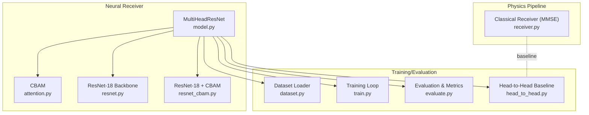
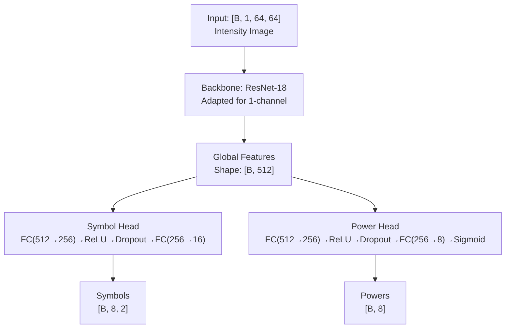
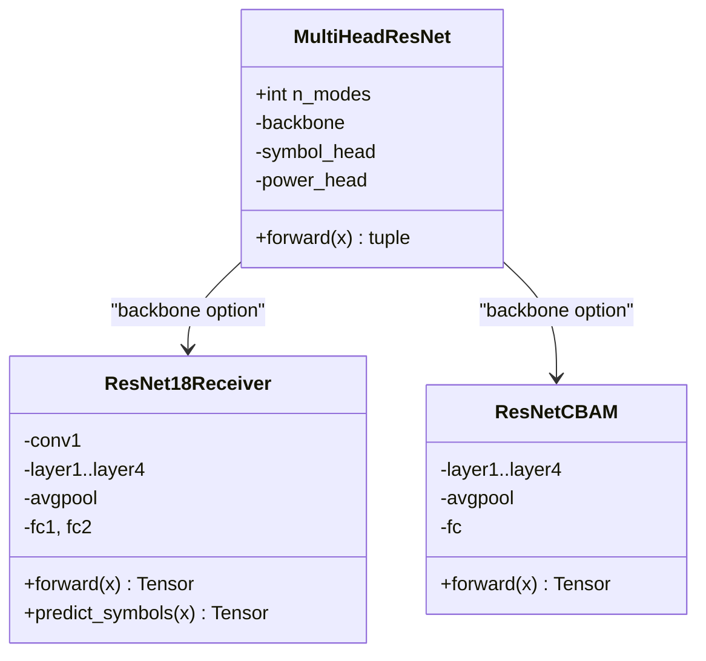
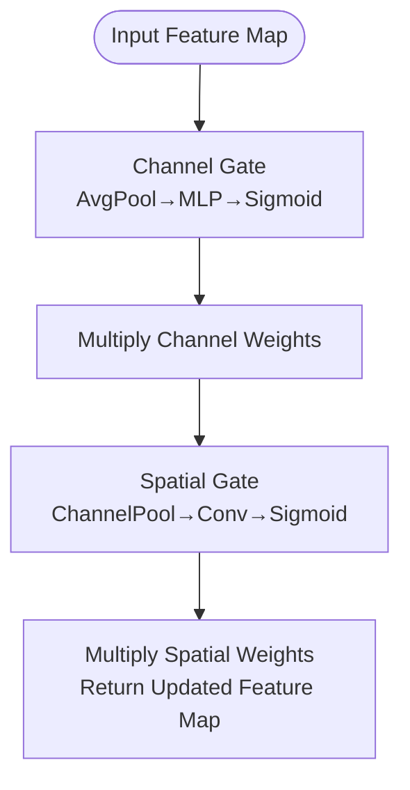
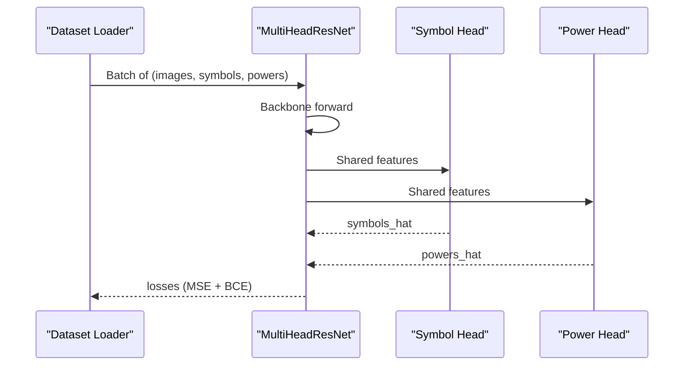
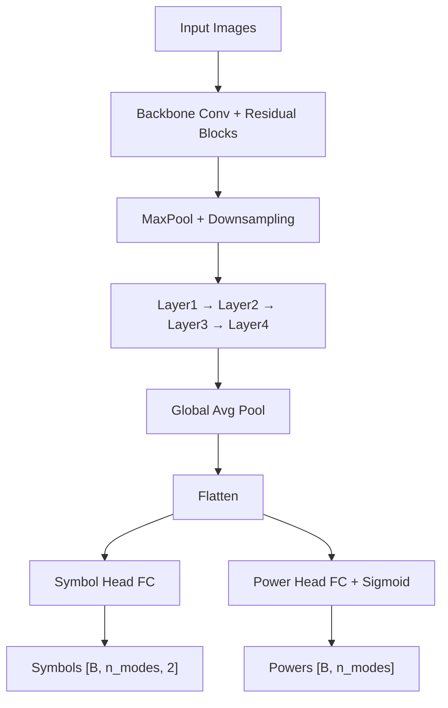
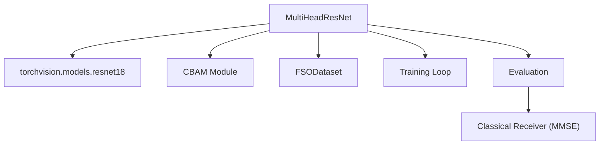

# Neural Receiver Design

<cite>
**Referenced Files in This Document**
- [README.md](file://README.md)
- [model.py](file://models/CNN Trials/src/models/model.py)
- [resnet.py](file://models/CNN Trials/src/models/resnet.py)
- [resnet_cbam.py](file://models/CNN Trials/src/models/resnet_cbam.py)
- [attention.py](file://models/CNN Trials/src/models/attention.py)
- [dataset.py](file://models/CNN Trials/src/utils/dataset.py)
- [train.py](file://models/CNN Trials/src/training/train.py)
- [evaluate.py](file://models/CNN Trials/src/evaluation/evaluate.py)
- [head_to_head.py](file://models/CNN Trials/src/evaluation/head_to_head.py)
- [config.json](file://models/CNN Trials/data/configs/config.json)
- [receiver.py](file://models/CNN Trials/physics/receiver.py)
- [utils.py](file://models/CNN Trials/src/utils/utils.py)
</cite>

## Table of Contents
1. [Introduction](#introduction)
2. [Project Structure](#project-structure)
3. [Core Components](#core-components)
4. [Architecture Overview](#architecture-overview)
5. [Detailed Component Analysis](#detailed-component-analysis)
6. [Dependency Analysis](#dependency-analysis)
7. [Performance Considerations](#performance-considerations)
8. [Troubleshooting Guide](#troubleshooting-guide)
9. [Conclusion](#conclusion)
10. [Appendices](#appendices)

## Introduction
This document describes the neural receiver architecture designed for Orbital Angular Momentum (OAM) Free Space Optical (FSO) communications in atmospheric turbulence. The system performs direct recovery of complex QPSK symbols from intensity-only measurements using a Multi-Head ResNet with dual prediction heads: a symbol head for QPSK regression and a power head for auxiliary mode power prediction. The backbone network is adapted for 1-channel input processing, and Convolutional Block Attention Modules (CBAM) enhance spatial feature learning. The document explains the dual-task learning approach, architectural diagrams, customization options, and performance trade-offs between standard ResNet and CBAM variants.

## Project Structure
The neural receiver lives in the “CNN Trials” module and integrates with a physics-based simulator for dataset generation and baseline comparisons. Key directories and files include:
- models/CNN Trials/src/models: Core model definitions (MultiHeadResNet, ResNet variants, attention modules)
- models/CNN Trials/src/utils: Dataset and utility functions
- models/CNN Trials/src/training: Training loop and configuration
- models/CNN Trials/src/evaluation: Metrics, plots, and head-to-head comparisons
- models/CNN Trials/data/configs: Dataset configuration
- models/CNN Trials/physics: Classical receiver and simulation pipeline

**Diagram sources**
- [model.py](file://models/CNN Trials/src/models/model.py#L6-L71)
- [attention.py](file://models/CNN Trials/src/models/attention.py#L72-L89)
- [resnet.py](file://models/CNN Trials/src/models/resnet.py#L47-L148)
- [resnet_cbam.py](file://models/CNN Trials/src/models/resnet_cbam.py#L51-L112)
- [dataset.py](file://models/CNN Trials/src/utils/dataset.py#L6-L43)
- [train.py](file://models/CNN Trials/src/training/train.py#L16-L149)
- [evaluate.py](file://models/CNN Trials/src/evaluation/evaluate.py#L80-L314)
- [head_to_head.py](file://models/CNN Trials/src/evaluation/head_to_head.py#L51-L157)
- [receiver.py](file://models/CNN Trials/physics/receiver.py#L370-L751)

**Section sources**
- [README.md](file://README.md#L311-L350)

## Core Components
- Multi-Head ResNet: Modified ResNet-18 backbone with two heads:
  - Symbol head: Predicts real and imaginary parts of QPSK symbols for each mode.
  - Power head: Predicts mode power presence (sigmoid output).
- Backbone adaptations:
  - First convolution adapted for 1-channel input (intensity).
  - Original classifier replaced with identity to extract features.
- Attention mechanism:
  - CBAM module (channel and spatial gating) integrated into residual blocks.
- Dataset and preprocessing:
  - Intensity images normalized and reshaped to [N, 1, 64, 64].
  - Targets: symbols as [8, 2] real/imag pairs; power targets as ones vector.

**Section sources**
- [model.py](file://models/CNN Trials/src/models/model.py#L6-L71)
- [resnet.py](file://models/CNN Trials/src/models/resnet.py#L47-L148)
- [resnet_cbam.py](file://models/CNN Trials/src/models/resnet_cbam.py#L51-L112)
- [attention.py](file://models/CNN Trials/src/models/attention.py#L72-L89)
- [dataset.py](file://models/CNN Trials/src/utils/dataset.py#L6-L43)

## Architecture Overview
The neural receiver follows a dual-task learning paradigm:
- Shared backbone extracts spatial features from 1-channel intensity images.
- Two separate heads process the shared features:
  - Symbol head: Fully connected regressor producing flattened [Re_0, Im_0, Re_1, Im_1, ...].
  - Power head: Fully connected regressor producing [0, 1] per mode via sigmoid.

**Diagram sources**
- [model.py](file://models/CNN Trials/src/models/model.py#L18-L71)

**Section sources**
- [model.py](file://models/CNN Trials/src/models/model.py#L6-L71)

## Detailed Component Analysis

### Multi-Head ResNet Design
- Backbone selection: ImageNet-pretrained ResNet-18 or ResNet-18 with CBAM.
- 1-channel adaptation: Replace first conv with 1 input channel while preserving stride and spatial downsampling.
- Classifier removal: Identity layer to expose feature vector for heads.
- Heads:
  - Symbol head: Linear layers with ReLU and dropout; outputs flattened real/imag pairs for all modes.
  - Power head: Linear layers with ReLU and dropout; outputs per-mode probabilities via sigmoid.

**Diagram sources**
- [model.py](file://models/CNN Trials/src/models/model.py#L6-L71)
- [resnet.py](file://models/CNN Trials/src/models/resnet.py#L47-L148)
- [resnet_cbam.py](file://models/CNN Trials/src/models/resnet_cbam.py#L51-L112)

**Section sources**
- [model.py](file://models/CNN Trials/src/models/model.py#L18-L71)
- [resnet.py](file://models/CNN Trials/src/models/resnet.py#L47-L148)
- [resnet_cbam.py](file://models/CNN Trials/src/models/resnet_cbam.py#L51-L112)

### CBAM Attention Mechanisms
- Channel attention: Global average and max pooling across spatial dims, followed by an MLP to produce channel-wise weights.
- Spatial attention: Concatenates channel-wise max and mean across channels, passes through a conv-batchnorm-relu pathway, and applies sigmoid to produce spatial weights.
- Integration: CBAM applied before residual addition in residual blocks.

**Diagram sources**
- [attention.py](file://models/CNN Trials/src/models/attention.py#L25-L89)

**Section sources**
- [attention.py](file://models/CNN Trials/src/models/attention.py#L25-L89)

### Dual-Task Learning: Symbol Head and Power Head
- Symbol head:
  - Purpose: Directly regress QPSK symbols from intensity.
  - Output: [batch, n_modes, 2] real/imaginary pairs.
  - Loss: Mean Squared Error against ground-truth symbols.
- Power head:
  - Purpose: Auxiliary task to predict mode power presence.
  - Output: [batch, n_modes] with sigmoid activation.
  - Loss: Binary Cross Entropy against power targets.

**Diagram sources**
- [model.py](file://models/CNN Trials/src/models/model.py#L59-L71)
- [train.py](file://models/CNN Trials/src/training/train.py#L31-L98)

**Section sources**
- [model.py](file://models/CNN Trials/src/models/model.py#L38-L71)
- [train.py](file://models/CNN Trials/src/training/train.py#L31-L98)

### Feature Extraction Pipeline and Head-Specific Paths
- Input: Intensity images [B, 1, 64, 64].
- Backbone: Convolutional feature extraction with residual blocks and downsampling.
- Global pooling: Adaptive average pooling to [B, 512, 1, 1].
- Heads:
  - Symbol head reshapes to [B, n_modes, 2] for downstream QPSK processing.
  - Power head produces per-mode probabilities for auxiliary tasks.

**Diagram sources**
- [model.py](file://models/CNN Trials/src/models/model.py#L59-L71)

**Section sources**
- [model.py](file://models/CNN Trials/src/models/model.py#L59-L71)

### Model Customization Options and Trade-offs
- Backbone choice:
  - resnet18: Standard ImageNet-pretrained backbone.
  - resnet18_cbam: Same backbone with CBAM attention modules inserted.
- Input adaptation:
  - First conv changed from 3 to 1 input channel to process intensity images.
- Head customization:
  - Adjust n_modes to match dataset configuration.
  - Modify dropout and FC sizes for capacity control.
- Performance trade-offs:
  - CBAM variant adds spatial attention overhead but improves resilience in strong turbulence.
  - Training time increases due to larger parameter space and attention computations.

**Section sources**
- [model.py](file://models/CNN Trials/src/models/model.py#L18-L37)
- [resnet_cbam.py](file://models/CNN Trials/src/models/resnet_cbam.py#L108-L112)
- [README.md](file://README.md#L138-L157)

## Dependency Analysis
- MultiHeadResNet depends on:
  - torchvision ResNet-18 for pretraining.
  - Custom ResNet-18 with CBAM for attention-enabled backbone.
  - Attention module (CBAM) for spatial feature enhancement.
- Training and evaluation depend on:
  - Dataset loader for intensity, symbols, and power targets.
  - Metrics and plotting utilities for performance analysis.
  - Physics-based receiver for baseline comparisons.

**Diagram sources**
- [model.py](file://models/CNN Trials/src/models/model.py#L22-L27)
- [attention.py](file://models/CNN Trials/src/models/attention.py#L72-L89)
- [dataset.py](file://models/CNN Trials/src/utils/dataset.py#L6-L43)
- [train.py](file://models/CNN Trials/src/training/train.py#L16-L149)
- [evaluate.py](file://models/CNN Trials/src/evaluation/evaluate.py#L80-L314)
- [receiver.py](file://models/CNN Trials/physics/receiver.py#L370-L751)

**Section sources**
- [model.py](file://models/CNN Trials/src/models/model.py#L22-L27)
- [train.py](file://models/CNN Trials/src/training/train.py#L16-L149)
- [evaluate.py](file://models/CNN Trials/src/evaluation/evaluate.py#L80-L314)

## Performance Considerations
- Training objectives:
  - Symbol head uses MSE loss; power head uses BCE loss.
  - Combined loss with weighted contribution to balance tasks.
- Evaluation metrics:
  - Symbol Error Rate (SER) and Bit Error Rate (BER) computed across modes.
  - Throughput analysis accounts for LDPC and pilot overhead.
- Inference characteristics:
  - Constant-time forward pass; GPU acceleration recommended.
- Resilience:
  - CBAM variant demonstrates significant improvement in strong turbulence regimes.

**Section sources**
- [train.py](file://models/CNN Trials/src/training/train.py#L31-L98)
- [evaluate.py](file://models/CNN Trials/src/evaluation/evaluate.py#L12-L61)
- [README.md](file://README.md#L208-L226)

## Troubleshooting Guide
- Zero outputs or collapsed outputs:
  - Diagnosis checks mean magnitude and phase statistics; low magnitude suggests collapse.
- Phase rotation artifacts:
  - Systematic phase bias indicates pilot ambiguity or residual phase error.
- Random guessing behavior:
  - High phase jitter suggests high noise or severe fading.
- Dataset mismatches:
  - Ensure input shape [N, 1, 64, 64] and targets aligned with n_modes.
- Head-to-head comparisons:
  - Use head_to_head script to compare CNN against classical MMSE baseline.

**Section sources**
- [evaluate.py](file://models/CNN Trials/src/evaluation/evaluate.py#L193-L221)
- [dataset.py](file://models/CNN Trials/src/utils/dataset.py#L6-L43)
- [head_to_head.py](file://models/CNN Trials/src/evaluation/head_to_head.py#L51-L157)

## Conclusion
The Multi-Head ResNet neural receiver enables robust OAM symbol recovery from intensity-only measurements using a dual-task learning framework. The backbone is adapted for 1-channel inputs, and CBAM attention enhances spatial feature learning, improving resilience in strong turbulence. The symbol head produces QPSK symbols for demodulation, while the power head provides auxiliary power predictions. The architecture balances performance and complexity, with CBAM variants offering substantial gains at modest overhead.

## Appendices

### Configuration and Data Format
- Dataset configuration specifies:
  - Input type: intensity, channels: 1, shape: [64, 64].
  - Output type: symbols, shape: [8, 2].
  - Augmentation and normalization options.
- Dataset loader:
  - Loads intensity, symbols, and cn2 metadata.
  - Normalizes intensity and reshapes to [N, 1, 64, 64].

**Section sources**
- [config.json](file://models/CNN Trials/data/configs/config.json#L105-L136)
- [dataset.py](file://models/CNN Trials/src/utils/dataset.py#L6-L43)

### Utility Functions for QPSK Processing
- Utilities include:
  - QPSK constellation definitions and hard/soft demodulation.
  - LLR computation for soft LDPC decoding.
  - SER/BER computation and tensor conversions between real and complex representations.

**Section sources**
- [utils.py](file://models/CNN Trials/src/utils/utils.py#L16-L114)
- [utils.py](file://models/CNN Trials/src/utils/utils.py#L165-L210)