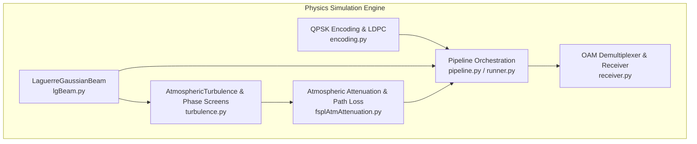
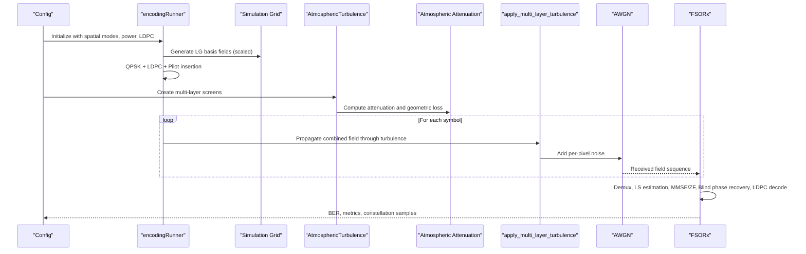
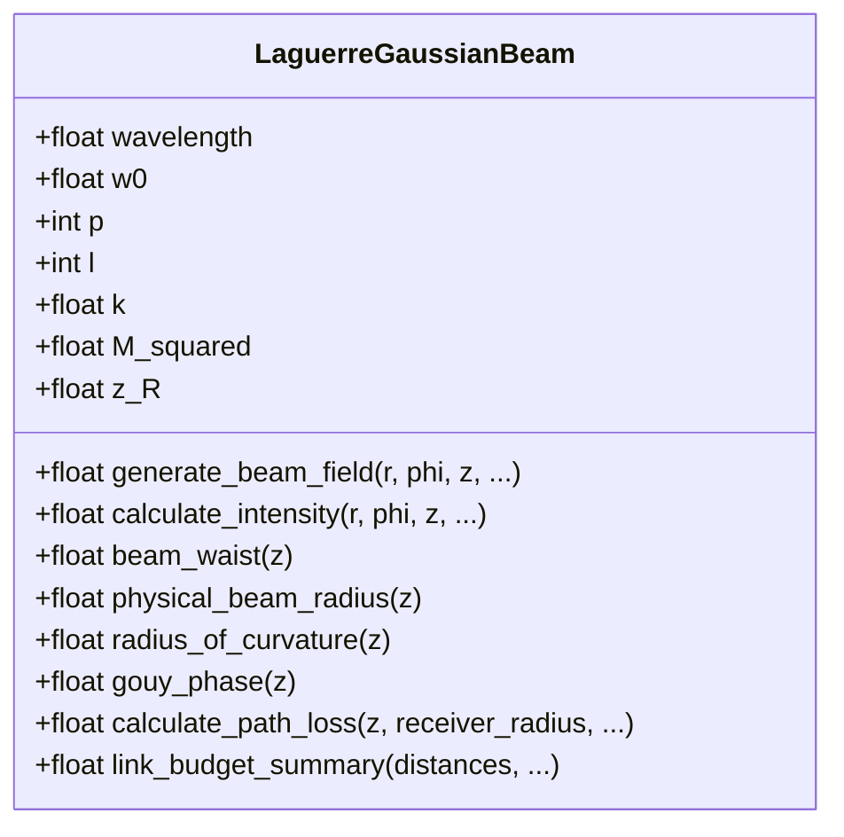
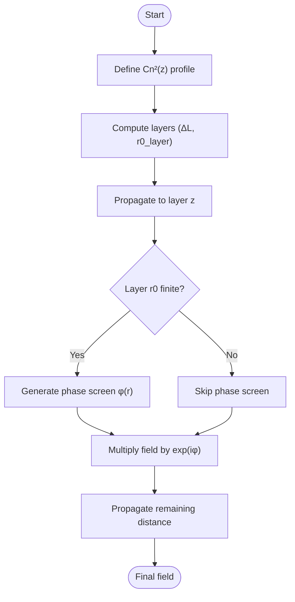
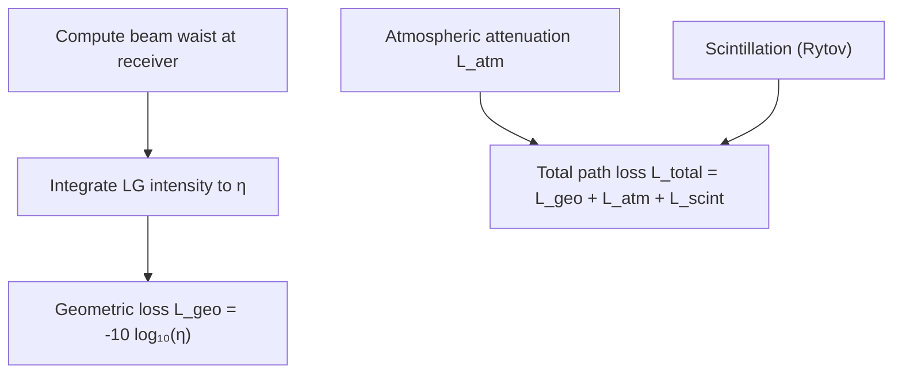
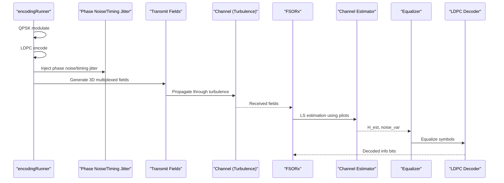
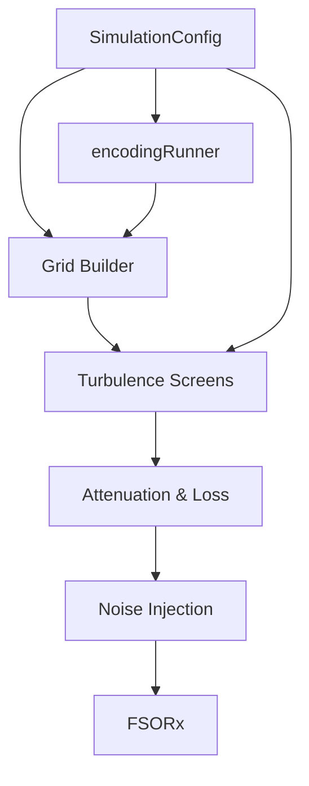
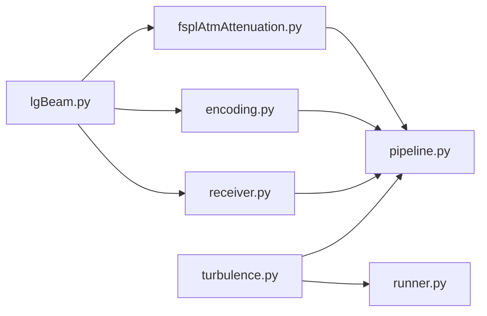

# Physics Simulation Engine

<cite>
**Referenced Files in This Document**
- [lgBeam.py](file://models/CNN Trials/physics/lgBeam.py)
- [turbulence.py](file://models/CNN Trials/physics/turbulence.py)
- [fsplAtmAttenuation.py](file://models/CNN Trials/physics/fsplAtmAttenuation.py)
- [encoding.py](file://models/CNN Trials/physics/encoding.py)
- [pipeline.py](file://models/CNN Trials/physics/pipeline.py)
- [runner.py](file://models/CNN Trials/physics/runner.py)
- [receiver.py](file://models/CNN Trials/physics/receiver.py)
- [config.json](file://models/CNN Trials/data/configs/config.json)
</cite>

## Table of Contents
1. [Introduction](#introduction)
2. [Project Structure](#project-structure)
3. [Core Components](#core-components)
4. [Architecture Overview](#architecture-overview)
5. [Detailed Component Analysis](#detailed-component-analysis)
6. [Dependency Analysis](#dependency-analysis)
7. [Performance Considerations](#performance-considerations)
8. [Troubleshooting Guide](#troubleshooting-guide)
9. [Conclusion](#conclusion)

## Introduction
This document provides comprehensive technical documentation for the physics simulation engine that powers the Free Space Optical (FSO) Orbital Angular Momentum (OAM) communication system. The engine encompasses:
- Laguerre-Gaussian beam generation and propagation
- Multi-layer atmospheric turbulence modeling using the split-step Fourier method
- Free-space path loss computation including geometric clipping, atmospheric attenuation, and scintillation
- QPSK encoding and pilot-based channel estimation/equalization
- End-to-end simulation pipeline with parameter management and numerical stability safeguards

The goal is to enable both researchers and practitioners to understand, configure, and extend the simulation for realistic FSO-OAM scenarios under varying turbulence conditions.

## Project Structure
The physics simulation resides primarily under models/CNN Trials/physics and integrates tightly with the neural receiver training pipeline. Key modules:
- lgBeam.py: Analytical LG beam generation, phase/noise modeling, and geometric loss computation
- turbulence.py: Multi-layer phase screens, angular spectrum propagation, and turbulence metrics
- fsplAtmAttenuation.py: Atmospheric attenuation, geometric clipping, and path loss breakdown
- encoding.py: QPSK modulation, LDPC encoding, pilot insertion, and 3D field generation
- receiver.py: OAM demultiplexing, LS/MMSE channel estimation, and LDPC decoding
- pipeline.py and runner.py: End-to-end orchestration, parameter sweeps, and diagnostics
- config.json: Dataset configuration for data generation workflows

**Diagram sources**
- [lgBeam.py](file://models/CNN Trials/physics/lgBeam.py#L10-L176)
- [turbulence.py](file://models/CNN Trials/physics/turbulence.py#L108-L257)
- [fsplAtmAttenuation.py](file://models/CNN Trials/physics/fsplAtmAttenuation.py#L26-L305)
- [encoding.py](file://models/CNN Trials/physics/encoding.py#L544-L736)
- [receiver.py](file://models/CNN Trials/physics/receiver.py#L370-L751)
- [pipeline.py](file://models/CNN Trials/physics/pipeline.py#L64-L439)
- [runner.py](file://models/CNN Trials/physics/runner.py#L128-L505)

**Section sources**
- [pipeline.py](file://models/CNN Trials/physics/pipeline.py#L37-L61)
- [runner.py](file://models/CNN Trials/physics/runner.py#L73-L123)

## Core Components
- Laguerre-Gaussian Beam Generator: Implements analytical LG field generation, beam parameters (waist, divergence, M²), Gouy phase, and optional phase noise/timing jitter modeling. Includes geometric loss computation via numerical integration.
- Atmospheric Turbulence Model: Multi-layer phase screens with Von Kármán PSD, angular spectrum propagation, Fried parameter computation, and turbulence strength classification.
- Free-Space Path Loss Calculator: Combines geometric clipping, atmospheric attenuation (Kim model), and scintillation effects into total path loss and received power budgets.
- QPSK Encoding Pipeline: Modulates data into QPSK symbols, applies LDPC coding, inserts pilots per mode, and generates 3D multiplexed fields for transmission.
- Receiver Front-End: Projects received fields onto LG basis modes, estimates LS channel matrix, performs MMSE/ZF equalization, blind phase recovery, and LDPC decoding.

**Section sources**
- [lgBeam.py](file://models/CNN Trials/physics/lgBeam.py#L10-L176)
- [turbulence.py](file://models/CNN Trials/physics/turbulence.py#L108-L257)
- [fsplAtmAttenuation.py](file://models/CNN Trials/physics/fsplAtmAttenuation.py#L26-L305)
- [encoding.py](file://models/CNN Trials/physics/encoding.py#L544-L736)
- [receiver.py](file://models/CNN Trials/physics/receiver.py#L370-L751)

## Architecture Overview
The simulation pipeline proceeds through four major stages:
1. Transmitter Initialization: Builds LG basis fields, scales for total power, encodes data to QPSK, applies LDPC, and inserts pilots.
2. Channel Modeling: Generates multi-layer phase screens, computes attenuation and geometric losses, and propagates fields through turbulence.
3. Noise Injection: Adds AWGN per pixel based on target SNR.
4. Receiver Processing: Demultiplexes OAM modes, estimates channel, equalizes symbols, performs blind phase recovery, and decodes LDPC.

**Diagram sources**
- [pipeline.py](file://models/CNN Trials/physics/pipeline.py#L64-L439)
- [runner.py](file://models/CNN Trials/physics/runner.py#L128-L505)
- [turbulence.py](file://models/CNN Trials/physics/turbulence.py#L261-L352)
- [fsplAtmAttenuation.py](file://models/CNN Trials/physics/fsplAtmAttenuation.py#L212-L305)
- [receiver.py](file://models/CNN Trials/physics/receiver.py#L397-L712)

## Detailed Component Analysis

### Laguerre-Gaussian Beam Generation
- Mathematical foundation: LG modes are defined by radial index p and azimuthal index l, with beam quality factor M² = 2p + |l| + 1. The fundamental Rayleigh range z_R = πw₀²/λ governs divergence.
- Field generation: The complex electric field combines radial Laguerre terms, azimuthal OAM phase, wavefront curvature, Gouy phase, and optional beam steering and phase noise/timing jitter.
- Geometric loss: Uses numerical integration over polar grids to compute collection efficiency into receiver apertures, essential for accurate path loss budgets.

**Diagram sources**
- [lgBeam.py](file://models/CNN Trials/physics/lgBeam.py#L10-L176)
- [fsplAtmAttenuation.py](file://models/CNN Trials/physics/fsplAtmAttenuation.py#L212-L305)

**Section sources**
- [lgBeam.py](file://models/CNN Trials/physics/lgBeam.py#L10-L176)
- [fsplAtmAttenuation.py](file://models/CNN Trials/physics/fsplAtmAttenuation.py#L50-L179)

### Atmospheric Turbulence Modeling
- Multi-layer phase screens: Uniform slabs integrate Cn²(z) to compute Fried parameter r₀ per layer. Angular spectrum propagation preserves LG phase characteristics.
- Turbulence metrics: Rytov variance σ_R² includes OAM and beam quality corrections, with Fried parameter scaling as r₀ ∝ (path)⁻³/⁵ for integrated Cn².
- Validation suite: Verifies PSD variance, Rytov scaling, and layered r₀ additivity against theoretical expectations.

**Diagram sources**
- [turbulence.py](file://models/CNN Trials/physics/turbulence.py#L210-L257)
- [turbulence.py](file://models/CNN Trials/physics/turbulence.py#L261-L352)

**Section sources**
- [turbulence.py](file://models/CNN Trials/physics/turbulence.py#L108-L257)
- [turbulence.py](file://models/CNN Trials/physics/turbulence.py#L384-L435)

### Free-Space Path Loss and Geometric Loss
- Attenuation: Uses Kim model for visibility-dependent attenuation coefficients, combined with distance to yield dB/km losses.
- Geometric clipping: Integrates LG intensity profiles over polar grids to compute collection efficiency η, converting to dB loss as -10 log₁₀(η).
- Scintillation: For weak turbulence, computes Rytov variance and aperture averaging effects, modeling log-normal fading.

**Diagram sources**
- [fsplAtmAttenuation.py](file://models/CNN Trials/physics/fsplAtmAttenuation.py#L26-L45)
- [fsplAtmAttenuation.py](file://models/CNN Trials/physics/fsplAtmAttenuation.py#L50-L179)
- [fsplAtmAttenuation.py](file://models/CNN Trials/physics/fsplAtmAttenuation.py#L212-L305)

**Section sources**
- [fsplAtmAttenuation.py](file://models/CNN Trials/physics/fsplAtmAttenuation.py#L26-L305)

### QPSK Encoding and Pilot-Based Equalization
- QPSK modulation: Gray-coded constellation mapping with hard/soft demodulation for LLR-based decoding.
- LDPC encoding: Flexible wrapper around pyldpc with generator matrix handling and block-wise encoding/decoding.
- Pilot insertion: Uniform comb pattern with preamble for robust channel estimation; LS/MMSE estimation with turbulence-aware weighting.
- Equalization: ZF with regularization and MMSE with noise variance estimation; blind phase recovery via fourth-power method.

**Diagram sources**
- [encoding.py](file://models/CNN Trials/physics/encoding.py#L544-L736)
- [receiver.py](file://models/CNN Trials/physics/receiver.py#L227-L366)
- [receiver.py](file://models/CNN Trials/physics/receiver.py#L370-L751)

**Section sources**
- [encoding.py](file://models/CNN Trials/physics/encoding.py#L136-L736)
- [receiver.py](file://models/CNN Trials/physics/receiver.py#L227-L751)

### Simulation Pipeline Architecture
- Configuration: Centralized SimulationConfig defines optical/link/spatial parameters, turbulence conditions, and receiver settings.
- Orchestration: Two entry points (pipeline.py and runner.py) share the same core logic, differing mainly in verbosity and output controls.
- Data flow: Grid construction, basis field scaling, channel snapshot generation, noise injection, and receiver processing with metrics collection.

**Diagram sources**
- [pipeline.py](file://models/CNN Trials/physics/pipeline.py#L37-L61)
- [pipeline.py](file://models/CNN Trials/physics/pipeline.py#L64-L439)
- [runner.py](file://models/CNN Trials/physics/runner.py#L73-L123)
- [runner.py](file://models/CNN Trials/physics/runner.py#L128-L505)

**Section sources**
- [pipeline.py](file://models/CNN Trials/physics/pipeline.py#L64-L439)
- [runner.py](file://models/CNN Trials/physics/runner.py#L128-L505)

## Dependency Analysis
- Internal dependencies:
  - lgBeam is imported by fsplAtmAttenuation for geometric loss and by encoding/receiver for field generation.
  - turbulence provides angular spectrum propagation and multi-layer screen application used by pipeline/runner.
  - receiver depends on encoding for frame structure and on turbulence for optional angular propagation.
- External dependencies:
  - NumPy/SciPy for numerical operations and FFT-based propagation.
  - Matplotlib for diagnostics and plots.
  - Optional pyldpc for LDPC encoding/decoding.

**Diagram sources**
- [fsplAtmAttenuation.py](file://models/CNN Trials/physics/fsplAtmAttenuation.py#L7-L18)
- [encoding.py](file://models/CNN Trials/physics/encoding.py#L19-L25)
- [receiver.py](file://models/CNN Trials/physics/receiver.py#L22-L38)
- [turbulence.py](file://models/CNN Trials/physics/turbulence.py#L18-L22)
- [pipeline.py](file://models/CNN Trials/physics/pipeline.py#L19-L32)
- [runner.py](file://models/CNN Trials/physics/runner.py#L53-L66)

**Section sources**
- [fsplAtmAttenuation.py](file://models/CNN Trials/physics/fsplAtmAttenuation.py#L7-L18)
- [encoding.py](file://models/CNN Trials/physics/encoding.py#L19-L25)
- [receiver.py](file://models/CNN Trials/physics/receiver.py#L22-L38)
- [turbulence.py](file://models/CNN Trials/physics/turbulence.py#L18-L22)
- [pipeline.py](file://models/CNN Trials/physics/pipeline.py#L19-L32)
- [runner.py](file://models/CNN Trials/physics/runner.py#L53-L66)

## Performance Considerations
- Computational efficiency:
  - FFT-based angular spectrum propagation scales as O(N² log N) per layer; keep N moderate (e.g., 512) for interactive runs.
  - Multi-layer splitting trades accuracy for speed; convergence typically requires 10–25 layers for 1 km paths.
  - Grid resolution validation warns when δ > l₀/2, which under-resolves inner-scale effects.
- Numerical stability:
  - Regularization in ZF/MMSE prevents inversion amplification of small channel gains.
  - Cacheing of reference fields avoids redundant recomputation; clearing cache when scaling factors change prevents mismatches.
  - Blind phase recovery normalizes constellation amplitudes and removes piston phase ambiguity.
- Memory footprint:
  - 3D field arrays (n_symbols × N × N) can be large; single-slice visualization is supported for long sequences.

[No sources needed since this section provides general guidance]

## Troubleshooting Guide
- Common issues and resolutions:
  - Zero or NaN intensities after propagation: Verify grid size and oversampling; ensure adequate D = oversampling × 6 × w(L).
  - Excessive spread and power loss: Increase receiver diameter or reduce Cn²; validate geometric clipping efficiency.
  - Poor BER in strong turbulence: Switch to MMSE equalization; increase LDPC rate or add more pilots.
  - Mismatched scaling factors: Clear demux cache when changing TX power or basis scaling; ensure metadata includes basis_scaling_factors.
  - No LDPC decoding: Confirm pyldpc availability and matching generator matrices between TX and RX.
  - Grid resolution warnings: Increase N or decrease oversampling to satisfy δ < l₀/2.

**Section sources**
- [turbulence.py](file://models/CNN Trials/physics/turbulence.py#L279-L288)
- [receiver.py](file://models/CNN Trials/physics/receiver.py#L138-L143)
- [receiver.py](file://models/CNN Trials/physics/receiver.py#L525-L537)

## Conclusion
The physics simulation engine provides a robust, modular framework for FSO-OAM system analysis under realistic atmospheric conditions. By combining accurate LG beam modeling, validated turbulence propagation, comprehensive path loss computation, and practical QPSK encoding with pilot-based equalization, it enables both research and deployment studies. Adhering to the numerical stability and efficiency guidelines outlined above ensures reliable simulations across a wide range of operating conditions.