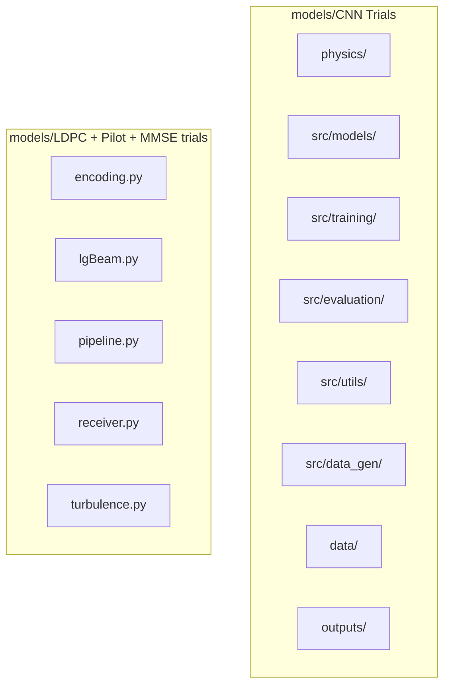
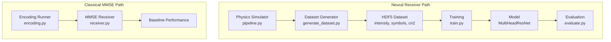
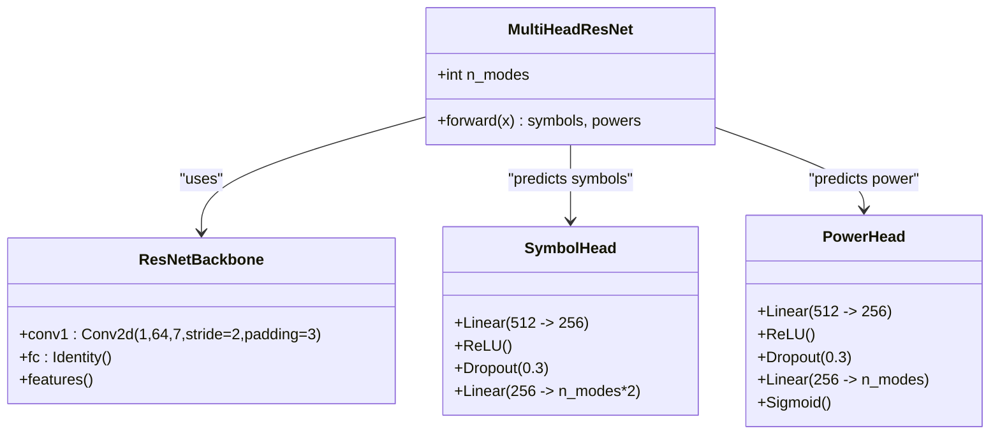
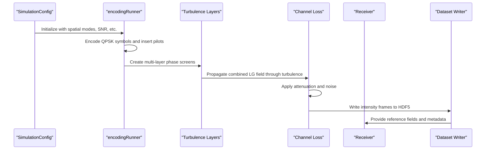
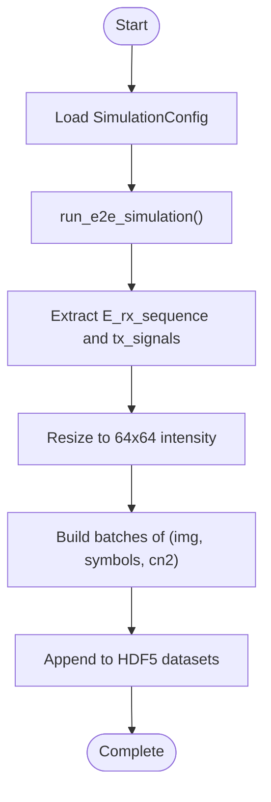
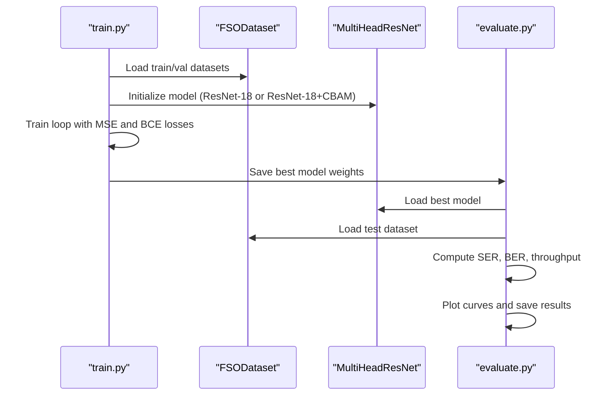
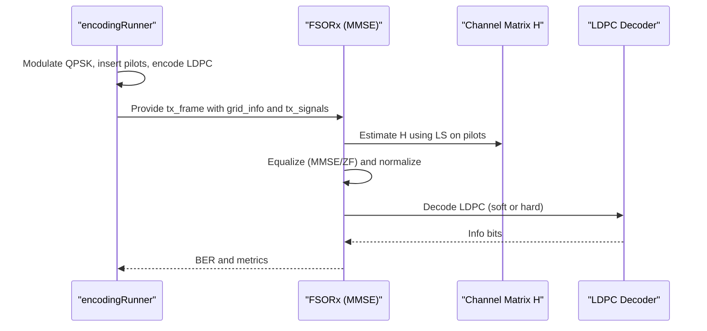
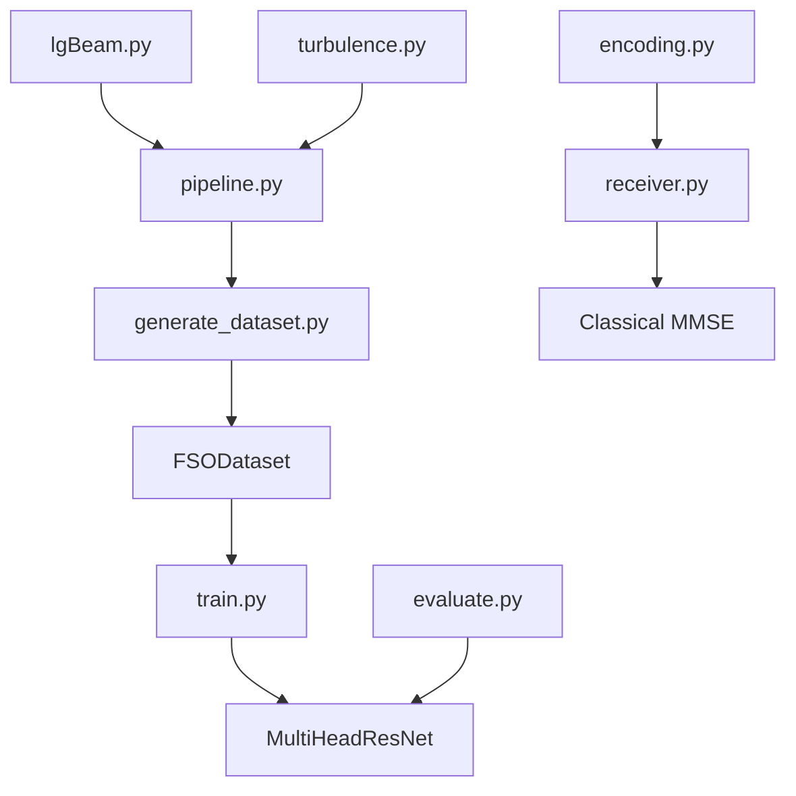

# System Architecture

<cite>
**Referenced Files in This Document**
- [README.md](file://README.md)
- [requirements.txt](file://requirements.txt)
- [models/CNN Trials/requirements.txt](file://models/CNN Trials/requirements.txt)
- [models/CNN Trials/physics/pipeline.py](file://models/CNN Trials/physics/pipeline.py)
- [models/CNN Trials/physics/lgBeam.py](file://models/CNN Trials/physics/lgBeam.py)
- [models/CNN Trials/physics/turbulence.py](file://models/CNN Trials/physics/turbulence.py)
- [models/CNN Trials/physics/receiver.py](file://models/CNN Trials/physics/receiver.py)
- [models/CNN Trials/src/models/model.py](file://models/CNN Trials/src/models/model.py)
- [models/CNN Trials/src/models/resnet_cbam.py](file://models/CNN Trials/src/models/resnet_cbam.py)
- [models/CNN Trials/src/training/train.py](file://models/CNN Trials/src/training/train.py)
- [models/CNN Trials/src/evaluation/evaluate.py](file://models/CNN Trials/src/evaluation/evaluate.py)
- [models/CNN Trials/src/utils/dataset.py](file://models/CNN Trials/src/utils/dataset.py)
- [models/CNN Trials/src/data_gen/generate_dataset.py](file://models/CNN Trials/src/data_gen/generate_dataset.py)
- [models/LDPC + Pilot + MMSE trials/encoding.py](file://models/LDPC + Pilot + MMSE trials/encoding.py)
</cite>

## Table of Contents
1. [Introduction](#introduction)
2. [Project Structure](#project-structure)
3. [Core Components](#core-components)
4. [Architecture Overview](#architecture-overview)
5. [Detailed Component Analysis](#detailed-component-analysis)
6. [Dependency Analysis](#dependency-analysis)
7. [Performance Considerations](#performance-considerations)
8. [Troubleshooting Guide](#troubleshooting-guide)
9. [Conclusion](#conclusion)

## Introduction
This document describes the system architecture for the Free Space Optics (FSO) beam recovery system. The system consists of two complementary pathways:
- A physics-based simulation pipeline that generates synthetic datasets by propagating Laguerre-Gaussian (LG) beams through atmospheric turbulence and capturing intensity images.
- A machine learning pipeline that trains a CNN to recover complex QPSK symbols directly from these intensity-only measurements.

The architecture emphasizes a clear separation between:
- Physics simulation (neural receiver training data generation)
- Machine learning training and evaluation
- Classical MMSE baseline receiver for comparison

## Project Structure
The repository is organized into two major areas:
- models/CNN Trials: Neural receiver development, training, evaluation, and data generation
- models/LDPC + Pilot + MMSE trials: Classical MMSE baseline implementation and analysis

**Diagram sources**
- [models/CNN Trials/physics/pipeline.py](file://models/CNN Trials/physics/pipeline.py#L1-L717)
- [models/LDPC + Pilot + MMSE trials/encoding.py](file://models/LDPC + Pilot + MMSE trials/encoding.py#L1-L960)

**Section sources**
- [README.md](file://README.md#L311-L350)

## Core Components
- Neural Receiver (CNN): A multi-head CNN that predicts complex QPSK symbols and mode power from 64×64 intensity images. It uses a ResNet-18 backbone enhanced with Convolutional Block Attention Modules (CBAM).
- Physics Simulation Pipeline: A complete end-to-end simulator that:
  - Encodes data into QPSK symbols and multiplexes LG modes
  - Propagates the combined field through atmospheric turbulence using split-step propagation
  - Applies attenuation and noise
  - Outputs intensity sequences suitable for training the neural receiver
- Classical MMSE Baseline: An MMSE receiver that estimates channel matrices, performs equalization, and decodes LDPC codes. This provides a benchmark for the neural receiver.
- Data Generation Pipeline: Converts simulation results into HDF5 datasets containing intensity images, target symbols, and turbulence parameters.

**Section sources**
- [models/CNN Trials/src/models/model.py](file://models/CNN Trials/src/models/model.py#L1-L81)
- [models/CNN Trials/physics/pipeline.py](file://models/CNN Trials/physics/pipeline.py#L64-L440)
- [models/LDPC + Pilot + MMSE trials/encoding.py](file://models/LDPC + Pilot + MMSE trials/encoding.py#L544-L751)

## Architecture Overview
The system employs a dual-path architecture:
- Neural Receiver Path: Physics simulator generates training data; CNN learns to map intensity images to complex symbols.
- Classical MMSE Path: Simulates the same scenario with MMSE equalization and LDPC decoding for performance comparison.

**Diagram sources**
- [models/CNN Trials/physics/pipeline.py](file://models/CNN Trials/physics/pipeline.py#L64-L440)
- [models/CNN Trials/src/data_gen/generate_dataset.py](file://models/CNN Trials/src/data_gen/generate_dataset.py#L57-L164)
- [models/CNN Trials/src/training/train.py](file://models/CNN Trials/src/training/train.py#L16-L137)
- [models/CNN Trials/src/evaluation/evaluate.py](file://models/CNN Trials/src/evaluation/evaluate.py#L80-L315)
- [models/LDPC + Pilot + MMSE trials/encoding.py](file://models/LDPC + Pilot + MMSE trials/encoding.py#L544-L751)
- [models/CNN Trials/physics/receiver.py](file://models/CNN Trials/physics/receiver.py#L370-L752)

## Detailed Component Analysis

### Neural Receiver Architecture
The neural receiver is a multi-head CNN designed to predict both complex QPSK symbols and mode power from intensity images.

**Diagram sources**
- [models/CNN Trials/src/models/model.py](file://models/CNN Trials/src/models/model.py#L6-L71)
- [models/CNN Trials/src/models/resnet_cbam.py](file://models/CNN Trials/src/models/resnet_cbam.py#L51-L112)

Key implementation details:
- Input: 64×64×1 intensity images (single-channel)
- Backbone: Modified ResNet-18 (1-channel input) or ResNet-18 with CBAM
- Heads:
  - Symbol Head: Multi-output regression predicting real and imaginary parts for each mode
  - Power Head: Auxiliary classification/regression for mode power presence
- Training uses weighted loss combining MSE for symbols and BCE for power

**Section sources**
- [models/CNN Trials/src/models/model.py](file://models/CNN Trials/src/models/model.py#L6-L71)
- [models/CNN Trials/src/models/resnet_cbam.py](file://models/CNN Trials/src/models/resnet_cbam.py#L108-L112)

### Physics Simulation Engine
The physics simulator generates realistic FSO-OAM scenarios by:
- Multiplexing LG modes with QPSK symbols
- Propagating the combined field through atmospheric turbulence using split-step propagation
- Applying geometric and atmospheric losses
- Adding noise
- Producing intensity sequences for dataset creation

**Diagram sources**
- [models/CNN Trials/physics/pipeline.py](file://models/CNN Trials/physics/pipeline.py#L64-L440)
- [models/CNN Trials/physics/turbulence.py](file://models/CNN Trials/physics/turbulence.py#L261-L353)
- [models/CNN Trials/src/data_gen/generate_dataset.py](file://models/CNN Trials/src/data_gen/generate_dataset.py#L121-L161)

Core modules:
- LaguerreGaussianBeam: Defines LG modes, beam parameters, and field generation
- Turbulence: Generates phase screens and applies split-step propagation
- Receiver: Provides demultiplexing, channel estimation, equalization, and LDPC decoding
- Dataset Generator: Resizes fields to 64×64, writes HDF5 with intensity, symbols, and cn2

**Section sources**
- [models/CNN Trials/physics/lgBeam.py](file://models/CNN Trials/physics/lgBeam.py#L10-L176)
- [models/CNN Trials/physics/turbulence.py](file://models/CNN Trials/physics/turbulence.py#L31-L353)
- [models/CNN Trials/physics/receiver.py](file://models/CNN Trials/physics/receiver.py#L370-L752)
- [models/CNN Trials/src/data_gen/generate_dataset.py](file://models/CNN Trials/src/data_gen/generate_dataset.py#L33-L161)

### Data Generation Pipeline
The dataset generation pipeline converts simulation outputs into training-ready HDF5 files:
- Resizes complex fields to 64×64 intensity images
- Collects per-symbol targets (real and imaginary parts)
- Stores turbulence strength (Cn²) for per-point analysis
- Writes attributes including number of modes

**Diagram sources**
- [models/CNN Trials/src/data_gen/generate_dataset.py](file://models/CNN Trials/src/data_gen/generate_dataset.py#L57-L164)

**Section sources**
- [models/CNN Trials/src/data_gen/generate_dataset.py](file://models/CNN Trials/src/data_gen/generate_dataset.py#L23-L164)
- [models/CNN Trials/src/utils/dataset.py](file://models/CNN Trials/src/utils/dataset.py#L6-L44)

### Training and Evaluation
Training and evaluation workflows:
- Training: Loads HDF5 datasets, defines loss functions, and trains the model with scheduled learning rate decay
- Evaluation: Loads trained model, computes SER and BER, and generates throughput plots

**Diagram sources**
- [models/CNN Trials/src/training/train.py](file://models/CNN Trials/src/training/train.py#L16-L137)
- [models/CNN Trials/src/evaluation/evaluate.py](file://models/CNN Trials/src/evaluation/evaluate.py#L80-L315)
- [models/CNN Trials/src/utils/dataset.py](file://models/CNN Trials/src/utils/dataset.py#L6-L44)

**Section sources**
- [models/CNN Trials/src/training/train.py](file://models/CNN Trials/src/training/train.py#L16-L137)
- [models/CNN Trials/src/evaluation/evaluate.py](file://models/CNN Trials/src/evaluation/evaluate.py#L80-L315)

### Classical MMSE Baseline
The classical MMSE baseline demonstrates the performance gap addressed by the neural receiver:
- Encoding: QPSK modulation, pilot insertion, LDPC encoding
- Channel Estimation: LS estimation using pilot symbols
- Equalization: MMSE or ZF depending on condition number
- Decoding: LDPC decoding and BER calculation

**Diagram sources**
- [models/LDPC + Pilot + MMSE trials/encoding.py](file://models/LDPC + Pilot + MMSE trials/encoding.py#L544-L751)
- [models/CNN Trials/physics/receiver.py](file://models/CNN Trials/physics/receiver.py#L370-L752)

**Section sources**
- [models/LDPC + Pilot + MMSE trials/encoding.py](file://models/LDPC + Pilot + MMSE trials/encoding.py#L544-L751)
- [models/CNN Trials/physics/receiver.py](file://models/CNN Trials/physics/receiver.py#L370-L752)

## Dependency Analysis
The system exhibits clear separation of concerns:
- Physics simulator depends on LG beam modeling, turbulence generation, and receiver utilities
- ML pipeline depends on the physics simulator outputs and PyTorch training utilities
- Classical baseline mirrors the physics simulator’s inputs and outputs for fair comparison

**Diagram sources**
- [models/CNN Trials/physics/pipeline.py](file://models/CNN Trials/physics/pipeline.py#L19-L32)
- [models/CNN Trials/src/data_gen/generate_dataset.py](file://models/CNN Trials/src/data_gen/generate_dataset.py#L17-L21)
- [models/CNN Trials/src/utils/dataset.py](file://models/CNN Trials/src/utils/dataset.py#L6-L16)
- [models/CNN Trials/src/training/train.py](file://models/CNN Trials/src/training/train.py#L12-L14)
- [models/CNN Trials/src/evaluation/evaluate.py](file://models/CNN Trials/src/evaluation/evaluate.py#L9-L10)
- [models/LDPC + Pilot + MMSE trials/encoding.py](file://models/LDPC + Pilot + MMSE trials/encoding.py#L19-L28)
- [models/CNN Trials/physics/receiver.py](file://models/CNN Trials/physics/receiver.py#L22-L25)

**Section sources**
- [models/CNN Trials/physics/pipeline.py](file://models/CNN Trials/physics/pipeline.py#L19-L32)
- [models/CNN Trials/src/data_gen/generate_dataset.py](file://models/CNN Trials/src/data_gen/generate_dataset.py#L17-L21)
- [models/LDPC + Pilot + MMSE trials/encoding.py](file://models/LDPC + Pilot + MMSE trials/encoding.py#L19-L28)

## Performance Considerations
- Training time: The README documents approximately 6 hours on a single V100 GPU for 100k samples over 50 epochs
- Inference time: Neural receiver achieves constant-time inference (1.5 ms on GPU), while classical MMSE involves costly matrix inversion
- Hardware acceleration: The system leverages PyTorch with MPS (Apple Silicon) support and CUDA when available
- Dataset size: Large-scale datasets are essential for robustness across turbulence regimes

[No sources needed since this section provides general guidance]

## Troubleshooting Guide
Common issues and resolutions:
- Import errors in physics modules: Ensure lgBeam.py, encoding.py, fsplAtmAttenuation.py, turbulence.py, and receiver.py are available in the physics directory
- Dataset loading failures: Verify HDF5 files exist and attributes (n_modes) are correctly written
- Training divergences: Check learning rate scheduling and loss weighting; validate input normalization
- Evaluation mismatches: Confirm model backbone selection matches training and that dataset shapes align

**Section sources**
- [models/CNN Trials/physics/pipeline.py](file://models/CNN Trials/physics/pipeline.py#L29-L32)
- [models/CNN Trials/src/utils/dataset.py](file://models/CNN Trials/src/utils/dataset.py#L11-L22)
- [models/CNN Trials/src/training/train.py](file://models/CNN Trials/src/training/train.py#L43-L56)

## Conclusion
The FSO beam recovery system integrates a physics-based simulation pipeline with a machine learning training framework to enable robust OAM beam recovery in atmospheric turbulence. The dual-path architecture—neural receiver and classical MMSE baseline—provides a rigorous benchmark for evaluating the neural approach. The modular design ensures clear separation between simulation, training, and evaluation, facilitating reproducibility and extensibility.