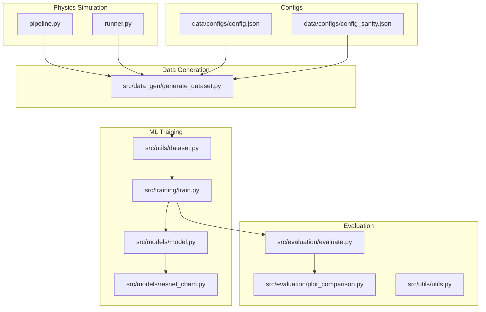
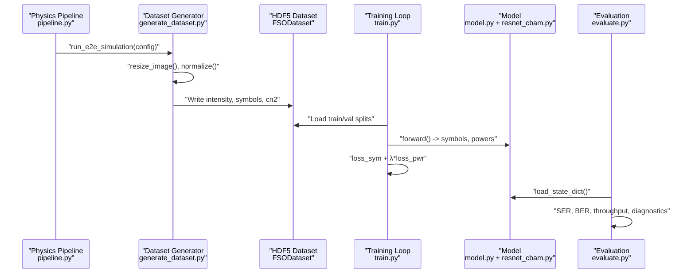
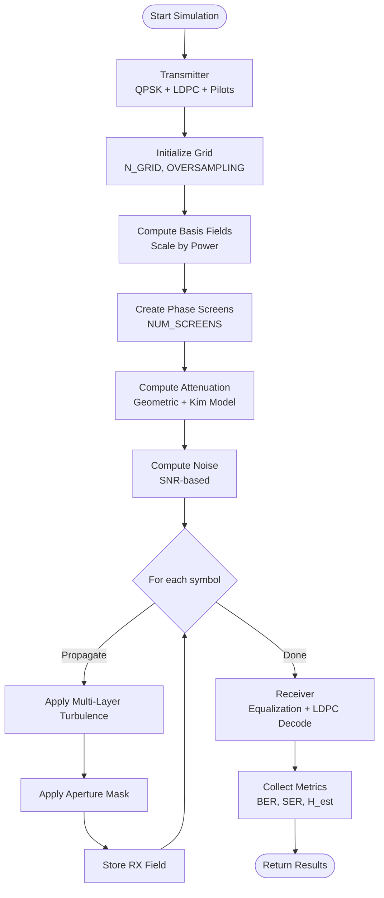
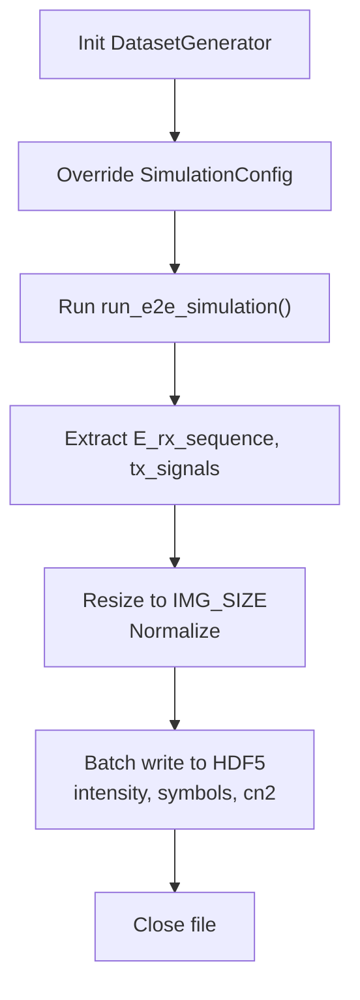
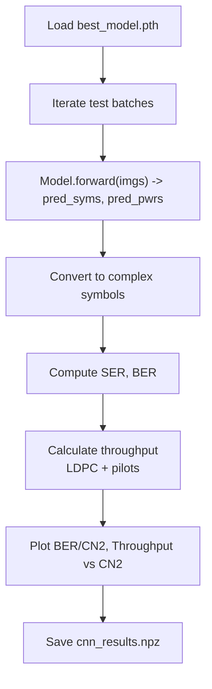
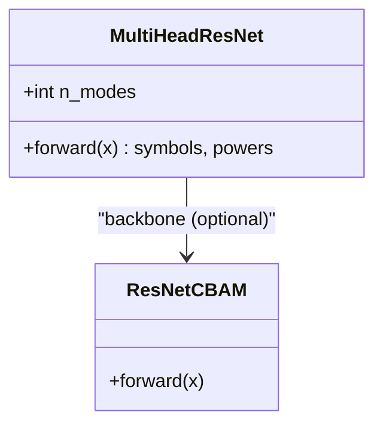
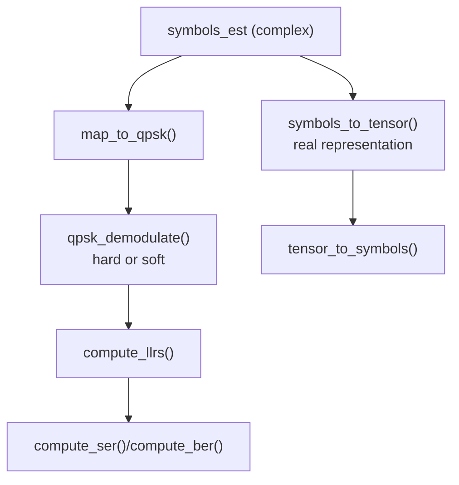
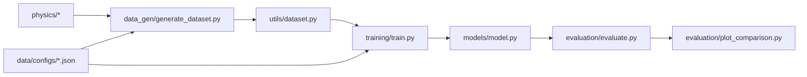

# System Integration Patterns

<cite>
**Referenced Files in This Document**
- [README.md](file://README.md)
- [requirements.txt](file://models/CNN Trials/requirements.txt)
- [pipeline.py](file://models/CNN Trials/physics/pipeline.py)
- [runner.py](file://models/CNN Trials/physics/runner.py)
- [generate_dataset.py](file://models/CNN Trials/src/data_gen/generate_dataset.py)
- [train.py](file://models/CNN Trials/src/training/train.py)
- [evaluate.py](file://models/CNN Trials/src/evaluation/evaluate.py)
- [plot_comparison.py](file://models/CNN Trials/src/evaluation/plot_comparison.py)
- [model.py](file://models/CNN Trials/src/models/model.py)
- [resnet_cbam.py](file://models/CNN Trials/src/models/resnet_cbam.py)
- [dataset.py](file://models/CNN Trials/src/utils/dataset.py)
- [utils.py](file://models/CNN Trials/src/utils/utils.py)
- [config.json](file://models/CNN Trials/data/configs/config.json)
- [config_sanity.json](file://models/CNN Trials/data/configs/config_sanity.json)
</cite>

## Table of Contents
1. [Introduction](#introduction)
2. [Project Structure](#project-structure)
3. [Core Components](#core-components)
4. [Architecture Overview](#architecture-overview)
5. [Detailed Component Analysis](#detailed-component-analysis)
6. [Dependency Analysis](#dependency-analysis)
7. [Performance Considerations](#performance-considerations)
8. [Troubleshooting Guide](#troubleshooting-guide)
9. [Conclusion](#conclusion)
10. [Appendices](#appendices)

## Introduction
This document describes the system integration patterns and component interaction workflows for a free-space optical (FSO) communication system that recovers orbital angular momentum (OAM) signals using deep learning. The pipeline spans physics-based simulation, dataset generation, model training, and evaluation. It documents data flows, interface specifications, configuration management, error handling, resource allocation, and extensibility points for adding new physics models or evaluation metrics.

## Project Structure
The project is organized into modular subsystems:
- Physics simulation engine: end-to-end propagation and channel modeling
- Data generation: HDF5 dataset creation from simulations
- Machine learning: CNN-based receiver training and evaluation
- Utilities: dataset loaders, metrics, and visualization helpers
- Configuration: JSON-based system and dataset parameters



**Diagram sources**
- [pipeline.py](file://models/CNN Trials/physics/pipeline.py#L64-L440)
- [runner.py](file://models/CNN Trials/physics/runner.py#L128-L505)
- [generate_dataset.py](file://models/CNN Trials/src/data_gen/generate_dataset.py#L23-L175)
- [train.py](file://models/CNN Trials/src/training/train.py#L16-L150)
- [model.py](file://models/CNN Trials/src/models/model.py#L6-L81)
- [resnet_cbam.py](file://models/CNN Trials/src/models/resnet_cbam.py#L51-L112)
- [dataset.py](file://models/CNN Trials/src/utils/dataset.py#L6-L44)
- [evaluate.py](file://models/CNN Trials/src/evaluation/evaluate.py#L80-L315)
- [plot_comparison.py](file://models/CNN Trials/src/evaluation/plot_comparison.py#L6-L84)
- [config.json](file://models/CNN Trials/data/configs/config.json#L1-L136)
- [config_sanity.json](file://models/CNN Trials/data/configs/config_sanity.json#L1-L106)

**Section sources**
- [README.md](file://README.md#L311-L350)

## Core Components
- Physics pipeline: orchestrates transmitter, turbulence, propagation, receiver, and metrics collection
- Dataset generator: converts simulation outputs into HDF5 with intensity images and ground-truth symbols
- ML model: multi-head CNN with optional CBAM attention heads
- Training loop: supervised learning with MSE and auxiliary power loss
- Evaluation suite: BER/SER metrics, throughput calculations, and visualization
- Utilities: dataset loader, QPSK mapping, LLR computation, and tensor conversions
- Configuration: JSON-driven system parameters, dataset sizes, and augmentation policies

**Section sources**
- [pipeline.py](file://models/CNN Trials/physics/pipeline.py#L64-L440)
- [generate_dataset.py](file://models/CNN Trials/src/data_gen/generate_dataset.py#L23-L175)
- [model.py](file://models/CNN Trials/src/models/model.py#L6-L81)
- [train.py](file://models/CNN Trials/src/training/train.py#L16-L150)
- [evaluate.py](file://models/CNN Trials/src/evaluation/evaluate.py#L80-L315)
- [dataset.py](file://models/CNN Trials/src/utils/dataset.py#L6-L44)
- [utils.py](file://models/CNN Trials/src/utils/utils.py#L32-L318)
- [config.json](file://models/CNN Trials/data/configs/config.json#L1-L136)

## Architecture Overview
The system integrates three major data pipelines:
1) Physics simulation to synthetic data
2) Dataset ingestion to training
3) Model inference to evaluation



**Diagram sources**
- [pipeline.py](file://models/CNN Trials/physics/pipeline.py#L64-L440)
- [generate_dataset.py](file://models/CNN Trials/src/data_gen/generate_dataset.py#L57-L164)
- [dataset.py](file://models/CNN Trials/src/utils/dataset.py#L6-L44)
- [train.py](file://models/CNN Trials/src/training/train.py#L16-L137)
- [model.py](file://models/CNN Trials/src/models/model.py#L59-L71)
- [resnet_cbam.py](file://models/CNN Trials/src/models/resnet_cbam.py#L108-L112)
- [evaluate.py](file://models/CNN Trials/src/evaluation/evaluate.py#L80-L315)

## Detailed Component Analysis

### Physics Simulation Pipeline
The physics pipeline encapsulates:
- Transmitter: QPSK modulation, LDPC encoding, pilot insertion, and LG beam basis generation
- Channel: multi-layer phase screens, atmospheric attenuation, geometric losses
- Propagation: split-step Fourier propagation per symbol
- Receiver: MMSE equalization and LDPC decoding
- Metrics: BER, SER, channel matrix estimation, throughput



**Diagram sources**
- [pipeline.py](file://models/CNN Trials/physics/pipeline.py#L64-L440)
- [runner.py](file://models/CNN Trials/physics/runner.py#L128-L505)

**Section sources**
- [pipeline.py](file://models/CNN Trials/physics/pipeline.py#L64-L440)
- [runner.py](file://models/CNN Trials/physics/runner.py#L128-L505)

### Dataset Generation
The dataset generator:
- Resizes complex fields to fixed-size intensity images
- Normalizes per-sample intensities
- Writes HDF5 with keys: intensity, symbols, cn2
- Supports configurable simulation parameters via nested overrides



**Diagram sources**
- [generate_dataset.py](file://models/CNN Trials/src/data_gen/generate_dataset.py#L23-L175)

**Section sources**
- [generate_dataset.py](file://models/CNN Trials/src/data_gen/generate_dataset.py#L23-L175)

### Training Pipeline
The training pipeline:
- Loads datasets from HDF5
- Builds MultiHeadResNet with optional CBAM backbone
- Uses MSE for symbol regression and BCE for power auxiliary task
- Saves best and last checkpoints, plots training history

```mermaid
sequenceDiagram
participant Loader as "FSODataset"
participant Train as "train.py"
participant Model as "MultiHeadResNet"
participant Opt as "Optimizer"
Train->>Loader : "Create train/val datasets"
Train->>Model : "Instantiate model(backbone)"
loop Epochs
Train->>Loader : "Iterate batches"
Train->>Model : "forward(imgs)"
Train->>Train : "loss_sym + λ*loss_pwr"
Train->>Opt : "backward() + step()"
end
Train->>Train : "Save best/last checkpoints"
```

**Diagram sources**
- [dataset.py](file://models/CNN Trials/src/utils/dataset.py#L6-L44)
- [train.py](file://models/CNN Trials/src/training/train.py#L16-L137)
- [model.py](file://models/CNN Trials/src/models/model.py#L6-L81)
- [resnet_cbam.py](file://models/CNN Trials/src/models/resnet_cbam.py#L108-L112)

**Section sources**
- [train.py](file://models/CNN Trials/src/training/train.py#L16-L150)
- [dataset.py](file://models/CNN Trials/src/utils/dataset.py#L6-L44)
- [model.py](file://models/CNN Trials/src/models/model.py#L6-L81)

### Evaluation and Reporting
The evaluation pipeline:
- Loads best model weights
- Computes SER and BER across test samples
- Calculates throughput considering LDPC and pilot overhead
- Produces diagnostic plots and saves numerical results for comparison



**Diagram sources**
- [evaluate.py](file://models/CNN Trials/src/evaluation/evaluate.py#L80-L315)
- [plot_comparison.py](file://models/CNN Trials/src/evaluation/plot_comparison.py#L6-L84)

**Section sources**
- [evaluate.py](file://models/CNN Trials/src/evaluation/evaluate.py#L80-L315)
- [plot_comparison.py](file://models/CNN Trials/src/evaluation/plot_comparison.py#L6-L84)

### Model Architecture
The model is a multi-head CNN:
- Backbone: ResNet-18 or ResNet-18 + CBAM
- Input: single-channel 64x64 intensity images
- Heads:
  - Symbol head: predicts real/imag parts for each of 8 modes
  - Power head: auxiliary sigmoid output per mode



**Diagram sources**
- [model.py](file://models/CNN Trials/src/models/model.py#L6-L81)
- [resnet_cbam.py](file://models/CNN Trials/src/models/resnet_cbam.py#L51-L112)

**Section sources**
- [model.py](file://models/CNN Trials/src/models/model.py#L6-L81)
- [resnet_cbam.py](file://models/CNN Trials/src/models/resnet_cbam.py#L51-L112)

### Utility Functions and Data Transforms
Utilities provide:
- QPSK mapping and demodulation (hard and soft)
- LLR computation for LDPC decoding
- SER/BER computation
- Tensor conversion helpers for PyTorch
- Intensity normalization strategies



**Diagram sources**
- [utils.py](file://models/CNN Trials/src/utils/utils.py#L32-L318)

**Section sources**
- [utils.py](file://models/CNN Trials/src/utils/utils.py#L32-L318)

## Dependency Analysis
The system exhibits clear layering and separation of concerns:
- Physics depends on encoding, turbulence, and receiver modules
- Data generation depends on the physics pipeline
- Training depends on the dataset loader and model
- Evaluation depends on trained weights and utilities



**Diagram sources**
- [pipeline.py](file://models/CNN Trials/physics/pipeline.py#L64-L440)
- [generate_dataset.py](file://models/CNN Trials/src/data_gen/generate_dataset.py#L23-L175)
- [dataset.py](file://models/CNN Trials/src/utils/dataset.py#L6-L44)
- [train.py](file://models/CNN Trials/src/training/train.py#L16-L150)
- [model.py](file://models/CNN Trials/src/models/model.py#L6-L81)
- [evaluate.py](file://models/CNN Trials/src/evaluation/evaluate.py#L80-L315)
- [plot_comparison.py](file://models/CNN Trials/src/evaluation/plot_comparison.py#L6-L84)
- [config.json](file://models/CNN Trials/data/configs/config.json#L1-L136)
- [config_sanity.json](file://models/CNN Trials/data/configs/config_sanity.json#L1-L106)

**Section sources**
- [requirements.txt](file://models/CNN Trials/requirements.txt#L1-L33)

## Performance Considerations
- Device selection: automatic CUDA/MPS/CPU detection with MPS preferred for Apple Silicon
- Data loading: single-process DataLoader to avoid GPU memory fragmentation
- Model efficiency: CBAM adds minimal overhead while improving strong-turbulence resilience
- Training throughput: optimized loss weighting and reduced validation frequency
- Evaluation: vectorized computations for SER/BER and throughput calculations

[No sources needed since this section provides general guidance]

## Troubleshooting Guide
Common issues and remedies:
- Import errors in physics modules: ensure lgBeam and related modules are available in the physics directory
- Empty or mismatched symbol lengths: increase info bits to accommodate pilot overhead
- Low throughput or link failure: verify LDPC rate, pilot overhead, and SNR assumptions
- Training instability: adjust learning rate, monitor validation loss, and consider auxiliary power loss
- Device compatibility: confirm MPS availability on Apple Silicon or CUDA availability on Linux/Windows

**Section sources**
- [pipeline.py](file://models/CNN Trials/physics/pipeline.py#L29-L32)
- [runner.py](file://models/CNN Trials/physics/runner.py#L259-L273)
- [train.py](file://models/CNN Trials/src/training/train.py#L17-L18)
- [evaluate.py](file://models/CNN Trials/src/evaluation/evaluate.py#L12-L61)

## Conclusion
The system integrates physics-based simulation, dataset generation, and deep learning training into a cohesive pipeline. Clear interfaces, modular components, and JSON-based configuration enable independent development and testing. Extensibility supports new physics models, evaluation metrics, and architectures while maintaining backward compatibility.

[No sources needed since this section summarizes without analyzing specific files]

## Appendices

### Configuration Management Patterns
- System-level parameters: wavelength, beam waist, distance, receiver diameter, spatial modes, pilot ratio, LDPC rate, SNR, grid size, oversampling
- Dataset-level parameters: train/val/test sizes, CN2 sampling ranges and weights, normalization, augmentation
- JSON-driven defaults with override capabilities in dataset generation

**Section sources**
- [config.json](file://models/CNN Trials/data/configs/config.json#L1-L136)
- [config_sanity.json](file://models/CNN Trials/data/configs/config_sanity.json#L1-L106)
- [generate_dataset.py](file://models/CNN Trials/src/data_gen/generate_dataset.py#L61-L93)

### Interface Specifications
- Dataset interface: FSODataset loads intensity images and targets (symbols, powers) from HDF5
- Model interface: MultiHeadResNet forward returns symbols and power predictions
- Evaluation interface: evaluate writes BER/CN2 and throughput arrays to npz for downstream plotting

**Section sources**
- [dataset.py](file://models/CNN Trials/src/utils/dataset.py#L6-L44)
- [model.py](file://models/CNN Trials/src/models/model.py#L59-L71)
- [evaluate.py](file://models/CNN Trials/src/evaluation/evaluate.py#L284-L286)

### Extensibility Points
- Adding new physics models: implement new channel or propagation routines and integrate via the physics pipeline
- Adding evaluation metrics: extend evaluation functions to compute additional metrics and update plotting utilities
- New architectures: swap or extend the backbone in MultiHeadResNet and adjust heads accordingly

**Section sources**
- [pipeline.py](file://models/CNN Trials/physics/pipeline.py#L64-L440)
- [model.py](file://models/CNN Trials/src/models/model.py#L6-L81)
- [evaluate.py](file://models/CNN Trials/src/evaluation/evaluate.py#L12-L61)