# Training and Evaluation Framework

<cite>
**Referenced Files in This Document**
- [README.md](file://README.md)
- [requirements.txt](file://models/CNN Trials/requirements.txt)
- [config.json](file://models/CNN Trials/data/configs/config.json)
- [config_sanity.json](file://models/CNN Trials/data/configs/config_sanity.json)
- [generate_dataset.py](file://models/CNN Trials/data/generators/generate_dataset.py)
- [dataset.py](file://models/CNN Trials/src/utils/dataset.py)
- [device_utils.py](file://models/CNN Trials/src/utils/device_utils.py)
- [model.py](file://models/CNN Trials/src/models/model.py)
- [resnet_cbam.py](file://models/CNN Trials/src/models/resnet_cbam.py)
- [attention.py](file://models/CNN Trials/src/models/attention.py)
- [train.py](file://models/CNN Trials/src/training/train.py)
- [evaluate.py](file://models/CNN Trials/src/evaluation/evaluate.py)
- [utils.py](file://models/CNN Trials/src/utils/utils.py)
- [plot_comparison.py](file://models/CNN Trials/src/evaluation/plot_comparison.py)
- [head_to_head.py](file://models/CNN Trials/src/evaluation/head_to_head.py)
- [debug_physics.py](file://models/CNN Trials/src/utils/debug_physics.py)
</cite>

## Table of Contents
1. [Introduction](#introduction)
2. [Project Structure](#project-structure)
3. [Core Components](#core-components)
4. [Architecture Overview](#architecture-overview)
5. [Detailed Component Analysis](#detailed-component-analysis)
6. [Dependency Analysis](#dependency-analysis)
7. [Performance Considerations](#performance-considerations)
8. [Troubleshooting Guide](#troubleshooting-guide)
9. [Conclusion](#conclusion)
10. [Appendices](#appendices)

## Introduction
This document describes the training and evaluation framework for a neural receiver that recovers complex QPSK symbols from intensity-only measurements in free-space optical (FSO) communication under atmospheric turbulence. The framework supports:
- Multi-head loss design combining symbol regression and auxiliary power classification
- Automatic device detection (CUDA/MPS/CPU) with runtime optimization
- Progressive validation and checkpoint management during training
- Comprehensive evaluation metrics (SER and BER), constellation analysis, and comparative performance assessment across model variants
- Practical guidance for training configuration, hyperparameter tuning, and visualization tools
- Debugging techniques, convergence monitoring, and troubleshooting common training issues

## Project Structure
The repository organizes code by functional area: data generation, training, evaluation, and utilities. The CNN Trials project is the primary implementation of the neural receiver.

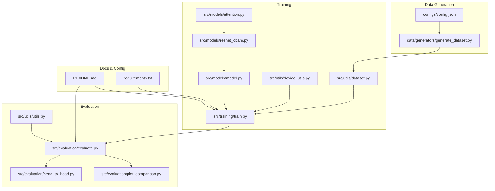

**Diagram sources**
- [README.md](file://README.md#L311-L350)
- [config.json](file://models/CNN Trials/data/configs/config.json#L1-L136)
- [generate_dataset.py](file://models/CNN Trials/data/generators/generate_dataset.py#L1-L598)
- [dataset.py](file://models/CNN Trials/src/utils/dataset.py#L1-L44)
- [device_utils.py](file://models/CNN Trials/src/utils/device_utils.py#L1-L217)
- [model.py](file://models/CNN Trials/src/models/model.py#L1-L81)
- [resnet_cbam.py](file://models/CNN Trials/src/models/resnet_cbam.py#L1-L112)
- [attention.py](file://models/CNN Trials/src/models/attention.py#L1-L89)
- [train.py](file://models/CNN Trials/src/training/train.py#L1-L150)
- [evaluate.py](file://models/CNN Trials/src/evaluation/evaluate.py#L1-L315)
- [plot_comparison.py](file://models/CNN Trials/src/evaluation/plot_comparison.py#L1-L84)
- [head_to_head.py](file://models/CNN Trials/src/evaluation/head_to_head.py#L1-L158)
- [utils.py](file://models/CNN Trials/src/utils/utils.py#L1-L318)
- [requirements.txt](file://models/CNN Trials/requirements.txt#L1-L33)

**Section sources**
- [README.md](file://README.md#L311-L350)
- [requirements.txt](file://models/CNN Trials/requirements.txt#L1-L33)

## Core Components
- Multi-Head Model: A ResNet-18 backbone with optional CBAM attention, producing two outputs:
  - Symbol head: predicts real and imaginary parts of QPSK symbols per mode
  - Power head: auxiliary classification/regression for mode power presence
- Multi-Head Loss: Combines symbol MSE and power BCE with a weighted sum
- Automatic Device Detection: Detects CUDA, MPS, or CPU and applies device-specific optimizations
- Progressive Validation: Tracks validation loss, updates learning rate via ReduceLROnPlateau, and saves best and last checkpoints
- Evaluation Pipeline: Computes SER and BER, breakdown by turbulence strength, throughput estimation, constellation plots, and comparative plots

**Section sources**
- [model.py](file://models/CNN Trials/src/models/model.py#L6-L71)
- [train.py](file://models/CNN Trials/src/training/train.py#L30-L104)
- [device_utils.py](file://models/CNN Trials/src/utils/device_utils.py#L15-L103)
- [evaluate.py](file://models/CNN Trials/src/evaluation/evaluate.py#L80-L305)

## Architecture Overview
The training and evaluation pipeline integrates physics-based data generation, a multi-head neural network, and evaluation metrics.

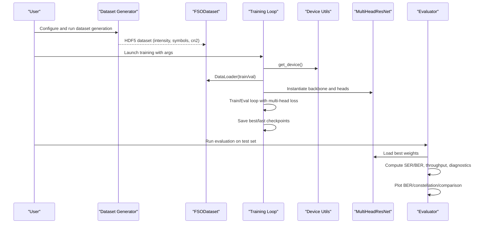

**Diagram sources**
- [generate_dataset.py](file://models/CNN Trials/data/generators/generate_dataset.py#L408-L528)
- [dataset.py](file://models/CNN Trials/src/utils/dataset.py#L6-L43)
- [device_utils.py](file://models/CNN Trials/src/utils/device_utils.py#L15-L46)
- [model.py](file://models/CNN Trials/src/models/model.py#L18-L71)
- [train.py](file://models/CNN Trials/src/training/train.py#L16-L136)
- [evaluate.py](file://models/CNN Trials/src/evaluation/evaluate.py#L80-L305)

## Detailed Component Analysis

### Multi-Head Loss Function Design
- Symbol Head Loss: Mean Squared Error between predicted and target complex-valued symbol components
- Power Head Loss: Binary Cross Entropy between predicted mode power and binary indicator
- Combined Loss: Weighted sum of symbol and power losses; the power term is scaled down to prevent dominance

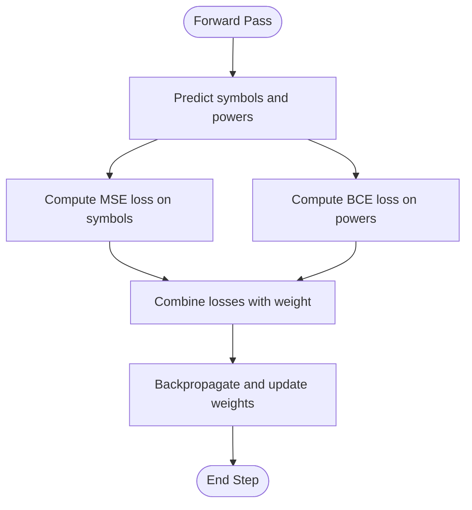

**Diagram sources**
- [train.py](file://models/CNN Trials/src/training/train.py#L71-L78)
- [model.py](file://models/CNN Trials/src/models/model.py#L38-L55)

**Section sources**
- [train.py](file://models/CNN Trials/src/training/train.py#L30-L104)
- [model.py](file://models/CNN Trials/src/models/model.py#L38-L55)

### Automatic Device Detection (CUDA/MPS/CPU)
- Detection prioritizes CUDA, then MPS (Apple Silicon), then CPU
- Provides system and device information for reproducibility
- Applies device-specific optimizations (e.g., enabling cuDNN benchmark on CUDA)
- Offers utilities to estimate optimal batch size and number of workers based on memory and CPU cores

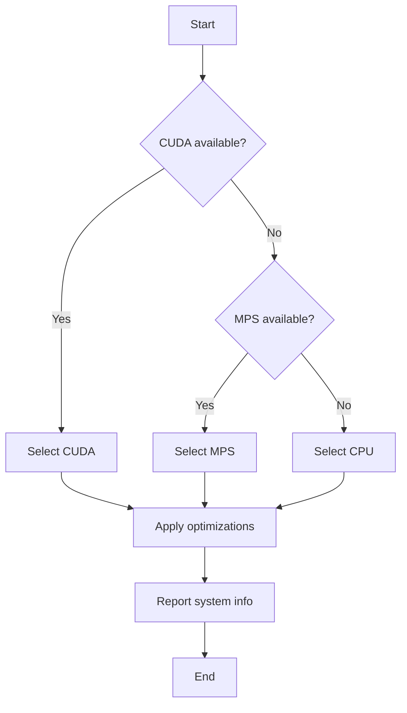

**Diagram sources**
- [device_utils.py](file://models/CNN Trials/src/utils/device_utils.py#L15-L46)
- [device_utils.py](file://models/CNN Trials/src/utils/device_utils.py#L80-L103)

**Section sources**
- [device_utils.py](file://models/CNN Trials/src/utils/device_utils.py#L15-L103)

### Progressive Validation Strategies and Checkpoint Management
- Validation after each epoch; learning rate reduced on plateau
- Saves last checkpoint every epoch and best checkpoint when validation loss improves
- Supports resume training by loading last checkpoint state

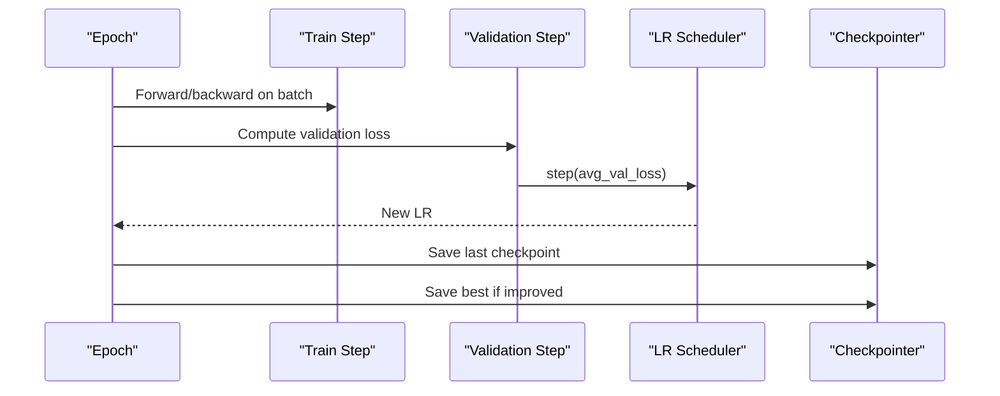

**Diagram sources**
- [train.py](file://models/CNN Trials/src/training/train.py#L63-L124)

**Section sources**
- [train.py](file://models/CNN Trials/src/training/train.py#L36-L136)

### Evaluation Metrics Computation (SER and BER)
- SER: Quadrant-based mismatch between predicted and target QPSK constellations
- BER: Bit-level error rate across all symbols and bits
- Breakdown by turbulence strength (Cn2) and throughput estimation considering pilot and LDPC overheads
- Diagnostics: Mean magnitude, phase bias, and jitter to detect common failure modes

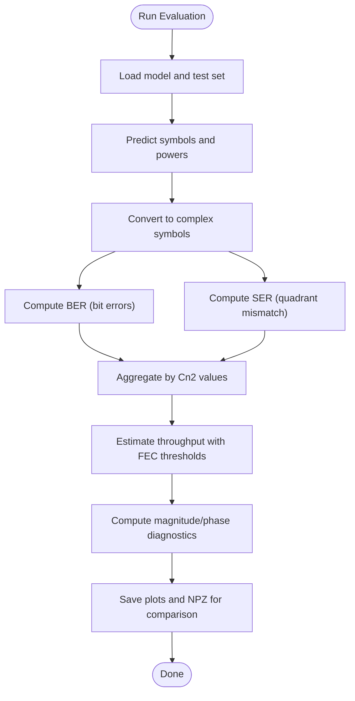

**Diagram sources**
- [evaluate.py](file://models/CNN Trials/src/evaluation/evaluate.py#L80-L305)

**Section sources**
- [evaluate.py](file://models/CNN Trials/src/evaluation/evaluate.py#L80-L305)
- [utils.py](file://models/CNN Trials/src/utils/utils.py#L117-L162)

### Constellation Analysis Workflows
- Scatter plots comparing true and predicted constellations
- Subsampled visualization to reduce clutter
- Integration with evaluation pipeline for diagnostic insights

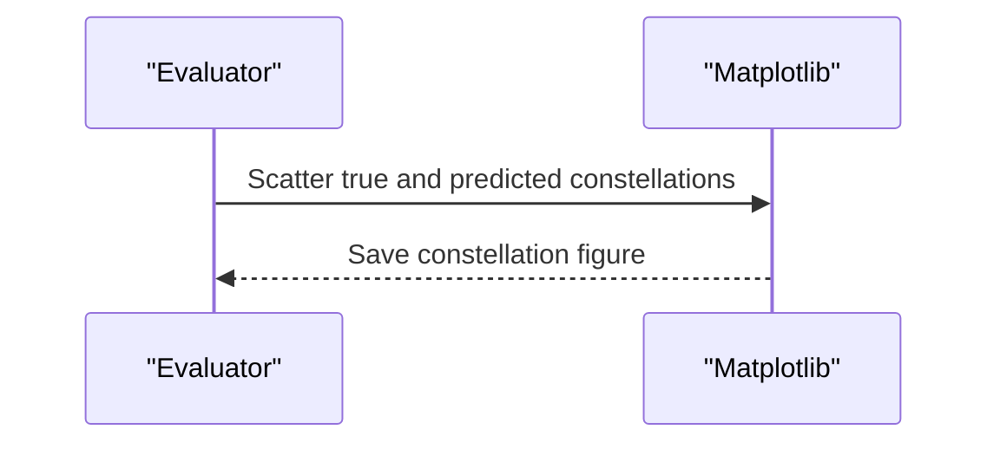

**Diagram sources**
- [evaluate.py](file://models/CNN Trials/src/evaluation/evaluate.py#L288-L304)

**Section sources**
- [evaluate.py](file://models/CNN Trials/src/evaluation/evaluate.py#L288-L304)

### Comparative Performance Assessment
- Generates comparison plots across architectures (baseline vs. CBAM)
- Interpolates MMSE baseline points for smooth curves
- Supports overlay of multiple model variants for visual regression

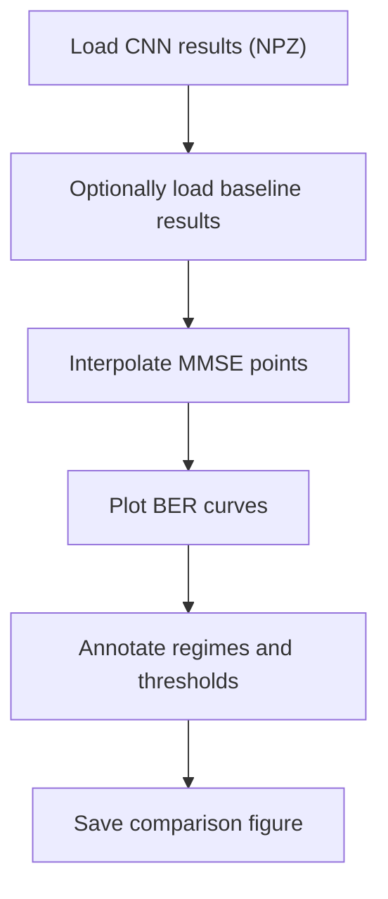

**Diagram sources**
- [plot_comparison.py](file://models/CNN Trials/src/evaluation/plot_comparison.py#L6-L80)

**Section sources**
- [plot_comparison.py](file://models/CNN Trials/src/evaluation/plot_comparison.py#L6-L84)

### Head-to-Head Baseline Comparison
- Runs physics-based MMSE baseline and compares against CNN predictions
- Aggregates BER across multiple frames for statistical significance
- Useful for verifying improvements over classical receivers

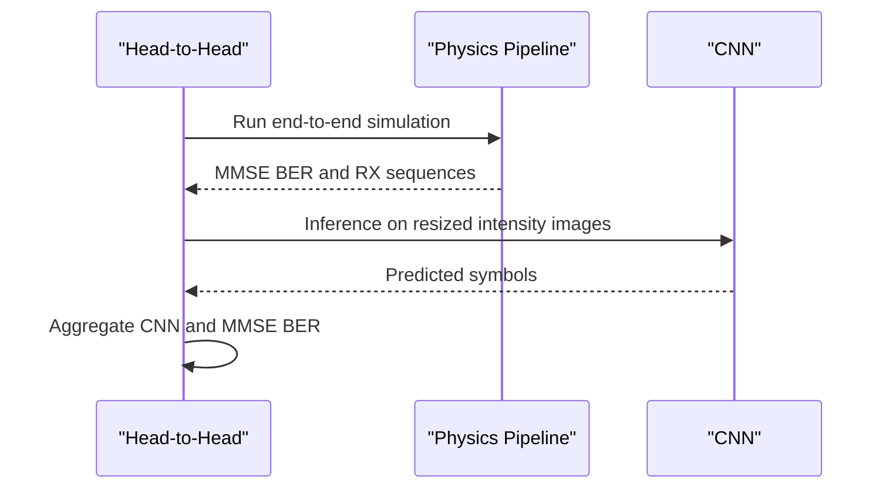

**Diagram sources**
- [head_to_head.py](file://models/CNN Trials/src/evaluation/head_to_head.py#L51-L137)

**Section sources**
- [head_to_head.py](file://models/CNN Trials/src/evaluation/head_to_head.py#L51-L137)

### Model Architecture: MultiHeadResNet and CBAM
- Backbone selection: ResNet-18 or ResNet-18 with CBAM
- First-layer adaptation for single-channel inputs
- Two heads: symbol prediction and power prediction
- CBAM module applies channel and spatial attention gates

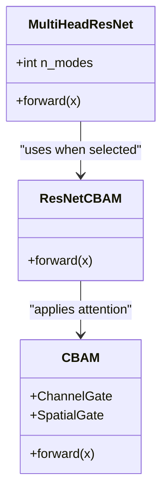

**Diagram sources**
- [model.py](file://models/CNN Trials/src/models/model.py#L18-L71)
- [resnet_cbam.py](file://models/CNN Trials/src/models/resnet_cbam.py#L51-L112)
- [attention.py](file://models/CNN Trials/src/models/attention.py#L72-L89)

**Section sources**
- [model.py](file://models/CNN Trials/src/models/model.py#L18-L71)
- [resnet_cbam.py](file://models/CNN Trials/src/models/resnet_cbam.py#L1-L112)
- [attention.py](file://models/CNN Trials/src/models/attention.py#L1-L89)

## Dependency Analysis
The training and evaluation modules depend on the model definition, dataset utilities, and device utilities. The evaluation pipeline also relies on utility functions for SER/BER and visualization.

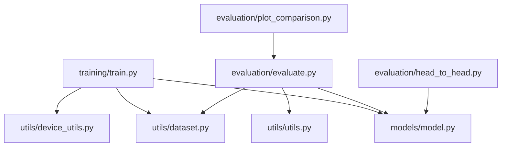

**Diagram sources**
- [train.py](file://models/CNN Trials/src/training/train.py#L12-L14)
- [model.py](file://models/CNN Trials/src/models/model.py#L1-L8)
- [dataset.py](file://models/CNN Trials/src/utils/dataset.py#L1-L5)
- [device_utils.py](file://models/CNN Trials/src/utils/device_utils.py#L1-L10)
- [evaluate.py](file://models/CNN Trials/src/evaluation/evaluate.py#L9-L10)
- [utils.py](file://models/CNN Trials/src/utils/utils.py#L1-L14)
- [plot_comparison.py](file://models/CNN Trials/src/evaluation/plot_comparison.py#L1-L5)
- [head_to_head.py](file://models/CNN Trials/src/evaluation/head_to_head.py#L25-L29)

**Section sources**
- [train.py](file://models/CNN Trials/src/training/train.py#L12-L14)
- [evaluate.py](file://models/CNN Trials/src/evaluation/evaluate.py#L9-L10)

## Performance Considerations
- Device selection and optimization: Prefer CUDA for NVIDIA GPUs; MPS for Apple Silicon; CPU as fallback. Enable cuDNN benchmark on CUDA for faster convolutions.
- Batch size and workers: Use device-aware heuristics to balance memory and throughput. On MPS, be conservative due to shared memory with CPU.
- Data loading: Single-threaded DataLoader is used in training and evaluation scripts; adjust num_workers based on device and CPU cores.
- Loss scaling: The power loss is scaled down to avoid overwhelming the symbol loss during early training.

**Section sources**
- [device_utils.py](file://models/CNN Trials/src/utils/device_utils.py#L106-L167)
- [train.py](file://models/CNN Trials/src/training/train.py#L24-L25)
- [train.py](file://models/CNN Trials/src/training/train.py#L77-L78)

## Troubleshooting Guide
Common issues and remedies:
- Device detection failures: Verify CUDA/MPS availability and PyTorch build; use verbose device reporting to confirm backend.
- Out-of-memory errors: Reduce batch size using device-aware recommendations; clear caches and garbage collect; consider CPU fallback.
- Training stalls or slow progress: Inspect learning rate scheduling; monitor validation loss trends; ensure proper device utilization.
- Evaluation artifacts: Confirm model checkpoint loading; ensure correct backbone selection; validate SER/BER computation logic.
- Physics sanity checks: Use debug utilities to verify phase rotation visibility and image distinctness under different phases.

**Section sources**
- [device_utils.py](file://models/CNN Trials/src/utils/device_utils.py#L170-L189)
- [evaluate.py](file://models/CNN Trials/src/evaluation/evaluate.py#L193-L221)
- [debug_physics.py](file://models/CNN Trials/src/utils/debug_physics.py#L10-L99)

## Conclusion
The training and evaluation framework provides a robust pipeline for developing neural receivers in FSO communications. The multi-head design, automatic device detection, progressive validation, and comprehensive evaluation suite enable reliable experimentation and deployment. Adhering to the configuration and optimization guidelines outlined here will improve reproducibility, convergence, and performance across diverse hardware platforms.

## Appendices

### Training Configuration Examples
- Data generation: Use the dataset generator with configuration JSON to produce train/val/test splits with specified turbulence regimes and pilot parameters.
- Training: Launch the training script with desired backbone, epochs, batch size, and learning rate; enable resume to continue interrupted runs.
- Evaluation: Run the evaluator to compute SER/BER, throughput, and diagnostics; generate plots and NPZ files for downstream analysis.

**Section sources**
- [generate_dataset.py](file://models/CNN Trials/data/generators/generate_dataset.py#L551-L598)
- [config.json](file://models/CNN Trials/data/configs/config.json#L1-L136)
- [train.py](file://models/CNN Trials/src/training/train.py#L138-L149)
- [evaluate.py](file://models/CNN Trials/src/evaluation/evaluate.py#L306-L314)

### Hyperparameter Optimization Tips
- Backbone choice: Compare vanilla ResNet-18 versus ResNet-18 with CBAM for stronger turbulence resilience.
- Learning rate scheduling: Use ReduceLROnPlateau on validation loss; monitor plateau behavior and adjust patience and factor.
- Loss weighting: Start with equal contributions; if power head dominates, reduce power loss weight.
- Batch size: Increase gradually up to device limits; balance speed and stability.

**Section sources**
- [train.py](file://models/CNN Trials/src/training/train.py#L34-L104)
- [model.py](file://models/CNN Trials/src/models/model.py#L38-L55)

### Performance Visualization Tools
- Training history: Plot training and validation loss curves after training completes.
- Evaluation plots: BER vs. Cn2, throughput vs. Cn2, combined dual-y-axis plot, and constellation diagrams.
- Comparative plots: Overlay architectures and regimes for clear performance storytelling.

**Section sources**
- [train.py](file://models/CNN Trials/src/training/train.py#L125-L136)
- [evaluate.py](file://models/CNN Trials/src/evaluation/evaluate.py#L222-L286)
- [plot_comparison.py](file://models/CNN Trials/src/evaluation/plot_comparison.py#L37-L80)