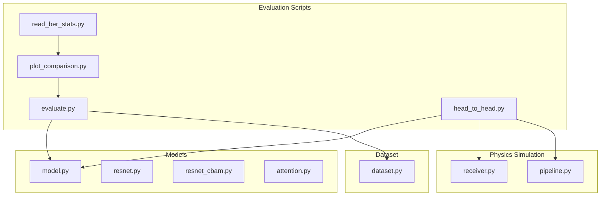
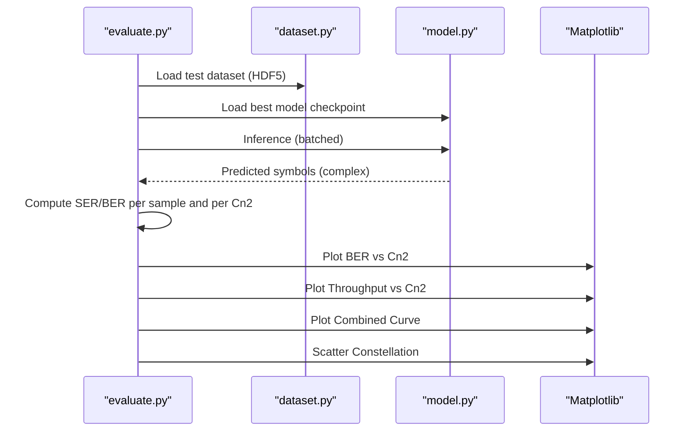
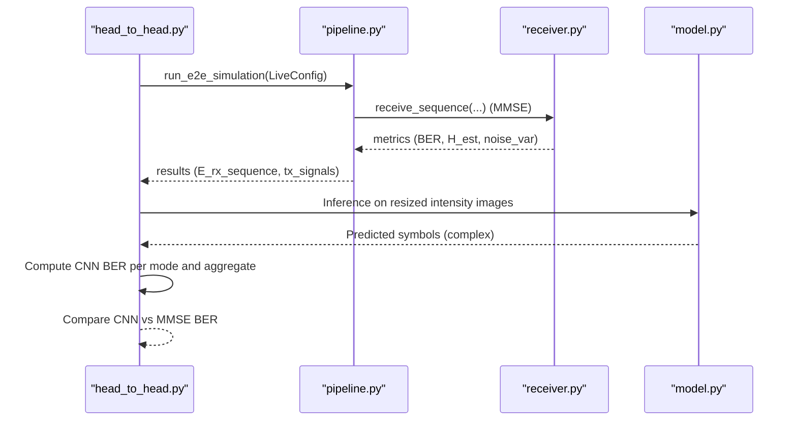
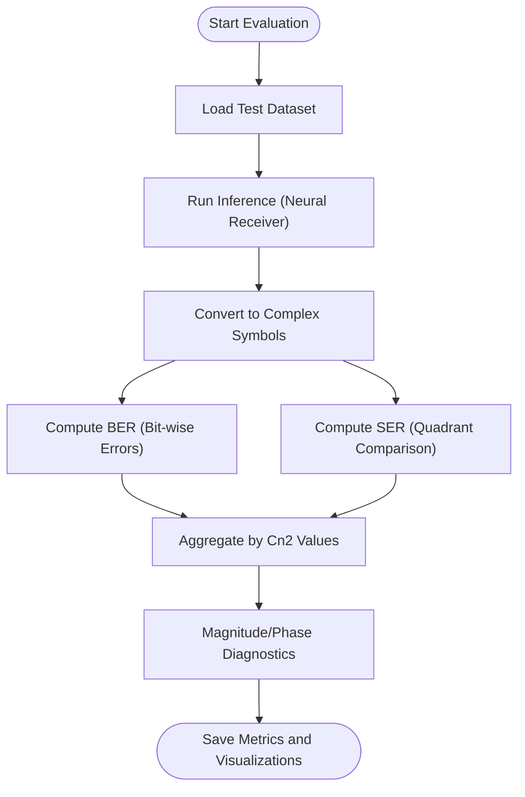
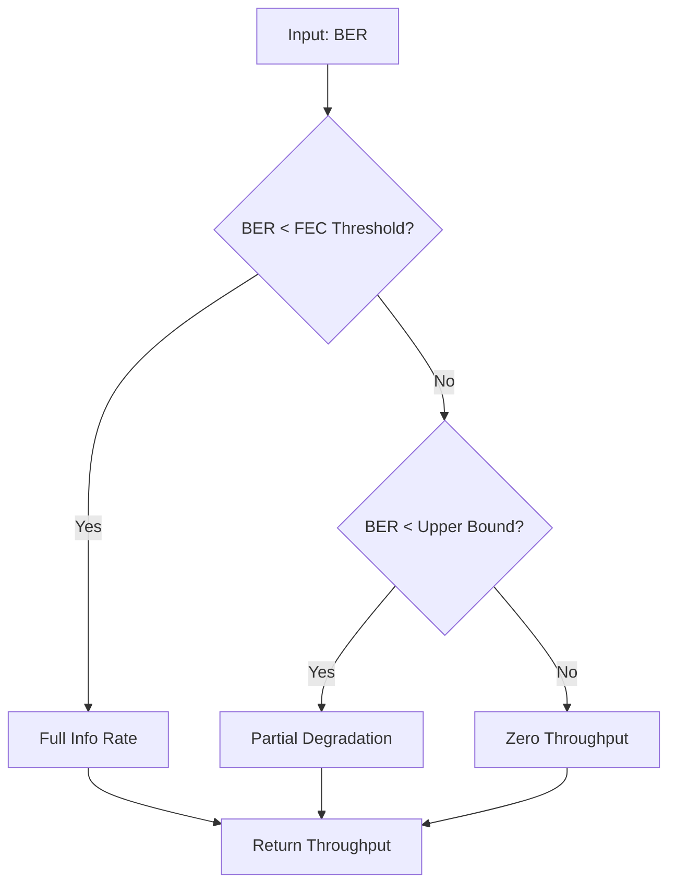
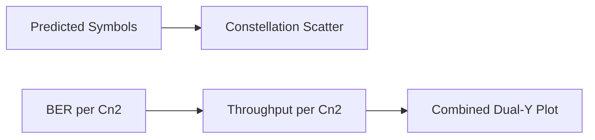
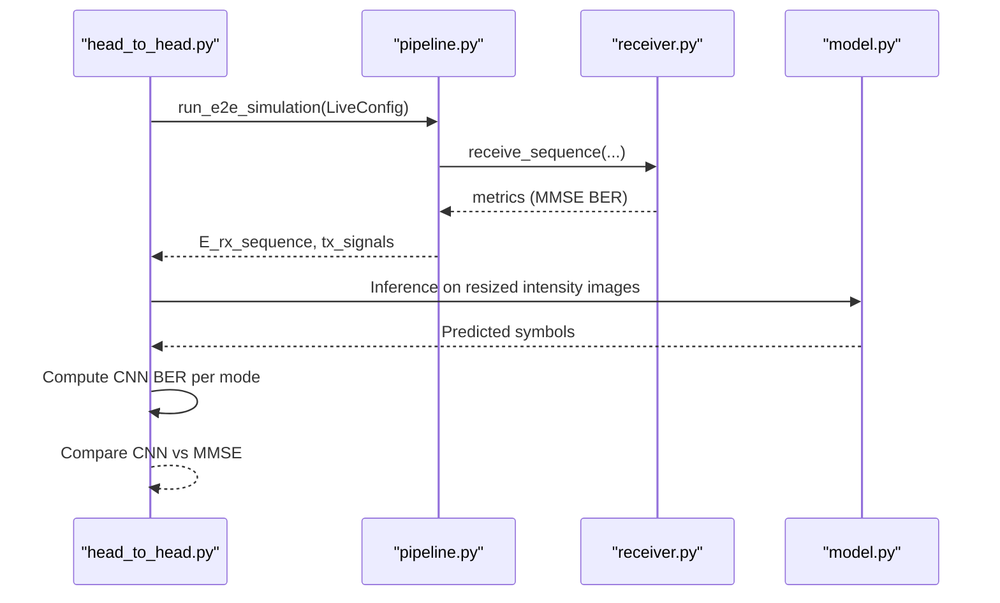
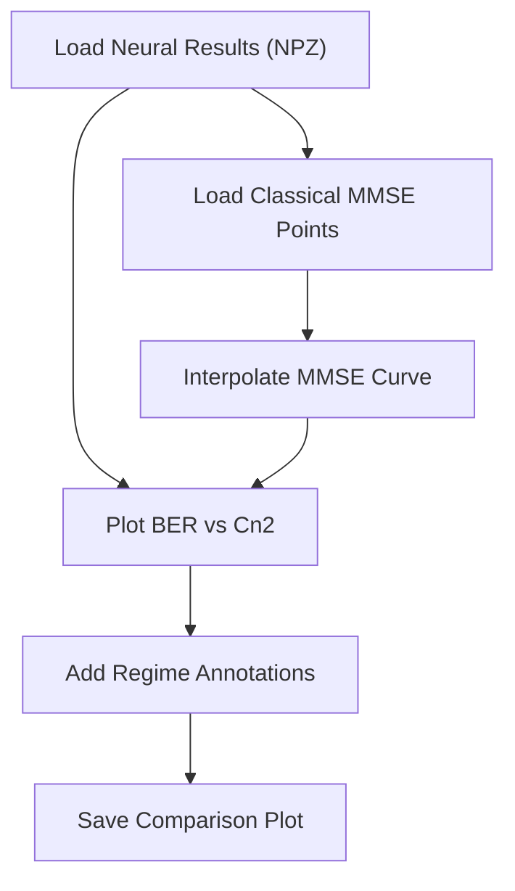
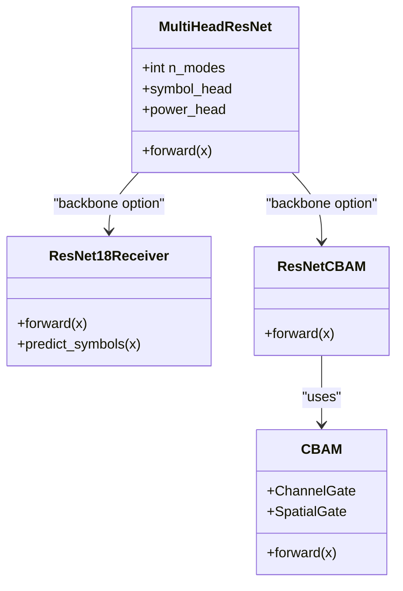
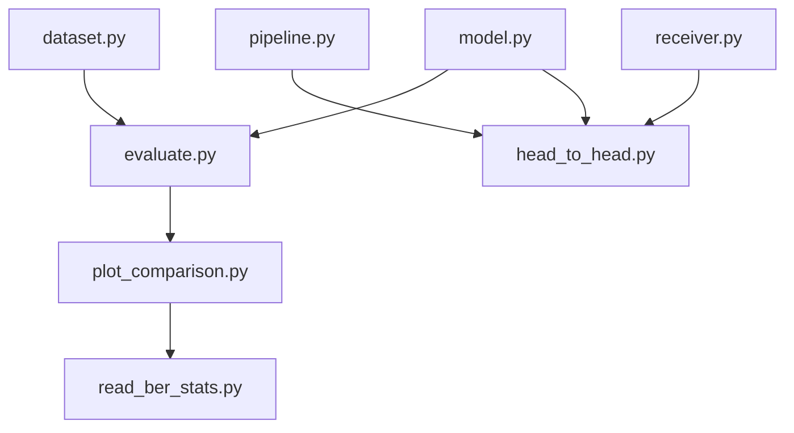

# Evaluation System

<cite>
**Referenced Files in This Document**
- [README.md](file://README.md)
- [evaluate.py](file://models/CNN Trials/src/evaluation/evaluate.py)
- [head_to_head.py](file://models/CNN Trials/src/evaluation/head_to_head.py)
- [plot_comparison.py](file://models/CNN Trials/src/evaluation/plot_comparison.py)
- [read_ber_stats.py](file://models/CNN Trials/read_ber_stats.py)
- [dataset.py](file://models/CNN Trials/src/utils/dataset.py)
- [model.py](file://models/CNN Trials/src/models/model.py)
- [resnet.py](file://models/CNN Trials/src/models/resnet.py)
- [resnet_cbam.py](file://models/CNN Trials/src/models/resnet_cbam.py)
- [attention.py](file://models/CNN Trials/src/models/attention.py)
- [pipeline.py](file://models/CNN Trials/physics/pipeline.py)
- [receiver.py](file://models/CNN Trials/physics/receiver.py)
- [MMSE_PERFORMANCE_ANALYSIS.md](file://models/LDPC + Pilot + MMSE trials/cn2_sweep_results/MMSE_PERFORMANCE_ANALYSIS.md)
- [Throughput_Analysis.md](file://models/CNN Trials/outputs/reports/Throughput_Analysis.md)
</cite>

## Table of Contents
1. [Introduction](#introduction)
2. [Project Structure](#project-structure)
3. [Core Components](#core-components)
4. [Architecture Overview](#architecture-overview)
5. [Detailed Component Analysis](#detailed-component-analysis)
6. [Dependency Analysis](#dependency-analysis)
7. [Performance Considerations](#performance-considerations)
8. [Troubleshooting Guide](#troubleshooting-guide)
9. [Conclusion](#conclusion)
10. [Appendices](#appendices)

## Introduction
This document describes the evaluation system for assessing the performance of a neural receiver for free-space optical (FSO) orbital angular momentum (OAM) communications in atmospheric turbulence. It covers metric computation (Symbol Error Rate and Bit Error Rate), constellation analysis, visualization, head-to-head comparisons against classical receivers, statistical significance considerations, and benchmarking workflows. It also provides best practices for comparative analysis across model architectures and training configurations.

## Project Structure
The evaluation system spans Python modules for data loading, model inference, metric computation, visualization, and classical baseline simulation. The structure supports reproducible evaluation and comparison across architectures.

**Diagram sources**
- [evaluate.py](file://models/CNN Trials/src/evaluation/evaluate.py#L80-L315)
- [head_to_head.py](file://models/CNN Trials/src/evaluation/head_to_head.py#L1-L158)
- [plot_comparison.py](file://models/CNN Trials/src/evaluation/plot_comparison.py#L1-L84)
- [read_ber_stats.py](file://models/CNN Trials/read_ber_stats.py#L1-L71)
- [dataset.py](file://models/CNN Trials/src/utils/dataset.py#L1-L44)
- [model.py](file://models/CNN Trials/src/models/model.py#L1-L81)
- [resnet.py](file://models/CNN Trials/src/models/resnet.py#L1-L218)
- [resnet_cbam.py](file://models/CNN Trials/src/models/resnet_cbam.py#L1-L112)
- [attention.py](file://models/CNN Trials/src/models/attention.py#L1-L89)
- [pipeline.py](file://models/CNN Trials/physics/pipeline.py#L64-L440)
- [receiver.py](file://models/CNN Trials/physics/receiver.py#L370-L752)

**Section sources**
- [README.md](file://README.md#L311-L350)

## Core Components
- Metric computation: SER and BER calculation for QPSK symbol recovery, with breakdown by turbulence strength and diagnosis of magnitude/phase behavior.
- Throughput modeling: Effective throughput accounting for pilot overhead and LDPC rate, with degradation thresholds.
- Visualization: BER curves, throughput curves, combined dual-y plots, and constellation diagrams.
- Head-to-head comparison: End-to-end simulation baseline (classical MMSE) versus neural receiver on identical frames.
- Comparative plotting: Interpolation of classical baseline points and overlay of multiple model variants.
- Statistical reporting: Summary documents for MMSE performance and throughput analysis.

**Section sources**
- [evaluate.py](file://models/CNN Trials/src/evaluation/evaluate.py#L12-L61)
- [evaluate.py](file://models/CNN Trials/src/evaluation/evaluate.py#L117-L144)
- [evaluate.py](file://models/CNN Trials/src/evaluation/evaluate.py#L222-L304)
- [head_to_head.py](file://models/CNN Trials/src/evaluation/head_to_head.py#L51-L137)
- [plot_comparison.py](file://models/CNN Trials/src/evaluation/plot_comparison.py#L6-L81)
- [MMSE_PERFORMANCE_ANALYSIS.md](file://models/LDPC + Pilot + MMSE trials/cn2_sweep_results/MMSE_PERFORMANCE_ANALYSIS.md#L1-L135)
- [Throughput_Analysis.md](file://models/CNN Trials/outputs/reports/Throughput_Analysis.md#L1-L55)

## Architecture Overview
The evaluation pipeline integrates a trained neural receiver with a physics-based simulator to compute metrics and produce visualizations. Classical MMSE performance is computed via the simulation pipeline and receiver module.

**Diagram sources**
- [evaluate.py](file://models/CNN Trials/src/evaluation/evaluate.py#L80-L315)
- [dataset.py](file://models/CNN Trials/src/utils/dataset.py#L6-L44)
- [model.py](file://models/CNN Trials/src/models/model.py#L59-L71)

**Diagram sources**
- [head_to_head.py](file://models/CNN Trials/src/evaluation/head_to_head.py#L51-L137)
- [pipeline.py](file://models/CNN Trials/physics/pipeline.py#L64-L440)
- [receiver.py](file://models/CNN Trials/physics/receiver.py#L714-L752)
- [model.py](file://models/CNN Trials/src/models/model.py#L59-L71)

## Detailed Component Analysis

### Metric Computation: SER and BER
- Symbol Error Rate (SER): Quadrant-based hard decision comparing predicted and target symbol quadrants.
- Bit Error Rate (BER): Bit-wise error across real and imaginary parts, aggregated across all symbols and modes.
- Per-Cn2 breakdown: Aggregation by unique Cn2 values from the test dataset to produce regime-wise metrics.
- Diagnosis: Mean magnitude and phase statistics to detect output collapse, systematic phase rotation, or high jitter.

**Diagram sources**
- [evaluate.py](file://models/CNN Trials/src/evaluation/evaluate.py#L80-L221)

**Section sources**
- [evaluate.py](file://models/CNN Trials/src/evaluation/evaluate.py#L117-L192)
- [evaluate.py](file://models/CNN Trials/src/evaluation/evaluate.py#L193-L221)

### Throughput Modeling and Degradation
- Effective throughput accounts for:
  - Raw line rate: modes × bits per symbol × symbol rate
  - Pilot overhead: subtract fractional data rate
  - LDPC rate: info rate after decoding
- Degradation model:
  - Below FEC threshold: full throughput
  - Between thresholds: partial degradation
  - Above upper bound: link failure (zero throughput)
- Reports maximum throughput ceiling and degradation regions.

**Diagram sources**
- [evaluate.py](file://models/CNN Trials/src/evaluation/evaluate.py#L12-L61)

**Section sources**
- [evaluate.py](file://models/CNN Trials/src/evaluation/evaluate.py#L12-L61)
- [Throughput_Analysis.md](file://models/CNN Trials/outputs/reports/Throughput_Analysis.md#L9-L18)

### Constellation Analysis and Visualization
- Constellation scatter plots compare true vs predicted symbols for a subset to visualize recovery quality.
- Combined BER and throughput plots share the same Cn2 axis for joint interpretation.

**Diagram sources**
- [evaluate.py](file://models/CNN Trials/src/evaluation/evaluate.py#L288-L304)
- [evaluate.py](file://models/CNN Trials/src/evaluation/evaluate.py#L255-L282)

**Section sources**
- [evaluate.py](file://models/CNN Trials/src/evaluation/evaluate.py#L222-L282)
- [evaluate.py](file://models/CNN Trials/src/evaluation/evaluate.py#L288-L304)

### Head-to-Head Comparison Against Classical Receivers
- The head-to-head script runs a single-frame end-to-end simulation with a configurable turbulence strength.
- Classical MMSE performance is extracted from the simulation results.
- Neural receiver inference is performed on the same received fields, with identical preprocessing and QPSK demodulation.
- Results are printed and can be extended to accumulate across multiple frames for statistical significance.

**Diagram sources**
- [head_to_head.py](file://models/CNN Trials/src/evaluation/head_to_head.py#L51-L137)
- [pipeline.py](file://models/CNN Trials/physics/pipeline.py#L64-L440)
- [receiver.py](file://models/CNN Trials/physics/receiver.py#L714-L752)
- [model.py](file://models/CNN Trials/src/models/model.py#L59-L71)

**Section sources**
- [head_to_head.py](file://models/CNN Trials/src/evaluation/head_to_head.py#L51-L137)
- [pipeline.py](file://models/CNN Trials/physics/pipeline.py#L64-L440)
- [receiver.py](file://models/CNN Trials/physics/receiver.py#L397-L712)

### Comparative Analysis and Benchmarking
- Comparison plotting loads neural results and overlays classical MMSE points interpolated to a smooth curve.
- The script supports optional overlay of older model variants for architecture evolution analysis.
- Statistical significance: increase number of frames per Cn2 point to reduce variance and improve confidence in differences.

**Diagram sources**
- [plot_comparison.py](file://models/CNN Trials/src/evaluation/plot_comparison.py#L6-L81)

**Section sources**
- [plot_comparison.py](file://models/CNN Trials/src/evaluation/plot_comparison.py#L6-L81)
- [read_ber_stats.py](file://models/CNN Trials/read_ber_stats.py#L1-L71)

### Model Architectures and Attention Mechanisms
- Multi-head regression model predicts complex QPSK symbols per mode and auxiliary power estimates.
- ResNet-18 variants include basic and CBAM-enhanced backbones.
- CBAM attention gates improve robustness in strong turbulence by focusing on beam fragments.

**Diagram sources**
- [model.py](file://models/CNN Trials/src/models/model.py#L6-L71)
- [resnet.py](file://models/CNN Trials/src/models/resnet.py#L47-L148)
- [resnet_cbam.py](file://models/CNN Trials/src/models/resnet_cbam.py#L51-L112)
- [attention.py](file://models/CNN Trials/src/models/attention.py#L72-L89)

**Section sources**
- [model.py](file://models/CNN Trials/src/models/model.py#L18-L71)
- [resnet.py](file://models/CNN Trials/src/models/resnet.py#L47-L148)
- [resnet_cbam.py](file://models/CNN Trials/src/models/resnet_cbam.py#L51-L112)
- [attention.py](file://models/CNN Trials/src/models/attention.py#L25-L89)

## Dependency Analysis
- Data loading depends on the FSODataset class to read HDF5 files containing intensity images, symbol targets, and Cn2 labels.
- Evaluation relies on the trained model checkpoint and computes metrics without retraining.
- Head-to-head comparison couples the physics pipeline and receiver with the trained model for fair comparison.
- Comparative plotting depends on saved evaluation outputs and classical baseline points.

**Diagram sources**
- [dataset.py](file://models/CNN Trials/src/utils/dataset.py#L6-L44)
- [evaluate.py](file://models/CNN Trials/src/evaluation/evaluate.py#L80-L315)
- [model.py](file://models/CNN Trials/src/models/model.py#L59-L71)
- [pipeline.py](file://models/CNN Trials/physics/pipeline.py#L64-L440)
- [receiver.py](file://models/CNN Trials/physics/receiver.py#L714-L752)
- [head_to_head.py](file://models/CNN Trials/src/evaluation/head_to_head.py#L51-L137)
- [plot_comparison.py](file://models/CNN Trials/src/evaluation/plot_comparison.py#L6-L81)
- [read_ber_stats.py](file://models/CNN Trials/read_ber_stats.py#L1-L71)

**Section sources**
- [dataset.py](file://models/CNN Trials/src/utils/dataset.py#L6-L44)
- [evaluate.py](file://models/CNN Trials/src/evaluation/evaluate.py#L80-L315)
- [head_to_head.py](file://models/CNN Trials/src/evaluation/head_to_head.py#L51-L137)
- [plot_comparison.py](file://models/CNN Trials/src/evaluation/plot_comparison.py#L6-L81)

## Performance Considerations
- Robustness vs. peak rate: The neural receiver maintains link availability across stronger turbulence while matching the classical peak throughput ceiling.
- Degradation thresholds: Use the FEC threshold and upper BER bounds to interpret throughput degradation and link failure.
- Visualization fidelity: Constellation plots and dual-y curves support quick diagnostics and presentation.
- Simulation fidelity: Classical MMSE performance is validated via the physics pipeline and receiver modules.

[No sources needed since this section provides general guidance]

## Troubleshooting Guide
- Zero-mean or collapsed outputs: Diagnosis flags indicate confusion or collapse; check model training and data preprocessing.
- Systematic phase rotation: Indicates pilot ambiguity or phase estimation issues; review phase correction steps.
- High jitter: Suggests high noise or random guessing; consider increasing SNR or improving channel conditions.
- Missing classical baseline data: Ensure the classical simulation produces metrics and that plotting scripts can locate baseline points.

**Section sources**
- [evaluate.py](file://models/CNN Trials/src/evaluation/evaluate.py#L193-L221)
- [receiver.py](file://models/CNN Trials/physics/receiver.py#L539-L573)

## Conclusion
The evaluation system provides a complete framework for measuring neural receiver performance against classical MMSE receivers, with robust metrics, diagnostics, and visualization. It supports comparative analysis across architectures and training configurations, enabling informed decisions about deployment and further development.

[No sources needed since this section summarizes without analyzing specific files]

## Appendices

### Evaluation Workflow Examples
- End-to-end evaluation:
  - Load dataset and model, run inference, compute SER/BER, and produce visualizations.
- Head-to-head comparison:
  - Configure simulation for a given Cn2, run classical MMSE and neural receiver on the same frame, compare BER.
- Comparative plotting:
  - Load neural results and overlay interpolated classical MMSE points; annotate regimes and thresholds.

**Section sources**
- [evaluate.py](file://models/CNN Trials/src/evaluation/evaluate.py#L80-L315)
- [head_to_head.py](file://models/CNN Trials/src/evaluation/head_to_head.py#L51-L137)
- [plot_comparison.py](file://models/CNN Trials/src/evaluation/plot_comparison.py#L6-L81)

### Statistical Significance and Confidence Intervals
- Increase the number of frames per Cn2 point to reduce variance and improve confidence in observed differences.
- Report means and standard errors for BER and throughput across multiple runs; consider bootstrap methods for robust intervals.
- Use paired comparisons (same frames) to minimize variability due to channel realizations.

[No sources needed since this section provides general guidance]

### Comparative Analysis Frameworks
- Architecture evolution: Track SER/BER curves across model variants and annotate regimes.
- Training configuration: Compare results across different training seeds, datasets, and hyperparameters using shared visualization standards.
- Classical baselines: Use MMSE performance summaries and interpolated curves to contextualize neural performance.

**Section sources**
- [plot_comparison.py](file://models/CNN Trials/src/evaluation/plot_comparison.py#L6-L81)
- [MMSE_PERFORMANCE_ANALYSIS.md](file://models/LDPC + Pilot + MMSE trials/cn2_sweep_results/MMSE_PERFORMANCE_ANALYSIS.md#L1-L135)