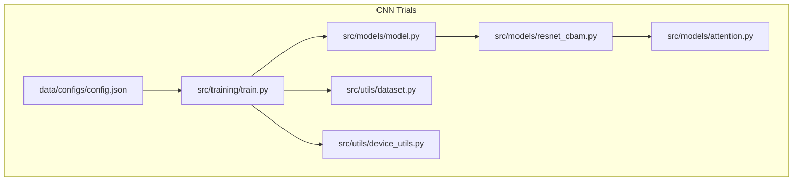
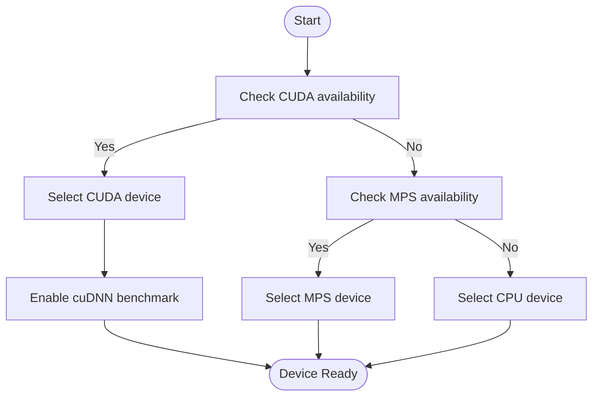
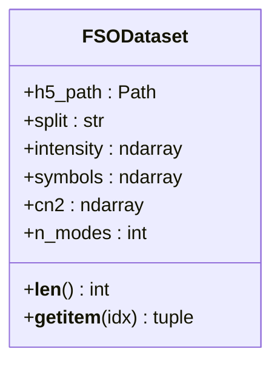
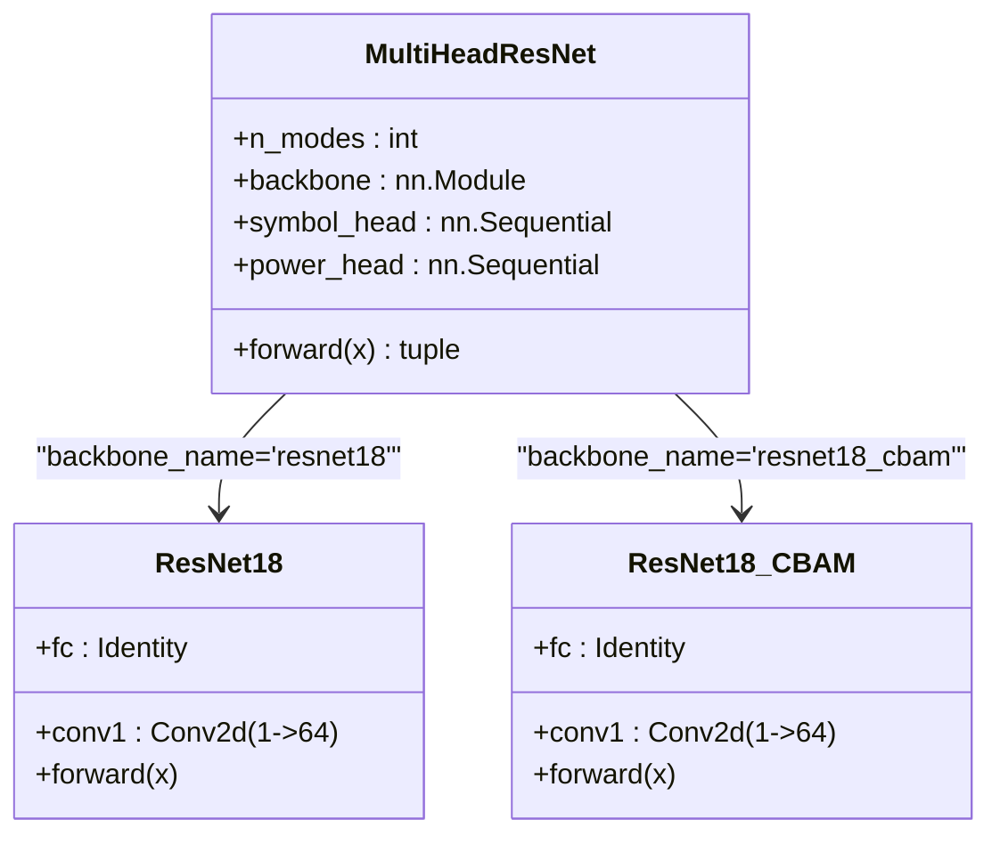
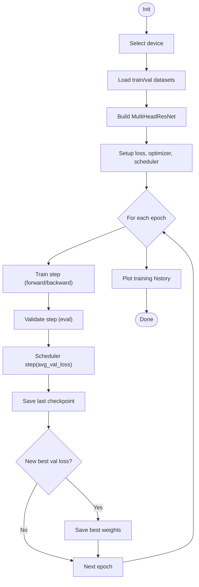
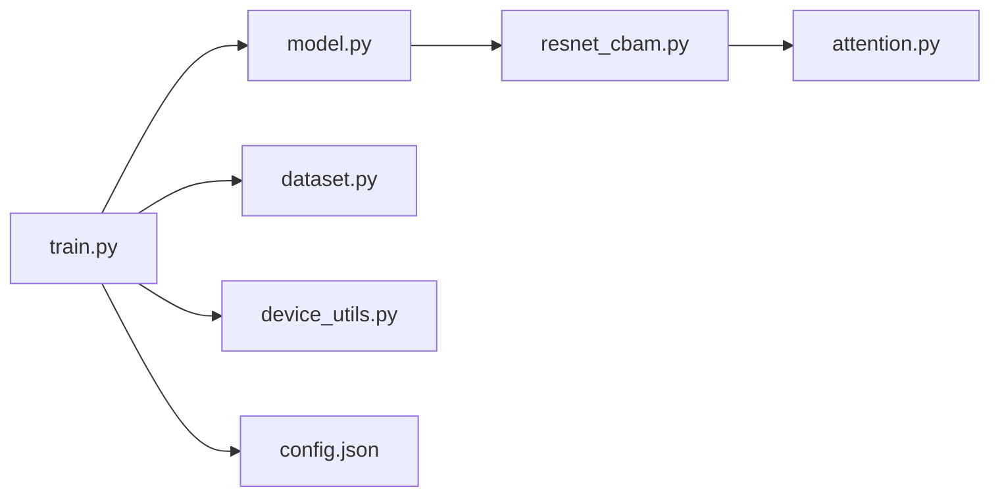

# Training Pipeline

<cite>
**Referenced Files in This Document**
- [README.md](file://README.md)
- [train.py](file://models/CNN Trials/src/training/train.py)
- [dataset.py](file://models/CNN Trials/src/utils/dataset.py)
- [model.py](file://models/CNN Trials/src/models/model.py)
- [resnet_cbam.py](file://models/CNN Trials/src/models/resnet_cbam.py)
- [attention.py](file://models/CNN Trials/src/models/attention.py)
- [device_utils.py](file://models/CNN Trials/src/utils/device_utils.py)
- [config.json](file://models/CNN Trials/data/configs/config.json)
- [Throughput_Analysis.md](file://models/CNN Trials/outputs/reports/Throughput_Analysis.md)
</cite>

## Table of Contents
1. [Introduction](#introduction)
2. [Project Structure](#project-structure)
3. [Core Components](#core-components)
4. [Architecture Overview](#architecture-overview)
5. [Detailed Component Analysis](#detailed-component-analysis)
6. [Dependency Analysis](#dependency-analysis)
7. [Performance Considerations](#performance-considerations)
8. [Troubleshooting Guide](#troubleshooting-guide)
9. [Conclusion](#conclusion)
10. [Appendices](#appendices)

## Introduction
This document explains the training pipeline for the FSO beam recovery system. It covers the complete workflow from device detection and data loading to the multi-head loss training loop, progressive validation, checkpoint management, and learning rate scheduling. It also documents configuration parameters, hyperparameters, resume functionality, and practical guidance for performance tuning and troubleshooting.

## Project Structure
The training pipeline resides in the CNN Trials module and integrates with the model definition, dataset abstraction, and device utilities.



**Diagram sources**
- [train.py](file://models/CNN Trials/src/training/train.py#L1-L150)
- [model.py](file://models/CNN Trials/src/models/model.py#L1-L81)
- [resnet_cbam.py](file://models/CNN Trials/src/models/resnet_cbam.py#L1-L112)
- [attention.py](file://models/CNN Trials/src/models/attention.py#L1-L89)
- [dataset.py](file://models/CNN Trials/src/utils/dataset.py#L1-L44)
- [device_utils.py](file://models/CNN Trials/src/utils/device_utils.py#L1-L217)
- [config.json](file://models/CNN Trials/data/configs/config.json#L1-L136)

**Section sources**
- [README.md](file://README.md#L311-L350)
- [train.py](file://models/CNN Trials/src/training/train.py#L1-L150)

## Core Components
- Training loop: orchestrates device selection, dataset loading, model creation, loss and optimizer setup, training/validation, learning rate scheduling, and checkpointing.
- Dataset: HDF5-backed PyTorch Dataset that loads images and targets into memory.
- Model: Multi-head ResNet with a configurable backbone (ResNet-18 or ResNet-18 + CBAM) and two heads (symbol regression and power prediction).
- Device utilities: automatic device detection (CUDA/MPS/CPU), memory and worker recommendations, and device-specific optimizations.
- Configuration: dataset metadata and training parameters.

**Section sources**
- [train.py](file://models/CNN Trials/src/training/train.py#L16-L149)
- [dataset.py](file://models/CNN Trials/src/utils/dataset.py#L6-L43)
- [model.py](file://models/CNN Trials/src/models/model.py#L6-L71)
- [device_utils.py](file://models/CNN Trials/src/utils/device_utils.py#L15-L103)
- [config.json](file://models/CNN Trials/data/configs/config.json#L1-L136)

## Architecture Overview
The training pipeline follows a standard supervised learning flow with multi-head supervision and progressive validation.

```mermaid
sequenceDiagram
participant CLI as "CLI"
participant Train as "train.py"
participant Dev as "device_utils.py"
participant DS as "dataset.py"
participant Model as "model.py"
participant Opt as "Optimizer/Scheduler"
participant CKPT as "Checkpoints"
CLI->>Train : Parse args (--data_dir, --dataset_name, --epochs, ...)
Train->>Dev : get_device()
Dev-->>Train : device
Train->>DS : FSODataset(train.h5)
Train->>DS : FSODataset(val.h5)
Train->>Model : MultiHeadResNet(n_modes, backbone)
Model-->>Train : model
Train->>Opt : Adam(lr), ReduceLROnPlateau(patience,factor)
loop Epochs
Train->>Train : Train step (forward/backward)
Train->>Opt : step()
Train->>Train : Validate step (eval)
Train->>Opt : step(avg_val_loss)
Train->>CKPT : Save last checkpoint
alt New best val loss
Train->>CKPT : Save best weights
end
end
Train-->>CLI : Training complete
```

**Diagram sources**
- [train.py](file://models/CNN Trials/src/training/train.py#L16-L149)
- [device_utils.py](file://models/CNN Trials/src/utils/device_utils.py#L15-L46)
- [dataset.py](file://models/CNN Trials/src/utils/dataset.py#L6-L43)
- [model.py](file://models/CNN Trials/src/models/model.py#L6-L71)

## Detailed Component Analysis

### Device Detection and Optimization
- Automatic device selection prioritizes CUDA, then MPS (Apple Silicon), then CPU.
- Device-specific optimizations include enabling cuDNN benchmarking for CUDA.
- Utilities provide batch-size and worker-count recommendations based on device/memory and CPU cores.
- Memory monitoring and cache clearing utilities are available.



**Diagram sources**
- [device_utils.py](file://models/CNN Trials/src/utils/device_utils.py#L15-L103)

**Section sources**
- [device_utils.py](file://models/CNN Trials/src/utils/device_utils.py#L15-L103)

### Data Loading with HDF5
- FSODataset loads intensity images and targets from HDF5 files.
- Intensity arrays are expanded to include a channel dimension.
- Targets include:
  - symbols: complex-valued QPSK symbols flattened to real pairs.
  - power: binary-like target indicating mode presence (sigmoid output).
- The dataset exposes attributes like n_modes for model initialization.



**Diagram sources**
- [dataset.py](file://models/CNN Trials/src/utils/dataset.py#L6-L43)

**Section sources**
- [dataset.py](file://models/CNN Trials/src/utils/dataset.py#L6-L43)

### Model Definition and Multi-Head Loss
- MultiHeadResNet supports two backbones: ResNet-18 and ResNet-18 + CBAM.
- The backbone is adapted for 1-channel, 64x64 inputs.
- Two heads:
  - Symbol head: regression to predict real/imaginary parts for each mode.
  - Power head: auxiliary task to predict mode power presence (sigmoid).
- Loss function:
  - Symbol loss: MSE between predicted and true symbols.
  - Power loss: Binary cross-entropy between predicted power and ones vector.
  - Combined loss: weighted sum with a small coefficient for power loss.



**Diagram sources**
- [model.py](file://models/CNN Trials/src/models/model.py#L6-L71)
- [resnet_cbam.py](file://models/CNN Trials/src/models/resnet_cbam.py#L51-L112)
- [attention.py](file://models/CNN Trials/src/models/attention.py#L72-L89)

**Section sources**
- [model.py](file://models/CNN Trials/src/models/model.py#L6-L71)
- [resnet_cbam.py](file://models/CNN Trials/src/models/resnet_cbam.py#L51-L112)
- [attention.py](file://models/CNN Trials/src/models/attention.py#L72-L89)

### Training Loop Architecture
- Device selection and dataset loading are performed first.
- Model is moved to the selected device.
- Optimizer: Adam with configurable learning rate.
- Scheduler: ReduceLROnPlateau monitors validation loss.
- Training loop:
  - Train mode: forward pass, compute losses, backward pass, optimizer step.
  - Validation mode: forward pass, compute losses, track average.
  - Progress printed with current epoch, train/val loss, and current LR.
- Checkpointing:
  - Save last checkpoint every epoch with model, optimizer, and best loss.
  - Save best model weights when validation loss improves.
- History tracking and final plotting of training history.



**Diagram sources**
- [train.py](file://models/CNN Trials/src/training/train.py#L16-L149)

**Section sources**
- [train.py](file://models/CNN Trials/src/training/train.py#L16-L149)

### Configuration Parameters and Hyperparameters
- CLI arguments:
  - data_dir: Directory containing HDF5 files.
  - dataset_name: Prefix for train/val file names.
  - epochs: Number of training epochs.
  - batch_size: Batch size for training and validation.
  - backbone: Choice between resnet18 and resnet18_cbam.
  - resume: Resume from last checkpoint if available.
  - lr: Initial learning rate.
- Dataset metadata (config.json):
  - System parameters: wavelength, beam waist, distance, receiver diameter, total TX power, spatial modes, pilot parameters.
  - Turbulence parameters: cn2 range, distribution, integral scales, screen count.
  - Dataset sizes: train, val, test counts.
  - Grid parameters: simulation and output grid sizes, downsampling method.
  - Data format: input/output shapes, normalization settings.
  - Augmentation: rotation, translation, multiple realizations, noise injection.
  - Output: HDF5 compression settings and metadata saving.

**Section sources**
- [train.py](file://models/CNN Trials/src/training/train.py#L138-L149)
- [config.json](file://models/CNN Trials/data/configs/config.json#L1-L136)

### Resume Functionality
- If resume is enabled and a last checkpoint exists, the training script loads:
  - Model state dict.
  - Optimizer state dict.
  - Epoch and best validation loss.
- Training resumes from the next epoch after the saved checkpoint.

**Section sources**
- [train.py](file://models/CNN Trials/src/training/train.py#L43-L56)

### Example Training Runs
- Quick demo with generated data:
  - Generate sample dataset.
  - Train for a few epochs with CBAM backbone.
  - Evaluate trained model.
- Full training:
  - Use larger dataset with specified backbone, epochs, batch size, and learning rate.
  - Optionally resume from previous checkpoint.

**Section sources**
- [README.md](file://README.md#L88-L100)
- [README.md](file://README.md#L257-L284)

### Model Checkpointing Strategies
- Last checkpoint: Saved every epoch with model, optimizer, and best loss.
- Best model: Saved only when validation loss improves.
- Naming convention: best_model_{backbone}.pth and last_model_{backbone}.pth.

**Section sources**
- [train.py](file://models/CNN Trials/src/training/train.py#L111-L123)

## Dependency Analysis
The training script depends on the model, dataset, and device utilities. The model depends on the CBAM attention module when using the enhanced backbone.



**Diagram sources**
- [train.py](file://models/CNN Trials/src/training/train.py#L1-L150)
- [model.py](file://models/CNN Trials/src/models/model.py#L1-L81)
- [resnet_cbam.py](file://models/CNN Trials/src/models/resnet_cbam.py#L1-L112)
- [attention.py](file://models/CNN Trials/src/models/attention.py#L1-L89)
- [dataset.py](file://models/CNN Trials/src/utils/dataset.py#L1-L44)
- [device_utils.py](file://models/CNN Trials/src/utils/device_utils.py#L1-L217)
- [config.json](file://models/CNN Trials/data/configs/config.json#L1-L136)

**Section sources**
- [train.py](file://models/CNN Trials/src/training/train.py#L1-L150)
- [model.py](file://models/CNN Trials/src/models/model.py#L1-L81)
- [resnet_cbam.py](file://models/CNN Trials/src/models/resnet_cbam.py#L1-L112)
- [attention.py](file://models/CNN Trials/src/models/attention.py#L1-L89)
- [dataset.py](file://models/CNN Trials/src/utils/dataset.py#L1-L44)
- [device_utils.py](file://models/CNN Trials/src/utils/device_utils.py#L1-L217)
- [config.json](file://models/CNN Trials/data/configs/config.json#L1-L136)

## Performance Considerations
- Device selection and optimization:
  - Prefer CUDA for fastest training; enable cuDNN benchmarking automatically.
  - On MPS devices, keep settings conservative; monitor memory usage carefully.
  - CPU training is supported but slower; adjust batch size accordingly.
- Batch size and workers:
  - Use device_utils recommendations for batch size and DataLoader workers to balance memory and throughput.
- Throughput perspective:
  - The neural receiver maintains peak throughput comparable to classical MMSE while offering superior resilience in strong turbulence.

**Section sources**
- [device_utils.py](file://models/CNN Trials/src/utils/device_utils.py#L106-L167)
- [Throughput_Analysis.md](file://models/CNN Trials/outputs/reports/Throughput_Analysis.md#L1-L55)

## Troubleshooting Guide
- Convergence problems:
  - Reduce learning rate if validation loss plateaus or oscillates.
  - Increase patience for ReduceLROnPlateau to avoid premature LR decay.
  - Verify dataset normalization and target scaling.
- Memory issues:
  - Lower batch size or switch to CPU if GPU/MPS memory is insufficient.
  - Clear caches periodically and monitor memory usage.
  - Consider reducing model complexity or input resolution.
- Training stalls:
  - Check DataLoader num_workers and pin_memory settings.
  - Ensure HDF5 files are accessible and not corrupted.
- Resume issues:
  - Confirm last checkpoint exists and is readable.
  - If legacy checkpoint format is used, ensure backward compatibility.

**Section sources**
- [train.py](file://models/CNN Trials/src/training/train.py#L34-L56)
- [device_utils.py](file://models/CNN Trials/src/utils/device_utils.py#L170-L189)

## Conclusion
The training pipeline provides a robust, device-aware workflow for training a multi-head CNN on FSO OAM datasets. It integrates automatic device detection, efficient data loading from HDF5, a dual-loss training regimen, progressive validation, and reliable checkpointing with resume capability. With careful configuration and monitoring, it enables stable and performant training across diverse hardware environments.

## Appendices

### Configuration Reference
- CLI arguments:
  - --data_dir: Directory containing HDF5 files.
  - --dataset_name: Prefix for train/val file names.
  - --epochs: Number of training epochs.
  - --batch_size: Batch size for training and validation.
  - --backbone: resnet18 or resnet18_cbam.
  - --resume: Resume from last checkpoint if available.
  - --lr: Initial learning rate.
- Dataset metadata (config.json):
  - System parameters, turbulence parameters, dataset sizes, grid parameters, data format, augmentation, and output settings.

**Section sources**
- [train.py](file://models/CNN Trials/src/training/train.py#L138-L149)
- [config.json](file://models/CNN Trials/data/configs/config.json#L1-L136)