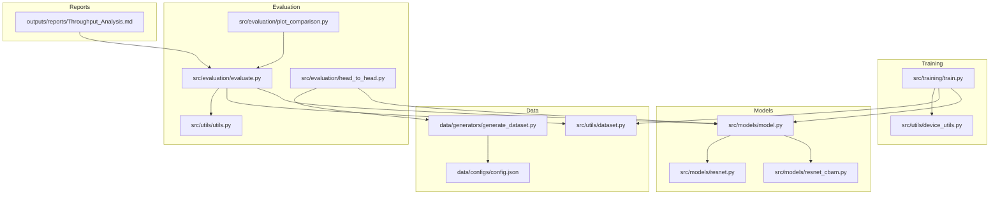
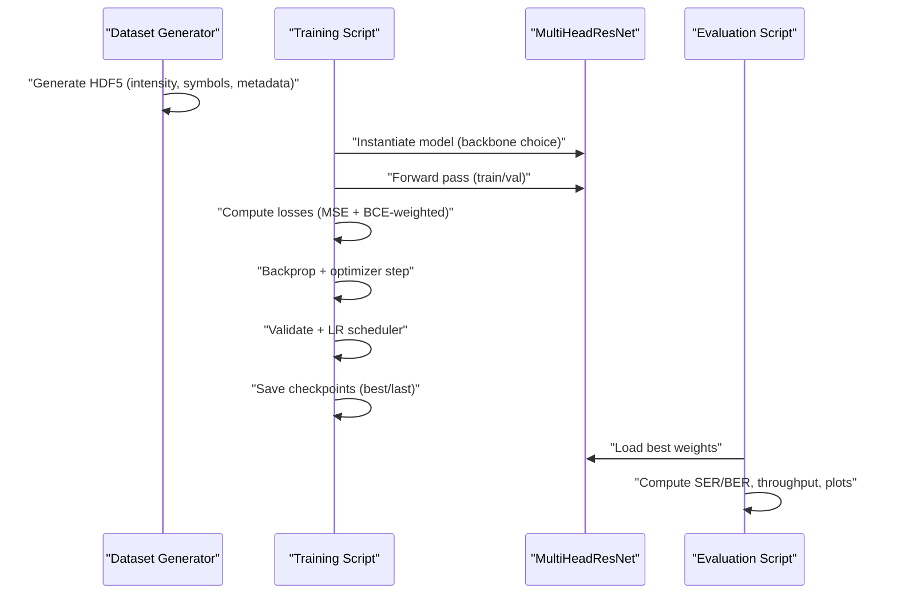
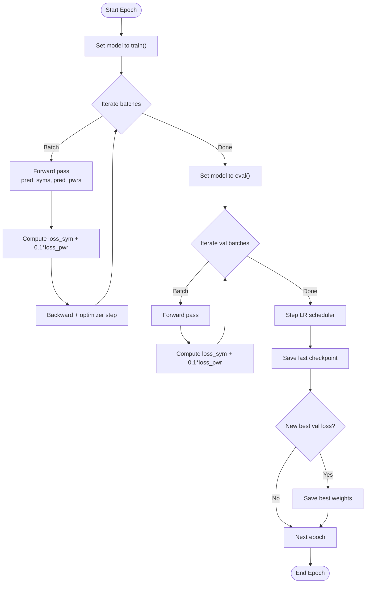
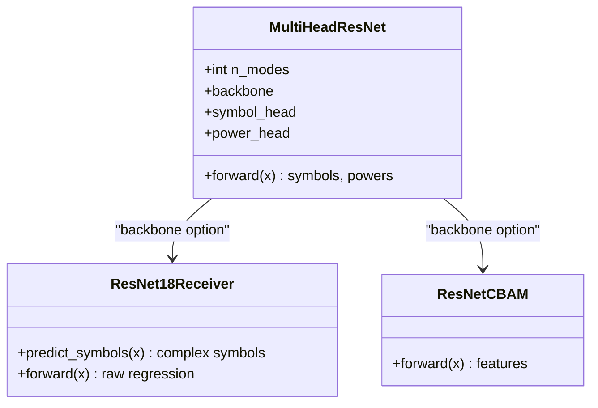
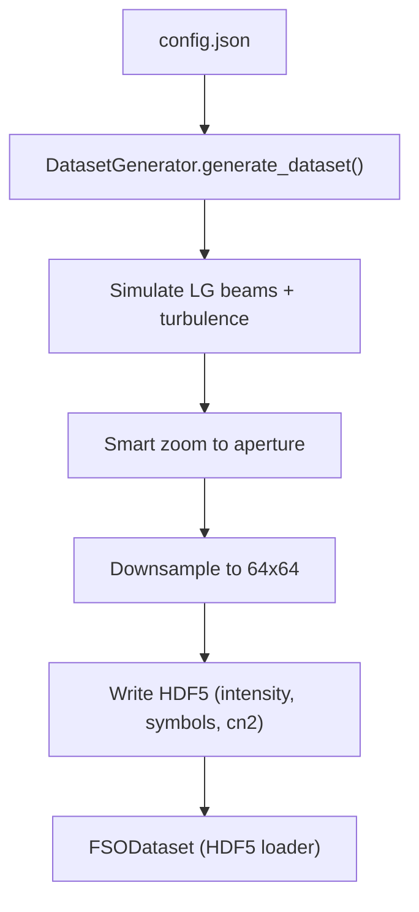
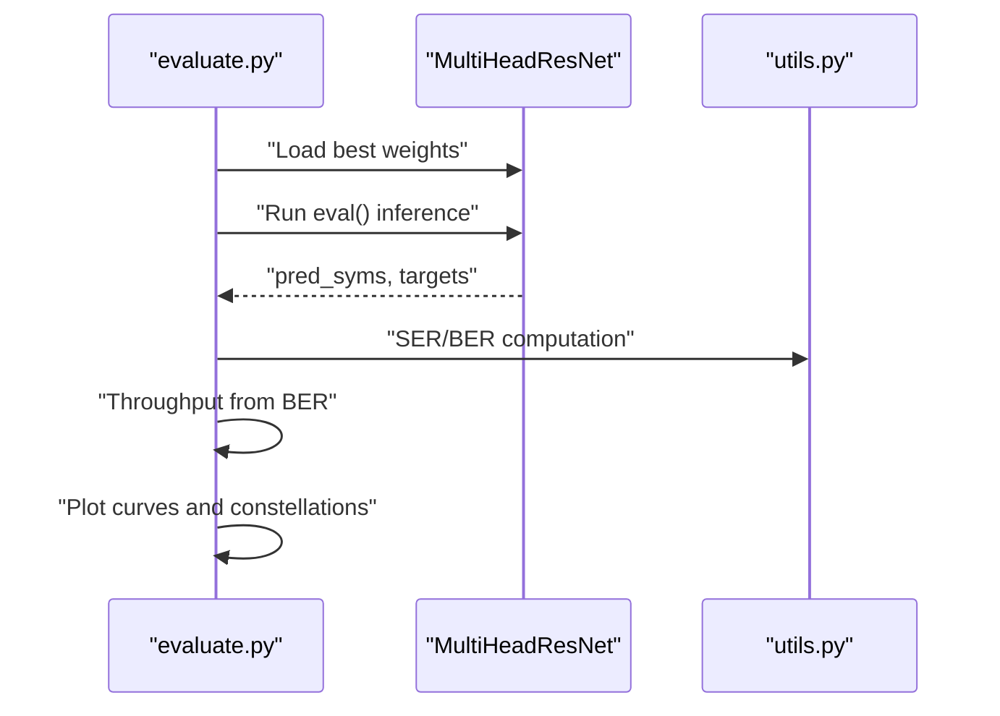
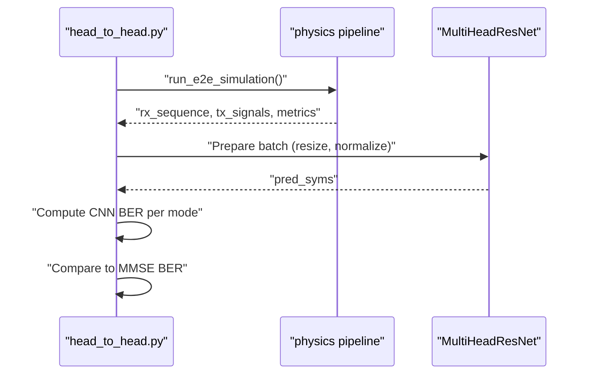
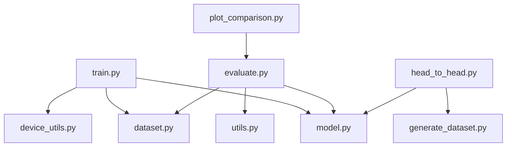

# Training and Evaluation

<cite>
**Referenced Files in This Document**
- [README.md](file://README.md)
- [train.py](file://models/CNN Trials/src/training/train.py)
- [device_utils.py](file://models/CNN Trials/src/utils/device_utils.py)
- [model.py](file://models/CNN Trials/src/models/model.py)
- [dataset.py](file://models/CNN Trials/src/utils/dataset.py)
- [evaluate.py](file://models/CNN Trials/src/evaluation/evaluate.py)
- [head_to_head.py](file://models/CNN Trials/src/evaluation/head_to_head.py)
- [plot_comparison.py](file://models/CNN Trials/src/evaluation/plot_comparison.py)
- [resnet.py](file://models/CNN Trials/src/models/resnet.py)
- [resnet_cbam.py](file://models/CNN Trials/src/models/resnet_cbam.py)
- [utils.py](file://models/CNN Trials/src/utils/utils.py)
- [generate_dataset.py](file://models/CNN Trials/data/generators/generate_dataset.py)
- [config.json](file://models/CNN Trials/data/configs/config.json)
- [inspect_h5.py](file://models/CNN Trials/data/generators/inspect_h5.py)
- [Throughput Analysis.md](file://models/CNN Trials/outputs/reports/Throughput_Analysis.md)
</cite>

## Table of Contents
1. [Introduction](#introduction)
2. [Project Structure](#project-structure)
3. [Core Components](#core-components)
4. [Architecture Overview](#architecture-overview)
5. [Detailed Component Analysis](#detailed-component-analysis)
6. [Dependency Analysis](#dependency-analysis)
7. [Performance Considerations](#performance-considerations)
8. [Troubleshooting Guide](#troubleshooting-guide)
9. [Conclusion](#conclusion)
10. [Appendices](#appendices)

## Introduction
This document explains the training and evaluation system for a machine learning pipeline designed to recover QPSK-modulated spatial modes in free-space optical (FSO) communication under atmospheric turbulence. It covers:
- Automatic device detection and optimization
- Multi-head loss functions and training loop
- Validation strategies and checkpoint management
- Evaluation metrics (SER, BER), throughput analysis, constellation diagnostics, and visualization
- Examples of training configuration, hyperparameter tuning, and benchmarking against classical receivers
- Monitoring, troubleshooting, and interpreting results across model architectures

## Project Structure
The training and evaluation system resides primarily under models/CNN Trials/src. The most relevant folders and files are:
- Training: src/training/train.py
- Models: src/models/model.py, src/models/resnet.py, src/models/resnet_cbam.py
- Data: src/utils/dataset.py, data/generators/generate_dataset.py, data/configs/config.json
- Evaluation: src/evaluation/evaluate.py, src/evaluation/head_to_head.py, src/evaluation/plot_comparison.py
- Utilities: src/utils/device_utils.py, src/utils/utils.py
- Reports: outputs/reports/Throughput_Analysis.md

**Diagram sources**
- [train.py](file://models/CNN Trials/src/training/train.py#L1-L150)
- [device_utils.py](file://models/CNN Trials/src/utils/device_utils.py#L1-L217)
- [model.py](file://models/CNN Trials/src/models/model.py#L1-L81)
- [resnet.py](file://models/CNN Trials/src/models/resnet.py#L1-L218)
- [resnet_cbam.py](file://models/CNN Trials/src/models/resnet_cbam.py#L1-L112)
- [dataset.py](file://models/CNN Trials/src/utils/dataset.py#L1-L44)
- [generate_dataset.py](file://models/CNN Trials/data/generators/generate_dataset.py#L1-L598)
- [config.json](file://models/CNN Trials/data/configs/config.json#L1-L136)
- [evaluate.py](file://models/CNN Trials/src/evaluation/evaluate.py#L1-L315)
- [head_to_head.py](file://models/CNN Trials/src/evaluation/head_to_head.py#L1-L158)
- [plot_comparison.py](file://models/CNN Trials/src/evaluation/plot_comparison.py#L1-L84)
- [utils.py](file://models/CNN Trials/src/utils/utils.py#L1-L318)
- [Throughput Analysis.md](file://models/CNN Trials/outputs/reports/Throughput_Analysis.md#L1-L55)

**Section sources**
- [README.md](file://README.md#L311-L350)

## Core Components
- Multi-Head ResNet model with a ResNet-18 backbone and optional CBAM attention module. Two heads:
  - Symbol head: predicts real and imaginary parts of QPSK symbols for each mode
  - Power head: auxiliary task predicting mode power presence
- Dataset wrapper that loads HDF5 data and exposes intensity images and targets
- Training loop with weighted multi-task loss, validation, LR scheduling, and checkpointing
- Evaluation suite computing SER, BER, throughput, constellation plots, and breakdowns by turbulence strength
- Head-to-head benchmarking against classical MMSE receiver via physics simulations
- Utilities for device selection, normalization, and constellation visualization

**Section sources**
- [model.py](file://models/CNN Trials/src/models/model.py#L6-L71)
- [dataset.py](file://models/CNN Trials/src/utils/dataset.py#L6-L43)
- [train.py](file://models/CNN Trials/src/training/train.py#L16-L136)
- [evaluate.py](file://models/CNN Trials/src/evaluation/evaluate.py#L80-L305)
- [head_to_head.py](file://models/CNN Trials/src/evaluation/head_to_head.py#L51-L137)
- [utils.py](file://models/CNN Trials/src/utils/utils.py#L16-L287)

## Architecture Overview
The system comprises:
- Data generation pipeline producing HDF5 datasets with intensity images and QPSK symbol targets
- Training pipeline with automatic device detection, multi-head loss, and validation
- Evaluation pipeline computing SER/BER, throughput, and diagnostic plots
- Benchmarking against classical MMSE receiver using physics-based simulations

**Diagram sources**
- [generate_dataset.py](file://models/CNN Trials/data/generators/generate_dataset.py#L408-L528)
- [train.py](file://models/CNN Trials/src/training/train.py#L16-L136)
- [model.py](file://models/CNN Trials/src/models/model.py#L18-L71)
- [evaluate.py](file://models/CNN Trials/src/evaluation/evaluate.py#L80-L305)

## Detailed Component Analysis

### Training Loop Implementation
- Automatic device detection selects CUDA, MPS, or CPU with verbose system info
- Data loaders wrap FSODataset for train/val splits
- Model supports backbone selection: resnet18 or resnet18_cbam
- Multi-head loss:
  - Symbol head MSE loss on complex symbol targets
  - Power head binary loss on mode power presence
  - Weighted combination with a fixed coefficient
- Optimizer and scheduler:
  - Adam optimizer with configurable learning rate
  - ReduceLROnPlateau on validation loss
- Checkpointing:
  - Saves last model checkpoint after each epoch
  - Keeps best model based on validation loss
  - Supports resume from last checkpoint

**Diagram sources**
- [train.py](file://models/CNN Trials/src/training/train.py#L63-L124)

**Section sources**
- [train.py](file://models/CNN Trials/src/training/train.py#L16-L136)
- [device_utils.py](file://models/CNN Trials/src/utils/device_utils.py#L15-L46)

### Multi-Head Model Architecture
- Backbone: ResNet-18 (ImageNet pretrained) or ResNet-18 with CBAM
- First layer adapted for single-channel input (intensity)
- Two heads:
  - Symbol head: maps backbone features to [batch, n_modes, 2] via linear layers
  - Power head: maps features to [batch, n_modes] with sigmoid for power presence
- Forward pass returns both symbol predictions and power predictions

**Diagram sources**
- [model.py](file://models/CNN Trials/src/models/model.py#L18-L71)
- [resnet.py](file://models/CNN Trials/src/models/resnet.py#L47-L171)
- [resnet_cbam.py](file://models/CNN Trials/src/models/resnet_cbam.py#L51-L112)

**Section sources**
- [model.py](file://models/CNN Trials/src/models/model.py#L6-L71)
- [resnet.py](file://models/CNN Trials/src/models/resnet.py#L47-L171)
- [resnet_cbam.py](file://models/CNN Trials/src/models/resnet_cbam.py#L51-L112)

### Dataset and Data Generation
- FSODataset loads HDF5 with keys: intensity, symbols, cn2; expands channel dimension; exposes n_modes
- DatasetGenerator creates datasets using physics-based simulation (Split-Step Fourier), smart cropping, downsampling, and optional noise augmentation
- Config controls system parameters, turbulence regimes, grid sizes, and output format

**Diagram sources**
- [config.json](file://models/CNN Trials/data/configs/config.json#L1-L136)
- [generate_dataset.py](file://models/CNN Trials/data/generators/generate_dataset.py#L408-L528)
- [dataset.py](file://models/CNN Trials/src/utils/dataset.py#L6-L43)

**Section sources**
- [dataset.py](file://models/CNN Trials/src/utils/dataset.py#L6-L43)
- [generate_dataset.py](file://models/CNN Trials/data/generators/generate_dataset.py#L1-L598)
- [config.json](file://models/CNN Trials/data/configs/config.json#L1-L136)

### Evaluation Metrics and Visualization
- SER and BER computed from predicted vs. target complex symbols using sign-based decision
- Throughput derived from BER with LDPC-aware model, including pilot overhead and FEC threshold
- Diagnostic statistics: mean magnitude, phase bias, and jitter
- Plots: BER vs. Cn2, throughput vs. Cn2, combined dual-y-axis plot, constellation scatter
- Utility functions for QPSK mapping, LLR computation, and constellation visualization

**Diagram sources**
- [evaluate.py](file://models/CNN Trials/src/evaluation/evaluate.py#L80-L305)
- [utils.py](file://models/CNN Trials/src/utils/utils.py#L117-L254)

**Section sources**
- [evaluate.py](file://models/CNN Trials/src/evaluation/evaluate.py#L12-L315)
- [utils.py](file://models/CNN Trials/src/utils/utils.py#L16-L287)

### Head-to-Head Benchmarking Against Classical MMSE
- Runs physics-based end-to-end simulation to obtain MMSE baseline BER
- Feeds RX sequences through CNN for symbol recovery
- Computes CNN BER per mode and compares to MMSE
- Aggregates across frames and reports status (tie, CNN win, MMSE win)

**Diagram sources**
- [head_to_head.py](file://models/CNN Trials/src/evaluation/head_to_head.py#L51-L137)

**Section sources**
- [head_to_head.py](file://models/CNN Trials/src/evaluation/head_to_head.py#L1-L158)

### Visualization and Reporting Tools
- Comparison plot generator overlays MMSE baseline and DL curves
- Throughput report documents corrected peak throughput and regimes
- Dataset inspection utility validates shapes, ranges, and saves sample images

**Section sources**
- [plot_comparison.py](file://models/CNN Trials/src/evaluation/plot_comparison.py#L6-L84)
- [Throughput Analysis.md](file://models/CNN Trials/outputs/reports/Throughput_Analysis.md#L1-L55)
- [inspect_h5.py](file://models/CNN Trials/data/generators/inspect_h5.py#L1-L47)

## Dependency Analysis
- Training depends on:
  - Model definition (MultiHeadResNet)
  - Dataset loader (FSODataset)
  - Device utilities (automatic device selection and optimization)
- Evaluation depends on:
  - Model weights (best checkpoint)
  - Dataset loader
  - Utility functions for SER/BER and visualization
- Benchmarking depends on:
  - Physics simulation pipeline
  - Dataset generator for data generation

**Diagram sources**
- [train.py](file://models/CNN Trials/src/training/train.py#L12-L14)
- [model.py](file://models/CNN Trials/src/models/model.py#L1-L81)
- [dataset.py](file://models/CNN Trials/src/utils/dataset.py#L1-L44)
- [device_utils.py](file://models/CNN Trials/src/utils/device_utils.py#L1-L217)
- [evaluate.py](file://models/CNN Trials/src/evaluation/evaluate.py#L9-L10)
- [utils.py](file://models/CNN Trials/src/utils/utils.py#L1-L318)
- [head_to_head.py](file://models/CNN Trials/src/evaluation/head_to_head.py#L25-L14)
- [generate_dataset.py](file://models/CNN Trials/data/generators/generate_dataset.py#L1-L598)
- [plot_comparison.py](file://models/CNN Trials/src/evaluation/plot_comparison.py#L1-L84)

**Section sources**
- [train.py](file://models/CNN Trials/src/training/train.py#L12-L14)
- [evaluate.py](file://models/CNN Trials/src/evaluation/evaluate.py#L9-L10)
- [head_to_head.py](file://models/CNN Trials/src/evaluation/head_to_head.py#L12-L14)

## Performance Considerations
- Device selection and optimization:
  - Prefer CUDA for fastest training/inference; fallback to MPS or CPU
  - cuDNN benchmark enabled for CUDA; MPS memory sharing requires conservative settings
- Batch size and workers:
  - Optimal batch size depends on GPU/MPSCPU memory; adjust automatically
  - Workers tuned per device to balance data loading and computation bottlenecks
- Throughput ceilings:
  - Both classical MMSE and neural receiver share the same physical-layer overhead
  - Neural receiver improves reliability and link availability, not peak throughput
- Model complexity:
  - CBAM adds minimal overhead but significantly improves performance in strong turbulence

[No sources needed since this section provides general guidance]

## Troubleshooting Guide
Common training issues and remedies:
- Device not detected or slow performance:
  - Verify CUDA/MPS availability and driver support
  - Use device info and recommended settings printed by device utilities
- Out-of-memory errors:
  - Reduce batch size or switch to CPU
  - Clear caches and garbage collect between runs
- Training stalls or low throughput:
  - Increase number of workers for data loading
  - Inspect dataset shapes and ranges using the inspection utility
- Poor convergence or oscillating loss:
  - Lower learning rate or adjust scheduler patience
  - Check for NaNs in dataset using inspection utility
- Evaluation artifacts:
  - Confirm model weights path matches backbone choice
  - Ensure test dataset order is preserved for metadata grouping

**Section sources**
- [device_utils.py](file://models/CNN Trials/src/utils/device_utils.py#L15-L46)
- [device_utils.py](file://models/CNN Trials/src/utils/device_utils.py#L106-L167)
- [inspect_h5.py](file://models/CNN Trials/data/generators/inspect_h5.py#L27-L31)
- [evaluate.py](file://models/CNN Trials/src/evaluation/evaluate.py#L88-L93)

## Conclusion
The training and evaluation system provides a robust pipeline for learning spatial-mode symbol recovery from intensity-only measurements under atmospheric turbulence. It combines automatic device optimization, multi-head supervision, and comprehensive evaluation with SER/BER, throughput, and constellation diagnostics. Benchmarking against classical MMSE demonstrates significant resilience improvements, particularly in moderate to strong turbulence, while maintaining peak throughput parity.

[No sources needed since this section summarizes without analyzing specific files]

## Appendices

### A. Training Configuration Examples
- Minimal quick-start training:
  - Use small dataset name and short epochs for testing
  - Example invocation path: models/CNN Trials/src/training/train.py
- Resume training:
  - Use the resume flag to load last checkpoint and continue training
- Backbone selection:
  - Choose resnet18 or resnet18_cbam depending on desired complexity and performance

**Section sources**
- [README.md](file://README.md#L95-L100)
- [train.py](file://models/CNN Trials/src/training/train.py#L138-L149)

### B. Hyperparameter Optimization Tips
- Learning rate scheduling:
  - Monitor validation loss and adjust patience/factor for ReduceLROnPlateau
- Loss weighting:
  - Tune the power head weight (fixed 0.1) to balance symbol and power tasks
- Batch size and workers:
  - Start with recommended values from device utilities; adjust based on memory and throughput
- Data augmentation:
  - Enable noise and transformations during dataset generation for robustness

**Section sources**
- [train.py](file://models/CNN Trials/src/training/train.py#L30-L34)
- [device_utils.py](file://models/CNN Trials/src/utils/device_utils.py#L106-L167)
- [config.json](file://models/CNN Trials/data/configs/config.json#L120-L126)

### C. Performance Benchmarking Against Classical Receivers
- Head-to-head evaluation:
  - Compare CNN BER to MMSE BER across Cn2 regimes
  - Aggregate over multiple frames to reduce variance
- Throughput analysis:
  - Use throughput thresholds and FEC limits to interpret practical performance
- Visualization:
  - Overlay curves and annotate regimes for clear interpretation

**Section sources**
- [head_to_head.py](file://models/CNN Trials/src/evaluation/head_to_head.py#L51-L137)
- [Throughput Analysis.md](file://models/CNN Trials/outputs/reports/Throughput_Analysis.md#L9-L21)
- [plot_comparison.py](file://models/CNN Trials/src/evaluation/plot_comparison.py#L6-L84)

### D. Interpreting Evaluation Results and Comparing Architectures
- SER vs. BER:
  - SER reflects symbol decisions; BER reflects bit-level accuracy
- Throughput:
  - Reflects practical delivery rate considering overheads and FEC
- Constellation analysis:
  - Visual inspection of recovered constellations helps diagnose phase and magnitude issues
- Architecture comparison:
  - Use comparison plots to assess CBAM vs. vanilla ResNet performance across regimes

**Section sources**
- [evaluate.py](file://models/CNN Trials/src/evaluation/evaluate.py#L117-L304)
- [plot_comparison.py](file://models/CNN Trials/src/evaluation/plot_comparison.py#L6-L84)
- [utils.py](file://models/CNN Trials/src/utils/utils.py#L212-L254)