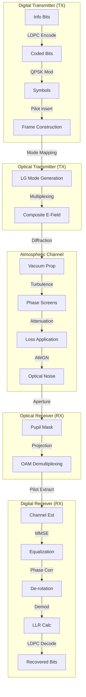

# Physics-Based Block Structure: FSO-OAM Pipeline

This document outlines the sequential signal processing and physical propagation steps in the FSO-OAM system, from the digital transmitter to the digital receiver.

## High-Level Signal Flow

---

## Detailed Physics & Math Breakdown

### 1. Digital Transmitter
*   **Input:** Information bits $\mathbf{u}$.
*   **Forward Error Correction (LDPC):** Adds redundancy to combat channel errors.
    *   $\mathbf{c} = \mathbf{u} \cdot \mathbf{G}$ (Generator Matrix)
*   **Modulation (QPSK):** Maps bits to complex symbols $s_m$.
    *   $s_m \in \{1+j, 1-j, -1+j, -1-j\} / \sqrt{2}$
*   **Pilot Insertion:** Inserts known symbols $p$ at specific indices for channel estimation.

### 2. Optical Transmitter
*   **Laguerre-Gaussian (LG) Modes:** The carrier waves carrying orbital angular momentum.
    *   Field distribution $\Psi_{p,l}(r, \phi, z)$ characterized by radial index $p$ and azimuthal index $l$.
    *   $\Psi_{p,l} \propto \exp(-il\phi)$ (OAM term).
*   **Multiplexing:** The transmitted optical field $E_{tx}$ is a coherent superposition of all active modes, weighted by their data symbols $s_m$.
    *   $$E_{tx}(r, \phi, z=0) = \sum_{m=1}^{M} s_m \cdot \Psi_{m}(r, \phi, 0)$$

### 3. Atmospheric Channel (Physics)
*   **Split-Step Propagation:** The beam propagates through discrete slabs of vacuum and phase screens.
    *   **Vacuum Step (Diffraction):** Solved in frequency domain using Angular Spectrum Method.
        *   $\tilde{E}(k_x, k_y, z+\Delta z) = \tilde{E}(k_x, k_y, z) \cdot \exp(i \Delta z \sqrt{k^2 - k_x^2 - k_y^2})$
    *   **Phase Screen (Turbulence):** Applies a random phase delay $\theta(x,y)$ representing refractive index fluctuations.
        *   $E(x,y,z^+) = E(x,y,z^-) \cdot \exp(i \theta(x,y))$
        *   $\theta(x,y)$ generated via Kolmogorov spectrum (Von Karman model).
*   **Attenuation:**
    *   **Atmospheric:** Beer-Lambert law ($L_{atm}$).
    *   **Geometric:** Beam divergence causing power to spill outside the receiver aperture ($L_{geo}$).
    *   $E_{rx\_ideal} = E_{turbulent} \cdot \alpha_{loss}$
*   **Noise:**
    *   Modeled as complex Additive White Gaussian Noise (AWGN) added to the field.
    *   $E_{rx\_noisy} = E_{rx\_ideal} + n(x,y)$, where $n \sim \mathcal{CN}(0, \sigma^2)$.

### 4. Optical Receiver
*   **Aperture Masking:** The receiver telescope has a finite pupil $A(r, \phi)$.
    *   $E_{rx\_final} = E_{rx\_noisy} \cdot A(r, \phi)$
*   **OAM Demultiplexing (Projection):** To recover the symbol for mode $n$, we project the received field onto the conjugate of the expected mode $\Psi_n$. This exploits the orthogonality of OAM modes.
    *   $$y_n = \langle E_{rx\_final}, \Psi_n \rangle = \iint E_{rx\_final}(r,\phi) \cdot \Psi_n^*(r,\phi) \, r dr d\phi$$
    *   **Ideally:** $y_n = s_n$ (if no crosstalk/turbulence).
    *   **Reality:** $y_n = h_{nn} s_n + \sum_{m \neq n} h_{nm} s_m + n'$ (Signal + Crosstalk + Noise).

### 5. Digital Receiver
*   **Channel Estimation (LS):** Uses received pilots $y_p$ and known transmitted pilots $x_p$ to estimate the channel matrix $\mathbf{H}$.
    *   $\mathbf{Y}_p = \mathbf{H} \mathbf{X}_p \implies \hat{\mathbf{H}} = \mathbf{Y}_p \mathbf{X}_p^{\dagger}$
    *   $\mathbf{H}$ captures the coupling (crosstalk) between all pairs of modes.
*   **Equalization (MMSE):** Inverts the channel matrix to recover the symbol vector $\mathbf{s}$.
    *   $\mathbf{W}_{MMSE} = \hat{\mathbf{H}}^H (\hat{\mathbf{H}} \hat{\mathbf{H}}^H + \sigma^2 \mathbf{I})^{-1}$
    *   $\hat{\mathbf{s}} = \mathbf{W}_{MMSE} \cdot \mathbf{y}$
*   **Blind Phase Correction:** Removes residual "piston phase" (common phase rotation $\phi_{err}$ caused by turbulence).
    *   Estimates $\phi_{err}$ using 4th power of QPSK symbols (stripping modulation).
    *   $\hat{\mathbf{s}}_{corr} = \hat{\mathbf{s}} \cdot e^{-i \phi_{err}}$
*   **Demodulation & Decoding:**
    *   Calculates Log-Likelihood Ratios (LLRs) from $\hat{\mathbf{s}}_{corr}$.
    *   LDPC decoder uses Belief Propagation to correct bit errors.
